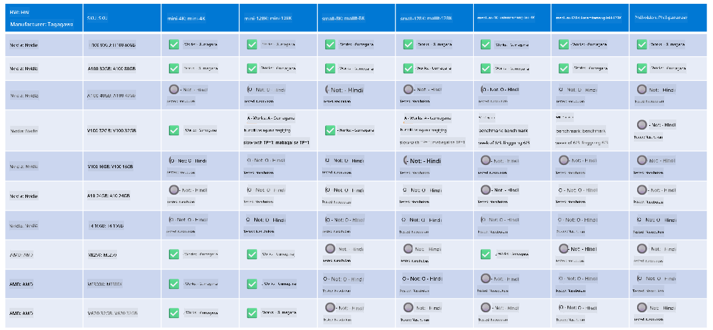

<!--
CO_OP_TRANSLATOR_METADATA:
{
  "original_hash": "8cdc17ce0f10535da30b53d23fe1a795",
  "translation_date": "2025-07-16T18:26:31+00:00",
  "source_file": "md/01.Introduction/01/01.Hardwaresupport.md",
  "language_code": "tl"
}
-->
# Suporta sa Phi Hardware

Ang Microsoft Phi ay na-optimize para sa ONNX Runtime at sumusuporta sa Windows DirectML. Gumagana ito nang maayos sa iba't ibang uri ng hardware, kabilang ang mga GPU, CPU, at maging mga mobile device.

## Device Hardware  
Partikular, ang mga suportadong hardware ay kinabibilangan ng:

- GPU SKU: RTX 4090 (DirectML)
- GPU SKU: 1 A100 80GB (CUDA)
- CPU SKU: Standard F64s v2 (64 vCPUs, 128 GiB memory)

## Mobile SKU

- Android - Samsung Galaxy S21
- Apple iPhone 14 pataas na may A16/A17 Processor

## Espesipikasyon ng Phi Hardware

- Minimum na Kinakailangang Konfigurasyon.
- Windows: GPU na may kakayahang DirectX 12 at hindi bababa sa 4GB na pinagsamang RAM

CUDA: NVIDIA GPU na may Compute Capability >= 7.02



## Pagpapatakbo ng onnxruntime sa maraming GPU

Sa kasalukuyan, ang mga Phi ONNX model na available ay para lamang sa 1 GPU. Posible ang suporta para sa multi-gpu para sa Phi model, ngunit ang ORT na may 2 gpu ay hindi garantisadong magbibigay ng mas mataas na throughput kumpara sa 2 instance ng ort. Mangyaring tingnan ang [ONNX Runtime](https://onnxruntime.ai/) para sa mga pinakabagong update.

Sa [Build 2024, ang GenAI ONNX Team](https://youtu.be/WLW4SE8M9i8?si=EtG04UwDvcjunyfC) ay inanunsyo na pinagana na nila ang multi-instance sa halip na multi-gpu para sa mga Phi model.

Sa kasalukuyan, pinapayagan ka nitong patakbuhin ang isang onnxruntime o onnxruntime-genai instance gamit ang CUDA_VISIBLE_DEVICES environment variable tulad nito.

```Python
CUDA_VISIBLE_DEVICES=0 python infer.py
CUDA_VISIBLE_DEVICES=1 python infer.py
```

Malayang tuklasin pa ang Phi sa [Azure AI Foundry](https://ai.azure.com)

**Paalala**:  
Ang dokumentong ito ay isinalin gamit ang AI translation service na [Co-op Translator](https://github.com/Azure/co-op-translator). Bagamat nagsusumikap kami para sa katumpakan, pakatandaan na ang mga awtomatikong pagsasalin ay maaaring maglaman ng mga pagkakamali o di-tumpak na impormasyon. Ang orihinal na dokumento sa orihinal nitong wika ang dapat ituring na pangunahing sanggunian. Para sa mahahalagang impormasyon, inirerekomenda ang propesyonal na pagsasalin ng tao. Hindi kami mananagot sa anumang hindi pagkakaunawaan o maling interpretasyon na maaaring magmula sa paggamit ng pagsasaling ito.