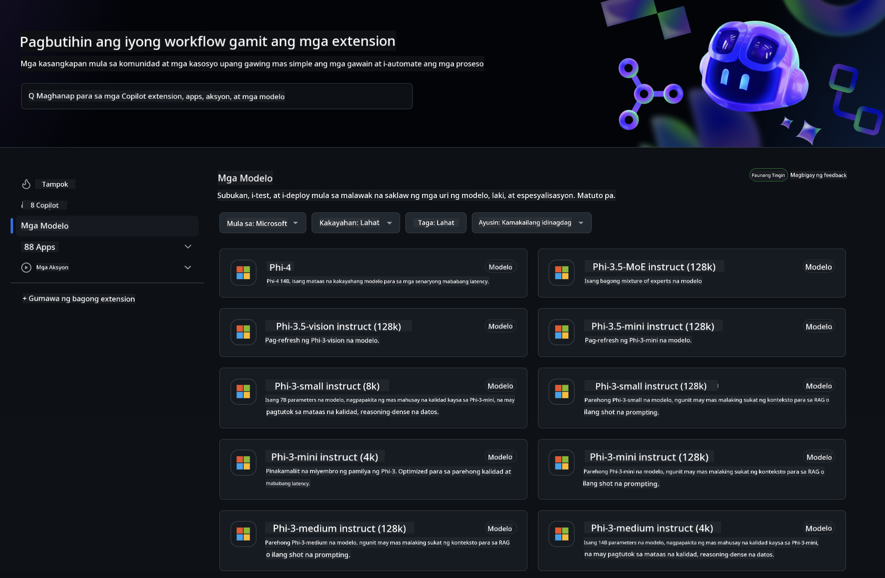
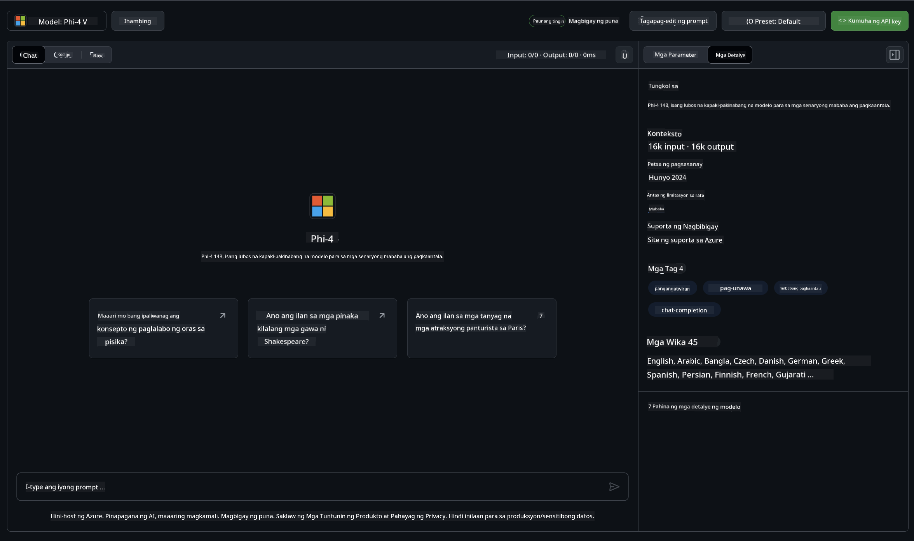
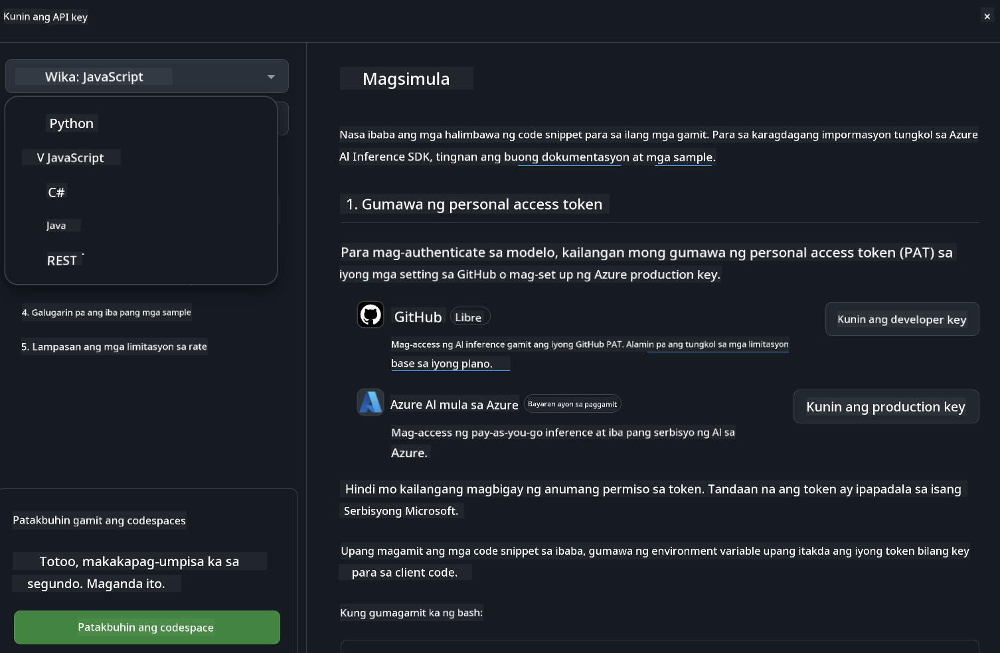
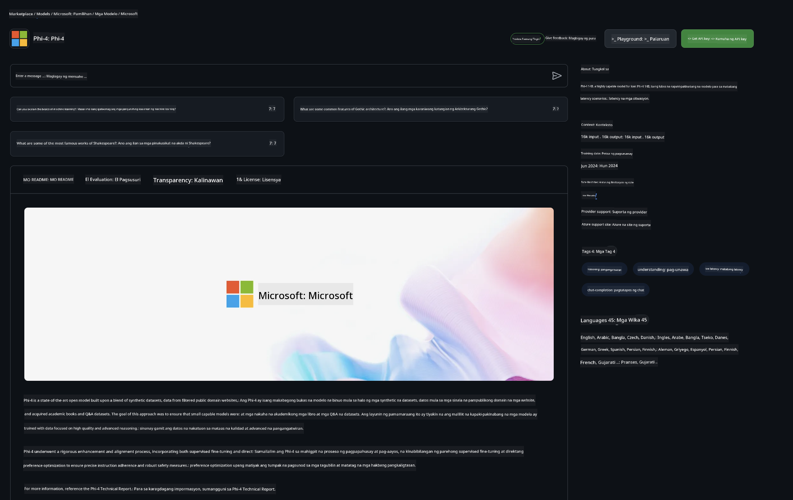

<!--
CO_OP_TRANSLATOR_METADATA:
{
  "original_hash": "fb67a08b9fc911a10ed58081fadef416",
  "translation_date": "2025-05-09T08:56:26+00:00",
  "source_file": "md/01.Introduction/02/02.GitHubModel.md",
  "language_code": "tl"
}
-->
## Phi Family sa GitHub Models

Maligayang pagdating sa [GitHub Models](https://github.com/marketplace/models)! Handa na ang lahat para sa iyong pagsasaliksik ng AI Models na naka-host sa Azure AI.



Para sa karagdagang impormasyon tungkol sa mga Models na available sa GitHub Models, tingnan ang [GitHub Model Marketplace](https://github.com/marketplace/models)

## Mga Available na Models

Bawat modelo ay may kanya-kanyang playground at sample code



### Phi Family sa GitHub Model Catalog

- [Phi-4](https://github.com/marketplace/models/azureml/Phi-4)

- [Phi-3.5-MoE instruct (128k)](https://github.com/marketplace/models/azureml/Phi-3-5-MoE-instruct)

- [Phi-3.5-vision instruct (128k)](https://github.com/marketplace/models/azureml/Phi-3-5-vision-instruct)

- [Phi-3.5-mini instruct (128k)](https://github.com/marketplace/models/azureml/Phi-3-5-mini-instruct)

- [Phi-3-Medium-128k-Instruct](https://github.com/marketplace/models/azureml/Phi-3-medium-128k-instruct)

- [Phi-3-medium-4k-instruct](https://github.com/marketplace/models/azureml/Phi-3-medium-4k-instruct)

- [Phi-3-mini-128k-instruct](https://github.com/marketplace/models/azureml/Phi-3-mini-128k-instruct)

- [Phi-3-mini-4k-instruct](https://github.com/marketplace/models/azureml/Phi-3-mini-4k-instruct)

- [Phi-3-small-128k-instruct](https://github.com/marketplace/models/azureml/Phi-3-small-128k-instruct)

- [Phi-3-small-8k-instruct](https://github.com/marketplace/models/azureml/Phi-3-small-8k-instruct)

## Pagsisimula

May ilang pangunahing halimbawa na handa nang patakbuhin. Makikita mo ang mga ito sa samples directory. Kung gusto mong diretso sa paborito mong wika, makikita mo ang mga halimbawa sa mga sumusunod na Wika:

- Python
- JavaScript
- C#
- Java
- cURL

Mayroon ding dedikadong Codespaces Environment para sa pagpapatakbo ng mga samples at models.




## Sample Code

Nasa ibaba ang mga halimbawa ng code snippets para sa ilang mga gamit. Para sa karagdagang impormasyon tungkol sa Azure AI Inference SDK, tingnan ang buong dokumentasyon at mga sample.

## Setup

1. Gumawa ng personal access token  
Hindi mo kailangang magbigay ng anumang pahintulot sa token. Tandaan na ang token ay ipapadala sa isang Microsoft service.

Para magamit ang mga code snippet sa ibaba, gumawa ng environment variable para itakda ang iyong token bilang key para sa client code.

Kung gumagamit ka ng bash:  
```
export GITHUB_TOKEN="<your-github-token-goes-here>"
```  
Kung nasa powershell ka:  

```
$Env:GITHUB_TOKEN="<your-github-token-goes-here>"
```  

Kung gumagamit ka ng Windows command prompt:  

```
set GITHUB_TOKEN=<your-github-token-goes-here>
```  

## Python Sample

### I-install ang mga dependencies  
I-install ang Azure AI Inference SDK gamit ang pip (Kinakailangan: Python >=3.8):

```
pip install azure-ai-inference
```  
### Patakbuhin ang isang simpleng halimbawa ng code

Ipinapakita ng sample na ito ang isang basic na tawag sa chat completion API. Ginagamit nito ang GitHub AI model inference endpoint at ang iyong GitHub token. Ang tawag ay synchronous.

```python
import os
from azure.ai.inference import ChatCompletionsClient
from azure.ai.inference.models import SystemMessage, UserMessage
from azure.core.credentials import AzureKeyCredential

endpoint = "https://models.inference.ai.azure.com"
model_name = "Phi-4"
token = os.environ["GITHUB_TOKEN"]

client = ChatCompletionsClient(
    endpoint=endpoint,
    credential=AzureKeyCredential(token),
)

response = client.complete(
    messages=[
        UserMessage(content="I have $20,000 in my savings account, where I receive a 4% profit per year and payments twice a year. Can you please tell me how long it will take for me to become a millionaire? Also, can you please explain the math step by step as if you were explaining it to an uneducated person?"),
    ],
    temperature=0.4,
    top_p=1.0,
    max_tokens=2048,
    model=model_name
)

print(response.choices[0].message.content)
```

### Patakbuhin ang multi-turn na pag-uusap

Ipinapakita ng sample na ito ang multi-turn na pag-uusap gamit ang chat completion API. Kapag ginagamit ang modelo para sa chat application, kailangan mong pamahalaan ang history ng pag-uusap at ipadala ang pinakabagong mga mensahe sa modelo.

```
import os
from azure.ai.inference import ChatCompletionsClient
from azure.ai.inference.models import AssistantMessage, SystemMessage, UserMessage
from azure.core.credentials import AzureKeyCredential

token = os.environ["GITHUB_TOKEN"]
endpoint = "https://models.inference.ai.azure.com"
# Replace Model_Name
model_name = "Phi-4"

client = ChatCompletionsClient(
    endpoint=endpoint,
    credential=AzureKeyCredential(token),
)

messages = [
    SystemMessage(content="You are a helpful assistant."),
    UserMessage(content="What is the capital of France?"),
    AssistantMessage(content="The capital of France is Paris."),
    UserMessage(content="What about Spain?"),
]

response = client.complete(messages=messages, model=model_name)

print(response.choices[0].message.content)
```

### I-stream ang output

Para sa mas magandang karanasan ng user, gusto mong i-stream ang tugon ng modelo upang lumabas agad ang unang token at maiwasan ang paghihintay ng matagal para sa mga mahahabang sagot.

```
import os
from azure.ai.inference import ChatCompletionsClient
from azure.ai.inference.models import SystemMessage, UserMessage
from azure.core.credentials import AzureKeyCredential

token = os.environ["GITHUB_TOKEN"]
endpoint = "https://models.inference.ai.azure.com"
# Replace Model_Name
model_name = "Phi-4"

client = ChatCompletionsClient(
    endpoint=endpoint,
    credential=AzureKeyCredential(token),
)

response = client.complete(
    stream=True,
    messages=[
        SystemMessage(content="You are a helpful assistant."),
        UserMessage(content="Give me 5 good reasons why I should exercise every day."),
    ],
    model=model_name,
)

for update in response:
    if update.choices:
        print(update.choices[0].delta.content or "", end="")

client.close()
```

## LIBRENG Paggamit at Rate limits para sa GitHub Models



Ang [rate limits para sa playground at libreng API usage](https://docs.github.com/en/github-models/prototyping-with-ai-models#rate-limits) ay nilayon para matulungan kang mag-eksperimento sa mga modelo at gumawa ng prototype ng iyong AI application. Para sa paggamit na lampas sa mga limitasyong iyon, at para mapalawak ang iyong aplikasyon, kailangan mong mag-provision ng resources mula sa Azure account, at mag-authenticate mula doon sa halip na gamit ang iyong GitHub personal access token. Hindi mo kailangang baguhin ang iba pang bahagi ng iyong code. Gamitin ang link na ito para malaman kung paano lumampas sa free tier limits sa Azure AI.


### Paalala

Tandaan na kapag nakikipag-ugnayan ka sa isang modelo, nag-eeksperimento ka sa AI, kaya posibleng may mga pagkakamali sa nilalaman.

Ang feature ay may iba't ibang limitasyon (kabilang ang requests per minute, requests per day, tokens per request, at concurrent requests) at hindi ito disenyo para sa production use cases.

Gumagamit ang GitHub Models ng Azure AI Content Safety. Hindi maaaring patayin ang mga filter na ito bilang bahagi ng karanasan sa GitHub Models. Kung pipiliin mong gamitin ang mga modelo sa pamamagitan ng isang paid service, i-configure ang iyong content filters ayon sa iyong mga pangangailangan.

Ang serbisyong ito ay sakop ng GitHub’s Pre-release Terms.

**Paalala**:  
Ang dokumentong ito ay isinalin gamit ang AI translation service na [Co-op Translator](https://github.com/Azure/co-op-translator). Bagamat nagsusumikap kami na maging tumpak, pakatandaan na ang awtomatikong pagsasalin ay maaaring maglaman ng mga pagkakamali o di-tumpak na impormasyon. Ang orihinal na dokumento sa orihinal nitong wika ang dapat ituring na pangunahing sanggunian. Para sa mahahalagang impormasyon, inirerekomenda ang propesyonal na pagsasalin ng tao. Hindi kami mananagot sa anumang hindi pagkakaunawaan o maling interpretasyon na nagmula sa paggamit ng pagsasaling ito.