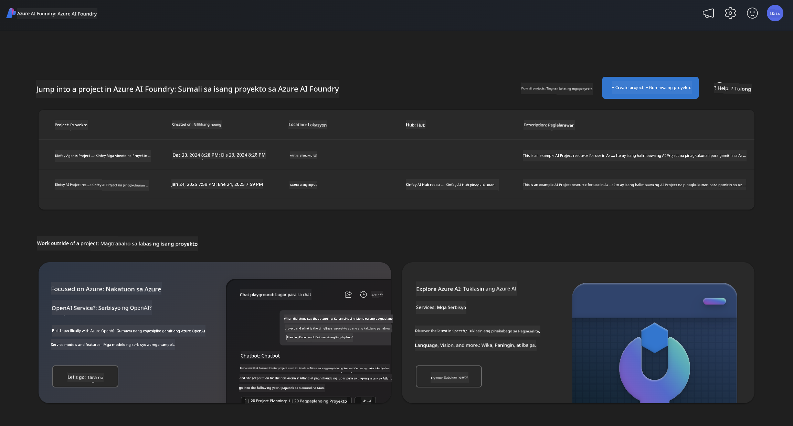
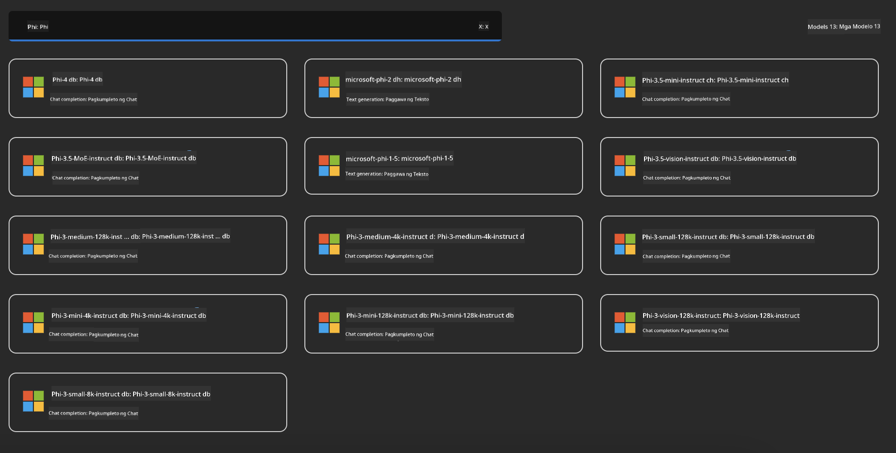
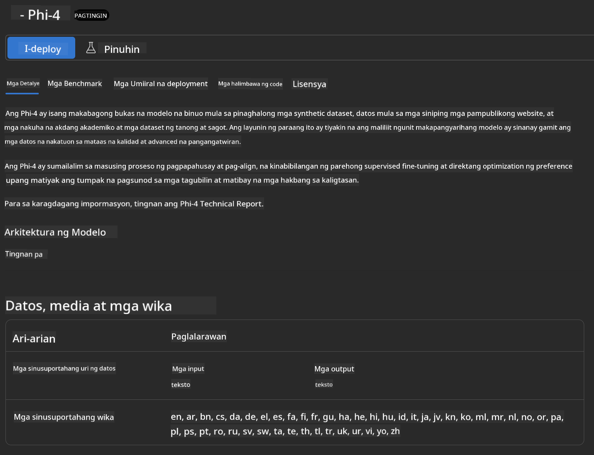
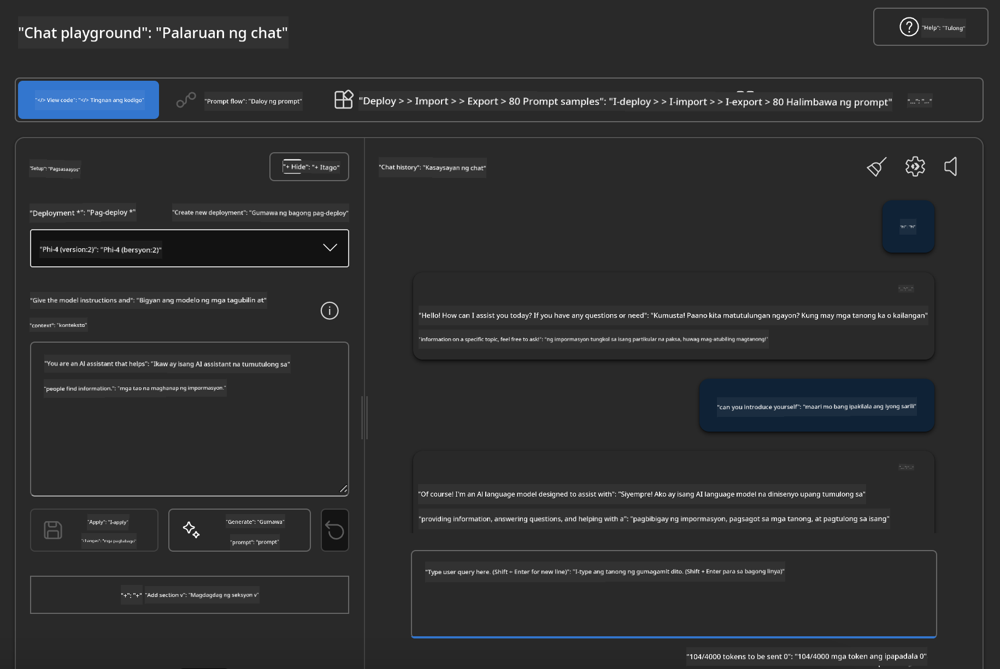

<!--
CO_OP_TRANSLATOR_METADATA:
{
  "original_hash": "3ae21dc5554e888defbe57946ee995ee",
  "translation_date": "2025-05-09T09:08:15+00:00",
  "source_file": "md/01.Introduction/02/03.AzureAIFoundry.md",
  "language_code": "tl"
}
-->
## Phi Family sa Azure AI Foundry

Ang [Azure AI Foundry](https://ai.azure.com) ay isang pinagkakatiwalaang plataporma na nagbibigay kapangyarihan sa mga developer upang magdala ng inobasyon at hubugin ang hinaharap gamit ang AI sa ligtas, segurado, at responsableng paraan.

Ang [Azure AI Foundry](https://ai.azure.com) ay ginawa para sa mga developer upang:

- Gumawa ng generative AI applications sa isang enterprise-grade na plataporma.
- Mag-explore, bumuo, mag-test, at mag-deploy gamit ang mga pinakabagong AI tools at ML models, na nakabase sa responsableng AI practices.
- Makipagtulungan sa isang team para sa buong life-cycle ng pag-develop ng application.

Sa Azure AI Foundry, maaari kang mag-explore ng iba't ibang modelo, serbisyo, at kakayahan, at makapagsimula ng paggawa ng AI applications na pinakaangkop sa iyong mga layunin. Pinapadali ng Azure AI Foundry platform ang scalability para gawing production-ready ang mga proof of concepts nang madali. Ang tuloy-tuloy na pagmamanman at pag-aayos ay sumusuporta sa pangmatagalang tagumpay.



Bukod sa paggamit ng Azure AOAI Service sa Azure AI Foundry, maaari ka ring gumamit ng third-party models sa Azure AI Foundry Model Catalog. Magandang pagpipilian ito kung gusto mong gamitin ang Azure AI Foundry bilang iyong AI solution platform.

Mabilis nating maide-deploy ang Phi Family Models sa pamamagitan ng Model Catalog sa Azure AI Foundry

[Microsoft Phi Models sa Azure AI Foundry Models](https://ai.azure.com/explore/models/?selectedCollection=phi)



### **I-deploy ang Phi-4 sa Azure AI Foundry**



### **Subukan ang Phi-4 sa Azure AI Foundry Playground**



### **Pagpapatakbo ng Python Code para tawagin ang Azure AI Foundry Phi-4**

```python

import os  
import base64
from openai import AzureOpenAI  
from azure.identity import DefaultAzureCredential, get_bearer_token_provider  
        
endpoint = os.getenv("ENDPOINT_URL", "Your Azure AOAI Service Endpoint")  
deployment = os.getenv("DEPLOYMENT_NAME", "Phi-4")  
      
token_provider = get_bearer_token_provider(  
    DefaultAzureCredential(),  
    "https://cognitiveservices.azure.com/.default"  
)  
  
client = AzureOpenAI(  
    azure_endpoint=endpoint,  
    azure_ad_token_provider=token_provider,  
    api_version="2024-05-01-preview",  
)  
  

chat_prompt = [
    {
        "role": "system",
        "content": "You are an AI assistant that helps people find information."
    },
    {
        "role": "user",
        "content": "can you introduce yourself"
    }
] 
    
# Include speech result if speech is enabled  
messages = chat_prompt 

completion = client.chat.completions.create(  
    model=deployment,  
    messages=messages,
    max_tokens=800,  
    temperature=0.7,  
    top_p=0.95,  
    frequency_penalty=0,  
    presence_penalty=0,
    stop=None,  
    stream=False  
)  
  
print(completion.to_json())  

```

**Paalala**:  
Ang dokumentong ito ay isinalin gamit ang AI translation service na [Co-op Translator](https://github.com/Azure/co-op-translator). Bagaman nagsusumikap kami para sa katumpakan, pakatandaan na ang awtomatikong pagsasalin ay maaaring maglaman ng mga pagkakamali o hindi tumpak na impormasyon. Ang orihinal na dokumento sa orihinal nitong wika ang dapat ituring na pangunahing sanggunian. Para sa mahahalagang impormasyon, inirerekomenda ang propesyonal na pagsasalin ng tao. Hindi kami mananagot sa anumang hindi pagkakaunawaan o maling interpretasyon na maaaring magmula sa paggamit ng pagsasaling ito.