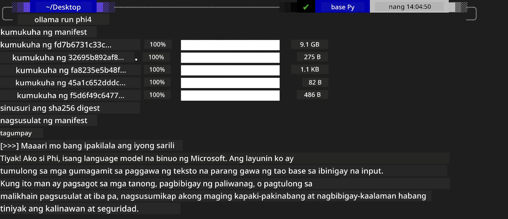
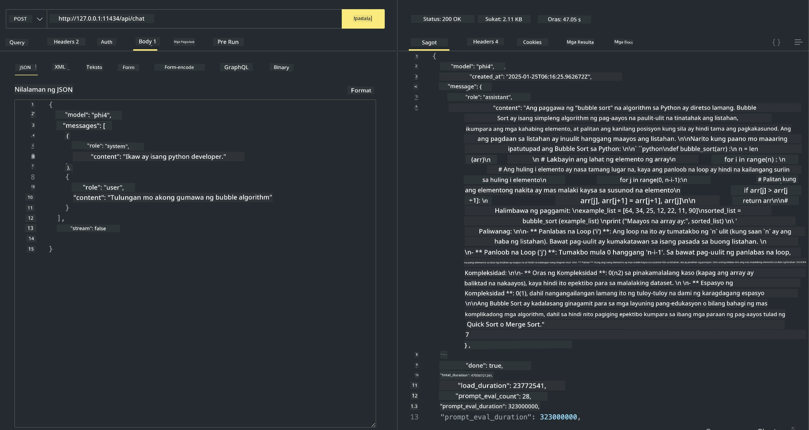

<!--
CO_OP_TRANSLATOR_METADATA:
{
  "original_hash": "2aa35f3c8b437fd5dc9995d53909d495",
  "translation_date": "2025-12-21T12:56:13+00:00",
  "source_file": "md/01.Introduction/02/04.Ollama.md",
  "language_code": "tl"
}
-->
## Phi Family sa Ollama


[Ollama](https://ollama.com) ay nagpapahintulot sa mas maraming tao na direktang mag-deploy ng open source LLM o SLM sa pamamagitan ng simpleng mga script, at maaari ring bumuo ng mga API upang tumulong sa mga lokal na Copilot application scenarios.

## **1. Pag-install**

Sinusuportahan ng Ollama ang pagtakbo sa Windows, macOS, at Linux. Maaari mong i-install ang Ollama sa pamamagitan ng link na ito ([https://ollama.com/download](https://ollama.com/download)). Pagkatapos ng matagumpay na pag-install, maaari mong direktang gamitin ang Ollama script upang tawagin ang Phi-3 sa pamamagitan ng isang terminal window. Makikita mo ang lahat ng [mga magagamit na library sa Ollama](https://ollama.com/library). Kung binuksan mo ang repositoryong ito sa isang Codespace, ito ay may Ollama nang naka-install na.

```bash

ollama run phi4

```

> [!NOTE]
> Ang modelo ay ida-download muna kapag pinatakbo mo ito sa unang pagkakataon. Siyempre, maaari mo ring direktang tukuyin ang na-download na Phi-4 na modelo. Ginagamit namin ang WSL bilang halimbawa sa pagpapatakbo ng utos. Pagkatapos matagumpay na ma-download ang modelo, maaari kang makipag-ugnayan nang diretso sa terminal.



## **2. Pagtawag sa phi-4 API mula sa Ollama**

Kung nais mong tawagin ang Phi-4 API na ginawa ng ollama, maaari mong gamitin ang utos na ito sa terminal upang simulan ang Ollama server.

```bash

ollama serve

```

> [!NOTE]
> Kung nagpapatakbo sa MacOS o Linux, pakitandaan na maaari mong makasalubong ang sumusunod na error **"Error: listen tcp 127.0.0.1:11434: bind: address already in use"** Maaaring lumabas ang error na ito kapag pinapatakbo ang utos. Maaari mong balewalain ang error na iyon, dahil karaniwang nangangahulugan ito na ang server ay tumatakbo na, o maaari mong itigil at i-restart ang Ollama:

**macOS**

```bash

brew services restart ollama

```

**Linux**

```bash

sudo systemctl stop ollama

```

Sinusuportahan ng Ollama ang dalawang API: generate at chat. Maaari mong tawagin ang model API na ibinigay ng Ollama ayon sa iyong pangangailangan, sa pamamagitan ng pagpapadala ng mga request sa lokal na serbisyong tumatakbo sa port 11434.

**Chat**

```bash

curl http://127.0.0.1:11434/api/chat -d '{
  "model": "phi3",
  "messages": [
    {
      "role": "system",
      "content": "Your are a python developer."
    },
    {
      "role": "user",
      "content": "Help me generate a bubble algorithm"
    }
  ],
  "stream": false
  
}'
```

Ito ang resulta sa Postman



## Karagdagang Mga Mapagkukunan

Suriin ang listahan ng mga magagamit na modelo sa Ollama sa [kanilang library](https://ollama.com/library).

I-pull ang iyong modelo mula sa Ollama server gamit ang utos na ito

```bash
ollama pull phi4
```

Patakbuhin ang modelo gamit ang utos na ito

```bash
ollama run phi4
```

***Tandaan:*** Bisitahin ang link na ito [https://github.com/ollama/ollama/blob/main/docs/api.md](https://github.com/ollama/ollama/blob/main/docs/api.md) upang matuto nang higit pa

## Pagtawag sa Ollama mula sa Python

Maaari mong gamitin ang `requests` o `urllib3` upang gumawa ng mga request sa mga local server endpoints na ginamit sa itaas. Gayunpaman, isang karaniwang paraan ng paggamit ng Ollama sa Python ay sa pamamagitan ng [openai](https://pypi.org/project/openai/) SDK, dahil ang Ollama ay naglalaan din ng mga OpenAI-compatible na server endpoints.

Narito ang isang halimbawa para sa phi3-mini:

```python
import openai

client = openai.OpenAI(
    base_url="http://localhost:11434/v1",
    api_key="nokeyneeded",
)

response = client.chat.completions.create(
    model="phi4",
    temperature=0.7,
    n=1,
    messages=[
        {"role": "system", "content": "You are a helpful assistant."},
        {"role": "user", "content": "Write a haiku about a hungry cat"},
    ],
)

print("Response:")
print(response.choices[0].message.content)
```

## Pagtawag sa Ollama mula sa JavaScript 

```javascript
// Halimbawa ng pagbubuod ng isang file gamit ang Phi-4
script({
    model: "ollama:phi4",
    title: "Summarize with Phi-4",
    system: ["system"],
})

// Halimbawa ng pagbubuod
const file = def("FILE", env.files)
$`Summarize ${file} in a single paragraph.`
```

## Pagtawag sa Ollama mula sa C#

Gumawa ng bagong C# Console application at idagdag ang sumusunod na NuGet package:

```bash
dotnet add package Microsoft.SemanticKernel --version 1.34.0
```

Pagkatapos palitan ang code na ito sa `Program.cs` file

```csharp
using Microsoft.SemanticKernel;
using Microsoft.SemanticKernel.ChatCompletion;

// add chat completion service using the local ollama server endpoint
#pragma warning disable SKEXP0001, SKEXP0003, SKEXP0010, SKEXP0011, SKEXP0050, SKEXP0052
builder.AddOpenAIChatCompletion(
    modelId: "phi4",
    endpoint: new Uri("http://localhost:11434/"),
    apiKey: "non required");

// invoke a simple prompt to the chat service
string prompt = "Write a joke about kittens";
var response = await kernel.InvokePromptAsync(prompt);
Console.WriteLine(response.GetValue<string>());
```

Patakbuhin ang app gamit ang utos:

```bash
dotnet run
```

---

<!-- CO-OP TRANSLATOR DISCLAIMER START -->
Paunawa:
Ang dokumentong ito ay isinalin gamit ang serbisyong pagsasalin ng AI na [Co-op Translator](https://github.com/Azure/co-op-translator). Bagaman nagsusumikap kami para sa katumpakan, mangyaring tandaan na ang mga awtomatikong salin ay maaaring maglaman ng mga pagkakamali o hindi tumpak na impormasyon. Ang orihinal na dokumento sa orihinal nitong wika ang dapat ituring na opisyal na sanggunian. Para sa mahahalagang impormasyon, inirerekomenda ang propesyonal na pagsasaling-tao. Hindi kami mananagot sa anumang hindi pagkakaunawaan o maling interpretasyon na magmumula sa paggamit ng salin na ito.
<!-- CO-OP TRANSLATOR DISCLAIMER END -->