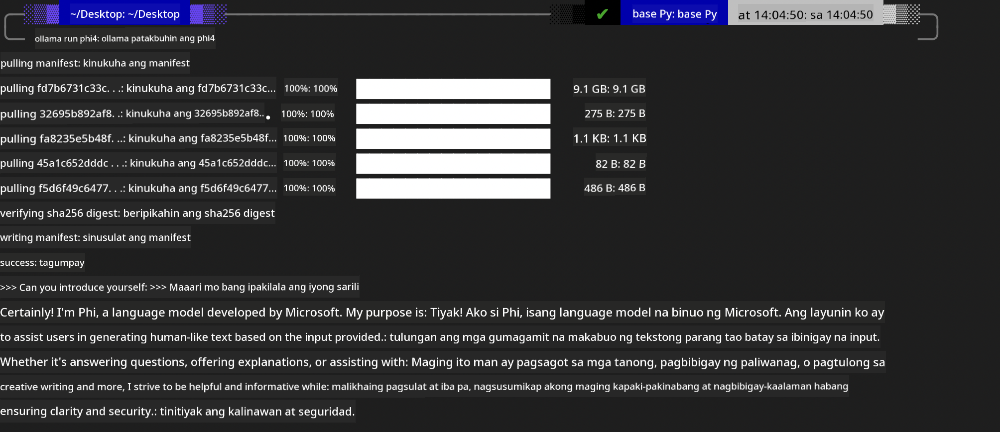
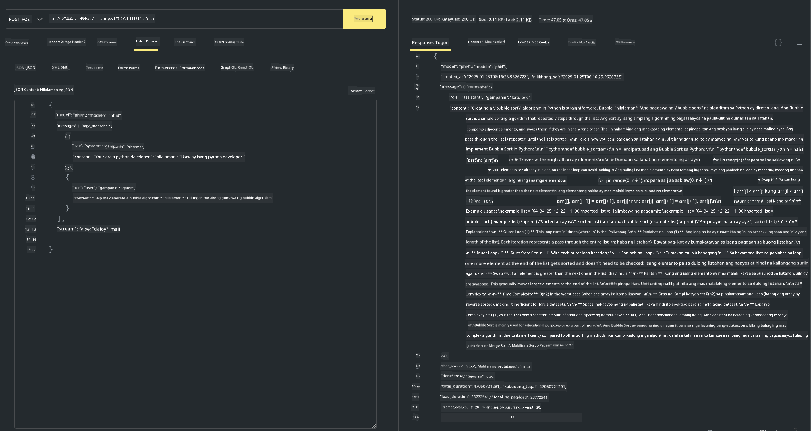

<!--
CO_OP_TRANSLATOR_METADATA:
{
  "original_hash": "0b38834693bb497f96bf53f0d941f9a1",
  "translation_date": "2025-07-16T19:17:59+00:00",
  "source_file": "md/01.Introduction/02/04.Ollama.md",
  "language_code": "tl"
}
-->
## Phi Family sa Ollama


Ang [Ollama](https://ollama.com) ay nagbibigay-daan sa mas maraming tao na direktang mag-deploy ng open source LLM o SLM gamit ang simpleng mga script, at maaari ring gumawa ng mga API para makatulong sa mga lokal na senaryo ng Copilot application.

## **1. Pag-install**

Sinusuportahan ng Ollama ang pagpapatakbo sa Windows, macOS, at Linux. Maaari mong i-install ang Ollama sa pamamagitan ng link na ito ([https://ollama.com/download](https://ollama.com/download)). Pagkatapos ng matagumpay na pag-install, maaari mo nang direktang gamitin ang Ollama script para tawagin ang Phi-3 sa pamamagitan ng terminal window. Makikita mo ang lahat ng [mga available na library sa Ollama](https://ollama.com/library). Kung bubuksan mo ang repository na ito sa Codespace, naka-install na ang Ollama.

```bash

ollama run phi4

```

> [!NOTE]
> Ido-download muna ang modelo kapag una mo itong pinatakbo. Siyempre, maaari mo ring direktang tukuyin ang na-download na Phi-4 na modelo. Ginagamit namin ang WSL bilang halimbawa sa pagpapatakbo ng command. Kapag matagumpay nang na-download ang modelo, maaari ka nang makipag-ugnayan direkta sa terminal.



## **2. Tawagin ang phi-4 API mula sa Ollama**

Kung nais mong tawagin ang Phi-4 API na ginawa ng ollama, maaari mong gamitin ang command na ito sa terminal para simulan ang Ollama server.

```bash

ollama serve

```

> [!NOTE]
> Kung nagpapatakbo ka ng MacOS o Linux, pakitandaan na maaaring lumabas ang error na ito **"Error: listen tcp 127.0.0.1:11434: bind: address already in use"** Maaaring lumabas ang error na ito kapag tinawag mo ang command. Maaari mo itong balewalain dahil karaniwang nangangahulugan ito na tumatakbo na ang server, o maaari mong itigil at i-restart ang Ollama:

**macOS**

```bash

brew services restart ollama

```

**Linux**

```bash

sudo systemctl stop ollama

```

Sinusuportahan ng Ollama ang dalawang API: generate at chat. Maaari mong tawagin ang model API na ibinibigay ng Ollama ayon sa iyong pangangailangan, sa pamamagitan ng pagpapadala ng mga request sa lokal na serbisyo na tumatakbo sa port 11434.

**Chat**

```bash

curl http://127.0.0.1:11434/api/chat -d '{
  "model": "phi3",
  "messages": [
    {
      "role": "system",
      "content": "Your are a python developer."
    },
    {
      "role": "user",
      "content": "Help me generate a bubble algorithm"
    }
  ],
  "stream": false
  
}'

This is the result in Postman



## Additional Resources

Check the list of available models in Ollama in [their library](https://ollama.com/library).

Pull your model from the Ollama server using this command

```bash
ollama pull phi4
```

Run the model using this command

```bash
ollama run phi4
```

***Note:*** Visit this link [https://github.com/ollama/ollama/blob/main/docs/api.md](https://github.com/ollama/ollama/blob/main/docs/api.md) to learn more

## Calling Ollama from Python

You can use `requests` or `urllib3` to make requests to the local server endpoints used above. However, a popular way to use Ollama in Python is via the [openai](https://pypi.org/project/openai/) SDK, since Ollama provides OpenAI-compatible server endpoints as well.

Here is an example for phi3-mini:

```python
import openai

client = openai.OpenAI(
    base_url="http://localhost:11434/v1",
    api_key="nokeyneeded",
)

response = client.chat.completions.create(
    model="phi4",
    temperature=0.7,
    n=1,
    messages=[
        {"role": "system", "content": "You are a helpful assistant."},
        {"role": "user", "content": "Write a haiku about a hungry cat"},
    ],
)

print("Response:")
print(response.choices[0].message.content)
```

## Calling Ollama from JavaScript 

```javascript
// Halimbawa ng Pagbubuod ng isang file gamit ang Phi-4
script({
    model: "ollama:phi4",
    title: "Summarize with Phi-4",
    system: ["system"],
})

// Halimbawa ng pagbubuod
const file = def("FILE", env.files)
$`Summarize ${file} in a single paragraph.`
```

## Calling Ollama from C#

Create a new C# Console application and add the following NuGet package:

```bash
dotnet add package Microsoft.SemanticKernel --version 1.34.0
```

Then replace this code in the `Program.cs` file

```csharp
using Microsoft.SemanticKernel;
using Microsoft.SemanticKernel.ChatCompletion;

// idagdag ang chat completion service gamit ang lokal na ollama server endpoint
#pragma warning disable SKEXP0001, SKEXP0003, SKEXP0010, SKEXP0011, SKEXP0050, SKEXP0052
builder.AddOpenAIChatCompletion(
    modelId: "phi4",
    endpoint: new Uri("http://localhost:11434/"),
    apiKey: "non required");

// tawagin ang simpleng prompt sa chat service
string prompt = "Write a joke about kittens";
var response = await kernel.InvokePromptAsync(prompt);
Console.WriteLine(response.GetValue<string>());
```

Run the app with the command:

```bash
dotnet run


**Paalala**:  
Ang dokumentong ito ay isinalin gamit ang AI translation service na [Co-op Translator](https://github.com/Azure/co-op-translator). Bagamat nagsusumikap kami para sa katumpakan, pakatandaan na ang mga awtomatikong pagsasalin ay maaaring maglaman ng mga pagkakamali o di-tumpak na impormasyon. Ang orihinal na dokumento sa orihinal nitong wika ang dapat ituring na pangunahing sanggunian. Para sa mahahalagang impormasyon, inirerekomenda ang propesyonal na pagsasalin ng tao. Hindi kami mananagot sa anumang hindi pagkakaunawaan o maling interpretasyon na maaaring magmula sa paggamit ng pagsasaling ito.