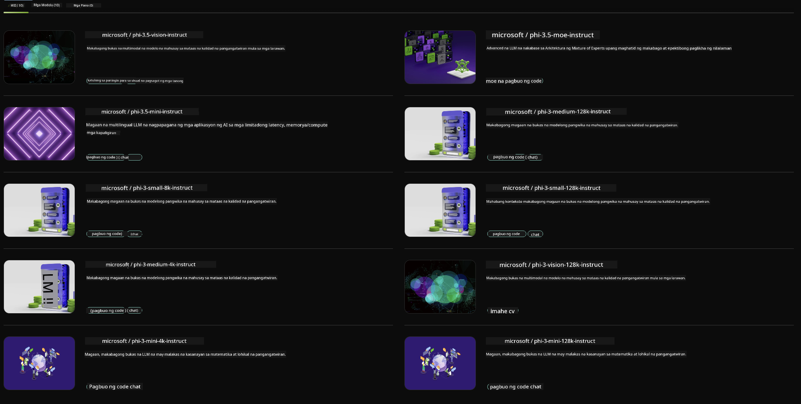

<!--
CO_OP_TRANSLATOR_METADATA:
{
  "original_hash": "7b08e277df2a9307f861ae54bc30c772",
  "translation_date": "2025-05-09T09:59:22+00:00",
  "source_file": "md/01.Introduction/02/06.NVIDIA.md",
  "language_code": "tl"
}
-->
## Phi Family sa NVIDIA NIM

Ang NVIDIA NIM ay isang hanay ng mga madaling gamitin na microservices na idinisenyo upang pabilisin ang deployment ng mga generative AI models sa cloud, data center, at mga workstations. Ang mga NIM ay naka-kategorya base sa pamilya ng modelo at bawat modelo. Halimbawa, ang NVIDIA NIM para sa malalaking language models (LLMs) ay nagdadala ng kapangyarihan ng mga makabagong LLMs sa mga enterprise applications, na nagbibigay ng walang kapantay na natural language processing at pag-unawa.

Pinapadali ng NIM para sa mga IT at DevOps teams ang self-hosting ng malalaking language models (LLMs) sa kanilang sariling pinamamahalaang mga environment habang nagbibigay pa rin sa mga developer ng industry standard APIs na nagpapahintulot sa kanila na bumuo ng mga makapangyarihang copilots, chatbots, at AI assistants na maaaring baguhin ang kanilang negosyo. Sa paggamit ng cutting-edge GPU acceleration ng NVIDIA at scalable deployment, nag-aalok ang NIM ng pinakamabilis na paraan patungo sa inference na may walang kapantay na performance.

Maaari mong gamitin ang NVIDIA NIM para mag-inference ng Phi Family Models



### **Mga Halimbawa - Phi-3-Vision sa NVIDIA NIM**

Isipin mo na may isang imahe (`demo.png`) at gusto mong gumawa ng Python code na magpoproseso sa imaheng ito at magsa-save ng bagong bersyon nito (`phi-3-vision.jpg`).

Ang code sa itaas ay awtomatikong ginagawa ang prosesong ito sa pamamagitan ng:

1. Pagsasaayos ng environment at mga kinakailangang configuration.
2. Paggawa ng prompt na nag-uutos sa modelo na gumawa ng kinakailangang Python code.
3. Pagpapadala ng prompt sa modelo at pagkolekta ng nagawang code.
4. Pagkuha at pagpapatakbo ng nagawang code.
5. Pagpapakita ng orihinal at na-prosesong mga imahe.

Ginagamit ng paraang ito ang kapangyarihan ng AI para i-automate ang mga gawain sa pagpoproseso ng imahe, na nagpapadali at nagpapabilis sa pagtupad ng iyong mga layunin.

[Sample Code Solution](../../../../../code/06.E2E/E2E_Nvidia_NIM_Phi3_Vision.ipynb)

Hatiin natin ang ginagawa ng buong code nang hakbang-hakbang:

1. **I-install ang Kinakailangang Package**:
    ```python
    !pip install langchain_nvidia_ai_endpoints -U
    ```
    Ini-install ng utos na ito ang `langchain_nvidia_ai_endpoints` package, tinitiyak na ito ang pinakabagong bersyon.

2. **I-import ang Mga Kinakailangang Module**:
    ```python
    from langchain_nvidia_ai_endpoints import ChatNVIDIA
    import getpass
    import os
    import base64
    ```
    Inilalagay ng mga import na ito ang mga kinakailangang module para makipag-ugnayan sa NVIDIA AI endpoints, secure na paghawak ng password, pakikipag-ugnayan sa operating system, at pag-encode/decode ng data sa base64 na format.

3. **Itakda ang API Key**:
    ```python
    if not os.getenv("NVIDIA_API_KEY"):
        os.environ["NVIDIA_API_KEY"] = getpass.getpass("Enter your NVIDIA API key: ")
    ```
    Sinusuri ng code na ito kung naka-set ang `NVIDIA_API_KEY` environment variable. Kung hindi, hihingin nito nang secure sa user ang kanilang API key.

4. **Itakda ang Modelo at Path ng Imahe**:
    ```python
    model = 'microsoft/phi-3-vision-128k-instruct'
    chat = ChatNVIDIA(model=model)
    img_path = './imgs/demo.png'
    ```
    Itinakda dito ang modelong gagamitin, gumawa ng instance ng `ChatNVIDIA` gamit ang tinukoy na modelo, at itinakda ang path ng image file.

5. **Gumawa ng Text Prompt**:
    ```python
    text = "Please create Python code for image, and use plt to save the new picture under imgs/ and name it phi-3-vision.jpg."
    ```
    Nagde-define ito ng text prompt na nagsasabi sa modelo na gumawa ng Python code para sa pagpoproseso ng imahe.

6. **I-encode ang Imahe sa Base64**:
    ```python
    with open(img_path, "rb") as f:
        image_b64 = base64.b64encode(f.read()).decode()
    image = f''
    ```
    Binabasa ng code na ito ang image file, ini-encode ito sa base64, at gumagawa ng HTML image tag gamit ang encoded na data.

7. **Pagsamahin ang Text at Imahe sa Prompt**:
    ```python
    prompt = f"{text} {image}"
    ```
    Pinagsasama nito ang text prompt at ang HTML image tag sa isang string.

8. **Gumawa ng Code Gamit ang ChatNVIDIA**:
    ```python
    code = ""
    for chunk in chat.stream(prompt):
        print(chunk.content, end="")
        code += chunk.content
    ```
    Ipinapadala ng code na ito ang prompt sa `ChatNVIDIA` model and collects the generated code in chunks, printing and appending each chunk to the `code` string.

9. **Kunin ang Python Code mula sa Nagawang Nilalaman**:
    ```python
    begin = code.index('```python') + 9
    code = code[begin:]
    end = code.index('```')
    code = code[:end]
    ```
    Kinukuha nito ang aktwal na Python code mula sa nagawang content sa pamamagitan ng pagtanggal ng markdown formatting.

10. **Patakbuhin ang Nagawang Code**:
    ```python
    import subprocess
    result = subprocess.run(["python", "-c", code], capture_output=True)
    ```
    Pinapatakbo nito ang nakuha na Python code bilang subprocess at kinukuha ang output nito.

11. **Ipakita ang mga Imahe**:
    ```python
    from IPython.display import Image, display
    display(Image(filename='./imgs/phi-3-vision.jpg'))
    display(Image(filename='./imgs/demo.png'))
    ```
    Ipinapakita ng mga linyang ito ang mga imahe gamit ang `IPython.display` module.

**Paunawa**:  
Ang dokumentong ito ay isinalin gamit ang AI translation service na [Co-op Translator](https://github.com/Azure/co-op-translator). Bagamat aming pinagsisikapang maging tumpak ang pagsasalin, pakatandaan na ang mga awtomatikong pagsasalin ay maaaring maglaman ng mga pagkakamali o di-tumpak na impormasyon. Ang orihinal na dokumento sa kanyang sariling wika ang dapat ituring na pangunahing sanggunian. Para sa mahahalagang impormasyon, inirerekomenda ang propesyonal na pagsasalin ng tao. Hindi kami mananagot sa anumang hindi pagkakaintindihan o maling interpretasyon na maaaring magmula sa paggamit ng pagsasaling ito.