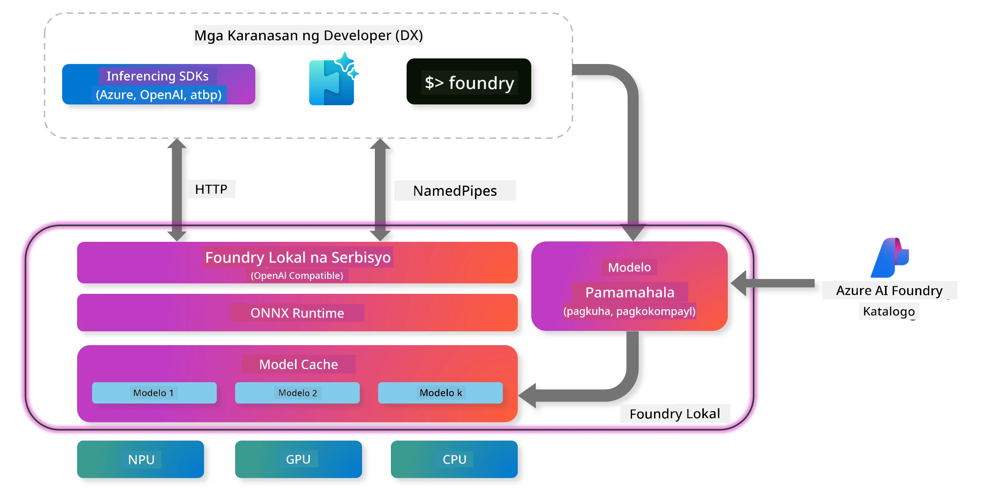

<!--
CO_OP_TRANSLATOR_METADATA:
{
  "original_hash": "52973a5680a65a810aa80b7036afd31f",
  "translation_date": "2025-07-16T19:49:34+00:00",
  "source_file": "md/01.Introduction/02/07.FoundryLocal.md",
  "language_code": "tl"
}
-->
## Pagsisimula sa Phi-Family Models sa Foundry Local

### Panimula sa Foundry Local

Ang Foundry Local ay isang makapangyarihang solusyon para sa AI inference na tumatakbo mismo sa iyong device, na nagdadala ng enterprise-grade na kakayahan ng AI diretso sa iyong lokal na hardware. Ang tutorial na ito ay gagabay sa iyo kung paano i-setup at gamitin ang Phi-Family models gamit ang Foundry Local, na nagbibigay sa iyo ng ganap na kontrol sa iyong AI workloads habang pinapanatili ang privacy at binabawasan ang gastos.

Nagbibigay ang Foundry Local ng mga benepisyo sa performance, privacy, customization, at cost efficiency sa pamamagitan ng pagpapatakbo ng AI models nang lokal sa iyong device. Ito ay madaling isinasama sa iyong kasalukuyang workflows at mga aplikasyon gamit ang intuitive na CLI, SDK, at REST API.




### Bakit Piliin ang Foundry Local?

Ang pag-unawa sa mga benepisyo ng Foundry Local ay makakatulong sa iyo na makagawa ng tamang desisyon para sa iyong AI deployment strategy:

- **On-Device Inference:** Patakbuhin ang mga modelo nang lokal sa iyong sariling hardware, na nagpapababa ng gastos habang nananatiling ligtas ang lahat ng iyong data sa iyong device.

- **Model Customization:** Pumili mula sa mga preset na modelo o gamitin ang sarili mong modelo upang matugunan ang mga partikular na pangangailangan at kaso ng paggamit.

- **Cost Efficiency:** Alisin ang paulit-ulit na gastos sa cloud services sa pamamagitan ng paggamit ng iyong kasalukuyang hardware, na ginagawang mas abot-kaya ang AI.

- **Seamless Integration:** Ikonekta sa iyong mga aplikasyon gamit ang SDK, API endpoints, o CLI, na may madaling pag-scale papuntang Azure AI Foundry habang lumalaki ang iyong pangangailangan.

> **Getting Started Note:** Nakatuon ang tutorial na ito sa paggamit ng Foundry Local sa pamamagitan ng CLI at SDK interfaces. Matututuhan mo ang parehong paraan upang matulungan kang piliin ang pinakamahusay na pamamaraan para sa iyong kaso.

## Bahagi 1: Pag-setup ng Foundry Local CLI

### Hakbang 1: Pag-install

Ang Foundry Local CLI ang iyong daan para pamahalaan at patakbuhin ang mga AI models nang lokal. Magsimula tayo sa pag-install nito sa iyong sistema.

**Sinusuportahang Platform:** Windows at macOS

Para sa detalyadong mga tagubilin sa pag-install, pakitingnan ang [opisyal na dokumentasyon ng Foundry Local](https://github.com/microsoft/Foundry-Local/blob/main/README.md).

### Hakbang 2: Pag-explore ng Mga Available na Modelo

Kapag na-install mo na ang Foundry Local CLI, maaari mong tuklasin kung anong mga modelo ang available para sa iyong kaso ng paggamit. Ipapakita ng utos na ito ang lahat ng suportadong mga modelo:


```bash
foundry model list
```

### Hakbang 3: Pag-unawa sa Phi Family Models

Nag-aalok ang Phi Family ng iba't ibang mga modelo na na-optimize para sa iba't ibang mga kaso ng paggamit at hardware configurations. Narito ang mga Phi models na available sa Foundry Local:

**Mga Available na Phi Models:** 

- **phi-3.5-mini** - Compact na modelo para sa mga pangunahing gawain
- **phi-3-mini-128k** - Extended context na bersyon para sa mas mahahabang pag-uusap
- **phi-3-mini-4k** - Standard context na modelo para sa pangkalahatang gamit
- **phi-4** - Advanced na modelo na may pinahusay na kakayahan
- **phi-4-mini** - Magaan na bersyon ng Phi-4
- **phi-4-mini-reasoning** - Espesyal na modelo para sa mga komplikadong reasoning tasks

> **Hardware Compatibility:** Maaaring i-configure ang bawat modelo para sa iba't ibang hardware acceleration (CPU, GPU) depende sa kakayahan ng iyong sistema.

### Hakbang 4: Patakbuhin ang Iyong Unang Phi Model

Magsimula tayo sa isang praktikal na halimbawa. Patatakbuhin natin ang `phi-4-mini-reasoning` model, na mahusay sa paglutas ng mga komplikadong problema nang hakbang-hakbang.


**Utos para patakbuhin ang modelo:**

```bash
foundry model run Phi-4-mini-reasoning-generic-cpu
```

> **First-Time Setup:** Kapag unang beses mong pinatakbo ang isang modelo, awtomatikong ida-download ito ng Foundry Local sa iyong lokal na device. Ang oras ng pag-download ay depende sa bilis ng iyong network, kaya mangyaring maghintay nang kaunti sa unang setup.

### Hakbang 5: Subukan ang Modelo gamit ang Isang Totoong Problema

Ngayon subukan natin ang modelo gamit ang isang klasikong logic problem upang makita kung paano nito ginagawa ang step-by-step reasoning:

**Halimbawa ng Problema:**

```txt
Please calculate the following step by step: Now there are pheasants and rabbits in the same cage, there are thirty-five heads on top and ninety-four legs on the bottom, how many pheasants and rabbits are there?
```

**Inaasahang Gawi:** Dapat hatiin ng modelo ang problemang ito sa mga lohikal na hakbang, gamit ang katotohanang ang mga pheasant ay may 2 paa at ang mga kuneho ay may 4 na paa upang malutas ang sistema ng mga ekwasyon.

**Mga Resulta:**


## Bahagi 2: Paggawa ng Mga Aplikasyon gamit ang Foundry Local SDK

### Bakit Gamitin ang SDK?

Habang ang CLI ay perpekto para sa pagsubok at mabilisang interaksyon, pinapayagan ka ng SDK na isama ang Foundry Local sa iyong mga aplikasyon nang programmatically. Nagbubukas ito ng mga posibilidad para sa:

- Paggawa ng mga custom na AI-powered na aplikasyon
- Paglikha ng mga automated workflows
- Pagsasama ng AI capabilities sa mga umiiral na sistema
- Pag-develop ng mga chatbot at interactive na mga tool

### Sinusuportahang Mga Programming Language

Nagbibigay ang Foundry Local ng SDK support para sa iba't ibang programming languages upang umangkop sa iyong mga kagustuhan sa pag-develop:

**📦 Available na SDKs:**

- **C# (.NET):** [SDK Documentation & Examples](https://github.com/microsoft/Foundry-Local/tree/main/sdk/cs)
- **Python:** [SDK Documentation & Examples](https://github.com/microsoft/Foundry-Local/tree/main/sdk/python)
- **JavaScript:** [SDK Documentation & Examples](https://github.com/microsoft/Foundry-Local/tree/main/sdk/js)
- **Rust:** [SDK Documentation & Examples](https://github.com/microsoft/Foundry-Local/tree/main/sdk/rust)

### Mga Susunod na Hakbang

1. **Piliin ang iyong gustong SDK** base sa iyong development environment
2. **Sundin ang SDK-specific na dokumentasyon** para sa detalyadong mga gabay sa implementasyon
3. **Magsimula sa mga simpleng halimbawa** bago gumawa ng mas kumplikadong mga aplikasyon
4. **Suriin ang sample code** na ibinigay sa bawat SDK repository

## Konklusyon

Ngayon ay natutunan mo na kung paano:
- ✅ Mag-install at mag-setup ng Foundry Local CLI
- ✅ Tuklasin at patakbuhin ang Phi Family models
- ✅ Subukan ang mga modelo gamit ang mga totoong problema
- ✅ Unawain ang mga opsyon sa SDK para sa pag-develop ng aplikasyon

Nagbibigay ang Foundry Local ng matibay na pundasyon para dalhin ang AI capabilities diretso sa iyong lokal na kapaligiran, na nagbibigay sa iyo ng kontrol sa performance, privacy, at gastos habang pinapanatili ang kakayahang mag-scale sa cloud solutions kapag kinakailangan.

**Paalala**:  
Ang dokumentong ito ay isinalin gamit ang AI translation service na [Co-op Translator](https://github.com/Azure/co-op-translator). Bagamat nagsusumikap kami para sa katumpakan, pakatandaan na ang mga awtomatikong pagsasalin ay maaaring maglaman ng mga pagkakamali o di-tumpak na impormasyon. Ang orihinal na dokumento sa orihinal nitong wika ang dapat ituring na pangunahing sanggunian. Para sa mahahalagang impormasyon, inirerekomenda ang propesyonal na pagsasalin ng tao. Hindi kami mananagot sa anumang hindi pagkakaunawaan o maling interpretasyon na maaaring magmula sa paggamit ng pagsasaling ito.