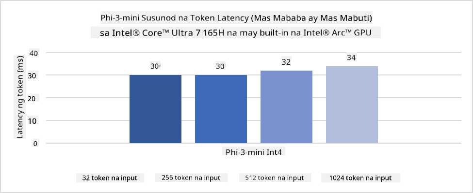
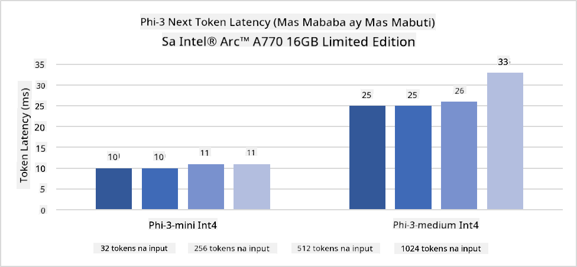
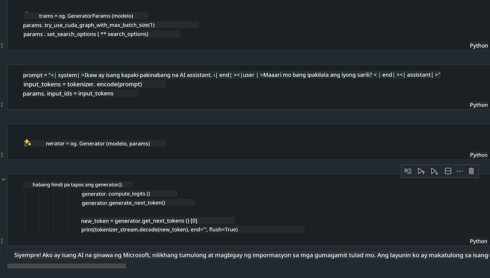

<!--
CO_OP_TRANSLATOR_METADATA:
{
  "original_hash": "e08ce816e23ad813244a09ca34ebb8ac",
  "translation_date": "2025-05-09T10:29:59+00:00",
  "source_file": "md/01.Introduction/03/AIPC_Inference.md",
  "language_code": "tl"
}
-->
# **Inference Phi-3 sa AI PC**

Dahil sa pag-unlad ng generative AI at pagpapabuti ng hardware capabilities ng mga edge device, dumarami na ang mga generative AI models na maaaring i-integrate sa mga Bring Your Own Device (BYOD) ng mga user. Kasama dito ang AI PCs. Simula 2024, nag-collaborate ang Intel, AMD, at Qualcomm kasama ang mga PC manufacturers para maglabas ng AI PCs na nagpapadali sa deployment ng localized generative AI models sa pamamagitan ng hardware modifications. Sa talakayang ito, tututukan natin ang Intel AI PCs at titingnan kung paano i-deploy ang Phi-3 sa isang Intel AI PC.

### Ano ang NPU

Ang NPU (Neural Processing Unit) ay isang dedicated na processor o processing unit sa mas malaking SoC na dinisenyo para pabilisin ang neural network operations at AI tasks. Hindi tulad ng general-purpose CPUs at GPUs, ang NPUs ay optimized para sa data-driven parallel computing, kaya napaka-epektibo nila sa pagproseso ng malalaking multimedia data tulad ng videos at images pati na rin sa pagproseso ng data para sa neural networks. Mahusay silang gamitin sa mga AI-related na gawain tulad ng speech recognition, background blurring sa video calls, at photo o video editing processes gaya ng object detection.

## NPU vs GPU

Maraming AI at machine learning workloads ang tumatakbo sa GPUs, pero may mahalagang pagkakaiba ang GPUs at NPUs.
Kilala ang GPUs sa kanilang kakayahan sa parallel computing, pero hindi lahat ng GPUs ay pantay ang efficiency sa pagproseso ng graphics. Ang NPUs naman ay purpose-built para sa mga complex computations na kinakailangan sa neural network operations, kaya napaka-epektibo nila para sa AI tasks.

Sa madaling salita, ang NPUs ang mga math whizzes na nagpapabilis ng AI computations, at mahalaga ang papel nila sa umuusbong na panahon ng AI PCs!

***Ang halimbawa na ito ay base sa pinakabagong Intel Core Ultra Processor ng Intel***

## **1. Gamitin ang NPU para patakbuhin ang Phi-3 model**

Ang Intel® NPU device ay isang AI inference accelerator na integrated sa Intel client CPUs, simula sa Intel® Core™ Ultra generation ng CPUs (na dati ay kilala bilang Meteor Lake). Pinapahintulutan nito ang energy-efficient na pagpapatupad ng artificial neural network tasks.





**Intel NPU Acceleration Library**

Ang Intel NPU Acceleration Library [https://github.com/intel/intel-npu-acceleration-library](https://github.com/intel/intel-npu-acceleration-library) ay isang Python library na dinisenyo para mapabilis ang efficiency ng iyong mga aplikasyon sa pamamagitan ng paggamit ng kapangyarihan ng Intel Neural Processing Unit (NPU) para magsagawa ng high-speed computations sa compatible na hardware.

Halimbawa ng Phi-3-mini sa AI PC na pinapatakbo ng Intel® Core™ Ultra processors.


I-install ang Python Library gamit ang pip

```bash

   pip install intel-npu-acceleration-library

```

***Note*** Ang proyekto ay patuloy pa ring dine-develop, pero ang reference model ay halos kumpleto na.

### **Pagpapatakbo ng Phi-3 gamit ang Intel NPU Acceleration Library**

Sa paggamit ng Intel NPU acceleration, hindi naaapektuhan ng library na ito ang tradisyunal na encoding process. Kailangan mo lang gamitin ang library na ito para i-quantize ang orihinal na Phi-3 model, gaya ng FP16, INT8, INT4, tulad ng

```python
from transformers import AutoTokenizer, pipeline,TextStreamer
from intel_npu_acceleration_library import NPUModelForCausalLM, int4
from intel_npu_acceleration_library.compiler import CompilerConfig
import warnings

model_id = "microsoft/Phi-3-mini-4k-instruct"

compiler_conf = CompilerConfig(dtype=int4)
model = NPUModelForCausalLM.from_pretrained(
    model_id, use_cache=True, config=compiler_conf, attn_implementation="sdpa"
).eval()

tokenizer = AutoTokenizer.from_pretrained(model_id)

text_streamer = TextStreamer(tokenizer, skip_prompt=True)
```

Kapag matagumpay ang quantification, ipagpatuloy ang pagpapatakbo para tawagin ang NPU upang patakbuhin ang Phi-3 model.

```python
generation_args = {
   "max_new_tokens": 1024,
   "return_full_text": False,
   "temperature": 0.3,
   "do_sample": False,
   "streamer": text_streamer,
}

pipe = pipeline(
   "text-generation",
   model=model,
   tokenizer=tokenizer,
)

query = "<|system|>You are a helpful AI assistant.<|end|><|user|>Can you introduce yourself?<|end|><|assistant|>"

with warnings.catch_warnings():
    warnings.simplefilter("ignore")
    pipe(query, **generation_args)
```

Kapag nagpapatakbo ng code, maaari nating makita ang status ng NPU sa pamamagitan ng Task Manager


***Samples*** : [AIPC_NPU_DEMO.ipynb](../../../../../code/03.Inference/AIPC/AIPC_NPU_DEMO.ipynb)

## **2. Gamitin ang DirectML + ONNX Runtime para patakbuhin ang Phi-3 Model**

### **Ano ang DirectML**

Ang [DirectML](https://github.com/microsoft/DirectML) ay isang high-performance, hardware-accelerated DirectX 12 library para sa machine learning. Nagbibigay ang DirectML ng GPU acceleration para sa mga karaniwang machine learning tasks sa iba't ibang hardware at drivers, kabilang na ang lahat ng DirectX 12-capable GPUs mula sa mga vendor tulad ng AMD, Intel, NVIDIA, at Qualcomm.

Kapag ginamit nang mag-isa, ang DirectML API ay isang low-level DirectX 12 library na angkop para sa high-performance, low-latency applications tulad ng frameworks, games, at iba pang real-time applications. Ang seamless interoperability ng DirectML sa Direct3D 12 pati na rin ang mababang overhead at compatibility sa iba't ibang hardware ang dahilan kung bakit perpekto ang DirectML para pabilisin ang machine learning kapag gusto ang mataas na performance at reliable na resulta sa iba't ibang hardware.

***Note*** : Suportado na ng pinakabagong DirectML ang NPU(https://devblogs.microsoft.com/directx/introducing-neural-processor-unit-npu-support-in-directml-developer-preview/)

### DirectML at CUDA sa kanilang kakayahan at performance:

**DirectML** ay isang machine learning library na ginawa ng Microsoft. Nilalayon nitong pabilisin ang machine learning workloads sa Windows devices, kabilang ang desktops, laptops, at edge devices.
- DX12-Based: Nakabatay ang DirectML sa DirectX 12 (DX12), na nagbibigay ng malawak na suporta sa hardware sa iba't ibang GPUs, kabilang ang NVIDIA at AMD.
- Mas Malawak na Suporta: Dahil ginagamit nito ang DX12, maaaring gumana ang DirectML sa anumang GPU na sumusuporta sa DX12, pati na ang integrated GPUs.
- Image Processing: Pinoproseso ng DirectML ang mga larawan at iba pang data gamit ang neural networks, kaya angkop ito sa mga gawain tulad ng image recognition, object detection, at iba pa.
- Madaling I-setup: Madali lang i-setup ang DirectML at hindi kailangan ng specific SDKs o libraries mula sa GPU manufacturers.
- Performance: Sa ilang kaso, mahusay ang performance ng DirectML at maaaring mas mabilis pa kaysa CUDA, lalo na sa ilang workloads.
- Limitasyon: Ngunit may mga pagkakataon na mas mabagal ang DirectML, lalo na sa mga float16 na malalaking batch sizes.

**CUDA** ay ang parallel computing platform at programming model ng NVIDIA. Pinapayagan nito ang mga developer na gamitin ang kapangyarihan ng NVIDIA GPUs para sa general-purpose computing, kabilang ang machine learning at scientific simulations.
- Espesipiko sa NVIDIA: Mahigpit ang integrasyon ng CUDA sa NVIDIA GPUs at dinisenyo para sa mga ito.
- Mataas na Optimization: Nagbibigay ito ng mahusay na performance para sa GPU-accelerated tasks, lalo na kapag gumagamit ng NVIDIA GPUs.
- Malawakang Ginagamit: Maraming machine learning frameworks at libraries (tulad ng TensorFlow at PyTorch) ang may suporta sa CUDA.
- Customization: Puwedeng i-fine tune ng mga developer ang CUDA settings para sa partikular na tasks, na nagreresulta sa optimal na performance.
- Limitasyon: Pero ang dependency ng CUDA sa NVIDIA hardware ay maaaring maging hadlang kung gusto mong gumamit ng mas malawak na compatibility sa iba't ibang GPUs.

### Pumili sa pagitan ng DirectML at CUDA

Ang pagpili sa pagitan ng DirectML at CUDA ay depende sa iyong partikular na pangangailangan, availability ng hardware, at mga preference.
Kung gusto mo ng mas malawak na compatibility at madaling setup, maaaring mas mainam ang DirectML. Pero kung may NVIDIA GPUs ka at kailangan mo ng highly optimized na performance, malakas pa rin ang CUDA. Sa madaling salita, may kanya-kanyang lakas at kahinaan ang DirectML at CUDA, kaya isaalang-alang ang iyong mga requirements at hardware bago magdesisyon.

### **Generative AI gamit ang ONNX Runtime**

Sa panahon ng AI, napakahalaga ng portability ng AI models. Madaling ma-deploy ng ONNX Runtime ang mga trained models sa iba't ibang devices. Hindi na kailangang mag-alala ang mga developer tungkol sa inference framework at maaaring gumamit ng unified API para sa model inference. Sa panahon ng generative AI, nagkaroon din ng code optimization ang ONNX Runtime (https://onnxruntime.ai/docs/genai/). Sa pamamagitan ng optimized ONNX Runtime, maaaring ma-infer ang quantized generative AI model sa iba't ibang terminals. Sa Generative AI gamit ang ONNX Runtime, maaari kang mag-infer ng AI model API gamit ang Python, C#, C / C++. Siyempre, sa deployment sa iPhone, maaaring samantalahin ang C++ ng Generative AI gamit ang ONNX Runtime API.

[Sample Code](https://github.com/Azure-Samples/Phi-3MiniSamples/tree/main/onnx)

***i-compile ang generative AI gamit ang ONNX Runtime library***

```bash

winget install --id=Kitware.CMake  -e

git clone https://github.com/microsoft/onnxruntime.git

cd .\onnxruntime\

./build.bat --build_shared_lib --skip_tests --parallel --use_dml --config Release

cd ../

git clone https://github.com/microsoft/onnxruntime-genai.git

cd .\onnxruntime-genai\

mkdir ort

cd ort

mkdir include

mkdir lib

copy ..\onnxruntime\include\onnxruntime\core\providers\dml\dml_provider_factory.h ort\include

copy ..\onnxruntime\include\onnxruntime\core\session\onnxruntime_c_api.h ort\include

copy ..\onnxruntime\build\Windows\Release\Release\*.dll ort\lib

copy ..\onnxruntime\build\Windows\Release\Release\onnxruntime.lib ort\lib

python build.py --use_dml


```

**I-install ang library**

```bash

pip install .\onnxruntime_genai_directml-0.3.0.dev0-cp310-cp310-win_amd64.whl

```

Ito ang resulta ng pagpapatakbo



***Samples*** : [AIPC_DirectML_DEMO.ipynb](../../../../../code/03.Inference/AIPC/AIPC_DirectML_DEMO.ipynb)

## **3. Gamitin ang Intel OpenVino para patakbuhin ang Phi-3 Model**

### **Ano ang OpenVINO**

Ang [OpenVINO](https://github.com/openvinotoolkit/openvino) ay isang open-source toolkit para sa pag-optimize at deployment ng deep learning models. Nagbibigay ito ng pinabilis na deep learning performance para sa vision, audio, at language models mula sa mga kilalang frameworks tulad ng TensorFlow, PyTorch, at iba pa. Magsimula gamit ang OpenVINO. Maaari ring gamitin ang OpenVINO kasabay ng CPU at GPU para patakbuhin ang Phi-3 model.

***Note***: Sa kasalukuyan, hindi pa sinusuportahan ng OpenVINO ang NPU.

### **I-install ang OpenVINO Library**

```bash

 pip install git+https://github.com/huggingface/optimum-intel.git

 pip install git+https://github.com/openvinotoolkit/nncf.git

 pip install openvino-nightly

```

### **Pagpapatakbo ng Phi-3 gamit ang OpenVINO**

Tulad ng NPU, tinatapos ng OpenVINO ang pagtawag sa mga generative AI models sa pamamagitan ng pagpapatakbo ng quantitative models. Kailangan muna nating i-quantize ang Phi-3 model at tapusin ang model quantization sa command line gamit ang optimum-cli

**INT4**

```bash

optimum-cli export openvino --model "microsoft/Phi-3-mini-4k-instruct" --task text-generation-with-past --weight-format int4 --group-size 128 --ratio 0.6  --sym  --trust-remote-code ./openvinomodel/phi3/int4

```

**FP16**

```bash

optimum-cli export openvino --model "microsoft/Phi-3-mini-4k-instruct" --task text-generation-with-past --weight-format fp16 --trust-remote-code ./openvinomodel/phi3/fp16

```

ganito ang converted format


I-load ang mga model paths (model_dir), mga kaugnay na configurations (ov_config = {"PERFORMANCE_HINT": "LATENCY", "NUM_STREAMS": "1", "CACHE_DIR": ""}), at hardware-accelerated devices (GPU.0) gamit ang OVModelForCausalLM

```python

ov_model = OVModelForCausalLM.from_pretrained(
     model_dir,
     device='GPU.0',
     ov_config=ov_config,
     config=AutoConfig.from_pretrained(model_dir, trust_remote_code=True),
     trust_remote_code=True,
)

```

Kapag nagpapatakbo ng code, maaari nating makita ang status ng GPU sa pamamagitan ng Task Manager


***Samples*** : [AIPC_OpenVino_Demo.ipynb](../../../../../code/03.Inference/AIPC/AIPC_OpenVino_Demo.ipynb)

### ***Note*** : Ang tatlong paraan sa itaas ay may kanya-kanyang kalamangan, pero inirerekomenda na gamitin ang NPU acceleration para sa AI PC inference.

**Pagtatapat**:  
Ang dokumentong ito ay isinalin gamit ang AI na serbisyo sa pagsasalin [Co-op Translator](https://github.com/Azure/co-op-translator). Bagamat nagsusumikap kami para sa katumpakan, pakatandaan na ang mga awtomatikong pagsasalin ay maaaring maglaman ng mga pagkakamali o di-tumpak na impormasyon. Ang orihinal na dokumento sa orihinal nitong wika ang dapat ituring na pinagmumulan ng katotohanan. Para sa mahahalagang impormasyon, inirerekomenda ang propesyonal na pagsasalin ng tao. Hindi kami mananagot sa anumang hindi pagkakaunawaan o maling interpretasyon na maaaring magmula sa paggamit ng pagsasaling ito.