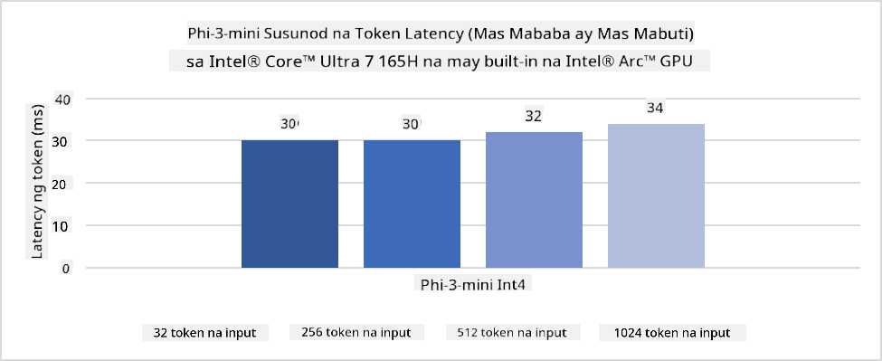
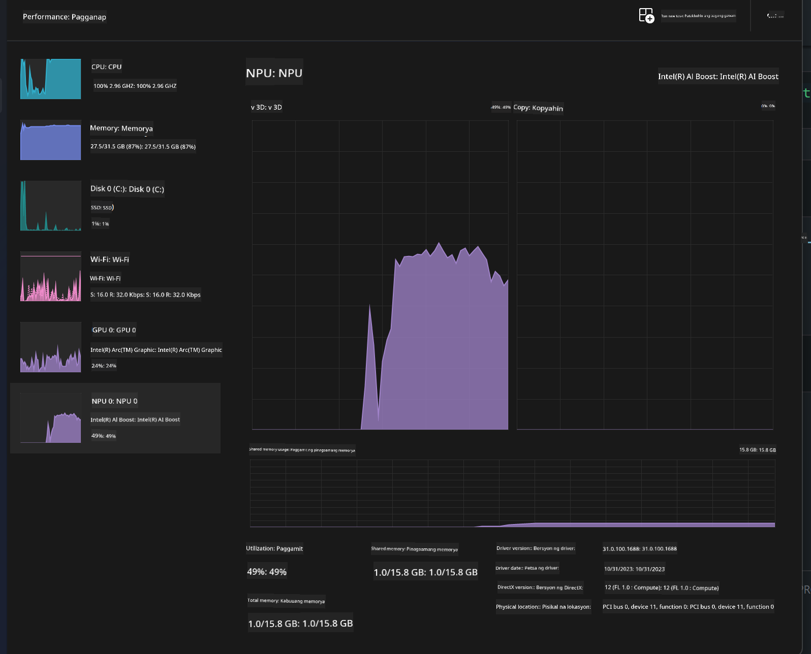
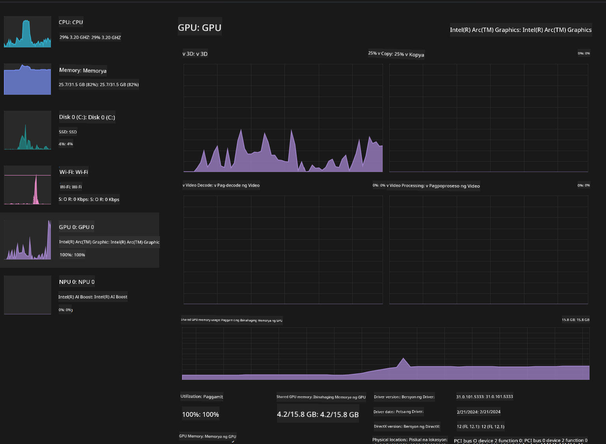

<!--
CO_OP_TRANSLATOR_METADATA:
{
  "original_hash": "e08ce816e23ad813244a09ca34ebb8ac",
  "translation_date": "2025-07-16T20:05:34+00:00",
  "source_file": "md/01.Introduction/03/AIPC_Inference.md",
  "language_code": "tl"
}
-->
# **Inference Phi-3 sa AI PC**

Dahil sa pag-unlad ng generative AI at pagpapabuti ng kakayahan ng hardware ng mga edge device, dumarami na ang mga generative AI models na maaaring i-integrate sa mga Bring Your Own Device (BYOD) ng mga gumagamit. Kabilang dito ang AI PCs. Simula 2024, nag-collaborate ang Intel, AMD, at Qualcomm kasama ang mga PC manufacturer upang maglunsad ng AI PCs na nagpapadali sa deployment ng localized generative AI models sa pamamagitan ng hardware modifications. Sa talakayang ito, tututukan natin ang Intel AI PCs at tatalakayin kung paano i-deploy ang Phi-3 sa isang Intel AI PC.

### Ano ang NPU

Ang NPU (Neural Processing Unit) ay isang dedikadong processor o processing unit sa mas malaking SoC na espesyal na dinisenyo para pabilisin ang mga neural network operations at AI tasks. Hindi tulad ng mga general-purpose CPUs at GPUs, ang mga NPU ay optimized para sa data-driven parallel computing, kaya napaka-epektibo nila sa pagproseso ng malalaking multimedia data tulad ng mga video at larawan, pati na rin sa pagproseso ng data para sa neural networks. Mahusay silang humawak ng mga AI-related na gawain, tulad ng speech recognition, background blurring sa video calls, at mga proseso ng pag-edit ng larawan o video tulad ng object detection.

## NPU vs GPU

Bagamat maraming AI at machine learning workloads ang tumatakbo sa GPUs, may mahalagang pagkakaiba ang GPUs at NPUs. Kilala ang GPUs sa kanilang parallel computing capabilities, ngunit hindi lahat ng GPUs ay pantay ang kahusayan sa labas ng pagproseso ng graphics. Ang mga NPU naman ay espesyal na ginawa para sa mga komplikadong kalkulasyon na kailangan sa neural network operations, kaya napaka-epektibo nila para sa mga AI tasks.

Sa madaling salita, ang mga NPU ang mga math whizzes na nagpapabilis ng AI computations, at mahalaga ang kanilang papel sa umuusbong na panahon ng AI PCs!

***Ang halimbawang ito ay base sa pinakabagong Intel Core Ultra Processor ng Intel***

## **1. Gamitin ang NPU para patakbuhin ang Phi-3 model**

Ang Intel® NPU device ay isang AI inference accelerator na naka-integrate sa Intel client CPUs, simula sa Intel® Core™ Ultra generation ng CPUs (na dating kilala bilang Meteor Lake). Pinapahintulutan nito ang energy-efficient na pagpapatakbo ng mga artificial neural network tasks.




**Intel NPU Acceleration Library**

Ang Intel NPU Acceleration Library [https://github.com/intel/intel-npu-acceleration-library](https://github.com/intel/intel-npu-acceleration-library) ay isang Python library na idinisenyo upang mapabilis ang kahusayan ng iyong mga aplikasyon sa pamamagitan ng paggamit ng kapangyarihan ng Intel Neural Processing Unit (NPU) para sa mabilisang computations sa compatible na hardware.

Halimbawa ng Phi-3-mini sa AI PC na pinapagana ng Intel® Core™ Ultra processors.


I-install ang Python Library gamit ang pip

```bash

   pip install intel-npu-acceleration-library

```

***Tandaan*** Ang proyekto ay nasa ilalim pa rin ng development, ngunit ang reference model ay halos kumpleto na.

### **Pagpapatakbo ng Phi-3 gamit ang Intel NPU Acceleration Library**

Sa paggamit ng Intel NPU acceleration, hindi naaapektuhan ng library na ito ang tradisyunal na encoding process. Kailangan mo lamang gamitin ang library na ito para i-quantize ang orihinal na Phi-3 model, tulad ng FP16, INT8, INT4, gaya ng

```python
from transformers import AutoTokenizer, pipeline,TextStreamer
from intel_npu_acceleration_library import NPUModelForCausalLM, int4
from intel_npu_acceleration_library.compiler import CompilerConfig
import warnings

model_id = "microsoft/Phi-3-mini-4k-instruct"

compiler_conf = CompilerConfig(dtype=int4)
model = NPUModelForCausalLM.from_pretrained(
    model_id, use_cache=True, config=compiler_conf, attn_implementation="sdpa"
).eval()

tokenizer = AutoTokenizer.from_pretrained(model_id)

text_streamer = TextStreamer(tokenizer, skip_prompt=True)
```

Pagkatapos ng matagumpay na quantification, ipagpatuloy ang pagpapatakbo upang tawagin ang NPU para patakbuhin ang Phi-3 model.

```python
generation_args = {
   "max_new_tokens": 1024,
   "return_full_text": False,
   "temperature": 0.3,
   "do_sample": False,
   "streamer": text_streamer,
}

pipe = pipeline(
   "text-generation",
   model=model,
   tokenizer=tokenizer,
)

query = "<|system|>You are a helpful AI assistant.<|end|><|user|>Can you introduce yourself?<|end|><|assistant|>"

with warnings.catch_warnings():
    warnings.simplefilter("ignore")
    pipe(query, **generation_args)
```

Kapag nagpapatakbo ng code, maaari nating makita ang status ng NPU sa pamamagitan ng Task Manager



***Mga Halimbawa*** : [AIPC_NPU_DEMO.ipynb](../../../../../code/03.Inference/AIPC/AIPC_NPU_DEMO.ipynb)

## **2. Gamitin ang DirectML + ONNX Runtime para patakbuhin ang Phi-3 Model**

### **Ano ang DirectML**

Ang [DirectML](https://github.com/microsoft/DirectML) ay isang high-performance, hardware-accelerated DirectX 12 library para sa machine learning. Nagbibigay ang DirectML ng GPU acceleration para sa mga karaniwang machine learning tasks sa malawak na hanay ng suportadong hardware at drivers, kabilang ang lahat ng DirectX 12-capable GPUs mula sa mga vendor tulad ng AMD, Intel, NVIDIA, at Qualcomm.

Kapag ginamit nang mag-isa, ang DirectML API ay isang low-level DirectX 12 library at angkop para sa high-performance, low-latency applications tulad ng frameworks, games, at iba pang real-time applications. Ang seamless interoperability ng DirectML sa Direct3D 12 pati na rin ang mababang overhead at pagiging consistent sa iba't ibang hardware ay ginagawa itong ideal para pabilisin ang machine learning kapag kailangan ang mataas na performance at ang pagiging maaasahan at predictable ng resulta sa iba't ibang hardware.

***Tandaan*** : Suportado na ng pinakabagong DirectML ang NPU (https://devblogs.microsoft.com/directx/introducing-neural-processor-unit-npu-support-in-directml-developer-preview/)

### DirectML at CUDA sa kanilang kakayahan at performance:

**DirectML** ay isang machine learning library na ginawa ng Microsoft. Dinisenyo ito para pabilisin ang machine learning workloads sa Windows devices, kabilang ang desktops, laptops, at edge devices.
- DX12-Based: Ang DirectML ay nakabase sa DirectX 12 (DX12), na nagbibigay ng malawak na suporta sa hardware sa iba't ibang GPUs, kabilang ang NVIDIA at AMD.
- Mas Malawak na Suporta: Dahil gumagamit ito ng DX12, maaaring gumana ang DirectML sa anumang GPU na sumusuporta sa DX12, pati na ang integrated GPUs.
- Pagproseso ng Imahe: Pinoproseso ng DirectML ang mga larawan at iba pang data gamit ang neural networks, kaya angkop ito para sa mga gawain tulad ng image recognition, object detection, at iba pa.
- Madaling I-setup: Madali lang i-setup ang DirectML at hindi ito nangangailangan ng partikular na SDKs o libraries mula sa mga GPU manufacturer.
- Performance: Sa ilang kaso, maganda ang performance ng DirectML at maaaring mas mabilis pa kaysa CUDA, lalo na sa ilang workloads.
- Limitasyon: Ngunit may mga pagkakataon na mas mabagal ang DirectML, lalo na sa float16 na malalaking batch sizes.

**CUDA** ay ang parallel computing platform at programming model ng NVIDIA. Pinapayagan nito ang mga developer na gamitin ang kapangyarihan ng NVIDIA GPUs para sa general-purpose computing, kabilang ang machine learning at scientific simulations.
- NVIDIA-Specific: Ang CUDA ay mahigpit na naka-integrate sa NVIDIA GPUs at espesyal na ginawa para dito.
- Mataas na Optimization: Nagbibigay ito ng mahusay na performance para sa GPU-accelerated tasks, lalo na kapag gumagamit ng NVIDIA GPUs.
- Malawakang Ginagamit: Maraming machine learning frameworks at libraries (tulad ng TensorFlow at PyTorch) ang may suporta sa CUDA.
- Customization: Maaaring i-fine-tune ng mga developer ang mga setting ng CUDA para sa partikular na gawain, na nagreresulta sa optimal na performance.
- Limitasyon: Ngunit ang dependency ng CUDA sa NVIDIA hardware ay maaaring maging hadlang kung nais mo ng mas malawak na compatibility sa iba't ibang GPUs.

### Pagpili sa pagitan ng DirectML at CUDA

Ang pagpili sa pagitan ng DirectML at CUDA ay depende sa iyong partikular na gamit, availability ng hardware, at mga kagustuhan. Kung naghahanap ka ng mas malawak na compatibility at madaling setup, maaaring magandang piliin ang DirectML. Ngunit kung may NVIDIA GPUs ka at kailangan ng mataas na optimized na performance, malakas pa rin ang CUDA. Sa kabuuan, parehong may kalakasan at kahinaan ang DirectML at CUDA, kaya isaalang-alang ang iyong mga pangangailangan at available na hardware bago magdesisyon.

### **Generative AI gamit ang ONNX Runtime**

Sa panahon ng AI, napakahalaga ng portability ng AI models. Madaling ma-deploy ng ONNX Runtime ang mga trained models sa iba't ibang devices. Hindi na kailangang mag-alala ang mga developer tungkol sa inference framework at maaaring gamitin ang isang unified API para matapos ang model inference. Sa panahon ng generative AI, nagawa na rin ng ONNX Runtime ang code optimization (https://onnxruntime.ai/docs/genai/). Sa pamamagitan ng optimized ONNX Runtime, maaaring i-infer ang quantized generative AI model sa iba't ibang terminal. Sa Generative AI gamit ang ONNX Runtime, maaari mong i-infer ang AI model API gamit ang Python, C#, C / C++. Siyempre, ang deployment sa iPhone ay maaaring makinabang sa C++ na Generative AI gamit ang ONNX Runtime API.

[Sample Code](https://github.com/Azure-Samples/Phi-3MiniSamples/tree/main/onnx)

***I-compile ang generative AI gamit ang ONNX Runtime library***

```bash

winget install --id=Kitware.CMake  -e

git clone https://github.com/microsoft/onnxruntime.git

cd .\onnxruntime\

./build.bat --build_shared_lib --skip_tests --parallel --use_dml --config Release

cd ../

git clone https://github.com/microsoft/onnxruntime-genai.git

cd .\onnxruntime-genai\

mkdir ort

cd ort

mkdir include

mkdir lib

copy ..\onnxruntime\include\onnxruntime\core\providers\dml\dml_provider_factory.h ort\include

copy ..\onnxruntime\include\onnxruntime\core\session\onnxruntime_c_api.h ort\include

copy ..\onnxruntime\build\Windows\Release\Release\*.dll ort\lib

copy ..\onnxruntime\build\Windows\Release\Release\onnxruntime.lib ort\lib

python build.py --use_dml


```

**I-install ang library**

```bash

pip install .\onnxruntime_genai_directml-0.3.0.dev0-cp310-cp310-win_amd64.whl

```

Ito ang resulta ng pagpapatakbo


***Mga Halimbawa*** : [AIPC_DirectML_DEMO.ipynb](../../../../../code/03.Inference/AIPC/AIPC_DirectML_DEMO.ipynb)

## **3. Gamitin ang Intel OpenVino para patakbuhin ang Phi-3 Model**

### **Ano ang OpenVINO**

Ang [OpenVINO](https://github.com/openvinotoolkit/openvino) ay isang open-source toolkit para sa pag-optimize at deployment ng deep learning models. Nagbibigay ito ng pinabilis na deep learning performance para sa vision, audio, at language models mula sa mga kilalang frameworks tulad ng TensorFlow, PyTorch, at iba pa. Magsimula sa OpenVINO. Maaari ring gamitin ang OpenVINO kasabay ng CPU at GPU para patakbuhin ang Phi-3 model.

***Tandaan***: Sa kasalukuyan, hindi pa sinusuportahan ng OpenVINO ang NPU.

### **I-install ang OpenVINO Library**

```bash

 pip install git+https://github.com/huggingface/optimum-intel.git

 pip install git+https://github.com/openvinotoolkit/nncf.git

 pip install openvino-nightly

```

### **Pagpapatakbo ng Phi-3 gamit ang OpenVINO**

Katulad ng NPU, tinatapos ng OpenVINO ang pagtawag sa generative AI models sa pamamagitan ng pagpapatakbo ng quantized models. Kailangan muna nating i-quantize ang Phi-3 model at tapusin ang model quantization sa command line gamit ang optimum-cli

**INT4**

```bash

optimum-cli export openvino --model "microsoft/Phi-3-mini-4k-instruct" --task text-generation-with-past --weight-format int4 --group-size 128 --ratio 0.6  --sym  --trust-remote-code ./openvinomodel/phi3/int4

```

**FP16**

```bash

optimum-cli export openvino --model "microsoft/Phi-3-mini-4k-instruct" --task text-generation-with-past --weight-format fp16 --trust-remote-code ./openvinomodel/phi3/fp16

```

ang na-convert na format, ganito


I-load ang mga model paths (model_dir), mga kaugnay na configuration (ov_config = {"PERFORMANCE_HINT": "LATENCY", "NUM_STREAMS": "1", "CACHE_DIR": ""}), at hardware-accelerated devices (GPU.0) gamit ang OVModelForCausalLM

```python

ov_model = OVModelForCausalLM.from_pretrained(
     model_dir,
     device='GPU.0',
     ov_config=ov_config,
     config=AutoConfig.from_pretrained(model_dir, trust_remote_code=True),
     trust_remote_code=True,
)

```

Kapag nagpapatakbo ng code, maaari nating makita ang status ng GPU sa pamamagitan ng Task Manager



***Mga Halimbawa*** : [AIPC_OpenVino_Demo.ipynb](../../../../../code/03.Inference/AIPC/AIPC_OpenVino_Demo.ipynb)

### ***Tandaan*** : Ang tatlong paraang nabanggit ay may kanya-kanyang kalamangan, ngunit inirerekomenda ang paggamit ng NPU acceleration para sa AI PC inference.

**Paalala**:  
Ang dokumentong ito ay isinalin gamit ang AI translation service na [Co-op Translator](https://github.com/Azure/co-op-translator). Bagamat nagsusumikap kami para sa katumpakan, pakatandaan na ang mga awtomatikong pagsasalin ay maaaring maglaman ng mga pagkakamali o di-tumpak na impormasyon. Ang orihinal na dokumento sa kanyang sariling wika ang dapat ituring na pangunahing sanggunian. Para sa mahahalagang impormasyon, inirerekomenda ang propesyonal na pagsasalin ng tao. Hindi kami mananagot sa anumang hindi pagkakaunawaan o maling interpretasyon na maaaring magmula sa paggamit ng pagsasaling ito.