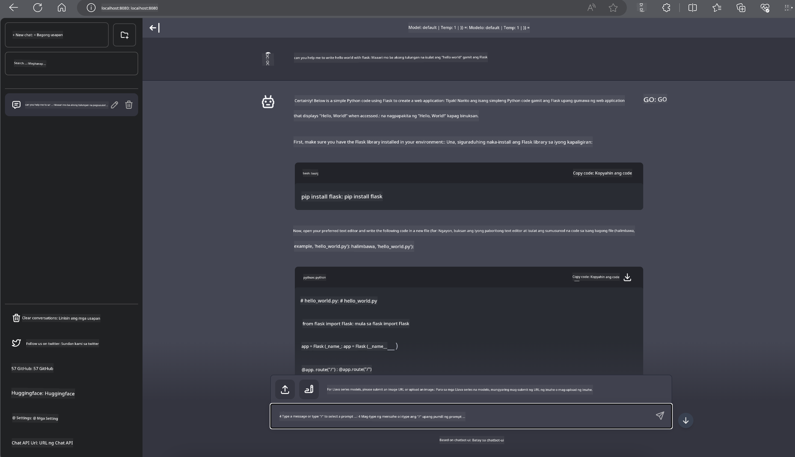

<!--
CO_OP_TRANSLATOR_METADATA:
{
  "original_hash": "be4101a30d98e95a71d42c276e8bcd37",
  "translation_date": "2025-05-09T11:42:47+00:00",
  "source_file": "md/01.Introduction/03/Jetson_Inference.md",
  "language_code": "tl"
}
-->
# **Inference Phi-3 sa Nvidia Jetson**

Ang Nvidia Jetson ay isang serye ng embedded computing boards mula sa Nvidia. Ang mga modelong Jetson TK1, TX1, at TX2 ay lahat may Tegra processor (o SoC) mula sa Nvidia na may kasamang ARM architecture central processing unit (CPU). Ang Jetson ay isang low-power system na dinisenyo para pabilisin ang mga machine learning na aplikasyon. Ginagamit ang Nvidia Jetson ng mga propesyonal na developer upang gumawa ng mga makabagong AI na produkto sa iba't ibang industriya, pati na rin ng mga estudyante at mga mahilig para sa hands-on na pag-aaral ng AI at paggawa ng mga kahanga-hangang proyekto. Ang SLM ay inilalagay sa mga edge device tulad ng Jetson, na nagpapahintulot ng mas mahusay na implementasyon ng mga industrial generative AI application scenarios.

## Deployment sa NVIDIA Jetson:
Maaaring gamitin ng mga developer na nagtatrabaho sa autonomous robotics at embedded devices ang Phi-3 Mini. Dahil sa maliit na sukat ng Phi-3, ito ay perpekto para sa edge deployment. Ang mga parameter ay maingat na na-tune habang training upang matiyak ang mataas na katumpakan sa mga sagot.

### TensorRT-LLM Optimization:
Ang [TensorRT-LLM library](https://github.com/NVIDIA/TensorRT-LLM?WT.mc_id=aiml-138114-kinfeylo) ng NVIDIA ay nag-ooptimize ng large language model inference. Sinusuportahan nito ang long context window ng Phi-3 Mini, na nagpapabuti sa throughput at latency. Kasama sa mga optimizations ang mga teknik tulad ng LongRoPE, FP8, at inflight batching.

### Availability at Deployment:
Maaaring subukan ng mga developer ang Phi-3 Mini na may 128K context window sa [NVIDIA's AI](https://www.nvidia.com/en-us/ai-data-science/generative-ai/). Nakapackage ito bilang isang NVIDIA NIM, isang microservice na may standard API na maaaring i-deploy kahit saan. Bukod dito, naroon din ang [TensorRT-LLM implementations sa GitHub](https://github.com/NVIDIA/TensorRT-LLM).

## **1. Paghahanda**

a. Jetson Orin NX / Jetson NX

b. JetPack 5.1.2+

c. Cuda 11.8

d. Python 3.8+

## **2. Pagpapatakbo ng Phi-3 sa Jetson**

Maaari nating piliin ang [Ollama](https://ollama.com) o [LlamaEdge](https://llamaedge.com)

Kung nais mong gamitin ang gguf sa cloud at edge devices nang sabay, maaaring ituring ang LlamaEdge bilang WasmEdge (ang WasmEdge ay isang magaan, mataas ang performance, at scalable na WebAssembly runtime na angkop para sa cloud native, edge, at decentralized na mga aplikasyon. Sinusuportahan nito ang serverless applications, embedded functions, microservices, smart contracts, at IoT devices. Maaari mong i-deploy ang quantitative model ng gguf sa edge devices at cloud gamit ang LlamaEdge.


Narito ang mga hakbang para gamitin ito:

1. I-install at i-download ang mga kaugnay na libraries at files

```bash

curl -sSf https://raw.githubusercontent.com/WasmEdge/WasmEdge/master/utils/install.sh | bash -s -- --plugin wasi_nn-ggml

curl -LO https://github.com/LlamaEdge/LlamaEdge/releases/latest/download/llama-api-server.wasm

curl -LO https://github.com/LlamaEdge/chatbot-ui/releases/latest/download/chatbot-ui.tar.gz

tar xzf chatbot-ui.tar.gz

```

**Note**: Kailangan magkasama sa iisang directory ang llama-api-server.wasm at chatbot-ui

2. Patakbuhin ang mga script sa terminal

```bash

wasmedge --dir .:. --nn-preload default:GGML:AUTO:{Your gguf path} llama-api-server.wasm -p phi-3-chat

```

Narito ang resulta ng pagpapatakbo



***Sample code*** [Phi-3 mini WASM Notebook Sample](https://github.com/Azure-Samples/Phi-3MiniSamples/tree/main/wasm)

Sa kabuuan, ang Phi-3 Mini ay isang malaking hakbang pasulong sa language modeling, na pinagsasama ang kahusayan, context awareness, at ang optimization ng NVIDIA. Kung ikaw man ay gumagawa ng mga robot o edge applications, ang Phi-3 Mini ay isang makapangyarihang kasangkapan na dapat mong malaman.

**Pagtatanggol:**  
Ang dokumentong ito ay isinalin gamit ang serbisyong AI na pagsasalin [Co-op Translator](https://github.com/Azure/co-op-translator). Bagamat aming pinagsisikapang maging tumpak, pakatandaan na ang mga awtomatikong pagsasalin ay maaaring maglaman ng mga pagkakamali o di-tumpak na impormasyon. Ang orihinal na dokumento sa orihinal nitong wika ang dapat ituring na pangunahing sanggunian. Para sa mahahalagang impormasyon, inirerekomenda ang propesyonal na pagsasalin ng tao. Hindi kami mananagot sa anumang hindi pagkakaunawaan o maling interpretasyon na maaaring magmula sa paggamit ng pagsasaling ito.