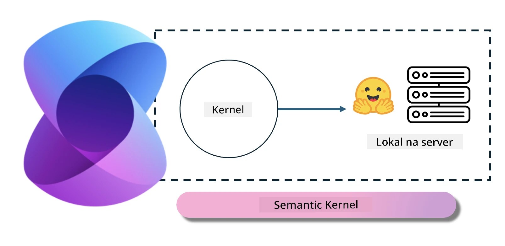
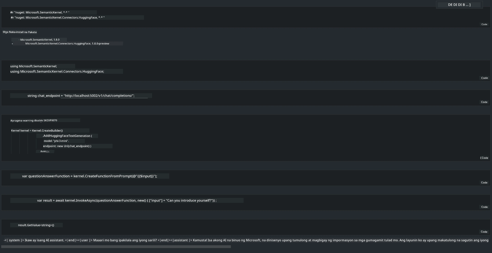

# **Inference Phi-3 sa Lokal na Server**

Maaari nating i-deploy ang Phi-3 sa isang lokal na server. Puwedeng pumili ang mga user ng [Ollama](https://ollama.com) o [LM Studio](https://llamaedge.com) na mga solusyon, o kaya ay gumawa ng sarili nilang code. Maaari mong ikonekta ang mga lokal na serbisyo ng Phi-3 gamit ang [Semantic Kernel](https://github.com/microsoft/semantic-kernel?WT.mc_id=aiml-138114-kinfeylo) o [Langchain](https://www.langchain.com/) para makabuo ng mga Copilot na aplikasyon.

## **Gamitin ang Semantic Kernel para ma-access ang Phi-3-mini**

Sa Copilot na aplikasyon, gumagawa tayo ng mga aplikasyon gamit ang Semantic Kernel / LangChain. Ang ganitong uri ng application framework ay karaniwang compatible sa Azure OpenAI Service / OpenAI models, at kaya rin suportahan ang mga open source na modelo sa Hugging Face at mga lokal na modelo. Ano ang dapat gawin kung gusto nating gamitin ang Semantic Kernel para ma-access ang Phi-3-mini? Gamit ang .NET bilang halimbawa, maaari natin itong pagsamahin sa Hugging Face Connector sa Semantic Kernel. Sa default, ito ay tumutugma sa model id sa Hugging Face (sa unang paggamit, ida-download ang modelo mula sa Hugging Face, kaya tumatagal ito). Maaari mo ring ikonekta ang sariling lokal na serbisyo na naitayo. Kung ikukumpara ang dalawa, inirerekomenda namin ang huli dahil mas mataas ang antas ng awtonomiya nito, lalo na sa mga aplikasyon ng negosyo.

Mula sa larawan, ang pag-access sa mga lokal na serbisyo gamit ang Semantic Kernel ay madaling nakakonekta sa sariling itinayong Phi-3-mini na model server. Narito ang resulta ng pagpapatakbo

***Sample Code*** https://github.com/kinfey/Phi3MiniSamples/tree/main/semantickernel

**Paalala**:  
Ang dokumentong ito ay isinalin gamit ang AI translation service na [Co-op Translator](https://github.com/Azure/co-op-translator). Bagamat nagsusumikap kami para sa katumpakan, pakatandaan na ang mga awtomatikong pagsasalin ay maaaring maglaman ng mga pagkakamali o di-tumpak na impormasyon. Ang orihinal na dokumento sa kanyang sariling wika ang dapat ituring na pangunahing sanggunian. Para sa mahahalagang impormasyon, inirerekomenda ang propesyonal na pagsasalin ng tao. Hindi kami mananagot sa anumang hindi pagkakaunawaan o maling interpretasyon na maaaring magmula sa paggamit ng pagsasaling ito.