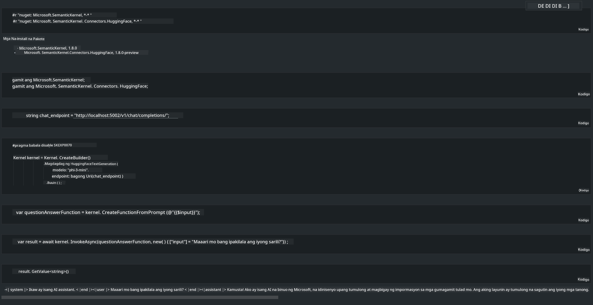

<!--
CO_OP_TRANSLATOR_METADATA:
{
  "original_hash": "bcf5dd7031db0031abdb9dd0c05ba118",
  "translation_date": "2025-05-09T12:07:21+00:00",
  "source_file": "md/01.Introduction/03/Local_Server_Inference.md",
  "language_code": "tl"
}
-->
# **Inference Phi-3 sa Lokal na Server**

Maaaring i-deploy ang Phi-3 sa isang lokal na server. Puwedeng pumili ang mga user ng [Ollama](https://ollama.com) o [LM Studio](https://llamaedge.com) na solusyon, o kaya naman ay gumawa ng sariling code. Maaari mong ikonekta ang mga lokal na serbisyo ng Phi-3 gamit ang [Semantic Kernel](https://github.com/microsoft/semantic-kernel?WT.mc_id=aiml-138114-kinfeylo) o [Langchain](https://www.langchain.com/) para makabuo ng mga Copilot na aplikasyon.

## **Gamitin ang Semantic Kernel para ma-access ang Phi-3-mini**

Sa Copilot na aplikasyon, gumagawa tayo ng mga aplikasyon gamit ang Semantic Kernel / LangChain. Ang ganitong uri ng application framework ay karaniwang compatible sa Azure OpenAI Service / OpenAI models, at kaya rin nitong suportahan ang open source na mga modelo sa Hugging Face pati na rin ang mga lokal na modelo. Ano ang dapat gawin kung gusto nating gamitin ang Semantic Kernel para ma-access ang Phi-3-mini? Gamitin ang .NET bilang halimbawa, maaari itong pagsamahin sa Hugging Face Connector sa Semantic Kernel. Sa default, ito ay tumutugma sa model id sa Hugging Face (sa unang gamit nito, idi-download ang modelo mula sa Hugging Face na medyo matagal). Maaari mo ring ikonekta ito sa sariling ginawa mong lokal na serbisyo. Sa dalawa, inirerekomenda naming gamitin ang huli dahil mas mataas ang antas ng kontrol, lalo na sa mga enterprise na aplikasyon.

Mula sa larawan, ang pag-access sa lokal na serbisyo gamit ang Semantic Kernel ay madaling nakakonekta sa self-built na Phi-3-mini model server. Narito ang resulta ng pagpapatakbo

***Sample Code*** https://github.com/kinfey/Phi3MiniSamples/tree/main/semantickernel

**Pagtatangi**:  
Ang dokumentong ito ay isinalin gamit ang AI translation service na [Co-op Translator](https://github.com/Azure/co-op-translator). Bagamat nagsusumikap kami para sa katumpakan, pakatandaan na ang mga awtomatikong pagsasalin ay maaaring maglaman ng mga pagkakamali o hindi pagkakatugma. Ang orihinal na dokumento sa kanyang sariling wika ang dapat ituring na opisyal na sanggunian. Para sa mahahalagang impormasyon, inirerekomenda ang propesyonal na pagsasalin ng tao. Hindi kami mananagot sa anumang hindi pagkakaunawaan o maling interpretasyon na maaaring magmula sa paggamit ng pagsasaling ito.