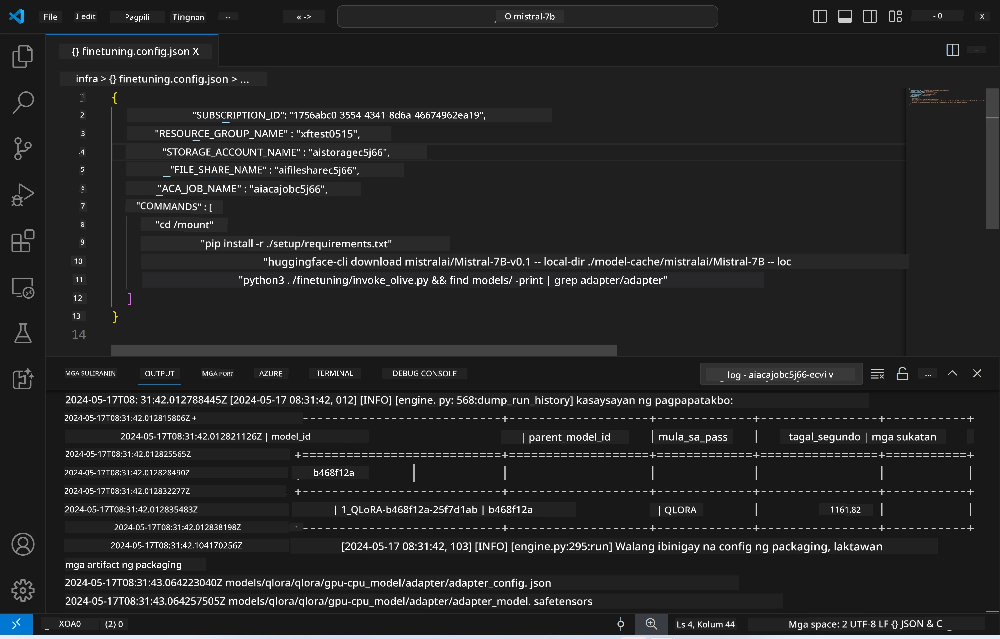
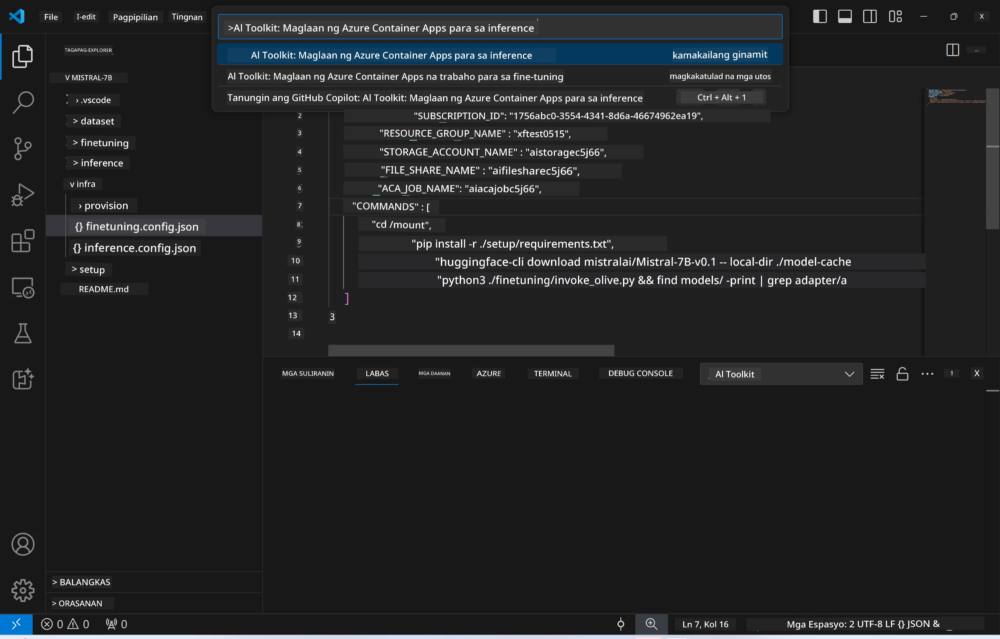
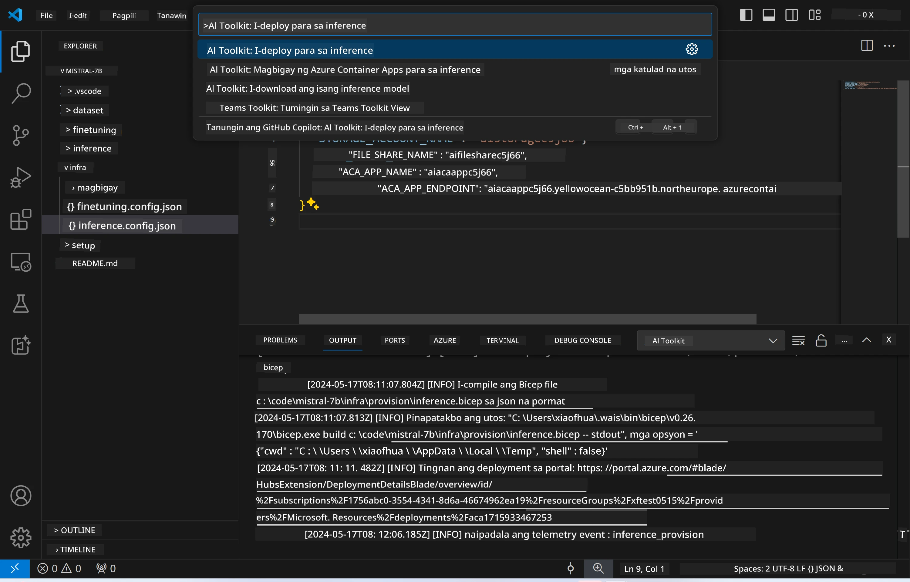
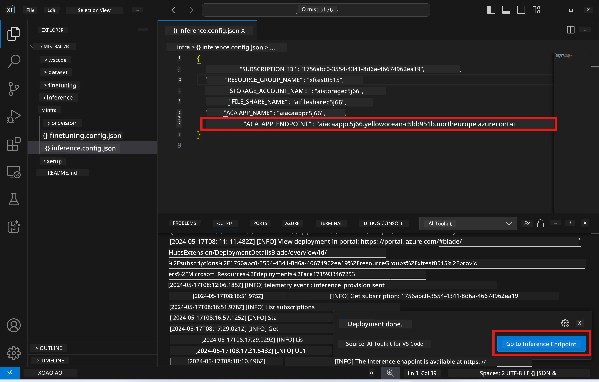

<!--
CO_OP_TRANSLATOR_METADATA:
{
  "original_hash": "a54cd3d65b6963e4e8ce21e143c3ab04",
  "translation_date": "2025-07-16T21:21:12+00:00",
  "source_file": "md/01.Introduction/03/Remote_Interence.md",
  "language_code": "tl"
}
-->
# Remote Inferencing gamit ang fine-tuned na modelo

Pagkatapos ma-train ang mga adapter sa remote na kapaligiran, gamitin ang isang simpleng Gradio application para makipag-ugnayan sa modelo.



### Pag-provision ng Azure Resources  
Kailangan mong i-setup ang Azure Resources para sa remote inference sa pamamagitan ng pagpapatakbo ng `AI Toolkit: Provision Azure Container Apps for inference` mula sa command palette. Sa proseso ng setup na ito, hihilingin kang pumili ng iyong Azure Subscription at resource group.  

   
Sa default, ang subscription at resource group para sa inference ay dapat tumugma sa mga ginamit sa fine-tuning. Gagamitin ng inference ang parehong Azure Container App Environment at maa-access ang modelo at model adapter na naka-imbak sa Azure Files, na nalikha noong fine-tuning na hakbang. 

## Paggamit ng AI Toolkit 

### Deployment para sa Inference  
Kung nais mong baguhin ang inference code o i-reload ang inference model, patakbuhin ang `AI Toolkit: Deploy for inference` na command. Ito ay magsi-synchronize ng iyong pinakabagong code sa ACA at ire-restart ang replica.  



Pagkatapos ng matagumpay na deployment, handa na ang modelo para sa pagsusuri gamit ang endpoint na ito.

### Pag-access sa Inference API

Maaari mong ma-access ang inference API sa pamamagitan ng pag-click sa "*Go to Inference Endpoint*" na button na makikita sa VSCode notification. Bilang alternatibo, ang web API endpoint ay matatagpuan sa ilalim ng `ACA_APP_ENDPOINT` sa `./infra/inference.config.json` at sa output panel.



> **Note:** Maaaring tumagal ng ilang minuto bago tuluyang maging operational ang inference endpoint.

## Mga Komponent ng Inference na Kasama sa Template
 
| Folder | Nilalaman |
| ------ |--------- |
| `infra` | Naglalaman ng lahat ng kinakailangang configuration para sa remote operations. |
| `infra/provision/inference.parameters.json` | Naglalaman ng mga parameter para sa bicep templates, na ginagamit sa pag-provision ng Azure resources para sa inference. |
| `infra/provision/inference.bicep` | Naglalaman ng mga template para sa pag-provision ng Azure resources para sa inference. |
| `infra/inference.config.json` | Ang configuration file, na nalikha ng `AI Toolkit: Provision Azure Container Apps for inference` na command. Ginagamit ito bilang input para sa iba pang remote command palettes. |

### Paggamit ng AI Toolkit para sa pag-configure ng Azure Resource Provision  
I-configure ang [AI Toolkit](https://marketplace.visualstudio.com/items?itemName=ms-windows-ai-studio.windows-ai-studio)

Patakbuhin ang `Provision Azure Container Apps for inference` na command.

Makikita mo ang mga configuration parameter sa `./infra/provision/inference.parameters.json` na file. Narito ang mga detalye:
| Parameter | Paglalarawan |
| --------- |------------ |
| `defaultCommands` | Ito ang mga command para simulan ang web API. |
| `maximumInstanceCount` | Itinakda ng parameter na ito ang pinakamataas na kapasidad ng GPU instances. |
| `location` | Ito ang lokasyon kung saan ipo-provision ang Azure resources. Ang default na halaga ay kapareho ng lokasyon ng piniling resource group. |
| `storageAccountName`, `fileShareName`, `acaEnvironmentName`, `acaEnvironmentStorageName`, `acaAppName`,  `acaLogAnalyticsName` | Ginagamit ang mga parameter na ito para pangalanan ang Azure resources na ipo-provision. Sa default, pareho ito sa pangalan ng fine-tuning resource. Maaari kang maglagay ng bagong pangalan ng resource na hindi pa nagagamit para makagawa ng sarili mong custom-named resources, o maaari mong ilagay ang pangalan ng isang existing na Azure resource kung nais mong gamitin iyon. Para sa karagdagang detalye, tingnan ang seksyong [Using existing Azure Resources](../../../../../md/01.Introduction/03). |

### Paggamit ng Existing Azure Resources

Sa default, ang inference provision ay gumagamit ng parehong Azure Container App Environment, Storage Account, Azure File Share, at Azure Log Analytics na ginamit sa fine-tuning. Isang hiwalay na Azure Container App ang nilikha para lamang sa inference API. 

Kung na-customize mo ang Azure resources noong fine-tuning o nais mong gamitin ang sarili mong existing Azure resources para sa inference, tukuyin ang kanilang mga pangalan sa `./infra/inference.parameters.json` na file. Pagkatapos, patakbuhin ang `AI Toolkit: Provision Azure Container Apps for inference` na command mula sa command palette. Iu-update nito ang anumang tinukoy na resources at gagawa ng mga nawawala.

Halimbawa, kung mayroon kang existing na Azure container environment, ang iyong `./infra/finetuning.parameters.json` ay dapat ganito:

```json
{
    "$schema": "https://schema.management.azure.com/schemas/2019-04-01/deploymentParameters.json#",
    "contentVersion": "1.0.0.0",
    "parameters": {
      ...
      "acaEnvironmentName": {
        "value": "<your-aca-env-name>"
      },
      "acaEnvironmentStorageName": {
        "value": null
      },
      ...
    }
  }
```

### Manual Provision  
Kung nais mong mano-manong i-configure ang Azure resources, maaari mong gamitin ang mga bicep files na nasa `./infra/provision` na folder. Kung na-setup at na-configure mo na ang lahat ng Azure resources nang hindi gumagamit ng AI Toolkit command palette, maaari mo lamang ilagay ang mga pangalan ng resource sa `inference.config.json` na file.

Halimbawa:

```json
{
  "SUBSCRIPTION_ID": "<your-subscription-id>",
  "RESOURCE_GROUP_NAME": "<your-resource-group-name>",
  "STORAGE_ACCOUNT_NAME": "<your-storage-account-name>",
  "FILE_SHARE_NAME": "<your-file-share-name>",
  "ACA_APP_NAME": "<your-aca-name>",
  "ACA_APP_ENDPOINT": "<your-aca-endpoint>"
}
```

**Paalala**:  
Ang dokumentong ito ay isinalin gamit ang AI translation service na [Co-op Translator](https://github.com/Azure/co-op-translator). Bagamat nagsusumikap kami para sa katumpakan, pakatandaan na ang mga awtomatikong pagsasalin ay maaaring maglaman ng mga pagkakamali o di-tumpak na impormasyon. Ang orihinal na dokumento sa orihinal nitong wika ang dapat ituring na pangunahing sanggunian. Para sa mahahalagang impormasyon, inirerekomenda ang propesyonal na pagsasalin ng tao. Hindi kami mananagot sa anumang hindi pagkakaunawaan o maling interpretasyon na maaaring magmula sa paggamit ng pagsasaling ito.