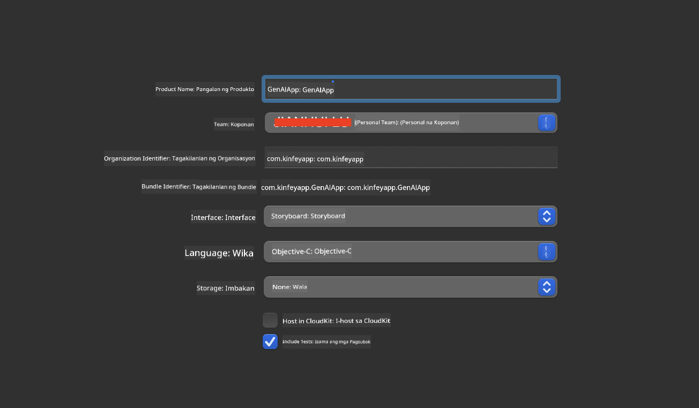
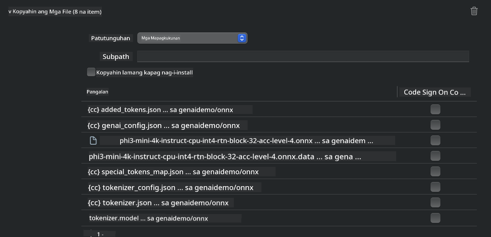
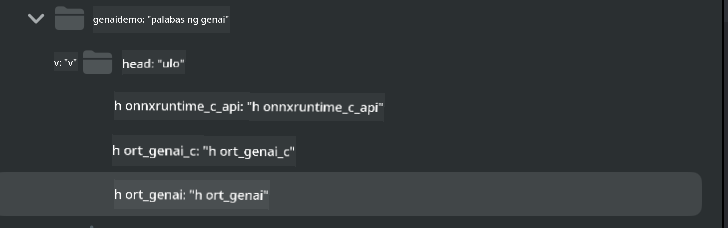
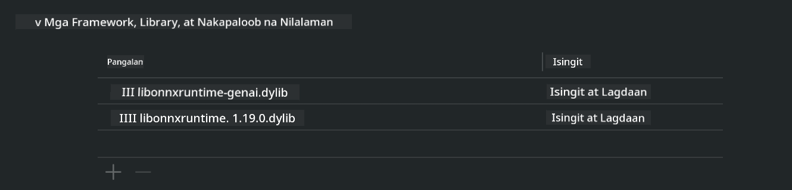
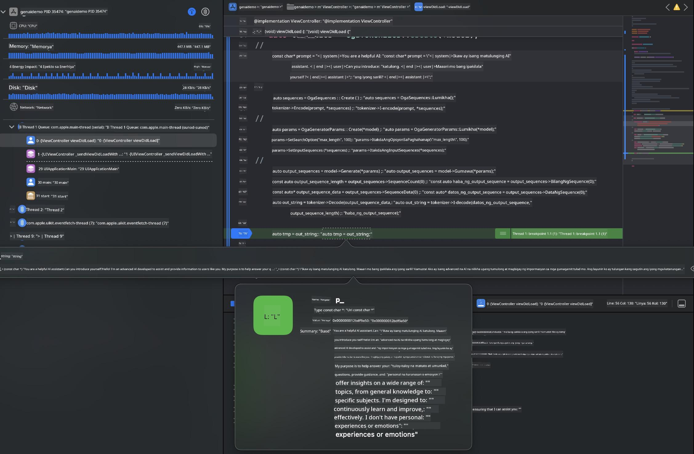

<!--
CO_OP_TRANSLATOR_METADATA:
{
  "original_hash": "82af197df38d25346a98f1f0e84d1698",
  "translation_date": "2025-05-09T11:03:27+00:00",
  "source_file": "md/01.Introduction/03/iOS_Inference.md",
  "language_code": "tl"
}
-->
# **Inference Phi-3 sa iOS**

Ang Phi-3-mini ay isang bagong serye ng mga modelo mula sa Microsoft na nagpapahintulot ng deployment ng Large Language Models (LLMs) sa mga edge device at IoT device. Available ang Phi-3-mini para sa iOS, Android, at Edge Device deployments, na nagbibigay-daan sa generative AI na ma-deploy sa BYOD na mga kapaligiran. Ipinapakita ng sumusunod na halimbawa kung paano i-deploy ang Phi-3-mini sa iOS.

## **1. Paghahanda**

- **a.** macOS 14+
- **b.** Xcode 15+
- **c.** iOS SDK 17.x (iPhone 14 A16 pataas)
- **d.** I-install ang Python 3.10+ (Inirerekomenda ang Conda)
- **e.** I-install ang Python library: `python-flatbuffers`
- **f.** I-install ang CMake

### Semantic Kernel at Inference

Ang Semantic Kernel ay isang application framework na nagpapahintulot sa paggawa ng mga application na compatible sa Azure OpenAI Service, OpenAI models, at pati na rin sa mga lokal na modelo. Ang pag-access sa mga lokal na serbisyo gamit ang Semantic Kernel ay nagpapadali ng integrasyon sa iyong self-hosted na Phi-3-mini model server.

### Pagtawag sa mga Quantized Models gamit ang Ollama o LlamaEdge

Maraming gumagamit ang mas gusto ang paggamit ng quantized models para patakbuhin ang mga modelo nang lokal. Pinapayagan ng [Ollama](https://ollama.com) at [LlamaEdge](https://llamaedge.com) ang mga user na tumawag sa iba't ibang quantized models:

#### **Ollama**

Pwede mong patakbuhin ang `ollama run phi3` nang direkta o i-configure ito offline. Gumawa ng Modelfile na may path sa iyong `gguf` file. Halimbawang code para patakbuhin ang Phi-3-mini quantized model:

```gguf
FROM {Add your gguf file path}
TEMPLATE \"\"\"<|user|> .Prompt<|end|> <|assistant|>\"\"\"
PARAMETER stop <|end|>
PARAMETER num_ctx 4096
```

#### **LlamaEdge**

Kung nais mong gamitin ang `gguf` sa parehong cloud at edge device nang sabay, magandang opsyon ang LlamaEdge.

## **2. Pag-compile ng ONNX Runtime para sa iOS**

```bash

git clone https://github.com/microsoft/onnxruntime.git

cd onnxruntime

./build.sh --build_shared_lib --ios --skip_tests --parallel --build_dir ./build_ios --ios --apple_sysroot iphoneos --osx_arch arm64 --apple_deploy_target 17.5 --cmake_generator Xcode --config Release

cd ../

```

### **Paalala**

- **a.** Bago mag-compile, siguraduhing maayos ang pagkaka-configure ng Xcode at itakda ito bilang active developer directory sa terminal:

    ```bash
    sudo xcode-select -switch /Applications/Xcode.app/Contents/Developer
    ```

- **b.** Kailangang i-compile ang ONNX Runtime para sa iba't ibang platform. Para sa iOS, pwede kang mag-compile para sa `arm64` or `x86_64`.

- **c.** Inirerekomenda ang paggamit ng pinakabagong iOS SDK para sa pag-compile. Pero pwede ka ring gumamit ng mas lumang bersyon kung kailangan ng compatibility sa mga naunang SDK.

## **3. Pag-compile ng Generative AI gamit ang ONNX Runtime para sa iOS**

> **Note:** Dahil ang Generative AI gamit ang ONNX Runtime ay nasa preview pa, asahan ang posibleng mga pagbabago.

```bash

git clone https://github.com/microsoft/onnxruntime-genai
 
cd onnxruntime-genai
 
mkdir ort
 
cd ort
 
mkdir include
 
mkdir lib
 
cd ../
 
cp ../onnxruntime/include/onnxruntime/core/session/onnxruntime_c_api.h ort/include
 
cp ../onnxruntime/build_ios/Release/Release-iphoneos/libonnxruntime*.dylib* ort/lib
 
export OPENCV_SKIP_XCODEBUILD_FORCE_TRYCOMPILE_DEBUG=1
 
python3 build.py --parallel --build_dir ./build_ios --ios --ios_sysroot iphoneos --ios_arch arm64 --ios_deployment_target 17.5 --cmake_generator Xcode --cmake_extra_defines CMAKE_XCODE_ATTRIBUTE_CODE_SIGNING_ALLOWED=NO

```

## **4. Gumawa ng App application sa Xcode**

Pinili ko ang Objective-C bilang paraan ng pag-develop ng App, dahil sa paggamit ng Generative AI gamit ang ONNX Runtime C++ API, mas compatible ang Objective-C. Siyempre, pwede mo ring gawin ang mga kaugnay na tawag gamit ang Swift bridging.



## **5. Kopyahin ang ONNX quantized INT4 model sa App application project**

Kailangan nating i-import ang INT4 quantization model sa ONNX format, na kailangang i-download muna


Pagkatapos ma-download, kailangan itong idagdag sa Resources directory ng proyekto sa Xcode.



## **6. Pagdagdag ng C++ API sa ViewControllers**

> **Paalala:**

- **a.** Idagdag ang mga kaukulang C++ header files sa proyekto.

  

- **b.** Isama ang `onnxruntime-genai` dynamic library in Xcode.

  

- **c.** Use the C Samples code for testing. You can also add additional features like ChatUI for more functionality.

- **d.** Since you need to use C++ in your project, rename `ViewController.m` to `ViewController.mm` para paganahin ang Objective-C++ support.

```objc

    NSString *llmPath = [[NSBundle mainBundle] resourcePath];
    char const *modelPath = llmPath.cString;

    auto model =  OgaModel::Create(modelPath);

    auto tokenizer = OgaTokenizer::Create(*model);

    const char* prompt = "<|system|>You are a helpful AI assistant.<|end|><|user|>Can you introduce yourself?<|end|><|assistant|>";

    auto sequences = OgaSequences::Create();
    tokenizer->Encode(prompt, *sequences);

    auto params = OgaGeneratorParams::Create(*model);
    params->SetSearchOption("max_length", 100);
    params->SetInputSequences(*sequences);

    auto output_sequences = model->Generate(*params);
    const auto output_sequence_length = output_sequences->SequenceCount(0);
    const auto* output_sequence_data = output_sequences->SequenceData(0);
    auto out_string = tokenizer->Decode(output_sequence_data, output_sequence_length);
    
    auto tmp = out_string;

```

## **7. Pagpapatakbo ng Application**

Kapag kumpleto na ang setup, pwede mo nang patakbuhin ang application para makita ang resulta ng Phi-3-mini model inference.



Para sa karagdagang sample code at detalyadong mga tagubilin, bisitahin ang [Phi-3 Mini Samples repository](https://github.com/Azure-Samples/Phi-3MiniSamples/tree/main/ios).

**Paalala**:  
Ang dokumentong ito ay isinalin gamit ang AI translation service na [Co-op Translator](https://github.com/Azure/co-op-translator). Bagamat nagsusumikap kami para sa katumpakan, pakatandaan na ang awtomatikong pagsasalin ay maaaring maglaman ng mga pagkakamali o di-tumpak na impormasyon. Ang orihinal na dokumento sa orihinal nitong wika ang dapat ituring na pangunahing sanggunian. Para sa mahahalagang impormasyon, inirerekomenda ang propesyonal na pagsasalin ng tao. Hindi kami mananagot sa anumang hindi pagkakaunawaan o maling interpretasyon na maaaring magmula sa paggamit ng pagsasaling ito.