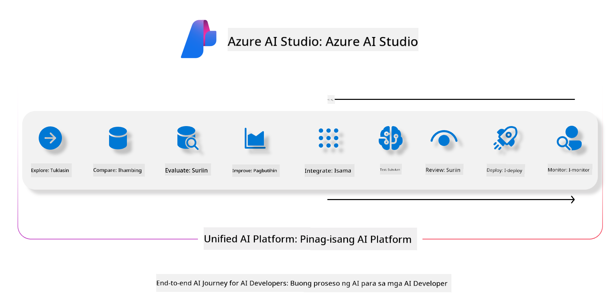
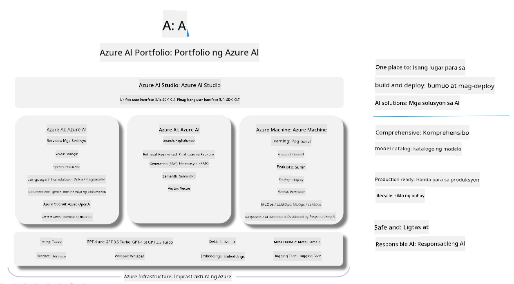

<!--
CO_OP_TRANSLATOR_METADATA:
{
  "original_hash": "7b4235159486df4000e16b7b46ddfec3",
  "translation_date": "2025-05-09T15:02:01+00:00",
  "source_file": "md/01.Introduction/05/AIFoundry.md",
  "language_code": "tl"
}
-->
# **Paggamit ng Azure AI Foundry para sa pagsusuri**

Paano suriin ang iyong generative AI application gamit ang [Azure AI Foundry](https://ai.azure.com?WT.mc_id=aiml-138114-kinfeylo). Kahit na sinusuri mo ang single-turn o multi-turn na mga pag-uusap, nagbibigay ang Azure AI Foundry ng mga kasangkapan para sa pagsusuri ng performance at kaligtasan ng modelo.

## Paano suriin ang generative AI apps gamit ang Azure AI Foundry
Para sa mas detalyadong gabay, tingnan ang [Azure AI Foundry Documentation](https://learn.microsoft.com/azure/ai-studio/how-to/evaluate-generative-ai-app?WT.mc_id=aiml-138114-kinfeylo)

Narito ang mga hakbang upang makapagsimula:

## Pagsusuri ng Generative AI Models sa Azure AI Foundry

**Mga Kinakailangan**

- Isang test dataset na nasa CSV o JSON na format.
- Isang naka-deploy na generative AI model (tulad ng Phi-3, GPT 3.5, GPT 4, o Davinci models).
- Isang runtime na may compute instance para patakbuhin ang pagsusuri.

## Mga Built-in na Evaluation Metrics

Pinapayagan ng Azure AI Foundry na suriin ang parehong single-turn at mas kumplikadong multi-turn na mga pag-uusap.  
Para sa Retrieval Augmented Generation (RAG) na mga senaryo, kung saan naka-base ang modelo sa partikular na data, maaari mong suriin ang performance gamit ang mga built-in na evaluation metrics.  
Bukod dito, maaari mo ring suriin ang mga pangkalahatang single-turn question answering na senaryo (hindi RAG).

## Paggawa ng Evaluation Run

Mula sa Azure AI Foundry UI, pumunta sa Evaluate page o sa Prompt Flow page.  
Sundin ang evaluation creation wizard para i-setup ang isang evaluation run. Magbigay ng opsyonal na pangalan para sa iyong pagsusuri.  
Piliin ang senaryo na tumutugma sa layunin ng iyong application.  
Pumili ng isa o higit pang evaluation metrics para suriin ang output ng modelo.

## Custom Evaluation Flow (Opsyonal)

Para sa mas malawak na kakayahan, maaari kang gumawa ng custom evaluation flow. I-customize ang proseso ng pagsusuri base sa iyong mga partikular na pangangailangan.

## Pagtingin sa Resulta

Pagkatapos patakbuhin ang pagsusuri, i-log, tingnan, at suriin ang detalyadong evaluation metrics sa Azure AI Foundry. Makakuha ng mga insight tungkol sa kakayahan at limitasyon ng iyong application.

**Note** Azure AI Foundry ay kasalukuyang nasa public preview pa lamang, kaya gamitin ito para sa eksperimento at development. Para sa production workloads, isaalang-alang ang iba pang mga opsyon. Bisitahin ang opisyal na [AI Foundry documentation](https://learn.microsoft.com/azure/ai-studio/?WT.mc_id=aiml-138114-kinfeylo) para sa karagdagang detalye at step-by-step na mga tagubilin.

**Pagtatanggol**:  
Ang dokumentong ito ay isinalin gamit ang serbisyong AI na pagsasalin na [Co-op Translator](https://github.com/Azure/co-op-translator). Bagaman nagsusumikap kami para sa katumpakan, pakatandaan na ang mga awtomatikong pagsasalin ay maaaring maglaman ng mga pagkakamali o di-tumpak na impormasyon. Ang orihinal na dokumento sa orihinal nitong wika ang dapat ituring na pangunahing sanggunian. Para sa mahahalagang impormasyon, inirerekomenda ang propesyonal na pagsasalin ng tao. Hindi kami mananagot sa anumang maling pagkaunawa o maling interpretasyon na maaaring magmula sa paggamit ng pagsasaling ito.