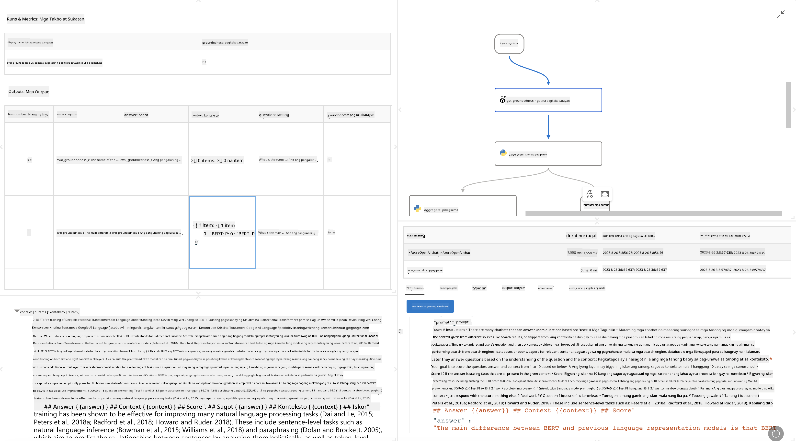

<!--
CO_OP_TRANSLATOR_METADATA:
{
  "original_hash": "3cbe7629d254f1043193b7fe22524d55",
  "translation_date": "2025-07-16T22:43:23+00:00",
  "source_file": "md/01.Introduction/05/Promptflow.md",
  "language_code": "tl"
}
-->
# **Ipakilala ang Promptflow**

Ang [Microsoft Prompt Flow](https://microsoft.github.io/promptflow/index.html?WT.mc_id=aiml-138114-kinfeylo) ay isang visual workflow automation tool na nagpapahintulot sa mga gumagamit na gumawa ng automated workflows gamit ang mga pre-built na template at custom connectors. Dinisenyo ito upang tulungan ang mga developer at business analyst na mabilis na makabuo ng mga automated na proseso para sa mga gawain tulad ng pamamahala ng data, kolaborasyon, at pag-optimize ng proseso. Sa Prompt Flow, madali mong mapag-uugnay ang iba't ibang serbisyo, aplikasyon, at sistema, at ma-automate ang mga kumplikadong proseso ng negosyo.

Ang Microsoft Prompt Flow ay nilikha upang gawing mas madali ang end-to-end development cycle ng mga AI application na pinapagana ng Large Language Models (LLMs). Mapa-ideate, prototype, test, evaluate, o deploy ng LLM-based na mga aplikasyon, pinapasimple ng Prompt Flow ang proseso at nagbibigay-daan sa iyo na makabuo ng mga LLM app na may kalidad para sa produksyon.

## Narito ang mga pangunahing tampok at benepisyo ng paggamit ng Microsoft Prompt Flow:

**Interactive Authoring Experience**

Nagbibigay ang Prompt Flow ng visual na representasyon ng istruktura ng iyong flow, kaya madali itong maintindihan at i-navigate sa iyong mga proyekto.  
Nag-aalok ito ng notebook-like na karanasan sa pag-code para sa mas epektibong pagbuo at pag-debug ng flow.

**Prompt Variants and Tuning**

Gumawa at ikumpara ang iba't ibang variant ng prompt upang mapadali ang iterative na proseso ng pagpapabuti. Suriin ang performance ng iba't ibang prompt at piliin ang pinakaepektibo.

**Built-in Evaluation Flows**

Suriin ang kalidad at bisa ng iyong mga prompt at flow gamit ang mga built-in na evaluation tools.  
Unawain kung gaano kahusay ang performance ng iyong mga LLM-based na aplikasyon.

**Comprehensive Resources**

Kasama sa Prompt Flow ang isang library ng mga built-in na tool, sample, at template. Ang mga ito ay nagsisilbing panimulang punto para sa development, nagbibigay inspirasyon sa paglikha, at nagpapabilis ng proseso.

**Collaboration and Enterprise Readiness**

Suportahan ang kolaborasyon ng team sa pamamagitan ng pagpapahintulot sa maraming user na magtrabaho nang sabay sa mga prompt engineering na proyekto.  
Panatilihin ang version control at epektibong maibahagi ang kaalaman. Pabilisin ang buong proseso ng prompt engineering mula development, evaluation, hanggang deployment at monitoring.

## Evaluation sa Prompt Flow

Sa Microsoft Prompt Flow, mahalaga ang evaluation sa pagtukoy kung gaano kahusay ang performance ng iyong AI models. Tingnan natin kung paano mo maiaangkop ang evaluation flows at metrics sa loob ng Prompt Flow:

**Pag-unawa sa Evaluation sa Prompt Flow**

Sa Prompt Flow, ang flow ay kumakatawan sa isang sunod-sunod na mga node na nagpoproseso ng input at lumilikha ng output. Ang evaluation flows ay espesyal na uri ng flow na idinisenyo upang suriin ang performance ng isang run base sa mga partikular na criteria at layunin.

**Pangunahing tampok ng evaluation flows**

Karaniwang tumatakbo ito pagkatapos ng flow na sinusubukan, gamit ang mga output nito. Kinakalkula nito ang mga score o metrics upang masukat ang performance ng sinusubukang flow. Maaaring kabilang sa metrics ang accuracy, relevance scores, o iba pang kaugnay na sukatan.

### Pag-customize ng Evaluation Flows

**Pagdedeklara ng Inputs**

Kailangang tanggapin ng evaluation flows ang mga output ng run na sinusuri. I-define ang inputs tulad ng sa mga karaniwang flow.  
Halimbawa, kung sinusuri mo ang isang QnA flow, pangalanan ang input na "answer." Kung sinusuri ang classification flow, pangalanan ang input na "category." Maaaring kailanganin din ang ground truth inputs (hal. aktwal na mga label).

**Outputs at Metrics**

Nagbibigay ang evaluation flows ng mga resulta na sumusukat sa performance ng sinusubukang flow. Maaaring kalkulahin ang metrics gamit ang Python o LLM (Large Language Models). Gamitin ang log_metric() function para i-log ang mga kaugnay na metrics.

**Paggamit ng Customized Evaluation Flows**

Bumuo ng sarili mong evaluation flow na nakaangkop sa iyong mga partikular na gawain at layunin. I-customize ang mga metrics base sa iyong mga layunin sa evaluation.  
I-apply ang customized evaluation flow na ito sa batch runs para sa malawakang pagsusuri.

## Built-in Evaluation Methods

Nagbibigay din ang Prompt Flow ng mga built-in na paraan ng evaluation.  
Maaari kang magsumite ng batch runs at gamitin ang mga paraang ito upang suriin kung gaano kahusay ang performance ng iyong flow sa malalaking dataset.  
Tingnan ang mga resulta ng evaluation, ikumpara ang mga metrics, at ulitin ang proseso kung kinakailangan.  
Tandaan, mahalaga ang evaluation upang matiyak na ang iyong AI models ay nakakatugon sa mga inaasahang criteria at layunin. Bisitahin ang opisyal na dokumentasyon para sa detalyadong mga tagubilin sa pagbuo at paggamit ng evaluation flows sa Microsoft Prompt Flow.

Sa kabuuan, binibigyan ng Microsoft Prompt Flow ang mga developer ng kapangyarihan upang makagawa ng mataas na kalidad na LLM application sa pamamagitan ng pagpapadali ng prompt engineering at pagbibigay ng matibay na development environment. Kung nagtatrabaho ka gamit ang LLMs, isang mahalagang tool ang Prompt Flow na dapat tuklasin. Tingnan ang [Prompt Flow Evaluation Documents](https://learn.microsoft.com/azure/machine-learning/prompt-flow/how-to-develop-an-evaluation-flow?view=azureml-api-2?WT.mc_id=aiml-138114-kinfeylo) para sa detalyadong mga tagubilin sa pagbuo at paggamit ng evaluation flows sa Microsoft Prompt Flow.

**Paalala**:  
Ang dokumentong ito ay isinalin gamit ang AI translation service na [Co-op Translator](https://github.com/Azure/co-op-translator). Bagamat nagsusumikap kami para sa katumpakan, pakatandaan na ang mga awtomatikong pagsasalin ay maaaring maglaman ng mga pagkakamali o di-tumpak na impormasyon. Ang orihinal na dokumento sa orihinal nitong wika ang dapat ituring na pangunahing sanggunian. Para sa mahahalagang impormasyon, inirerekomenda ang propesyonal na pagsasalin ng tao. Hindi kami mananagot sa anumang hindi pagkakaunawaan o maling interpretasyon na maaaring magmula sa paggamit ng pagsasaling ito.