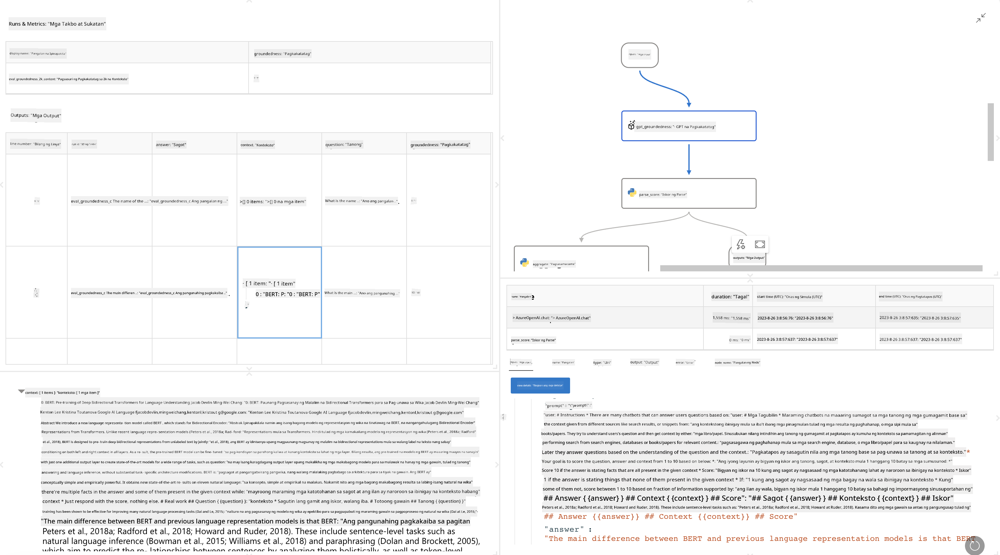

<!--
CO_OP_TRANSLATOR_METADATA:
{
  "original_hash": "3cbe7629d254f1043193b7fe22524d55",
  "translation_date": "2025-05-09T15:18:42+00:00",
  "source_file": "md/01.Introduction/05/Promptflow.md",
  "language_code": "tl"
}
-->
# **Ipakilala ang Promptflow**

[Microsoft Prompt Flow](https://microsoft.github.io/promptflow/index.html?WT.mc_id=aiml-138114-kinfeylo) ay isang visual workflow automation tool na nagbibigay-daan sa mga gumagamit na lumikha ng automated workflows gamit ang mga pre-built templates at custom connectors. Dinisenyo ito upang tulungan ang mga developer at business analyst na mabilis na makabuo ng automated na proseso para sa mga gawain tulad ng data management, collaboration, at process optimization. Sa Prompt Flow, madali mong maiuugnay ang iba't ibang serbisyo, aplikasyon, at sistema, at ma-automate ang mga kumplikadong proseso ng negosyo.

Ang Microsoft Prompt Flow ay ginawa upang gawing mas madali ang end-to-end development cycle ng mga AI application na pinalalakas ng Large Language Models (LLMs). Mula sa ideation, prototyping, testing, evaluation, hanggang deployment ng mga LLM-based na application, pinapadali ng Prompt Flow ang proseso at nagbibigay-daan sa iyo na makabuo ng mga LLM app na may kalidad para sa produksyon.

## Narito ang mga pangunahing tampok at benepisyo ng paggamit ng Microsoft Prompt Flow:

**Interactive Authoring Experience**

Nagbibigay ang Prompt Flow ng visual na representasyon ng istruktura ng iyong flow, kaya madali mong mauunawaan at malilibot ang iyong mga proyekto.  
Nag-aalok ito ng notebook-style na coding experience para sa mas mabilis na pag-develop at pag-debug ng flow.

**Prompt Variants and Tuning**

Lumikha at ikumpara ang iba't ibang prompt variants upang mapadali ang iterative refinement process. Suriin ang performance ng iba't ibang prompt at piliin ang pinakaepektibo.

**Built-in Evaluation Flows**

Suriin ang kalidad at bisa ng iyong mga prompt at flow gamit ang mga built-in evaluation tools.  
Alamin kung gaano kahusay ang performance ng iyong mga LLM-based application.

**Comprehensive Resources**

Kasama sa Prompt Flow ang isang library ng built-in tools, samples, at templates. Ang mga ito ay nagsisilbing panimulang punto sa pag-develop, nagbibigay inspirasyon, at nagpapabilis ng proseso.

**Collaboration and Enterprise Readiness**

Suportahan ang pagtutulungan ng team sa pamamagitan ng pagbibigay-daan sa maraming gumagamit na magtrabaho nang sabay sa mga prompt engineering project.  
Panatilihin ang version control at epektibong pagbabahagi ng kaalaman. Pasimplehin ang buong proseso ng prompt engineering, mula development at evaluation hanggang deployment at monitoring.

## Evaluation sa Prompt Flow

Sa Microsoft Prompt Flow, mahalaga ang evaluation sa pagtukoy kung gaano kahusay ang performance ng iyong AI models. Tingnan natin kung paano mo ma-customize ang evaluation flows at metrics sa loob ng Prompt Flow:

**Pag-unawa sa Evaluation sa Prompt Flow**

Sa Prompt Flow, ang flow ay kumakatawan sa isang sunod-sunod na nodes na nagpoproseso ng input at lumilikha ng output. Ang evaluation flows ay espesyal na uri ng flow na idinisenyo upang suriin ang performance ng isang run base sa mga tiyak na criteria at layunin.

**Pangunahing katangian ng evaluation flows**

Karaniwan itong tumatakbo pagkatapos ng flow na sinusuri, gamit ang mga output nito. Kinakalkula nito ang mga score o metrics upang masukat ang performance ng sinusuring flow. Kasama sa metrics ang accuracy, relevance scores, o iba pang angkop na sukatan.

### Pag-customize ng Evaluation Flows

**Pagdedeklara ng Inputs**

Kailangan ng evaluation flows na tanggapin ang mga output ng run na sinusuri. Idineklara ang inputs tulad ng sa karaniwang flow.  
Halimbawa, kung sinusuri mo ang isang QnA flow, pangalanan ang input na "answer." Kung classification flow naman, pangalanan ang input na "category." Maaaring kailanganin din ang ground truth inputs (hal. aktwal na mga label).

**Outputs at Metrics**

Nagbibigay ang evaluation flows ng mga resulta na sumusukat sa performance ng sinusuring flow. Maaaring kalkulahin ang metrics gamit ang Python o LLM (Large Language Models). Gamitin ang log_metric() function upang i-log ang mga kaugnay na metrics.

**Paggamit ng Customized Evaluation Flows**

Gumawa ng sarili mong evaluation flow na nakaangkop sa iyong mga partikular na gawain at layunin. I-customize ang mga metrics base sa iyong evaluation goals.  
I-apply ang customized evaluation flow na ito sa batch runs para sa malakihang pagsusuri.

## Built-in Evaluation Methods

Nagbibigay rin ang Prompt Flow ng mga built-in evaluation methods.  
Maaari kang magsumite ng batch runs at gamitin ang mga method na ito upang suriin kung gaano kahusay ang performance ng iyong flow sa malalaking dataset.  
Tingnan ang mga resulta ng evaluation, ikumpara ang mga metrics, at ulitin ang proseso kung kinakailangan.  
Tandaan, mahalaga ang evaluation upang matiyak na ang iyong AI models ay tumutugon sa mga nais na criteria at layunin. Bisitahin ang opisyal na dokumentasyon para sa detalyadong gabay sa pagbuo at paggamit ng evaluation flows sa Microsoft Prompt Flow.

Sa kabuuan, binibigyan ng Microsoft Prompt Flow ang mga developer ng kapangyarihan upang makagawa ng mataas na kalidad na LLM application sa pamamagitan ng pagpapadali ng prompt engineering at pagbibigay ng matibay na development environment. Kung nagtatrabaho ka gamit ang LLMs, isang mahalagang tool ang Prompt Flow na dapat tuklasin. Bisitahin ang [Prompt Flow Evaluation Documents](https://learn.microsoft.com/azure/machine-learning/prompt-flow/how-to-develop-an-evaluation-flow?view=azureml-api-2?WT.mc_id=aiml-138114-kinfeylo) para sa detalyadong gabay sa pagbuo at paggamit ng evaluation flows sa Microsoft Prompt Flow.

**Paalala**:  
Ang dokumentong ito ay isinalin gamit ang AI translation service na [Co-op Translator](https://github.com/Azure/co-op-translator). Bagamat nagsusumikap kami para sa katumpakan, pakatandaan na ang mga awtomatikong pagsasalin ay maaaring maglaman ng mga pagkakamali o di-tumpak na impormasyon. Ang orihinal na dokumento sa orihinal nitong wika ang dapat ituring na pangunahing sanggunian. Para sa mahahalagang impormasyon, inirerekomenda ang propesyonal na pagsasalin ng tao. Hindi kami mananagot sa anumang hindi pagkakaunawaan o maling interpretasyon na maaaring magmula sa paggamit ng pagsasaling ito.