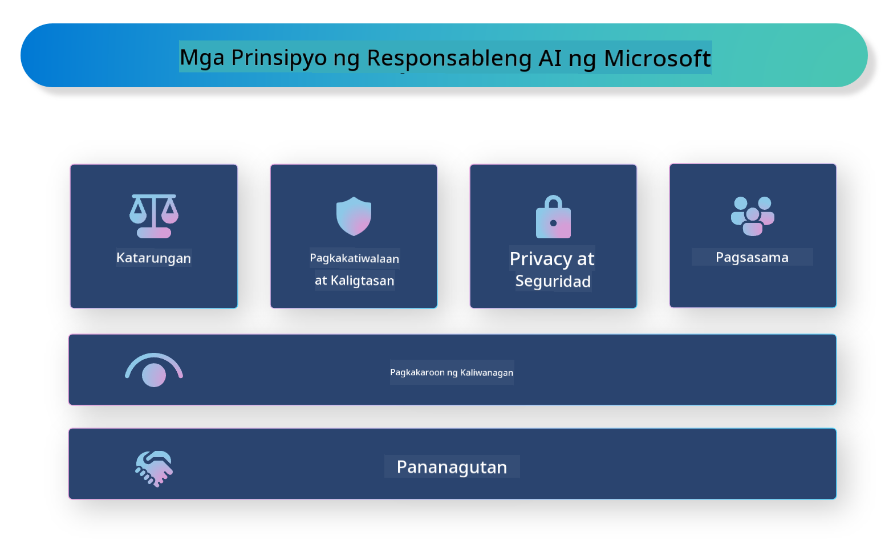

<!--
CO_OP_TRANSLATOR_METADATA:
{
  "original_hash": "805b96b20152936d8f4c587d90d6e06e",
  "translation_date": "2025-05-09T15:43:03+00:00",
  "source_file": "md/01.Introduction/05/ResponsibleAI.md",
  "language_code": "tl"
}
-->
# **Ipakilala ang Responsable na AI**

[Microsoft Responsible AI](https://www.microsoft.com/ai/responsible-ai?WT.mc_id=aiml-138114-kinfeylo) ay isang inisyatiba na layuning tulungan ang mga developer at organisasyon na bumuo ng mga AI system na malinaw, mapagkakatiwalaan, at may pananagutan. Nagbibigay ang inisyatiba ng mga gabay at mga mapagkukunan para sa pag-develop ng responsableng AI na naaayon sa mga etikal na prinsipyo, tulad ng privacy, patas na pagtrato, at pagiging bukas. Tatalakayin din natin ang ilan sa mga hamon at pinakamahuhusay na kasanayan kaugnay ng paggawa ng responsableng AI system.

## Pangkalahatang-ideya ng Microsoft Responsible AI

**Mga etikal na prinsipyo**

Pinapatnubayan ang Microsoft Responsible AI ng hanay ng mga etikal na prinsipyo, tulad ng privacy, patas na pagtrato, pagiging bukas, pananagutan, at kaligtasan. Ang mga prinsipyong ito ay dinisenyo upang matiyak na ang mga AI system ay nade-develop sa isang etikal at responsableng paraan.

**Transparent na AI**

Binibigyang-diin ng Microsoft Responsible AI ang kahalagahan ng pagiging bukas sa mga AI system. Kasama rito ang pagbibigay ng malinaw na paliwanag kung paano gumagana ang mga AI model, pati na rin ang pagsigurong ang mga pinagmumulan ng datos at mga algorithm ay bukas sa publiko.

**Accountable na AI**

Pinapalaganap ng [Microsoft Responsible AI](https://www.microsoft.com/ai/responsible-ai?WT.mc_id=aiml-138114-kinfeylo) ang pagbuo ng mga AI system na may pananagutan, na maaaring magbigay ng pananaw kung paano gumagawa ng desisyon ang mga AI model. Makakatulong ito sa mga gumagamit na maunawaan at pagkatiwalaan ang mga resulta ng AI system.

**Inklusibidad**

Dapat idisenyo ang mga AI system upang makinabang ang lahat. Layunin ng Microsoft na lumikha ng inklusibong AI na isinasaalang-alang ang iba't ibang pananaw at iniiwasan ang pagkiling o diskriminasyon.

**Pagkakatiwalaan at Kaligtasan**

Mahalaga ang pagsigurong ang mga AI system ay maaasahan at ligtas. Nakatuon ang Microsoft sa paggawa ng matitibay na modelo na patuloy na gumagana nang maayos at iniiwasan ang mga mapanganib na resulta.

**Patas na AI**

Kinikilala ng Microsoft Responsible AI na maaaring ipagpatuloy ng mga AI system ang mga pagkiling kung ito ay sinanay gamit ang bias na datos o algorithm. Nagbibigay ang inisyatiba ng mga gabay para sa pagbuo ng patas na AI system na hindi nagdidiskrimina batay sa lahi, kasarian, o edad.

**Privacy at seguridad**

Binibigyang-diin ng Microsoft Responsible AI ang kahalagahan ng pagprotekta sa privacy ng gumagamit at seguridad ng datos sa mga AI system. Kasama rito ang pagpapatupad ng matibay na encryption ng datos at mga kontrol sa pag-access, pati na rin ang regular na pag-audit ng mga AI system para sa mga kahinaan.

**Pananagutan at responsibilidad**

Pinapalaganap ng Microsoft Responsible AI ang pananagutan at responsibilidad sa pag-develop at paggamit ng AI. Kasama rito ang pagsigurong ang mga developer at organisasyon ay may kamalayan sa mga posibleng panganib na kaugnay ng mga AI system, at nagsasagawa ng mga hakbang upang mabawasan ang mga panganib na ito.

## Mga pinakamahuhusay na kasanayan sa paggawa ng responsableng AI system

**Gumawa ng AI model gamit ang iba't ibang set ng datos**

Upang maiwasan ang pagkiling sa AI system, mahalagang gumamit ng mga datos na naglalarawan ng iba't ibang pananaw at karanasan.

**Gamitin ang mga teknik ng explainable AI**

Makakatulong ang mga teknik ng explainable AI upang maintindihan ng mga gumagamit kung paano gumagawa ng desisyon ang AI model, na nagpapataas ng tiwala sa sistema.

**Regular na i-audit ang mga AI system para sa mga kahinaan**

Makakatulong ang regular na pag-audit ng mga AI system upang matukoy ang mga posibleng panganib at kahinaan na kailangang tugunan.

**Ipapatupad ang matibay na encryption ng datos at mga kontrol sa pag-access**

Makakatulong ang encryption ng datos at mga kontrol sa pag-access upang maprotektahan ang privacy at seguridad ng gumagamit sa mga AI system.

**Sundin ang mga etikal na prinsipyo sa pag-develop ng AI**

Ang pagsunod sa mga etikal na prinsipyo, tulad ng patas na pagtrato, pagiging bukas, at pananagutan, ay makakatulong upang mabuo ang tiwala sa mga AI system at matiyak na ito ay nade-develop nang responsable.

## Paggamit ng AI Foundry para sa Responsable na AI

[Azure AI Foundry](https://ai.azure.com?WT.mc_id=aiml-138114-kinfeylo) ay isang makapangyarihang plataporma na nagbibigay-daan sa mga developer at organisasyon na mabilis na makagawa ng matatalinong, makabago, handa sa merkado, at responsableng aplikasyon. Narito ang ilang mahahalagang tampok at kakayahan ng Azure AI Foundry:

**Mga Out-of-the-Box na API at Modelo**

Nagbibigay ang Azure AI Foundry ng mga pre-built at maaaring i-customize na API at modelo. Saklaw nito ang iba't ibang gawain sa AI, kabilang ang generative AI, natural language processing para sa mga pag-uusap, paghahanap, pagmamanman, pagsasalin, pagsasalita, paningin, at paggawa ng desisyon.

**Prompt Flow**

Pinapayagan ka ng prompt flow sa Azure AI Foundry na gumawa ng mga karanasan sa conversational AI. Pinapadali nito ang pagdisenyo at pamamahala ng mga conversational flow, na ginagawang mas madali ang paggawa ng mga chatbot, virtual assistant, at iba pang interactive na aplikasyon.

**Retrieval Augmented Generation (RAG)**

Ang RAG ay isang teknik na pinagsasama ang retrieval-based at generative-based na mga pamamaraan. Pinapabuti nito ang kalidad ng mga generated na sagot sa pamamagitan ng paggamit ng parehong umiiral na kaalaman (retrieval) at malikhaing pagbuo (generation).

**Mga Metric para sa Pagsusuri at Pagmamanman ng Generative AI**

Nagbibigay ang Azure AI Foundry ng mga kasangkapan para sa pagsusuri at pagmamanman ng mga generative AI model. Maaari mong tasahin ang kanilang performance, patas na pagtrato, at iba pang mahahalagang metric upang matiyak ang responsableng paggamit. Bukod dito, kung nakagawa ka ng dashboard, maaari mong gamitin ang no-code UI sa Azure Machine Learning Studio upang i-customize at gumawa ng Responsible AI Dashboard at kaugnay na scorecard base sa [Responsible AI Toolbox](https://responsibleaitoolbox.ai/?WT.mc_id=aiml-138114-kinfeylo) Python Libraries. Ang scorecard na ito ay tumutulong upang maibahagi ang mahahalagang insight tungkol sa patas na pagtrato, kahalagahan ng mga tampok, at iba pang konsiderasyon sa responsableng paggamit sa mga teknikal at di-teknikal na stakeholder.

Para magamit ang AI Foundry sa responsable na AI, maaari mong sundin ang mga pinakamahuhusay na kasanayan na ito:

**Tukuyin ang problema at layunin ng iyong AI system**

Bago simulan ang proseso ng pag-develop, mahalagang malinaw na tukuyin ang problema o layunin na nais lutasin ng iyong AI system. Makakatulong ito upang matukoy ang datos, algorithm, at mga mapagkukunan na kailangan para makabuo ng epektibong modelo.

**Kolektahin at i-preprocess ang mga kaugnay na datos**

Malaki ang epekto ng kalidad at dami ng datos na gagamitin sa pagsasanay ng AI system sa performance nito. Kaya mahalagang kolektahin ang mga kaugnay na datos, linisin ito, i-preprocess, at tiyaking kinakatawan nito ang populasyon o problemang nais mong lutasin.

**Pumili ng angkop na paraan ng pagsusuri**

May iba't ibang mga algorithm para sa pagsusuri. Mahalaga na piliin ang pinakaangkop na algorithm batay sa iyong datos at problema.

**Suriin at bigyang-kahulugan ang modelo**

Kapag nakabuo ka na ng AI model, mahalagang suriin ang performance nito gamit ang angkop na mga metric at ipaliwanag ang mga resulta nang malinaw. Makakatulong ito upang matukoy ang anumang pagkiling o limitasyon ng modelo at makagawa ng mga kinakailangang pagpapabuti.

**Siguraduhin ang pagiging bukas at paliwanag**

Dapat maging transparent at madaling ipaliwanag ang mga AI system upang maintindihan ng mga gumagamit kung paano ito gumagana at paano ginagawa ang mga desisyon. Lalo na itong mahalaga sa mga aplikasyon na may malaking epekto sa buhay ng tao, tulad ng pangangalagang pangkalusugan, pananalapi, at mga legal na sistema.

**Subaybayan at i-update ang modelo**

Dapat patuloy na subaybayan at i-update ang mga AI system upang matiyak na nananatili silang tama at epektibo sa paglipas ng panahon. Kailangan nito ng tuloy-tuloy na pagpapanatili, pagsusuri, at muling pagsasanay ng modelo.

Sa kabuuan, ang Microsoft Responsible AI ay isang inisyatiba na layuning tulungan ang mga developer at organisasyon na bumuo ng mga AI system na malinaw, mapagkakatiwalaan, at may pananagutan. Tandaan na mahalaga ang responsableng implementasyon ng AI, at nilalayon ng Azure AI Foundry na gawing praktikal ito para sa mga organisasyon. Sa pamamagitan ng pagsunod sa mga etikal na prinsipyo at pinakamahuhusay na kasanayan, masisiguro natin na ang mga AI system ay nade-develop at ginagamit nang responsable na nakikinabang ang buong lipunan.

**Paalala**:  
Ang dokumentong ito ay isinalin gamit ang AI translation service na [Co-op Translator](https://github.com/Azure/co-op-translator). Bagaman nagsusumikap kami para sa katumpakan, pakatandaan na ang mga awtomatikong pagsasalin ay maaaring maglaman ng mga pagkakamali o hindi tumpak na impormasyon. Ang orihinal na dokumento sa orihinal nitong wika ang dapat ituring na pangunahing sanggunian. Para sa mahahalagang impormasyon, inirerekomenda ang propesyonal na pagsasalin ng tao. Hindi kami mananagot sa anumang hindi pagkakaunawaan o maling interpretasyon na maaaring magmula sa paggamit ng pagsasaling ito.