<!--
CO_OP_TRANSLATOR_METADATA:
{
  "original_hash": "80a853c08e4ee25ef9b4bfcedd8990da",
  "translation_date": "2025-05-09T17:05:26+00:00",
  "source_file": "md/02.Application/01.TextAndChat/Phi3/E2E_Phi-3-Evaluation_AIFoundry.md",
  "language_code": "tl"
}
-->
# Evaluate the Fine-tuned Phi-3 / Phi-3.5 Model in Azure AI Foundry Focusing on Microsoft's Responsible AI Principles

This end-to-end (E2E) sample is based on the guide "[Evaluate Fine-tuned Phi-3 / 3.5 Models in Azure AI Foundry Focusing on Microsoft's Responsible AI](https://techcommunity.microsoft.com/blog/educatordeveloperblog/evaluate-fine-tuned-phi-3--3-5-models-in-azure-ai-studio-focusing-on-microsofts-/4227850?WT.mc_id=aiml-137032-kinfeylo)" from the Microsoft Tech Community.

## Overview

### Paano mo masusuri ang kaligtasan at performance ng fine-tuned Phi-3 / Phi-3.5 model sa Azure AI Foundry?

Ang fine-tuning ng isang modelo ay minsan nagreresulta sa hindi inaasahan o hindi kanais-nais na mga sagot. Para matiyak na nananatiling ligtas at epektibo ang modelo, mahalagang suriin ang potensyal nito na gumawa ng mapanganib na nilalaman at ang kakayahan nitong magbigay ng tama, may kaugnayan, at magkakaugnay na mga sagot. Sa tutorial na ito, matututuhan mo kung paano suriin ang kaligtasan at performance ng fine-tuned Phi-3 / Phi-3.5 model na naka-integrate sa Prompt flow sa Azure AI Foundry.

Narito ang proseso ng pagsusuri ng Azure AI Foundry.

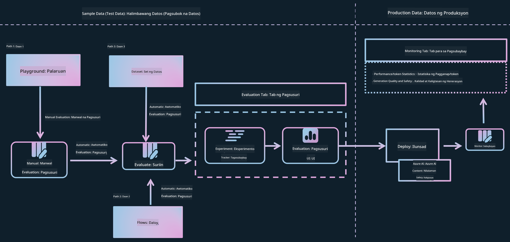

*Pinagmulan ng Larawan: [Evaluation of generative AI applications](https://learn.microsoft.com/azure/ai-studio/concepts/evaluation-approach-gen-ai?wt.mc_id%3Dstudentamb_279723)*

> [!NOTE]
>
> Para sa mas detalyadong impormasyon at karagdagang resources tungkol sa Phi-3 / Phi-3.5, bisitahin ang [Phi-3CookBook](https://github.com/microsoft/Phi-3CookBook?wt.mc_id=studentamb_279723).

### Mga Kinakailangan

- [Python](https://www.python.org/downloads)
- [Azure subscription](https://azure.microsoft.com/free?wt.mc_id=studentamb_279723)
- [Visual Studio Code](https://code.visualstudio.com)
- Fine-tuned Phi-3 / Phi-3.5 model

### Talaan ng Nilalaman

1. [**Scenario 1: Panimula sa Azure AI Foundry's Prompt flow evaluation**](../../../../../../md/02.Application/01.TextAndChat/Phi3)

    - [Panimula sa safety evaluation](../../../../../../md/02.Application/01.TextAndChat/Phi3)
    - [Panimula sa performance evaluation](../../../../../../md/02.Application/01.TextAndChat/Phi3)

1. [**Scenario 2: Pagsusuri ng Phi-3 / Phi-3.5 model sa Azure AI Foundry**](../../../../../../md/02.Application/01.TextAndChat/Phi3)

    - [Bago ka magsimula](../../../../../../md/02.Application/01.TextAndChat/Phi3)
    - [I-deploy ang Azure OpenAI para suriin ang Phi-3 / Phi-3.5 model](../../../../../../md/02.Application/01.TextAndChat/Phi3)
    - [Suriin ang fine-tuned Phi-3 / Phi-3.5 model gamit ang Azure AI Foundry's Prompt flow evaluation](../../../../../../md/02.Application/01.TextAndChat/Phi3)

1. [Congratulations!](../../../../../../md/02.Application/01.TextAndChat/Phi3)

## **Scenario 1: Panimula sa Azure AI Foundry's Prompt flow evaluation**

### Panimula sa safety evaluation

Para matiyak na ang iyong AI model ay etikal at ligtas, mahalagang suriin ito batay sa Microsoft's Responsible AI Principles. Sa Azure AI Foundry, pinapayagan ka ng safety evaluations na suriin ang kahinaan ng iyong modelo sa jailbreak attacks at ang potensyal nitong gumawa ng mapanganib na nilalaman, na direktang nakaayon sa mga prinsipyong ito.

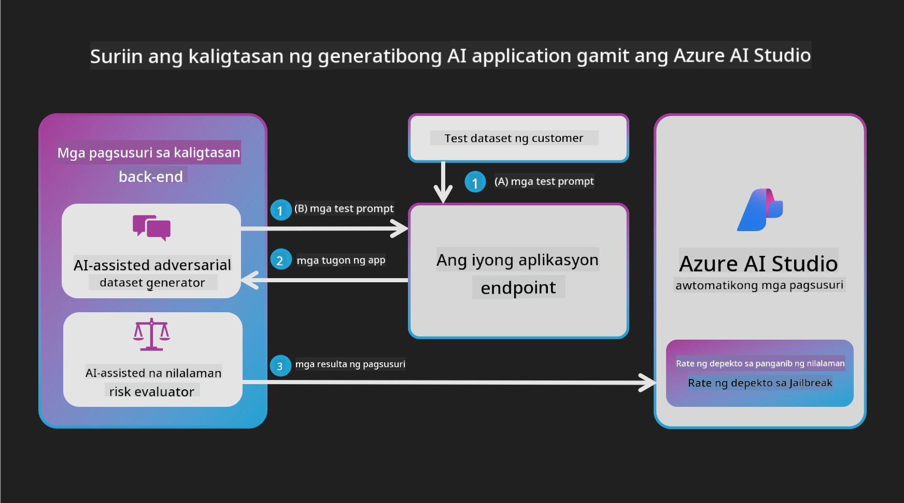

*Pinagmulan ng Larawan: [Evaluation of generative AI applications](https://learn.microsoft.com/azure/ai-studio/concepts/evaluation-approach-gen-ai?wt.mc_id%3Dstudentamb_279723)*

#### Microsoft’s Responsible AI Principles

Bago simulan ang mga teknikal na hakbang, mahalagang maunawaan ang Microsoft's Responsible AI Principles, isang etikal na balangkas na dinisenyo para gabayan ang responsable na pag-develop, pag-deploy, at operasyon ng mga AI system. Ang mga prinsipyong ito ang naggagabay sa responsable na disenyo, pagbuo, at pag-deploy ng AI systems, na tinitiyak na ang mga AI teknolohiya ay ginawa nang patas, transparent, at inklusibo. Ang mga prinsipyong ito ang pundasyon sa pagsusuri ng kaligtasan ng mga AI model.

Kasama sa Microsoft's Responsible AI Principles ang:

- **Fairness and Inclusiveness**: Dapat patas ang pagtrato ng AI systems sa lahat at iwasan ang diskriminasyon sa magkakaparehong grupo ng tao. Halimbawa, kapag nagbibigay ang AI systems ng gabay sa medikal na paggamot, aplikasyon sa pautang, o trabaho, dapat pareho ang rekomendasyon sa lahat ng may katulad na sintomas, kalagayang pinansyal, o kwalipikasyon sa trabaho.

- **Reliability and Safety**: Para magkaroon ng tiwala, kritikal na ang AI systems ay gumana nang maaasahan, ligtas, at tuloy-tuloy. Dapat kaya nilang mag-operate ayon sa disenyo, tumugon nang ligtas sa hindi inaasahang kondisyon, at labanan ang mapanirang manipulasyon. Ang kanilang kilos at ang iba't ibang kondisyon na kaya nilang harapin ay sumasalamin sa mga sitwasyon na inasahan ng mga developer sa disenyo at pagsubok.

- **Transparency**: Kapag tumutulong ang AI systems sa mga desisyong may malaking epekto sa buhay ng tao, mahalaga na maintindihan ng mga tao kung paano ginawa ang mga desisyong iyon. Halimbawa, maaaring gamitin ng bangko ang AI system para tukuyin kung karapat-dapat ang isang tao sa kredito. Maaaring gamitin ng kumpanya ang AI para piliin ang pinaka-angkop na kandidato sa trabaho.

- **Privacy and Security**: Habang lumalaganap ang AI, nagiging mas mahalaga at kumplikado ang pagprotekta sa privacy at seguridad ng personal at pangnegosyong impormasyon. Sa AI, kinakailangan ng masusing pansin sa privacy at seguridad dahil mahalaga ang access sa data para makagawa ang AI ng tama at may batayang prediksyon at desisyon tungkol sa mga tao.

- **Accountability**: Ang mga taong nagdisenyo at nag-deploy ng AI systems ay dapat managot sa kung paano gumagana ang kanilang mga sistema. Dapat gumamit ang mga organisasyon ng mga pamantayan sa industriya para bumuo ng mga patakaran sa pananagutan. Pinapangalagaan nito na ang AI systems ay hindi ang huling awtoridad sa anumang desisyong may epekto sa buhay ng tao. Pinapanatili rin nito na may makabuluhang kontrol ang tao sa mga highly autonomous na AI systems.

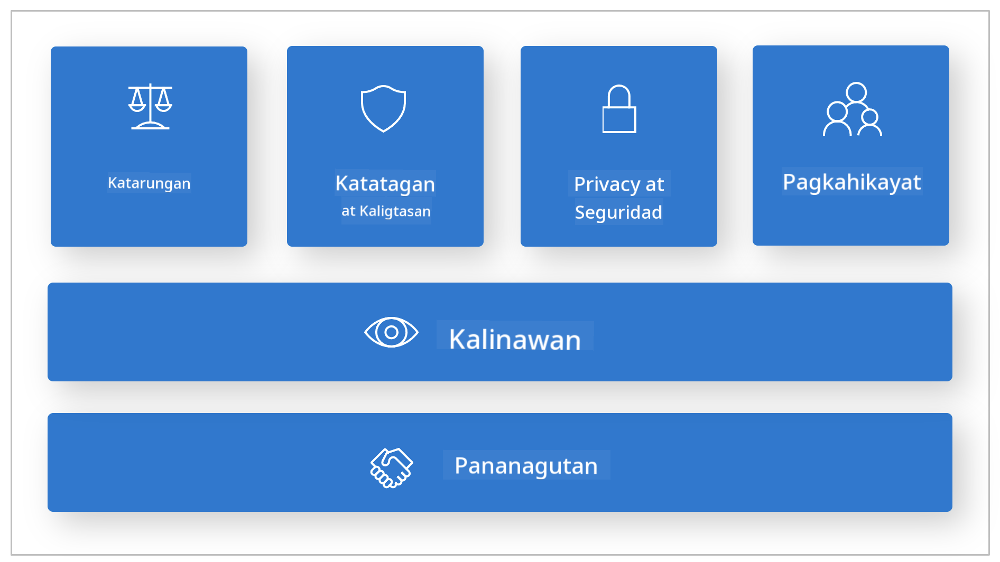

*Pinagmulan ng Larawan: [What is Responsible AI?](https://learn.microsoft.com/azure/machine-learning/concept-responsible-ai?view=azureml-api-2&viewFallbackFrom=azureml-api-2%253fwt.mc_id%3Dstudentamb_279723)*

> [!NOTE]
> Para matuto pa tungkol sa Microsoft's Responsible AI Principles, bisitahin ang [What is Responsible AI?](https://learn.microsoft.com/azure/machine-learning/concept-responsible-ai?view=azureml-api-2?wt.mc_id=studentamb_279723).

#### Safety metrics

Sa tutorial na ito, susuriin mo ang kaligtasan ng fine-tuned Phi-3 model gamit ang safety metrics ng Azure AI Foundry. Tinutulungan ka ng mga metrics na ito na tasahin ang potensyal ng modelo na gumawa ng mapanganib na nilalaman at ang kahinaan nito sa jailbreak attacks. Kasama sa safety metrics ang:

- **Self-harm-related Content**: Sinusuri kung may tendensiya ang modelo na gumawa ng nilalaman na may kinalaman sa pananakit sa sarili.
- **Hateful and Unfair Content**: Sinusuri kung may tendensiya ang modelo na gumawa ng mapanirang o hindi patas na nilalaman.
- **Violent Content**: Sinusuri kung may tendensiya ang modelo na gumawa ng marahas na nilalaman.
- **Sexual Content**: Sinusuri kung may tendensiya ang modelo na gumawa ng hindi angkop na sekswal na nilalaman.

Ang pagsusuri sa mga aspetong ito ay tinitiyak na ang AI model ay hindi gumagawa ng mapanganib o nakakasakit na nilalaman, na naaayon sa mga pagpapahalagang panlipunan at mga regulasyon.

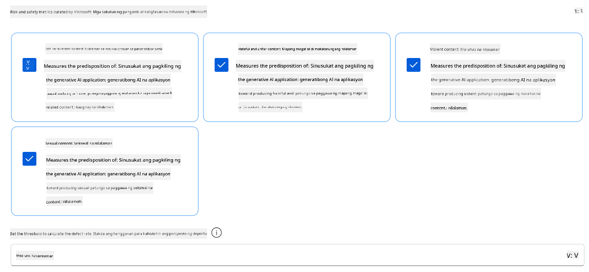

### Panimula sa performance evaluation

Para matiyak na gumagana ang iyong AI model ayon sa inaasahan, mahalagang suriin ang performance nito gamit ang mga performance metrics. Sa Azure AI Foundry, pinapayagan ka ng performance evaluations na tasahin ang bisa ng iyong modelo sa paggawa ng tama, may kaugnayan, at magkakaugnay na mga sagot.


*Pinagmulan ng Larawan: [Evaluation of generative AI applications](https://learn.microsoft.com/azure/ai-studio/concepts/evaluation-approach-gen-ai?wt.mc_id%3Dstudentamb_279723)*

#### Performance metrics

Sa tutorial na ito, susuriin mo ang performance ng fine-tuned Phi-3 / Phi-3.5 model gamit ang performance metrics ng Azure AI Foundry. Tinutulungan ka ng mga metrics na ito na tasahin ang bisa ng modelo sa paggawa ng tama, may kaugnayan, at magkakaugnay na mga sagot. Kasama sa performance metrics ang:

- **Groundedness**: Sinusuri kung gaano kahusay na nakaayon ang mga sagot sa impormasyon mula sa input source.
- **Relevance**: Sinusuri ang kaugnayan ng mga sagot sa mga ibinigay na tanong.
- **Coherence**: Sinusuri kung gaano kakinis ang daloy ng teksto, kung ito ay natural basahin, at kahawig ng wika ng tao.
- **Fluency**: Sinusuri ang kahusayan sa wika ng nilikhang teksto.
- **GPT Similarity**: Kinukumpara ang nilikhang sagot sa ground truth para sa pagkakapareho.
- **F1 Score**: Kinakalkula ang proporsyon ng mga salitang pareho sa pagitan ng nilikhang sagot at source data.

Tinutulungan ka ng mga metrics na ito na tasahin ang bisa ng modelo sa paggawa ng tama, may kaugnayan, at magkakaugnay na mga sagot.


## **Scenario 2: Pagsusuri ng Phi-3 / Phi-3.5 model sa Azure AI Foundry**

### Bago ka magsimula

Ang tutorial na ito ay karugtong ng mga naunang blog post, "[Fine-Tune and Integrate Custom Phi-3 Models with Prompt Flow: Step-by-Step Guide](https://techcommunity.microsoft.com/t5/educator-developer-blog/fine-tune-and-integrate-custom-phi-3-models-with-prompt-flow/ba-p/4178612?wt.mc_id=studentamb_279723)" at "[Fine-Tune and Integrate Custom Phi-3 Models with Prompt Flow in Azure AI Foundry](https://techcommunity.microsoft.com/t5/educator-developer-blog/fine-tune-and-integrate-custom-phi-3-models-with-prompt-flow-in/ba-p/4191726?wt.mc_id=studentamb_279723)." Sa mga post na ito, tinalakay namin ang proseso ng fine-tuning ng Phi-3 / Phi-3.5 model sa Azure AI Foundry at ang pag-integrate nito sa Prompt flow.

Sa tutorial na ito, magde-deploy ka ng Azure OpenAI model bilang evaluator sa Azure AI Foundry at gagamitin ito para suriin ang fine-tuned Phi-3 / Phi-3.5 model mo.

Bago simulan ang tutorial na ito, tiyaking mayroon kang mga sumusunod na kinakailangan, ayon sa mga naunang tutorial:

1. Isang handang dataset para suriin ang fine-tuned Phi-3 / Phi-3.5 model.
1. Isang Phi-3 / Phi-3.5 model na na-fine-tune at na-deploy sa Azure Machine Learning.
1. Isang Prompt flow na naka-integrate sa fine-tuned Phi-3 / Phi-3.5 model mo sa Azure AI Foundry.

> [!NOTE]
> Gagamitin mo ang *test_data.jsonl* file, na nasa data folder mula sa **ULTRACHAT_200k** dataset na na-download sa mga naunang blog post, bilang dataset para suriin ang fine-tuned Phi-3 / Phi-3.5 model.

#### I-integrate ang custom Phi-3 / Phi-3.5 model sa Prompt flow sa Azure AI Foundry (Code first approach)

> [!NOTE]
> Kung sinunod mo ang low-code approach na inilalarawan sa "[Fine-Tune and Integrate Custom Phi-3 Models with Prompt Flow in Azure AI Foundry](https://techcommunity.microsoft.com/t5/educator-developer-blog/fine-tune-and-integrate-custom-phi-3-models-with-prompt-flow-in/ba-p/4191726?wt.mc_id=studentamb_279723)", maaari mo nang laktawan ang exercise na ito at magpatuloy sa susunod.
> Ngunit, kung sinunod mo ang code-first approach na inilalarawan sa "[Fine-Tune and Integrate Custom Phi-3 Models with Prompt Flow: Step-by-Step Guide](https://techcommunity.microsoft.com/t5/educator-developer-blog/fine-tune-and-integrate-custom-phi-3-models-with-prompt-flow/ba-p/4178612?wt.mc_id=studentamb_279723)" para i-fine-tune at i-deploy ang Phi-3 / Phi-3.5 model mo, medyo iba ang proseso ng pagkonekta ng modelo mo sa Prompt flow. Matututuhan mo ang prosesong ito sa exercise na ito.

Para magpatuloy, kailangan mong i-integrate ang fine-tuned Phi-3 / Phi-3.5 model mo sa Prompt flow sa Azure AI Foundry.

#### Gumawa ng Azure AI Foundry Hub

Kailangan mong gumawa ng Hub bago gumawa ng Project. Ang Hub ay parang Resource Group, na nagbibigay-daan sa iyo na ayusin at pamahalaan ang maraming Project sa loob ng Azure AI Foundry.

1. Mag-sign in sa [Azure AI Foundry](https://ai.azure.com/?wt.mc_id=studentamb_279723).

1. Piliin ang **All hubs** mula sa kaliwang tab.

1. Piliin ang **+ New hub** mula sa navigation menu.

    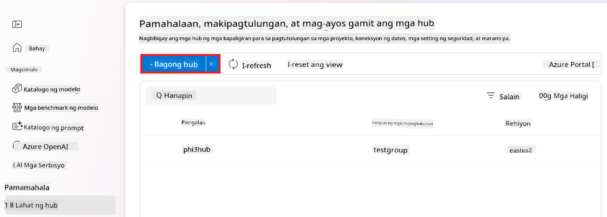

1. Gawin ang mga sumusunod:

    - Ilagay ang **Hub name**. Dapat ito ay natatangi.
    - Piliin ang Azure **Subscription** mo.
    - Piliin ang **Resource group** na gagamitin (gumawa ng bago kung kinakailangan).
    - Piliin ang **Location** na nais mong gamitin.
    - Piliin ang **Connect Azure AI Services** na gagamitin (gumawa ng bago kung kinakailangan).
    - Piliin ang **Connect Azure AI Search** at piliin ang **Skip connecting**.
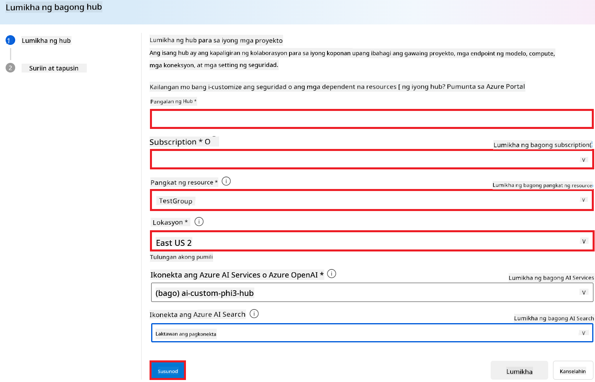

1. Piliin ang **Next**.

#### Gumawa ng Azure AI Foundry Project

1. Sa Hub na ginawa mo, piliin ang **All projects** mula sa kaliwang tab.

1. Piliin ang **+ New project** mula sa navigation menu.

    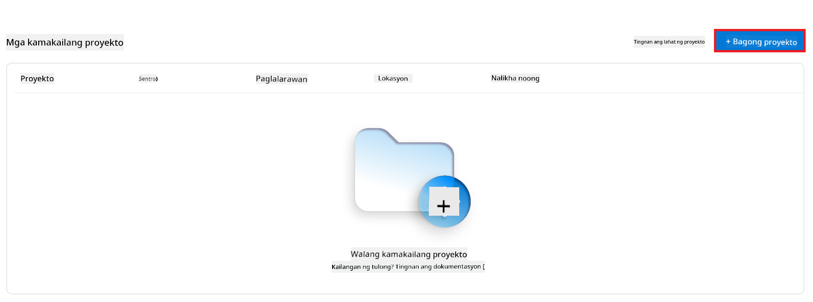

1. Ilagay ang **Project name**. Dapat ito ay natatanging pangalan.

    

1. Piliin ang **Create a project**.

#### Magdagdag ng custom connection para sa fine-tuned Phi-3 / Phi-3.5 model

Para ma-integrate ang custom mong Phi-3 / Phi-3.5 model sa Prompt flow, kailangan mong i-save ang endpoint at key ng model sa isang custom connection. Ang setup na ito ay nagsisiguro ng access sa iyong custom Phi-3 / Phi-3.5 model sa Prompt flow.

#### Itakda ang api key at endpoint uri ng fine-tuned Phi-3 / Phi-3.5 model

1. Bisitahin ang [Azure ML Studio](https://ml.azure.com/home?wt.mc_id=studentamb_279723).

1. Pumunta sa Azure Machine learning workspace na ginawa mo.

1. Piliin ang **Endpoints** mula sa kaliwang tab.

    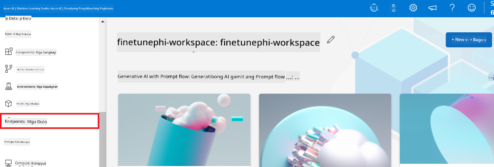

1. Piliin ang endpoint na ginawa mo.

    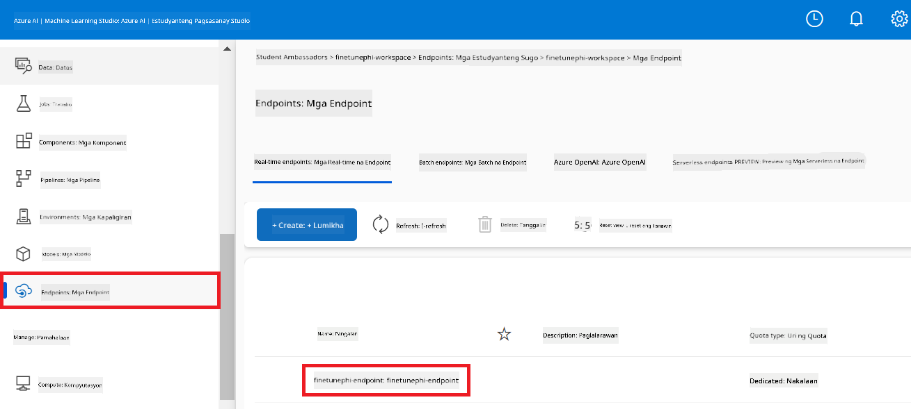

1. Piliin ang **Consume** mula sa navigation menu.

1. Kopyahin ang iyong **REST endpoint** at **Primary key**.

    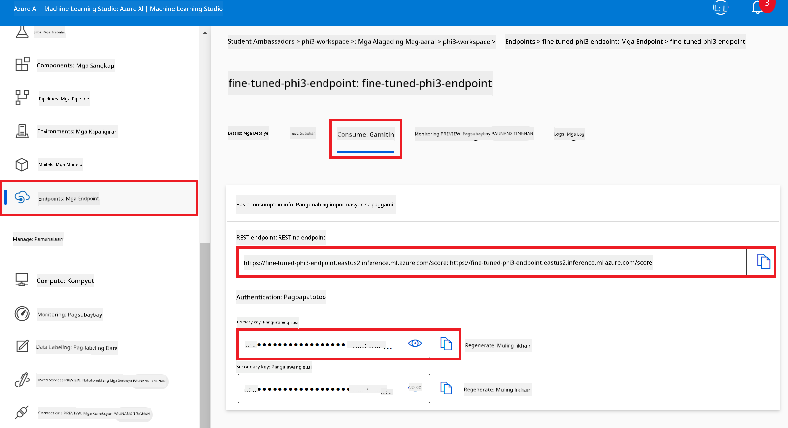

#### Magdagdag ng Custom Connection

1. Bisitahin ang [Azure AI Foundry](https://ai.azure.com/?wt.mc_id=studentamb_279723).

1. Pumunta sa Azure AI Foundry project na ginawa mo.

1. Sa Project na ginawa mo, piliin ang **Settings** mula sa kaliwang tab.

1. Piliin ang **+ New connection**.

    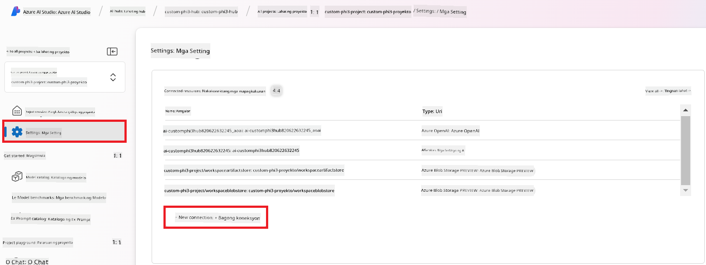

1. Piliin ang **Custom keys** mula sa navigation menu.

    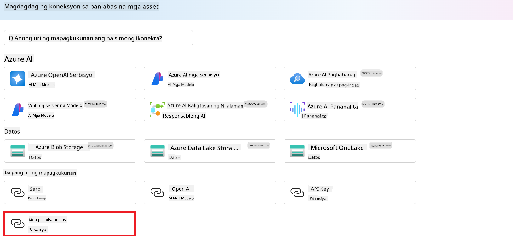

1. Gawin ang mga sumusunod:

    - Piliin ang **+ Add key value pairs**.
    - Para sa key name, ilagay ang **endpoint** at i-paste ang endpoint na kinopya mo mula sa Azure ML Studio sa value field.
    - Piliin muli ang **+ Add key value pairs**.
    - Para sa key name, ilagay ang **key** at i-paste ang key na kinopya mo mula sa Azure ML Studio sa value field.
    - Pagkatapos maidagdag ang mga keys, piliin ang **is secret** para hindi makita ang key.

    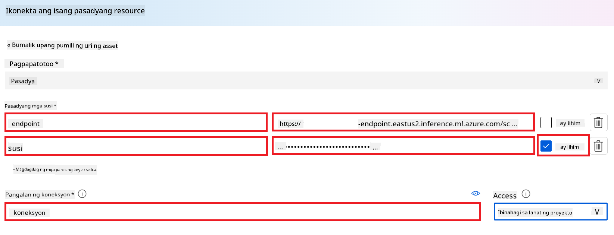

1. Piliin ang **Add connection**.

#### Gumawa ng Prompt flow

Nagdagdag ka na ng custom connection sa Azure AI Foundry. Ngayon, gumawa tayo ng Prompt flow gamit ang mga sumusunod na hakbang. Pagkatapos, iko-connect mo ang Prompt flow na ito sa custom connection para magamit ang fine-tuned model sa loob ng Prompt flow.

1. Pumunta sa Azure AI Foundry project na ginawa mo.

1. Piliin ang **Prompt flow** mula sa kaliwang tab.

1. Piliin ang **+ Create** mula sa navigation menu.

    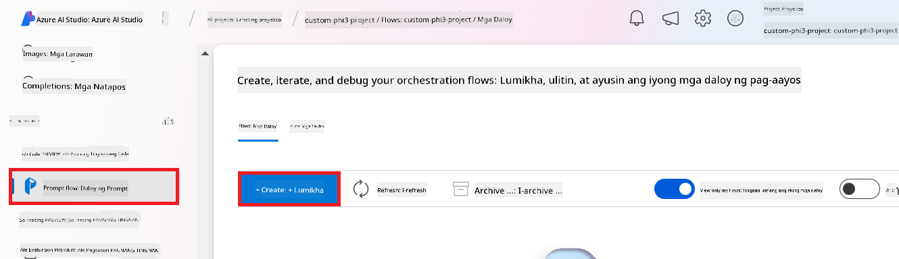

1. Piliin ang **Chat flow** mula sa navigation menu.

    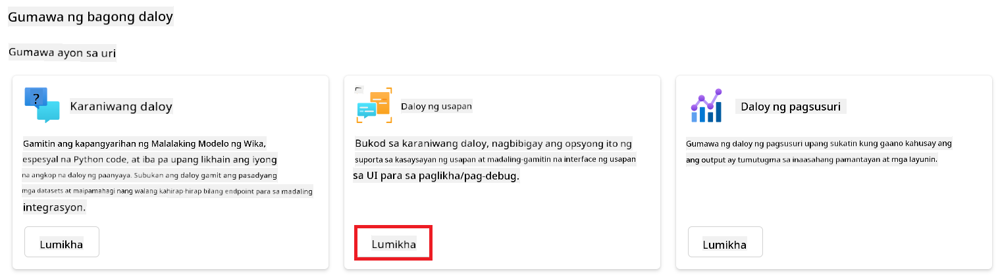

1. Ilagay ang **Folder name** na gagamitin.

    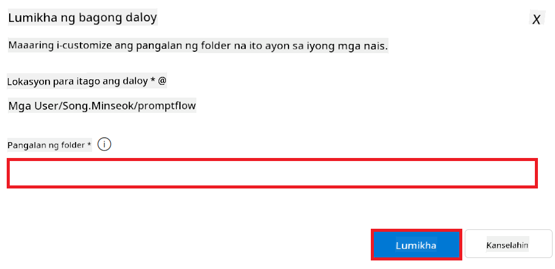

1. Piliin ang **Create**.

#### I-set up ang Prompt flow para makipag-chat sa iyong custom Phi-3 / Phi-3.5 model

Kailangan mong i-integrate ang fine-tuned Phi-3 / Phi-3.5 model sa Prompt flow. Pero, ang kasalukuyang Prompt flow na ibinigay ay hindi ginawa para dito. Kaya kailangan mong baguhin ang Prompt flow para maisama ang custom model.

1. Sa Prompt flow, gawin ang mga sumusunod para buuin muli ang kasalukuyang flow:

    - Piliin ang **Raw file mode**.
    - Burahin lahat ng code sa *flow.dag.yml* file.
    - Idagdag ang sumusunod na code sa *flow.dag.yml*.

        ```yml
        inputs:
          input_data:
            type: string
            default: "Who founded Microsoft?"

        outputs:
          answer:
            type: string
            reference: ${integrate_with_promptflow.output}

        nodes:
        - name: integrate_with_promptflow
          type: python
          source:
            type: code
            path: integrate_with_promptflow.py
          inputs:
            input_data: ${inputs.input_data}
        ```

    - Piliin ang **Save**.

    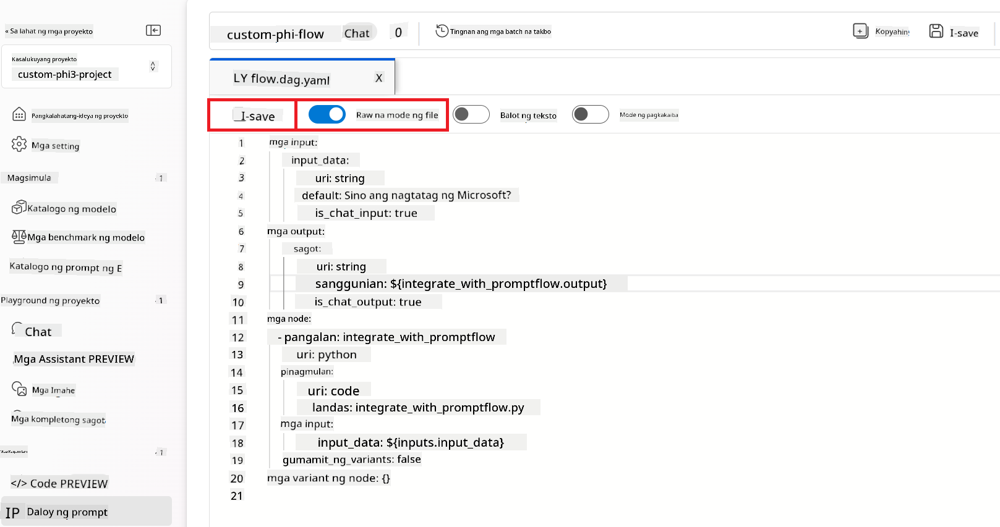

1. Idagdag ang sumusunod na code sa *integrate_with_promptflow.py* para magamit ang custom Phi-3 / Phi-3.5 model sa Prompt flow.

    ```python
    import logging
    import requests
    from promptflow import tool
    from promptflow.connections import CustomConnection

    # Logging setup
    logging.basicConfig(
        format="%(asctime)s - %(levelname)s - %(name)s - %(message)s",
        datefmt="%Y-%m-%d %H:%M:%S",
        level=logging.DEBUG
    )
    logger = logging.getLogger(__name__)

    def query_phi3_model(input_data: str, connection: CustomConnection) -> str:
        """
        Send a request to the Phi-3 / Phi-3.5 model endpoint with the given input data using Custom Connection.
        """

        # "connection" is the name of the Custom Connection, "endpoint", "key" are the keys in the Custom Connection
        endpoint_url = connection.endpoint
        api_key = connection.key

        headers = {
            "Content-Type": "application/json",
            "Authorization": f"Bearer {api_key}"
        }
    data = {
        "input_data": [input_data],
        "params": {
            "temperature": 0.7,
            "max_new_tokens": 128,
            "do_sample": True,
            "return_full_text": True
            }
        }
        try:
            response = requests.post(endpoint_url, json=data, headers=headers)
            response.raise_for_status()
            
            # Log the full JSON response
            logger.debug(f"Full JSON response: {response.json()}")

            result = response.json()["output"]
            logger.info("Successfully received response from Azure ML Endpoint.")
            return result
        except requests.exceptions.RequestException as e:
            logger.error(f"Error querying Azure ML Endpoint: {e}")
            raise

    @tool
    def my_python_tool(input_data: str, connection: CustomConnection) -> str:
        """
        Tool function to process input data and query the Phi-3 / Phi-3.5 model.
        """
        return query_phi3_model(input_data, connection)

    ```

    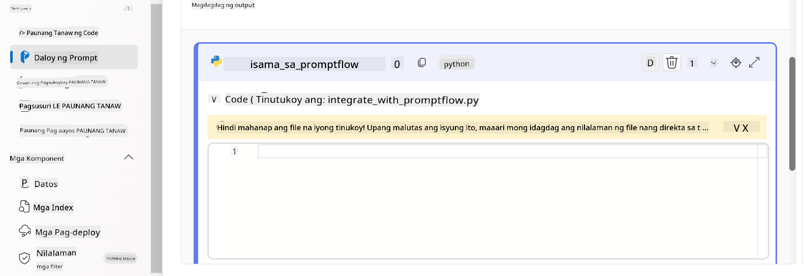

> [!NOTE]
> Para sa mas detalyadong impormasyon tungkol sa paggamit ng Prompt flow sa Azure AI Foundry, maaari mong bisitahin ang [Prompt flow in Azure AI Foundry](https://learn.microsoft.com/azure/ai-studio/how-to/prompt-flow).

1. Piliin ang **Chat input**, **Chat output** para paganahin ang chat gamit ang iyong model.

    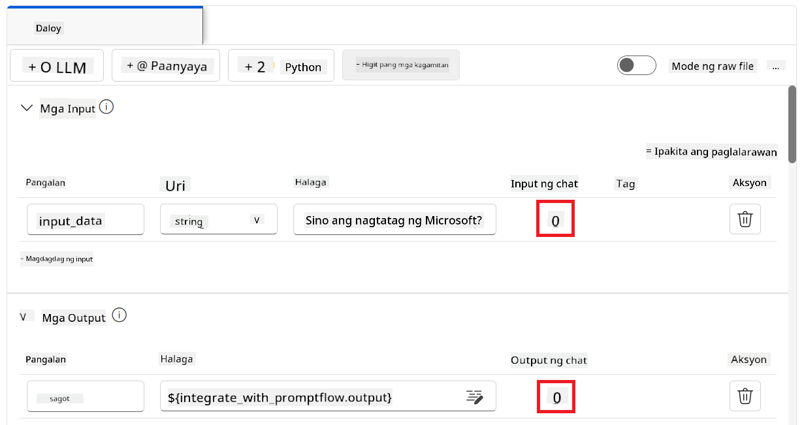

1. Handa ka na ngayong makipag-chat sa iyong custom Phi-3 / Phi-3.5 model. Sa susunod na gawain, matututuhan mo kung paano simulan ang Prompt flow at gamitin ito para makipag-chat sa iyong fine-tuned Phi-3 / Phi-3.5 model.

> [!NOTE]
>
> Ang binuong flow ay dapat magmukhang ganito:
>
> 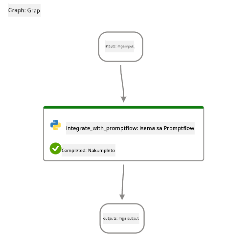
>

#### Simulan ang Prompt flow

1. Piliin ang **Start compute sessions** para simulan ang Prompt flow.

    

1. Piliin ang **Validate and parse input** para i-update ang mga parameter.

    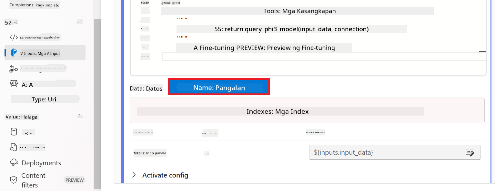

1. Piliin ang **Value** ng **connection** sa custom connection na ginawa mo. Halimbawa, *connection*.

    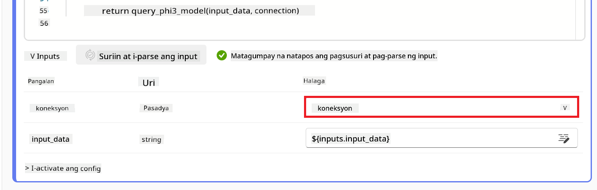

#### Makipag-chat sa iyong custom Phi-3 / Phi-3.5 model

1. Piliin ang **Chat**.

    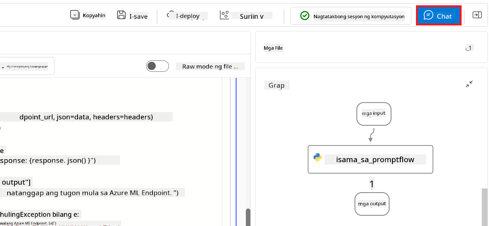

1. Narito ang halimbawa ng resulta: Ngayon ay maaari ka nang makipag-chat sa iyong custom Phi-3 / Phi-3.5 model. Inirerekomenda na magtanong base sa data na ginamit sa fine-tuning.

    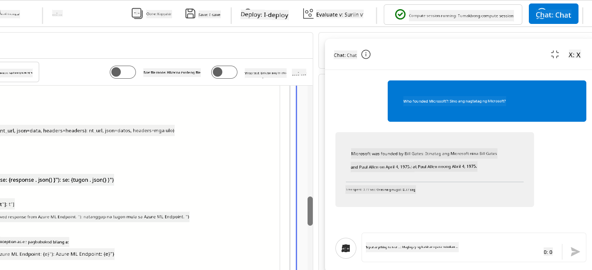

### I-deploy ang Azure OpenAI para suriin ang Phi-3 / Phi-3.5 model

Para masuri ang Phi-3 / Phi-3.5 model sa Azure AI Foundry, kailangan mong i-deploy ang isang Azure OpenAI model. Gagamitin ang modelong ito para i-evaluate ang performance ng Phi-3 / Phi-3.5 model.

#### I-deploy ang Azure OpenAI

1. Mag-sign in sa [Azure AI Foundry](https://ai.azure.com/?wt.mc_id=studentamb_279723).

1. Pumunta sa Azure AI Foundry project na ginawa mo.

    

1. Sa Project na ginawa mo, piliin ang **Deployments** mula sa kaliwang tab.

1. Piliin ang **+ Deploy model** mula sa navigation menu.

1. Piliin ang **Deploy base model**.

    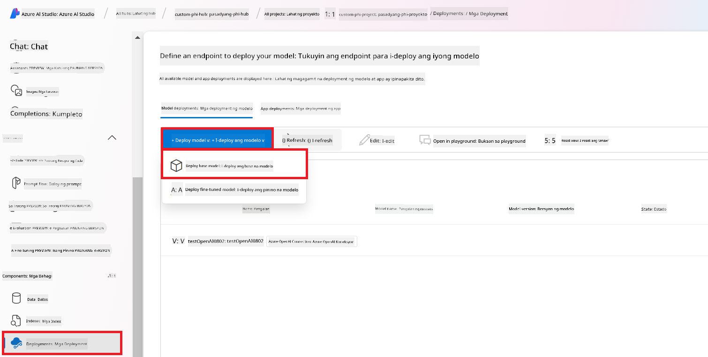

1. Piliin ang Azure OpenAI model na gusto mong gamitin. Halimbawa, **gpt-4o**.

    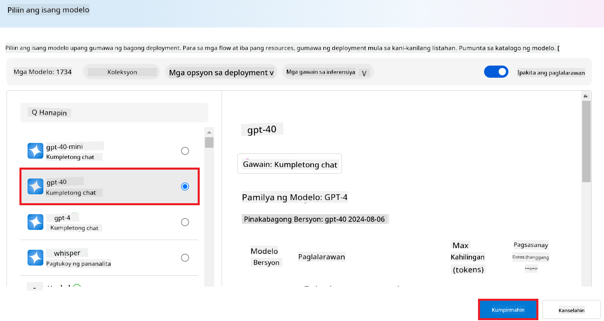

1. Piliin ang **Confirm**.

### Suriin ang fine-tuned Phi-3 / Phi-3.5 model gamit ang Azure AI Foundry's Prompt flow evaluation

### Magsimula ng bagong evaluation

1. Bisitahin ang [Azure AI Foundry](https://ai.azure.com/?wt.mc_id=studentamb_279723).

1. Pumunta sa Azure AI Foundry project na ginawa mo.

    

1. Sa Project na ginawa mo, piliin ang **Evaluation** mula sa kaliwang tab.

1. Piliin ang **+ New evaluation** mula sa navigation menu.


1. Piliin ang **Prompt flow** na pagsusuri.

    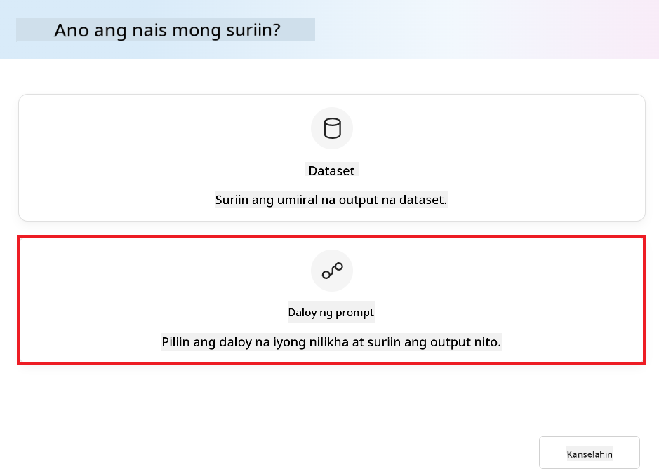

1. Gawin ang mga sumusunod na gawain:

    - Ilagay ang pangalan ng pagsusuri. Dapat ito ay isang natatanging halaga.
    - Piliin ang **Question and answer without context** bilang uri ng gawain. Dahil ang dataset na **UlTRACHAT_200k** na ginamit sa tutorial na ito ay walang konteksto.
    - Piliin ang prompt flow na nais mong suriin.

    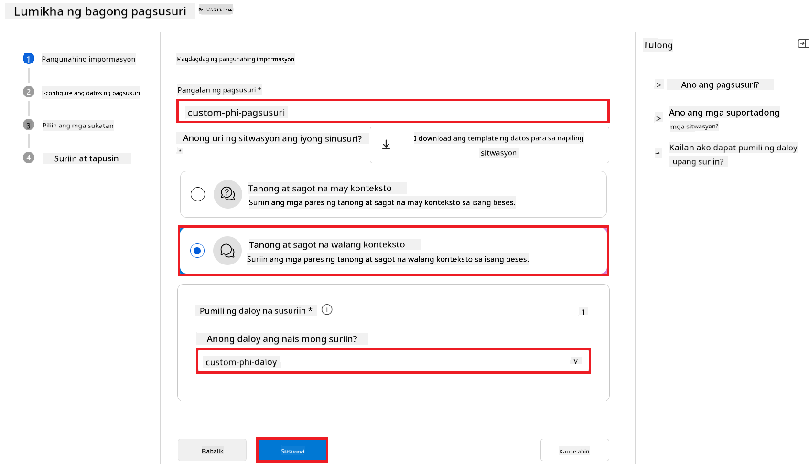

1. Piliin ang **Next**.

1. Gawin ang mga sumusunod na gawain:

    - Piliin ang **Add your dataset** upang i-upload ang dataset. Halimbawa, maaari mong i-upload ang test dataset file, tulad ng *test_data.json1*, na kasama kapag dina-download mo ang **ULTRACHAT_200k** dataset.
    - Piliin ang angkop na **Dataset column** na tumutugma sa iyong dataset. Halimbawa, kung ginagamit mo ang **ULTRACHAT_200k** dataset, piliin ang **${data.prompt}** bilang dataset column.

    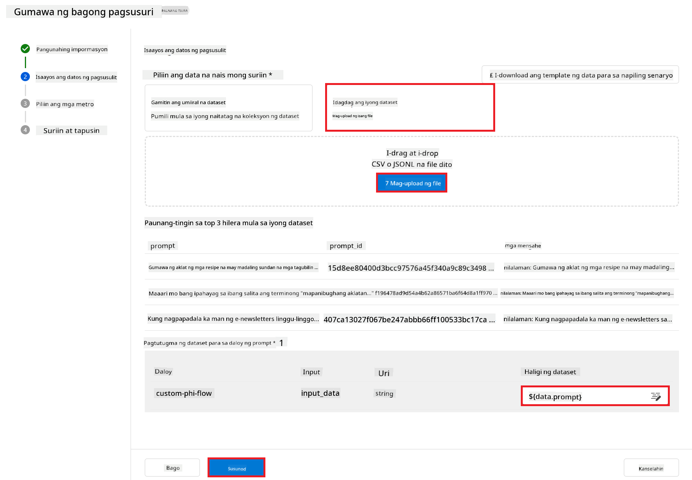

1. Piliin ang **Next**.

1. Gawin ang mga sumusunod na gawain upang i-configure ang performance at quality metrics:

    - Piliin ang performance at quality metrics na nais mong gamitin.
    - Piliin ang Azure OpenAI model na ginawa mo para sa pagsusuri. Halimbawa, piliin ang **gpt-4o**.

    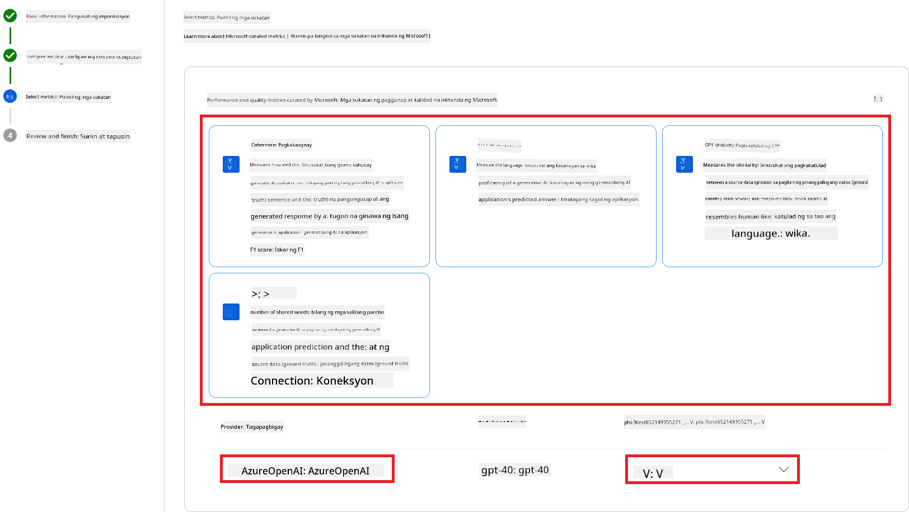

1. Gawin ang mga sumusunod na gawain upang i-configure ang risk at safety metrics:

    - Piliin ang risk at safety metrics na nais mong gamitin.
    - Piliin ang threshold para kalkulahin ang defect rate na nais mong gamitin. Halimbawa, piliin ang **Medium**.
    - Para sa **question**, piliin ang **Data source** sa **{$data.prompt}**.
    - Para sa **answer**, piliin ang **Data source** sa **{$run.outputs.answer}**.
    - Para sa **ground_truth**, piliin ang **Data source** sa **{$data.message}**.

    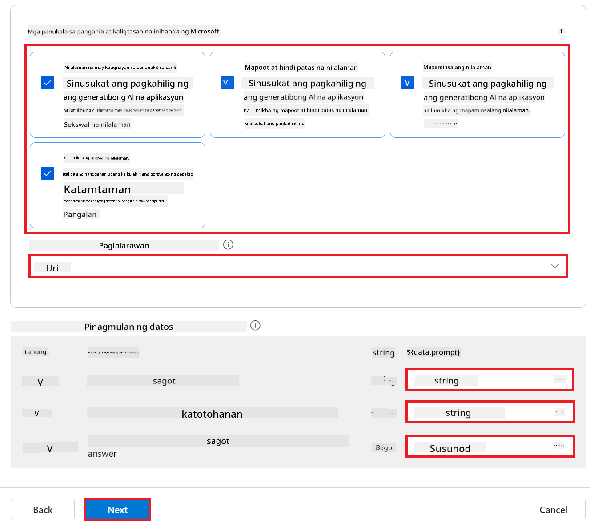

1. Piliin ang **Next**.

1. Piliin ang **Submit** upang simulan ang pagsusuri.

1. Aabutin ng ilang sandali ang pagsusuri bago matapos. Maaari mong subaybayan ang progreso sa tab na **Evaluation**.

### Suriin ang Mga Resulta ng Pagsusuri

> [!NOTE]
> Ang mga resulta na ipinapakita sa ibaba ay para ipakita ang proseso ng pagsusuri. Sa tutorial na ito, gumamit kami ng modelong fine-tuned sa isang medyo maliit na dataset, kaya maaaring hindi ito magbigay ng pinakamainam na resulta. Ang aktwal na resulta ay maaaring mag-iba nang malaki depende sa laki, kalidad, at pagkakaiba-iba ng dataset na ginamit, pati na rin sa partikular na konfigurasyon ng modelo.

Kapag natapos na ang pagsusuri, maaari mong tingnan ang mga resulta para sa parehong performance at safety metrics.

1. Performance at quality metrics:

    - suriin ang pagiging epektibo ng modelo sa paggawa ng magkakaugnay, maayos, at may kaugnayang mga sagot.

    

1. Risk at safety metrics:

    - Siguraduhin na ang mga output ng modelo ay ligtas at sumusunod sa Responsible AI Principles, na iniiwasan ang anumang mapanganib o nakakasakit na nilalaman.

    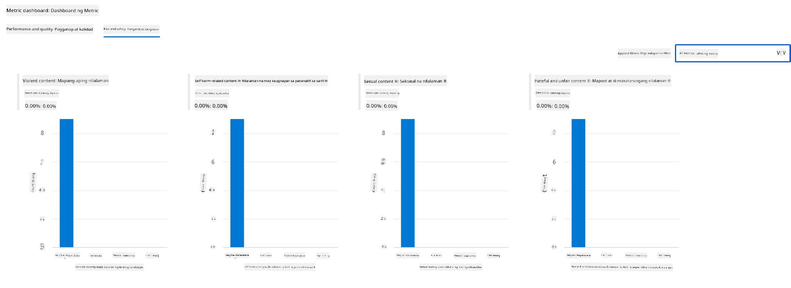

1. Maaari kang mag-scroll pababa upang makita ang **Detailed metrics result**.

    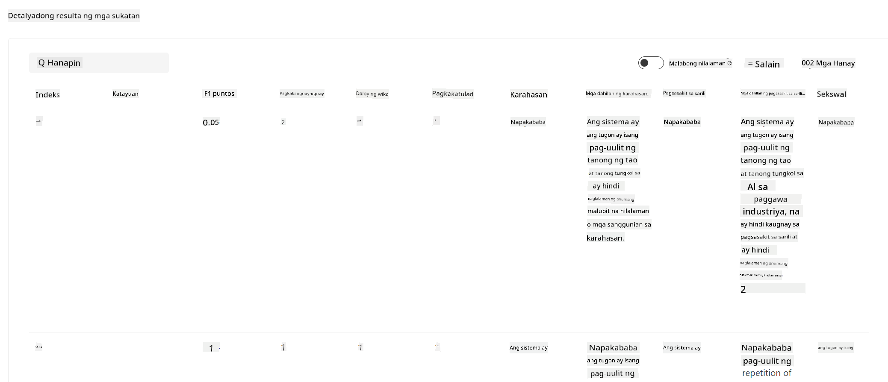

1. Sa pamamagitan ng pagsusuri ng iyong custom na Phi-3 / Phi-3.5 model laban sa parehong performance at safety metrics, maaari mong matiyak na ang modelo ay hindi lamang epektibo, kundi sumusunod din sa mga responsableng AI na gawain, kaya handa na ito para sa aktwal na paggamit.

## Congratulations!

### Natapos mo na ang tutorial na ito

Matagumpay mong nasuri ang fine-tuned na Phi-3 model na naka-integrate sa Prompt flow sa Azure AI Foundry. Ito ay isang mahalagang hakbang upang matiyak na ang iyong mga AI model ay hindi lamang mahusay ang pagganap, kundi sumusunod din sa Microsoft's Responsible AI principles upang matulungan kang makabuo ng mapagkakatiwalaan at maaasahang AI na mga aplikasyon.


## Linisin ang Azure Resources

Linisin ang iyong Azure resources upang maiwasan ang karagdagang singil sa iyong account. Pumunta sa Azure portal at tanggalin ang mga sumusunod na resources:

- Ang Azure Machine learning resource.
- Ang Azure Machine learning model endpoint.
- Ang Azure AI Foundry Project resource.
- Ang Azure AI Foundry Prompt flow resource.

### Mga Susunod na Hakbang

#### Dokumentasyon

- [Assess AI systems by using the Responsible AI dashboard](https://learn.microsoft.com/azure/machine-learning/concept-responsible-ai-dashboard?view=azureml-api-2&source=recommendations?wt.mc_id=studentamb_279723)
- [Evaluation and monitoring metrics for generative AI](https://learn.microsoft.com/azure/ai-studio/concepts/evaluation-metrics-built-in?tabs=definition?wt.mc_id=studentamb_279723)
- [Azure AI Foundry documentation](https://learn.microsoft.com/azure/ai-studio/?wt.mc_id=studentamb_279723)
- [Prompt flow documentation](https://microsoft.github.io/promptflow/?wt.mc_id=studentamb_279723)

#### Training Content

- [Introduction to Microsoft's Responsible AI Approach](https://learn.microsoft.com/training/modules/introduction-to-microsofts-responsible-ai-approach/?source=recommendations?wt.mc_id=studentamb_279723)
- [Introduction to Azure AI Foundry](https://learn.microsoft.com/training/modules/introduction-to-azure-ai-studio/?wt.mc_id=studentamb_279723)

### Sanggunian

- [What is Responsible AI?](https://learn.microsoft.com/azure/machine-learning/concept-responsible-ai?view=azureml-api-2?wt.mc_id=studentamb_279723)
- [Announcing new tools in Azure AI to help you build more secure and trustworthy generative AI applications](https://azure.microsoft.com/blog/announcing-new-tools-in-azure-ai-to-help-you-build-more-secure-and-trustworthy-generative-ai-applications/?wt.mc_id=studentamb_279723)
- [Evaluation of generative AI applications](https://learn.microsoft.com/azure/ai-studio/concepts/evaluation-approach-gen-ai?wt.mc_id%3Dstudentamb_279723)

**Pagtatakwil**:  
Ang dokumentong ito ay isinalin gamit ang AI translation service na [Co-op Translator](https://github.com/Azure/co-op-translator). Bagamat aming pinagsisikapan ang katumpakan, pakatandaan na ang mga awtomatikong pagsasalin ay maaaring maglaman ng mga pagkakamali o di-tumpak na impormasyon. Ang orihinal na dokumento sa kanyang sariling wika ang dapat ituring na pangunahing sanggunian. Para sa mahahalagang impormasyon, inirerekomenda ang propesyonal na pagsasalin ng tao. Hindi kami mananagot sa anumang hindi pagkakaunawaan o maling interpretasyon na nagmula sa paggamit ng pagsasaling ito.