<!--
CO_OP_TRANSLATOR_METADATA:
{
  "original_hash": "80a853c08e4ee25ef9b4bfcedd8990da",
  "translation_date": "2025-07-16T23:49:32+00:00",
  "source_file": "md/02.Application/01.TextAndChat/Phi3/E2E_Phi-3-Evaluation_AIFoundry.md",
  "language_code": "tl"
}
-->
# Evaluate the Fine-tuned Phi-3 / Phi-3.5 Model in Azure AI Foundry Focusing on Microsoft's Responsible AI Principles

Ang end-to-end (E2E) na halimbawa na ito ay batay sa gabay na "[Evaluate Fine-tuned Phi-3 / 3.5 Models in Azure AI Foundry Focusing on Microsoft's Responsible AI](https://techcommunity.microsoft.com/blog/educatordeveloperblog/evaluate-fine-tuned-phi-3--3-5-models-in-azure-ai-studio-focusing-on-microsofts-/4227850?WT.mc_id=aiml-137032-kinfeylo)" mula sa Microsoft Tech Community.

## Pangkalahatang-ideya

### Paano mo masusuri ang kaligtasan at pagganap ng fine-tuned na Phi-3 / Phi-3.5 na modelo sa Azure AI Foundry?

Ang fine-tuning ng isang modelo ay maaaring magdulot ng hindi inaasahan o hindi kanais-nais na mga tugon. Upang matiyak na nananatiling ligtas at epektibo ang modelo, mahalagang suriin ang potensyal nito na makabuo ng mapanganib na nilalaman at ang kakayahan nitong magbigay ng tumpak, may kaugnayan, at magkakaugnay na mga sagot. Sa tutorial na ito, matututuhan mo kung paano suriin ang kaligtasan at pagganap ng fine-tuned na Phi-3 / Phi-3.5 na modelo na naka-integrate sa Prompt flow sa Azure AI Foundry.

Narito ang proseso ng pagsusuri ng Azure AI Foundry.

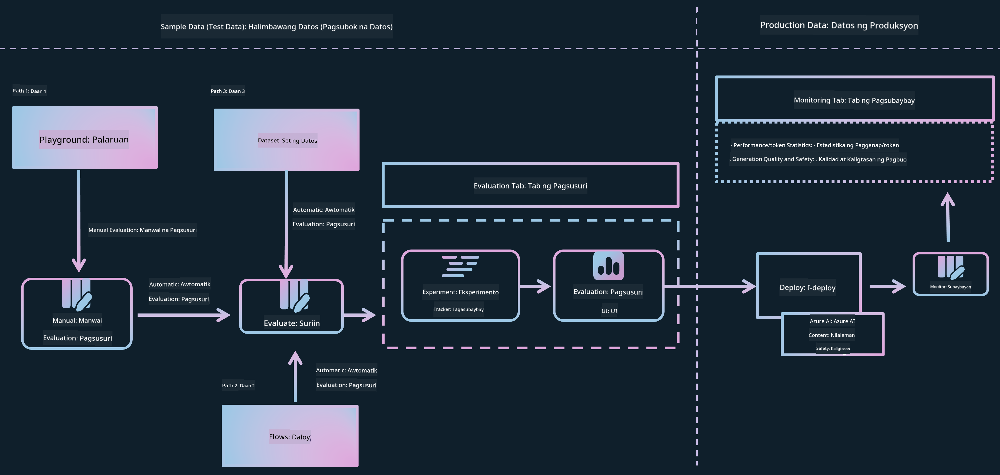

*Pinagmulan ng Larawan: [Evaluation of generative AI applications](https://learn.microsoft.com/azure/ai-studio/concepts/evaluation-approach-gen-ai?wt.mc_id%3Dstudentamb_279723)*

> [!NOTE]
>
> Para sa mas detalyadong impormasyon at upang tuklasin ang karagdagang mga mapagkukunan tungkol sa Phi-3 / Phi-3.5, bisitahin ang [Phi-3CookBook](https://github.com/microsoft/Phi-3CookBook?wt.mc_id=studentamb_279723).

### Mga Kinakailangan

- [Python](https://www.python.org/downloads)
- [Azure subscription](https://azure.microsoft.com/free?wt.mc_id=studentamb_279723)
- [Visual Studio Code](https://code.visualstudio.com)
- Fine-tuned na Phi-3 / Phi-3.5 na modelo

### Talaan ng Nilalaman

1. [**Scenario 1: Panimula sa Azure AI Foundry's Prompt flow evaluation**](../../../../../../md/02.Application/01.TextAndChat/Phi3)

    - [Panimula sa pagsusuri ng kaligtasan](../../../../../../md/02.Application/01.TextAndChat/Phi3)
    - [Panimula sa pagsusuri ng pagganap](../../../../../../md/02.Application/01.TextAndChat/Phi3)

1. [**Scenario 2: Pagsusuri sa Phi-3 / Phi-3.5 na modelo sa Azure AI Foundry**](../../../../../../md/02.Application/01.TextAndChat/Phi3)

    - [Bago ka magsimula](../../../../../../md/02.Application/01.TextAndChat/Phi3)
    - [I-deploy ang Azure OpenAI para suriin ang Phi-3 / Phi-3.5 na modelo](../../../../../../md/02.Application/01.TextAndChat/Phi3)
    - [Suriin ang fine-tuned na Phi-3 / Phi-3.5 na modelo gamit ang Azure AI Foundry's Prompt flow evaluation](../../../../../../md/02.Application/01.TextAndChat/Phi3)

1. [Congratulations!](../../../../../../md/02.Application/01.TextAndChat/Phi3)

## **Scenario 1: Panimula sa Azure AI Foundry's Prompt flow evaluation**

### Panimula sa pagsusuri ng kaligtasan

Upang matiyak na ang iyong AI na modelo ay etikal at ligtas, mahalagang suriin ito batay sa Microsoft's Responsible AI Principles. Sa Azure AI Foundry, pinapayagan ka ng pagsusuri sa kaligtasan na suriin ang kahinaan ng iyong modelo sa jailbreak attacks at ang potensyal nito na makabuo ng mapanganib na nilalaman, na direktang nakaayon sa mga prinsipyong ito.


*Pinagmulan ng Larawan: [Evaluation of generative AI applications](https://learn.microsoft.com/azure/ai-studio/concepts/evaluation-approach-gen-ai?wt.mc_id%3Dstudentamb_279723)*

#### Microsoft's Responsible AI Principles

Bago simulan ang mga teknikal na hakbang, mahalagang maunawaan ang Microsoft's Responsible AI Principles, isang etikal na balangkas na dinisenyo upang gabayan ang responsableng pagbuo, pag-deploy, at operasyon ng mga AI system. Ang mga prinsipyong ito ang gumagabay sa responsableng disenyo, pagbuo, at pag-deploy ng mga AI system, na tinitiyak na ang mga teknolohiyang AI ay ginawa sa paraang patas, transparent, at inklusibo. Ang mga prinsipyong ito ang pundasyon sa pagsusuri ng kaligtasan ng mga AI na modelo.

Kasama sa Microsoft's Responsible AI Principles ang:

- **Katarungan at Pagkakasama**: Dapat tratuhin ng mga AI system ang lahat nang patas at iwasang makaapekto nang magkakaiba sa mga grupong may katulad na kalagayan. Halimbawa, kapag nagbibigay ang mga AI system ng gabay sa medikal na paggamot, aplikasyon sa pautang, o trabaho, dapat silang magbigay ng parehong rekomendasyon sa lahat ng may katulad na sintomas, kalagayang pinansyal, o kwalipikasyong propesyonal.

- **Pagkakatiwalaan at Kaligtasan**: Upang makabuo ng tiwala, mahalaga na ang mga AI system ay gumana nang maaasahan, ligtas, at pare-pareho. Dapat nilang magampanan ang kanilang orihinal na disenyo, tumugon nang ligtas sa mga hindi inaasahang kondisyon, at labanan ang mapanirang manipulasyon. Ang kanilang kilos at ang iba't ibang kondisyon na kaya nilang harapin ay sumasalamin sa mga sitwasyon at kalagayan na inasahan ng mga developer sa panahon ng disenyo at pagsubok.

- **Kalinawan**: Kapag tumutulong ang mga AI system sa paggawa ng mga desisyong may malaking epekto sa buhay ng mga tao, mahalagang maunawaan ng mga tao kung paano ginawa ang mga desisyong iyon. Halimbawa, maaaring gumamit ang isang bangko ng AI system upang tukuyin kung karapat-dapat ba ang isang tao sa kredito. Maaaring gumamit ang isang kumpanya ng AI system upang piliin ang pinaka-karapat-dapat na mga kandidato para sa trabaho.

- **Pribasiya at Seguridad**: Habang lumalaganap ang AI, ang pagprotekta sa pribasiya at seguridad ng personal at pang-negosyong impormasyon ay nagiging mas mahalaga at masalimuot. Sa AI, nangangailangan ng masusing pansin ang pribasiya at seguridad ng datos dahil mahalaga ang access sa datos para makagawa ang mga AI system ng tumpak at may kaalamang mga prediksyon at desisyon tungkol sa mga tao.

- **Panagutan**: Ang mga taong nagdisenyo at nag-deploy ng mga AI system ay dapat managot sa kung paano gumagana ang kanilang mga sistema. Dapat gumamit ang mga organisasyon ng mga pamantayan sa industriya upang bumuo ng mga normang panagutan. Ang mga normang ito ay makasisiguro na ang mga AI system ay hindi ang huling awtoridad sa anumang desisyong nakakaapekto sa buhay ng mga tao. Makasisiguro rin ito na nananatili ang makabuluhang kontrol ng tao sa mga AI system na mataas ang antas ng awtonomiya.

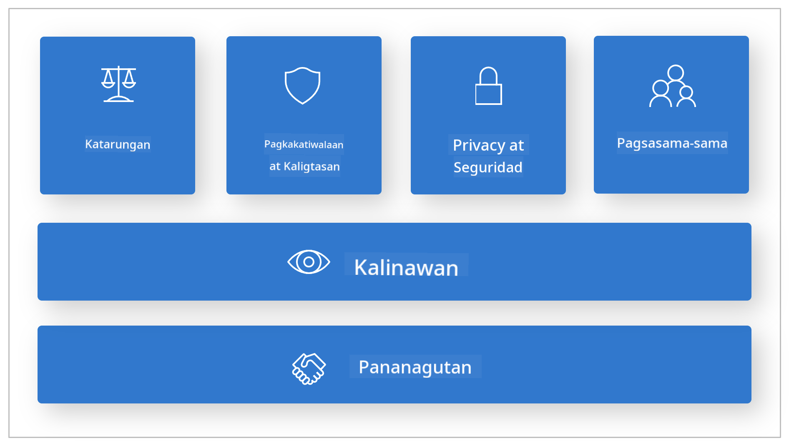

*Pinagmulan ng Larawan: [What is Responsible AI?](https://learn.microsoft.com/azure/machine-learning/concept-responsible-ai?view=azureml-api-2&viewFallbackFrom=azureml-api-2%253fwt.mc_id%3Dstudentamb_279723)*

> [!NOTE]
> Para matuto pa tungkol sa Microsoft's Responsible AI Principles, bisitahin ang [What is Responsible AI?](https://learn.microsoft.com/azure/machine-learning/concept-responsible-ai?view=azureml-api-2?wt.mc_id=studentamb_279723).

#### Mga sukatan sa kaligtasan

Sa tutorial na ito, susuriin mo ang kaligtasan ng fine-tuned na Phi-3 na modelo gamit ang mga safety metrics ng Azure AI Foundry. Tinutulungan ka ng mga sukatan na ito na tasahin ang potensyal ng modelo na makabuo ng mapanganib na nilalaman at ang kahinaan nito sa jailbreak attacks. Kasama sa mga safety metrics ang:

- **Nilalaman na may kaugnayan sa self-harm**: Sinusuri kung may tendensiya ang modelo na gumawa ng nilalaman na may kaugnayan sa self-harm.
- **Mapanirang Nilalaman at Hindi Makatarungang Nilalaman**: Sinusuri kung may tendensiya ang modelo na gumawa ng mapanirang o hindi makatarungang nilalaman.
- **Marahas na Nilalaman**: Sinusuri kung may tendensiya ang modelo na gumawa ng marahas na nilalaman.
- **Nilalamang Sekswal**: Sinusuri kung may tendensiya ang modelo na gumawa ng hindi angkop na nilalamang sekswal.

Ang pagsusuri sa mga aspetong ito ay nagsisiguro na ang AI na modelo ay hindi makabubuo ng mapanganib o nakakasakit na nilalaman, na naaayon sa mga panlipunang halaga at mga regulasyong pamantayan.


### Panimula sa pagsusuri ng pagganap

Upang matiyak na ang iyong AI na modelo ay gumaganap ayon sa inaasahan, mahalagang suriin ang pagganap nito batay sa mga performance metrics. Sa Azure AI Foundry, pinapayagan ka ng pagsusuri sa pagganap na tasahin ang bisa ng iyong modelo sa paggawa ng tumpak, may kaugnayan, at magkakaugnay na mga tugon.


*Pinagmulan ng Larawan: [Evaluation of generative AI applications](https://learn.microsoft.com/azure/ai-studio/concepts/evaluation-approach-gen-ai?wt.mc_id%3Dstudentamb_279723)*

#### Mga sukatan sa pagganap

Sa tutorial na ito, susuriin mo ang pagganap ng fine-tuned na Phi-3 / Phi-3.5 na modelo gamit ang mga performance metrics ng Azure AI Foundry. Tinutulungan ka ng mga sukatan na ito na tasahin ang bisa ng modelo sa paggawa ng tumpak, may kaugnayan, at magkakaugnay na mga tugon. Kasama sa mga performance metrics ang:

- **Groundedness**: Sinusuri kung gaano kahusay ang mga sagot na ginawa ay nakaayon sa impormasyon mula sa pinanggalingang datos.
- **Relevance**: Sinusuri ang kaugnayan ng mga sagot sa mga ibinigay na tanong.
- **Coherence**: Sinusuri kung gaano kakinis ang daloy ng teksto, kung ito ay natural na binabasa, at kung kahawig ng wikang ginagamit ng tao.
- **Fluency**: Sinusuri ang kahusayan sa wika ng teksto na ginawa.
- **GPT Similarity**: Kinukumpara ang sagot na ginawa sa totoong datos para sa pagkakatulad.
- **F1 Score**: Kinakalkula ang proporsyon ng mga salitang pareho sa sagot na ginawa at sa pinanggalingang datos.

Tinutulungan ka ng mga sukatan na ito na tasahin ang bisa ng modelo sa paggawa ng tumpak, may kaugnayan, at magkakaugnay na mga tugon.

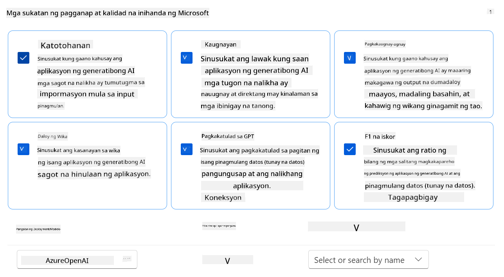

## **Scenario 2: Pagsusuri sa Phi-3 / Phi-3.5 na modelo sa Azure AI Foundry**

### Bago ka magsimula

Ang tutorial na ito ay karugtong ng mga naunang blog post, "[Fine-Tune and Integrate Custom Phi-3 Models with Prompt Flow: Step-by-Step Guide](https://techcommunity.microsoft.com/t5/educator-developer-blog/fine-tune-and-integrate-custom-phi-3-models-with-prompt-flow/ba-p/4178612?wt.mc_id=studentamb_279723)" at "[Fine-Tune and Integrate Custom Phi-3 Models with Prompt Flow in Azure AI Foundry](https://techcommunity.microsoft.com/t5/educator-developer-blog/fine-tune-and-integrate-custom-phi-3-models-with-prompt-flow-in/ba-p/4191726?wt.mc_id=studentamb_279723)." Sa mga post na ito, tinahak natin ang proseso ng fine-tuning ng Phi-3 / Phi-3.5 na modelo sa Azure AI Foundry at ang pag-integrate nito sa Prompt flow.

Sa tutorial na ito, magde-deploy ka ng Azure OpenAI na modelo bilang evaluator sa Azure AI Foundry at gagamitin ito upang suriin ang iyong fine-tuned na Phi-3 / Phi-3.5 na modelo.

Bago simulan ang tutorial na ito, siguraduhing mayroon kang mga sumusunod na kinakailangan, tulad ng inilalarawan sa mga naunang tutorial:

1. Isang handang dataset para suriin ang fine-tuned na Phi-3 / Phi-3.5 na modelo.
1. Isang Phi-3 / Phi-3.5 na modelo na na-fine-tune at na-deploy sa Azure Machine Learning.
1. Isang Prompt flow na naka-integrate sa iyong fine-tuned na Phi-3 / Phi-3.5 na modelo sa Azure AI Foundry.

> [!NOTE]
> Gagamitin mo ang *test_data.jsonl* na file, na matatagpuan sa data folder mula sa **ULTRACHAT_200k** dataset na na-download sa mga naunang blog post, bilang dataset para suriin ang fine-tuned na Phi-3 / Phi-3.5 na modelo.

#### I-integrate ang custom na Phi-3 / Phi-3.5 na modelo sa Prompt flow sa Azure AI Foundry (Code first approach)
> [!NOTE]
> Kung sinunod mo ang low-code na paraan na inilarawan sa "[Fine-Tune and Integrate Custom Phi-3 Models with Prompt Flow in Azure AI Foundry](https://techcommunity.microsoft.com/t5/educator-developer-blog/fine-tune-and-integrate-custom-phi-3-models-with-prompt-flow-in/ba-p/4191726?wt.mc_id=studentamb_279723)", maaari mong laktawan ang pagsasanay na ito at magpatuloy sa susunod.
> Ngunit, kung sinunod mo ang code-first na paraan na inilarawan sa "[Fine-Tune and Integrate Custom Phi-3 Models with Prompt Flow: Step-by-Step Guide](https://techcommunity.microsoft.com/t5/educator-developer-blog/fine-tune-and-integrate-custom-phi-3-models-with-prompt-flow/ba-p/4178612?wt.mc_id=studentamb_279723)" para i-fine-tune at i-deploy ang iyong Phi-3 / Phi-3.5 na modelo, bahagyang iba ang proseso ng pagkonekta ng iyong modelo sa Prompt flow. Malalaman mo ang prosesong ito sa pagsasanay na ito.
Para magpatuloy, kailangan mong i-integrate ang iyong fine-tuned na Phi-3 / Phi-3.5 model sa Prompt flow sa Azure AI Foundry.

#### Gumawa ng Azure AI Foundry Hub

Kailangan mong gumawa ng Hub bago gumawa ng Project. Ang Hub ay parang Resource Group, na nagbibigay-daan sa iyo upang ayusin at pamahalaan ang maraming Projects sa loob ng Azure AI Foundry.

1. Mag-sign in sa [Azure AI Foundry](https://ai.azure.com/?wt.mc_id=studentamb_279723).

1. Piliin ang **All hubs** mula sa kaliwang tab.

1. Piliin ang **+ New hub** mula sa navigation menu.

    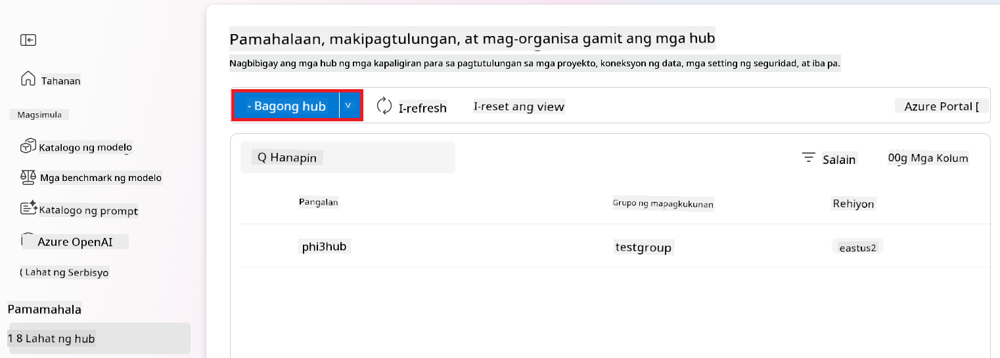

1. Gawin ang mga sumusunod na hakbang:

    - Ilagay ang **Hub name**. Dapat ito ay natatanging pangalan.
    - Piliin ang iyong Azure **Subscription**.
    - Piliin ang **Resource group** na gagamitin (gumawa ng bago kung kinakailangan).
    - Piliin ang **Location** na nais mong gamitin.
    - Piliin ang **Connect Azure AI Services** na gagamitin (gumawa ng bago kung kinakailangan).
    - Piliin ang **Connect Azure AI Search** sa **Skip connecting**.

    

1. Piliin ang **Next**.

#### Gumawa ng Azure AI Foundry Project

1. Sa Hub na ginawa mo, piliin ang **All projects** mula sa kaliwang tab.

1. Piliin ang **+ New project** mula sa navigation menu.

    

1. Ilagay ang **Project name**. Dapat ito ay natatanging pangalan.

    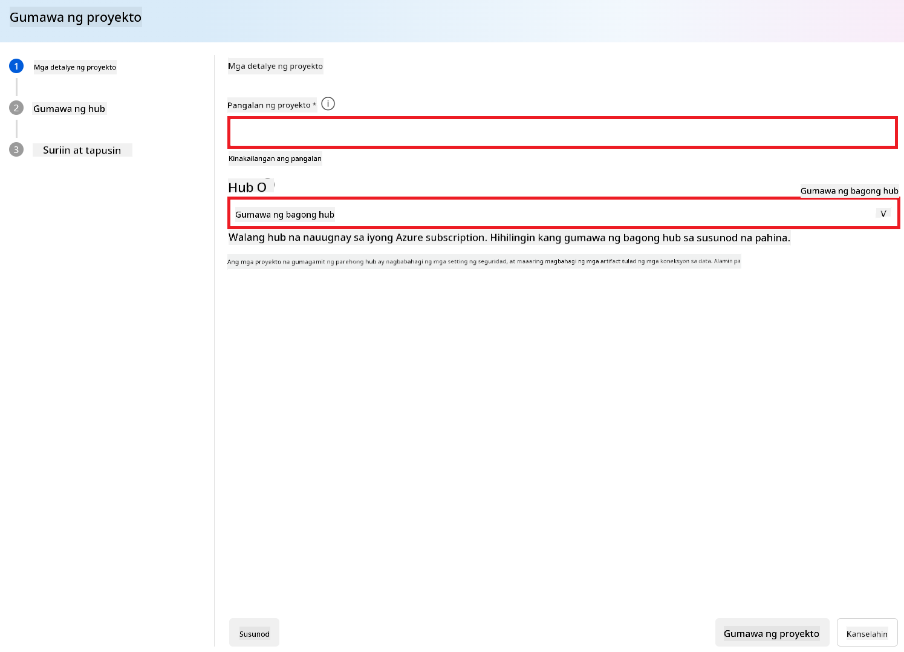

1. Piliin ang **Create a project**.

#### Magdagdag ng custom connection para sa fine-tuned na Phi-3 / Phi-3.5 model

Para i-integrate ang iyong custom na Phi-3 / Phi-3.5 model sa Prompt flow, kailangan mong i-save ang endpoint at key ng model sa isang custom connection. Tinitiyak ng setup na ito ang access sa iyong custom na Phi-3 / Phi-3.5 model sa Prompt flow.

#### Itakda ang api key at endpoint uri ng fine-tuned na Phi-3 / Phi-3.5 model

1. Bisitahin ang [Azure ML Studio](https://ml.azure.com/home?wt.mc_id=studentamb_279723).

1. Pumunta sa Azure Machine learning workspace na ginawa mo.

1. Piliin ang **Endpoints** mula sa kaliwang tab.

    

1. Piliin ang endpoint na ginawa mo.

    

1. Piliin ang **Consume** mula sa navigation menu.

1. Kopyahin ang iyong **REST endpoint** at **Primary key**.

    

#### Idagdag ang Custom Connection

1. Bisitahin ang [Azure AI Foundry](https://ai.azure.com/?wt.mc_id=studentamb_279723).

1. Pumunta sa Azure AI Foundry project na ginawa mo.

1. Sa Project na ginawa mo, piliin ang **Settings** mula sa kaliwang tab.

1. Piliin ang **+ New connection**.

    

1. Piliin ang **Custom keys** mula sa navigation menu.

    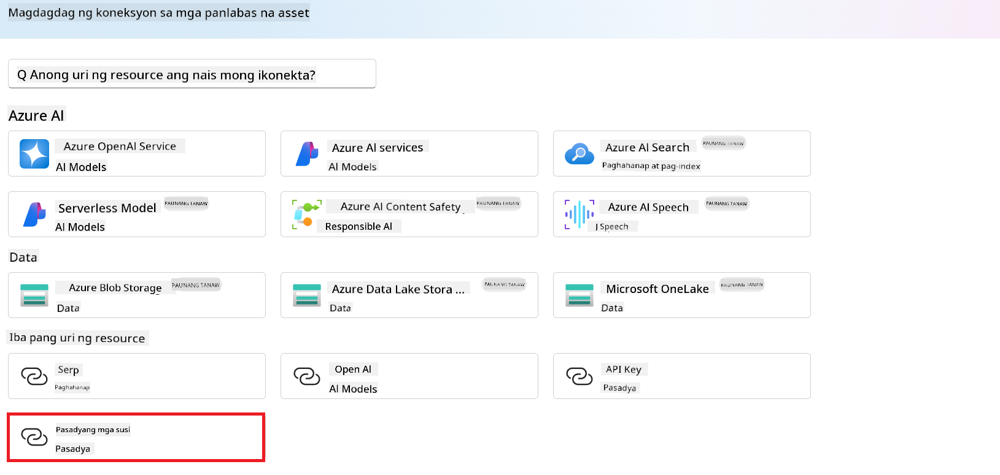

1. Gawin ang mga sumusunod:

    - Piliin ang **+ Add key value pairs**.
    - Para sa pangalan ng key, ilagay ang **endpoint** at i-paste ang endpoint na kinopya mo mula sa Azure ML Studio sa value field.
    - Piliin muli ang **+ Add key value pairs**.
    - Para sa pangalan ng key, ilagay ang **key** at i-paste ang key na kinopya mo mula sa Azure ML Studio sa value field.
    - Pagkatapos maidagdag ang mga keys, piliin ang **is secret** upang hindi makita ang key.

    

1. Piliin ang **Add connection**.

#### Gumawa ng Prompt flow

Nagdagdag ka na ng custom connection sa Azure AI Foundry. Ngayon, gumawa tayo ng Prompt flow gamit ang mga sumusunod na hakbang. Pagkatapos, ikokonekta mo ang Prompt flow na ito sa custom connection para magamit ang fine-tuned na model sa loob ng Prompt flow.

1. Pumunta sa Azure AI Foundry project na ginawa mo.

1. Piliin ang **Prompt flow** mula sa kaliwang tab.

1. Piliin ang **+ Create** mula sa navigation menu.

    

1. Piliin ang **Chat flow** mula sa navigation menu.

    

1. Ilagay ang **Folder name** na gagamitin.

    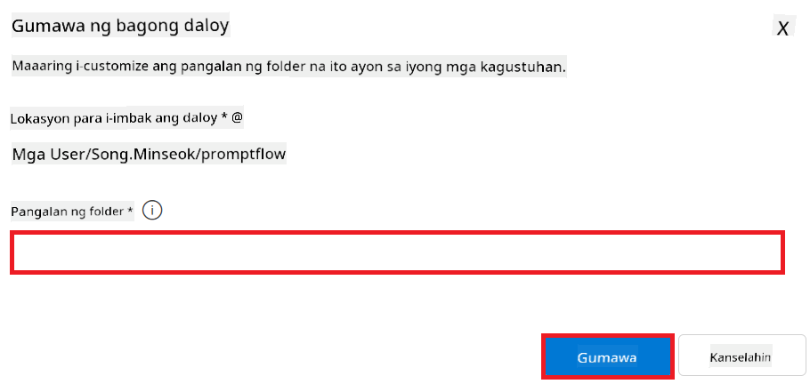

1. Piliin ang **Create**.

#### I-setup ang Prompt flow para makipag-chat sa iyong custom na Phi-3 / Phi-3.5 model

Kailangan mong i-integrate ang fine-tuned na Phi-3 / Phi-3.5 model sa isang Prompt flow. Ngunit, ang kasalukuyang Prompt flow na ibinigay ay hindi disenyo para dito. Kaya, kailangan mong baguhin ang Prompt flow para payagan ang integration ng custom na model.

1. Sa Prompt flow, gawin ang mga sumusunod upang muling buuin ang kasalukuyang flow:

    - Piliin ang **Raw file mode**.
    - Burahin lahat ng umiiral na code sa *flow.dag.yml* na file.
    - Idagdag ang sumusunod na code sa *flow.dag.yml*.

        ```yml
        inputs:
          input_data:
            type: string
            default: "Who founded Microsoft?"

        outputs:
          answer:
            type: string
            reference: ${integrate_with_promptflow.output}

        nodes:
        - name: integrate_with_promptflow
          type: python
          source:
            type: code
            path: integrate_with_promptflow.py
          inputs:
            input_data: ${inputs.input_data}
        ```

    - Piliin ang **Save**.

    

1. Idagdag ang sumusunod na code sa *integrate_with_promptflow.py* para magamit ang custom na Phi-3 / Phi-3.5 model sa Prompt flow.

    ```python
    import logging
    import requests
    from promptflow import tool
    from promptflow.connections import CustomConnection

    # Logging setup
    logging.basicConfig(
        format="%(asctime)s - %(levelname)s - %(name)s - %(message)s",
        datefmt="%Y-%m-%d %H:%M:%S",
        level=logging.DEBUG
    )
    logger = logging.getLogger(__name__)

    def query_phi3_model(input_data: str, connection: CustomConnection) -> str:
        """
        Send a request to the Phi-3 / Phi-3.5 model endpoint with the given input data using Custom Connection.
        """

        # "connection" is the name of the Custom Connection, "endpoint", "key" are the keys in the Custom Connection
        endpoint_url = connection.endpoint
        api_key = connection.key

        headers = {
            "Content-Type": "application/json",
            "Authorization": f"Bearer {api_key}"
        }
    data = {
        "input_data": [input_data],
        "params": {
            "temperature": 0.7,
            "max_new_tokens": 128,
            "do_sample": True,
            "return_full_text": True
            }
        }
        try:
            response = requests.post(endpoint_url, json=data, headers=headers)
            response.raise_for_status()
            
            # Log the full JSON response
            logger.debug(f"Full JSON response: {response.json()}")

            result = response.json()["output"]
            logger.info("Successfully received response from Azure ML Endpoint.")
            return result
        except requests.exceptions.RequestException as e:
            logger.error(f"Error querying Azure ML Endpoint: {e}")
            raise

    @tool
    def my_python_tool(input_data: str, connection: CustomConnection) -> str:
        """
        Tool function to process input data and query the Phi-3 / Phi-3.5 model.
        """
        return query_phi3_model(input_data, connection)

    ```

    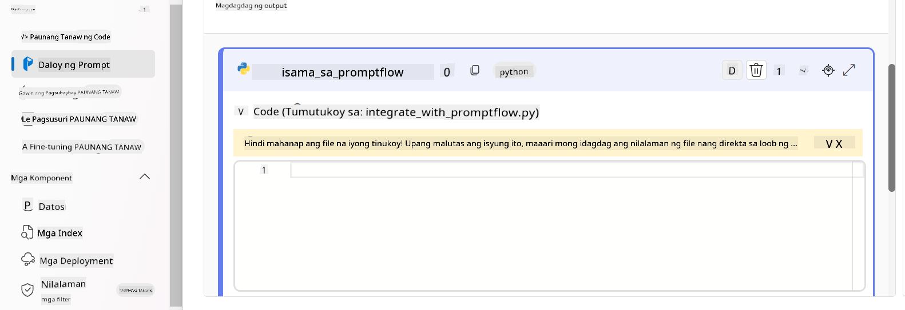

> [!NOTE]
> Para sa mas detalyadong impormasyon tungkol sa paggamit ng Prompt flow sa Azure AI Foundry, maaari mong tingnan ang [Prompt flow in Azure AI Foundry](https://learn.microsoft.com/azure/ai-studio/how-to/prompt-flow).

1. Piliin ang **Chat input**, **Chat output** para paganahin ang chat sa iyong model.

    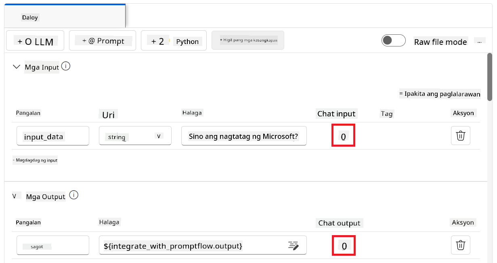

1. Handa ka na ngayong makipag-chat sa iyong custom na Phi-3 / Phi-3.5 model. Sa susunod na ehersisyo, matututuhan mo kung paano simulan ang Prompt flow at gamitin ito para makipag-chat sa iyong fine-tuned na Phi-3 / Phi-3.5 model.

> [!NOTE]
>
> Ang muling binuong flow ay dapat magmukhang ganito:
>
> 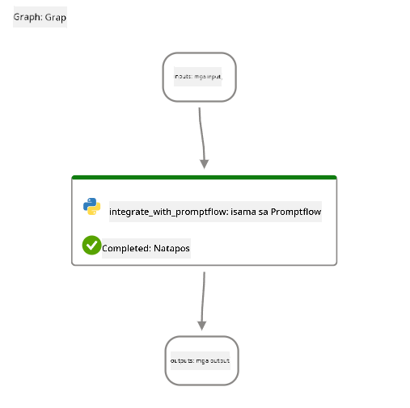
>

#### Simulan ang Prompt flow

1. Piliin ang **Start compute sessions** para simulan ang Prompt flow.

    

1. Piliin ang **Validate and parse input** para i-renew ang mga parameter.

    

1. Piliin ang **Value** ng **connection** sa custom connection na ginawa mo. Halimbawa, *connection*.

    

#### Makipag-chat sa iyong custom na Phi-3 / Phi-3.5 model

1. Piliin ang **Chat**.

    

1. Narito ang halimbawa ng resulta: Ngayon ay maaari ka nang makipag-chat sa iyong custom na Phi-3 / Phi-3.5 model. Inirerekomenda na magtanong base sa data na ginamit sa fine-tuning.

    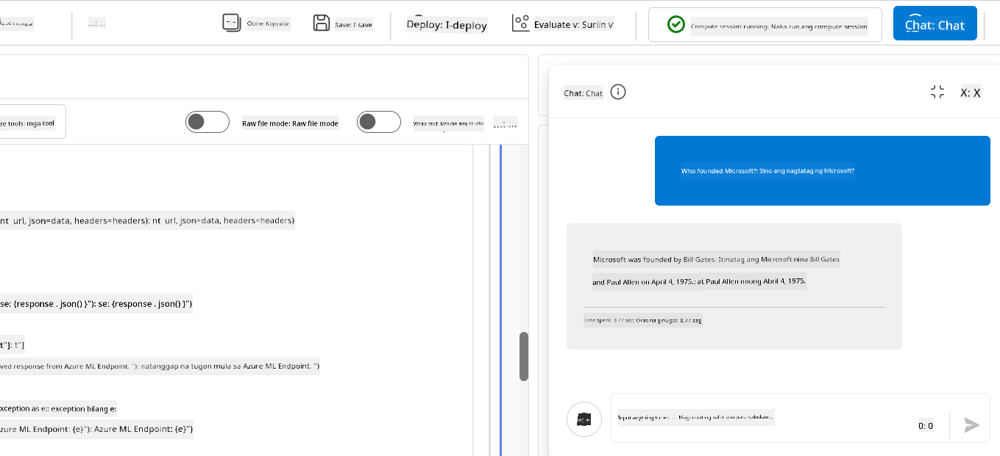

### I-deploy ang Azure OpenAI para suriin ang Phi-3 / Phi-3.5 model

Para suriin ang Phi-3 / Phi-3.5 model sa Azure AI Foundry, kailangan mong i-deploy ang isang Azure OpenAI model. Gagamitin ang modelong ito para suriin ang performance ng Phi-3 / Phi-3.5 model.

#### I-deploy ang Azure OpenAI

1. Mag-sign in sa [Azure AI Foundry](https://ai.azure.com/?wt.mc_id=studentamb_279723).

1. Pumunta sa Azure AI Foundry project na ginawa mo.

    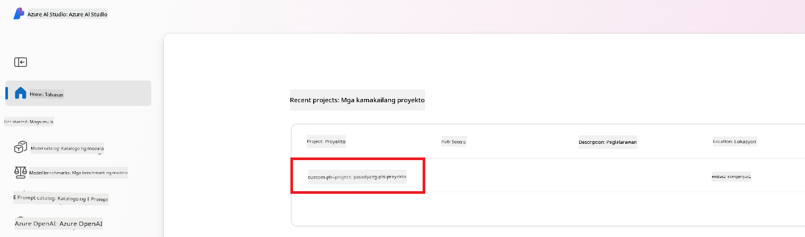

1. Sa Project na ginawa mo, piliin ang **Deployments** mula sa kaliwang tab.

1. Piliin ang **+ Deploy model** mula sa navigation menu.

1. Piliin ang **Deploy base model**.

    

1. Piliin ang Azure OpenAI model na nais mong gamitin. Halimbawa, **gpt-4o**.

    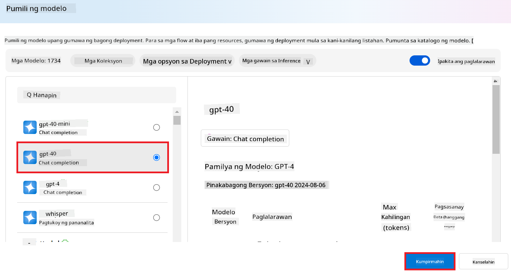

1. Piliin ang **Confirm**.

### Suriin ang fine-tuned na Phi-3 / Phi-3.5 model gamit ang Prompt flow evaluation ng Azure AI Foundry

### Magsimula ng bagong pagsusuri

1. Bisitahin ang [Azure AI Foundry](https://ai.azure.com/?wt.mc_id=studentamb_279723).

1. Pumunta sa Azure AI Foundry project na ginawa mo.

    

1. Sa Project na ginawa mo, piliin ang **Evaluation** mula sa kaliwang tab.

1. Piliin ang **+ New evaluation** mula sa navigation menu.

    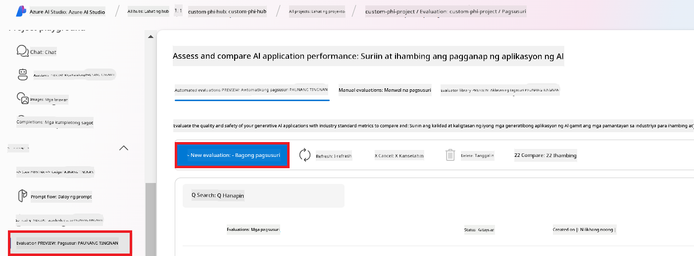

1. Piliin ang **Prompt flow** evaluation.

    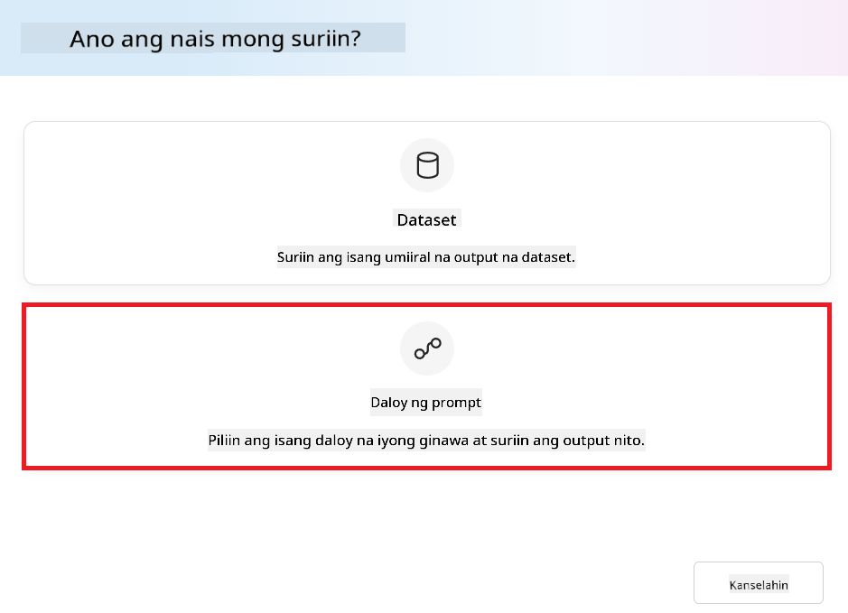

1. Gawin ang mga sumusunod:

    - Ilagay ang pangalan ng evaluation. Dapat ito ay natatanging pangalan.
    - Piliin ang **Question and answer without context** bilang uri ng gawain. Dahil, ang **ULTRACHAT_200k** dataset na ginamit sa tutorial na ito ay walang context.
    - Piliin ang prompt flow na nais mong suriin.

    

1. Piliin ang **Next**.

1. Gawin ang mga sumusunod:

    - Piliin ang **Add your dataset** para i-upload ang dataset. Halimbawa, maaari mong i-upload ang test dataset file, tulad ng *test_data.json1*, na kasama kapag dine-download mo ang **ULTRACHAT_200k** dataset.
    - Piliin ang angkop na **Dataset column** na tumutugma sa iyong dataset. Halimbawa, kung ginagamit mo ang **ULTRACHAT_200k** dataset, piliin ang **${data.prompt}** bilang dataset column.

    

1. Piliin ang **Next**.

1. Gawin ang mga sumusunod para i-configure ang performance at quality metrics:

    - Piliin ang performance at quality metrics na nais mong gamitin.
    - Piliin ang Azure OpenAI model na ginawa mo para sa pagsusuri. Halimbawa, piliin ang **gpt-4o**.

    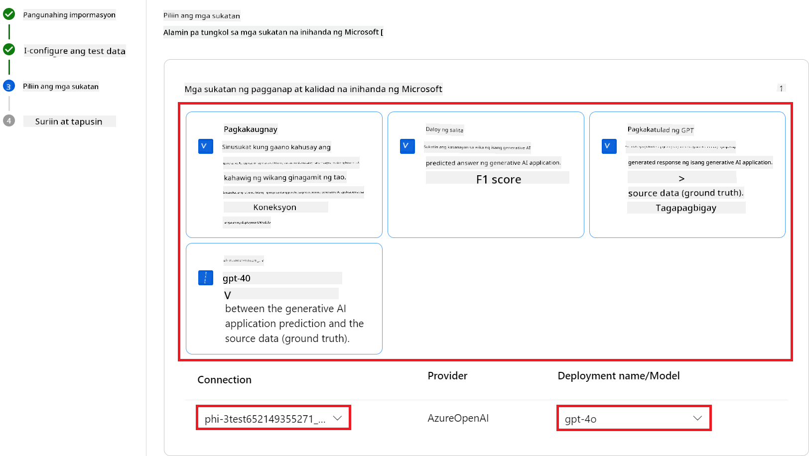

1. Gawin ang mga sumusunod para i-configure ang risk at safety metrics:

    - Piliin ang risk at safety metrics na nais mong gamitin.
    - Piliin ang threshold para kalkulahin ang defect rate na nais mong gamitin. Halimbawa, piliin ang **Medium**.
    - Para sa **question**, piliin ang **Data source** sa **{$data.prompt}**.
    - Para sa **answer**, piliin ang **Data source** sa **{$run.outputs.answer}**.
    - Para sa **ground_truth**, piliin ang **Data source** sa **{$data.message}**.

    

1. Piliin ang **Next**.

1. Piliin ang **Submit** para simulan ang pagsusuri.

1. Aabutin ng ilang sandali ang pagsusuri bago matapos. Maaari mong subaybayan ang progreso sa tab na **Evaluation**.

### Suriin ang Resulta ng Pagsusuri
> [!NOTE]
> Ang mga resulta na ipinakita sa ibaba ay layuning ipakita ang proseso ng pagsusuri. Sa tutorial na ito, gumamit kami ng modelong na-fine-tune sa isang medyo maliit na dataset, kaya maaaring magdulot ito ng hindi ganap na pinakamainam na mga resulta. Ang aktwal na mga resulta ay maaaring mag-iba nang malaki depende sa laki, kalidad, at pagkakaiba-iba ng dataset na ginamit, pati na rin sa partikular na konfigurasyon ng modelo.
Kapag natapos na ang pagsusuri, maaari mong tingnan ang mga resulta para sa parehong performance at safety metrics.

1. Mga sukatan ng performance at kalidad:

    - suriin ang bisa ng modelo sa pagbuo ng magkakaugnay, maayos, at may kaugnayang mga sagot.

    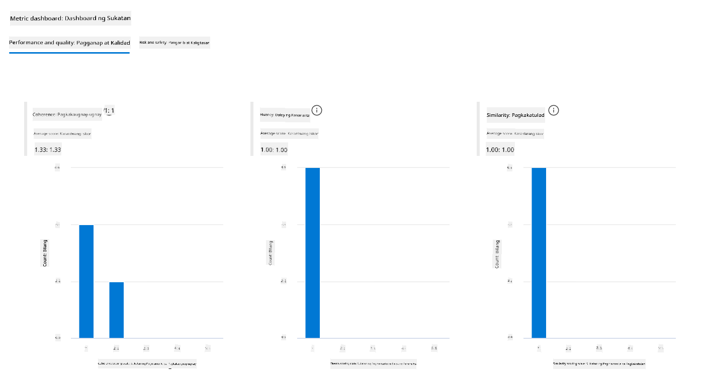

1. Mga sukatan ng panganib at kaligtasan:

    - Tiyakin na ang mga output ng modelo ay ligtas at sumusunod sa Responsible AI Principles, iwasan ang anumang mapanganib o nakakasakit na nilalaman.

    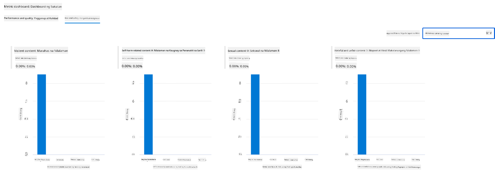

1. Maaari kang mag-scroll pababa upang makita ang **Detalyadong resulta ng mga sukatan**.

    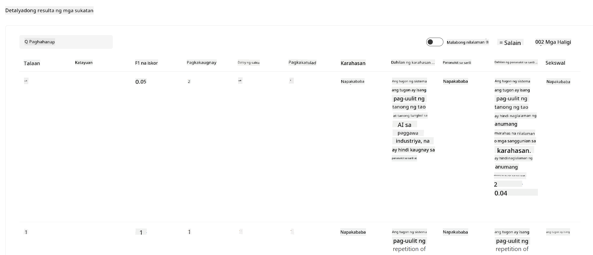

1. Sa pamamagitan ng pagsusuri ng iyong custom na Phi-3 / Phi-3.5 na modelo laban sa parehong performance at safety metrics, makukumpirma mo na ang modelo ay hindi lamang epektibo, kundi sumusunod din sa mga responsableng AI na praktis, kaya handa na itong gamitin sa totoong mundo.

## Binabati kita!

### Natapos mo na ang tutorial na ito

Matagumpay mong nasuri ang fine-tuned na Phi-3 na modelo na isinama sa Prompt flow sa Azure AI Foundry. Ito ay isang mahalagang hakbang upang matiyak na ang iyong mga AI na modelo ay hindi lamang mahusay ang performance, kundi sumusunod din sa mga prinsipyo ng Responsible AI ng Microsoft upang matulungan kang bumuo ng mapagkakatiwalaan at maaasahang mga AI application.


## Linisin ang mga Azure Resources

Linisin ang iyong mga Azure resources upang maiwasan ang karagdagang singil sa iyong account. Pumunta sa Azure portal at tanggalin ang mga sumusunod na resources:

- Ang Azure Machine learning resource.
- Ang Azure Machine learning model endpoint.
- Ang Azure AI Foundry Project resource.
- Ang Azure AI Foundry Prompt flow resource.

### Mga Susunod na Hakbang

#### Dokumentasyon

- [Assess AI systems by using the Responsible AI dashboard](https://learn.microsoft.com/azure/machine-learning/concept-responsible-ai-dashboard?view=azureml-api-2&source=recommendations?wt.mc_id=studentamb_279723)
- [Evaluation and monitoring metrics for generative AI](https://learn.microsoft.com/azure/ai-studio/concepts/evaluation-metrics-built-in?tabs=definition?wt.mc_id=studentamb_279723)
- [Azure AI Foundry documentation](https://learn.microsoft.com/azure/ai-studio/?wt.mc_id=studentamb_279723)
- [Prompt flow documentation](https://microsoft.github.io/promptflow/?wt.mc_id=studentamb_279723)

#### Nilalaman ng Pagsasanay

- [Introduction to Microsoft's Responsible AI Approach](https://learn.microsoft.com/training/modules/introduction-to-microsofts-responsible-ai-approach/?source=recommendations?wt.mc_id=studentamb_279723)
- [Introduction to Azure AI Foundry](https://learn.microsoft.com/training/modules/introduction-to-azure-ai-studio/?wt.mc_id=studentamb_279723)

### Sanggunian

- [What is Responsible AI?](https://learn.microsoft.com/azure/machine-learning/concept-responsible-ai?view=azureml-api-2?wt.mc_id=studentamb_279723)
- [Announcing new tools in Azure AI to help you build more secure and trustworthy generative AI applications](https://azure.microsoft.com/blog/announcing-new-tools-in-azure-ai-to-help-you-build-more-secure-and-trustworthy-generative-ai-applications/?wt.mc_id=studentamb_279723)
- [Evaluation of generative AI applications](https://learn.microsoft.com/azure/ai-studio/concepts/evaluation-approach-gen-ai?wt.mc_id%3Dstudentamb_279723)

**Paalala**:  
Ang dokumentong ito ay isinalin gamit ang AI translation service na [Co-op Translator](https://github.com/Azure/co-op-translator). Bagamat nagsusumikap kami para sa katumpakan, pakatandaan na ang mga awtomatikong pagsasalin ay maaaring maglaman ng mga pagkakamali o di-tumpak na impormasyon. Ang orihinal na dokumento sa orihinal nitong wika ang dapat ituring na pangunahing sanggunian. Para sa mahahalagang impormasyon, inirerekomenda ang propesyonal na pagsasalin ng tao. Hindi kami mananagot sa anumang hindi pagkakaunawaan o maling interpretasyon na maaaring magmula sa paggamit ng pagsasaling ito.