<!--
CO_OP_TRANSLATOR_METADATA:
{
  "original_hash": "455be2b7b9c3390d367d528f8fab2aa0",
  "translation_date": "2025-07-17T00:39:10+00:00",
  "source_file": "md/02.Application/01.TextAndChat/Phi3/E2E_Phi-3-FineTuning_PromptFlow_Integration.md",
  "language_code": "tl"
}
-->
# Fine-tune at I-integrate ang custom na Phi-3 models gamit ang Prompt flow

Ang end-to-end (E2E) na halimbawa na ito ay batay sa gabay na "[Fine-Tune and Integrate Custom Phi-3 Models with Prompt Flow: Step-by-Step Guide](https://techcommunity.microsoft.com/t5/educator-developer-blog/fine-tune-and-integrate-custom-phi-3-models-with-prompt-flow/ba-p/4178612?WT.mc_id=aiml-137032-kinfeylo)" mula sa Microsoft Tech Community. Ipinapakilala nito ang mga proseso ng fine-tuning, deployment, at integrasyon ng custom na Phi-3 models gamit ang Prompt flow.

## Pangkalahatang-ideya

Sa E2E na halimbawa na ito, matututuhan mo kung paano i-fine-tune ang Phi-3 model at i-integrate ito sa Prompt flow. Sa pamamagitan ng paggamit ng Azure Machine Learning at Prompt flow, makakabuo ka ng workflow para sa deployment at paggamit ng custom AI models. Ang E2E na halimbawa na ito ay nahahati sa tatlong senaryo:

**Senaryo 1: I-set up ang Azure resources at Ihanda para sa fine-tuning**

**Senaryo 2: I-fine-tune ang Phi-3 model at I-deploy sa Azure Machine Learning Studio**

**Senaryo 3: I-integrate sa Prompt flow at Makipag-chat gamit ang iyong custom na modelo**

Narito ang pangkalahatang-ideya ng E2E na halimbawa na ito.

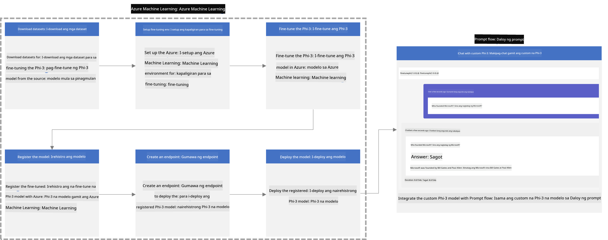

### Talaan ng Nilalaman

1. **[Senaryo 1: I-set up ang Azure resources at Ihanda para sa fine-tuning](../../../../../../md/02.Application/01.TextAndChat/Phi3)**
    - [Gumawa ng Azure Machine Learning Workspace](../../../../../../md/02.Application/01.TextAndChat/Phi3)
    - [Humiling ng GPU quotas sa Azure Subscription](../../../../../../md/02.Application/01.TextAndChat/Phi3)
    - [Magdagdag ng role assignment](../../../../../../md/02.Application/01.TextAndChat/Phi3)
    - [I-set up ang proyekto](../../../../../../md/02.Application/01.TextAndChat/Phi3)
    - [Ihanda ang dataset para sa fine-tuning](../../../../../../md/02.Application/01.TextAndChat/Phi3)

1. **[Senaryo 2: I-fine-tune ang Phi-3 model at I-deploy sa Azure Machine Learning Studio](../../../../../../md/02.Application/01.TextAndChat/Phi3)**
    - [I-set up ang Azure CLI](../../../../../../md/02.Application/01.TextAndChat/Phi3)
    - [I-fine-tune ang Phi-3 model](../../../../../../md/02.Application/01.TextAndChat/Phi3)
    - [I-deploy ang fine-tuned na modelo](../../../../../../md/02.Application/01.TextAndChat/Phi3)

1. **[Senaryo 3: I-integrate sa Prompt flow at Makipag-chat gamit ang iyong custom na modelo](../../../../../../md/02.Application/01.TextAndChat/Phi3)**
    - [I-integrate ang custom na Phi-3 model sa Prompt flow](../../../../../../md/02.Application/01.TextAndChat/Phi3)
    - [Makipag-chat gamit ang iyong custom na modelo](../../../../../../md/02.Application/01.TextAndChat/Phi3)

## Senaryo 1: I-set up ang Azure resources at Ihanda para sa fine-tuning

### Gumawa ng Azure Machine Learning Workspace

1. I-type ang *azure machine learning* sa **search bar** sa itaas ng portal page at piliin ang **Azure Machine Learning** mula sa mga lumabas na opsyon.

    

1. Piliin ang **+ Create** mula sa navigation menu.

1. Piliin ang **New workspace** mula sa navigation menu.

    

1. Gawin ang mga sumusunod na hakbang:

    - Piliin ang iyong Azure **Subscription**.
    - Piliin ang **Resource group** na gagamitin (gumawa ng bago kung kinakailangan).
    - Ilagay ang **Workspace Name**. Dapat ito ay natatanging pangalan.
    - Piliin ang **Region** na nais mong gamitin.
    - Piliin ang **Storage account** na gagamitin (gumawa ng bago kung kinakailangan).
    - Piliin ang **Key vault** na gagamitin (gumawa ng bago kung kinakailangan).
    - Piliin ang **Application insights** na gagamitin (gumawa ng bago kung kinakailangan).
    - Piliin ang **Container registry** na gagamitin (gumawa ng bago kung kinakailangan).

    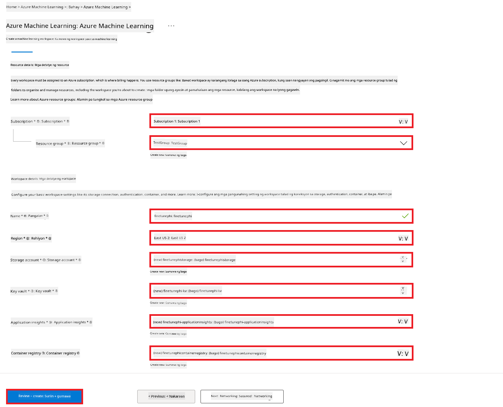

1. Piliin ang **Review + Create**.

1. Piliin ang **Create**.

### Humiling ng GPU quotas sa Azure Subscription

Sa E2E na halimbawa na ito, gagamitin mo ang *Standard_NC24ads_A100_v4 GPU* para sa fine-tuning, na nangangailangan ng quota request, at ang *Standard_E4s_v3* CPU para sa deployment, na hindi nangangailangan ng quota request.

> [!NOTE]
>
> Ang Pay-As-You-Go subscriptions lamang (ang karaniwang uri ng subscription) ang kwalipikado para sa GPU allocation; hindi pa sinusuportahan ang benefit subscriptions.
>
> Para sa mga gumagamit ng benefit subscriptions (tulad ng Visual Studio Enterprise Subscription) o sa mga nais mabilisang subukan ang proseso ng fine-tuning at deployment, nagbibigay din ang tutorial na ito ng gabay para sa fine-tuning gamit ang minimal na dataset gamit ang CPU. Ngunit mahalagang tandaan na mas maganda ang resulta ng fine-tuning kapag gumagamit ng GPU at mas malalaking dataset.

1. Bisitahin ang [Azure ML Studio](https://ml.azure.com/home?wt.mc_id=studentamb_279723).

1. Gawin ang mga sumusunod upang humiling ng *Standard NCADSA100v4 Family* quota:

    - Piliin ang **Quota** mula sa kaliwang tab.
    - Piliin ang **Virtual machine family** na gagamitin. Halimbawa, piliin ang **Standard NCADSA100v4 Family Cluster Dedicated vCPUs**, na kinabibilangan ng *Standard_NC24ads_A100_v4* GPU.
    - Piliin ang **Request quota** mula sa navigation menu.

        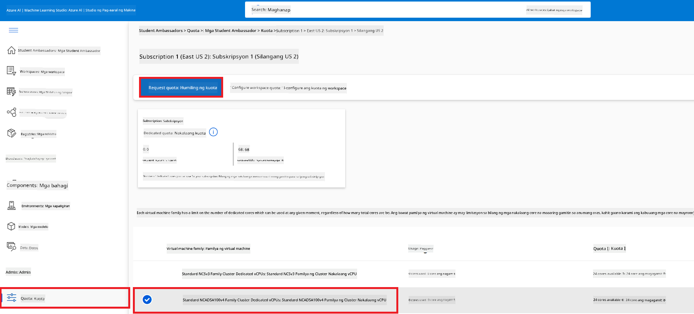

    - Sa loob ng Request quota page, ilagay ang **New cores limit** na nais mong gamitin. Halimbawa, 24.
    - Sa loob ng Request quota page, piliin ang **Submit** para humiling ng GPU quota.

> [!NOTE]
> Maaari mong piliin ang angkop na GPU o CPU para sa iyong pangangailangan sa pamamagitan ng pagtingin sa dokumentong [Sizes for Virtual Machines in Azure](https://learn.microsoft.com/azure/virtual-machines/sizes/overview?tabs=breakdownseries%2Cgeneralsizelist%2Ccomputesizelist%2Cmemorysizelist%2Cstoragesizelist%2Cgpusizelist%2Cfpgasizelist%2Chpcsizelist).

### Magdagdag ng role assignment

Para ma-fine-tune at ma-deploy ang iyong mga modelo, kailangan mo munang gumawa ng User Assigned Managed Identity (UAI) at bigyan ito ng angkop na mga permiso. Gagamitin ang UAI na ito para sa authentication sa panahon ng deployment.

#### Gumawa ng User Assigned Managed Identity (UAI)

1. I-type ang *managed identities* sa **search bar** sa itaas ng portal page at piliin ang **Managed Identities** mula sa mga lumabas na opsyon.

    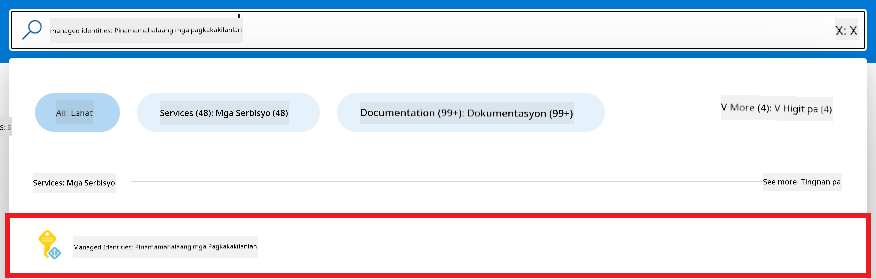

1. Piliin ang **+ Create**.

    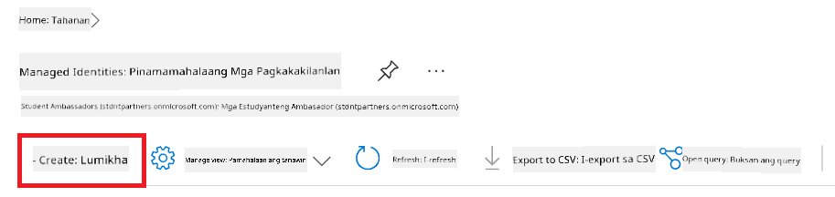

1. Gawin ang mga sumusunod:

    - Piliin ang iyong Azure **Subscription**.
    - Piliin ang **Resource group** na gagamitin (gumawa ng bago kung kinakailangan).
    - Piliin ang **Region** na nais mong gamitin.
    - Ilagay ang **Name**. Dapat ito ay natatanging pangalan.

1. Piliin ang **Review + create**.

1. Piliin ang **+ Create**.

#### Magdagdag ng Contributor role assignment sa Managed Identity

1. Pumunta sa Managed Identity resource na ginawa mo.

1. Piliin ang **Azure role assignments** mula sa kaliwang tab.

1. Piliin ang **+Add role assignment** mula sa navigation menu.

1. Sa loob ng Add role assignment page, gawin ang mga sumusunod:
    - Piliin ang **Scope** sa **Resource group**.
    - Piliin ang iyong Azure **Subscription**.
    - Piliin ang **Resource group** na gagamitin.
    - Piliin ang **Role** sa **Contributor**.

    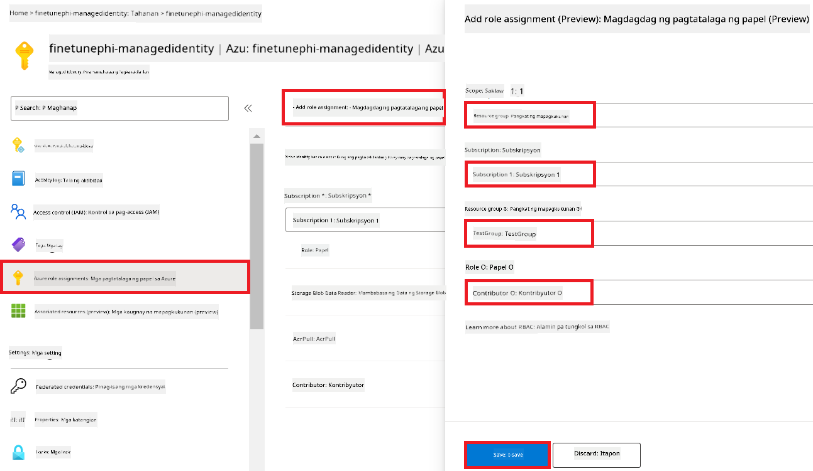

1. Piliin ang **Save**.

#### Magdagdag ng Storage Blob Data Reader role assignment sa Managed Identity

1. I-type ang *storage accounts* sa **search bar** sa itaas ng portal page at piliin ang **Storage accounts** mula sa mga lumabas na opsyon.

    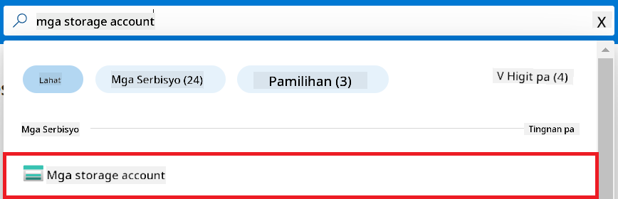

1. Piliin ang storage account na kaugnay ng Azure Machine Learning workspace na ginawa mo. Halimbawa, *finetunephistorage*.

1. Gawin ang mga sumusunod upang pumunta sa Add role assignment page:

    - Pumunta sa Azure Storage account na ginawa mo.
    - Piliin ang **Access Control (IAM)** mula sa kaliwang tab.
    - Piliin ang **+ Add** mula sa navigation menu.
    - Piliin ang **Add role assignment** mula sa navigation menu.

    

1. Sa loob ng Add role assignment page, gawin ang mga sumusunod:

    - Sa Role page, i-type ang *Storage Blob Data Reader* sa **search bar** at piliin ang **Storage Blob Data Reader** mula sa mga lumabas na opsyon.
    - Sa Role page, piliin ang **Next**.
    - Sa Members page, piliin ang **Assign access to** **Managed identity**.
    - Sa Members page, piliin ang **+ Select members**.
    - Sa Select managed identities page, piliin ang iyong Azure **Subscription**.
    - Sa Select managed identities page, piliin ang **Managed identity** sa **Manage Identity**.
    - Sa Select managed identities page, piliin ang Manage Identity na ginawa mo. Halimbawa, *finetunephi-managedidentity*.
    - Sa Select managed identities page, piliin ang **Select**.

    

1. Piliin ang **Review + assign**.

#### Magdagdag ng AcrPull role assignment sa Managed Identity

1. I-type ang *container registries* sa **search bar** sa itaas ng portal page at piliin ang **Container registries** mula sa mga lumabas na opsyon.

    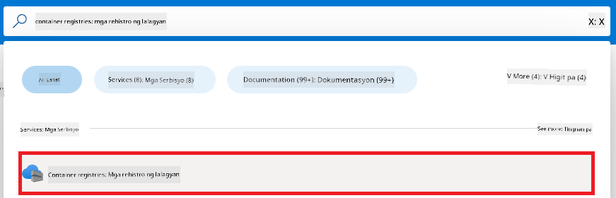

1. Piliin ang container registry na kaugnay ng Azure Machine Learning workspace. Halimbawa, *finetunephicontainerregistries*

1. Gawin ang mga sumusunod upang pumunta sa Add role assignment page:

    - Piliin ang **Access Control (IAM)** mula sa kaliwang tab.
    - Piliin ang **+ Add** mula sa navigation menu.
    - Piliin ang **Add role assignment** mula sa navigation menu.

1. Sa loob ng Add role assignment page, gawin ang mga sumusunod:

    - Sa Role page, i-type ang *AcrPull* sa **search bar** at piliin ang **AcrPull** mula sa mga lumabas na opsyon.
    - Sa Role page, piliin ang **Next**.
    - Sa Members page, piliin ang **Assign access to** **Managed identity**.
    - Sa Members page, piliin ang **+ Select members**.
    - Sa Select managed identities page, piliin ang iyong Azure **Subscription**.
    - Sa Select managed identities page, piliin ang **Managed identity** sa **Manage Identity**.
    - Sa Select managed identities page, piliin ang Manage Identity na ginawa mo. Halimbawa, *finetunephi-managedidentity*.
    - Sa Select managed identities page, piliin ang **Select**.
    - Piliin ang **Review + assign**.

### I-set up ang proyekto

Ngayon, gagawa ka ng folder na pagtatrabahuhan at magse-set up ng virtual environment para makabuo ng program na nakikipag-ugnayan sa mga user at gumagamit ng nakaimbak na chat history mula sa Azure Cosmos DB upang gabayan ang mga sagot nito.

#### Gumawa ng folder na pagtatrabahuhan

1. Buksan ang terminal window at i-type ang sumusunod na utos para gumawa ng folder na pinangalanang *finetune-phi* sa default na path.

    ```console
    mkdir finetune-phi
    ```

1. I-type ang sumusunod na utos sa terminal para pumunta sa *finetune-phi* folder na ginawa mo.

    ```console
    cd finetune-phi
    ```

#### Gumawa ng virtual environment

1. I-type ang sumusunod na utos sa terminal para gumawa ng virtual environment na pinangalanang *.venv*.

    ```console
    python -m venv .venv
    ```

1. I-type ang sumusunod na utos sa terminal para i-activate ang virtual environment.

    ```console
    .venv\Scripts\activate.bat
    ```
> [!NOTE]
>
> Kung nagtagumpay, makikita mo ang *(.venv)* bago ang command prompt.
#### I-install ang mga kinakailangang package

1. I-type ang mga sumusunod na utos sa loob ng iyong terminal upang i-install ang mga kinakailangang package.

    ```console
    pip install datasets==2.19.1
    pip install transformers==4.41.1
    pip install azure-ai-ml==1.16.0
    pip install torch==2.3.1
    pip install trl==0.9.4
    pip install promptflow==1.12.0
    ```

#### Gumawa ng mga file para sa proyekto

Sa pagsasanay na ito, gagawa ka ng mga mahahalagang file para sa ating proyekto. Kasama sa mga file na ito ang mga script para i-download ang dataset, i-setup ang Azure Machine Learning environment, i-fine-tune ang Phi-3 model, at i-deploy ang fine-tuned na modelo. Gagawa ka rin ng *conda.yml* file para i-setup ang fine-tuning environment.

Sa pagsasanay na ito, gagawin mo ang mga sumusunod:

- Gumawa ng *download_dataset.py* file para i-download ang dataset.
- Gumawa ng *setup_ml.py* file para i-setup ang Azure Machine Learning environment.
- Gumawa ng *fine_tune.py* file sa loob ng *finetuning_dir* folder para i-fine-tune ang Phi-3 model gamit ang dataset.
- Gumawa ng *conda.yml* file para i-setup ang fine-tuning environment.
- Gumawa ng *deploy_model.py* file para i-deploy ang fine-tuned na modelo.
- Gumawa ng *integrate_with_promptflow.py* file, para i-integrate ang fine-tuned na modelo at patakbuhin ito gamit ang Prompt flow.
- Gumawa ng flow.dag.yml file, para i-setup ang workflow structure para sa Prompt flow.
- Gumawa ng *config.py* file para ilagay ang impormasyon ng Azure.

> [!NOTE]
>
> Kumpletong istruktura ng folder:
>
> ```text
> └── YourUserName
> .    └── finetune-phi
> .        ├── finetuning_dir
> .        │      └── fine_tune.py
> .        ├── conda.yml
> .        ├── config.py
> .        ├── deploy_model.py
> .        ├── download_dataset.py
> .        ├── flow.dag.yml
> .        ├── integrate_with_promptflow.py
> .        └── setup_ml.py
> ```

1. Buksan ang **Visual Studio Code**.

1. Piliin ang **File** mula sa menu bar.

1. Piliin ang **Open Folder**.

1. Piliin ang *finetune-phi* folder na ginawa mo, na matatagpuan sa *C:\Users\yourUserName\finetune-phi*.

    

1. Sa kaliwang bahagi ng Visual Studio Code, i-right click at piliin ang **New File** para gumawa ng bagong file na pinangalanang *download_dataset.py*.

1. Sa kaliwang bahagi ng Visual Studio Code, i-right click at piliin ang **New File** para gumawa ng bagong file na pinangalanang *setup_ml.py*.

1. Sa kaliwang bahagi ng Visual Studio Code, i-right click at piliin ang **New File** para gumawa ng bagong file na pinangalanang *deploy_model.py*.

    

1. Sa kaliwang bahagi ng Visual Studio Code, i-right click at piliin ang **New Folder** para gumawa ng bagong folder na pinangalanang *finetuning_dir*.

1. Sa loob ng *finetuning_dir* folder, gumawa ng bagong file na pinangalanang *fine_tune.py*.

#### Gumawa at I-configure ang *conda.yml* file

1. Sa kaliwang bahagi ng Visual Studio Code, i-right click at piliin ang **New File** para gumawa ng bagong file na pinangalanang *conda.yml*.

1. Idagdag ang sumusunod na code sa *conda.yml* file para i-setup ang fine-tuning environment para sa Phi-3 model.

    ```yml
    name: phi-3-training-env
    channels:
      - defaults
      - conda-forge
    dependencies:
      - python=3.10
      - pip
      - numpy<2.0
      - pip:
          - torch==2.4.0
          - torchvision==0.19.0
          - trl==0.8.6
          - transformers==4.41
          - datasets==2.21.0
          - azureml-core==1.57.0
          - azure-storage-blob==12.19.0
          - azure-ai-ml==1.16
          - azure-identity==1.17.1
          - accelerate==0.33.0
          - mlflow==2.15.1
          - azureml-mlflow==1.57.0
    ```

#### Gumawa at I-configure ang *config.py* file

1. Sa kaliwang bahagi ng Visual Studio Code, i-right click at piliin ang **New File** para gumawa ng bagong file na pinangalanang *config.py*.

1. Idagdag ang sumusunod na code sa *config.py* file para ilagay ang iyong Azure na impormasyon.

    ```python
    # Azure settings
    AZURE_SUBSCRIPTION_ID = "your_subscription_id"
    AZURE_RESOURCE_GROUP_NAME = "your_resource_group_name" # "TestGroup"

    # Azure Machine Learning settings
    AZURE_ML_WORKSPACE_NAME = "your_workspace_name" # "finetunephi-workspace"

    # Azure Managed Identity settings
    AZURE_MANAGED_IDENTITY_CLIENT_ID = "your_azure_managed_identity_client_id"
    AZURE_MANAGED_IDENTITY_NAME = "your_azure_managed_identity_name" # "finetunephi-mangedidentity"
    AZURE_MANAGED_IDENTITY_RESOURCE_ID = f"/subscriptions/{AZURE_SUBSCRIPTION_ID}/resourceGroups/{AZURE_RESOURCE_GROUP_NAME}/providers/Microsoft.ManagedIdentity/userAssignedIdentities/{AZURE_MANAGED_IDENTITY_NAME}"

    # Dataset file paths
    TRAIN_DATA_PATH = "data/train_data.jsonl"
    TEST_DATA_PATH = "data/test_data.jsonl"

    # Fine-tuned model settings
    AZURE_MODEL_NAME = "your_fine_tuned_model_name" # "finetune-phi-model"
    AZURE_ENDPOINT_NAME = "your_fine_tuned_model_endpoint_name" # "finetune-phi-endpoint"
    AZURE_DEPLOYMENT_NAME = "your_fine_tuned_model_deployment_name" # "finetune-phi-deployment"

    AZURE_ML_API_KEY = "your_fine_tuned_model_api_key"
    AZURE_ML_ENDPOINT = "your_fine_tuned_model_endpoint_uri" # "https://{your-endpoint-name}.{your-region}.inference.ml.azure.com/score"
    ```

#### Magdagdag ng Azure environment variables

1. Gawin ang mga sumusunod para idagdag ang Azure Subscription ID:

    - I-type ang *subscriptions* sa **search bar** sa itaas ng portal page at piliin ang **Subscriptions** mula sa mga lumabas na opsyon.
    - Piliin ang Azure Subscription na kasalukuyan mong ginagamit.
    - Kopyahin at i-paste ang iyong Subscription ID sa *config.py* file.

    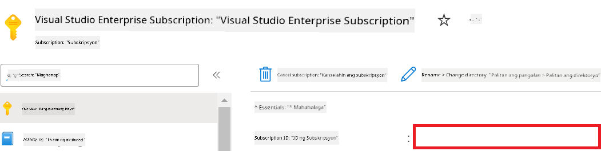

1. Gawin ang mga sumusunod para idagdag ang Azure Workspace Name:

    - Pumunta sa Azure Machine Learning resource na ginawa mo.
    - Kopyahin at i-paste ang iyong account name sa *config.py* file.

    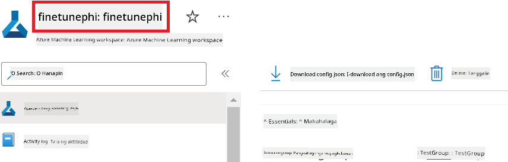

1. Gawin ang mga sumusunod para idagdag ang Azure Resource Group Name:

    - Pumunta sa Azure Machine Learning resource na ginawa mo.
    - Kopyahin at i-paste ang iyong Azure Resource Group Name sa *config.py* file.

    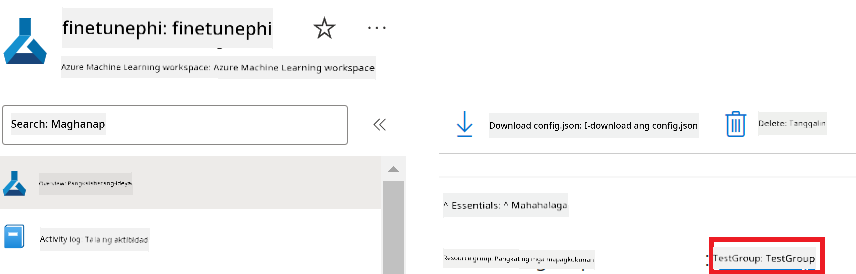

2. Gawin ang mga sumusunod para idagdag ang Azure Managed Identity name:

    - Pumunta sa Managed Identities resource na ginawa mo.
    - Kopyahin at i-paste ang iyong Azure Managed Identity name sa *config.py* file.

    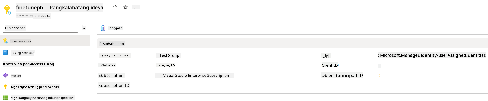

### Ihanda ang dataset para sa fine-tuning

Sa pagsasanay na ito, patatakbuhin mo ang *download_dataset.py* file para i-download ang *ULTRACHAT_200k* datasets sa iyong lokal na kapaligiran. Gagamitin mo ang mga dataset na ito para i-fine-tune ang Phi-3 model sa Azure Machine Learning.

#### I-download ang iyong dataset gamit ang *download_dataset.py*

1. Buksan ang *download_dataset.py* file sa Visual Studio Code.

1. Idagdag ang sumusunod na code sa loob ng *download_dataset.py*.

    ```python
    import json
    import os
    from datasets import load_dataset
    from config import (
        TRAIN_DATA_PATH,
        TEST_DATA_PATH)

    def load_and_split_dataset(dataset_name, config_name, split_ratio):
        """
        Load and split a dataset.
        """
        # Load the dataset with the specified name, configuration, and split ratio
        dataset = load_dataset(dataset_name, config_name, split=split_ratio)
        print(f"Original dataset size: {len(dataset)}")
        
        # Split the dataset into train and test sets (80% train, 20% test)
        split_dataset = dataset.train_test_split(test_size=0.2)
        print(f"Train dataset size: {len(split_dataset['train'])}")
        print(f"Test dataset size: {len(split_dataset['test'])}")
        
        return split_dataset

    def save_dataset_to_jsonl(dataset, filepath):
        """
        Save a dataset to a JSONL file.
        """
        # Create the directory if it does not exist
        os.makedirs(os.path.dirname(filepath), exist_ok=True)
        
        # Open the file in write mode
        with open(filepath, 'w', encoding='utf-8') as f:
            # Iterate over each record in the dataset
            for record in dataset:
                # Dump the record as a JSON object and write it to the file
                json.dump(record, f)
                # Write a newline character to separate records
                f.write('\n')
        
        print(f"Dataset saved to {filepath}")

    def main():
        """
        Main function to load, split, and save the dataset.
        """
        # Load and split the ULTRACHAT_200k dataset with a specific configuration and split ratio
        dataset = load_and_split_dataset("HuggingFaceH4/ultrachat_200k", 'default', 'train_sft[:1%]')
        
        # Extract the train and test datasets from the split
        train_dataset = dataset['train']
        test_dataset = dataset['test']

        # Save the train dataset to a JSONL file
        save_dataset_to_jsonl(train_dataset, TRAIN_DATA_PATH)
        
        # Save the test dataset to a separate JSONL file
        save_dataset_to_jsonl(test_dataset, TEST_DATA_PATH)

    if __name__ == "__main__":
        main()

    ```

> [!TIP]
>
> **Patnubay para sa fine-tuning gamit ang minimal na dataset gamit ang CPU**
>
> Kung nais mong gumamit ng CPU para sa fine-tuning, ang paraang ito ay mainam para sa mga may benefit subscriptions (tulad ng Visual Studio Enterprise Subscription) o para mabilisang subukan ang proseso ng fine-tuning at deployment.
>
> Palitan ang `dataset = load_and_split_dataset("HuggingFaceH4/ultrachat_200k", 'default', 'train_sft[:1%]')` ng `dataset = load_and_split_dataset("HuggingFaceH4/ultrachat_200k", 'default', 'train_sft[:10]')`
>

1. I-type ang sumusunod na utos sa iyong terminal para patakbuhin ang script at i-download ang dataset sa iyong lokal na kapaligiran.

    ```console
    python download_data.py
    ```

1. Siguraduhing na-save nang maayos ang mga dataset sa iyong lokal na *finetune-phi/data* directory.

> [!NOTE]
>
> **Laki ng dataset at oras ng fine-tuning**
>
> Sa E2E sample na ito, gagamit ka lamang ng 1% ng dataset (`train_sft[:1%]`). Malaki ang nababawas sa dami ng data, kaya mas mabilis ang pag-upload at fine-tuning. Maaari mong baguhin ang porsyento upang mahanap ang tamang balanse sa pagitan ng oras ng training at performance ng modelo. Ang paggamit ng mas maliit na bahagi ng dataset ay nagpapabilis sa fine-tuning, kaya mas madali itong pamahalaan para sa isang E2E sample.

## Scenario 2: I-fine-tune ang Phi-3 model at I-deploy sa Azure Machine Learning Studio

### I-setup ang Azure CLI

Kailangan mong i-setup ang Azure CLI para ma-authenticate ang iyong environment. Pinapayagan ng Azure CLI na pamahalaan mo ang Azure resources direkta mula sa command line at nagbibigay ito ng mga kredensyal na kailangan ng Azure Machine Learning para ma-access ang mga resources na ito. Para makapagsimula, i-install ang [Azure CLI](https://learn.microsoft.com/cli/azure/install-azure-cli)

1. Buksan ang terminal window at i-type ang sumusunod na utos para mag-login sa iyong Azure account.

    ```console
    az login
    ```

1. Piliin ang iyong Azure account na gagamitin.

1. Piliin ang iyong Azure subscription na gagamitin.

    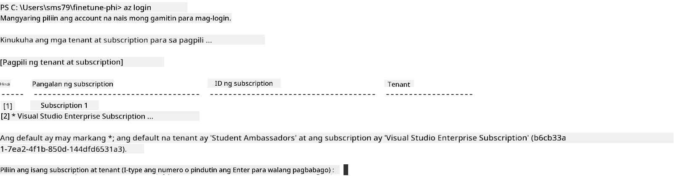

> [!TIP]
>
> Kung nahihirapan kang mag-sign in sa Azure, subukan ang paggamit ng device code. Buksan ang terminal window at i-type ang sumusunod na utos para mag-sign in sa iyong Azure account:
>
> ```console
> az login --use-device-code
> ```
>

### I-fine-tune ang Phi-3 model

Sa pagsasanay na ito, i-fine-tune mo ang Phi-3 model gamit ang ibinigay na dataset. Una, ide-define mo ang proseso ng fine-tuning sa *fine_tune.py* file. Pagkatapos, i-configure mo ang Azure Machine Learning environment at sisimulan ang fine-tuning sa pamamagitan ng pagpapatakbo ng *setup_ml.py* file. Tinitiyak ng script na ito na ang fine-tuning ay magaganap sa loob ng Azure Machine Learning environment.

Sa pagpapatakbo ng *setup_ml.py*, mapapatakbo mo ang fine-tuning process sa Azure Machine Learning environment.

#### Idagdag ang code sa *fine_tune.py* file

1. Pumunta sa *finetuning_dir* folder at buksan ang *fine_tune.py* file sa Visual Studio Code.

1. Idagdag ang sumusunod na code sa *fine_tune.py*.

    ```python
    import argparse
    import sys
    import logging
    import os
    from datasets import load_dataset
    import torch
    import mlflow
    from transformers import AutoModelForCausalLM, AutoTokenizer, TrainingArguments
    from trl import SFTTrainer

    # To avoid the INVALID_PARAMETER_VALUE error in MLflow, disable MLflow integration
    os.environ["DISABLE_MLFLOW_INTEGRATION"] = "True"

    # Logging setup
    logging.basicConfig(
        format="%(asctime)s - %(levelname)s - %(name)s - %(message)s",
        datefmt="%Y-%m-%d %H:%M:%S",
        handlers=[logging.StreamHandler(sys.stdout)],
        level=logging.WARNING
    )
    logger = logging.getLogger(__name__)

    def initialize_model_and_tokenizer(model_name, model_kwargs):
        """
        Initialize the model and tokenizer with the given pretrained model name and arguments.
        """
        model = AutoModelForCausalLM.from_pretrained(model_name, **model_kwargs)
        tokenizer = AutoTokenizer.from_pretrained(model_name)
        tokenizer.model_max_length = 2048
        tokenizer.pad_token = tokenizer.unk_token
        tokenizer.pad_token_id = tokenizer.convert_tokens_to_ids(tokenizer.pad_token)
        tokenizer.padding_side = 'right'
        return model, tokenizer

    def apply_chat_template(example, tokenizer):
        """
        Apply a chat template to tokenize messages in the example.
        """
        messages = example["messages"]
        if messages[0]["role"] != "system":
            messages.insert(0, {"role": "system", "content": ""})
        example["text"] = tokenizer.apply_chat_template(
            messages, tokenize=False, add_generation_prompt=False
        )
        return example

    def load_and_preprocess_data(train_filepath, test_filepath, tokenizer):
        """
        Load and preprocess the dataset.
        """
        train_dataset = load_dataset('json', data_files=train_filepath, split='train')
        test_dataset = load_dataset('json', data_files=test_filepath, split='train')
        column_names = list(train_dataset.features)

        train_dataset = train_dataset.map(
            apply_chat_template,
            fn_kwargs={"tokenizer": tokenizer},
            num_proc=10,
            remove_columns=column_names,
            desc="Applying chat template to train dataset",
        )

        test_dataset = test_dataset.map(
            apply_chat_template,
            fn_kwargs={"tokenizer": tokenizer},
            num_proc=10,
            remove_columns=column_names,
            desc="Applying chat template to test dataset",
        )

        return train_dataset, test_dataset

    def train_and_evaluate_model(train_dataset, test_dataset, model, tokenizer, output_dir):
        """
        Train and evaluate the model.
        """
        training_args = TrainingArguments(
            bf16=True,
            do_eval=True,
            output_dir=output_dir,
            eval_strategy="epoch",
            learning_rate=5.0e-06,
            logging_steps=20,
            lr_scheduler_type="cosine",
            num_train_epochs=3,
            overwrite_output_dir=True,
            per_device_eval_batch_size=4,
            per_device_train_batch_size=4,
            remove_unused_columns=True,
            save_steps=500,
            seed=0,
            gradient_checkpointing=True,
            gradient_accumulation_steps=1,
            warmup_ratio=0.2,
        )

        trainer = SFTTrainer(
            model=model,
            args=training_args,
            train_dataset=train_dataset,
            eval_dataset=test_dataset,
            max_seq_length=2048,
            dataset_text_field="text",
            tokenizer=tokenizer,
            packing=True
        )

        train_result = trainer.train()
        trainer.log_metrics("train", train_result.metrics)

        mlflow.transformers.log_model(
            transformers_model={"model": trainer.model, "tokenizer": tokenizer},
            artifact_path=output_dir,
        )

        tokenizer.padding_side = 'left'
        eval_metrics = trainer.evaluate()
        eval_metrics["eval_samples"] = len(test_dataset)
        trainer.log_metrics("eval", eval_metrics)

    def main(train_file, eval_file, model_output_dir):
        """
        Main function to fine-tune the model.
        """
        model_kwargs = {
            "use_cache": False,
            "trust_remote_code": True,
            "torch_dtype": torch.bfloat16,
            "device_map": None,
            "attn_implementation": "eager"
        }

        # pretrained_model_name = "microsoft/Phi-3-mini-4k-instruct"
        pretrained_model_name = "microsoft/Phi-3.5-mini-instruct"

        with mlflow.start_run():
            model, tokenizer = initialize_model_and_tokenizer(pretrained_model_name, model_kwargs)
            train_dataset, test_dataset = load_and_preprocess_data(train_file, eval_file, tokenizer)
            train_and_evaluate_model(train_dataset, test_dataset, model, tokenizer, model_output_dir)

    if __name__ == "__main__":
        parser = argparse.ArgumentParser()
        parser.add_argument("--train-file", type=str, required=True, help="Path to the training data")
        parser.add_argument("--eval-file", type=str, required=True, help="Path to the evaluation data")
        parser.add_argument("--model_output_dir", type=str, required=True, help="Directory to save the fine-tuned model")
        args = parser.parse_args()
        main(args.train_file, args.eval_file, args.model_output_dir)

    ```

1. I-save at isara ang *fine_tune.py* file.

> [!TIP]
> **Pwede mong i-fine-tune ang Phi-3.5 model**
>
> Sa *fine_tune.py* file, maaari mong palitan ang `pretrained_model_name` mula sa `"microsoft/Phi-3-mini-4k-instruct"` papunta sa kahit anong model na gusto mong i-fine-tune. Halimbawa, kung papalitan mo ito ng `"microsoft/Phi-3.5-mini-instruct"`, gagamitin mo ang Phi-3.5-mini-instruct model para sa fine-tuning. Para hanapin at gamitin ang modelong gusto mo, bisitahin ang [Hugging Face](https://huggingface.co/), hanapin ang modelong interesado ka, at kopyahin ang pangalan nito papunta sa `pretrained_model_name` field sa iyong script.
>
> :::image type="content" source="../../imgs/03/FineTuning-PromptFlow/finetunephi3.5.png" alt-text="Fine tune Phi-3.5.":::
>

#### Idagdag ang code sa *setup_ml.py* file

1. Buksan ang *setup_ml.py* file sa Visual Studio Code.

1. Idagdag ang sumusunod na code sa *setup_ml.py*.

    ```python
    import logging
    from azure.ai.ml import MLClient, command, Input
    from azure.ai.ml.entities import Environment, AmlCompute
    from azure.identity import AzureCliCredential
    from config import (
        AZURE_SUBSCRIPTION_ID,
        AZURE_RESOURCE_GROUP_NAME,
        AZURE_ML_WORKSPACE_NAME,
        TRAIN_DATA_PATH,
        TEST_DATA_PATH
    )

    # Constants

    # Uncomment the following lines to use a CPU instance for training
    # COMPUTE_INSTANCE_TYPE = "Standard_E16s_v3" # cpu
    # COMPUTE_NAME = "cpu-e16s-v3"
    # DOCKER_IMAGE_NAME = "mcr.microsoft.com/azureml/openmpi4.1.0-ubuntu20.04:latest"

    # Uncomment the following lines to use a GPU instance for training
    COMPUTE_INSTANCE_TYPE = "Standard_NC24ads_A100_v4"
    COMPUTE_NAME = "gpu-nc24s-a100-v4"
    DOCKER_IMAGE_NAME = "mcr.microsoft.com/azureml/curated/acft-hf-nlp-gpu:59"

    CONDA_FILE = "conda.yml"
    LOCATION = "eastus2" # Replace with the location of your compute cluster
    FINETUNING_DIR = "./finetuning_dir" # Path to the fine-tuning script
    TRAINING_ENV_NAME = "phi-3-training-environment" # Name of the training environment
    MODEL_OUTPUT_DIR = "./model_output" # Path to the model output directory in azure ml

    # Logging setup to track the process
    logger = logging.getLogger(__name__)
    logging.basicConfig(
        format="%(asctime)s - %(levelname)s - %(name)s - %(message)s",
        datefmt="%Y-%m-%d %H:%M:%S",
        level=logging.WARNING
    )

    def get_ml_client():
        """
        Initialize the ML Client using Azure CLI credentials.
        """
        credential = AzureCliCredential()
        return MLClient(credential, AZURE_SUBSCRIPTION_ID, AZURE_RESOURCE_GROUP_NAME, AZURE_ML_WORKSPACE_NAME)

    def create_or_get_environment(ml_client):
        """
        Create or update the training environment in Azure ML.
        """
        env = Environment(
            image=DOCKER_IMAGE_NAME,  # Docker image for the environment
            conda_file=CONDA_FILE,  # Conda environment file
            name=TRAINING_ENV_NAME,  # Name of the environment
        )
        return ml_client.environments.create_or_update(env)

    def create_or_get_compute_cluster(ml_client, compute_name, COMPUTE_INSTANCE_TYPE, location):
        """
        Create or update the compute cluster in Azure ML.
        """
        try:
            compute_cluster = ml_client.compute.get(compute_name)
            logger.info(f"Compute cluster '{compute_name}' already exists. Reusing it for the current run.")
        except Exception:
            logger.info(f"Compute cluster '{compute_name}' does not exist. Creating a new one with size {COMPUTE_INSTANCE_TYPE}.")
            compute_cluster = AmlCompute(
                name=compute_name,
                size=COMPUTE_INSTANCE_TYPE,
                location=location,
                tier="Dedicated",  # Tier of the compute cluster
                min_instances=0,  # Minimum number of instances
                max_instances=1  # Maximum number of instances
            )
            ml_client.compute.begin_create_or_update(compute_cluster).wait()  # Wait for the cluster to be created
        return compute_cluster

    def create_fine_tuning_job(env, compute_name):
        """
        Set up the fine-tuning job in Azure ML.
        """
        return command(
            code=FINETUNING_DIR,  # Path to fine_tune.py
            command=(
                "python fine_tune.py "
                "--train-file ${{inputs.train_file}} "
                "--eval-file ${{inputs.eval_file}} "
                "--model_output_dir ${{inputs.model_output}}"
            ),
            environment=env,  # Training environment
            compute=compute_name,  # Compute cluster to use
            inputs={
                "train_file": Input(type="uri_file", path=TRAIN_DATA_PATH),  # Path to the training data file
                "eval_file": Input(type="uri_file", path=TEST_DATA_PATH),  # Path to the evaluation data file
                "model_output": MODEL_OUTPUT_DIR
            }
        )

    def main():
        """
        Main function to set up and run the fine-tuning job in Azure ML.
        """
        # Initialize ML Client
        ml_client = get_ml_client()

        # Create Environment
        env = create_or_get_environment(ml_client)
        
        # Create or get existing compute cluster
        create_or_get_compute_cluster(ml_client, COMPUTE_NAME, COMPUTE_INSTANCE_TYPE, LOCATION)

        # Create and Submit Fine-Tuning Job
        job = create_fine_tuning_job(env, COMPUTE_NAME)
        returned_job = ml_client.jobs.create_or_update(job)  # Submit the job
        ml_client.jobs.stream(returned_job.name)  # Stream the job logs
        
        # Capture the job name
        job_name = returned_job.name
        print(f"Job name: {job_name}")

    if __name__ == "__main__":
        main()

    ```

1. Palitan ang `COMPUTE_INSTANCE_TYPE`, `COMPUTE_NAME`, at `LOCATION` ng iyong mga detalye.

    ```python
   # Uncomment the following lines to use a GPU instance for training
    COMPUTE_INSTANCE_TYPE = "Standard_NC24ads_A100_v4"
    COMPUTE_NAME = "gpu-nc24s-a100-v4"
    ...
    LOCATION = "eastus2" # Replace with the location of your compute cluster
    ```

> [!TIP]
>
> **Patnubay para sa fine-tuning gamit ang minimal na dataset gamit ang CPU**
>
> Kung nais mong gumamit ng CPU para sa fine-tuning, ang paraang ito ay mainam para sa mga may benefit subscriptions (tulad ng Visual Studio Enterprise Subscription) o para mabilisang subukan ang proseso ng fine-tuning at deployment.
>
> 1. Buksan ang *setup_ml* file.
> 1. Palitan ang `COMPUTE_INSTANCE_TYPE`, `COMPUTE_NAME`, at `DOCKER_IMAGE_NAME` ng mga sumusunod. Kung wala kang access sa *Standard_E16s_v3*, maaari kang gumamit ng katumbas na CPU instance o humiling ng bagong quota.
> 1. Palitan ang `LOCATION` ng iyong mga detalye.
>
>    ```python
>    # Uncomment the following lines to use a CPU instance for training
>    COMPUTE_INSTANCE_TYPE = "Standard_E16s_v3" # cpu
>    COMPUTE_NAME = "cpu-e16s-v3"
>    DOCKER_IMAGE_NAME = "mcr.microsoft.com/azureml/openmpi4.1.0-ubuntu20.04:latest"
>    LOCATION = "eastus2" # Replace with the location of your compute cluster
>    ```
>

1. I-type ang sumusunod na utos para patakbuhin ang *setup_ml.py* script at simulan ang fine-tuning process sa Azure Machine Learning.

    ```python
    python setup_ml.py
    ```

1. Sa pagsasanay na ito, matagumpay mong na-fine-tune ang Phi-3 model gamit ang Azure Machine Learning. Sa pagpapatakbo ng *setup_ml.py* script, na-setup mo ang Azure Machine Learning environment at sinimulan ang fine-tuning process na dinefine sa *fine_tune.py* file. Tandaan na ang fine-tuning process ay maaaring tumagal ng ilang oras. Pagkatapos patakbuhin ang `python setup_ml.py` na utos, kailangan mong maghintay hanggang matapos ang proseso. Maaari mong subaybayan ang status ng fine-tuning job sa pamamagitan ng pagsunod sa link na ibinigay sa terminal papunta sa Azure Machine Learning portal.

    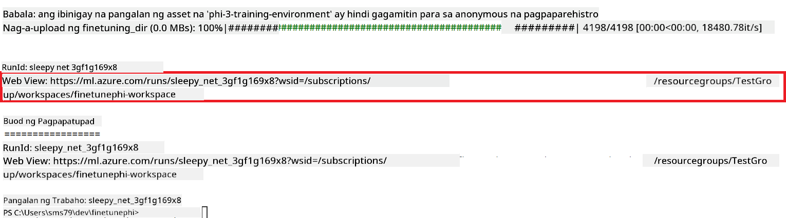

### I-deploy ang fine-tuned na modelo

Para i-integrate ang fine-tuned na Phi-3 model sa Prompt Flow, kailangan mong i-deploy ang modelo upang maging accessible ito para sa real-time inference. Kasama sa prosesong ito ang pagrerehistro ng modelo, paggawa ng online endpoint, at pag-deploy ng modelo.

#### I-set ang pangalan ng modelo, endpoint, at deployment para sa deployment

1. Buksan ang *config.py* file.

1. Palitan ang `AZURE_MODEL_NAME = "your_fine_tuned_model_name"` ng nais mong pangalan para sa iyong modelo.

1. Palitan ang `AZURE_ENDPOINT_NAME = "your_fine_tuned_model_endpoint_name"` ng nais mong pangalan para sa iyong endpoint.

1. Palitan ang `AZURE_DEPLOYMENT_NAME = "your_fine_tuned_model_deployment_name"` ng nais mong pangalan para sa iyong deployment.

#### Idagdag ang code sa *deploy_model.py* file

Ang pagpapatakbo ng *deploy_model.py* file ay awtomatikong gagawin ang buong proseso ng deployment. Ire-register nito ang modelo, gagawa ng endpoint, at isasagawa ang deployment base sa mga setting na nakasaad sa *config.py* file, kabilang ang pangalan ng modelo, endpoint, at deployment.

1. Buksan ang *deploy_model.py* file sa Visual Studio Code.

1. Idagdag ang sumusunod na code sa *deploy_model.py*.

    ```python
    import logging
    from azure.identity import AzureCliCredential
    from azure.ai.ml import MLClient
    from azure.ai.ml.entities import Model, ProbeSettings, ManagedOnlineEndpoint, ManagedOnlineDeployment, IdentityConfiguration, ManagedIdentityConfiguration, OnlineRequestSettings
    from azure.ai.ml.constants import AssetTypes

    # Configuration imports
    from config import (
        AZURE_SUBSCRIPTION_ID,
        AZURE_RESOURCE_GROUP_NAME,
        AZURE_ML_WORKSPACE_NAME,
        AZURE_MANAGED_IDENTITY_RESOURCE_ID,
        AZURE_MANAGED_IDENTITY_CLIENT_ID,
        AZURE_MODEL_NAME,
        AZURE_ENDPOINT_NAME,
        AZURE_DEPLOYMENT_NAME
    )

    # Constants
    JOB_NAME = "your-job-name"
    COMPUTE_INSTANCE_TYPE = "Standard_E4s_v3"

    deployment_env_vars = {
        "SUBSCRIPTION_ID": AZURE_SUBSCRIPTION_ID,
        "RESOURCE_GROUP_NAME": AZURE_RESOURCE_GROUP_NAME,
        "UAI_CLIENT_ID": AZURE_MANAGED_IDENTITY_CLIENT_ID,
    }

    # Logging setup
    logging.basicConfig(
        format="%(asctime)s - %(levelname)s - %(name)s - %(message)s",
        datefmt="%Y-%m-%d %H:%M:%S",
        level=logging.DEBUG
    )
    logger = logging.getLogger(__name__)

    def get_ml_client():
        """Initialize and return the ML Client."""
        credential = AzureCliCredential()
        return MLClient(credential, AZURE_SUBSCRIPTION_ID, AZURE_RESOURCE_GROUP_NAME, AZURE_ML_WORKSPACE_NAME)

    def register_model(ml_client, model_name, job_name):
        """Register a new model."""
        model_path = f"azureml://jobs/{job_name}/outputs/artifacts/paths/model_output"
        logger.info(f"Registering model {model_name} from job {job_name} at path {model_path}.")
        run_model = Model(
            path=model_path,
            name=model_name,
            description="Model created from run.",
            type=AssetTypes.MLFLOW_MODEL,
        )
        model = ml_client.models.create_or_update(run_model)
        logger.info(f"Registered model ID: {model.id}")
        return model

    def delete_existing_endpoint(ml_client, endpoint_name):
        """Delete existing endpoint if it exists."""
        try:
            endpoint_result = ml_client.online_endpoints.get(name=endpoint_name)
            logger.info(f"Deleting existing endpoint {endpoint_name}.")
            ml_client.online_endpoints.begin_delete(name=endpoint_name).result()
            logger.info(f"Deleted existing endpoint {endpoint_name}.")
        except Exception as e:
            logger.info(f"No existing endpoint {endpoint_name} found to delete: {e}")

    def create_or_update_endpoint(ml_client, endpoint_name, description=""):
        """Create or update an endpoint."""
        delete_existing_endpoint(ml_client, endpoint_name)
        logger.info(f"Creating new endpoint {endpoint_name}.")
        endpoint = ManagedOnlineEndpoint(
            name=endpoint_name,
            description=description,
            identity=IdentityConfiguration(
                type="user_assigned",
                user_assigned_identities=[ManagedIdentityConfiguration(resource_id=AZURE_MANAGED_IDENTITY_RESOURCE_ID)]
            )
        )
        endpoint_result = ml_client.online_endpoints.begin_create_or_update(endpoint).result()
        logger.info(f"Created new endpoint {endpoint_name}.")
        return endpoint_result

    def create_or_update_deployment(ml_client, endpoint_name, deployment_name, model):
        """Create or update a deployment."""

        logger.info(f"Creating deployment {deployment_name} for endpoint {endpoint_name}.")
        deployment = ManagedOnlineDeployment(
            name=deployment_name,
            endpoint_name=endpoint_name,
            model=model.id,
            instance_type=COMPUTE_INSTANCE_TYPE,
            instance_count=1,
            environment_variables=deployment_env_vars,
            request_settings=OnlineRequestSettings(
                max_concurrent_requests_per_instance=3,
                request_timeout_ms=180000,
                max_queue_wait_ms=120000
            ),
            liveness_probe=ProbeSettings(
                failure_threshold=30,
                success_threshold=1,
                period=100,
                initial_delay=500,
            ),
            readiness_probe=ProbeSettings(
                failure_threshold=30,
                success_threshold=1,
                period=100,
                initial_delay=500,
            ),
        )
        deployment_result = ml_client.online_deployments.begin_create_or_update(deployment).result()
        logger.info(f"Created deployment {deployment.name} for endpoint {endpoint_name}.")
        return deployment_result

    def set_traffic_to_deployment(ml_client, endpoint_name, deployment_name):
        """Set traffic to the specified deployment."""
        try:
            # Fetch the current endpoint details
            endpoint = ml_client.online_endpoints.get(name=endpoint_name)
            
            # Log the current traffic allocation for debugging
            logger.info(f"Current traffic allocation: {endpoint.traffic}")
            
            # Set the traffic allocation for the deployment
            endpoint.traffic = {deployment_name: 100}
            
            # Update the endpoint with the new traffic allocation
            endpoint_poller = ml_client.online_endpoints.begin_create_or_update(endpoint)
            updated_endpoint = endpoint_poller.result()
            
            # Log the updated traffic allocation for debugging
            logger.info(f"Updated traffic allocation: {updated_endpoint.traffic}")
            logger.info(f"Set traffic to deployment {deployment_name} at endpoint {endpoint_name}.")
            return updated_endpoint
        except Exception as e:
            # Log any errors that occur during the process
            logger.error(f"Failed to set traffic to deployment: {e}")
            raise


    def main():
        ml_client = get_ml_client()

        registered_model = register_model(ml_client, AZURE_MODEL_NAME, JOB_NAME)
        logger.info(f"Registered model ID: {registered_model.id}")

        endpoint = create_or_update_endpoint(ml_client, AZURE_ENDPOINT_NAME, "Endpoint for finetuned Phi-3 model")
        logger.info(f"Endpoint {AZURE_ENDPOINT_NAME} is ready.")

        try:
            deployment = create_or_update_deployment(ml_client, AZURE_ENDPOINT_NAME, AZURE_DEPLOYMENT_NAME, registered_model)
            logger.info(f"Deployment {AZURE_DEPLOYMENT_NAME} is created for endpoint {AZURE_ENDPOINT_NAME}.")

            set_traffic_to_deployment(ml_client, AZURE_ENDPOINT_NAME, AZURE_DEPLOYMENT_NAME)
            logger.info(f"Traffic is set to deployment {AZURE_DEPLOYMENT_NAME} at endpoint {AZURE_ENDPOINT_NAME}.")
        except Exception as e:
            logger.error(f"Failed to create or update deployment: {e}")

    if __name__ == "__main__":
        main()

    ```

1. Gawin ang mga sumusunod para makuha ang `JOB_NAME`:

    - Pumunta sa Azure Machine Learning resource na ginawa mo.
    - Piliin ang **Studio web URL** para buksan ang Azure Machine Learning workspace.
    - Piliin ang **Jobs** mula sa kaliwang tab.
    - Piliin ang experiment para sa fine-tuning. Halimbawa, *finetunephi*.
    - Piliin ang job na ginawa mo.
- Kopyahin at i-paste ang pangalan ng iyong trabaho sa `JOB_NAME = "your-job-name"` sa *deploy_model.py* na file.

1. Palitan ang `COMPUTE_INSTANCE_TYPE` ng iyong mga partikular na detalye.

1. I-type ang sumusunod na utos upang patakbuhin ang *deploy_model.py* na script at simulan ang proseso ng deployment sa Azure Machine Learning.

    ```python
    python deploy_model.py
    ```


> [!WARNING]
> Upang maiwasan ang karagdagang singil sa iyong account, siguraduhing tanggalin ang nilikhang endpoint sa Azure Machine Learning workspace.
>

#### Suriin ang status ng deployment sa Azure Machine Learning Workspace

1. Bisitahin ang [Azure ML Studio](https://ml.azure.com/home?wt.mc_id=studentamb_279723).

1. Pumunta sa Azure Machine Learning workspace na iyong nilikha.

1. Piliin ang **Studio web URL** upang buksan ang Azure Machine Learning workspace.

1. Piliin ang **Endpoints** mula sa kaliwang tab.

    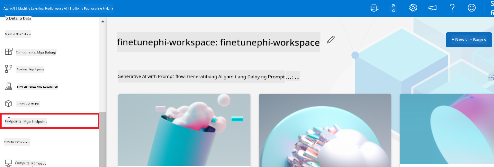

2. Piliin ang endpoint na iyong nilikha.

    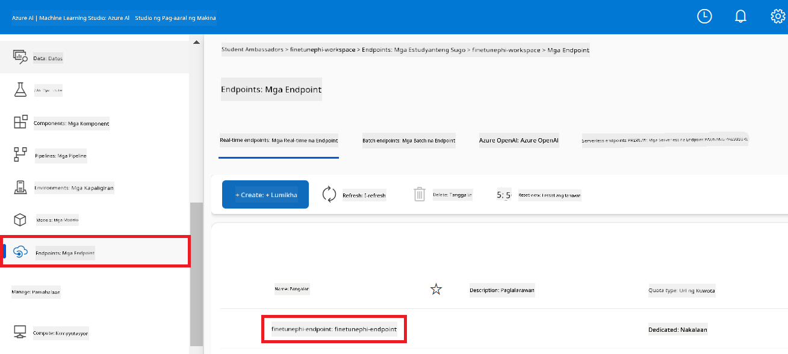

3. Sa pahinang ito, maaari mong pamahalaan ang mga endpoint na nilikha habang isinasagawa ang deployment.

## Scenario 3: Pagsamahin sa Prompt flow at Makipag-chat gamit ang iyong custom na modelo

### Pagsamahin ang custom na Phi-3 model sa Prompt flow

Matapos matagumpay na ma-deploy ang iyong fine-tuned na modelo, maaari mo na itong isama sa Prompt flow upang magamit ang iyong modelo sa mga real-time na aplikasyon, na nagbibigay-daan sa iba't ibang interactive na gawain gamit ang iyong custom na Phi-3 model.

#### Itakda ang api key at endpoint uri ng fine-tuned na Phi-3 model

1. Pumunta sa Azure Machine Learning workspace na iyong nilikha.
1. Piliin ang **Endpoints** mula sa kaliwang tab.
1. Piliin ang endpoint na iyong nilikha.
1. Piliin ang **Consume** mula sa navigation menu.
1. Kopyahin at i-paste ang iyong **REST endpoint** sa *config.py* na file, palitan ang `AZURE_ML_ENDPOINT = "your_fine_tuned_model_endpoint_uri"` ng iyong **REST endpoint**.
1. Kopyahin at i-paste ang iyong **Primary key** sa *config.py* na file, palitan ang `AZURE_ML_API_KEY = "your_fine_tuned_model_api_key"` ng iyong **Primary key**.

    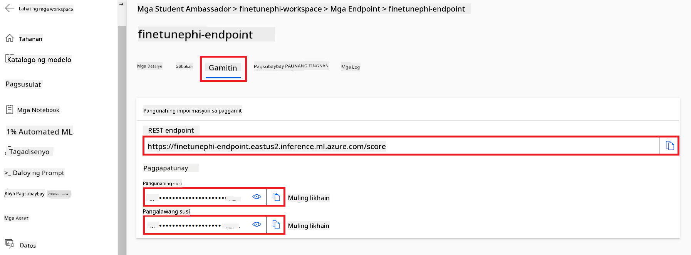

#### Magdagdag ng code sa *flow.dag.yml* na file

1. Buksan ang *flow.dag.yml* na file sa Visual Studio Code.

1. Idagdag ang sumusunod na code sa *flow.dag.yml*.

    ```yml
    inputs:
      input_data:
        type: string
        default: "Who founded Microsoft?"

    outputs:
      answer:
        type: string
        reference: ${integrate_with_promptflow.output}

    nodes:
    - name: integrate_with_promptflow
      type: python
      source:
        type: code
        path: integrate_with_promptflow.py
      inputs:
        input_data: ${inputs.input_data}
    ```

#### Magdagdag ng code sa *integrate_with_promptflow.py* na file

1. Buksan ang *integrate_with_promptflow.py* na file sa Visual Studio Code.

1. Idagdag ang sumusunod na code sa *integrate_with_promptflow.py*.

    ```python
    import logging
    import requests
    from promptflow.core import tool
    import asyncio
    import platform
    from config import (
        AZURE_ML_ENDPOINT,
        AZURE_ML_API_KEY
    )

    # Logging setup
    logging.basicConfig(
        format="%(asctime)s - %(levelname)s - %(name)s - %(message)s",
        datefmt="%Y-%m-%d %H:%M:%S",
        level=logging.DEBUG
    )
    logger = logging.getLogger(__name__)

    def query_azml_endpoint(input_data: list, endpoint_url: str, api_key: str) -> str:
        """
        Send a request to the Azure ML endpoint with the given input data.
        """
        headers = {
            "Content-Type": "application/json",
            "Authorization": f"Bearer {api_key}"
        }
        data = {
            "input_data": [input_data],
            "params": {
                "temperature": 0.7,
                "max_new_tokens": 128,
                "do_sample": True,
                "return_full_text": True
            }
        }
        try:
            response = requests.post(endpoint_url, json=data, headers=headers)
            response.raise_for_status()
            result = response.json()[0]
            logger.info("Successfully received response from Azure ML Endpoint.")
            return result
        except requests.exceptions.RequestException as e:
            logger.error(f"Error querying Azure ML Endpoint: {e}")
            raise

    def setup_asyncio_policy():
        """
        Setup asyncio event loop policy for Windows.
        """
        if platform.system() == 'Windows':
            asyncio.set_event_loop_policy(asyncio.WindowsSelectorEventLoopPolicy())
            logger.info("Set Windows asyncio event loop policy.")

    @tool
    def my_python_tool(input_data: str) -> str:
        """
        Tool function to process input data and query the Azure ML endpoint.
        """
        setup_asyncio_policy()
        return query_azml_endpoint(input_data, AZURE_ML_ENDPOINT, AZURE_ML_API_KEY)

    ```

### Makipag-chat gamit ang iyong custom na modelo

1. I-type ang sumusunod na utos upang patakbuhin ang *deploy_model.py* na script at simulan ang proseso ng deployment sa Azure Machine Learning.

    ```python
    pf flow serve --source ./ --port 8080 --host localhost
    ```

1. Narito ang isang halimbawa ng mga resulta: Maaari ka nang makipag-chat gamit ang iyong custom na Phi-3 model. Inirerekomenda na magtanong batay sa datos na ginamit para sa fine-tuning.

    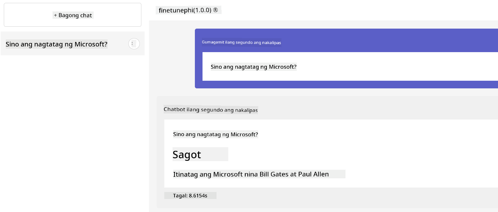

**Paalala**:  
Ang dokumentong ito ay isinalin gamit ang AI translation service na [Co-op Translator](https://github.com/Azure/co-op-translator). Bagamat nagsusumikap kami para sa katumpakan, pakatandaan na ang mga awtomatikong pagsasalin ay maaaring maglaman ng mga pagkakamali o di-tumpak na impormasyon. Ang orihinal na dokumento sa orihinal nitong wika ang dapat ituring na pangunahing sanggunian. Para sa mahahalagang impormasyon, inirerekomenda ang propesyonal na pagsasalin ng tao. Hindi kami mananagot sa anumang hindi pagkakaunawaan o maling interpretasyon na maaaring magmula sa paggamit ng pagsasaling ito.