<!--
CO_OP_TRANSLATOR_METADATA:
{
  "original_hash": "0df910a227098303cc392b6ad204c271",
  "translation_date": "2026-01-06T04:57:35+00:00",
  "source_file": "md/02.Application/01.TextAndChat/Phi3/E2E_Phi-3-FineTuning_PromptFlow_Integration_AIFoundry.md",
  "language_code": "tl"
}
-->
# Fine-tune at Isama ang custom na mga Phi-3 model gamit ang Prompt flow sa Azure AI Foundry

Ang end-to-end (E2E) na halimbawa na ito ay batay sa gabay na "[Fine-Tune and Integrate Custom Phi-3 Models with Prompt Flow in Azure AI Foundry](https://techcommunity.microsoft.com/t5/educator-developer-blog/fine-tune-and-integrate-custom-phi-3-models-with-prompt-flow-in/ba-p/4191726?WT.mc_id=aiml-137032-kinfeylo)" mula sa Microsoft Tech Community. Ipinakikilala nito ang mga proseso ng fine-tuning, pag-deploy, at pag-integrate ng mga custom na Phi-3 model gamit ang Prompt flow sa Azure AI Foundry. 
Hindi tulad ng E2E sample, "[Fine-Tune and Integrate Custom Phi-3 Models with Prompt Flow](./E2E_Phi-3-FineTuning_PromptFlow_Integration.md)", na involves ang pagtakbo ng code nang lokal, ang tutorial na ito ay nakatuon nang buo sa fine-tuning at pagsasama ng iyong modelo sa loob ng Azure AI / ML Studio.

## Pangkalahatang-ideya

Sa E2E sample na ito, matututunan mo kung paano i-fine-tune ang Phi-3 model at isama ito sa Prompt flow sa Azure AI Foundry. Sa pamamagitan ng paggamit ng Azure AI / ML Studio, makakapagtatag ka ng isang workflow para sa pag-deploy at paggamit ng mga custom na AI model. Ang E2E sample na ito ay hinati sa tatlong senaryo:

**Senaryo 1: Mag-set up ng mga Azure resources at Maghanda para sa fine-tuning**

**Senaryo 2: I-fine-tune ang Phi-3 model at I-deploy sa Azure Machine Learning Studio**

**Senaryo 3: Isama sa Prompt flow at Makipag-chat gamit ang iyong custom na modelo sa Azure AI Foundry**

Narito ang pangkalahatang ideya ng E2E sample na ito.

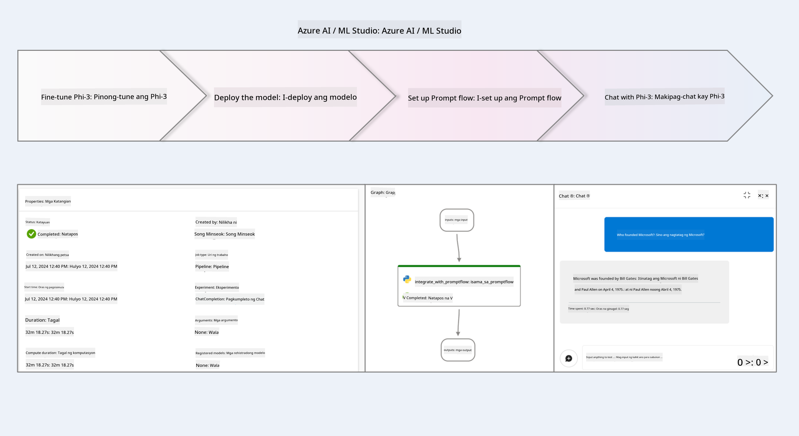

### Talaan ng Nilalaman

1. **[Senaryo 1: Mag-set up ng mga Azure resources at Maghanda para sa fine-tuning](../../../../../../md/02.Application/01.TextAndChat/Phi3)**
    - [Gumawa ng Azure Machine Learning Workspace](../../../../../../md/02.Application/01.TextAndChat/Phi3)
    - [Humiling ng mga GPU quotas sa Azure Subscription](../../../../../../md/02.Application/01.TextAndChat/Phi3)
    - [Magdagdag ng role assignment](../../../../../../md/02.Application/01.TextAndChat/Phi3)
    - [Mag-set up ng proyekto](../../../../../../md/02.Application/01.TextAndChat/Phi3)
    - [Maghanda ng dataset para sa fine-tuning](../../../../../../md/02.Application/01.TextAndChat/Phi3)

1. **[Senaryo 2: I-fine-tune ang Phi-3 model at I-deploy sa Azure Machine Learning Studio](../../../../../../md/02.Application/01.TextAndChat/Phi3)**
    - [I-fine-tune ang Phi-3 model](../../../../../../md/02.Application/01.TextAndChat/Phi3)
    - [I-deploy ang na fine-tune na Phi-3 model](../../../../../../md/02.Application/01.TextAndChat/Phi3)

1. **[Senaryo 3: Isama sa Prompt flow at Makipag-chat gamit ang iyong custom na modelo sa Azure AI Foundry](../../../../../../md/02.Application/01.TextAndChat/Phi3)**
    - [Isama ang custom na Phi-3 model sa Prompt flow](../../../../../../md/02.Application/01.TextAndChat/Phi3)
    - [Makipag-chat gamit ang iyong custom na Phi-3 model](../../../../../../md/02.Application/01.TextAndChat/Phi3)

## Senaryo 1: Mag-set up ng mga Azure resources at Maghanda para sa fine-tuning

### Gumawa ng Azure Machine Learning Workspace

1. I-type ang *azure machine learning* sa **search bar** sa itaas ng portal page at piliin ang **Azure Machine Learning** mula sa mga opsyon na lalabas.

    

2. Piliin ang **+ Create** mula sa navigation menu.

3. Piliin ang **New workspace** mula sa navigation menu.

    

4. Gawin ang mga sumusunod na gawain:

    - Piliin ang iyong Azure **Subscription**.
    - Piliin ang **Resource group** na gagamitin (gumawa ng bago kung kinakailangan).
    - Ilagay ang **Workspace Name**. Dapat ito ay isang natatanging halaga.
    - Piliin ang **Region** na gusto mong gamitin.
    - Piliin ang **Storage account** na gagamitin (gumawa ng bago kung kinakailangan).
    - Piliin ang **Key vault** na gagamitin (gumawa ng bago kung kinakailangan).
    - Piliin ang **Application insights** na gagamitin (gumawa ng bago kung kinakailangan).
    - Piliin ang **Container registry** na gagamitin (gumawa ng bago kung kinakailangan).

    

5. Piliin ang **Review + Create**.

6. Piliin ang **Create**.

### Humiling ng mga GPU quotas sa Azure Subscription

Sa tutorial na ito, matututunan mo kung paano i-fine-tune at ideploy ang isang Phi-3 model, gamit ang mga GPU. Para sa fine-tuning, gagamitin mo ang *Standard_NC24ads_A100_v4* GPU, na nangangailangan ng quota request. Para sa deployment, gagamitin mo ang *Standard_NC6s_v3* GPU, na nangangailangan din ng quota request.

> [!NOTE]
>
> Ang Pay-As-You-Go lamang na subscriptions (ang standard na uri ng subscription) ang karapat-dapat para sa GPU allocation; ang benefit subscriptions ay hindi pa suportado.
>

1. Bisitahin ang [Azure ML Studio](https://ml.azure.com/home?wt.mc_id=studentamb_279723).

1. Gawin ang mga sumusunod upang humiling ng *Standard NCADSA100v4 Family* quota:

    - Piliin ang **Quota** mula sa kaliwang side tab.
    - Piliin ang **Virtual machine family** na gagamitin. Halimbawa, piliin ang **Standard NCADSA100v4 Family Cluster Dedicated vCPUs**, na kinabibilangan ng *Standard_NC24ads_A100_v4* GPU.
    - Piliin ang **Request quota** mula sa navigation menu.

        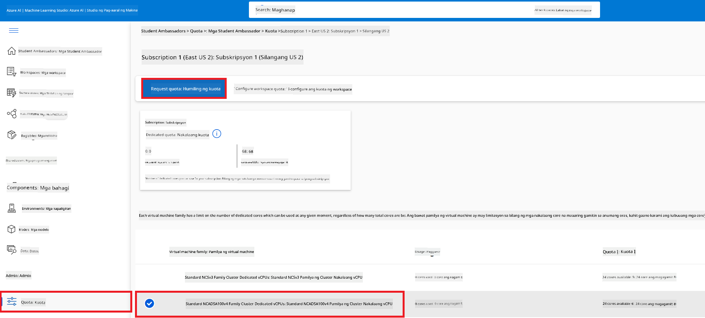

    - Sa loob ng Request quota page, ilagay ang **New cores limit** na gusto mong gamitin. Halimbawa, 24.
    - Sa loob ng Request quota page, piliin ang **Submit** para humiling ng GPU quota.

1. Gawin ang mga sumusunod upang humiling ng *Standard NCSv3 Family* quota:

    - Piliin ang **Quota** mula sa kaliwang side tab.
    - Piliin ang **Virtual machine family** na gagamitin. Halimbawa, piliin ang **Standard NCSv3 Family Cluster Dedicated vCPUs**, na kinabibilangan ng *Standard_NC6s_v3* GPU.
    - Piliin ang **Request quota** mula sa navigation menu.
    - Sa loob ng Request quota page, ilagay ang **New cores limit** na gusto mong gamitin. Halimbawa, 24.
    - Sa loob ng Request quota page, piliin ang **Submit** para humiling ng GPU quota.

### Magdagdag ng role assignment

Para sa fine-tuning at pag-deploy ng iyong mga modelo, kailangan mo munang gumawa ng User Assigned Managed Identity (UAI) at i-assign ito sa angkop na permiso. Ang UAI na ito ang gagamitin para sa authentication habang nagde-deploy.

#### Gumawa ng User Assigned Managed Identity(UAI)

1. I-type ang *managed identities* sa **search bar** sa itaas ng portal page at piliin ang **Managed Identities** mula sa mga opsyon na lalabas.

    

1. Piliin ang **+ Create**.

    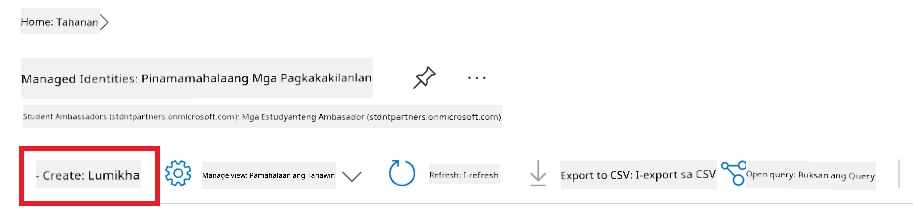

1. Gawin ang mga sumusunod:

    - Piliin ang iyong Azure **Subscription**.
    - Piliin ang **Resource group** na gagamitin (gumawa ng bago kung kinakailangan).
    - Piliin ang **Region** na gusto mong gamitin.
    - Ilagay ang **Name**. Dapat ito ay isang natatanging halaga.

    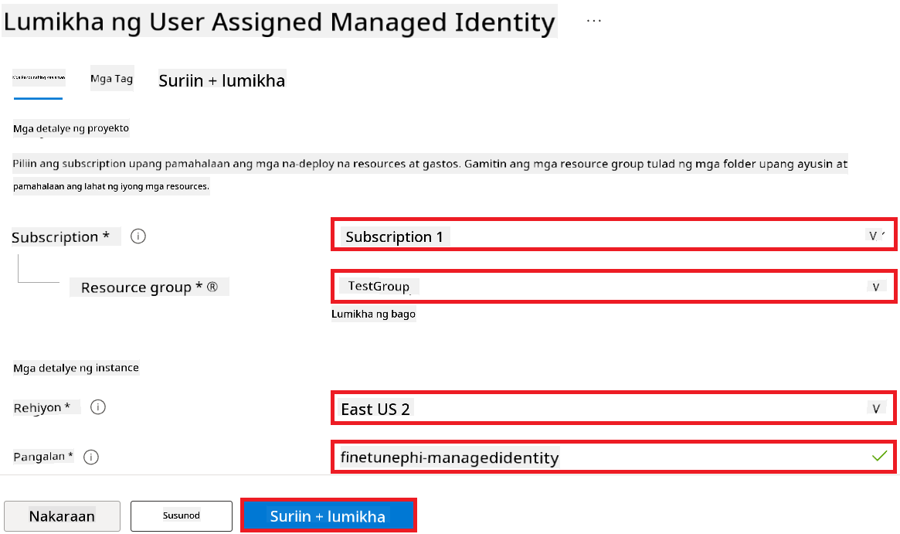

1. Piliin ang **Review + create**.

1. Piliin ang **+ Create**.

#### Magdagdag ng Contributor role assignment sa Managed Identity

1. Pumunta sa Managed Identity resource na ginawa mo.

1. Piliin ang **Azure role assignments** mula sa kaliwang side tab.

1. Piliin ang **+Add role assignment** mula sa navigation menu.

1. Sa loob ng Add role assignment page, gawin ang mga sumusunod:
    - Piliin ang **Scope** sa **Resource group**.
    - Piliin ang iyong Azure **Subscription**.
    - Piliin ang **Resource group** na gagamitin.
    - Piliin ang **Role** sa **Contributor**.

    

2. Piliin ang **Save**.

#### Magdagdag ng Storage Blob Data Reader role assignment sa Managed Identity

1. I-type ang *storage accounts* sa **search bar** sa itaas ng portal page at piliin ang **Storage accounts** mula sa mga opsyon na lalabas.

    

1. Piliin ang storage account na kaugnay ng Azure Machine Learning workspace na ginawa mo. Halimbawa, *finetunephistorage*.

1. Gawin ang mga sumusunod upang pumunta sa Add role assignment page:

    - Pumunta sa Azure Storage account na ginawa mo.
    - Piliin ang **Access Control (IAM)** mula sa kaliwang side tab.
    - Piliin ang **+ Add** mula sa navigation menu.
    - Piliin ang **Add role assignment** mula sa navigation menu.

    

1. Sa loob ng Add role assignment page, gawin ang mga sumusunod:

    - Sa loob ng Role page, i-type ang *Storage Blob Data Reader* sa **search bar** at piliin ang **Storage Blob Data Reader** mula sa mga opsyon na lalabas.
    - Sa loob ng Role page, piliin ang **Next**.
    - Sa loob ng Members page, piliin ang **Assign access to** **Managed identity**.
    - Sa loob ng Members page, piliin ang **+ Select members**.
    - Sa loob ng Select managed identities page, piliin ang iyong Azure **Subscription**.
    - Sa loob ng Select managed identities page, piliin ang **Managed identity** sa **Manage Identity**.
    - Sa loob ng Select managed identities page, piliin ang Manage Identity na ginawa mo. Halimbawa, *finetunephi-managedidentity*.
    - Sa loob ng Select managed identities page, piliin ang **Select**.

    

1. Piliin ang **Review + assign**.

#### Magdagdag ng AcrPull role assignment sa Managed Identity

1. I-type ang *container registries* sa **search bar** sa itaas ng portal page at piliin ang **Container registries** mula sa mga opsyon na lalabas.

    

1. Piliin ang container registry na kaugnay ng Azure Machine Learning workspace. Halimbawa, *finetunephicontainerregistry*

1. Gawin ang mga sumusunod upang pumunta sa Add role assignment page:

    - Piliin ang **Access Control (IAM)** mula sa kaliwang side tab.
    - Piliin ang **+ Add** mula sa navigation menu.
    - Piliin ang **Add role assignment** mula sa navigation menu.

1. Sa loob ng Add role assignment page, gawin ang mga sumusunod:

    - Sa loob ng Role page, i-type ang *AcrPull* sa **search bar** at piliin ang **AcrPull** mula sa mga opsyon na lalabas.
    - Sa loob ng Role page, piliin ang **Next**.
    - Sa loob ng Members page, piliin ang **Assign access to** **Managed identity**.
    - Sa loob ng Members page, piliin ang **+ Select members**.
    - Sa loob ng Select managed identities page, piliin ang iyong Azure **Subscription**.
    - Sa loob ng Select managed identities page, piliin ang **Managed identity** sa **Manage Identity**.
    - Sa loob ng Select managed identities page, piliin ang Manage Identity na ginawa mo. Halimbawa, *finetunephi-managedidentity*.
    - Sa loob ng Select managed identities page, piliin ang **Select**.
    - Piliin ang **Review + assign**.

### Mag-set up ng proyekto

Para ma-download ang mga datasets na kailangan para sa fine-tuning, magse-set up ka ng lokal na kapaligiran.

Sa ehersisyong ito, gagawin mo ang mga sumusunod

- Gumawa ng folder kung saan magtatrabaho.
- Gumawa ng virtual environment.
- I-install ang mga kinakailangang packages.
- Gumawa ng *download_dataset.py* na file para i-download ang dataset.

#### Gumawa ng folder kung saan magtatrabaho

1. Buksan ang terminal window at i-type ang sumusunod na command para gumawa ng folder na pinangalanang *finetune-phi* sa default na path.

    ```console
    mkdir finetune-phi
    ```

2. I-type ang sumusunod na utos sa iyong terminal upang pumunta sa *finetune-phi* folder na iyong ginawa.

    ```console
    cd finetune-phi
    ```

#### Gumawa ng virtual environment

1. I-type ang sumusunod na utos sa iyong terminal upang gumawa ng virtual environment na pinangalanang *.venv*.

    ```console
    python -m venv .venv
    ```

2. I-type ang sumusunod na utos sa iyong terminal upang i-activate ang virtual environment.

    ```console
    .venv\Scripts\activate.bat
    ```

> [!NOTE]
> Kung gumana ito, dapat mong makita ang *(.venv)* bago ang command prompt.

#### I-install ang mga kinakailangang packages

1. I-type ang mga sumusunod na utos sa iyong terminal upang i-install ang mga kinakailangang packages.

    ```console
    pip install datasets==2.19.1
    ```

#### Gumawa ng `donload_dataset.py`

> [!NOTE]
> Kumpletong istraktura ng folder:
>
> ```text
> └── YourUserName
> .    └── finetune-phi
> .        └── download_dataset.py
> ```

1. Buksan ang **Visual Studio Code**.

1. Piliin ang **File** mula sa menu bar.

1. Piliin ang **Open Folder**.

1. Piliin ang *finetune-phi* folder na iyong ginawa, na matatagpuan sa *C:\Users\yourUserName\finetune-phi*.

    

1. Sa kaliwang pane ng Visual Studio Code, i-right-click at piliin ang **New File** upang gumawa ng bagong file na pinangalanang *download_dataset.py*.

    

### Ihanda ang dataset para sa fine-tuning

Sa ehersisyong ito, patatakbuhin mo ang *download_dataset.py* file upang i-download ang *ultrachat_200k* datasets papunta sa iyong lokal na kapaligiran. Gagamitin mo ang mga datasets na ito upang mag-fine-tune ng Phi-3 model sa Azure Machine Learning.

Sa ehersisyong ito, gagawin mo ang sumusunod:

- Magdagdag ng code sa *download_dataset.py* file upang i-download ang mga datasets.
- Patakbuhin ang *download_dataset.py* file upang i-download ang mga datasets papunta sa iyong lokal na kapaligiran.

#### I-download ang iyong dataset gamit ang *download_dataset.py*

1. Buksan ang *download_dataset.py* file sa Visual Studio Code.

1. Idagdag ang sumusunod na code sa loob ng *download_dataset.py* file.

    ```python
    import json
    import os
    from datasets import load_dataset

    def load_and_split_dataset(dataset_name, config_name, split_ratio):
        """
        Load and split a dataset.
        """
        # I-load ang dataset gamit ang tinukoy na pangalan, konfigurasyon, at split ratio
        dataset = load_dataset(dataset_name, config_name, split=split_ratio)
        print(f"Original dataset size: {len(dataset)}")
        
        # Hatiin ang dataset sa mga train at test set (80% train, 20% test)
        split_dataset = dataset.train_test_split(test_size=0.2)
        print(f"Train dataset size: {len(split_dataset['train'])}")
        print(f"Test dataset size: {len(split_dataset['test'])}")
        
        return split_dataset

    def save_dataset_to_jsonl(dataset, filepath):
        """
        Save a dataset to a JSONL file.
        """
        # Gumawa ng direktoryo kung ito ay wala pa
        os.makedirs(os.path.dirname(filepath), exist_ok=True)
        
        # Buksan ang file sa write mode
        with open(filepath, 'w', encoding='utf-8') as f:
            # I-iterate ang bawat record sa dataset
            for record in dataset:
                # I-dump ang record bilang isang JSON object at isulat ito sa file
                json.dump(record, f)
                # Isulat ang newline character upang paghiwalayin ang mga record
                f.write('\n')
        
        print(f"Dataset saved to {filepath}")

    def main():
        """
        Main function to load, split, and save the dataset.
        """
        # I-load at hatiin ang ULTRACHAT_200k dataset gamit ang partikular na konfigurasyon at split ratio
        dataset = load_and_split_dataset("HuggingFaceH4/ultrachat_200k", 'default', 'train_sft[:1%]')
        
        # Kunin ang train at test dataset mula sa split
        train_dataset = dataset['train']
        test_dataset = dataset['test']

        # I-save ang train dataset sa isang JSONL file
        save_dataset_to_jsonl(train_dataset, "data/train_data.jsonl")
        
        # I-save ang test dataset sa isang hiwalay na JSONL file
        save_dataset_to_jsonl(test_dataset, "data/test_data.jsonl")

    if __name__ == "__main__":
        main()

    ```

1. I-type ang sumusunod na utos sa iyong terminal upang patakbuhin ang script at i-download ang dataset papunta sa iyong lokal na kapaligiran.

    ```console
    python download_dataset.py
    ```

1. Beripikahin na ang mga datasets ay na-save nang matagumpay sa iyong lokal na *finetune-phi/data* directory.

> [!NOTE]
>
> #### Paalala tungkol sa laki ng dataset at tagal ng fine-tuning
>
> Sa tutorial na ito, gagamit ka lamang ng 1% ng dataset (`split='train[:1%]'`). Malaki itong nakakabawas sa dami ng data, kaya pinararami ang bilis ng pag-upload at proseso ng fine-tuning. Maaari mong baguhin ang porsyento upang mahanap ang tamang balanse sa pagitan ng oras ng pagsasanay at performance ng modelo. Ang paggamit ng mas maliit na bahagi ng dataset ay nagpapabawas ng oras na kinakailangan para sa fine-tuning, kaya mas madali itong gawin sa isang tutorial.

## Scenario 2: Fine-tune ang Phi-3 model at I-deploy sa Azure Machine Learning Studio

### Fine-tune ang Phi-3 model

Sa ehersisyong ito, mag-fine-tune ka ng Phi-3 model sa Azure Machine Learning Studio.

Sa ehersisyong ito, gagawin mo ang mga sumusunod:

- Gumawa ng computer cluster para sa fine-tuning.
- Fine-tune ang Phi-3 model sa Azure Machine Learning Studio.

#### Gumawa ng computer cluster para sa fine-tuning

1. Bisitahin ang [Azure ML Studio](https://ml.azure.com/home?wt.mc_id=studentamb_279723).

1. Piliin ang **Compute** mula sa kaliwang tab.

1. Piliin ang **Compute clusters** mula sa navigation menu.

1. Piliin ang **+ New**.

    

1. Isagawa ang mga sumusunod:

    - Piliin ang **Region** na gusto mong gamitin.
    - Piliin ang **Virtual machine tier** sa **Dedicated**.
    - Piliin ang **Virtual machine type** sa **GPU**.
    - Piliin ang **Virtual machine size** filter sa **Select from all options**.
    - Piliin ang **Virtual machine size** sa **Standard_NC24ads_A100_v4**.

    

1. Piliin ang **Next**.

1. Isagawa ang mga sumusunod:

    - Ilagay ang **Compute name**. Dapat ito ay natatanging halaga.
    - Piliin ang **Minimum number of nodes** sa **0**.
    - Piliin ang **Maximum number of nodes** sa **1**.
    - Piliin ang **Idle seconds before scale down** sa **120**.

    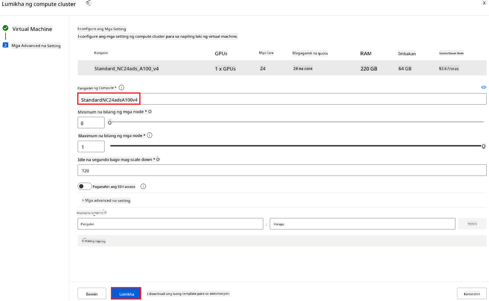

1. Piliin ang **Create**.

#### Fine-tune ang Phi-3 model

1. Bisitahin ang [Azure ML Studio](https://ml.azure.com/home?wt.mc_id=studentamb_279723).

1. Piliin ang Azure Machine Learning workspace na iyong ginawa.

    

1. Isagawa ang mga sumusunod:

    - Piliin ang **Model catalog** mula sa kaliwang tab.
    - I-type ang *phi-3-mini-4k* sa **search bar** at piliin ang **Phi-3-mini-4k-instruct** mula sa lumalabas na mga opsyon.

    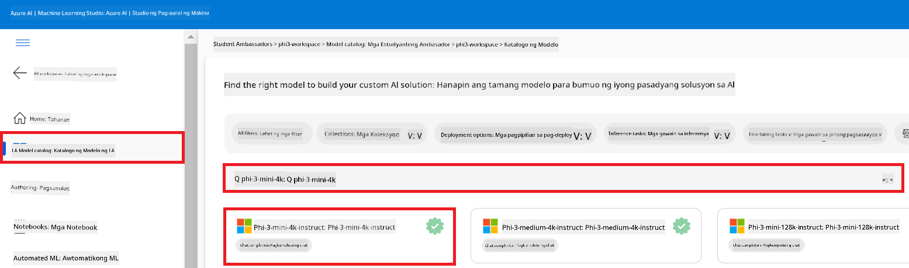

1. Piliin ang **Fine-tune** mula sa navigation menu.

    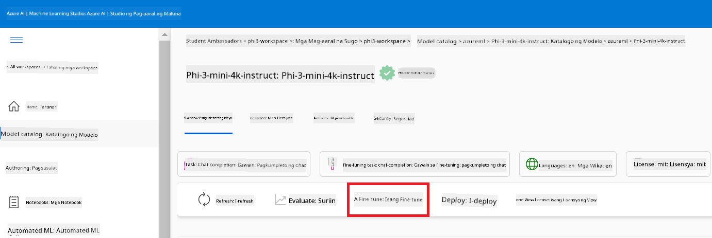

1. Isagawa ang mga sumusunod:

    - Piliin ang **Select task type** sa **Chat completion**.
    - Piliin ang **+ Select data** upang i-upload ang **Training data**.
    - Piliin ang Validation data upload type sa **Provide different validation data**.
    - Piliin ang **+ Select data** upang i-upload ang **Validation data**.

    

> [!TIP]
>
> Maaari mong piliin ang **Advanced settings** upang i-customize ang mga konfigurasyon tulad ng **learning_rate** at **lr_scheduler_type** upang i-optimize ang proseso ng fine-tuning ayon sa iyong mga pangangailangan.

1. Piliin ang **Finish**.

1. Sa ehersisyong ito, matagumpay mong na-fine-tune ang Phi-3 model gamit ang Azure Machine Learning. Pakitandaan na ang proseso ng fine-tuning ay maaaring tumagal ng isang konsiderableng oras. Matapos patakbuhin ang fine-tuning job, kailangan mong maghintay para sa pagkakatapos nito. Maaari mong subaybayan ang status ng fine-tuning job sa pamamagitan ng pagpunta sa Jobs tab sa kaliwang bahagi ng iyong Azure Machine Learning Workspace. Sa susunod na bahagi, i-deploy mo ang fine-tuned model at i-integrate ito sa Prompt flow.

    

### I-deploy ang fine-tuned na Phi-3 model

Upang ma-integrate ang fine-tuned na Phi-3 model sa Prompt flow, kailangan mong i-deploy ang modelo upang maging accessible ito para sa real-time inference. Kasama sa prosesong ito ang pagrerehistro ng modelo, paggawa ng online endpoint, at pag-deploy ng modelo.

Sa ehersisyong ito, gagawin mo ang mga sumusunod:

- Irehistro ang fine-tuned na modelo sa Azure Machine Learning workspace.
- Gumawa ng online endpoint.
- I-deploy ang narehistrong fine-tuned na Phi-3 model.

#### Irehistro ang fine-tuned na modelo

1. Bisitahin ang [Azure ML Studio](https://ml.azure.com/home?wt.mc_id=studentamb_279723).

1. Piliin ang Azure Machine Learning workspace na iyong ginawa.

    

1. Piliin ang **Models** mula sa kaliwang tab.
1. Piliin ang **+ Register**.
1. Piliin ang **From a job output**.

    

1. Piliin ang job na iyong ginawa.

    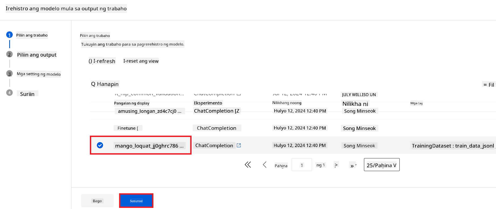

1. Piliin ang **Next**.

1. Piliin ang **Model type** sa **MLflow**.

1. Siguraduhing naka-select ang **Job output**; karaniwang ito ay awtomatikong naka-select.

    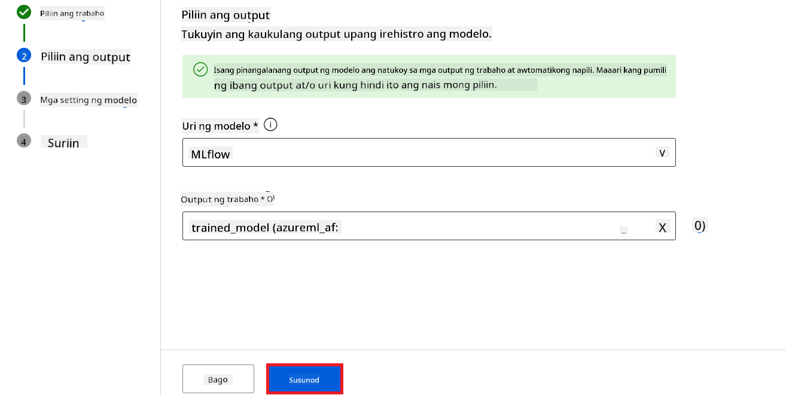

2. Piliin ang **Next**.

3. Piliin ang **Register**.

    

4. Maaari mong tingnan ang iyong narehistrong modelo sa pamamagitan ng pagpunta sa **Models** menu mula sa kaliwang tab.

    

#### I-deploy ang fine-tuned na modelo

1. Puntahan ang Azure Machine Learning workspace na ginawa mo.

1. Piliin ang **Endpoints** mula sa kaliwang tab.

1. Piliin ang **Real-time endpoints** mula sa navigation menu.

    

1. Piliin ang **Create**.

1. Piliin ang narehistrong modelo na ginawa mo.

    

1. Piliin ang **Select**.

1. Isagawa ang mga sumusunod:

    - Piliin ang **Virtual machine** sa *Standard_NC6s_v3*.
    - Piliin ang **Instance count** na gusto mong gamitin. Halimbawa, *1*.
    - Piliin ang **Endpoint** sa **New** upang gumawa ng endpoint.
    - Ilagay ang **Endpoint name**. Dapat ito ay natatanging halaga.
    - Ilagay ang **Deployment name**. Dapat ito ay natatanging halaga.

    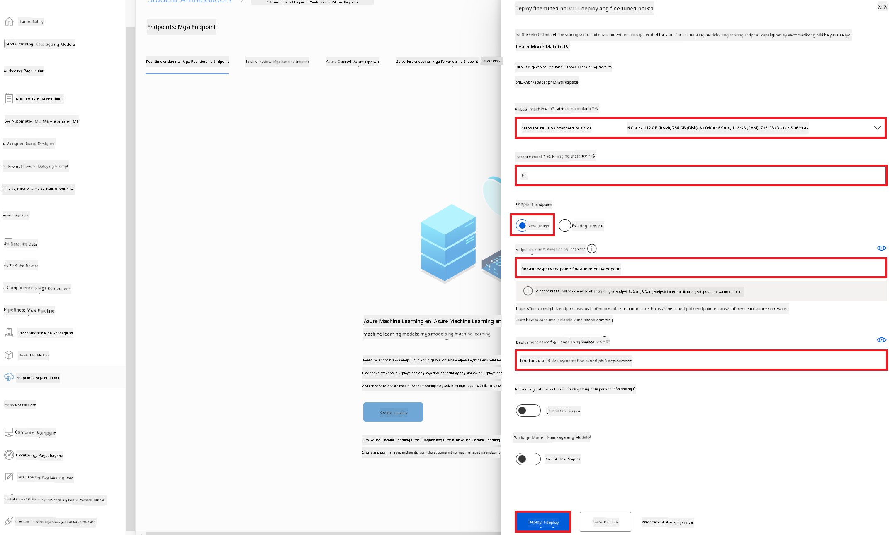

1. Piliin ang **Deploy**.

> [!WARNING]
> Upang maiwasan ang karagdagang singil sa iyong account, siguraduhing i-delete ang nagawang endpoint sa Azure Machine Learning workspace.
>

#### Suriin ang status ng deployment sa Azure Machine Learning Workspace

1. Puntahan ang Azure Machine Learning workspace na ginawa mo.

1. Piliin ang **Endpoints** mula sa kaliwang tab.

1. Piliin ang endpoint na ginawa mo.

    

1. Sa pahinang ito, maaari mong pamahalaan ang mga endpoints habang ipinapagawa ang deployment.

> [!NOTE]
> Kapag natapos na ang deployment, tiyakin na ang **Live traffic** ay nakaset sa **100%**. Kung hindi, piliin ang **Update traffic** upang ayusin ang mga setting ng traffic. Tandaan na hindi mo maaaring subukan ang modelo kung ang traffic ay nakaset sa 0%.
>
> 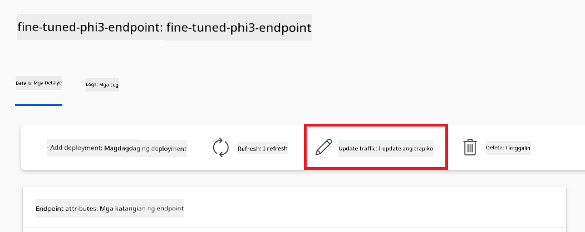
>

## Scenario 3: Integrate sa Prompt flow at Makipag-chat gamit ang iyong custom na modelo sa Azure AI Foundry

### I-integrate ang custom na Phi-3 model sa Prompt flow

Matapos matagumpay na ma-deploy ang iyong fine-tuned na modelo, maaari mo na itong i-integrate sa Prompt Flow upang magamit ang iyong modelo sa mga real-time na aplikasyon, na nagpapahintulot ng iba't ibang interactive na gawain gamit ang iyong custom na Phi-3 model.

Sa ehersisyong ito, gagawin mo ang mga sumusunod:

- Gumawa ng Azure AI Foundry Hub.
- Gumawa ng Azure AI Foundry Project.
- Gumawa ng Prompt flow.
- Magdagdag ng custom connection para sa fine-tuned na Phi-3 model.
- Isaayos ang Prompt flow upang makipag-chat gamit ang iyong custom na Phi-3 model.

> [!NOTE]
> Maaari ka ring mag-integrate sa Promptflow gamit ang Azure ML Studio. Ang parehong proseso ng integrasyon ay maaaring gamitin sa Azure ML Studio.

#### Gumawa ng Azure AI Foundry Hub

Kailangan mong gumawa ng Hub bago gumawa ng Project. Ang Hub ay parang isang Resource Group, na nagbibigay-daan sa iyo upang ayusin at pamahalaan ang maraming Projects sa loob ng Azure AI Foundry.

1. Bisitahin ang [Azure AI Foundry](https://ai.azure.com/?WT.mc_id=aiml-137032-kinfeylo).

1. Piliin ang **All hubs** mula sa kaliwang tab.

1. Piliin ang **+ New hub** mula sa navigation menu.
    

1. Gawin ang mga sumusunod na gawain:

    - Ipasok ang **Hub name**. Dapat ito ay natatanging halaga.
    - Piliin ang iyong Azure **Subscription**.
    - Piliin ang **Resource group** na gagamitin (gumawa ng bago kung kinakailangan).
    - Piliin ang **Location** na nais mong gamitin.
    - Piliin ang **Connect Azure AI Services** na gagamitin (gumawa ng bago kung kinakailangan).
    - Piliin ang **Connect Azure AI Search** sa **Skip connecting**.

    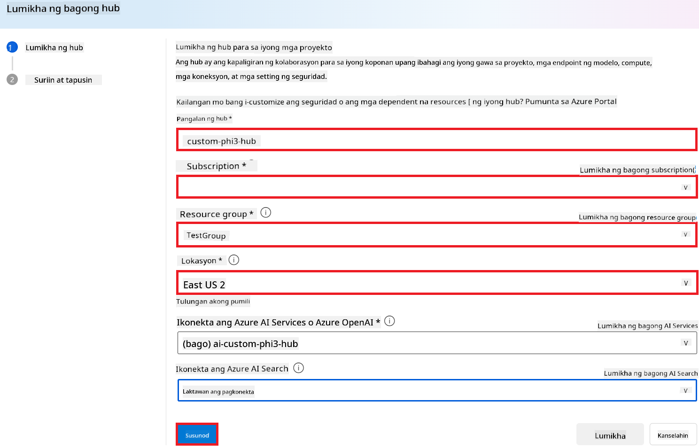

1. Piliin ang **Next**.

#### Gumawa ng Azure AI Foundry Project

1. Sa Hub na iyong ginawa, piliin ang **All projects** mula sa tab sa kaliwang bahagi.

1. Piliin ang **+ New project** mula sa navigation menu.

    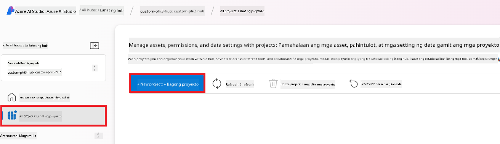

1. Ipasok ang **Project name**. Dapat ito ay natatanging halaga.

    

1. Piliin ang **Create a project**.

#### Magdagdag ng custom na koneksyon para sa fine-tuned Phi-3 model

Para isama ang iyong custom na Phi-3 model sa Prompt flow, kailangan mong i-save ang endpoint at key ng modelo sa isang custom na koneksyon. Tinitiyak ng setup na ito ang access sa iyong custom na Phi-3 model sa Prompt flow.

#### Itakda ang api key at endpoint uri ng fine-tuned Phi-3 model

1. Bisitahin ang [Azure ML Studio](https://ml.azure.com/home?WT.mc_id=aiml-137032-kinfeylo).

1. Pumunta sa Azure Machine learning workspace na iyong ginawa.

1. Piliin ang **Endpoints** mula sa kaliwang tab.

    

1. Piliin ang endpoint na ginawa mo.

    

1. Piliin ang **Consume** mula sa navigation menu.

1. Kopyahin ang iyong **REST endpoint** at **Primary key**.

    

#### Idagdag ang Custom Connection

1. Bisitahin ang [Azure AI Foundry](https://ai.azure.com/?WT.mc_id=aiml-137032-kinfeylo).

1. Pumunta sa Azure AI Foundry project na iyong ginawa.

1. Sa Project na ginawa mo, piliin ang **Settings** mula sa kaliwang tab.

1. Piliin ang **+ New connection**.

    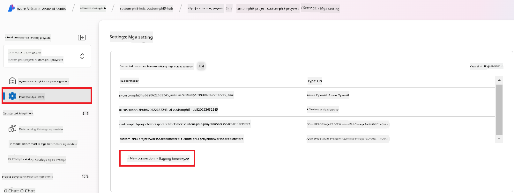

1. Piliin ang **Custom keys** mula sa navigation menu.

    

1. Gawin ang mga sumusunod na hakbang:

    - Piliin ang **+ Add key value pairs**.
    - Para sa pangalan ng key, ipasok ang **endpoint** at i-paste ang endpoint na kinopya mo mula sa Azure ML Studio sa field na value.
    - Piliin muli ang **+ Add key value pairs**.
    - Para sa pangalan ng key, ipasok ang **key** at i-paste ang key na kinopya mo mula sa Azure ML Studio sa field na value.
    - Pagkatapos idagdag ang mga keys, piliin ang **is secret** para maiwasang mailantad ang key.

    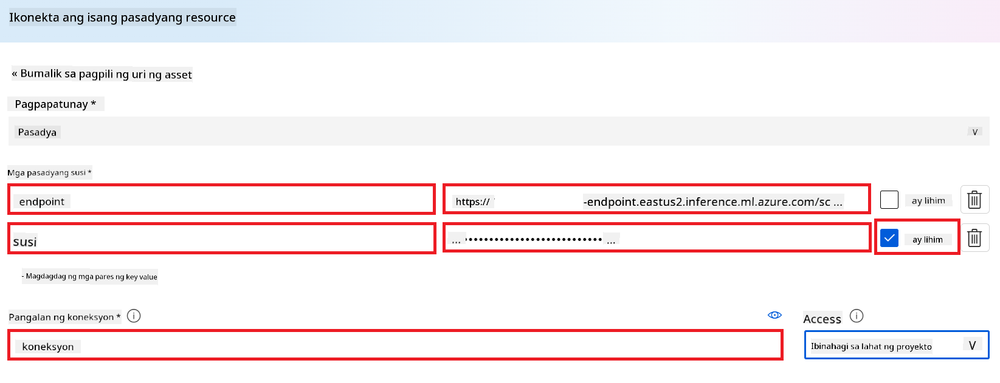

1. Piliin ang **Add connection**.

#### Gumawa ng Prompt flow

Nagdagdag ka na ng custom na koneksyon sa Azure AI Foundry. Ngayon, gumawa tayo ng Prompt flow gamit ang mga sumusunod na hakbang. Pagkatapos, ikokonekta mo ang Prompt flow na ito sa custom na koneksyon upang magamit mo ang fine-tuned na modelo sa loob ng Prompt flow.

1. Pumunta sa Azure AI Foundry project na ginawa mo.

1. Piliin ang **Prompt flow** mula sa tab sa kaliwang bahagi.

1. Piliin ang **+ Create** mula sa navigation menu.

    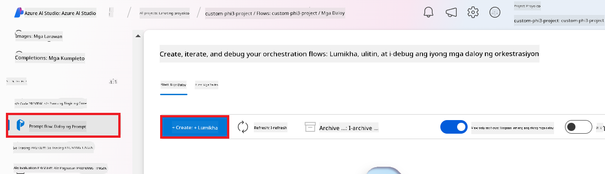

1. Piliin ang **Chat flow** mula sa navigation menu.

    

1. Ipasok ang **Folder name** na gagamitin.

    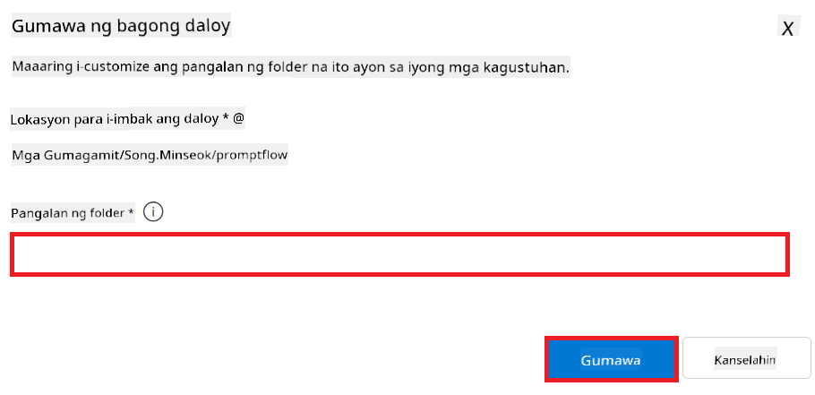

2. Piliin ang **Create**.

#### Ayusin ang Prompt flow para makipag-chat sa iyong custom Phi-3 model

Kailangan mong isama ang fine-tuned Phi-3 model sa isang Prompt flow. Gayunpaman, ang umiiral na Prompt flow ay hindi disenyo para dito. Kaya, kailangan mong i-redesign ang Prompt flow para maisama ang custom na modelo.

1. Sa Prompt flow, gawin ang mga sumusunod para muling buuin ang umiiral na flow:

    - Piliin ang **Raw file mode**.
    - Burahin ang lahat ng umiiral na code sa *flow.dag.yml* file.
    - Idagdag ang sumusunod na code sa *flow.dag.yml* file.

        ```yml
        inputs:
          input_data:
            type: string
            default: "Who founded Microsoft?"

        outputs:
          answer:
            type: string
            reference: ${integrate_with_promptflow.output}

        nodes:
        - name: integrate_with_promptflow
          type: python
          source:
            type: code
            path: integrate_with_promptflow.py
          inputs:
            input_data: ${inputs.input_data}
        ```

    - Piliin ang **Save**.

    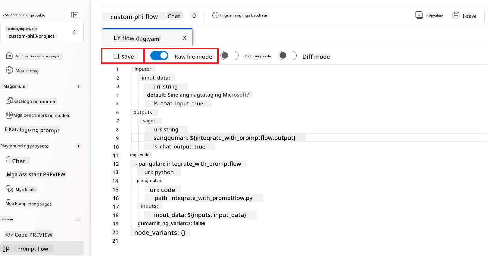

1. Idagdag ang sumusunod na code sa *integrate_with_promptflow.py* file para magamit ang custom na Phi-3 model sa Prompt flow.

    ```python
    import logging
    import requests
    from promptflow import tool
    from promptflow.connections import CustomConnection

    # Pagsasaayos ng pag-log
    logging.basicConfig(
        format="%(asctime)s - %(levelname)s - %(name)s - %(message)s",
        datefmt="%Y-%m-%d %H:%M:%S",
        level=logging.DEBUG
    )
    logger = logging.getLogger(__name__)

    def query_phi3_model(input_data: str, connection: CustomConnection) -> str:
        """
        Send a request to the Phi-3 model endpoint with the given input data using Custom Connection.
        """

        # Ang "connection" ay ang pangalan ng Custom Connection, ang "endpoint", "key" ay mga susi sa Custom Connection
        endpoint_url = connection.endpoint
        api_key = connection.key

        headers = {
            "Content-Type": "application/json",
            "Authorization": f"Bearer {api_key}"
        }
        data = {
            "input_data": {
                "input_string": [
                    {"role": "user", "content": input_data}
                ],
                "parameters": {
                    "temperature": 0.7,
                    "max_new_tokens": 128
                }
            }
        }
        try:
            response = requests.post(endpoint_url, json=data, headers=headers)
            response.raise_for_status()
            
            # I-log ang buong tugon na JSON
            logger.debug(f"Full JSON response: {response.json()}")

            result = response.json()["output"]
            logger.info("Successfully received response from Azure ML Endpoint.")
            return result
        except requests.exceptions.RequestException as e:
            logger.error(f"Error querying Azure ML Endpoint: {e}")
            raise

    @tool
    def my_python_tool(input_data: str, connection: CustomConnection) -> str:
        """
        Tool function to process input data and query the Phi-3 model.
        """
        return query_phi3_model(input_data, connection)

    ```

    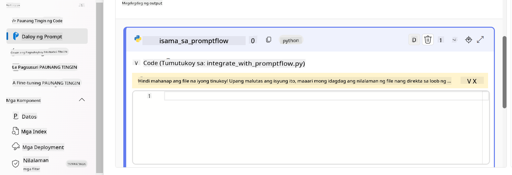

> [!NOTE]
> Para sa mas detalyadong impormasyon sa paggamit ng Prompt flow sa Azure AI Foundry, maaari kang tumingin sa [Prompt flow in Azure AI Foundry](https://learn.microsoft.com/azure/ai-studio/how-to/prompt-flow).

1. Piliin ang **Chat input**, **Chat output** para paganahin ang chat sa iyong modelo.

    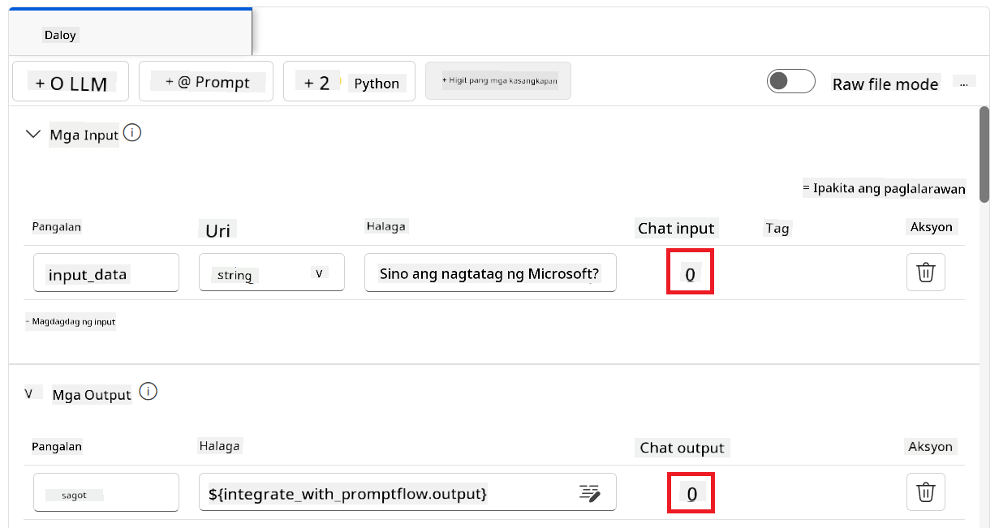

1. Handa ka nang makipag-chat sa iyong custom Phi-3 model. Sa susunod na ehersisyo, matututuhan mo kung paano simulan ang Prompt flow at gamitin ito upang makipag-chat sa iyong fine-tuned na Phi-3 model.

> [!NOTE]
>
> Ang muling binuong flow ay dapat magmukhang tulad ng nasa larawan sa ibaba:
>
> 
>

### Makipag-chat sa iyong custom Phi-3 model

Ngayon na na-fine-tune at naisama mo na ang iyong custom na Phi-3 model sa Prompt flow, handa ka nang magsimula ng pakikipag-ugnayan dito. Gagabayan ka ng ehersisyong ito sa proseso ng pag-set up at pagsisimula ng chat gamit ang iyong modelo sa pamamagitan ng Prompt flow. Sa pagsunod sa mga hakbang na ito, magagamit mo nang husto ang kakayahan ng iyong fine-tuned na Phi-3 model para sa iba't ibang gawain at pag-uusap.

- Makipag-chat sa iyong custom na Phi-3 model gamit ang Prompt flow.

#### Simulan ang Prompt flow

1. Piliin ang **Start compute sessions** para simulan ang Prompt flow.

    

1. Piliin ang **Validate and parse input** para i-renew ang mga parameters.

    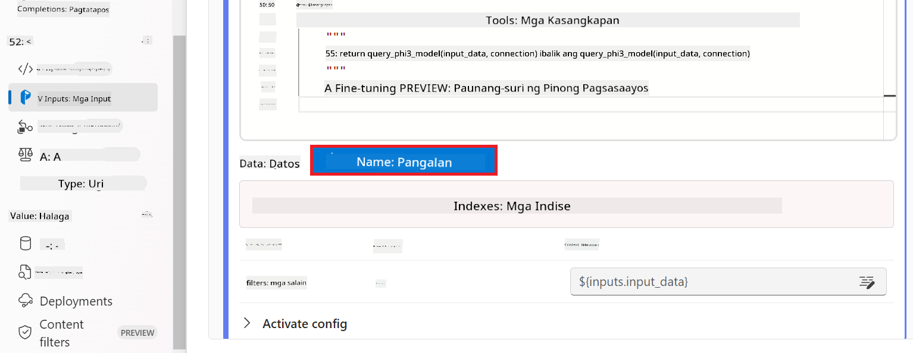

1. Piliin ang **Value** ng **connection** sa custom connection na ginawa mo. Halimbawa, *connection*.

    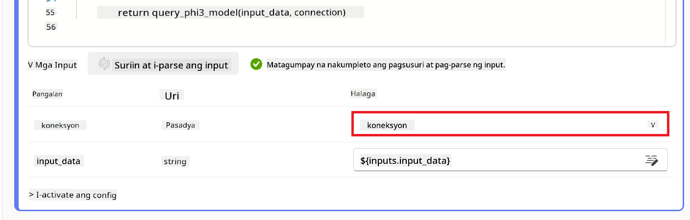

#### Makipag-chat sa iyong custom na modelo

1. Piliin ang **Chat**.

    

1. Narito ang halimbawa ng mga resulta: Ngayon ay maaari ka nang makipag-chat sa iyong custom Phi-3 model. Inirerekomenda na magtanong ka batay sa data na ginamit sa fine-tuning.

    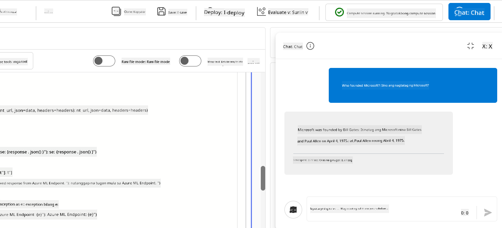

---

<!-- CO-OP TRANSLATOR DISCLAIMER START -->
**Paalala**:
Ang dokumentong ito ay isinalin gamit ang serbisyong AI na pagsasalin na [Co-op Translator](https://github.com/Azure/co-op-translator). Bagama't nagsusumikap kami ng katumpakan, pakatandaan na maaaring may mga pagkakamali o hindi tumpak na bahagi ang awtomatikong pagsasalin. Ang orihinal na dokumento sa orihinal nitong wika ang dapat ituring na opisyal na sanggunian. Para sa mahahalagang impormasyon, inirerekomenda ang propesyonal na pagsasaling-tao. Hindi kami mananagutan sa anumang hindi pagkakaintindihan o maling interpretasyon na nagmula sa paggamit ng pagsasaling ito.
<!-- CO-OP TRANSLATOR DISCLAIMER END -->