<!--
CO_OP_TRANSLATOR_METADATA:
{
  "original_hash": "ecbd9179a21edbaafaf114d47f09f3e3",
  "translation_date": "2025-07-17T01:47:43+00:00",
  "source_file": "md/02.Application/01.TextAndChat/Phi3/E2E_Phi-3-FineTuning_PromptFlow_Integration_AIFoundry.md",
  "language_code": "tl"
}
-->
# Fine-tune at Isama ang custom na Phi-3 models gamit ang Prompt flow sa Azure AI Foundry

Ang end-to-end (E2E) na halimbawa na ito ay batay sa gabay na "[Fine-Tune and Integrate Custom Phi-3 Models with Prompt Flow in Azure AI Foundry](https://techcommunity.microsoft.com/t5/educator-developer-blog/fine-tune-and-integrate-custom-phi-3-models-with-prompt-flow-in/ba-p/4191726?WT.mc_id=aiml-137032-kinfeylo)" mula sa Microsoft Tech Community. Ipinapakilala nito ang mga proseso ng fine-tuning, deployment, at integrasyon ng custom na Phi-3 models gamit ang Prompt flow sa Azure AI Foundry.  
Hindi tulad ng E2E na halimbawa, "[Fine-Tune and Integrate Custom Phi-3 Models with Prompt Flow](./E2E_Phi-3-FineTuning_PromptFlow_Integration.md)", na nangangailangan ng pagpapatakbo ng code nang lokal, ang tutorial na ito ay nakatuon nang buo sa fine-tuning at integrasyon ng iyong modelo sa loob ng Azure AI / ML Studio.

## Pangkalahatang-ideya

Sa E2E na halimbawa na ito, matututuhan mo kung paano i-fine-tune ang Phi-3 model at isama ito sa Prompt flow sa Azure AI Foundry. Sa pamamagitan ng paggamit ng Azure AI / ML Studio, makakabuo ka ng workflow para sa deployment at paggamit ng custom AI models. Ang E2E na halimbawa na ito ay nahahati sa tatlong senaryo:

**Senaryo 1: I-set up ang mga Azure resources at Ihanda para sa fine-tuning**

**Senaryo 2: I-fine-tune ang Phi-3 model at I-deploy sa Azure Machine Learning Studio**

**Senaryo 3: Isama sa Prompt flow at Makipag-chat gamit ang iyong custom na modelo sa Azure AI Foundry**

Narito ang pangkalahatang-ideya ng E2E na halimbawa na ito.

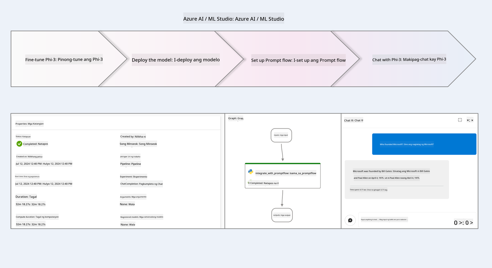

### Talaan ng Nilalaman

1. **[Senaryo 1: I-set up ang mga Azure resources at Ihanda para sa fine-tuning](../../../../../../md/02.Application/01.TextAndChat/Phi3)**
    - [Gumawa ng Azure Machine Learning Workspace](../../../../../../md/02.Application/01.TextAndChat/Phi3)
    - [Humiling ng GPU quotas sa Azure Subscription](../../../../../../md/02.Application/01.TextAndChat/Phi3)
    - [Magdagdag ng role assignment](../../../../../../md/02.Application/01.TextAndChat/Phi3)
    - [I-set up ang proyekto](../../../../../../md/02.Application/01.TextAndChat/Phi3)
    - [Ihanda ang dataset para sa fine-tuning](../../../../../../md/02.Application/01.TextAndChat/Phi3)

1. **[Senaryo 2: I-fine-tune ang Phi-3 model at I-deploy sa Azure Machine Learning Studio](../../../../../../md/02.Application/01.TextAndChat/Phi3)**
    - [I-fine-tune ang Phi-3 model](../../../../../../md/02.Application/01.TextAndChat/Phi3)
    - [I-deploy ang fine-tuned na Phi-3 model](../../../../../../md/02.Application/01.TextAndChat/Phi3)

1. **[Senaryo 3: Isama sa Prompt flow at Makipag-chat gamit ang iyong custom na modelo sa Azure AI Foundry](../../../../../../md/02.Application/01.TextAndChat/Phi3)**
    - [Isama ang custom na Phi-3 model sa Prompt flow](../../../../../../md/02.Application/01.TextAndChat/Phi3)
    - [Makipag-chat gamit ang iyong custom na Phi-3 model](../../../../../../md/02.Application/01.TextAndChat/Phi3)

## Senaryo 1: I-set up ang mga Azure resources at Ihanda para sa fine-tuning

### Gumawa ng Azure Machine Learning Workspace

1. I-type ang *azure machine learning* sa **search bar** sa itaas ng portal page at piliin ang **Azure Machine Learning** mula sa mga lumabas na opsyon.

    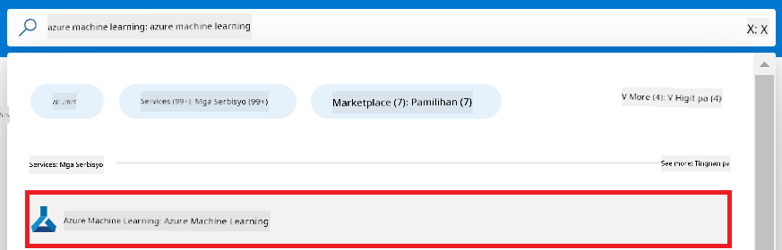

2. Piliin ang **+ Create** mula sa navigation menu.

3. Piliin ang **New workspace** mula sa navigation menu.

    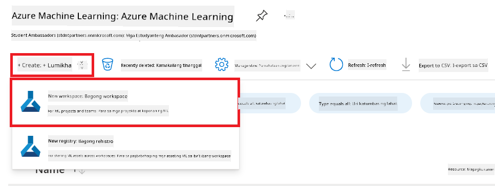

4. Gawin ang mga sumusunod:

    - Piliin ang iyong Azure **Subscription**.
    - Piliin ang **Resource group** na gagamitin (gumawa ng bago kung kinakailangan).
    - Ilagay ang **Workspace Name**. Dapat ito ay natatanging pangalan.
    - Piliin ang **Region** na nais mong gamitin.
    - Piliin ang **Storage account** na gagamitin (gumawa ng bago kung kinakailangan).
    - Piliin ang **Key vault** na gagamitin (gumawa ng bago kung kinakailangan).
    - Piliin ang **Application insights** na gagamitin (gumawa ng bago kung kinakailangan).
    - Piliin ang **Container registry** na gagamitin (gumawa ng bago kung kinakailangan).

    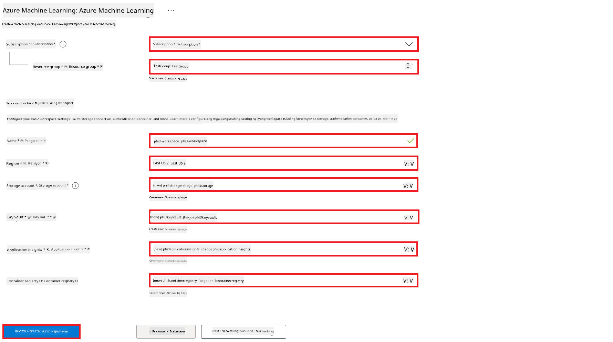

5. Piliin ang **Review + Create**.

6. Piliin ang **Create**.

### Humiling ng GPU quotas sa Azure Subscription

Sa tutorial na ito, matututuhan mo kung paano i-fine-tune at i-deploy ang Phi-3 model gamit ang mga GPU. Para sa fine-tuning, gagamitin mo ang *Standard_NC24ads_A100_v4* GPU, na nangangailangan ng quota request. Para sa deployment, gagamitin mo ang *Standard_NC6s_v3* GPU, na nangangailangan din ng quota request.

> [!NOTE]
>
> Ang Pay-As-You-Go subscriptions lamang (ang karaniwang uri ng subscription) ang kwalipikado para sa GPU allocation; hindi pa sinusuportahan ang benefit subscriptions.
>

1. Bisitahin ang [Azure ML Studio](https://ml.azure.com/home?wt.mc_id=studentamb_279723).

1. Gawin ang mga sumusunod upang humiling ng *Standard NCADSA100v4 Family* quota:

    - Piliin ang **Quota** mula sa kaliwang tab.
    - Piliin ang **Virtual machine family** na gagamitin. Halimbawa, piliin ang **Standard NCADSA100v4 Family Cluster Dedicated vCPUs**, na kasama ang *Standard_NC24ads_A100_v4* GPU.
    - Piliin ang **Request quota** mula sa navigation menu.

        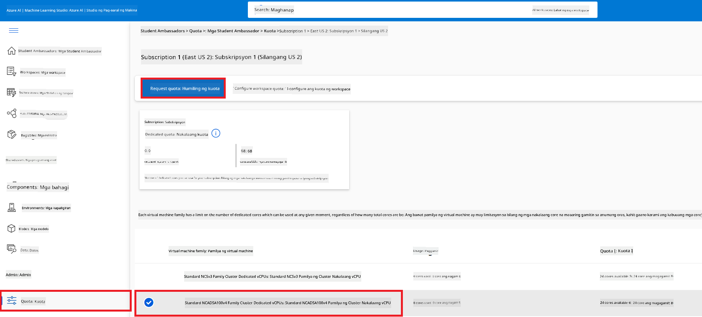

    - Sa loob ng Request quota page, ilagay ang **New cores limit** na nais mong gamitin. Halimbawa, 24.
    - Sa loob ng Request quota page, piliin ang **Submit** para isumite ang GPU quota request.

1. Gawin ang mga sumusunod upang humiling ng *Standard NCSv3 Family* quota:

    - Piliin ang **Quota** mula sa kaliwang tab.
    - Piliin ang **Virtual machine family** na gagamitin. Halimbawa, piliin ang **Standard NCSv3 Family Cluster Dedicated vCPUs**, na kasama ang *Standard_NC6s_v3* GPU.
    - Piliin ang **Request quota** mula sa navigation menu.
    - Sa loob ng Request quota page, ilagay ang **New cores limit** na nais mong gamitin. Halimbawa, 24.
    - Sa loob ng Request quota page, piliin ang **Submit** para isumite ang GPU quota request.

### Magdagdag ng role assignment

Para ma-fine-tune at ma-deploy ang iyong mga modelo, kailangan mo munang gumawa ng User Assigned Managed Identity (UAI) at bigyan ito ng tamang mga permiso. Gagamitin ang UAI na ito para sa authentication habang nagde-deploy.

#### Gumawa ng User Assigned Managed Identity (UAI)

1. I-type ang *managed identities* sa **search bar** sa itaas ng portal page at piliin ang **Managed Identities** mula sa mga lumabas na opsyon.

    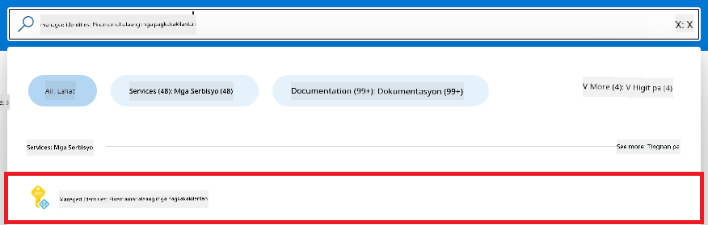

1. Piliin ang **+ Create**.

    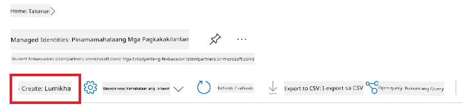

1. Gawin ang mga sumusunod:

    - Piliin ang iyong Azure **Subscription**.
    - Piliin ang **Resource group** na gagamitin (gumawa ng bago kung kinakailangan).
    - Piliin ang **Region** na nais mong gamitin.
    - Ilagay ang **Name**. Dapat ito ay natatanging pangalan.

    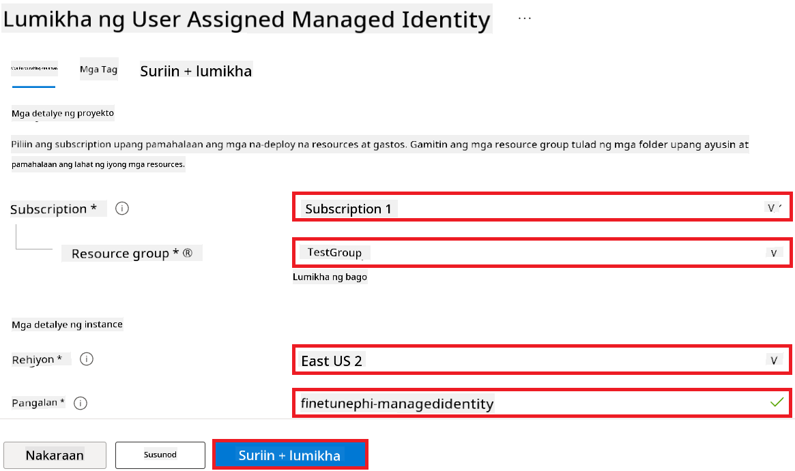

1. Piliin ang **Review + create**.

1. Piliin ang **+ Create**.

#### Magdagdag ng Contributor role assignment sa Managed Identity

1. Pumunta sa Managed Identity resource na ginawa mo.

1. Piliin ang **Azure role assignments** mula sa kaliwang tab.

1. Piliin ang **+Add role assignment** mula sa navigation menu.

1. Sa loob ng Add role assignment page, gawin ang mga sumusunod:
    - Piliin ang **Scope** bilang **Resource group**.
    - Piliin ang iyong Azure **Subscription**.
    - Piliin ang **Resource group** na gagamitin.
    - Piliin ang **Role** bilang **Contributor**.

    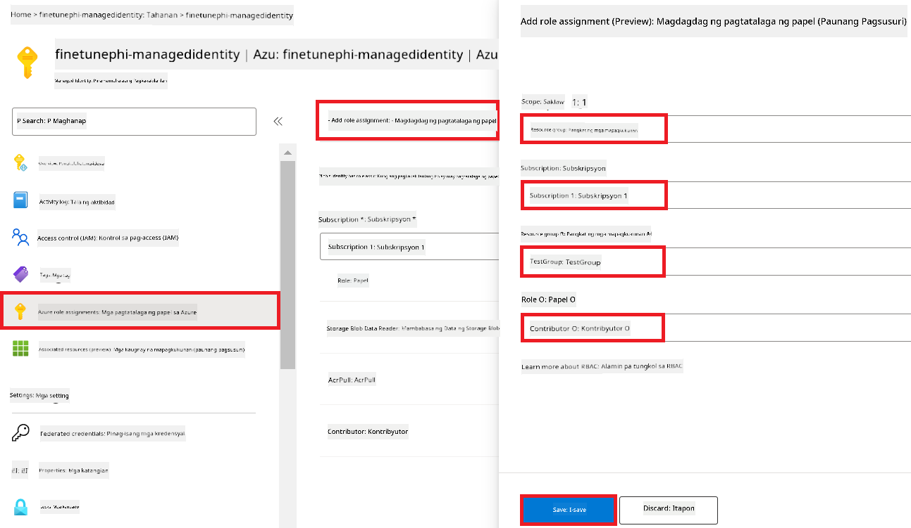

2. Piliin ang **Save**.

#### Magdagdag ng Storage Blob Data Reader role assignment sa Managed Identity

1. I-type ang *storage accounts* sa **search bar** sa itaas ng portal page at piliin ang **Storage accounts** mula sa mga lumabas na opsyon.

    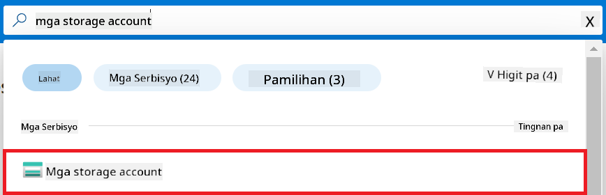

1. Piliin ang storage account na kaugnay ng Azure Machine Learning workspace na ginawa mo. Halimbawa, *finetunephistorage*.

1. Gawin ang mga sumusunod para pumunta sa Add role assignment page:

    - Pumunta sa Azure Storage account na ginawa mo.
    - Piliin ang **Access Control (IAM)** mula sa kaliwang tab.
    - Piliin ang **+ Add** mula sa navigation menu.
    - Piliin ang **Add role assignment** mula sa navigation menu.

    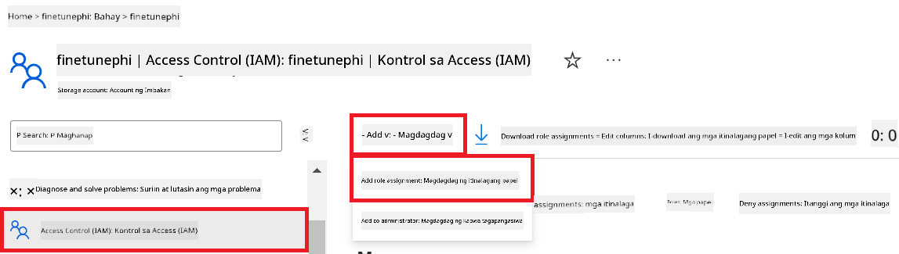

1. Sa loob ng Add role assignment page, gawin ang mga sumusunod:

    - Sa Role page, i-type ang *Storage Blob Data Reader* sa **search bar** at piliin ang **Storage Blob Data Reader** mula sa mga lumabas na opsyon.
    - Sa Role page, piliin ang **Next**.
    - Sa Members page, piliin ang **Assign access to** bilang **Managed identity**.
    - Sa Members page, piliin ang **+ Select members**.
    - Sa Select managed identities page, piliin ang iyong Azure **Subscription**.
    - Sa Select managed identities page, piliin ang **Managed identity** bilang **Manage Identity**.
    - Sa Select managed identities page, piliin ang Manage Identity na ginawa mo. Halimbawa, *finetunephi-managedidentity*.
    - Sa Select managed identities page, piliin ang **Select**.

    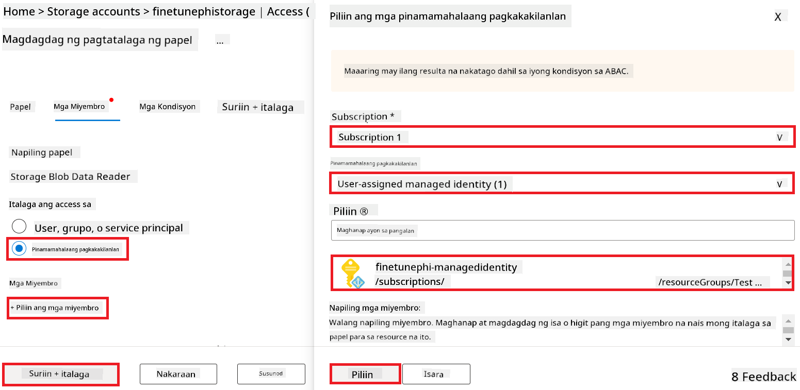

1. Piliin ang **Review + assign**.

#### Magdagdag ng AcrPull role assignment sa Managed Identity

1. I-type ang *container registries* sa **search bar** sa itaas ng portal page at piliin ang **Container registries** mula sa mga lumabas na opsyon.

    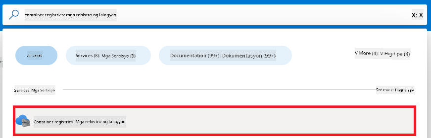

1. Piliin ang container registry na kaugnay ng Azure Machine Learning workspace. Halimbawa, *finetunephicontainerregistry*

1. Gawin ang mga sumusunod para pumunta sa Add role assignment page:

    - Piliin ang **Access Control (IAM)** mula sa kaliwang tab.
    - Piliin ang **+ Add** mula sa navigation menu.
    - Piliin ang **Add role assignment** mula sa navigation menu.

1. Sa loob ng Add role assignment page, gawin ang mga sumusunod:

    - Sa Role page, i-type ang *AcrPull* sa **search bar** at piliin ang **AcrPull** mula sa mga lumabas na opsyon.
    - Sa Role page, piliin ang **Next**.
    - Sa Members page, piliin ang **Assign access to** bilang **Managed identity**.
    - Sa Members page, piliin ang **+ Select members**.
    - Sa Select managed identities page, piliin ang iyong Azure **Subscription**.
    - Sa Select managed identities page, piliin ang **Managed identity** bilang **Manage Identity**.
    - Sa Select managed identities page, piliin ang Manage Identity na ginawa mo. Halimbawa, *finetunephi-managedidentity*.
    - Sa Select managed identities page, piliin ang **Select**.
    - Piliin ang **Review + assign**.

### I-set up ang proyekto

Para ma-download ang mga dataset na kailangan para sa fine-tuning, magse-set up ka ng lokal na environment.

Sa pagsasanay na ito, gagawin mo ang mga sumusunod:

- Gumawa ng folder na pagtatrabahuhan.
- Gumawa ng virtual environment.
- I-install ang mga kinakailangang packages.
- Gumawa ng *download_dataset.py* na file para i-download ang dataset.

#### Gumawa ng folder na pagtatrabahuhan

1. Buksan ang terminal window at i-type ang sumusunod na utos para gumawa ng folder na pinangalanang *finetune-phi* sa default na path.

    ```console
    mkdir finetune-phi
    ```

2. I-type ang sumusunod na utos sa terminal para pumunta sa *finetune-phi* na folder na ginawa mo.
#### Gumawa ng virtual environment

1. I-type ang sumusunod na utos sa loob ng iyong terminal upang gumawa ng virtual environment na pinangalanang *.venv*.

2. I-type ang sumusunod na utos sa loob ng iyong terminal upang i-activate ang virtual environment.

> [!NOTE]
> Kung nagtagumpay, makikita mo ang *(.venv)* bago ang command prompt.

#### I-install ang mga kinakailangang package

1. I-type ang mga sumusunod na utos sa loob ng iyong terminal upang i-install ang mga kinakailangang package.

#### Gumawa ng `download_dataset.py`

> [!NOTE]
> Kumpletong istruktura ng folder:
>
> 1. Buksan ang **Visual Studio Code**.

1. Piliin ang **File** mula sa menu bar.

1. Piliin ang **Open Folder**.

1. Piliin ang folder na *finetune-phi* na iyong ginawa, na matatagpuan sa *C:\Users\yourUserName\finetune-phi*.

    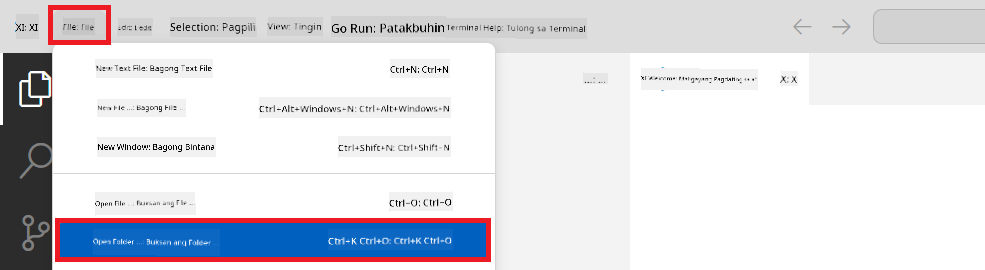

1. Sa kaliwang bahagi ng Visual Studio Code, i-right click at piliin ang **New File** upang gumawa ng bagong file na pinangalanang *download_dataset.py*.

    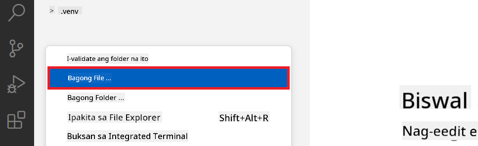

### Ihanda ang dataset para sa fine-tuning

Sa pagsasanay na ito, patatakbuhin mo ang *download_dataset.py* na file upang i-download ang *ultrachat_200k* na mga dataset sa iyong lokal na kapaligiran. Gagamitin mo ang mga dataset na ito upang i-fine-tune ang Phi-3 model sa Azure Machine Learning.

Sa pagsasanay na ito, gagawin mo ang mga sumusunod:

- Magdagdag ng code sa *download_dataset.py* na file upang i-download ang mga dataset.
- Patakbuhin ang *download_dataset.py* na file upang i-download ang mga dataset sa iyong lokal na kapaligiran.

#### I-download ang iyong dataset gamit ang *download_dataset.py*

1. Buksan ang *download_dataset.py* na file sa Visual Studio Code.

1. Idagdag ang sumusunod na code sa loob ng *download_dataset.py* na file.

1. I-type ang sumusunod na utos sa loob ng iyong terminal upang patakbuhin ang script at i-download ang dataset sa iyong lokal na kapaligiran.

1. Tiyaking matagumpay na na-save ang mga dataset sa iyong lokal na *finetune-phi/data* na direktoryo.

> [!NOTE]
>
> #### Paalala tungkol sa laki ng dataset at oras ng fine-tuning
>
> Sa tutorial na ito, gagamitin mo lamang ang 1% ng dataset (`split='train[:1%]'`). Malaki ang naitutulong nito sa pagpapabawas ng dami ng data, kaya mas mabilis ang proseso ng pag-upload at fine-tuning. Maaari mong baguhin ang porsyento upang mahanap ang tamang balanse sa pagitan ng oras ng pagsasanay at performance ng modelo. Ang paggamit ng mas maliit na bahagi ng dataset ay nagpapabilis ng fine-tuning, kaya mas madali itong gawin sa isang tutorial.

## Scenario 2: Fine-tune ang Phi-3 model at I-deploy sa Azure Machine Learning Studio

### Fine-tune ang Phi-3 model

Sa pagsasanay na ito, i-fine-tune mo ang Phi-3 model sa Azure Machine Learning Studio.

Sa pagsasanay na ito, gagawin mo ang mga sumusunod:

- Gumawa ng computer cluster para sa fine-tuning.
- I-fine-tune ang Phi-3 model sa Azure Machine Learning Studio.

#### Gumawa ng computer cluster para sa fine-tuning

1. Bisitahin ang [Azure ML Studio](https://ml.azure.com/home?wt.mc_id=studentamb_279723).

1. Piliin ang **Compute** mula sa kaliwang tab.

1. Piliin ang **Compute clusters** mula sa navigation menu.

1. Piliin ang **+ New**.

    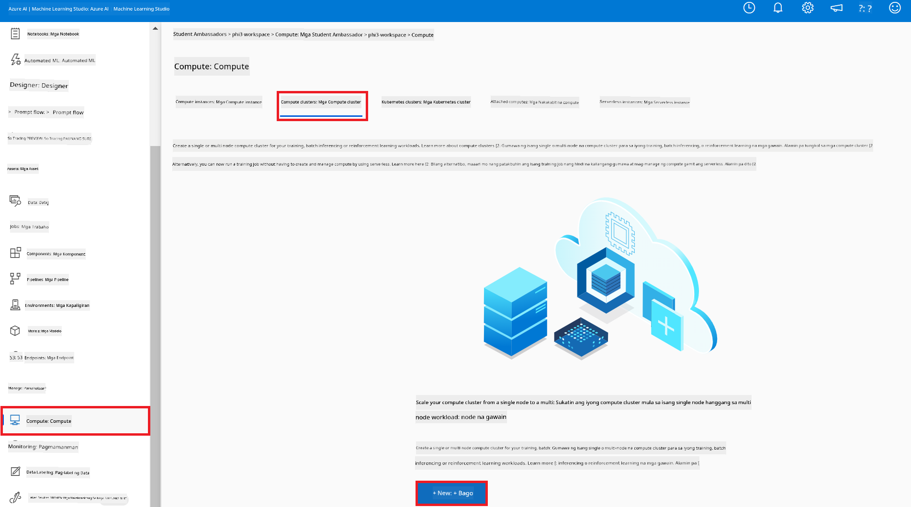

1. Gawin ang mga sumusunod:

    - Piliin ang **Region** na nais mong gamitin.
    - Piliin ang **Virtual machine tier** sa **Dedicated**.
    - Piliin ang **Virtual machine type** sa **GPU**.
    - Piliin ang filter ng **Virtual machine size** sa **Select from all options**.
    - Piliin ang **Virtual machine size** sa **Standard_NC24ads_A100_v4**.

    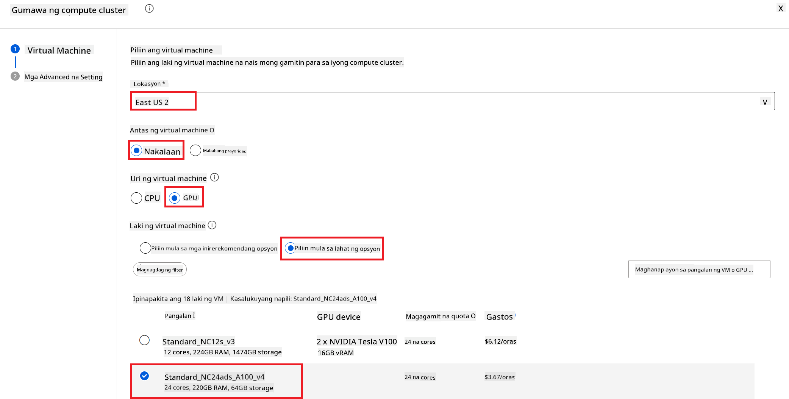

1. Piliin ang **Next**.

1. Gawin ang mga sumusunod:

    - Ilagay ang **Compute name**. Dapat ito ay natatangi.
    - Piliin ang **Minimum number of nodes** sa **0**.
    - Piliin ang **Maximum number of nodes** sa **1**.
    - Piliin ang **Idle seconds before scale down** sa **120**.

    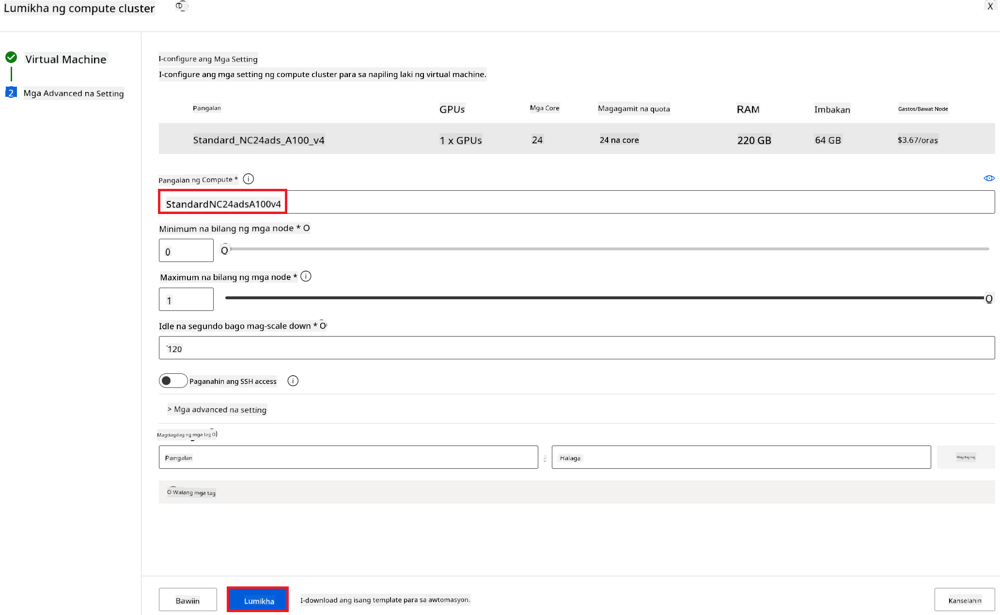

1. Piliin ang **Create**.

#### Fine-tune ang Phi-3 model

1. Bisitahin ang [Azure ML Studio](https://ml.azure.com/home?wt.mc_id=studentamb_279723).

1. Piliin ang Azure Machine Learning workspace na iyong ginawa.

    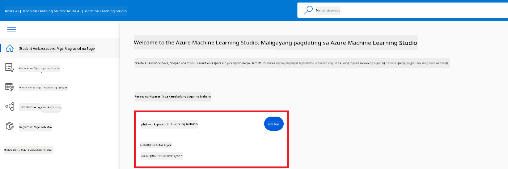

1. Gawin ang mga sumusunod:

    - Piliin ang **Model catalog** mula sa kaliwang tab.
    - I-type ang *phi-3-mini-4k* sa **search bar** at piliin ang **Phi-3-mini-4k-instruct** mula sa mga lumabas na opsyon.

    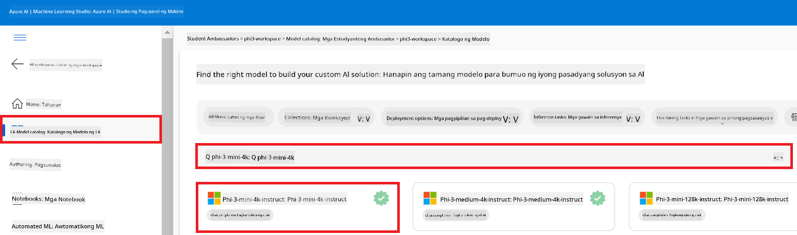

1. Piliin ang **Fine-tune** mula sa navigation menu.

    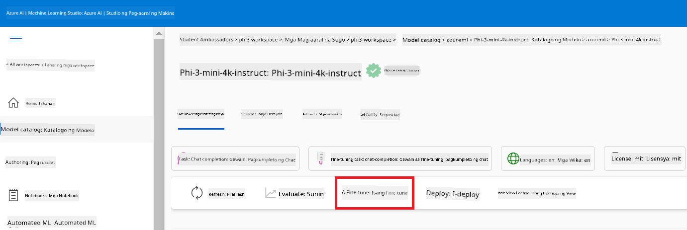

1. Gawin ang mga sumusunod:

    - Piliin ang **Select task type** sa **Chat completion**.
    - Piliin ang **+ Select data** upang i-upload ang **Training data**.
    - Piliin ang uri ng pag-upload ng Validation data sa **Provide different validation data**.
    - Piliin ang **+ Select data** upang i-upload ang **Validation data**.

    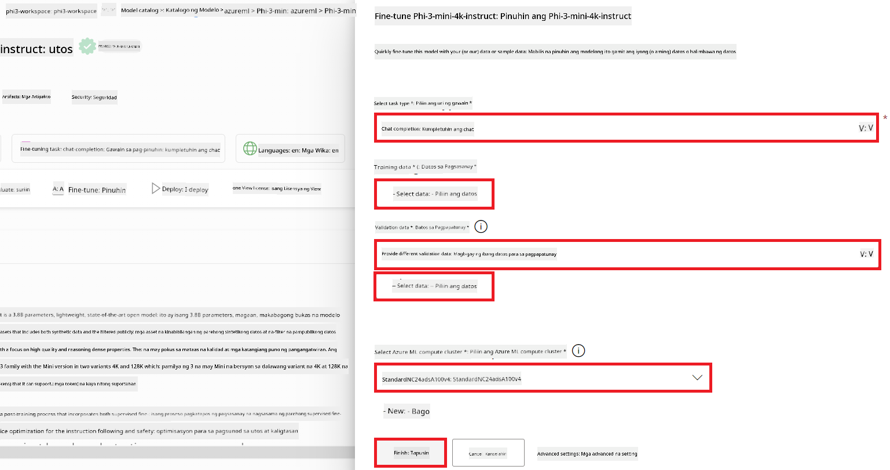

    > [!TIP]
    >
    > Maaari mong piliin ang **Advanced settings** upang i-customize ang mga configuration tulad ng **learning_rate** at **lr_scheduler_type** para ma-optimize ang fine-tuning ayon sa iyong pangangailangan.

1. Piliin ang **Finish**.

1. Sa pagsasanay na ito, matagumpay mong na-fine-tune ang Phi-3 model gamit ang Azure Machine Learning. Tandaan na ang proseso ng fine-tuning ay maaaring tumagal ng ilang oras. Pagkatapos patakbuhin ang fine-tuning job, kailangan mong maghintay hanggang matapos ito. Maaari mong subaybayan ang status ng fine-tuning job sa pamamagitan ng pagpunta sa Jobs tab sa kaliwang bahagi ng iyong Azure Machine Learning Workspace. Sa susunod na bahagi, ide-deploy mo ang fine-tuned na modelo at i-integrate ito sa Prompt flow.

    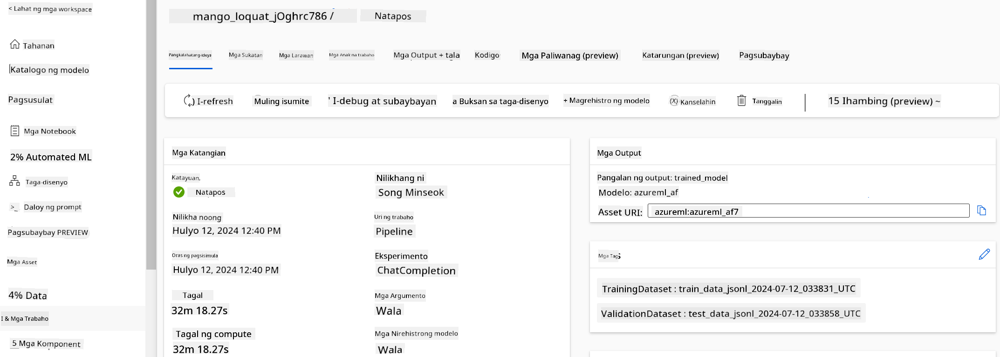

### I-deploy ang fine-tuned na Phi-3 model

Para ma-integrate ang fine-tuned na Phi-3 model sa Prompt flow, kailangan mong i-deploy ang modelo upang maging accessible ito para sa real-time inference. Kasama sa prosesong ito ang pagrerehistro ng modelo, paggawa ng online endpoint, at pag-deploy ng modelo.

Sa pagsasanay na ito, gagawin mo ang mga sumusunod:

- Irehistro ang fine-tuned na modelo sa Azure Machine Learning workspace.
- Gumawa ng online endpoint.
- I-deploy ang nairehistrong fine-tuned na Phi-3 model.

#### Irehistro ang fine-tuned na modelo

1. Bisitahin ang [Azure ML Studio](https://ml.azure.com/home?wt.mc_id=studentamb_279723).

1. Piliin ang Azure Machine Learning workspace na iyong ginawa.

    

1. Piliin ang **Models** mula sa kaliwang tab.

1. Piliin ang **+ Register**.

1. Piliin ang **From a job output**.

    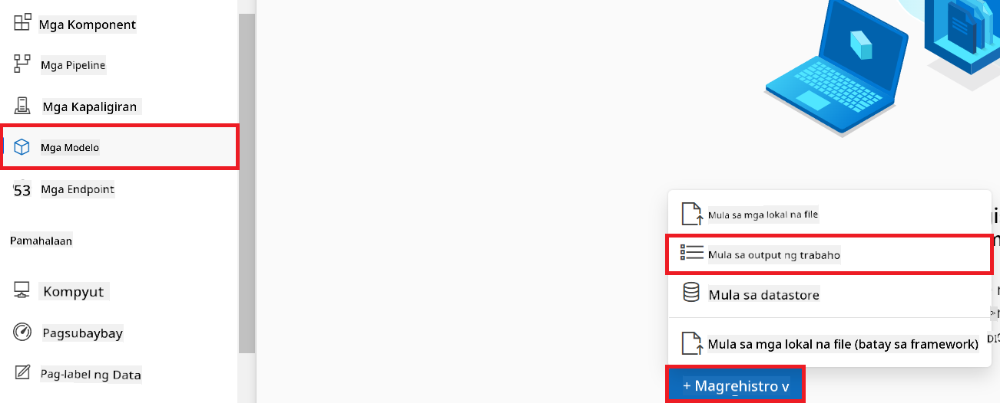

1. Piliin ang job na iyong ginawa.

    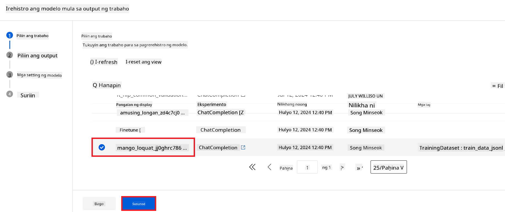

1. Piliin ang **Next**.

1. Piliin ang **Model type** sa **MLflow**.

1. Siguraduhing naka-select ang **Job output**; ito ay awtomatikong naka-select.

    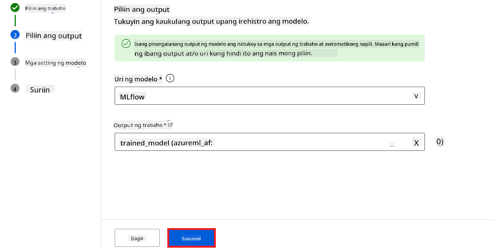

2. Piliin ang **Next**.

3. Piliin ang **Register**.

    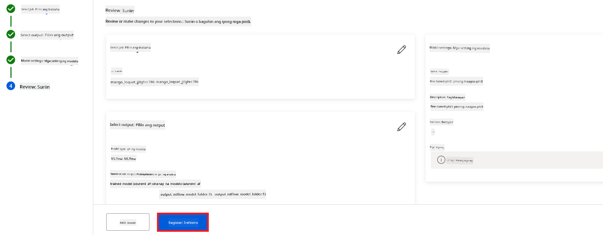

4. Makikita mo ang iyong nairehistrong modelo sa pamamagitan ng pagpunta sa **Models** na menu mula sa kaliwang tab.

    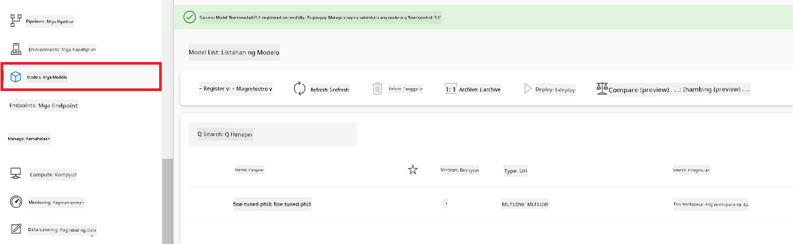

#### I-deploy ang fine-tuned na modelo

1. Pumunta sa Azure Machine Learning workspace na iyong ginawa.

1. Piliin ang **Endpoints** mula sa kaliwang tab.

1. Piliin ang **Real-time endpoints** mula sa navigation menu.

    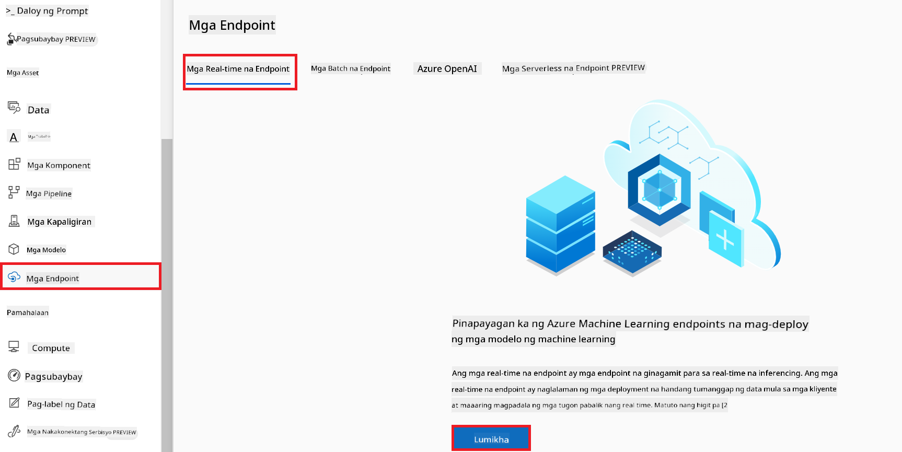

1. Piliin ang **Create**.

1. Piliin ang nairehistrong modelo na iyong ginawa.

    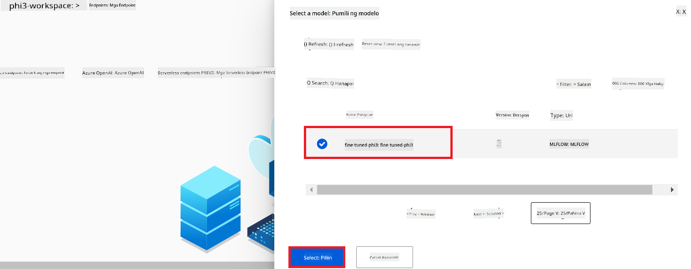

1. Piliin ang **Select**.

1. Gawin ang mga sumusunod:

    - Piliin ang **Virtual machine** sa *Standard_NC6s_v3*.
    - Piliin ang bilang ng **Instance count** na nais mong gamitin. Halimbawa, *1*.
    - Piliin ang **Endpoint** sa **New** upang gumawa ng bagong endpoint.
    - Ilagay ang **Endpoint name**. Dapat ito ay natatangi.
    - Ilagay ang **Deployment name**. Dapat ito ay natatangi.

    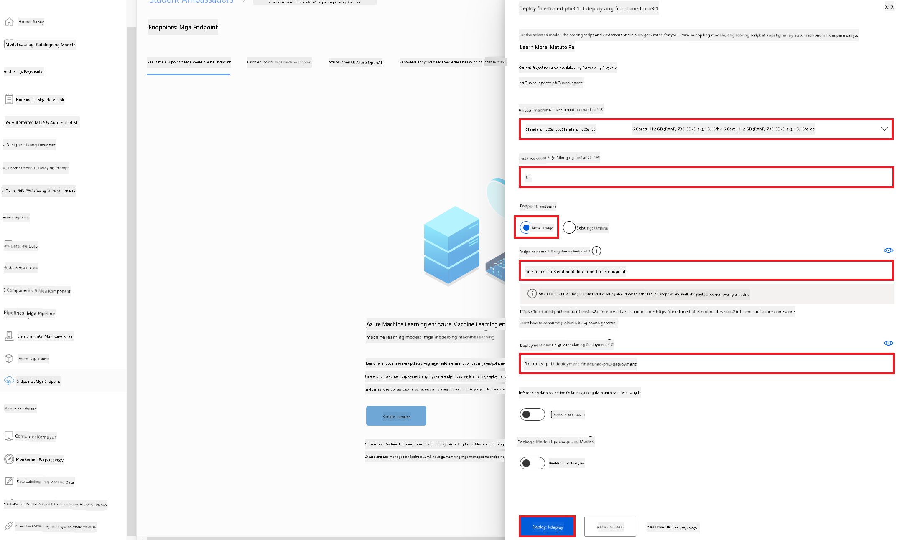

1. Piliin ang **Deploy**.

> [!WARNING]
> Upang maiwasan ang karagdagang singil sa iyong account, siguraduhing tanggalin ang nagawang endpoint sa Azure Machine Learning workspace.
>

#### Suriin ang status ng deployment sa Azure Machine Learning Workspace

1. Pumunta sa Azure Machine Learning workspace na iyong ginawa.

1. Piliin ang **Endpoints** mula sa kaliwang tab.

1. Piliin ang endpoint na iyong ginawa.

    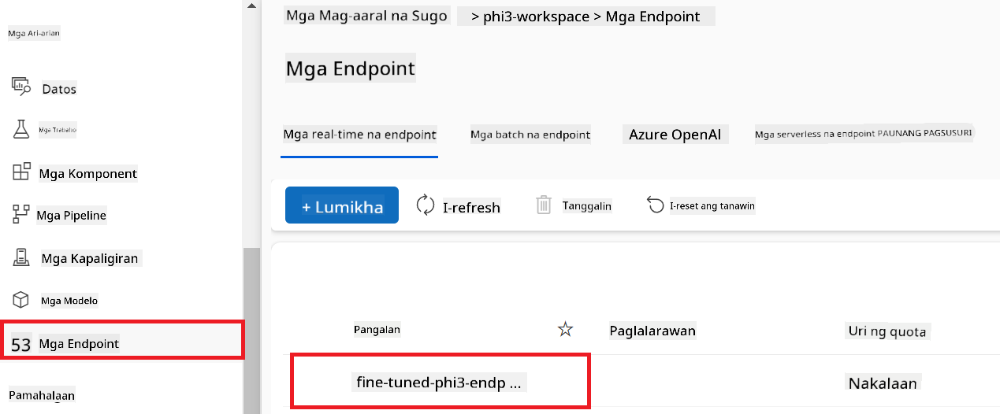

1. Sa pahinang ito, maaari mong pamahalaan ang mga endpoint habang nagpapatuloy ang deployment.

> [!NOTE]
> Kapag natapos na ang deployment, siguraduhing naka-set ang **Live traffic** sa **100%**. Kung hindi, piliin ang **Update traffic** upang ayusin ang traffic settings. Tandaan na hindi mo maaaring subukan ang modelo kung ang traffic ay naka-set sa 0%.
>
> 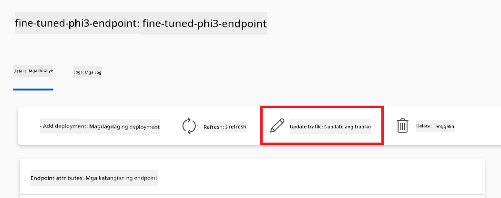
>

## Scenario 3: I-integrate sa Prompt flow at Makipag-chat gamit ang iyong custom na modelo sa Azure AI Foundry

### I-integrate ang custom na Phi-3 model sa Prompt flow

Matapos mong matagumpay na ma-deploy ang iyong fine-tuned na modelo, maaari mo na itong i-integrate sa Prompt Flow upang magamit ang iyong modelo sa mga real-time na aplikasyon, na nagbibigay-daan sa iba't ibang interactive na gawain gamit ang iyong custom na Phi-3 model.

Sa pagsasanay na ito, gagawin mo ang mga sumusunod:

- Gumawa ng Azure AI Foundry Hub.
- Gumawa ng Azure AI Foundry Project.
- Gumawa ng Prompt flow.
- Magdagdag ng custom na koneksyon para sa fine-tuned na Phi-3 model.
- I-set up ang Prompt flow upang makipag-chat gamit ang iyong custom na Phi-3 model.
> [!NOTE]
> Maaari ka ring mag-integrate gamit ang Promptflow sa Azure ML Studio. Pareho ang proseso ng integration na maaaring gamitin sa Azure ML Studio.
#### Gumawa ng Azure AI Foundry Hub

Kailangan mong gumawa ng Hub bago gumawa ng Project. Ang Hub ay parang Resource Group, na nagbibigay-daan sa iyo upang ayusin at pamahalaan ang maraming Projects sa loob ng Azure AI Foundry.

1. Bisitahin ang [Azure AI Foundry](https://ai.azure.com/?WT.mc_id=aiml-137032-kinfeylo).

1. Piliin ang **All hubs** mula sa kaliwang tab.

1. Piliin ang **+ New hub** mula sa navigation menu.

    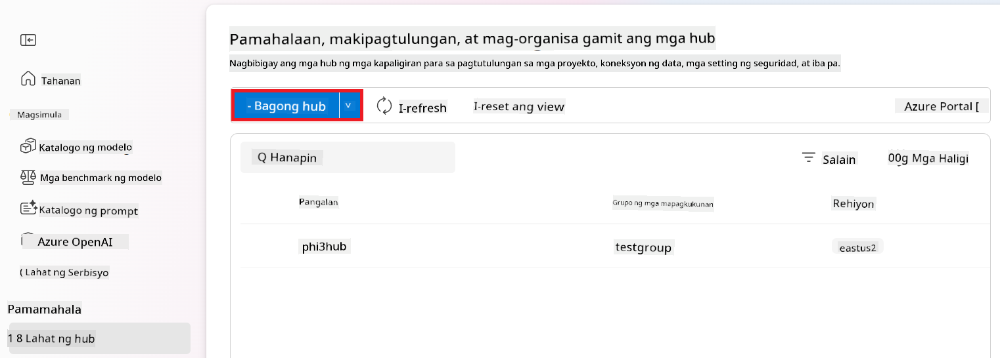

1. Gawin ang mga sumusunod na hakbang:

    - Ilagay ang **Hub name**. Dapat ito ay natatanging pangalan.
    - Piliin ang iyong Azure **Subscription**.
    - Piliin ang **Resource group** na gagamitin (gumawa ng bago kung kinakailangan).
    - Piliin ang **Location** na nais mong gamitin.
    - Piliin ang **Connect Azure AI Services** na gagamitin (gumawa ng bago kung kinakailangan).
    - Piliin ang **Connect Azure AI Search** sa **Skip connecting**.

    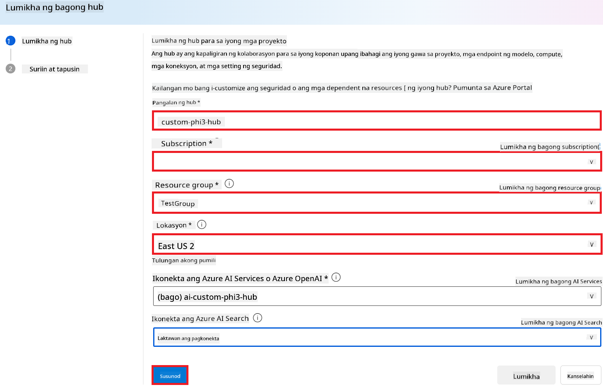

1. Piliin ang **Next**.

#### Gumawa ng Azure AI Foundry Project

1. Sa Hub na ginawa mo, piliin ang **All projects** mula sa kaliwang tab.

1. Piliin ang **+ New project** mula sa navigation menu.

    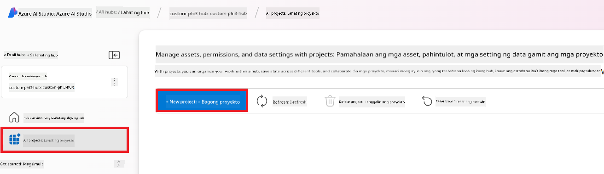

1. Ilagay ang **Project name**. Dapat ito ay natatanging pangalan.

    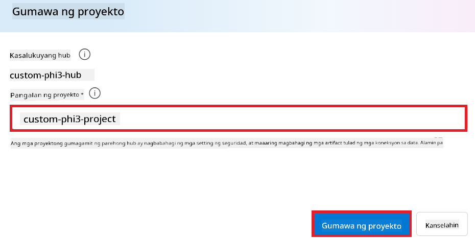

1. Piliin ang **Create a project**.

#### Magdagdag ng custom connection para sa fine-tuned na Phi-3 model

Para ma-integrate ang iyong custom Phi-3 model sa Prompt flow, kailangan mong i-save ang endpoint at key ng model sa isang custom connection. Tinitiyak ng setup na ito ang access sa iyong custom Phi-3 model sa Prompt flow.

#### Itakda ang api key at endpoint uri ng fine-tuned na Phi-3 model

1. Bisitahin ang [Azure ML Studio](https://ml.azure.com/home?WT.mc_id=aiml-137032-kinfeylo).

1. Pumunta sa Azure Machine learning workspace na ginawa mo.

1. Piliin ang **Endpoints** mula sa kaliwang tab.

    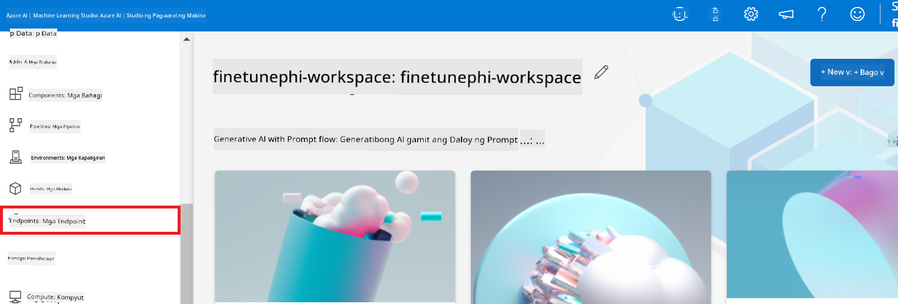

1. Piliin ang endpoint na ginawa mo.

    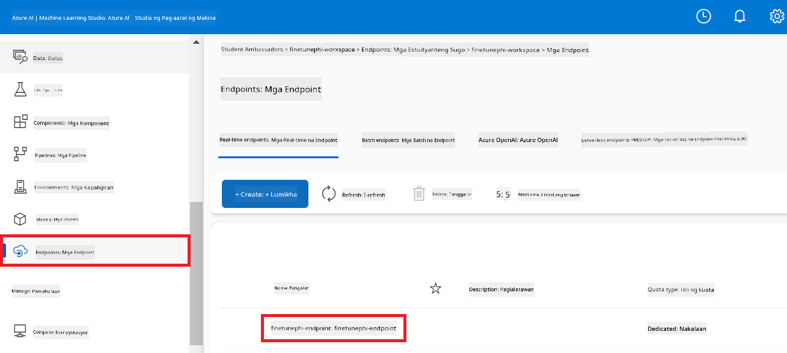

1. Piliin ang **Consume** mula sa navigation menu.

1. Kopyahin ang iyong **REST endpoint** at **Primary key**.

    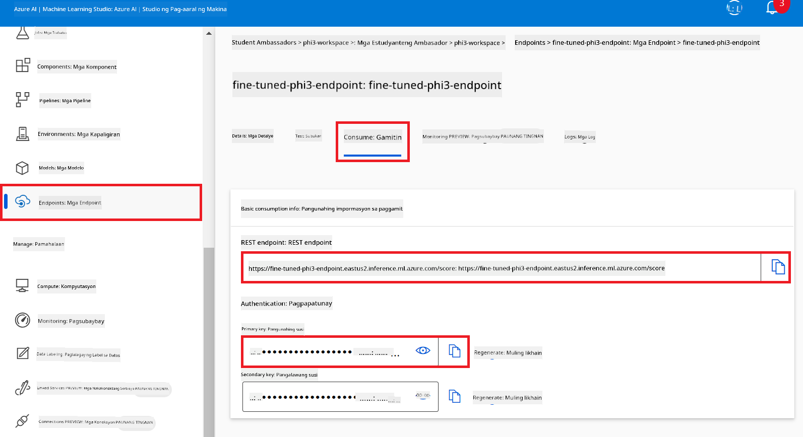

#### Magdagdag ng Custom Connection

1. Bisitahin ang [Azure AI Foundry](https://ai.azure.com/?WT.mc_id=aiml-137032-kinfeylo).

1. Pumunta sa Azure AI Foundry project na ginawa mo.

1. Sa Project na ginawa mo, piliin ang **Settings** mula sa kaliwang tab.

1. Piliin ang **+ New connection**.

    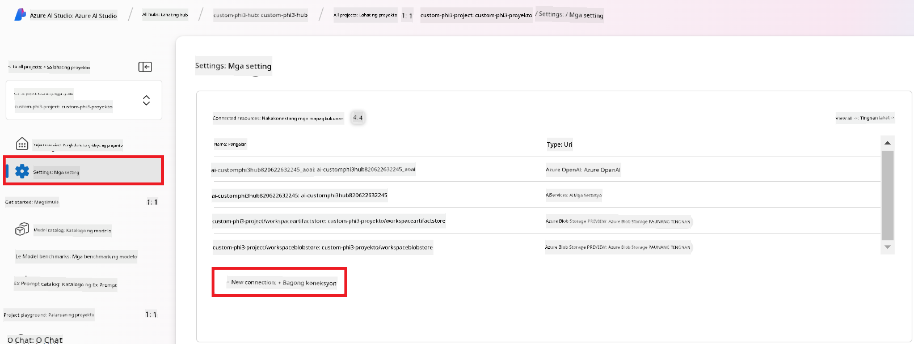

1. Piliin ang **Custom keys** mula sa navigation menu.

    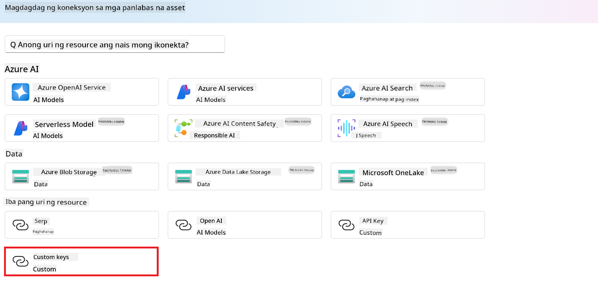

1. Gawin ang mga sumusunod:

    - Piliin ang **+ Add key value pairs**.
    - Para sa pangalan ng key, ilagay ang **endpoint** at i-paste ang endpoint na kinopya mo mula sa Azure ML Studio sa value field.
    - Piliin muli ang **+ Add key value pairs**.
    - Para sa pangalan ng key, ilagay ang **key** at i-paste ang key na kinopya mo mula sa Azure ML Studio sa value field.
    - Pagkatapos maidagdag ang mga keys, piliin ang **is secret** upang hindi makita ang key.

    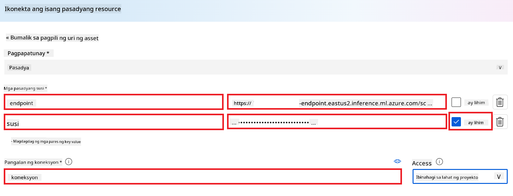

1. Piliin ang **Add connection**.

#### Gumawa ng Prompt flow

Nagdagdag ka na ng custom connection sa Azure AI Foundry. Ngayon, gumawa tayo ng Prompt flow gamit ang mga sumusunod na hakbang. Pagkatapos, ikokonekta mo ang Prompt flow na ito sa custom connection para magamit mo ang fine-tuned na model sa loob ng Prompt flow.

1. Pumunta sa Azure AI Foundry project na ginawa mo.

1. Piliin ang **Prompt flow** mula sa kaliwang tab.

1. Piliin ang **+ Create** mula sa navigation menu.

    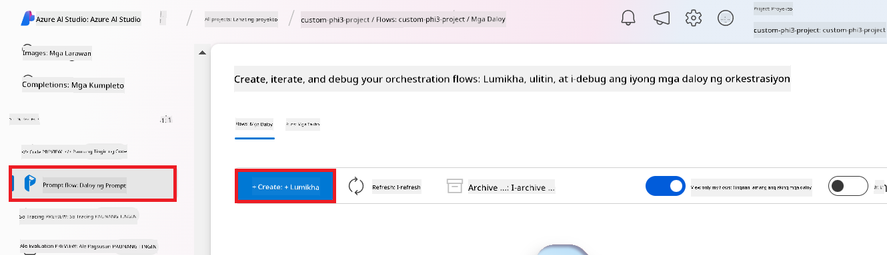

1. Piliin ang **Chat flow** mula sa navigation menu.

    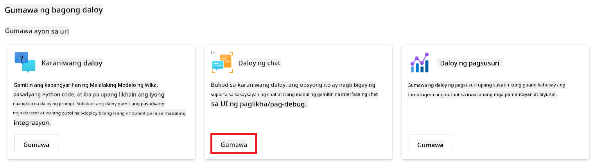

1. Ilagay ang **Folder name** na gagamitin.

    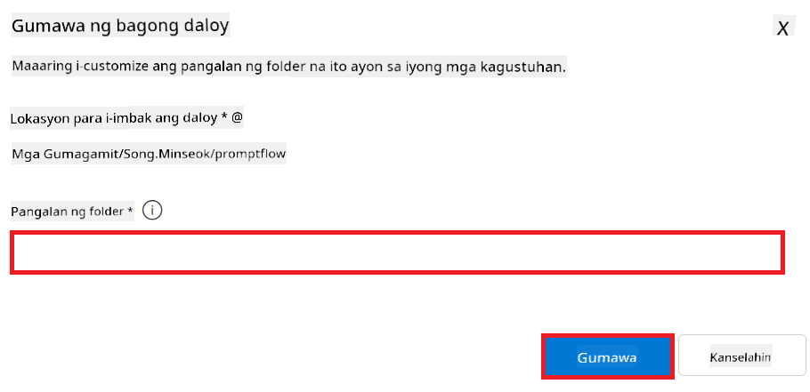

2. Piliin ang **Create**.

#### I-setup ang Prompt flow para makipag-chat sa iyong custom Phi-3 model

Kailangan mong i-integrate ang fine-tuned na Phi-3 model sa isang Prompt flow. Ngunit, ang kasalukuyang Prompt flow na ibinigay ay hindi disenyo para dito. Kaya, kailangan mong baguhin ang Prompt flow para payagan ang integration ng custom model.

1. Sa Prompt flow, gawin ang mga sumusunod upang muling buuin ang kasalukuyang flow:

    - Piliin ang **Raw file mode**.
    - Burahin lahat ng umiiral na code sa *flow.dag.yml* na file.
    - Idagdag ang sumusunod na code sa *flow.dag.yml* na file.

        ```yml
        inputs:
          input_data:
            type: string
            default: "Who founded Microsoft?"

        outputs:
          answer:
            type: string
            reference: ${integrate_with_promptflow.output}

        nodes:
        - name: integrate_with_promptflow
          type: python
          source:
            type: code
            path: integrate_with_promptflow.py
          inputs:
            input_data: ${inputs.input_data}
        ```

    - Piliin ang **Save**.

    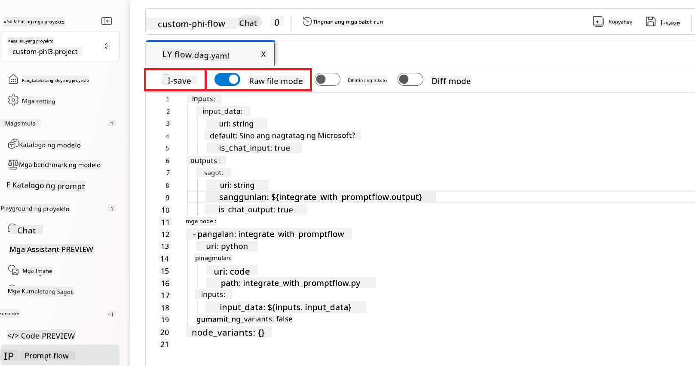

1. Idagdag ang sumusunod na code sa *integrate_with_promptflow.py* na file para magamit ang custom Phi-3 model sa Prompt flow.

    ```python
    import logging
    import requests
    from promptflow import tool
    from promptflow.connections import CustomConnection

    # Logging setup
    logging.basicConfig(
        format="%(asctime)s - %(levelname)s - %(name)s - %(message)s",
        datefmt="%Y-%m-%d %H:%M:%S",
        level=logging.DEBUG
    )
    logger = logging.getLogger(__name__)

    def query_phi3_model(input_data: str, connection: CustomConnection) -> str:
        """
        Send a request to the Phi-3 model endpoint with the given input data using Custom Connection.
        """

        # "connection" is the name of the Custom Connection, "endpoint", "key" are the keys in the Custom Connection
        endpoint_url = connection.endpoint
        api_key = connection.key

        headers = {
            "Content-Type": "application/json",
            "Authorization": f"Bearer {api_key}"
        }
        data = {
            "input_data": {
                "input_string": [
                    {"role": "user", "content": input_data}
                ],
                "parameters": {
                    "temperature": 0.7,
                    "max_new_tokens": 128
                }
            }
        }
        try:
            response = requests.post(endpoint_url, json=data, headers=headers)
            response.raise_for_status()
            
            # Log the full JSON response
            logger.debug(f"Full JSON response: {response.json()}")

            result = response.json()["output"]
            logger.info("Successfully received response from Azure ML Endpoint.")
            return result
        except requests.exceptions.RequestException as e:
            logger.error(f"Error querying Azure ML Endpoint: {e}")
            raise

    @tool
    def my_python_tool(input_data: str, connection: CustomConnection) -> str:
        """
        Tool function to process input data and query the Phi-3 model.
        """
        return query_phi3_model(input_data, connection)

    ```

    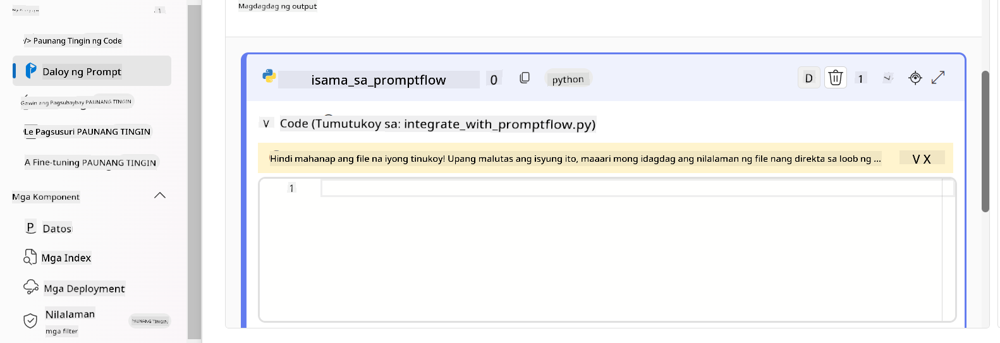

> [!NOTE]
> Para sa mas detalyadong impormasyon tungkol sa paggamit ng Prompt flow sa Azure AI Foundry, maaari mong tingnan ang [Prompt flow in Azure AI Foundry](https://learn.microsoft.com/azure/ai-studio/how-to/prompt-flow).

1. Piliin ang **Chat input**, **Chat output** para paganahin ang chat sa iyong model.

    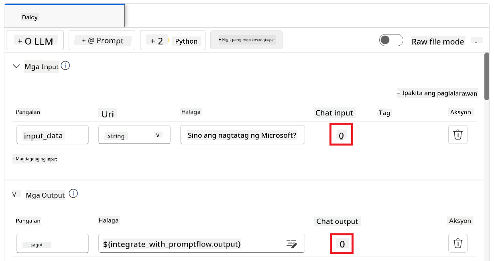

1. Handa ka na ngayong makipag-chat sa iyong custom Phi-3 model. Sa susunod na pagsasanay, matututuhan mo kung paano simulan ang Prompt flow at gamitin ito para makipag-chat sa iyong fine-tuned na Phi-3 model.

> [!NOTE]
>
> Ang muling binuong flow ay dapat magmukhang ganito:
>
> 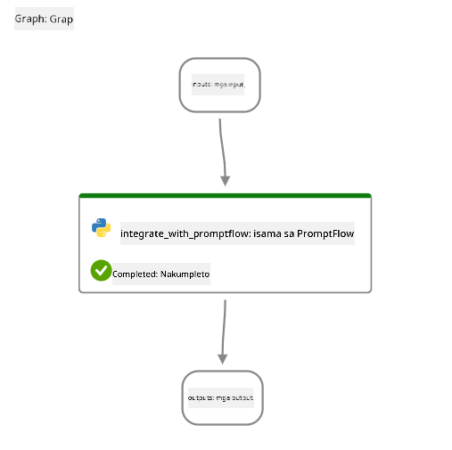
>

### Makipag-chat sa iyong custom Phi-3 model

Ngayon na na-fine-tune at na-integrate mo na ang iyong custom Phi-3 model sa Prompt flow, handa ka nang makipag-ugnayan dito. Ang pagsasanay na ito ay gagabay sa iyo sa proseso ng pag-setup at pagsisimula ng chat gamit ang iyong model sa pamamagitan ng Prompt flow. Sa pagsunod sa mga hakbang na ito, magagamit mo nang lubos ang kakayahan ng iyong fine-tuned na Phi-3 model para sa iba't ibang gawain at pag-uusap.

- Makipag-chat sa iyong custom Phi-3 model gamit ang Prompt flow.

#### Simulan ang Prompt flow

1. Piliin ang **Start compute sessions** para simulan ang Prompt flow.

    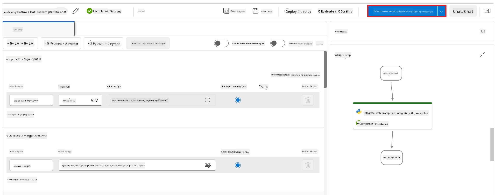

1. Piliin ang **Validate and parse input** para i-renew ang mga parameters.

    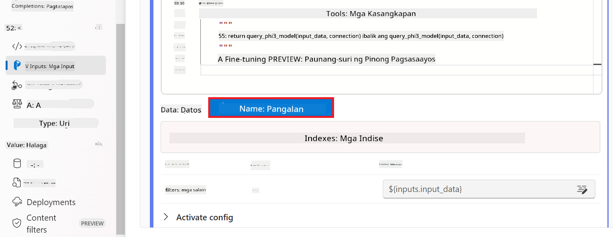

1. Piliin ang **Value** ng **connection** sa custom connection na ginawa mo. Halimbawa, *connection*.

    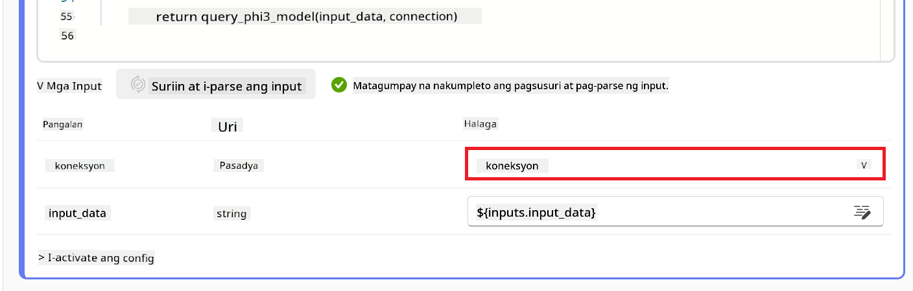

#### Makipag-chat sa iyong custom model

1. Piliin ang **Chat**.

    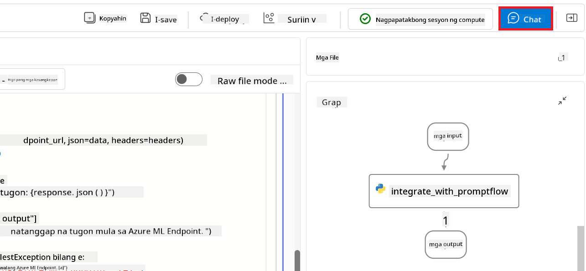

1. Narito ang halimbawa ng resulta: Ngayon ay maaari ka nang makipag-chat sa iyong custom Phi-3 model. Inirerekomenda na magtanong base sa data na ginamit sa fine-tuning.

    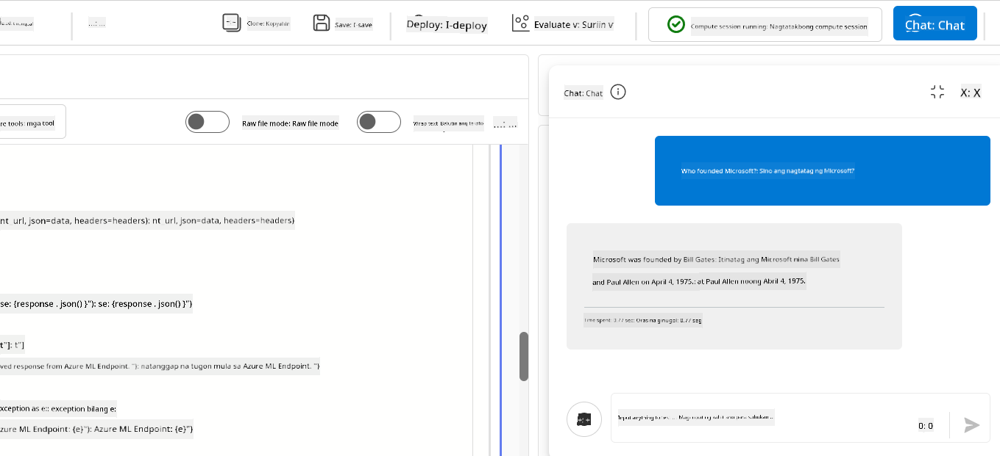

**Paalala**:  
Ang dokumentong ito ay isinalin gamit ang AI translation service na [Co-op Translator](https://github.com/Azure/co-op-translator). Bagamat nagsusumikap kami para sa katumpakan, pakatandaan na ang mga awtomatikong pagsasalin ay maaaring maglaman ng mga pagkakamali o di-tumpak na impormasyon. Ang orihinal na dokumento sa kanyang sariling wika ang dapat ituring na pangunahing sanggunian. Para sa mahahalagang impormasyon, inirerekomenda ang propesyonal na pagsasalin ng tao. Hindi kami mananagot sa anumang hindi pagkakaunawaan o maling interpretasyon na maaaring magmula sa paggamit ng pagsasaling ito.