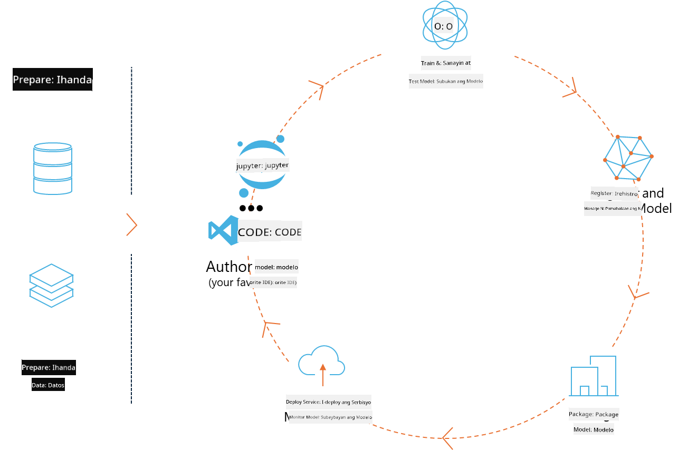
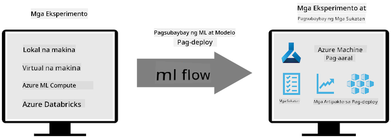
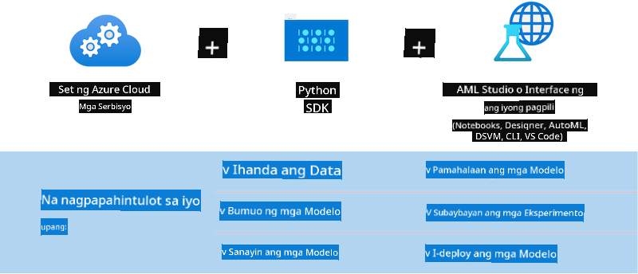

<!--
CO_OP_TRANSLATOR_METADATA:
{
  "original_hash": "f61c383bbf0c3dac97e43f833c258731",
  "translation_date": "2025-05-09T18:39:35+00:00",
  "source_file": "md/02.Application/01.TextAndChat/Phi3/E2E_Phi-3-MLflow.md",
  "language_code": "tl"
}
-->
# MLflow

[MLflow](https://mlflow.org/) ay isang open-source na platform na dinisenyo para pamahalaan ang buong siklo ng machine learning.



Ginagamit ang MLFlow para pamahalaan ang ML lifecycle, kabilang ang experimentation, reproducibility, deployment, at isang central model registry. Sa kasalukuyan, may apat na pangunahing bahagi ang ML flow.

- **MLflow Tracking:** Mag-record at mag-query ng mga eksperimento, code, data config, at resulta.
- **MLflow Projects:** I-package ang data science code sa format na kayang i-reproduce ang mga run sa kahit anong platform.
- **Mlflow Models:** I-deploy ang mga machine learning models sa iba't ibang serving environments.
- **Model Registry:** Mag-imbak, mag-annotate, at mag-manage ng mga modelo sa isang sentral na repositoryo.

Kasama dito ang mga kakayahan para sa pagsubaybay ng eksperimento, pag-package ng code para sa reproducible runs, at pagbabahagi at pag-deploy ng mga modelo. Nakakabit ang MLFlow sa Databricks at sumusuporta sa iba't ibang ML libraries, kaya library-agnostic ito. Maaari itong gamitin sa kahit anong machine learning library at programming language dahil may REST API at CLI ito para sa madaling paggamit.



Mga pangunahing tampok ng MLFlow:

- **Experiment Tracking:** Mag-record at magkumpara ng mga parameter at resulta.
- **Model Management:** I-deploy ang mga modelo sa iba't ibang serving at inference platforms.
- **Model Registry:** Sama-samang pamahalaan ang lifecycle ng MLflow Models, kabilang ang versioning at annotations.
- **Projects:** I-package ang ML code para sa pagbabahagi o production use.

Sinusuportahan din ng MLFlow ang MLOps loop, na kinabibilangan ng paghahanda ng data, pagrerehistro at pamamahala ng mga modelo, pag-package ng mga modelo para sa execution, pag-deploy ng mga serbisyo, at pagmamanman ng mga modelo. Layunin nitong pasimplehin ang proseso mula prototype hanggang production workflow, lalo na sa cloud at edge environments.

## E2E Scenario - Pagbuo ng wrapper at paggamit ng Phi-3 bilang MLFlow model

Sa E2E sample na ito, ipapakita namin ang dalawang magkaibang paraan ng pagbuo ng wrapper sa paligid ng Phi-3 small language model (SLM) at pagkatapos ay patakbuhin ito bilang MLFlow model, lokal man o sa cloud, halimbawa sa Azure Machine Learning workspace.



| Project | Paglalarawan | Lokasyon |
| ------------ | ----------- | -------- |
| Transformer Pipeline | Ang Transformer Pipeline ang pinakamadaling opsyon para gumawa ng wrapper kung gusto mong gamitin ang HuggingFace model gamit ang MLFlow’s experimental transformers flavour. | [**TransformerPipeline.ipynb**](../../../../../../code/06.E2E/E2E_Phi-3-MLflow_TransformerPipeline.ipynb) |
| Custom Python Wrapper | Sa oras ng pagsulat, hindi pa sinusuportahan ng transformer pipeline ang MLFlow wrapper generation para sa HuggingFace models sa ONNX format, kahit gamit ang experimental optimum Python package. Para sa ganitong kaso, maaari kang gumawa ng sarili mong custom Python wrapper para sa MLFlow mode | [**CustomPythonWrapper.ipynb**](../../../../../../code/06.E2E/E2E_Phi-3-MLflow_CustomPythonWrapper.ipynb) |

## Project: Transformer Pipeline

1. Kailangan mo ng mga kaukulang Python packages mula sa MLFlow at HuggingFace:

    ``` Python
    import mlflow
    import transformers
    ```

2. Susunod, dapat kang mag-initialize ng transformer pipeline gamit ang target Phi-3 model mula sa HuggingFace registry. Makikita sa model card ng _Phi-3-mini-4k-instruct_ na ang task nito ay “Text Generation”:

    ``` Python
    pipeline = transformers.pipeline(
        task = "text-generation",
        model = "microsoft/Phi-3-mini-4k-instruct"
    )
    ```

3. Maaari mo nang i-save ang transformer pipeline ng Phi-3 model sa MLFlow format at magbigay ng karagdagang detalye tulad ng target artifacts path, partikular na model configuration settings, at inference API type:

    ``` Python
    model_info = mlflow.transformers.log_model(
        transformers_model = pipeline,
        artifact_path = "phi3-mlflow-model",
        model_config = model_config,
        task = "llm/v1/chat"
    )
    ```

## Project: Custom Python Wrapper

1. Dito, magagamit natin ang Microsoft's [ONNX Runtime generate() API](https://github.com/microsoft/onnxruntime-genai) para sa inference ng ONNX model at encoding/decoding ng tokens. Piliin ang _onnxruntime_genai_ package para sa target compute, sa halimbawa sa ibaba ay naka-target sa CPU:

    ``` Python
    import mlflow
    from mlflow.models import infer_signature
    import onnxruntime_genai as og
    ```

1. Ang custom class natin ay may dalawang methods: _load_context()_ para i-initialize ang **ONNX model** ng Phi-3 Mini 4K Instruct, **generator parameters**, at **tokenizer**; at _predict()_ para gumawa ng output tokens base sa ibinigay na prompt:

    ``` Python
    class Phi3Model(mlflow.pyfunc.PythonModel):
        def load_context(self, context):
            # Retrieving model from the artifacts
            model_path = context.artifacts["phi3-mini-onnx"]
            model_options = {
                 "max_length": 300,
                 "temperature": 0.2,         
            }
        
            # Defining the model
            self.phi3_model = og.Model(model_path)
            self.params = og.GeneratorParams(self.phi3_model)
            self.params.set_search_options(**model_options)
            
            # Defining the tokenizer
            self.tokenizer = og.Tokenizer(self.phi3_model)
    
        def predict(self, context, model_input):
            # Retrieving prompt from the input
            prompt = model_input["prompt"][0]
            self.params.input_ids = self.tokenizer.encode(prompt)
    
            # Generating the model's response
            response = self.phi3_model.generate(self.params)
    
            return self.tokenizer.decode(response[0][len(self.params.input_ids):])
    ```

1. Maaari mo nang gamitin ang _mlflow.pyfunc.log_model()_ function para gumawa ng custom Python wrapper (pickle format) para sa Phi-3 model, kasama ang orihinal na ONNX model at mga kinakailangang dependencies:

    ``` Python
    model_info = mlflow.pyfunc.log_model(
        artifact_path = artifact_path,
        python_model = Phi3Model(),
        artifacts = {
            "phi3-mini-onnx": "cpu_and_mobile/cpu-int4-rtn-block-32-acc-level-4",
        },
        input_example = input_example,
        signature = infer_signature(input_example, ["Run"]),
        extra_pip_requirements = ["torch", "onnxruntime_genai", "numpy"],
    )
    ```

## Signatures ng mga generated MLFlow models

1. Sa step 3 ng Transformer Pipeline project sa itaas, itinakda natin ang MLFlow model task sa “_llm/v1/chat_”. Ganitong instruction ang lumilikha ng API wrapper ng modelo na compatible sa OpenAI’s Chat API, tulad ng ipinapakita sa ibaba:

    ``` Python
    {inputs: 
      ['messages': Array({content: string (required), name: string (optional), role: string (required)}) (required), 'temperature': double (optional), 'max_tokens': long (optional), 'stop': Array(string) (optional), 'n': long (optional), 'stream': boolean (optional)],
    outputs: 
      ['id': string (required), 'object': string (required), 'created': long (required), 'model': string (required), 'choices': Array({finish_reason: string (required), index: long (required), message: {content: string (required), name: string (optional), role: string (required)} (required)}) (required), 'usage': {completion_tokens: long (required), prompt_tokens: long (required), total_tokens: long (required)} (required)],
    params: 
      None}
    ```

1. Bilang resulta, maaari mong isumite ang iyong prompt sa ganitong format:

    ``` Python
    messages = [{"role": "user", "content": "What is the capital of Spain?"}]
    ```

1. Pagkatapos, gamitin ang OpenAI API-compatible post-processing, halimbawa _response[0][‘choices’][0][‘message’][‘content’]_, para pagandahin ang output na ganito:

    ``` JSON
    Question: What is the capital of Spain?
    
    Answer: The capital of Spain is Madrid. It is the largest city in Spain and serves as the political, economic, and cultural center of the country. Madrid is located in the center of the Iberian Peninsula and is known for its rich history, art, and architecture, including the Royal Palace, the Prado Museum, and the Plaza Mayor.
    
    Usage: {'prompt_tokens': 11, 'completion_tokens': 73, 'total_tokens': 84}
    ```

1. Sa step 3 ng Custom Python Wrapper project sa itaas, pinapayagan natin ang MLFlow package na gumawa ng model signature mula sa isang input example. Ganito ang magiging signature ng MLFlow wrapper natin:

    ``` Python
    {inputs: 
      ['prompt': string (required)],
    outputs: 
      [string (required)],
    params: 
      None}
    ```

1. Kaya, ang prompt natin ay kailangang maglaman ng "prompt" dictionary key, ganito:

    ``` Python
    {"prompt": "<|system|>You are a stand-up comedian.<|end|><|user|>Tell me a joke about atom<|end|><|assistant|>",}
    ```

1. Ang output ng model ay ibibigay bilang string format:

    ``` JSON
    Alright, here's a little atom-related joke for you!
    
    Why don't electrons ever play hide and seek with protons?
    
    Because good luck finding them when they're always "sharing" their electrons!
    
    Remember, this is all in good fun, and we're just having a little atomic-level humor!
    ```

**Paalala**:  
Ang dokumentong ito ay isinalin gamit ang AI translation service na [Co-op Translator](https://github.com/Azure/co-op-translator). Bagamat nagsusumikap kami na maging tumpak, pakatandaan na ang mga awtomatikong pagsasalin ay maaaring maglaman ng mga pagkakamali o di-tumpak na impormasyon. Ang orihinal na dokumento sa kanyang sariling wika ang dapat ituring na pangunahing sanggunian. Para sa mahahalagang impormasyon, inirerekomenda ang propesyonal na pagsasalin ng tao. Hindi kami mananagot sa anumang hindi pagkakaunawaan o maling interpretasyon na maaaring magmula sa paggamit ng pagsasaling ito.