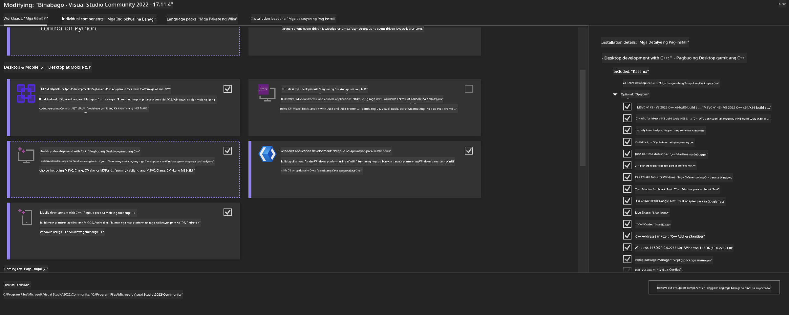
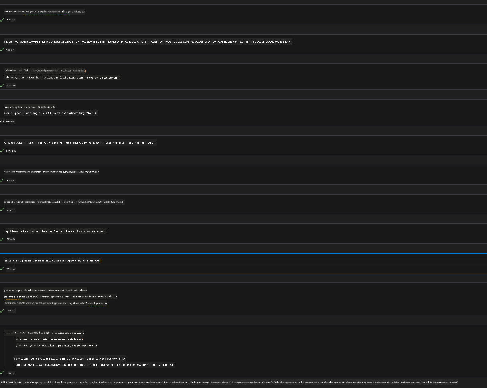
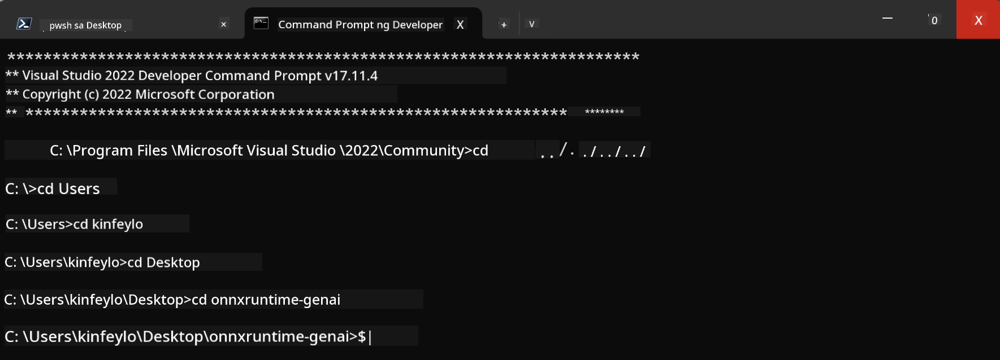

<!--
CO_OP_TRANSLATOR_METADATA:
{
  "original_hash": "b066fc29c1b2129df84e027cb75119ce",
  "translation_date": "2025-05-09T18:45:36+00:00",
  "source_file": "md/02.Application/01.TextAndChat/Phi3/ORTWindowGPUGuideline.md",
  "language_code": "tl"
}
-->
# **Patnubay para sa OnnxRuntime GenAI Windows GPU**

Ang patnubay na ito ay naglalaman ng mga hakbang para sa pagsasaayos at paggamit ng ONNX Runtime (ORT) gamit ang GPU sa Windows. Layunin nitong tulungan kang magamit ang GPU acceleration para sa iyong mga modelo, upang mapabuti ang performance at kahusayan.

Ang dokumento ay nagbibigay ng gabay sa:

- Pagsasaayos ng Kapaligiran: Mga tagubilin sa pag-install ng mga kinakailangang dependencies tulad ng CUDA, cuDNN, at ONNX Runtime.
- Konfigurasyon: Paano i-configure ang kapaligiran at ONNX Runtime para magamit nang epektibo ang mga GPU resources.
- Mga Tip sa Optimization: Mga payo kung paano ayusin nang maayos ang mga setting ng GPU para sa pinakamainam na performance.

### **1. Python 3.10.x /3.11.8**

   ***Note*** Inirerekomenda ang paggamit ng [miniforge](https://github.com/conda-forge/miniforge/releases/latest/download/Miniforge3-Windows-x86_64.exe) bilang iyong Python environment

   ```bash

   conda create -n pydev python==3.11.8

   conda activate pydev

   ```

   ***Reminder*** Kung may naka-install kang anumang python ONNX library, pakibura muna ito

### **2. I-install ang CMake gamit ang winget**

   ```bash

   winget install -e --id Kitware.CMake

   ```

### **3. I-install ang Visual Studio 2022 - Desktop Development with C++**

   ***Note*** Kung ayaw mong mag-compile, puwede mong laktawan ang hakbang na ito



### **4. I-install ang NVIDIA Driver**

1. **NVIDIA GPU Driver**  [https://www.nvidia.com/en-us/drivers/](https://www.nvidia.com/en-us/drivers/)

2. **NVIDIA CUDA 12.4** [https://developer.nvidia.com/cuda-12-4-0-download-archive](https://developer.nvidia.com/cuda-12-4-0-download-archive)

3. **NVIDIA CUDNN 9.4**  [https://developer.nvidia.com/cudnn-downloads](https://developer.nvidia.com/cudnn-downloads)

***Reminder*** Gamitin ang default na mga setting sa proseso ng pag-install

### **5. I-set ang NVIDIA Env**

Kopyahin ang NVIDIA CUDNN 9.4 lib, bin, include papunta sa NVIDIA CUDA 12.4 lib, bin, include

- kopyahin ang mga file mula *'C:\Program Files\NVIDIA\CUDNN\v9.4\bin\12.6'* papunta sa  *'C:\Program Files\NVIDIA GPU Computing Toolkit\CUDA\v12.4\bin'*

- kopyahin ang mga file mula *'C:\Program Files\NVIDIA\CUDNN\v9.4\include\12.6'* papunta sa  *'C:\Program Files\NVIDIA GPU Computing Toolkit\CUDA\v12.4\include'*

- kopyahin ang mga file mula *'C:\Program Files\NVIDIA\CUDNN\v9.4\lib\12.6'* papunta sa  *'C:\Program Files\NVIDIA GPU Computing Toolkit\CUDA\v12.4\lib\x64'*

### **6. I-download ang Phi-3.5-mini-instruct-onnx**

   ```bash

   winget install -e --id Git.Git

   winget install -e --id GitHub.GitLFS

   git lfs install

   git clone https://huggingface.co/microsoft/Phi-3.5-mini-instruct-onnx

   ```

### **7. Patakbuhin ang InferencePhi35Instruct.ipynb**

   Buksan ang [Notebook](../../../../../../code/09.UpdateSamples/Aug/ortgpu-phi35-instruct.ipynb) at i-execute



### **8. I-compile ang ORT GenAI GPU**

   ***Note*** 
   
   1. Pakibura muna lahat ng onnx, onnxruntime, at onnxruntime-genai na naka-install

   ```bash

   pip list 
   
   ```

   Pagkatapos, i-uninstall ang lahat ng onnxruntime libraries tulad ng:

   ```bash

   pip uninstall onnxruntime

   pip uninstall onnxruntime-genai

   pip uninstall onnxruntume-genai-cuda
   
   ```

   2. Suriin ang suporta ng Visual Studio Extension

   Tingnan sa C:\Program Files\NVIDIA GPU Computing Toolkit\CUDA\v12.4\extras kung nandiyan ang C:\Program Files\NVIDIA GPU Computing Toolkit\CUDA\v12.4\extras\visual_studio_integration. 
   
   Kung wala, hanapin sa ibang Cuda toolkit driver folders at kopyahin ang folder na visual_studio_integration kasama ang mga nilalaman nito papunta sa C:\Program Files\NVIDIA GPU Computing Toolkit\CUDA\v12.4\extras\visual_studio_integration

   - Kung ayaw mong mag-compile, puwede mong laktawan ang hakbang na ito

   ```bash

   git clone https://github.com/microsoft/onnxruntime-genai

   ```

   - I-download ang [https://github.com/microsoft/onnxruntime/releases/download/v1.19.2/onnxruntime-win-x64-gpu-1.19.2.zip](https://github.com/microsoft/onnxruntime/releases/download/v1.19.2/onnxruntime-win-x64-gpu-1.19.2.zip)

   - I-unzip ang onnxruntime-win-x64-gpu-1.19.2.zip, at palitan ang pangalan nito ng **ort**, pagkatapos ay kopyahin ang folder na ort papunta sa onnxruntime-genai

   - Gamit ang Windows Terminal, pumunta sa Developer Command Prompt para sa VS 2022 at pumunta sa onnxruntime-genai



   - I-compile ito gamit ang iyong python environment

   ```bash

   cd onnxruntime-genai

   python build.py --use_cuda  --cuda_home "C:\Program Files\NVIDIA GPU Computing Toolkit\CUDA\v12.4" --config Release
 

   cd build/Windows/Release/Wheel

   pip install .whl

   ```

**Paalala**:  
Ang dokumentong ito ay isinalin gamit ang AI translation service na [Co-op Translator](https://github.com/Azure/co-op-translator). Bagamat nagsusumikap kami para sa katumpakan, pakatandaan na ang mga awtomatikong salin ay maaaring maglaman ng mga pagkakamali o di-tumpak na impormasyon. Ang orihinal na dokumento sa orihinal nitong wika ang dapat ituring na pangunahing sanggunian. Para sa mahahalagang impormasyon, inirerekomenda ang propesyonal na pagsasalin ng tao. Hindi kami mananagot sa anumang hindi pagkakaintindihan o maling interpretasyon na maaaring magmula sa paggamit ng salin na ito.