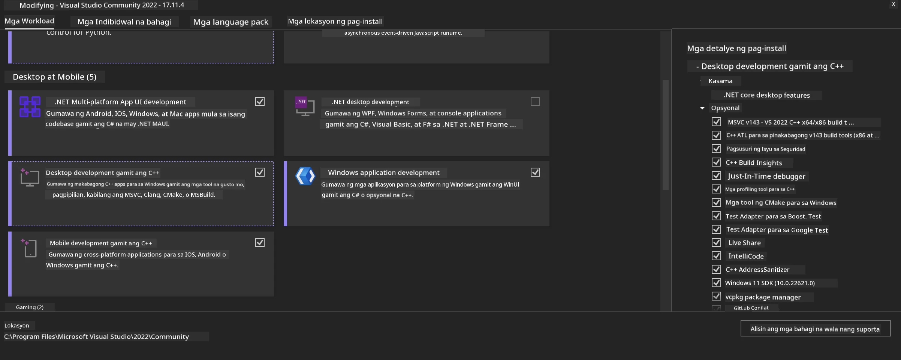
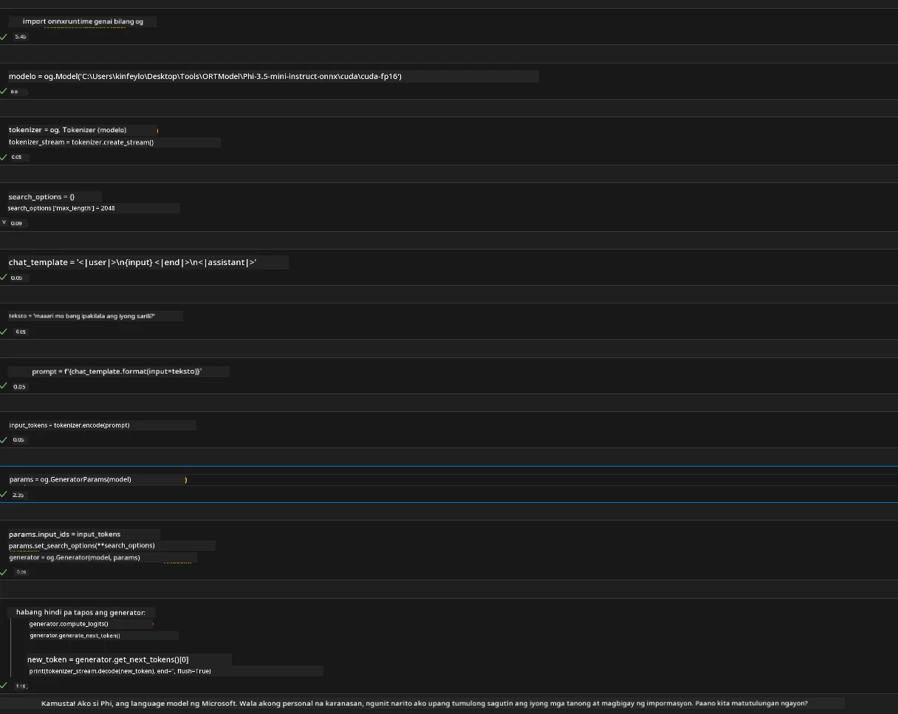
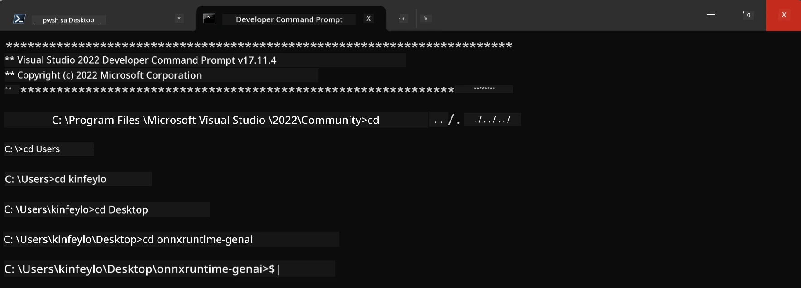

# **Patnubay para sa OnnxRuntime GenAI Windows GPU**

Ang patnubay na ito ay nagbibigay ng mga hakbang para sa pagsasaayos at paggamit ng ONNX Runtime (ORT) kasama ang mga GPU sa Windows. Ito ay idinisenyo upang tulungan kang gamitin ang pag-accelerate ng GPU para sa iyong mga modelo, na nagpapabuti ng pagganap at kahusayan.

Nagbibigay ang dokumento ng mga gabay sa:

- Pagsasaayos ng Kapaligiran: Mga tagubilin sa pag-install ng mga kinakailangang dependencies tulad ng CUDA, cuDNN, at ONNX Runtime.
- Konfigurasyon: Paano i-configure ang kapaligiran at ONNX Runtime upang epektibong magamit ang mga GPU resources.
- Mga Tip sa Optimisasyon: Mga payo kung paano i-fine-tune ang iyong mga setting ng GPU para sa pinakamainam na pagganap.

### **1. Python 3.10.x /3.11.8**

   ***Tandaan*** Iminumungkahi ang paggamit ng [miniforge](https://github.com/conda-forge/miniforge/releases/latest/download/Miniforge3-Windows-x86_64.exe) bilang iyong Python env

   ```bash

   conda create -n pydev python==3.11.8

   conda activate pydev

   ```

   ***Paalala*** Kung mayroon kang naka-install na alinman sa python ONNX library, pakialisin ito

### **2. Mag-install ng CMake gamit ang winget**


   ```bash

   winget install -e --id Kitware.CMake

   ```

### **3. Mag-install ng Visual Studio 2022 - Desktop Development with C++**

   ***Tandaan*** Kung ayaw mong mag-compile ay maaari mong laktawan ang hakbang na ito




### **4. Mag-install ng NVIDIA Driver**

1. **NVIDIA GPU Driver**  [https://www.nvidia.com/en-us/drivers/](https://www.nvidia.com/en-us/drivers/)

2. **NVIDIA CUDA 12.4** [https://developer.nvidia.com/cuda-12-4-0-download-archive](https://developer.nvidia.com/cuda-12-4-0-download-archive)

3. **NVIDIA CUDNN 9.4**  [https://developer.nvidia.com/cudnn-downloads](https://developer.nvidia.com/cudnn-downloads)

***Paalala*** Pakigamit ang mga default na setting sa proseso ng pag-install 

### **5. Itakda ang NVIDIA Env**

Kopyahin ang NVIDIA CUDNN 9.4 lib,bin,include sa NVIDIA CUDA 12.4 lib,bin,include

- kopyahin ang mga *'C:\Program Files\NVIDIA\CUDNN\v9.4\bin\12.6'* file papunta sa  *'C:\Program Files\NVIDIA GPU Computing Toolkit\CUDA\v12.4\bin*

- kopyahin ang mga *'C:\Program Files\NVIDIA\CUDNN\v9.4\include\12.6'* file papunta sa  *'C:\Program Files\NVIDIA GPU Computing Toolkit\CUDA\v12.4\include*

- kopyahin ang mga *'C:\Program Files\NVIDIA\CUDNN\v9.4\lib\12.6'* file papunta sa  *'C:\Program Files\NVIDIA GPU Computing Toolkit\CUDA\v12.4\lib\x64'*


### **6. I-download ang Phi-3.5-mini-instruct-onnx**


   ```bash

   winget install -e --id Git.Git

   winget install -e --id GitHub.GitLFS

   git lfs install

   git clone https://huggingface.co/microsoft/Phi-3.5-mini-instruct-onnx

   ```

### **7. Patakbuhin ang InferencePhi35Instruct.ipynb**

   Buksan ang [Notebook](../../../../code/09.UpdateSamples/Aug/ortgpu-phi35-instruct.ipynb) at isagawa





### **8. I-compile ang ORT GenAI GPU**


   ***Tandaan*** 
   
   1. Pakibura muna lahat ng naka-install tungkol sa onnx at onnxruntime at onnxruntime-genai

   
   ```bash

   pip list 
   
   ```

   Pagkatapos ay burahin ang lahat ng onnxruntime libraries i.e. 


   ```bash

   pip uninstall onnxruntime

   pip uninstall onnxruntime-genai

   pip uninstall onnxruntume-genai-cuda
   
   ```

   2. Suriin ang suporta ng Visual Studio Extension 

   Suriin ang C:\Program Files\NVIDIA GPU Computing Toolkit\CUDA\v12.4\extras upang matiyak na nandoon ang C:\Program Files\NVIDIA GPU Computing Toolkit\CUDA\v12.4\extras\visual_studio_integration. 
   
   Kung wala, suriin ang ibang folder ng Cuda toolkit driver at kopyahin ang visual_studio_integration folder kasama ang mga nilalaman nito sa C:\Program Files\NVIDIA GPU Computing Toolkit\CUDA\v12.4\extras\visual_studio_integration


   - Kung ayaw mong mag-compile ay maaari mong laktawan ang hakbang na ito


   ```bash

   git clone https://github.com/microsoft/onnxruntime-genai

   ```

   - I-download mula sa [https://github.com/microsoft/onnxruntime/releases/download/v1.19.2/onnxruntime-win-x64-gpu-1.19.2.zip](https://github.com/microsoft/onnxruntime/releases/download/v1.19.2/onnxruntime-win-x64-gpu-1.19.2.zip)

   - I-unzip ang onnxruntime-win-x64-gpu-1.19.2.zip, at palitan ang pangalan nito sa **ort**, kopyahin ang ort folder sa onnxruntime-genai

   - Gamit ang Windows Terminal, pumunta sa Developer Command Prompt for VS 2022 at pumunta sa onnxruntime-genai 



   - I-compile ito gamit ang iyong python env

   
   ```bash

   cd onnxruntime-genai

   python build.py --use_cuda  --cuda_home "C:\Program Files\NVIDIA GPU Computing Toolkit\CUDA\v12.4" --config Release
 

   cd build/Windows/Release/Wheel

   pip install .whl

   ```

---

<!-- CO-OP TRANSLATOR DISCLAIMER START -->
**Pagtatanggi**:
Ang dokumentong ito ay isinalin gamit ang serbisyo ng AI translation na [Co-op Translator](https://github.com/Azure/co-op-translator). Bagama't nagsusumikap kami para sa katumpakan, pakatandaan na ang awtomatikong pagsasalin ay maaaring maglaman ng mga pagkakamali o hindi pagkakatugma. Ang orihinal na dokumento sa orihinal nitong wika ang dapat ituring na pangunahing sanggunian. Para sa mahahalagang impormasyon, inirerekomenda ang propesyonal na pagsasalin ng tao. Hindi kami mananagot sa anumang maling pagkakaintindi o maling interpretasyon na nagmula sa paggamit ng pagsasaling ito.
<!-- CO-OP TRANSLATOR DISCLAIMER END -->