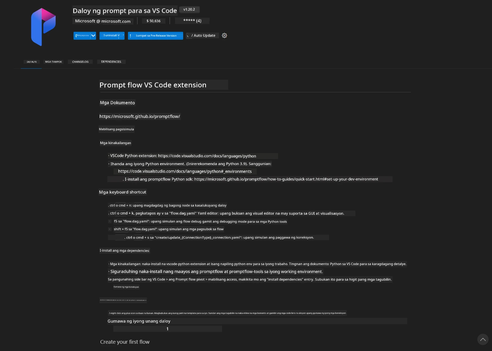
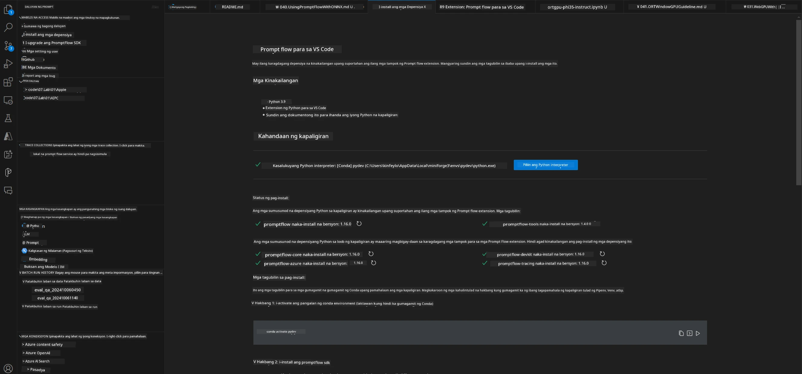
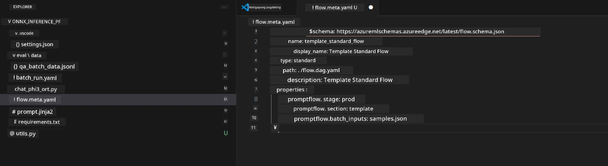
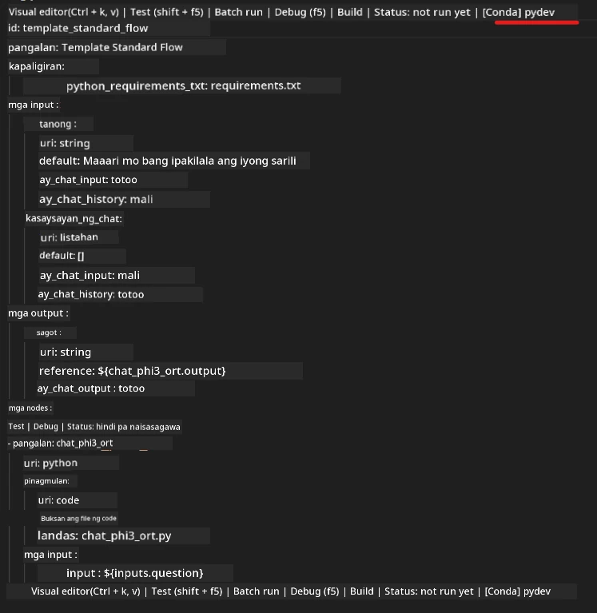
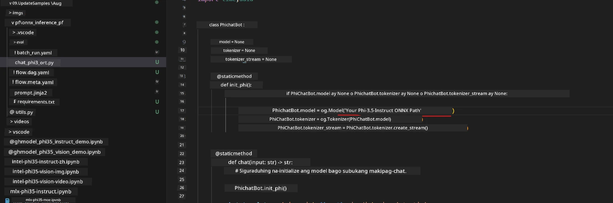
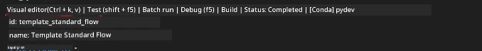
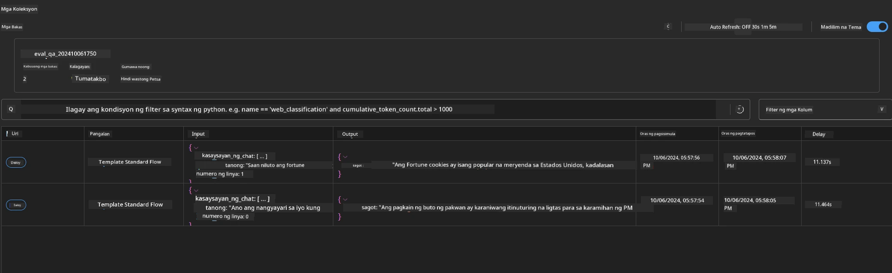

<!--
CO_OP_TRANSLATOR_METADATA:
{
  "original_hash": "92e7dac1e5af0dd7c94170fdaf6860fe",
  "translation_date": "2025-07-17T03:02:35+00:00",
  "source_file": "md/02.Application/01.TextAndChat/Phi3/UsingPromptFlowWithONNX.md",
  "language_code": "tl"
}
-->
# Paggamit ng Windows GPU para gumawa ng Prompt flow solution gamit ang Phi-3.5-Instruct ONNX

Ang dokumentong ito ay isang halimbawa kung paano gamitin ang PromptFlow kasama ang ONNX (Open Neural Network Exchange) para sa pag-develop ng mga AI application base sa Phi-3 models.

Ang PromptFlow ay isang hanay ng mga development tools na idinisenyo upang gawing mas madali ang buong proseso ng pag-develop ng mga LLM-based (Large Language Model) AI application, mula sa pagbuo ng ideya at prototyping hanggang sa testing at evaluation.

Sa pamamagitan ng pagsasama ng PromptFlow at ONNX, maaaring:

- I-optimize ang Performance ng Modelo: Gamitin ang ONNX para sa mas mabilis at epektibong model inference at deployment.
- Pagsimplihin ang Development: Gamitin ang PromptFlow para pamahalaan ang workflow at i-automate ang mga paulit-ulit na gawain.
- Pahusayin ang Kolaborasyon: Mas mapadali ang pagtutulungan ng mga miyembro ng team sa pamamagitan ng isang pinag-isang development environment.

**Prompt flow** ay isang hanay ng mga development tools na idinisenyo upang gawing mas madali ang buong proseso ng pag-develop ng LLM-based AI application, mula sa pagbuo ng ideya, prototyping, testing, evaluation hanggang sa production deployment at monitoring. Pinapadali nito ang prompt engineering at nagbibigay-daan upang makabuo ng mga LLM app na may kalidad para sa production.

Ang Prompt flow ay maaaring kumonekta sa OpenAI, Azure OpenAI Service, at mga customizable na modelo (Huggingface, local LLM/SLM). Layunin naming i-deploy ang quantized ONNX model ng Phi-3.5 sa mga lokal na aplikasyon. Makakatulong ang Prompt flow upang mas maayos naming maplano ang aming negosyo at makumpleto ang mga lokal na solusyon base sa Phi-3.5. Sa halimbawang ito, pagsasamahin natin ang ONNX Runtime GenAI Library upang makumpleto ang Prompt flow solution gamit ang Windows GPU.

## **Pag-install**

### **ONNX Runtime GenAI para sa Windows GPU**

Basahin ang gabay na ito para i-set up ang ONNX Runtime GenAI para sa Windows GPU [click here](./ORTWindowGPUGuideline.md)

### **Pag-setup ng Prompt flow sa VSCode**

1. I-install ang Prompt flow VS Code Extension



2. Pagkatapos ma-install ang Prompt flow VS Code Extension, i-click ang extension at piliin ang **Installation dependencies** sundin ang gabay na ito para i-install ang Prompt flow SDK sa iyong environment



3. I-download ang [Sample Code](../../../../../../code/09.UpdateSamples/Aug/pf/onnx_inference_pf) at buksan ito gamit ang VS Code



4. Buksan ang **flow.dag.yaml** para piliin ang iyong Python environment



   Buksan ang **chat_phi3_ort.py** para baguhin ang lokasyon ng iyong Phi-3.5-instruct ONNX Model



5. Patakbuhin ang iyong prompt flow para sa testing

Buksan ang **flow.dag.yaml** at i-click ang visual editor



Pagkatapos i-click ito, patakbuhin ito para subukan


1. Maaari kang magpatakbo ng batch sa terminal para makita ang mas maraming resulta


```bash

pf run create --file batch_run.yaml --stream --name 'Your eval qa name'    

```

Maaari mong tingnan ang mga resulta sa iyong default browser




**Paalala**:  
Ang dokumentong ito ay isinalin gamit ang AI translation service na [Co-op Translator](https://github.com/Azure/co-op-translator). Bagamat nagsusumikap kami para sa katumpakan, pakatandaan na ang mga awtomatikong pagsasalin ay maaaring maglaman ng mga pagkakamali o di-tumpak na impormasyon. Ang orihinal na dokumento sa orihinal nitong wika ang dapat ituring na pangunahing sanggunian. Para sa mahahalagang impormasyon, inirerekomenda ang propesyonal na pagsasalin ng tao. Hindi kami mananagot sa anumang hindi pagkakaunawaan o maling interpretasyon na maaaring magmula sa paggamit ng pagsasaling ito.