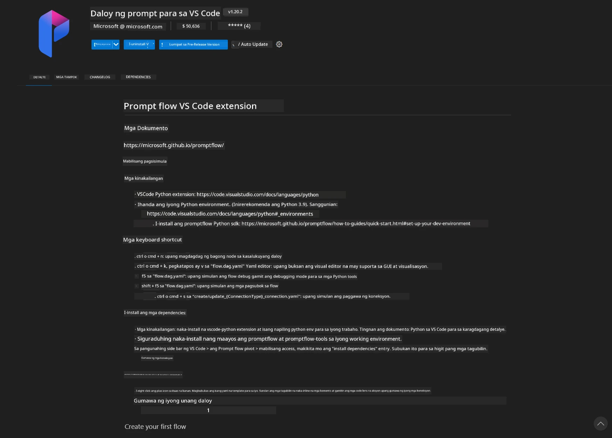
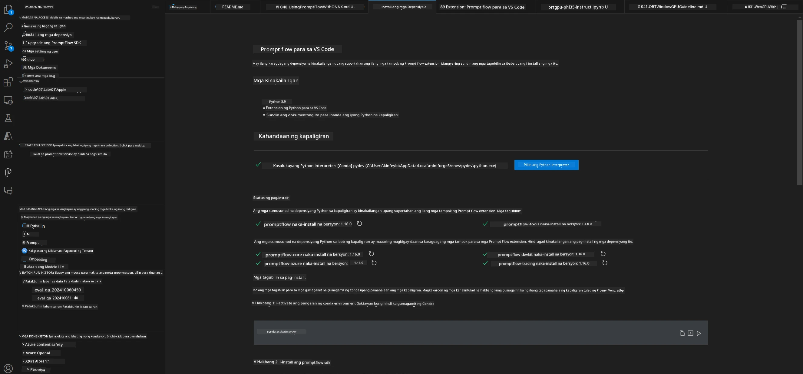
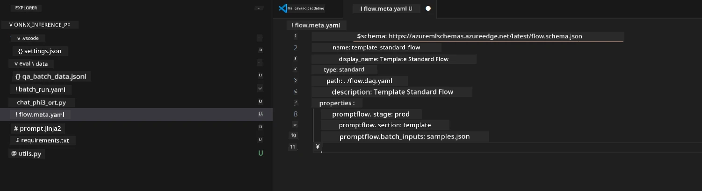
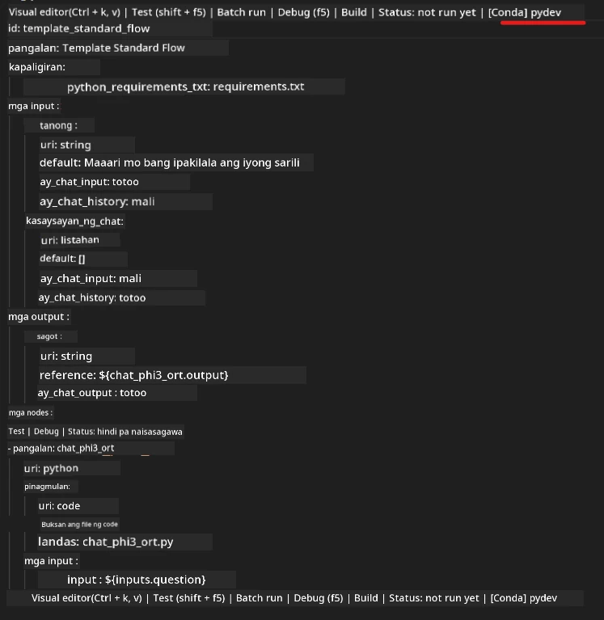
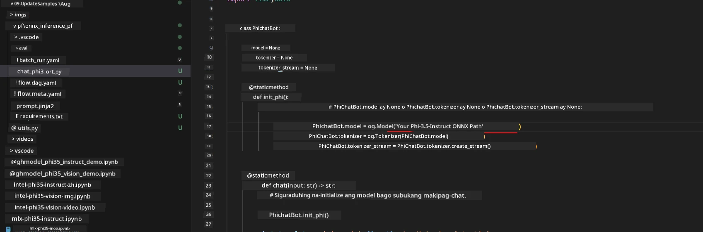
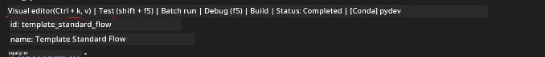
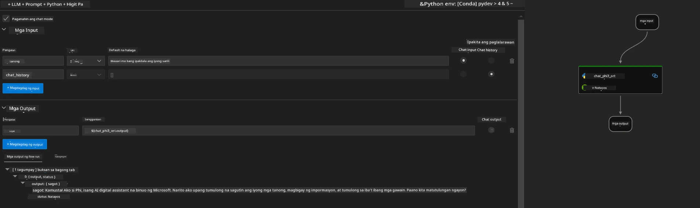
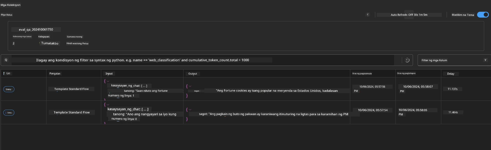

# Paggamit ng Windows GPU para gumawa ng Prompt flow solution gamit ang Phi-3.5-Instruct ONNX 

Ang sumusunod na dokumento ay isang halimbawa kung paano gamitin ang PromptFlow kasama ang ONNX (Open Neural Network Exchange) para sa pagbuo ng AI applications na batay sa Phi-3 models.

Ang PromptFlow ay isang suite ng mga development tools na dinisenyo upang pagaanin ang end-to-end development cycle ng LLM-based (Large Language Model) AI applications, mula sa ideasyon at prototyping hanggang sa testing at evaluation.

Sa pamamagitan ng pagsasama ng PromptFlow sa ONNX, makakagawa ang mga developer ng:

- Pag-optimize ng Performance ng Modelo: Gamitin ang ONNX para sa epektibong model inference at deployment.
- Pagpapasimple ng Development: Gamitin ang PromptFlow upang pamahalaan ang workflow at i-automate ang mga paulit-ulit na gawain.
- Pagpapahusay ng Kolaborasyon: Paguumpisahan ang mas maayos na kolaborasyon sa mga miyembro ng koponan sa pamamagitan ng pagbibigay ng pinag-isang development environment.

**Prompt flow** ay isang suite ng mga development tools na dinisenyo upang pagaanin ang end-to-end development cycle ng LLM-based AI applications, mula sa ideasyon, prototyping, testing, evaluation hanggang sa production deployment at monitoring. Ginagawang mas madali ang prompt engineering at pinapayagan kang gumawa ng LLM apps na may kalidad pang-produksiyon.

Maaaring kumonekta ang Prompt flow sa OpenAI, Azure OpenAI Service, at mga customizable na modelo (Huggingface, lokal na LLM/SLM). Nais naming ideploy ang Phi-3.5 na quantized ONNX model sa mga lokal na aplikasyon. Makakatulong ang Prompt flow sa mas maayos na pagpaplano ng aming negosyo at makumpleto ang mga lokal na solusyon batay sa Phi-3.5. Sa halimbawa na ito, pagsasamahin natin ang ONNX Runtime GenAI Library upang makumpleto ang Prompt flow solution base sa Windows GPU.

## **Installation**

### **ONNX Runtime GenAI para sa Windows GPU**

Basahin ang patnubay na ito para i-setup ang ONNX Runtime GenAI para sa Windows GPU  [click here](./ORTWindowGPUGuideline.md)

### **I-setup ang Prompt flow sa VSCode**

1. Mag-install ng Prompt flow VS Code Extension



2. Pagkatapos ma-install ang Prompt flow VS Code Extension, i-click ang extension, at piliin ang **Installation dependencies** sundin ang patnubay na ito upang i-install ang Prompt flow SDK sa iyong environment



3. I-download ang [Sample Code](../../../../../../code/09.UpdateSamples/Aug/pf/onnx_inference_pf) at buksan ito gamit ang VS Code



4. Buksan ang **flow.dag.yaml** upang piliin ang iyong Python environment



   Buksan ang **chat_phi3_ort.py** para baguhin ang lokasyon ng iyong Phi-3.5-instruct ONNX Model



5. Patakbuhin ang iyong prompt flow para sa testing

Buksan ang **flow.dag.yaml** at i-click ang visual editor



pagkatapos i-click ito, patakbuhin ito para sa testing



1. Maaari mong patakbuhin ang batch sa terminal upang makita ang higit pang resulta


```bash

pf run create --file batch_run.yaml --stream --name 'Your eval qa name'    

```

Maaari mong tingnan ang mga resulta sa iyong default na browser




---

<!-- CO-OP TRANSLATOR DISCLAIMER START -->
**Pagtatanggi**:
Ang dokumentong ito ay isinalin gamit ang serbisyo ng AI translation na [Co-op Translator](https://github.com/Azure/co-op-translator). Bagama't nagsusumikap kami para sa katumpakan, pakatandaan na ang awtomatikong pagsasalin ay maaaring maglaman ng mga pagkakamali o hindi pagkakatugma. Ang orihinal na dokumento sa orihinal nitong wika ang dapat ituring na pangunahing sanggunian. Para sa mahahalagang impormasyon, inirerekomenda ang propesyonal na pagsasalin ng tao. Hindi kami mananagot sa anumang maling pagkakaintindi o maling interpretasyon na nagmula sa paggamit ng pagsasaling ito.
<!-- CO-OP TRANSLATOR DISCLAIMER END -->