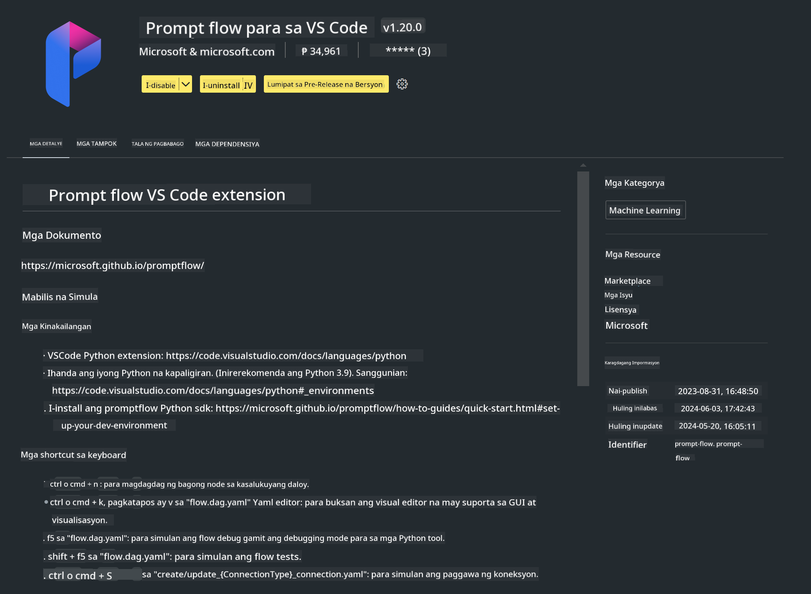

<!--
CO_OP_TRANSLATOR_METADATA:
{
  "original_hash": "a4ef39027902e82f2c33d568d2a2259a",
  "translation_date": "2025-05-09T19:20:48+00:00",
  "source_file": "md/02.Application/02.Code/Phi3/VSCodeExt/HOL/AIPC/01.Installations.md",
  "language_code": "tl"
}
-->
# **Lab 0 - Pag-install**

Kapag pumasok tayo sa Lab, kailangan nating i-configure ang kaukulang environment:


### **1. Python 3.11+**

Inirerekomenda na gamitin ang miniforge para i-configure ang iyong Python environment

Para i-configure ang miniforge, pakitingnan ang [https://github.com/conda-forge/miniforge](https://github.com/conda-forge/miniforge)

Pagkatapos i-configure ang miniforge, patakbuhin ang sumusunod na utos sa Power Shell

```bash

conda create -n pyenv python==3.11.8 -y

conda activate pyenv

```


### **2. I-install ang Prompt flow SDK**

Sa Lab 1, gagamit tayo ng Prompt flow, kaya kailangan mong i-configure ang Prompt flow SDK.

```bash

pip install promptflow --upgrade

```

Maaari mong tingnan ang promptflow sdk gamit ang utos na ito


```bash

pf --version

```

### **3. I-install ang Visual Studio Code Prompt flow Extension**




### **4. Intel NPU Acceleration Library**

Sinusuportahan ng bagong henerasyon ng Intel processors ang NPU. Kung gusto mong gamitin ang NPU para patakbuhin ang LLMs / SLMs nang lokal, maaari mong gamitin ang ***Intel NPU Acceleration Library***. Kung gusto mong malaman pa, basahin ang [https://github.com/microsoft/PhiCookBook/blob/main/md/01.Introduction/03/AIPC_Inference.md](https://github.com/microsoft/PhiCookBook/blob/main/md/01.Introduction/03/AIPC_Inference.md).

I-install ang Intel NPU Acceleration Library gamit ang bash


```bash

pip install intel-npu-acceleration-library

```

***Note***: Tandaan na sinusuportahan ng library na ito ang transformers ***4.40.2***, paki-kumpirma ang bersyon


### **5. Ibang Python Library**


gumawa ng requirements.txt at idagdag ang nilalaman na ito

```txt

notebook
numpy 
scipy 
scikit-learn 
matplotlib 
pandas 
pillow 
graphviz

```


### **6. I-install ang NVM**

i-install ang nvm sa Powershell


```bash

winget install -e --id CoreyButler.NVMforWindows

```

i-install ang nodejs 18.20


```bash

nvm install 18.20.0

nvm use 18.20.0

```

### **7. I-install ang Visual Studio Code Development Support**


```bash

npm install --global yo generator-code

```

Congrats! Matagumpay mong na-configure ang SDK. Sunod, magpatuloy sa mga hands-on na hakbang.

**Paalala**:  
Ang dokumentong ito ay isinalin gamit ang AI translation service na [Co-op Translator](https://github.com/Azure/co-op-translator). Bagamat nagsusumikap kami para sa katumpakan, pakatandaan na ang mga awtomatikong salin ay maaaring maglaman ng mga pagkakamali o hindi pagkakatugma. Ang orihinal na dokumento sa orihinal nitong wika ang dapat ituring na pangunahing sanggunian. Para sa mahahalagang impormasyon, inirerekomenda ang propesyonal na pagsasalin ng tao. Hindi kami mananagot sa anumang hindi pagkakaunawaan o maling interpretasyon na maaaring magmula sa paggamit ng salin na ito.