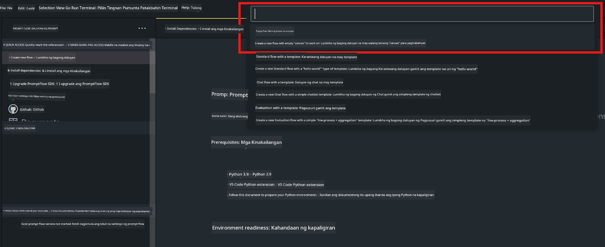
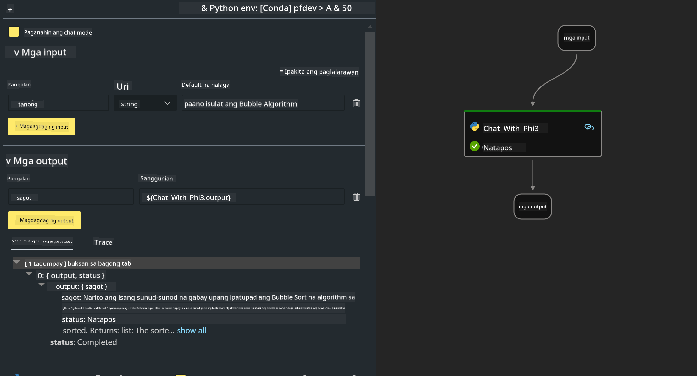

<!--
CO_OP_TRANSLATOR_METADATA:
{
  "original_hash": "bc29f7fe7fc16bed6932733eac8c81b8",
  "translation_date": "2025-05-09T19:25:28+00:00",
  "source_file": "md/02.Application/02.Code/Phi3/VSCodeExt/HOL/AIPC/02.PromptflowWithNPU.md",
  "language_code": "tl"
}
-->
# **Lab 2 - Patakbuhin ang Prompt flow gamit ang Phi-3-mini sa AIPC**

## **Ano ang Prompt flow**

Ang Prompt flow ay isang hanay ng mga kasangkapang pang-develop na idinisenyo upang gawing mas madali ang buong proseso ng pagbuo ng mga AI application na batay sa LLM, mula sa pagbuo ng ideya, paggawa ng prototype, pagsubok, pagsusuri, hanggang sa deployment at monitoring sa production. Pinapadali nito ang prompt engineering at nagbibigay-daan sa iyo na makagawa ng mga LLM app na may kalidad para sa production.

Sa prompt flow, magagawa mong:

- Gumawa ng mga flow na nag-uugnay sa LLMs, prompts, Python code, at iba pang mga tools sa isang executable na workflow.

- I-debug at ulitin ang iyong mga flow, lalo na ang interaksyon sa LLMs nang madali.

- Suriin ang iyong mga flow, kalkulahin ang kalidad at performance metrics gamit ang mas malalaking dataset.

- Isama ang testing at evaluation sa iyong CI/CD system para matiyak ang kalidad ng iyong flow.

- I-deploy ang iyong mga flow sa platform na pinili mo para sa serving o madaling isama sa code base ng iyong app.

- (Opsyonal pero lubos na inirerekomenda) Makipagtulungan sa iyong team gamit ang cloud version ng Prompt flow sa Azure AI.

## **Ano ang AIPC**

Ang AI PC ay may CPU, GPU, at NPU, bawat isa ay may partikular na kakayahan para sa AI acceleration. Ang NPU, o neural processing unit, ay isang espesyal na accelerator na humahawak sa mga gawain ng artificial intelligence (AI) at machine learning (ML) mismo sa iyong PC, sa halip na ipadala ang data para iproseso sa cloud. Maaari ring iproseso ng GPU at CPU ang mga trabahong ito, ngunit ang NPU ay partikular na mahusay sa mga low-power AI calculations. Ang AI PC ay kumakatawan sa isang mahalagang pagbabago sa paraan ng pagpapatakbo ng ating mga computer. Hindi ito solusyon sa isang problemang dati nang wala, kundi isang malaking pag-unlad para sa pang-araw-araw na paggamit ng PC.

Paano ito gumagana? Kung ikukumpara sa generative AI at sa malalaking LLM na sinanay sa napakaraming pampublikong data, ang AI na gagawin sa iyong PC ay mas madaling ma-access sa halos lahat ng aspeto. Mas madaling maintindihan ang konsepto, at dahil ito ay sinanay gamit ang iyong sariling data, nang hindi kinakailangang kumonekta sa cloud, mas kaagad na kapaki-pakinabang ito sa mas malawak na populasyon.

Sa malapit na hinaharap, ang mundo ng AI PC ay kinabibilangan ng mga personal assistant at mas maliliit na AI model na tumatakbo mismo sa iyong PC, gamit ang iyong data upang magbigay ng personal, pribado, at mas ligtas na AI na mga pagbuti para sa mga bagay na ginagawa mo araw-araw – tulad ng pagkuha ng mga tala sa meeting, pag-aayos ng fantasy football league, pag-automate ng mga enhancement sa pag-edit ng larawan at video, o paggawa ng perpektong itinerary para sa reunion ng pamilya base sa oras ng pagdating at pag-alis ng bawat isa.

## **Pagbuo ng generation code flows sa AIPC**

***Note*** ：Kung hindi mo pa natapos ang pag-install ng environment, bisitahin ang [Lab 0 -Installations](./01.Installations.md)

1. Buksan ang Prompt flow Extension sa Visual Studio Code at gumawa ng isang empty flow project



2. Magdagdag ng Inputs at Outputs parameters at magdagdag ng Python Code bilang bagong flow



Maaari mong sundan ang estrukturang ito (flow.dag.yaml) para mabuo ang iyong flow

```yaml

inputs:
  question:
    type: string
    default: how to write Bubble Algorithm
outputs:
  answer:
    type: string
    reference: ${Chat_With_Phi3.output}
nodes:
- name: Chat_With_Phi3
  type: python
  source:
    type: code
    path: Chat_With_Phi3.py
  inputs:
    question: ${inputs.question}


```

3. Magdagdag ng Code sa ***Chat_With_Phi3.py***

```python


from promptflow.core import tool

# import torch
from transformers import AutoTokenizer, pipeline,TextStreamer
import intel_npu_acceleration_library as npu_lib

import warnings

import asyncio
import platform

class Phi3CodeAgent:
    
    model = None
    tokenizer = None
    text_streamer = None
    
    model_id = "microsoft/Phi-3-mini-4k-instruct"

    @staticmethod
    def init_phi3():
        
        if Phi3CodeAgent.model is None or Phi3CodeAgent.tokenizer is None or Phi3CodeAgent.text_streamer is None:
            Phi3CodeAgent.model = npu_lib.NPUModelForCausalLM.from_pretrained(
                                    Phi3CodeAgent.model_id,
                                    torch_dtype="auto",
                                    dtype=npu_lib.int4,
                                    trust_remote_code=True
                                )
            Phi3CodeAgent.tokenizer = AutoTokenizer.from_pretrained(Phi3CodeAgent.model_id)
            Phi3CodeAgent.text_streamer = TextStreamer(Phi3CodeAgent.tokenizer, skip_prompt=True)

    

    @staticmethod
    def chat_with_phi3(prompt):
        
        Phi3CodeAgent.init_phi3()

        messages = "<|system|>You are a AI Python coding assistant. Please help me to generate code in Python.The answer only genertated Python code, but any comments and instructions do not need to be generated<|end|><|user|>" + prompt +"<|end|><|assistant|>"


        generation_args = {
            "max_new_tokens": 1024,
            "return_full_text": False,
            "temperature": 0.3,
            "do_sample": False,
            "streamer": Phi3CodeAgent.text_streamer,
        }

        pipe = pipeline(
            "text-generation",
            model=Phi3CodeAgent.model,
            tokenizer=Phi3CodeAgent.tokenizer,
            # **generation_args
        )

        result = ''

        with warnings.catch_warnings():
            warnings.simplefilter("ignore")
            response = pipe(messages, **generation_args)
            result =response[0]['generated_text']
            return result


@tool
def my_python_tool(question: str) -> str:
    if platform.system() == 'Windows':
        asyncio.set_event_loop_policy(asyncio.WindowsSelectorEventLoopPolicy())
    return Phi3CodeAgent.chat_with_phi3(question)


```

4. Maaari mong subukan ang flow mula sa Debug o Run para makita kung maayos ang generation code


5. Patakbuhin ang flow bilang development API sa terminal

```

pf flow serve --source ./ --port 8080 --host localhost   

```

Maaari mo itong subukan sa Postman / Thunder Client

### **Note**

1. Ang unang pagpapatakbo ay tumatagal ng matagal. Inirerekomenda na i-download ang phi-3 model mula sa Hugging face CLI.

2. Dahil sa limitadong computing power ng Intel NPU, mas mainam gamitin ang Phi-3-mini-4k-instruct

3. Ginagamit namin ang Intel NPU Acceleration para sa INT4 quantization conversion, pero kung uulitin mong patakbuhin ang serbisyo, kailangan mong burahin ang cache at nc_workshop folders.

## **Resources**

1. Matutunan ang Promptflow [https://microsoft.github.io/promptflow/](https://microsoft.github.io/promptflow/)

2. Matutunan ang Intel NPU Acceleration [https://github.com/intel/intel-npu-acceleration-library](https://github.com/intel/intel-npu-acceleration-library)

3. Sample Code, i-download ang [Local NPU Agent Sample Code](../../../../../../../../../code/07.Lab/01/AIPC)

**Paalala**:  
Ang dokumentong ito ay isinalin gamit ang AI translation service na [Co-op Translator](https://github.com/Azure/co-op-translator). Bagaman nagsusumikap kami para sa katumpakan, pakatandaan na ang mga awtomatikong salin ay maaaring maglaman ng mga pagkakamali o di-tumpak na impormasyon. Ang orihinal na dokumento sa kanyang sariling wika ang dapat ituring na pangunahing sanggunian. Para sa mahahalagang impormasyon, inirerekomenda ang propesyonal na pagsasalin ng tao. Hindi kami mananagot sa anumang hindi pagkakaunawaan o maling interpretasyon na maaaring magmula sa paggamit ng salin na ito.