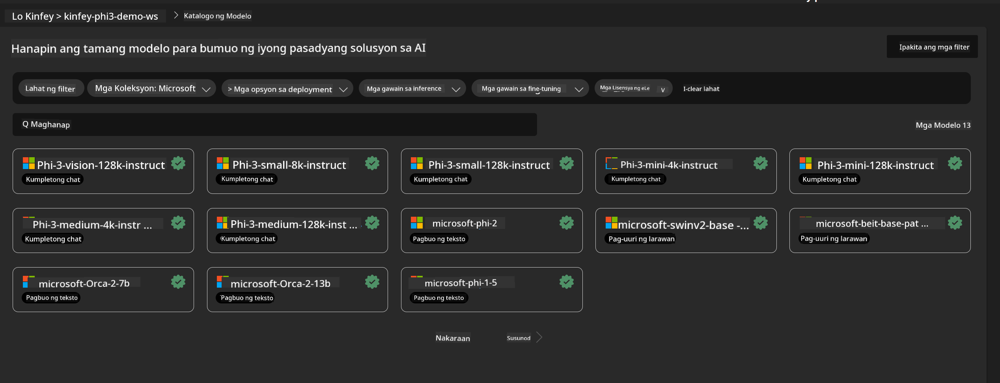

<!--
CO_OP_TRANSLATOR_METADATA:
{
  "original_hash": "20cb4e6ac1686248e8be913ccf6c2bc2",
  "translation_date": "2025-07-17T04:07:51+00:00",
  "source_file": "md/02.Application/02.Code/Phi3/VSCodeExt/HOL/AIPC/03.DeployPhi3VisionOnAzure.md",
  "language_code": "tl"
}
-->
# **Lab 3 - I-deploy ang Phi-3-vision sa Azure Machine Learning Service**

Gagamit tayo ng NPU para matapos ang production deployment ng lokal na code, at pagkatapos ay nais nating ipakilala ang kakayahan ng PHI-3-VISION upang makagawa ng code mula sa mga larawan.

Sa pagpapakilala na ito, mabilis nating mabubuo ang Model As Service na Phi-3 Vision sa Azure Machine Learning Service.

***Note***： Nangangailangan ang Phi-3 Vision ng malakas na computing power para makabuo ng content nang mas mabilis. Kailangan natin ng cloud computing power para matulungan tayo dito.


### **1. Gumawa ng Azure Machine Learning Service**

Kailangan nating gumawa ng Azure Machine Learning Service sa Azure Portal. Kung nais mong matutunan kung paano, bisitahin ang link na ito [https://learn.microsoft.com/azure/machine-learning/quickstart-create-resources?view=azureml-api-2](https://learn.microsoft.com/azure/machine-learning/quickstart-create-resources?view=azureml-api-2)


### **2. Piliin ang Phi-3 Vision sa Azure Machine Learning Service**




### **3. I-deploy ang Phi-3-Vision sa Azure**


### **4. Subukan ang Endpoint sa Postman**


***Note***

1. Ang mga parameter na ipapasa ay dapat kasama ang Authorization, azureml-model-deployment, at Content-Type. Kailangan mong tingnan ang deployment information para makuha ito.

2. Para maipasa ang mga parameter, kailangang magpadala ang Phi-3-Vision ng link ng larawan. Paki-sunod ang paraan ng GPT-4-Vision sa pagpapasa ng mga parameter, tulad ng

```json

{
  "input_data":{
    "input_string":[
      {
        "role":"user",
        "content":[ 
          {
            "type": "text",
            "text": "You are a Python coding assistant.Please create Python code for image "
          },
          {
              "type": "image_url",
              "image_url": {
                "url": "https://ajaytech.co/wp-content/uploads/2019/09/index.png"
              }
          }
        ]
      }
    ],
    "parameters":{
          "temperature": 0.6,
          "top_p": 0.9,
          "do_sample": false,
          "max_new_tokens": 2048
    }
  }
}

```

3. Tawagin ang **/score** gamit ang Post method

**Congratulations**！Natapos mo na ang mabilisang deployment ng PHI-3-VISION at nasubukan kung paano gumawa ng code gamit ang mga larawan. Sunod, maaari na tayong bumuo ng mga aplikasyon gamit ang kombinasyon ng NPUs at cloud.

**Paalala**:  
Ang dokumentong ito ay isinalin gamit ang AI translation service na [Co-op Translator](https://github.com/Azure/co-op-translator). Bagamat nagsusumikap kami para sa katumpakan, pakatandaan na ang mga awtomatikong pagsasalin ay maaaring maglaman ng mga pagkakamali o di-tumpak na impormasyon. Ang orihinal na dokumento sa orihinal nitong wika ang dapat ituring na pangunahing sanggunian. Para sa mahahalagang impormasyon, inirerekomenda ang propesyonal na pagsasalin ng tao. Hindi kami mananagot sa anumang hindi pagkakaunawaan o maling interpretasyon na maaaring magmula sa paggamit ng pagsasaling ito.