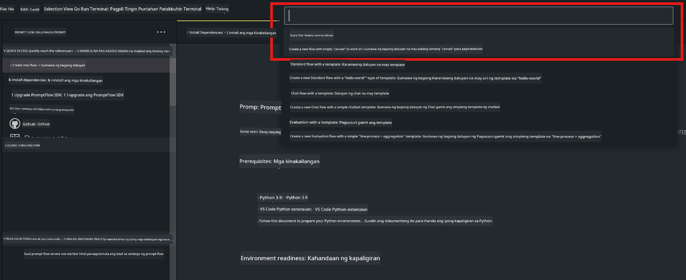
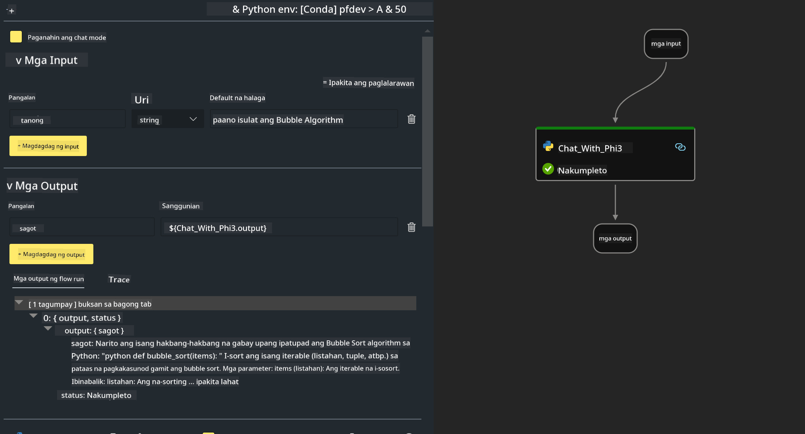
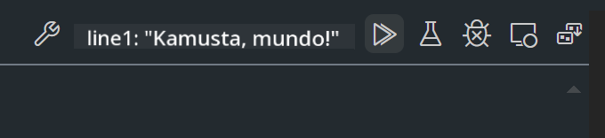

<!--
CO_OP_TRANSLATOR_METADATA:
{
  "original_hash": "3dbbf568625b1ee04b354c2dc81d3248",
  "translation_date": "2025-07-17T04:27:59+00:00",
  "source_file": "md/02.Application/02.Code/Phi3/VSCodeExt/HOL/Apple/02.PromptflowWithMLX.md",
  "language_code": "tl"
}
-->
# **Lab 2 - Patakbuhin ang Prompt flow gamit ang Phi-3-mini sa AIPC**

## **Ano ang Prompt flow**

Ang Prompt flow ay isang hanay ng mga kasangkapan sa pag-develop na idinisenyo upang gawing mas madali ang buong proseso ng pagbuo ng mga AI application na batay sa LLM, mula sa pag-iisip ng ideya, paggawa ng prototype, pagsubok, pagsusuri hanggang sa deployment at pagmamanman sa produksyon. Pinapadali nito ang prompt engineering at nagbibigay-daan sa iyo na makabuo ng mga LLM app na may kalidad para sa produksyon.

Sa pamamagitan ng prompt flow, magagawa mong:

- Gumawa ng mga flow na nag-uugnay sa LLMs, prompts, Python code, at iba pang mga kasangkapan sa isang executable na workflow.

- I-debug at ulitin ang iyong mga flow, lalo na ang pakikipag-ugnayan sa LLMs nang madali.

- Suriin ang iyong mga flow, kalkulahin ang kalidad at performance metrics gamit ang mas malalaking dataset.

- Isama ang pagsubok at pagsusuri sa iyong CI/CD system upang matiyak ang kalidad ng iyong flow.

- I-deploy ang iyong mga flow sa platform na iyong pinili o isama ito sa code base ng iyong app nang madali.

- (Opsyonal ngunit lubos na inirerekomenda) Makipagtulungan sa iyong koponan gamit ang cloud version ng Prompt flow sa Azure AI.

## **Paggawa ng generation code flows sa Apple Silicon**

***Note*** ：Kung hindi mo pa natatapos ang pag-install ng environment, bisitahin ang [Lab 0 -Installations](./01.Installations.md)

1. Buksan ang Prompt flow Extension sa Visual Studio Code at gumawa ng isang empty flow project



2. Magdagdag ng Inputs at Outputs parameters at magdagdag ng Python Code bilang bagong flow



Maaari mong sundan ang istrukturang ito (flow.dag.yaml) para buuin ang iyong flow

```yaml

inputs:
  prompt:
    type: string
    default: Write python code for Fibonacci serie. Please use markdown as output
outputs:
  result:
    type: string
    reference: ${gen_code_by_phi3.output}
nodes:
- name: gen_code_by_phi3
  type: python
  source:
    type: code
    path: gen_code_by_phi3.py
  inputs:
    prompt: ${inputs.prompt}


```

3. I-quantify ang phi-3-mini

Nais naming mas mapatakbo nang maayos ang SLM sa mga lokal na device. Karaniwan, kino-quantify namin ang modelo (INT4, FP16, FP32)

```bash

python -m mlx_lm.convert --hf-path microsoft/Phi-3-mini-4k-instruct

```

**Note:** ang default na folder ay mlx_model

4. Magdagdag ng Code sa ***Chat_With_Phi3.py***

```python


from promptflow import tool

from mlx_lm import load, generate


# The inputs section will change based on the arguments of the tool function, after you save the code
# Adding type to arguments and return value will help the system show the types properly
# Please update the function name/signature per need
@tool
def my_python_tool(prompt: str) -> str:

    model_id = './mlx_model_phi3_mini'

    model, tokenizer = load(model_id)

    # <|user|>\nWrite python code for Fibonacci serie. Please use markdown as output<|end|>\n<|assistant|>

    response = generate(model, tokenizer, prompt="<|user|>\n" + prompt  + "<|end|>\n<|assistant|>", max_tokens=2048, verbose=True)

    return response


```

4. Maaari mong subukan ang flow mula sa Debug o Run upang tingnan kung maayos ang generation code



5. Patakbuhin ang flow bilang development API sa terminal

```

pf flow serve --source ./ --port 8080 --host localhost   

```

Maaari mo itong subukan sa Postman / Thunder Client

### **Note**

1. Ang unang pagtakbo ay tumatagal ng mahabang oras. Inirerekomenda na i-download ang phi-3 model mula sa Hugging face CLI.

2. Dahil sa limitadong computing power ng Intel NPU, inirerekomenda ang paggamit ng Phi-3-mini-4k-instruct

3. Ginagamit namin ang Intel NPU Acceleration para i-quantize ang INT4 conversion, ngunit kung uulitin mong patakbuhin ang serbisyo, kailangan mong tanggalin ang cache at nc_workshop folders.

## **Mga Resources**

1. Matutunan ang Promptflow [https://microsoft.github.io/promptflow/](https://microsoft.github.io/promptflow/)

2. Matutunan ang Intel NPU Acceleration [https://github.com/intel/intel-npu-acceleration-library](https://github.com/intel/intel-npu-acceleration-library)

3. Sample Code, i-download ang [Local NPU Agent Sample Code](../../../../../../../../../code/07.Lab/01/AIPC/local-npu-agent)

**Paalala**:  
Ang dokumentong ito ay isinalin gamit ang AI translation service na [Co-op Translator](https://github.com/Azure/co-op-translator). Bagamat nagsusumikap kami para sa katumpakan, pakatandaan na ang mga awtomatikong pagsasalin ay maaaring maglaman ng mga pagkakamali o di-tumpak na impormasyon. Ang orihinal na dokumento sa orihinal nitong wika ang dapat ituring na pangunahing sanggunian. Para sa mahahalagang impormasyon, inirerekomenda ang propesyonal na pagsasalin ng tao. Hindi kami mananagot sa anumang hindi pagkakaunawaan o maling interpretasyon na maaaring magmula sa paggamit ng pagsasaling ito.