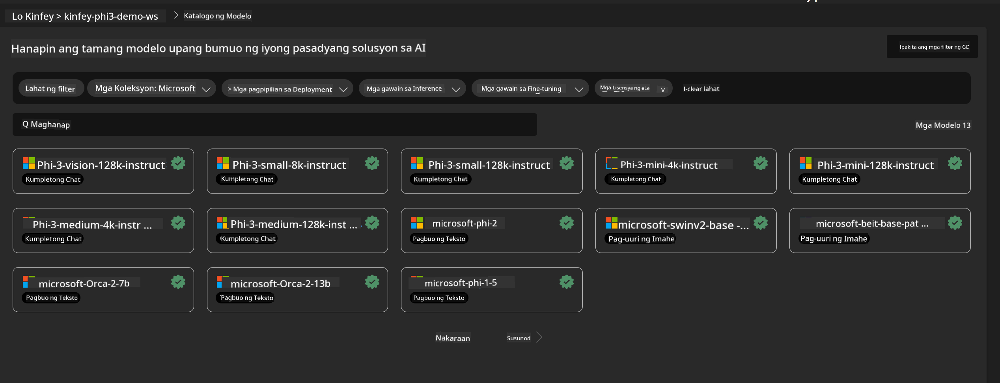
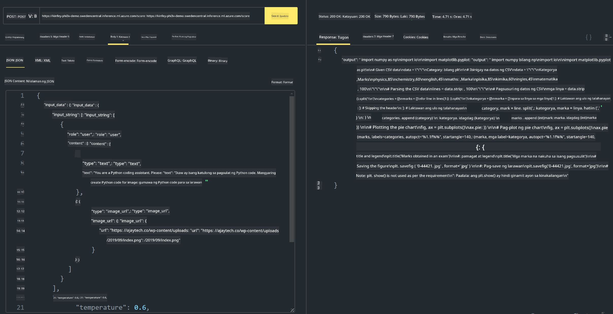

<!--
CO_OP_TRANSLATOR_METADATA:
{
  "original_hash": "20cb4e6ac1686248e8be913ccf6c2bc2",
  "translation_date": "2025-05-09T19:44:41+00:00",
  "source_file": "md/02.Application/02.Code/Phi3/VSCodeExt/HOL/Apple/03.DeployPhi3VisionOnAzure.md",
  "language_code": "tl"
}
-->
# **Lab 3 - I-deploy ang Phi-3-vision sa Azure Machine Learning Service**

Ginagamit natin ang NPU para matapos ang production deployment ng lokal na code, at ngayon gusto nating ipakilala ang kakayahan ng PHI-3-VISION para makagawa ng code mula sa mga larawan.

Sa gabay na ito, mabilis tayong makakagawa ng Model As Service na Phi-3 Vision service sa Azure Machine Learning Service.

***Note***：Kailangan ng Phi-3 Vision ng mataas na computing power para mas mabilis makabuo ng content. Kailangan natin ng cloud computing para matulungan tayo dito.

### **1. Gumawa ng Azure Machine Learning Service**

Kailangan nating gumawa ng Azure Machine Learning Service sa Azure Portal. Kung gusto mong matutunan kung paano, bisitahin ang link na ito [https://learn.microsoft.com/azure/machine-learning/quickstart-create-resources?view=azureml-api-2](https://learn.microsoft.com/azure/machine-learning/quickstart-create-resources?view=azureml-api-2)

### **2. Piliin ang Phi-3 Vision sa Azure Machine Learning Service**



### **3. I-deploy ang Phi-3-Vision sa Azure**


### **4. Subukan ang Endpoint sa Postman**



***Note***

1. Ang mga parameter na ipapasa ay kailangang may kasamang Authorization, azureml-model-deployment, at Content-Type. Kailangan mong tingnan ang deployment info para makuha ito.

2. Para magpadala ng parameter, kailangang magpadala ang Phi-3-Vision ng image link. Sundan ang paraan ng GPT-4-Vision sa pagpapasa ng mga parameter, tulad ng

```json

{
  "input_data":{
    "input_string":[
      {
        "role":"user",
        "content":[ 
          {
            "type": "text",
            "text": "You are a Python coding assistant.Please create Python code for image "
          },
          {
              "type": "image_url",
              "image_url": {
                "url": "https://ajaytech.co/wp-content/uploads/2019/09/index.png"
              }
          }
        ]
      }
    ],
    "parameters":{
          "temperature": 0.6,
          "top_p": 0.9,
          "do_sample": false,
          "max_new_tokens": 2048
    }
  }
}

```

3. Tawagin ang **/score** gamit ang Post method

**Congratulations**! Natapos mo na ang mabilisang PHI-3-VISION deployment at nasubukan kung paano gumawa ng code gamit ang mga larawan. Sa susunod, maaari na tayong gumawa ng mga application gamit ang kombinasyon ng NPU at cloud.

**Paalala**:  
Ang dokumentong ito ay isinalin gamit ang serbisyong AI na pagsasalin [Co-op Translator](https://github.com/Azure/co-op-translator). Bagamat nagsusumikap kaming maging tumpak, pakatandaan na ang awtomatikong pagsasalin ay maaaring maglaman ng mga pagkakamali o di-tumpak na impormasyon. Ang orihinal na dokumento sa orihinal nitong wika ang dapat ituring na pangunahing sanggunian. Para sa mahahalagang impormasyon, inirerekomenda ang propesyonal na pagsasaling-tao. Hindi kami mananagot sa anumang hindi pagkakaintindihan o maling interpretasyon na maaaring magmula sa paggamit ng pagsasaling ito.