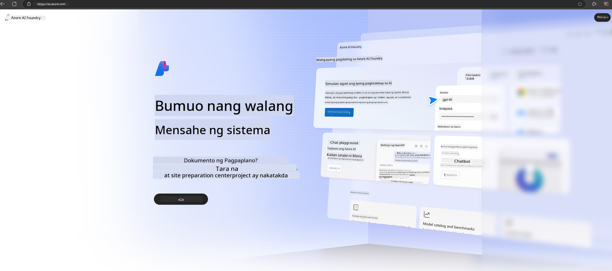

<!--
CO_OP_TRANSLATOR_METADATA:
{
  "original_hash": "3a1e48b628022485aac989c9f733e792",
  "translation_date": "2025-05-09T20:13:50+00:00",
  "source_file": "md/02.QuickStart/AzureAIFoundry_QuickStart.md",
  "language_code": "tl"
}
-->
# **Paggamit ng Phi-3 sa Azure AI Foundry**

Sa pag-unlad ng Generative AI, nais naming gumamit ng isang pinag-isang platform upang pamahalaan ang iba't ibang LLM at SLM, integrasyon ng datos ng enterprise, fine-tuning/RAG na mga operasyon, at pagsusuri ng iba't ibang negosyo ng enterprise pagkatapos pagsamahin ang LLM at SLM, atbp., upang mas mahusay na maipatupad ang mga Smart na aplikasyon ng generative AI. Ang [Azure AI Foundry](https://ai.azure.com) ay isang enterprise-level na platform para sa generative AI na aplikasyon.

Sa Azure AI Foundry, maaari mong suriin ang mga sagot ng large language model (LLM) at i-orchestrate ang mga prompt application components gamit ang prompt flow para sa mas magandang performance. Pinapadali ng platform ang scalability upang gawing ganap na produksyon ang mga proof of concept nang madali. Ang tuloy-tuloy na pagmamanman at pagpapahusay ay sumusuporta sa pangmatagalang tagumpay.

Mabilis nating maideploy ang Phi-3 model sa Azure AI Foundry sa pamamagitan ng simpleng mga hakbang, at pagkatapos ay gamitin ang Azure AI Foundry upang kumpletuhin ang mga kaugnay na gawain tulad ng Playground/Chat, Fine-tuning, pagsusuri, at iba pa para sa Phi-3.

## **1. Paghahanda**

Kung mayroon ka nang naka-install na [Azure Developer CLI](https://learn.microsoft.com/azure/developer/azure-developer-cli/overview?WT.mc_id=aiml-138114-kinfeylo) sa iyong makina, ang paggamit ng template na ito ay kasing dali ng pagpapatakbo ng command na ito sa isang bagong direktoryo.

## Manual na Paglikha

Ang paglikha ng Microsoft Azure AI Foundry project at hub ay isang mahusay na paraan upang ayusin at pamahalaan ang iyong AI na trabaho. Narito ang hakbang-hakbang na gabay upang makapagsimula ka:

### Paglikha ng Project sa Azure AI Foundry

1. **Pumunta sa Azure AI Foundry**: Mag-sign in sa Azure AI Foundry portal.
2. **Gumawa ng Project**:
   - Kung nasa loob ka ng isang project, piliin ang "Azure AI Foundry" sa itaas kaliwa ng pahina para pumunta sa Home page.
   - Piliin ang "+ Create project".
   - Ilagay ang pangalan ng project.
   - Kung mayroon kang hub, ito ang awtomatikong pipiliin. Kung may access ka sa higit sa isang hub, maaari kang pumili ng iba mula sa dropdown. Kung gusto mong gumawa ng bagong hub, piliin ang "Create new hub" at magbigay ng pangalan.
   - Piliin ang "Create".

### Paglikha ng Hub sa Azure AI Foundry

1. **Pumunta sa Azure AI Foundry**: Mag-sign in gamit ang iyong Azure account.
2. **Gumawa ng Hub**:
   - Piliin ang Management center mula sa kaliwang menu.
   - Piliin ang "All resources", pagkatapos ang down arrow sa tabi ng "+ New project" at piliin ang "+ New hub".
   - Sa dialog ng "Create a new hub", ilagay ang pangalan ng iyong hub (halimbawa, contoso-hub) at baguhin ang iba pang mga field ayon sa gusto.
   - Piliin ang "Next", suriin ang impormasyon, at pagkatapos ay piliin ang "Create".

Para sa mas detalyadong mga tagubilin, maaari kang tumingin sa opisyal na [Microsoft documentation](https://learn.microsoft.com/azure/ai-studio/how-to/create-projects).

Pagkatapos ng matagumpay na paglikha, maaari mong ma-access ang studio na ginawa mo sa pamamagitan ng [ai.azure.com](https://ai.azure.com/)

Maaaring magkaroon ng maraming proyekto sa isang AI Foundry. Gumawa ng proyekto sa AI Foundry bilang paghahanda.

Gumawa ng Azure AI Foundry [QuickStarts](https://learn.microsoft.com/azure/ai-studio/quickstarts/get-started-code)

## **2. I-deploy ang Phi model sa Azure AI Foundry**

I-click ang Explore na opsyon ng proyekto upang pumasok sa Model Catalog at piliin ang Phi-3

Piliin ang Phi-3-mini-4k-instruct

I-click ang 'Deploy' upang i-deploy ang Phi-3-mini-4k-instruct na modelo

> [!NOTE]
>
> Maaari kang pumili ng computing power kapag nagde-deploy

## **3. Playground Chat Phi sa Azure AI Foundry**

Pumunta sa deployment page, piliin ang Playground, at makipag-chat sa Phi-3 ng Azure AI Foundry

## **4. Pagde-deploy ng Modelo mula sa Azure AI Foundry**

Para mag-deploy ng modelo mula sa Azure Model Catalog, sundin ang mga hakbang na ito:

- Mag-sign in sa Azure AI Foundry.
- Piliin ang modelong nais mong i-deploy mula sa Azure AI Foundry model catalog.
- Sa Details page ng modelo, piliin ang Deploy at pagkatapos ay piliin ang Serverless API kasama ang Azure AI Content Safety.
- Piliin ang project kung saan mo nais i-deploy ang iyong mga modelo. Para magamit ang Serverless API offering, ang iyong workspace ay dapat kabilang sa East US 2 o Sweden Central region. Maaari mong i-customize ang Deployment name.
- Sa deployment wizard, piliin ang Pricing and terms para malaman ang mga presyo at patakaran ng paggamit.
- Piliin ang Deploy. Maghintay hanggang maging handa ang deployment at ikaw ay mare-redirect sa Deployments page.
- Piliin ang Open in playground upang simulan ang pakikipag-ugnayan sa modelo.
- Maaari kang bumalik sa Deployments page, piliin ang deployment, at tandaan ang endpoint na Target URL at ang Secret Key, na maaari mong gamitin para tawagan ang deployment at gumawa ng mga completion.
- Palagi mong mahahanap ang mga detalye ng endpoint, URL, at access keys sa pamamagitan ng pagpunta sa Build tab at pagpili ng Deployments mula sa Components section.

> [!NOTE]
> Pakitandaan na ang iyong account ay dapat may Azure AI Developer role permissions sa Resource Group upang maisagawa ang mga hakbang na ito.

## **5. Paggamit ng Phi API sa Azure AI Foundry**

Maaari mong ma-access ang https://{Your project name}.region.inference.ml.azure.com/swagger.json gamit ang Postman GET at pagsamahin ito sa Key upang malaman ang mga ibinigay na interface

Napakadali mong makukuha ang mga request parameters, pati na rin ang mga response parameters.

**Paalala**:  
Ang dokumentong ito ay isinalin gamit ang AI translation service na [Co-op Translator](https://github.com/Azure/co-op-translator). Bagamat nagsusumikap kami para sa katumpakan, pakatandaan na ang mga awtomatikong pagsasalin ay maaaring maglaman ng mga pagkakamali o hindi pagkakatugma. Ang orihinal na dokumento sa kanyang likas na wika ang dapat ituring na pangunahing sanggunian. Para sa mahahalagang impormasyon, inirerekomenda ang propesyonal na pagsasaling-tao. Hindi kami mananagot sa anumang hindi pagkakaunawaan o maling interpretasyon na nagmula sa paggamit ng pagsasaling ito.