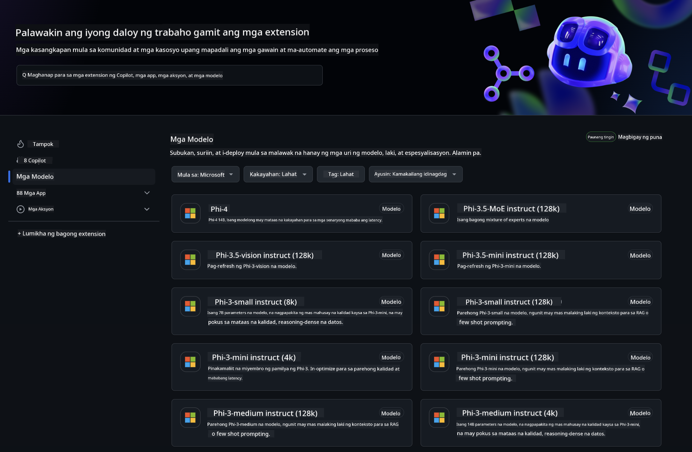

<!--
CO_OP_TRANSLATOR_METADATA:
{
  "original_hash": "5113634b77370af6790f9697d5d7de90",
  "translation_date": "2025-07-17T05:40:05+00:00",
  "source_file": "md/02.QuickStart/GitHubModel_QuickStart.md",
  "language_code": "tl"
}
-->
## GitHub Models - Limitadong Pampublikong Beta

Maligayang pagdating sa [GitHub Models](https://github.com/marketplace/models)! Nakaayos na ang lahat at handa ka nang tuklasin ang mga AI Models na naka-host sa Azure AI.



Para sa karagdagang impormasyon tungkol sa mga Models na available sa GitHub Models, bisitahin ang [GitHub Model Marketplace](https://github.com/marketplace/models)

## Mga Available na Models

Bawat modelo ay may sariling playground at sample code


### Phi-3 Models sa GitHub Model Catalog

[Phi-3-Medium-128k-Instruct](https://github.com/marketplace/models/azureml/Phi-3-medium-128k-instruct)

[Phi-3-medium-4k-instruct](https://github.com/marketplace/models/azureml/Phi-3-medium-4k-instruct)

[Phi-3-mini-128k-instruct](https://github.com/marketplace/models/azureml/Phi-3-mini-128k-instruct)

[Phi-3-mini-4k-instruct](https://github.com/marketplace/models/azureml/Phi-3-mini-4k-instruct)

[Phi-3-small-128k-instruct](https://github.com/marketplace/models/azureml/Phi-3-small-128k-instruct)

[Phi-3-small-8k-instruct](https://github.com/marketplace/models/azureml/Phi-3-small-8k-instruct)

## Pagsisimula

May ilang mga pangunahing halimbawa na handa nang patakbuhin. Makikita mo ang mga ito sa samples directory. Kung gusto mong direktang pumunta sa paborito mong wika, makikita mo ang mga halimbawa sa mga sumusunod na Wika:

- Python
- JavaScript
- cURL

Mayroon ding nakalaang Codespaces Environment para sa pagpapatakbo ng mga samples at models.


## Sample Code

Narito ang mga halimbawa ng code snippets para sa ilang mga gamit. Para sa karagdagang impormasyon tungkol sa Azure AI Inference SDK, tingnan ang buong dokumentasyon at mga sample.

## Setup

1. Gumawa ng personal access token  
Hindi mo kailangang magbigay ng anumang permiso sa token. Tandaan na ang token ay ipapadala sa isang Microsoft service.

Para magamit ang mga code snippets sa ibaba, gumawa ng environment variable para itakda ang iyong token bilang key para sa client code.

Kung gumagamit ka ng bash:  
```
export GITHUB_TOKEN="<your-github-token-goes-here>"
```  
Kung nasa powershell ka:  

```
$Env:GITHUB_TOKEN="<your-github-token-goes-here>"
```  

Kung gumagamit ka ng Windows command prompt:  

```
set GITHUB_TOKEN=<your-github-token-goes-here>
```  

## Python Sample

### I-install ang mga dependencies  
I-install ang Azure AI Inference SDK gamit ang pip (Kinakailangan: Python >=3.8):

```
pip install azure-ai-inference
```  
### Patakbuhin ang isang simpleng halimbawa ng code

Ipinapakita ng sample na ito ang isang simpleng tawag sa chat completion API. Ginagamit nito ang GitHub AI model inference endpoint at ang iyong GitHub token. Ang tawag ay synchronous.

```
import os
from azure.ai.inference import ChatCompletionsClient
from azure.ai.inference.models import SystemMessage, UserMessage
from azure.core.credentials import AzureKeyCredential

endpoint = "https://models.inference.ai.azure.com"
# Replace Model_Name 
model_name = "Phi-3-small-8k-instruct"
token = os.environ["GITHUB_TOKEN"]

client = ChatCompletionsClient(
    endpoint=endpoint,
    credential=AzureKeyCredential(token),
)

response = client.complete(
    messages=[
        SystemMessage(content="You are a helpful assistant."),
        UserMessage(content="What is the capital of France?"),
    ],
    model=model_name,
    temperature=1.,
    max_tokens=1000,
    top_p=1.
)

print(response.choices[0].message.content)
```

### Patakbuhin ang multi-turn na pag-uusap

Ipinapakita ng sample na ito ang multi-turn na pag-uusap gamit ang chat completion API. Kapag ginagamit ang modelo para sa chat application, kailangan mong pamahalaan ang kasaysayan ng pag-uusap at ipadala ang pinakabagong mga mensahe sa modelo.

```
import os
from azure.ai.inference import ChatCompletionsClient
from azure.ai.inference.models import AssistantMessage, SystemMessage, UserMessage
from azure.core.credentials import AzureKeyCredential

token = os.environ["GITHUB_TOKEN"]
endpoint = "https://models.inference.ai.azure.com"
# Replace Model_Name
model_name = "Phi-3-small-8k-instruct"

client = ChatCompletionsClient(
    endpoint=endpoint,
    credential=AzureKeyCredential(token),
)

messages = [
    SystemMessage(content="You are a helpful assistant."),
    UserMessage(content="What is the capital of France?"),
    AssistantMessage(content="The capital of France is Paris."),
    UserMessage(content="What about Spain?"),
]

response = client.complete(messages=messages, model=model_name)

print(response.choices[0].message.content)
```

### I-stream ang output

Para sa mas magandang karanasan ng user, gusto mong i-stream ang tugon ng modelo upang lumabas agad ang unang token at maiwasan ang paghihintay ng matagal para sa mga mahahabang sagot.

```
import os
from azure.ai.inference import ChatCompletionsClient
from azure.ai.inference.models import SystemMessage, UserMessage
from azure.core.credentials import AzureKeyCredential

token = os.environ["GITHUB_TOKEN"]
endpoint = "https://models.inference.ai.azure.com"
# Replace Model_Name
model_name = "Phi-3-small-8k-instruct"

client = ChatCompletionsClient(
    endpoint=endpoint,
    credential=AzureKeyCredential(token),
)

response = client.complete(
    stream=True,
    messages=[
        SystemMessage(content="You are a helpful assistant."),
        UserMessage(content="Give me 5 good reasons why I should exercise every day."),
    ],
    model=model_name,
)

for update in response:
    if update.choices:
        print(update.choices[0].delta.content or "", end="")

client.close()
```  
## JavaScript

### I-install ang mga dependencies

I-install ang Node.js.

Kopyahin ang mga sumusunod na linya ng teksto at i-save bilang isang file na package.json sa loob ng iyong folder.

```
{
  "type": "module",
  "dependencies": {
    "@azure-rest/ai-inference": "latest",
    "@azure/core-auth": "latest",
    "@azure/core-sse": "latest"
  }
}
```

Tandaan: Ang @azure/core-sse ay kailangan lamang kapag nag-stream ka ng chat completions response.

Buksan ang terminal window sa folder na ito at patakbuhin ang npm install.

Para sa bawat code snippet sa ibaba, kopyahin ang nilalaman sa isang file na sample.js at patakbuhin gamit ang node sample.js.

### Patakbuhin ang isang simpleng halimbawa ng code

Ipinapakita ng sample na ito ang isang simpleng tawag sa chat completion API. Ginagamit nito ang GitHub AI model inference endpoint at ang iyong GitHub token. Ang tawag ay synchronous.

```
import ModelClient from "@azure-rest/ai-inference";
import { AzureKeyCredential } from "@azure/core-auth";

const token = process.env["GITHUB_TOKEN"];
const endpoint = "https://models.inference.ai.azure.com";
// Update your modelname
const modelName = "Phi-3-small-8k-instruct";

export async function main() {

  const client = new ModelClient(endpoint, new AzureKeyCredential(token));

  const response = await client.path("/chat/completions").post({
    body: {
      messages: [
        { role:"system", content: "You are a helpful assistant." },
        { role:"user", content: "What is the capital of France?" }
      ],
      model: modelName,
      temperature: 1.,
      max_tokens: 1000,
      top_p: 1.
    }
  });

  if (response.status !== "200") {
    throw response.body.error;
  }
  console.log(response.body.choices[0].message.content);
}

main().catch((err) => {
  console.error("The sample encountered an error:", err);
});
```

### Patakbuhin ang multi-turn na pag-uusap

Ipinapakita ng sample na ito ang multi-turn na pag-uusap gamit ang chat completion API. Kapag ginagamit ang modelo para sa chat application, kailangan mong pamahalaan ang kasaysayan ng pag-uusap at ipadala ang pinakabagong mga mensahe sa modelo.

```
import ModelClient from "@azure-rest/ai-inference";
import { AzureKeyCredential } from "@azure/core-auth";

const token = process.env["GITHUB_TOKEN"];
const endpoint = "https://models.inference.ai.azure.com";
// Update your modelname
const modelName = "Phi-3-small-8k-instruct";

export async function main() {

  const client = new ModelClient(endpoint, new AzureKeyCredential(token));

  const response = await client.path("/chat/completions").post({
    body: {
      messages: [
        { role: "system", content: "You are a helpful assistant." },
        { role: "user", content: "What is the capital of France?" },
        { role: "assistant", content: "The capital of France is Paris." },
        { role: "user", content: "What about Spain?" },
      ],
      model: modelName,
    }
  });

  if (response.status !== "200") {
    throw response.body.error;
  }

  for (const choice of response.body.choices) {
    console.log(choice.message.content);
  }
}

main().catch((err) => {
  console.error("The sample encountered an error:", err);
});
```

### I-stream ang output  
Para sa mas magandang karanasan ng user, gusto mong i-stream ang tugon ng modelo upang lumabas agad ang unang token at maiwasan ang paghihintay ng matagal para sa mga mahahabang sagot.

```
import ModelClient from "@azure-rest/ai-inference";
import { AzureKeyCredential } from "@azure/core-auth";
import { createSseStream } from "@azure/core-sse";

const token = process.env["GITHUB_TOKEN"];
const endpoint = "https://models.inference.ai.azure.com";
// Update your modelname
const modelName = "Phi-3-small-8k-instruct";

export async function main() {

  const client = new ModelClient(endpoint, new AzureKeyCredential(token));

  const response = await client.path("/chat/completions").post({
    body: {
      messages: [
        { role: "system", content: "You are a helpful assistant." },
        { role: "user", content: "Give me 5 good reasons why I should exercise every day." },
      ],
      model: modelName,
      stream: true
    }
  }).asNodeStream();

  const stream = response.body;
  if (!stream) {
    throw new Error("The response stream is undefined");
  }

  if (response.status !== "200") {
    stream.destroy();
    throw new Error(`Failed to get chat completions, http operation failed with ${response.status} code`);
  }

  const sseStream = createSseStream(stream);

  for await (const event of sseStream) {
    if (event.data === "[DONE]") {
      return;
    }
    for (const choice of (JSON.parse(event.data)).choices) {
        process.stdout.write(choice.delta?.content ?? ``);
    }
  }
}

main().catch((err) => {
  console.error("The sample encountered an error:", err);
});
```

## REST

### Patakbuhin ang isang simpleng halimbawa ng code

I-paste ang sumusunod sa shell:

```
curl -X POST "https://models.inference.ai.azure.com/chat/completions" \
    -H "Content-Type: application/json" \
    -H "Authorization: Bearer $GITHUB_TOKEN" \
    -d '{
        "messages": [
            {
                "role": "system",
                "content": "You are a helpful assistant."
            },
            {
                "role": "user",
                "content": "What is the capital of France?"
            }
        ],
        "model": "Phi-3-small-8k-instruct"
    }'
```  
### Patakbuhin ang multi-turn na pag-uusap

Tawagan ang chat completion API at ipasa ang kasaysayan ng chat:

```
curl -X POST "https://models.inference.ai.azure.com/chat/completions" \
    -H "Content-Type: application/json" \
    -H "Authorization: Bearer $GITHUB_TOKEN" \
    -d '{
        "messages": [
            {
                "role": "system",
                "content": "You are a helpful assistant."
            },
            {
                "role": "user",
                "content": "What is the capital of France?"
            },
            {
                "role": "assistant",
                "content": "The capital of France is Paris."
            },
            {
                "role": "user",
                "content": "What about Spain?"
            }
        ],
        "model": "Phi-3-small-8k-instruct"
    }'
```  
### I-stream ang output

Ito ay isang halimbawa ng pagtawag sa endpoint at pag-stream ng tugon.

```
curl -X POST "https://models.inference.ai.azure.com/chat/completions" \
    -H "Content-Type: application/json" \
    -H "Authorization: Bearer $GITHUB_TOKEN" \
    -d '{
        "messages": [
            {
                "role": "system",
                "content": "You are a helpful assistant."
            },
            {
                "role": "user",
                "content": "Give me 5 good reasons why I should exercise every day."
            }
        ],
        "stream": true,
        "model": "Phi-3-small-8k-instruct"
    }'
```

## LIBRENG Paggamit at Rate limits para sa GitHub Models


Ang [rate limits para sa playground at libreng paggamit ng API](https://docs.github.com/en/github-models/prototyping-with-ai-models#rate-limits) ay nilalayong tulungan kang mag-eksperimento sa mga modelo at gumawa ng prototype ng iyong AI application. Para sa paggamit na lampas sa mga limitasyong iyon, at para mapalawak ang iyong aplikasyon, kailangan mong mag-provision ng mga resources mula sa isang Azure account, at mag-authenticate mula doon sa halip na gamit ang iyong GitHub personal access token. Hindi mo kailangang baguhin ang iba pang bahagi ng iyong code. Gamitin ang link na ito para malaman kung paano lumampas sa mga libreng tier limits sa Azure AI.

### Mga Paalala

Tandaan na kapag nakikipag-ugnayan ka sa isang modelo, ikaw ay nag-eeksperimento sa AI, kaya posibleng may mga pagkakamali sa nilalaman.

Ang feature ay may iba't ibang limitasyon (kabilang ang requests kada minuto, requests kada araw, tokens kada request, at sabay-sabay na requests) at hindi ito idinisenyo para sa production use cases.

Gumagamit ang GitHub Models ng Azure AI Content Safety. Hindi maaaring i-disable ang mga filter na ito bilang bahagi ng karanasan sa GitHub Models. Kung magpapasya kang gumamit ng mga modelo sa pamamagitan ng isang bayad na serbisyo, pakikonpigura ang iyong mga content filter ayon sa iyong mga pangangailangan.

Ang serbisyong ito ay sakop ng GitHub’s Pre-release Terms.

**Paalala**:  
Ang dokumentong ito ay isinalin gamit ang AI translation service na [Co-op Translator](https://github.com/Azure/co-op-translator). Bagamat nagsusumikap kami para sa katumpakan, pakatandaan na ang mga awtomatikong pagsasalin ay maaaring maglaman ng mga pagkakamali o di-tumpak na impormasyon. Ang orihinal na dokumento sa orihinal nitong wika ang dapat ituring na pangunahing sanggunian. Para sa mahahalagang impormasyon, inirerekomenda ang propesyonal na pagsasalin ng tao. Hindi kami mananagot sa anumang hindi pagkakaunawaan o maling interpretasyon na maaaring magmula sa paggamit ng pagsasaling ito.