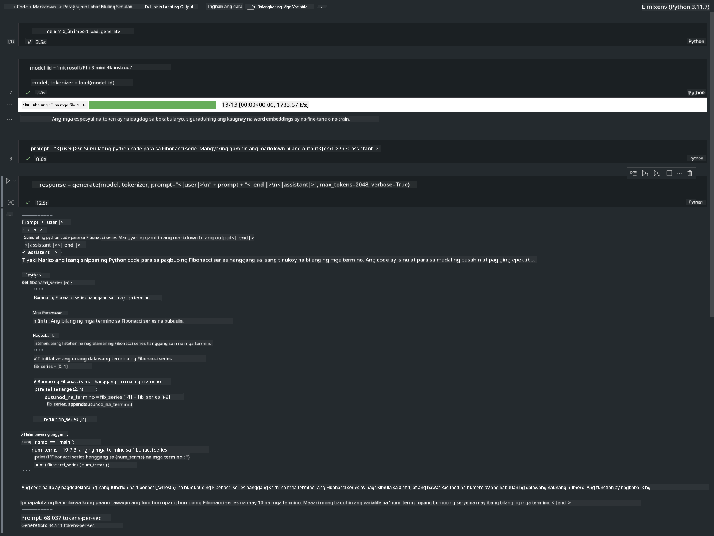

<!--
CO_OP_TRANSLATOR_METADATA:
{
  "original_hash": "dcb656f3d206fc4968e236deec5d4384",
  "translation_date": "2025-07-17T10:08:28+00:00",
  "source_file": "md/03.FineTuning/03.Inference/MLX_Inference.md",
  "language_code": "tl"
}
-->
# **Inference Phi-3 gamit ang Apple MLX Framework**

## **Ano ang MLX Framework**

Ang MLX ay isang array framework para sa pananaliksik sa machine learning sa Apple silicon, na inilabas ng Apple machine learning research.

Ang MLX ay dinisenyo ng mga mananaliksik sa machine learning para sa mga mananaliksik sa machine learning. Layunin ng framework na maging madaling gamitin, ngunit epektibo pa rin sa pag-train at pag-deploy ng mga modelo. Ang disenyo ng framework mismo ay simple rin sa konsepto. Nais naming gawing madali para sa mga mananaliksik na palawakin at pagbutihin ang MLX upang mabilis na makapag-eksperimento ng mga bagong ideya.

Maaaring pabilisin ang LLMs sa mga Apple Silicon device gamit ang MLX, at maaaring patakbuhin ang mga modelo nang lokal nang napakadali.

## **Paggamit ng MLX para mag-inference ng Phi-3-mini**

### **1. I-setup ang iyong MLX environment**

1. Python 3.11.x  
2. I-install ang MLX Library

```bash

pip install mlx-lm

```

### **2. Patakbuhin ang Phi-3-mini sa Terminal gamit ang MLX**

```bash

python -m mlx_lm.generate --model microsoft/Phi-3-mini-4k-instruct --max-token 2048 --prompt  "<|user|>\nCan you introduce yourself<|end|>\n<|assistant|>"

```

Ang resulta (ang aking environment ay Apple M1 Max, 64GB) ay


### **3. Pag-quantize ng Phi-3-mini gamit ang MLX sa Terminal**

```bash

python -m mlx_lm.convert --hf-path microsoft/Phi-3-mini-4k-instruct

```

***Note：*** Maaaring i-quantize ang modelo gamit ang mlx_lm.convert, at ang default na quantization ay INT4. Sa halimbawang ito, kino-quantize ang Phi-3-mini sa INT4.

Maaaring i-quantize ang modelo gamit ang mlx_lm.convert, at ang default na quantization ay INT4. Ang halimbawang ito ay para i-quantize ang Phi-3-mini sa INT4. Pagkatapos ng quantization, ito ay mase-save sa default na direktoryo na ./mlx_model

Maaari nating subukan ang na-quantize na modelo gamit ang MLX mula sa terminal

```bash

python -m mlx_lm.generate --model ./mlx_model/ --max-token 2048 --prompt  "<|user|>\nCan you introduce yourself<|end|>\n<|assistant|>"

```

Ang resulta ay


### **4. Patakbuhin ang Phi-3-mini gamit ang MLX sa Jupyter Notebook**



***Note:*** Pakibasa ang sample na ito [click this link](../../../../../code/03.Inference/MLX/MLX_DEMO.ipynb)

## **Mga Resources**

1. Alamin ang tungkol sa Apple MLX Framework [https://ml-explore.github.io](https://ml-explore.github.io/mlx/build/html/index.html)

2. Apple MLX GitHub Repo [https://github.com/ml-explore](https://github.com/ml-explore)

**Paalala**:  
Ang dokumentong ito ay isinalin gamit ang AI translation service na [Co-op Translator](https://github.com/Azure/co-op-translator). Bagamat nagsusumikap kami para sa katumpakan, pakatandaan na ang mga awtomatikong pagsasalin ay maaaring maglaman ng mga pagkakamali o di-tumpak na impormasyon. Ang orihinal na dokumento sa orihinal nitong wika ang dapat ituring na pangunahing sanggunian. Para sa mahahalagang impormasyon, inirerekomenda ang propesyonal na pagsasalin ng tao. Hindi kami mananagot sa anumang hindi pagkakaunawaan o maling interpretasyon na maaaring magmula sa paggamit ng pagsasaling ito.