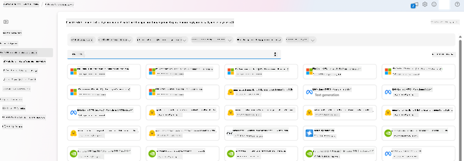
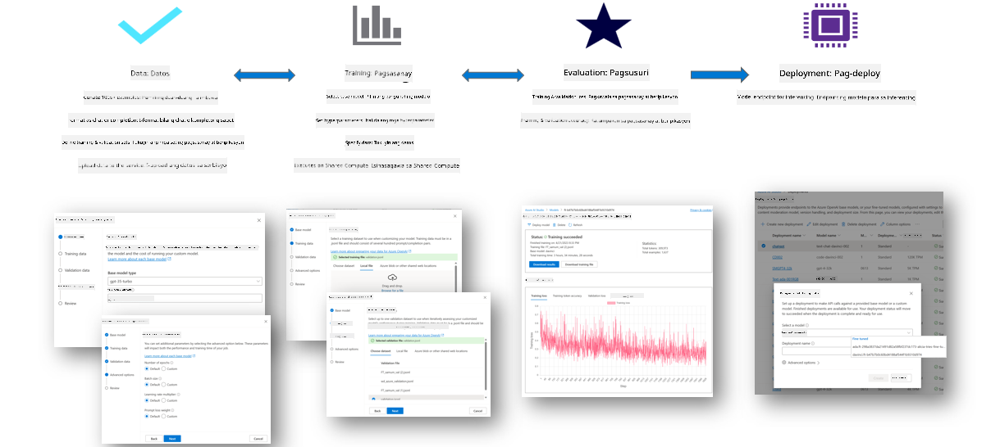
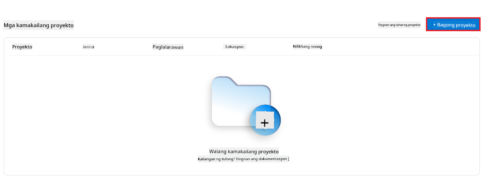
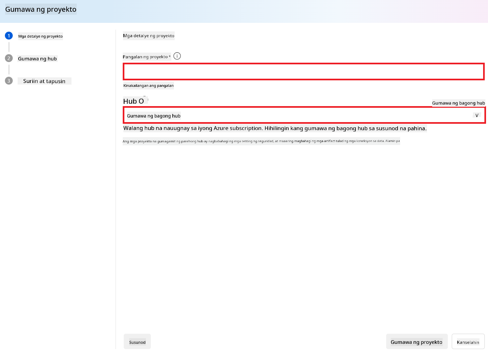
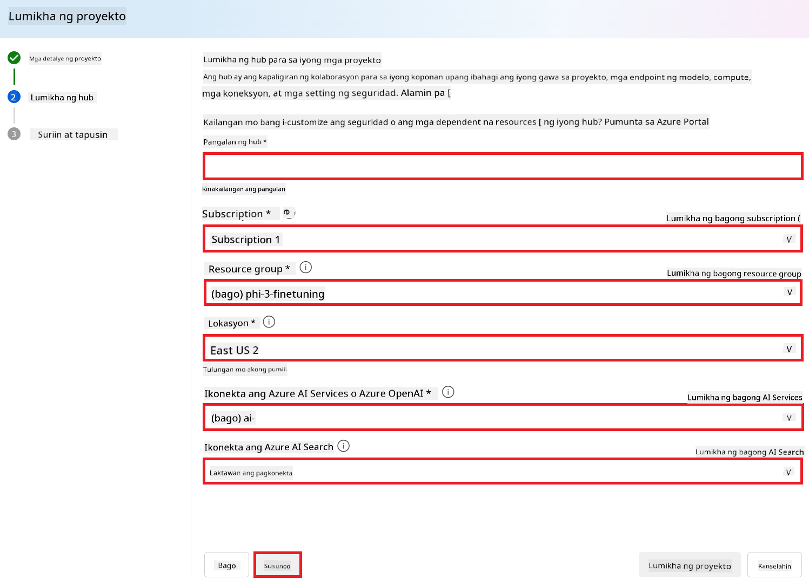
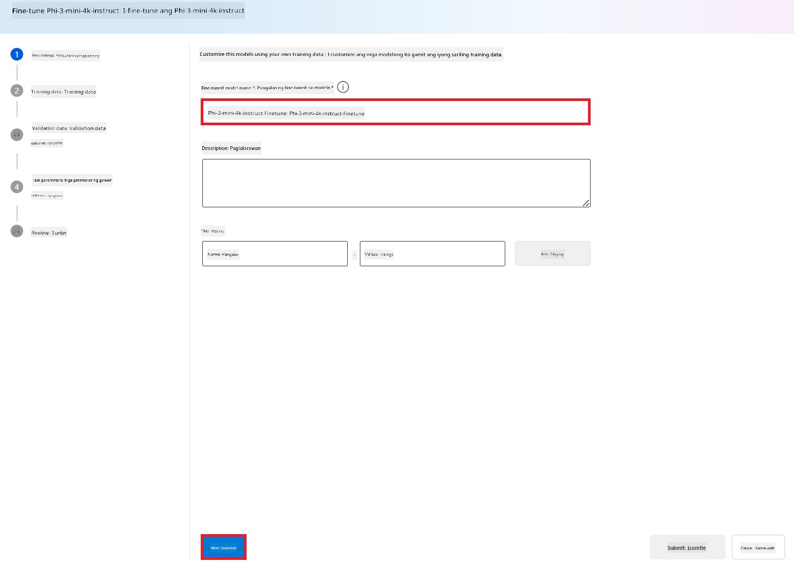
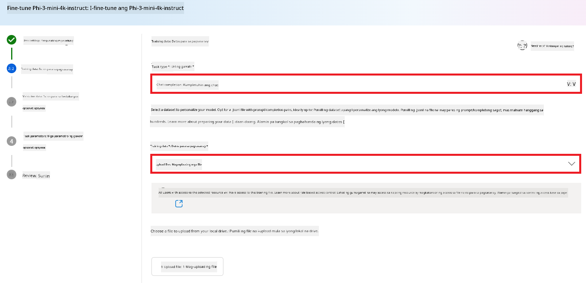
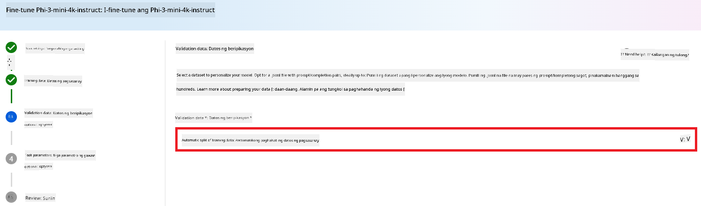
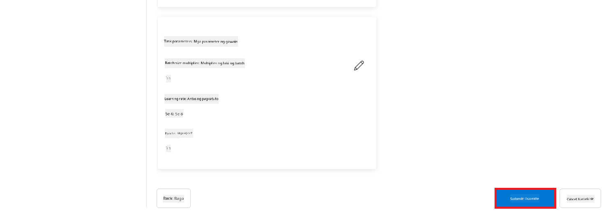
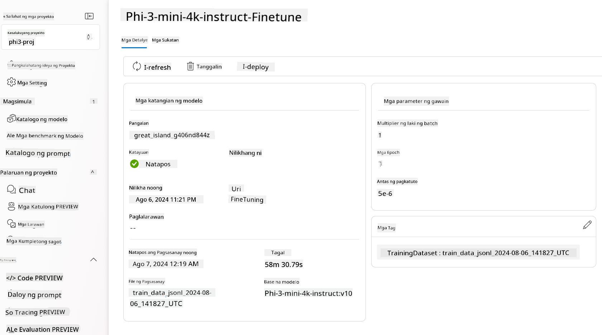

<!--
CO_OP_TRANSLATOR_METADATA:
{
  "original_hash": "c1559c5af6caccf6f623fd43a6b3a9a3",
  "translation_date": "2025-07-17T06:10:35+00:00",
  "source_file": "md/03.FineTuning/FineTuning_AIFoundry.md",
  "language_code": "tl"
}
-->
# Fine-tuning ng Phi-3 gamit ang Azure AI Foundry

Tuklasin natin kung paano i-fine-tune ang Microsoft Phi-3 Mini language model gamit ang Azure AI Foundry. Ang fine-tuning ay nagbibigay-daan upang iakma ang Phi-3 Mini sa mga partikular na gawain, kaya mas nagiging makapangyarihan at mas nauunawaan ang konteksto nito.

## Mga Dapat Isaalang-alang

- **Kakayahan:** Aling mga modelo ang maaaring i-fine tune? Ano ang mga kayang gawin ng base model kapag na-fine tune?
- **Gastos:** Ano ang modelo ng pagpepresyo para sa fine tuning?
- **Customizability:** Gaano kalawak ang pwedeng baguhin sa base model – at sa anong mga paraan?
- **Kaginhawaan:** Paano nga ba nangyayari ang fine tuning – kailangan ba akong magsulat ng custom code? Kailangan ko bang magdala ng sarili kong compute?
- **Kaligtasan:** Kilala ang mga fine-tuned na modelo na may mga panganib sa kaligtasan – may mga guardrails ba para maiwasan ang hindi inaasahang pinsala?



## Paghahanda para sa fine-tuning

### Mga Kinakailangan

> [!NOTE]
> Para sa mga Phi-3 family models, ang pay-as-you-go na fine-tune offering ay available lamang sa mga hub na ginawa sa **East US 2** na mga rehiyon.

- Isang Azure subscription. Kung wala ka pang Azure subscription, gumawa ng [paid Azure account](https://azure.microsoft.com/pricing/purchase-options/pay-as-you-go) upang makapagsimula.

- Isang [AI Foundry project](https://ai.azure.com?WT.mc_id=aiml-138114-kinfeylo).
- Ginagamit ang Azure role-based access controls (Azure RBAC) para bigyan ng access sa mga operasyon sa Azure AI Foundry. Para magawa ang mga hakbang sa artikulong ito, kailangang naka-assign ang iyong user account sa __Azure AI Developer role__ sa resource group.

### Pagrehistro ng subscription provider

Siguraduhing naka-register ang subscription sa `Microsoft.Network` resource provider.

1. Mag-sign in sa [Azure portal](https://portal.azure.com).
1. Piliin ang **Subscriptions** mula sa kaliwang menu.
1. Piliin ang subscription na nais mong gamitin.
1. Piliin ang **AI project settings** > **Resource providers** mula sa kaliwang menu.
1. Kumpirmahin na ang **Microsoft.Network** ay nasa listahan ng resource providers. Kung wala, idagdag ito.

### Paghahanda ng data

Ihanda ang iyong training at validation data para i-fine tune ang iyong modelo. Ang iyong training data at validation data sets ay binubuo ng mga input at output na halimbawa kung paano mo nais na gumana ang modelo.

Siguraduhing lahat ng iyong training examples ay sumusunod sa inaasahang format para sa inference. Para maging epektibo ang fine-tuning, tiyaking balanse at iba-iba ang dataset.

Kasama dito ang pagpapanatili ng balanse ng data, pagsasama ng iba't ibang senaryo, at pana-panahong pag-aayos ng training data upang tumugma sa mga inaasahan sa totoong mundo, na magreresulta sa mas tumpak at balanseng mga sagot ng modelo.

Iba't ibang uri ng modelo ang nangangailangan ng iba't ibang format ng training data.

### Chat Completion

Ang training at validation data na gagamitin mo **ay dapat** naka-format bilang JSON Lines (JSONL) na dokumento. Para sa `Phi-3-mini-128k-instruct`, ang fine-tuning dataset ay kailangang naka-format sa conversational format na ginagamit ng Chat completions API.

### Halimbawa ng format ng file

```json
    {"messages": [{"role": "system", "content": "You are an Xbox customer support agent whose primary goal is to help users with issues they are experiencing with their Xbox devices. You are friendly and concise. You only provide factual answers to queries, and do not provide answers that are not related to Xbox."}, {"role": "user", "content": "Is Xbox better than PlayStation?"}, {"role": "assistant", "content": "I apologize, but I cannot provide personal opinions. My primary job is to assist you with any issues related to your Xbox device. Do you have any Xbox-related issues that need addressing?"}]}
    {"messages": [{"role": "system", "content": "You are an Xbox customer support agent whose primary goal is to help users with issues they are experiencing with their Xbox devices. You are friendly and concise. You only provide factual answers to queries, and do not provide answers that are not related to Xbox."}, {"role": "user", "content": "Can I play PC games on my Xbox?"}, {"role": "assistant", "content": "While Xbox consoles don't natively support PC games, they can play an array of Xbox games, many of which are also available on PC. Can I assist you with finding games compatible with your Xbox device?"}]}
    {"messages": [{"role": "system", "content": "You are an Xbox customer support agent whose primary goal is to help users with issues they are experiencing with their Xbox devices. You are friendly and concise. You only provide factual answers to queries, and do not provide answers that are not related to Xbox."}, {"role": "user", "content": "I'm having trouble connecting my Xbox to the Wi-Fi."}, {"role": "assistant", "content": "No worries, let's go through the network settings on your Xbox. Can you please tell me what happens when you try to connect it to the Wi-Fi?"}]}
```

Ang suportadong uri ng file ay JSON Lines. Ina-upload ang mga file sa default datastore at nagiging available sa iyong proyekto.

## Fine-Tuning ng Phi-3 gamit ang Azure AI Foundry

Pinapayagan ka ng Azure AI Foundry na i-customize ang malalaking language models gamit ang iyong sariling datasets sa pamamagitan ng proseso na tinatawag na fine-tuning. Nagbibigay ang fine-tuning ng malaking halaga sa pamamagitan ng pagpapahintulot ng customisasyon at optimisasyon para sa mga partikular na gawain at aplikasyon. Nagdudulot ito ng mas mahusay na performance, mas matipid na gastos, mas mababang latency, at mga output na nakaangkop sa pangangailangan.



### Gumawa ng Bagong Proyekto

1. Mag-sign in sa [Azure AI Foundry](https://ai.azure.com).

1. Piliin ang **+New project** para gumawa ng bagong proyekto sa Azure AI Foundry.

    

1. Gawin ang mga sumusunod:

    - Pangalan ng Project **Hub name**. Dapat ito ay natatangi.
    - Piliin ang **Hub** na gagamitin (gumawa ng bago kung kinakailangan).

    

1. Gawin ang mga sumusunod para gumawa ng bagong hub:

    - Ilagay ang **Hub name**. Dapat ito ay natatangi.
    - Piliin ang iyong Azure **Subscription**.
    - Piliin ang **Resource group** na gagamitin (gumawa ng bago kung kinakailangan).
    - Piliin ang **Location** na nais mong gamitin.
    - Piliin ang **Connect Azure AI Services** na gagamitin (gumawa ng bago kung kinakailangan).
    - Piliin ang **Connect Azure AI Search** at piliin ang **Skip connecting**.

    

1. Piliin ang **Next**.
1. Piliin ang **Create a project**.

### Paghahanda ng Data

Bago mag-fine-tune, mag-ipon o gumawa ng dataset na may kaugnayan sa iyong gawain, tulad ng mga chat instructions, question-answer pairs, o iba pang kaugnay na text data. Linisin at i-preprocess ang data sa pamamagitan ng pagtanggal ng ingay, pag-aayos ng mga nawawalang halaga, at pag-tokenize ng teksto.

### Fine-tune ang Phi-3 models sa Azure AI Foundry

> [!NOTE]
> Ang fine-tuning ng Phi-3 models ay kasalukuyang sinusuportahan lamang sa mga proyekto na nasa East US 2.

1. Piliin ang **Model catalog** mula sa kaliwang tab.

1. I-type ang *phi-3* sa **search bar** at piliin ang phi-3 model na nais mong gamitin.

    

1. Piliin ang **Fine-tune**.

    

1. Ilagay ang **Fine-tuned model name**.

    

1. Piliin ang **Next**.

1. Gawin ang mga sumusunod:

    - Piliin ang **task type** bilang **Chat completion**.
    - Piliin ang **Training data** na nais mong gamitin. Maaari mo itong i-upload mula sa Azure AI Foundry data o mula sa iyong lokal na kapaligiran.

    

1. Piliin ang **Next**.

1. I-upload ang **Validation data** na nais mong gamitin, o maaari kang pumili ng **Automatic split of training data**.

    

1. Piliin ang **Next**.

1. Gawin ang mga sumusunod:

    - Piliin ang **Batch size multiplier** na nais mong gamitin.
    - Piliin ang **Learning rate** na nais mong gamitin.
    - Piliin ang **Epochs** na nais mong gamitin.

    

1. Piliin ang **Submit** upang simulan ang proseso ng fine-tuning.

    

1. Kapag na-fine-tune na ang iyong modelo, ipapakita ang status bilang **Completed**, tulad ng nasa larawan sa ibaba. Maaari mo nang i-deploy ang modelo at gamitin ito sa iyong sariling aplikasyon, sa playground, o sa prompt flow. Para sa karagdagang impormasyon, tingnan ang [How to deploy Phi-3 family of small language models with Azure AI Foundry](https://learn.microsoft.com/azure/ai-studio/how-to/deploy-models-phi-3?tabs=phi-3-5&pivots=programming-language-python).

    

> [!NOTE]
> Para sa mas detalyadong impormasyon tungkol sa fine-tuning ng Phi-3, bisitahin ang [Fine-tune Phi-3 models in Azure AI Foundry](https://learn.microsoft.com/azure/ai-studio/how-to/fine-tune-phi-3?tabs=phi-3-mini).

## Paglilinis ng iyong mga fine-tuned na modelo

Maaari mong tanggalin ang isang fine-tuned na modelo mula sa listahan ng fine-tuning models sa [Azure AI Foundry](https://ai.azure.com) o mula sa model details page. Piliin ang fine-tuned model na nais tanggalin mula sa Fine-tuning page, pagkatapos ay piliin ang Delete button upang tanggalin ang fine-tuned model.

> [!NOTE]
> Hindi mo maaaring tanggalin ang isang custom model kung ito ay may umiiral na deployment. Kailangan mo munang tanggalin ang deployment bago mo matanggal ang custom model.

## Gastos at quota

### Mga konsiderasyon sa gastos at quota para sa Phi-3 models na fine-tuned bilang serbisyo

Ang mga Phi models na fine-tuned bilang serbisyo ay inaalok ng Microsoft at naka-integrate sa Azure AI Foundry para magamit. Makikita mo ang pagpepresyo kapag [nagde-deploy](https://learn.microsoft.com/azure/ai-studio/how-to/deploy-models-phi-3?tabs=phi-3-5&pivots=programming-language-python) o nag-fine-tune ng mga modelo sa ilalim ng Pricing and terms tab sa deployment wizard.

## Content filtering

Ang mga modelong dineploy bilang serbisyo gamit ang pay-as-you-go ay pinoprotektahan ng Azure AI Content Safety. Kapag dineploy sa real-time endpoints, maaari kang pumili na huwag gamitin ang kakayahang ito. Kapag naka-enable ang Azure AI content safety, parehong ang prompt at completion ay dumadaan sa isang ensemble ng classification models na naglalayong tuklasin at pigilan ang output ng mapanganib na nilalaman. Ang content filtering system ay nakaka-detect at kumikilos sa mga partikular na kategorya ng posibleng mapanganib na nilalaman sa parehong input prompts at output completions. Alamin pa tungkol sa [Azure AI Content Safety](https://learn.microsoft.com/azure/ai-studio/concepts/content-filtering).

**Fine-Tuning Configuration**

Hyperparameters: Tukuyin ang mga hyperparameters tulad ng learning rate, batch size, at bilang ng training epochs.

**Loss Function**

Pumili ng angkop na loss function para sa iyong gawain (hal., cross-entropy).

**Optimizer**

Pumili ng optimizer (hal., Adam) para sa gradient updates habang nagte-train.

**Proseso ng Fine-Tuning**

- I-load ang Pre-Trained Model: I-load ang Phi-3 Mini checkpoint.
- Magdagdag ng Custom Layers: Magdagdag ng mga task-specific layers (hal., classification head para sa chat instructions).

**I-train ang Modelo**  
I-fine-tune ang modelo gamit ang iyong inihandang dataset. Subaybayan ang progreso ng training at ayusin ang mga hyperparameters kung kinakailangan.

**Pagsusuri at Pag-validate**

Validation Set: Hatiin ang iyong data sa training at validation sets.

**Suriin ang Performance**

Gamitin ang mga metrics tulad ng accuracy, F1-score, o perplexity para tasahin ang performance ng modelo.

## I-save ang Fine-Tuned Model

**Checkpoint**  
I-save ang fine-tuned model checkpoint para sa hinaharap na paggamit.

## Deployment

- I-deploy bilang Web Service: I-deploy ang iyong fine-tuned model bilang web service sa Azure AI Foundry.
- Subukan ang Endpoint: Magpadala ng test queries sa deployed endpoint upang tiyakin ang functionality nito.

## Ulitin at Pagbutihin

Ulitin: Kung hindi kasiya-siya ang performance, ulitin ang proseso sa pamamagitan ng pag-aayos ng hyperparameters, pagdagdag ng data, o pag-fine-tune ng mas maraming epochs.

## Subaybayan at Pinuhin

Patuloy na subaybayan ang kilos ng modelo at pinuhin ito kung kinakailangan.

## I-customize at Palawakin

Custom Tasks: Maaaring i-fine-tune ang Phi-3 Mini para sa iba't ibang gawain bukod sa chat instructions. Tuklasin ang iba pang mga gamit!  
Mag-eksperimento: Subukan ang iba't ibang arkitektura, kombinasyon ng layers, at mga teknik upang mapabuti ang performance.

> [!NOTE]
> Ang fine-tuning ay isang paulit-ulit na proseso. Mag-eksperimento, matuto, at iakma ang iyong modelo upang makamit ang pinakamahusay na resulta para sa iyong partikular na gawain!

**Paalala**:  
Ang dokumentong ito ay isinalin gamit ang AI translation service na [Co-op Translator](https://github.com/Azure/co-op-translator). Bagamat nagsusumikap kami para sa katumpakan, pakatandaan na ang mga awtomatikong pagsasalin ay maaaring maglaman ng mga pagkakamali o di-tumpak na impormasyon. Ang orihinal na dokumento sa orihinal nitong wika ang dapat ituring na pangunahing sanggunian. Para sa mahahalagang impormasyon, inirerekomenda ang propesyonal na pagsasalin ng tao. Hindi kami mananagot sa anumang hindi pagkakaunawaan o maling interpretasyon na maaaring magmula sa paggamit ng pagsasaling ito.