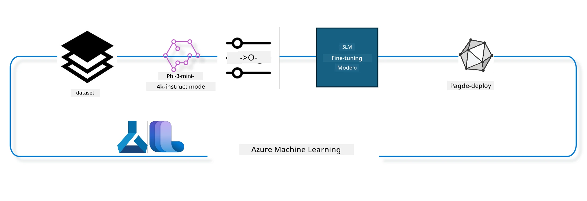

## Paano gamitin ang mga chat-completion components mula sa Azure ML system registry para sa fine tuning ng modelo

Sa halimbawang ito gagawin natin ang fine tuning ng Phi-3-mini-4k-instruct na modelo upang matapos ang pag-uusap sa pagitan ng 2 tao gamit ang ultrachat_200k dataset.



Ipinapakita ng halimbawa kung paano magsagawa ng fine tuning gamit ang Azure ML SDK at Python at pagkatapos ay i-deploy ang fine tuned na modelo sa isang online endpoint para sa real time na inference.

### Training data

Gagamitin natin ang ultrachat_200k dataset. Ito ay isang malakas na na-filter na bersyon ng UltraChat dataset at ginamit sa pagsasanay ng Zephyr-7B-β, isang makabagong 7b chat na modelo.

### Modelo

Gagamitin natin ang Phi-3-mini-4k-instruct na modelo upang ipakita kung paano maaaring i-finetune ng user ang modelo para sa chat-completion na gawain. Kung binuksan mo ang notebook na ito mula sa isang partikular na model card, tandaan na palitan ang partikular na pangalan ng modelo.

### Mga Gawain

- Pumili ng modelo para i-fine tune.
- Pumili at mag-explore ng training data.
- I-configure ang fine tuning job.
- Patakbuhin ang fine tuning job.
- Suriin ang training at evaluation metrics.
- I-register ang fine tuned na modelo.
- I-deploy ang fine tuned na modelo para sa real time na inference.
- Linisin ang mga resources.

## 1. Ihanda ang mga kinakailangan

- I-install ang mga dependencies
- Kumonekta sa AzureML Workspace. Alamin pa sa set up SDK authentication. Palitan ang <WORKSPACE_NAME>, <RESOURCE_GROUP> at <SUBSCRIPTION_ID> sa ibaba.
- Kumonekta sa azureml system registry
- Mag-set ng opsyonal na pangalan ng experiment
- Suriin o gumawa ng compute.

> [!NOTE]
> Kinakailangan ang isang GPU node na maaaring may maraming GPU cards. Halimbawa, sa isang node ng Standard_NC24rs_v3 may 4 NVIDIA V100 GPUs habang sa Standard_NC12s_v3, may 2 NVIDIA V100 GPUs. Tingnan ang docs para sa impormasyong ito. Ang bilang ng GPU cards bawat node ay naka-set sa param na gpus_per_node sa ibaba. Ang tamang pagseset ng halagang ito ay titiyak sa paggamit ng lahat ng GPU sa node. Ang mga rekomendadong GPU compute SKUs ay makikita dito at dito.

### Python Libraries

I-install ang mga dependencies sa pamamagitan ng pagpapatakbo ng cell sa ibaba. Hindi ito opsyonal kung tumatakbo sa bagong environment.

```bash
pip install azure-ai-ml
pip install azure-identity
pip install datasets==2.9.0
pip install mlflow
pip install azureml-mlflow
```

### Pakikipag-interact sa Azure ML

1. Ginagamit ang Python script na ito para makipag-interact sa Azure Machine Learning (Azure ML) service. Heto ang paliwanag ng ginagawa nito:

    - Ini-import nito ang mga kinakailangang module mula sa azure.ai.ml, azure.identity, at azure.ai.ml.entities packages. Ini-import din nito ang time module.

    - Sinusubukan nitong mag-authenticate gamit ang DefaultAzureCredential(), na nagbibigay ng pinadaling authentication experience para mabilis makapag-develop ng mga application na tumatakbo sa Azure cloud. Kapag nabigo ito, bumabalik ito sa InteractiveBrowserCredential(), na nagpo-provide ng interactive login prompt.

    - Sinusubukan din nitong gumawa ng MLClient instance gamit ang from_config method, na nagbabasa ng configuration mula sa default config file (config.json). Kapag nabigo ito, gumagawa ito ng MLClient instance sa pamamagitan ng manual na pagbibigay ng subscription_id, resource_group_name, at workspace_name.

    - Gumagawa ito ng isa pang MLClient instance, sa pagkakataong ito para sa Azure ML registry na tinatawag na "azureml". Dito nakatago ang mga modelo, fine-tuning pipelines, at mga environment.

    - Itinatakda nito ang experiment_name na "chat_completion_Phi-3-mini-4k-instruct".

    - Gumagawa ito ng natatanging timestamp sa pamamagitan ng pag-convert ng kasalukuyang oras (sa segundo mula noong epoch, bilang floating point na numero) sa integer at pagkatapos ay sa string. Magagamit ang timestamp na ito para gumawa ng natatanging mga pangalan at bersyon.

    ```python
    # Importahin ang mga kinakailangang module mula sa Azure ML at Azure Identity
    from azure.ai.ml import MLClient
    from azure.identity import (
        DefaultAzureCredential,
        InteractiveBrowserCredential,
    )
    from azure.ai.ml.entities import AmlCompute
    import time  # I-import ang time module
    
    # Subukang mag-authenticate gamit ang DefaultAzureCredential
    try:
        credential = DefaultAzureCredential()
        credential.get_token("https://management.azure.com/.default")
    except Exception as ex:  # Kung mabigo ang DefaultAzureCredential, gamitin ang InteractiveBrowserCredential
        credential = InteractiveBrowserCredential()
    
    # Subukang gumawa ng MLClient instance gamit ang default config file
    try:
        workspace_ml_client = MLClient.from_config(credential=credential)
    except:  # Kung mabigo iyon, gumawa ng MLClient instance sa pamamagitan ng manu-manong pagbibigay ng mga detalye
        workspace_ml_client = MLClient(
            credential,
            subscription_id="<SUBSCRIPTION_ID>",
            resource_group_name="<RESOURCE_GROUP>",
            workspace_name="<WORKSPACE_NAME>",
        )
    
    # Gumawa ng isa pang MLClient instance para sa Azure ML registry na pinangalanang "azureml"
    # Dito sa registry na ito iniimbak ang mga modelo, fine-tuning pipeline, at mga environment
    registry_ml_client = MLClient(credential, registry_name="azureml")
    
    # Itakda ang pangalan ng eksperimento
    experiment_name = "chat_completion_Phi-3-mini-4k-instruct"
    
    # Gumawa ng natatanging timestamp na maaaring gamitin para sa mga pangalan at bersyon na kailangang maging natatangi
    timestamp = str(int(time.time()))
    ```

## 2. Pumili ng foundation model na ifi-fine tune

1. Ang Phi-3-mini-4k-instruct ay 3.8B parameters, lightweight, makabagong open model na binuo gamit ang mga dataset na ginamit para sa Phi-2. Ang modelo ay kabilang sa Phi-3 model family, at ang Mini na bersyon ay may dalawang variant, 4K at 128K na siyang haba ng context (sa tokens) na kaya nitong suportahan. Kailangan nating i-finetune ang modelo para sa tiyak nating layunin bago ito magamit. Maaari mong tingnan ang mga modelong ito sa Model Catalog sa AzureML Studio, piliting i-filter sa chat-completion task. Sa halimbawang ito, ginamit natin ang Phi-3-mini-4k-instruct na modelo. Kung binuksan mo ang notebook para sa ibang modelo, palitan ang pangalan at bersyon ng modelo nang naaayon.

> [!NOTE]
> ang model id property ng modelo. Ipapasa ito bilang input sa fine tuning job. Makikita rin ito bilang Asset ID field sa model details page sa AzureML Studio Model Catalog.

2. Ang Python script na ito ay nakikipag-interact sa Azure Machine Learning (Azure ML) service. Heto ang paliwanag ng ginagawa nito:

    - Itinatakda nito ang model_name sa "Phi-3-mini-4k-instruct".

    - Ginagamit nito ang get method ng models property ng registry_ml_client object upang makuha ang pinakabagong bersyon ng modelo na may tinukoy na pangalan mula sa Azure ML registry. Tinatawag ang get method gamit ang dalawang argumento: ang pangalan ng modelo at label na nagsasabi na ang pinakabagong bersyon ng modelo ang kukunin.

    - Ini-print nito ang mensahe sa console na nagsasabi ng pangalan, bersyon, at id ng modelo na gagamitin para sa fine-tuning. Ginagamit ang format method ng string upang ipasok ang pangalan, bersyon, at id ng modelo sa mensahe. Ang pangalan, bersyon, at id ng modelo ay kinukuha bilang mga property ng foundation_model object.

    ```python
    # Itakda ang pangalan ng modelo
    model_name = "Phi-3-mini-4k-instruct"
    
    # Kunin ang pinakabagong bersyon ng modelo mula sa Azure ML registry
    foundation_model = registry_ml_client.models.get(model_name, label="latest")
    
    # I-print ang pangalan ng modelo, bersyon, at id
    # Ang impormasyong ito ay kapaki-pakinabang para sa pagsubaybay at pag-debug
    print(
        "\n\nUsing model name: {0}, version: {1}, id: {2} for fine tuning".format(
            foundation_model.name, foundation_model.version, foundation_model.id
        )
    )
    ```

## 3. Lumikha ng compute na gagamitin sa trabaho

Ang fine tune job ay gagana LAMANG sa GPU compute. Ang laki ng compute ay nakadepende kung gaano kalaki ang modelo at sa karamihan ng kaso, nagiging mahirap tukuyin ang tamang compute para sa trabaho. Sa cell na ito, ginagabayan ang user kung paano pumili ng tamang compute para sa trabaho.

> [!NOTE]
> Ang mga computes na nakalista sa ibaba ay gagana sa pinaka-optimal na configuration. Ang anumang pagbabago sa configuration ay maaaring magdulot ng Cuda Out Of Memory error. Sa mga ganitong kaso, subukang i-upgrade ang compute sa mas malaking compute size.

> [!NOTE]
> Kapag pumipili ng compute_cluster_size sa ibaba, siguraduhing available ang compute sa resource group mo. Kung ang isang compute ay hindi available, maaari kang mag-request na makakuha ng access sa compute resources.

### Pagsusuri ng Modelo para sa Fine Tuning Support

1. Ang Python script na ito ay nakikipag-interact sa Azure Machine Learning (Azure ML) model. Heto ang paliwanag ng ginagawa nito:

    - Ini-import nito ang ast module, na nagbibigay ng mga function upang iproseso ang mga puno ng Python abstract syntax grammar.

    - Sinusuri nito kung ang foundation_model object (na kumakatawan sa isang modelo sa Azure ML) ay may tag na finetune_compute_allow_list. Ang mga tag sa Azure ML ay mga key-value pair na maaari mong likhain at gamitin para i-filter at i-sort ang mga modelo.

    - Kung nandiyan ang finetune_compute_allow_list tag, ginagamit nito ang ast.literal_eval function upang ligtas na i-parse ang value ng tag (isang string) papunta sa Python list. Ang listahang ito ay ina-assign sa computes_allow_list variable. Ini-print din nito ang mensahe na nagsasabing dapat lumikha ng compute mula sa listahang ito.

    - Kung wala ang finetune_compute_allow_list tag, itinatakda nito ang computes_allow_list sa None at ini-print ang mensaheng nagsasabing hindi bahagi ng mga tag ng modelo ang finetune_compute_allow_list.

    - Sa kabuuan, sinusuri ng script na ito ang isang partikular na tag sa metadata ng modelo, kino-convert ang value nito sa list kung ito ay nandiyan, at nagbibigay ng paunawa sa user nang naaayon.

    ```python
    # I-import ang ast module, na nagbibigay ng mga function para iproseso ang mga puno ng Python abstract syntax grammar
    import ast
    
    # Suriin kung ang 'finetune_compute_allow_list' tag ay naroroon sa mga tag ng model
    if "finetune_compute_allow_list" in foundation_model.tags:
        # Kung naroroon ang tag, gamitin ang ast.literal_eval para ligtas na iparse ang halaga ng tag (isang string) sa isang Python list
        computes_allow_list = ast.literal_eval(
            foundation_model.tags["finetune_compute_allow_list"]
        )  # i-convert ang string sa python list
        # I-print ang mensahe na nagsasaad na isang compute ay dapat likhain mula sa listahan
        print(f"Please create a compute from the above list - {computes_allow_list}")
    else:
        # Kung wala ang tag, itakda ang computes_allow_list sa None
        computes_allow_list = None
        # I-print ang mensahe na nagsasaad na ang 'finetune_compute_allow_list' tag ay hindi bahagi ng mga tag ng model
        print("`finetune_compute_allow_list` is not part of model tags")
    ```

### Pagsusuri sa Compute Instance

1. Ang Python script na ito ay nakikipag-interact sa Azure Machine Learning (Azure ML) service at nagsasagawa ng ilang pagsusuri sa compute instance. Heto ang paliwanag ng ginagawa nito:

    - Sinusubukan nitong kunin ang compute instance gamit ang pangalang naka-imbak sa compute_cluster mula sa Azure ML workspace. Kung ang provisioning state ng compute instance ay "failed", nagta-throw ito ng ValueError.

    - Sinusuri kung ang computes_allow_list ay hindi None. Kung hindi ito None, kino-convert nito ang lahat ng compute sizes sa listahan sa lowercase at tinitingnan kung ang size ng kasalukuyang compute instance ay nasa listahan. Kapag wala, nagta-throw ito ng ValueError.

    - Kung ang computes_allow_list ay None, sinusuri nito kung ang size ng compute instance ay nasa listahan ng unsupported GPU VM sizes. Kung naroon, nagta-throw ito ng ValueError.

    - Kinukuha nito ang listahan ng lahat ng available na compute sizes sa workspace. Iniikot nito ang listahan, at para sa bawat compute size, tinitingnan kung ang pangalan nito ay tumutugma sa size ng kasalukuyang compute instance. Kung oo, kinukuha nito ang bilang ng GPUs para sa compute size na iyon at itinatakda ang gpu_count_found sa True.

    - Kung ang gpu_count_found ay True, ini-print ang bilang ng GPUs sa compute instance. Kung False, nagta-throw ito ng ValueError.

    - Sa kabuuan, nagsasagawa ang script na ito ng ilang pagsusuri sa compute instance sa Azure ML workspace, kasama na ang pagsuri sa provisioning state, size laban sa allow list o deny list, at bilang ng GPUs nito.
    
    ```python
    # I-print ang mensahe ng exception
    print(e)
    # Mag-raise ng ValueError kung ang laki ng compute ay hindi available sa workspace
    raise ValueError(
        f"WARNING! Compute size {compute_cluster_size} not available in workspace"
    )
    
    # Kunin ang compute instance mula sa Azure ML workspace
    compute = workspace_ml_client.compute.get(compute_cluster)
    # Suriin kung ang estado ng provisioning ng compute instance ay "failed"
    if compute.provisioning_state.lower() == "failed":
        # Mag-raise ng ValueError kung ang estado ng provisioning ay "failed"
        raise ValueError(
            f"Provisioning failed, Compute '{compute_cluster}' is in failed state. "
            f"please try creating a different compute"
        )
    
    # Suriin kung ang computes_allow_list ay hindi None
    if computes_allow_list is not None:
        # I-convert ang lahat ng compute sizes sa computes_allow_list sa lowercase
        computes_allow_list_lower_case = [x.lower() for x in computes_allow_list]
        # Suriin kung ang laki ng compute instance ay nasa computes_allow_list_lower_case
        if compute.size.lower() not in computes_allow_list_lower_case:
            # Mag-raise ng ValueError kung ang laki ng compute instance ay wala sa computes_allow_list_lower_case
            raise ValueError(
                f"VM size {compute.size} is not in the allow-listed computes for finetuning"
            )
    else:
        # Mag-define ng listahan ng mga hindi suportadong GPU VM sizes
        unsupported_gpu_vm_list = [
            "standard_nc6",
            "standard_nc12",
            "standard_nc24",
            "standard_nc24r",
        ]
        # Suriin kung ang laki ng compute instance ay nasa unsupported_gpu_vm_list
        if compute.size.lower() in unsupported_gpu_vm_list:
            # Mag-raise ng ValueError kung ang laki ng compute instance ay nasa unsupported_gpu_vm_list
            raise ValueError(
                f"VM size {compute.size} is currently not supported for finetuning"
            )
    
    # I-initialize ang flag para suriin kung nahanap na ang bilang ng GPUs sa compute instance
    gpu_count_found = False
    # Kunin ang listahan ng lahat ng available na compute sizes sa workspace
    workspace_compute_sku_list = workspace_ml_client.compute.list_sizes()
    available_sku_sizes = []
    # I-iterate ang listahan ng mga available na compute sizes
    for compute_sku in workspace_compute_sku_list:
        available_sku_sizes.append(compute_sku.name)
        # Suriin kung ang pangalan ng compute size ay tugma sa laki ng compute instance
        if compute_sku.name.lower() == compute.size.lower():
            # Kung oo, kunin ang bilang ng GPUs para sa compute size na iyon at itakda ang gpu_count_found sa True
            gpus_per_node = compute_sku.gpus
            gpu_count_found = True
    # Kung ang gpu_count_found ay True, i-print ang bilang ng GPUs sa compute instance
    if gpu_count_found:
        print(f"Number of GPU's in compute {compute.size}: {gpus_per_node}")
    else:
        # Kung ang gpu_count_found ay False, mag-raise ng ValueError
        raise ValueError(
            f"Number of GPU's in compute {compute.size} not found. Available skus are: {available_sku_sizes}."
            f"This should not happen. Please check the selected compute cluster: {compute_cluster} and try again."
        )
    ```

## 4. Pumili ng dataset para sa fine-tuning ng modelo

1. Gagamitin natin ang ultrachat_200k dataset. Ang dataset ay may apat na splits, na angkop para sa Supervised fine-tuning (sft).
Generation ranking (gen). Ang bilang ng mga halimbawa bawat split ay ipinapakita sa sumusunod:

    ```bash
    train_sft test_sft  train_gen  test_gen
    207865  23110  256032  28304
    ```

1. Ipinapakita ng mga sumusunod na cells ang mga pangunahing data preparation para sa fine tuning:

### I-visualize ang ilang data rows

Gusto natin na mabilis tumakbo ang sample na ito, kaya mag-save ng train_sft, test_sft files na naglalaman ng 5% ng mga na-trim nang rows. Ibig sabihin nito, ang fine tuned na modelo ay magkakaroon ng mas mababang accuracy, kaya hindi ito dapat gamitin sa totoong mundo.
Ginagamit ang download-dataset.py upang i-download ang ultrachat_200k dataset at i-convert ito sa format na kayang gamitin ng finetune pipeline component. Dahil malaki ang dataset, dito makikita lamang natin ang bahagi ng dataset.

1. Ang pagpapatakbo ng script sa ibaba ay nagda-download lamang ng 5% ng data. Maari itong taasan sa pagbabago ng dataset_split_pc parameter sa nais na porsyento.

> [!NOTE]
> Ang ilang language models ay may iba't ibang language codes kaya't ang mga pangalan ng column sa dataset ay dapat sumalamin dito.

1. Narito ang halimbawa kung paano dapat ang hitsura ng data
Ang chat-completion dataset ay nakaimbak sa parquet format na may bawat entry na sumusunod sa schema:

    - Ito ay isang JSON (JavaScript Object Notation) na dokumento, isang popular na format ng pagpapalitan ng data. Hindi ito executable code, kundi paraan upang mag-imbak at maghatid ng data. Heto ang pagkakaayos nito:

    - "prompt": Nagtataglay ng string na nagpapakita ng gawain o tanong na ibinibigay sa AI assistant.

    - "messages": Nagtataglay ng array ng mga object. Bawat object ay mensahe sa pag-uusap sa pagitan ng user at AI assistant. Ang bawat mensahe ay may dalawang keys:

    - "content": String na naglalaman ng nilalaman ng mensahe.
    - "role": String na naglalarawan ng papel ng entity na nagpadala ng mensahe. Maaaring "user" o "assistant".
    - "prompt_id": String na naglalaman ng natatanging identifier para sa prompt.

1. Sa partikular na JSON dokumentong ito, ipinapakita ang pag-uusap kung saan ang user ay humiling sa AI assistant na gumawa ng protagonist para sa isang dystopian na kwento. Sumagot ang assistant, at humiling pa ang user ng karagdagang detalye. Pumayag ang assistant na magbigay ng karagdagang detalye. Ang buong pag-uusap ay naka-link sa isang specific prompt id.

    ```python
    {
        // The task or question posed to an AI assistant
        "prompt": "Create a fully-developed protagonist who is challenged to survive within a dystopian society under the rule of a tyrant. ...",
        
        // An array of objects, each representing a message in a conversation between a user and an AI assistant
        "messages":[
            {
                // The content of the user's message
                "content": "Create a fully-developed protagonist who is challenged to survive within a dystopian society under the rule of a tyrant. ...",
                // The role of the entity that sent the message
                "role": "user"
            },
            {
                // The content of the assistant's message
                "content": "Name: Ava\n\n Ava was just 16 years old when the world as she knew it came crashing down. The government had collapsed, leaving behind a chaotic and lawless society. ...",
                // The role of the entity that sent the message
                "role": "assistant"
            },
            {
                // The content of the user's message
                "content": "Wow, Ava's story is so intense and inspiring! Can you provide me with more details.  ...",
                // The role of the entity that sent the message
                "role": "user"
            }, 
            {
                // The content of the assistant's message
                "content": "Certainly! ....",
                // The role of the entity that sent the message
                "role": "assistant"
            }
        ],
        
        // A unique identifier for the prompt
        "prompt_id": "d938b65dfe31f05f80eb8572964c6673eddbd68eff3db6bd234d7f1e3b86c2af"
    }
    ```

### I-download ang Data

1. Ang Python script na ito ay ginagamit upang mag-download ng dataset gamit ang helper script na download-dataset.py. Heto ang paliwanag ng ginagawa nito:

    - Ini-import nito ang os module, na nagbibigay ng portable na paraan para gamitin ang mga function ng operating system.

    - Ginagamit nito ang os.system function upang patakbuhin ang download-dataset.py script sa shell na may mga partikular na command-line arguments. Tinukoy ng mga argumento ang dataset na ida-download (HuggingFaceH4/ultrachat_200k), ang directory kung saan ida-download (ultrachat_200k_dataset), at ang porsyento ng dataset na iss-split (5). Ibinabalik ng os.system function ang exit status ng command na pinatakbo; itinatakda ito sa exit_status variable.

    - Sinusuri kung ang exit_status ay hindi 0. Sa Unix-like na mga operating system, ang exit status na 0 ay karaniwang nangangahulugang matagumpay ang command, habang anumang iba ay nagpapahiwatig ng error. Kapag hindi 0, nagta-throw ito ng Exception na may mensahe na nagkaroon ng error sa pag-download ng dataset.

    - Sa kabuuan, pinapatakbo ng script na ito ang isang command upang mag-download ng dataset gamit ang helper script, at nagta-throw ng exception kung nabigo ang command.
    
    ```python
    # I-import ang os module, na nagbibigay ng paraan upang gamitin ang functionality na nakadepende sa operating system
    import os
    
    # Gamitin ang os.system function upang patakbuhin ang download-dataset.py script sa shell gamit ang mga partikular na argument ng command-line
    # Tinutukoy ng mga argumento ang dataset na ida-download (HuggingFaceH4/ultrachat_200k), ang direktoryong pagda-downloadan nito (ultrachat_200k_dataset), at ang porsyento ng dataset na paghahatiin (5)
    # Ibinabalik ng os.system function ang exit status ng command na pinatakbo nito; ang status na ito ay iniimbak sa exit_status variable
    exit_status = os.system(
        "python ./download-dataset.py --dataset HuggingFaceH4/ultrachat_200k --download_dir ultrachat_200k_dataset --dataset_split_pc 5"
    )
    
    # Suriin kung ang exit_status ay hindi 0
    # Sa mga Unix-like operating system, karaniwang ang exit status na 0 ay nagpapahiwatig na matagumpay ang isang command, habang ang anumang ibang numero ay nagpapahiwatig ng error
    # Kung ang exit_status ay hindi 0, itaas ang isang Exception na may mensahe na nagpapahiwatig na nagkaroon ng error sa pagda-download ng dataset
    if exit_status != 0:
        raise Exception("Error downloading dataset")
    ```

### Paglo-load ng Data sa isang DataFrame

1. Ang Python script na ito ay naglo-load ng JSON Lines file sa isang pandas DataFrame at ipinapakita ang unang 5 na rows. Heto ang paliwanag ng ginagawa nito:

    - Ini-import nito ang pandas library, isang malakas na library para sa manipulasyon at pagsusuri ng data.

    - Itinatakda nito ang maximum na lapad ng column para sa pandas' display options sa 0. Nangangahulugan ito na ang buong teksto ng bawat column ay ipapakita nang hindi paikliin kapag prinint ang DataFrame.
    - Ginagamit nito ang pd.read_json function upang i-load ang train_sft.jsonl file mula sa ultrachat_200k_dataset directory papunta sa isang DataFrame. Ang argumento na lines=True ay nagsasaad na ang file ay nasa JSON Lines format, kung saan ang bawat linya ay isang hiwalay na JSON object.

    - Ginagamit nito ang head method upang ipakita ang unang 5 na rows ng DataFrame. Kung ang DataFrame ay may mas kaunting 5 rows, ipapakita nito ang lahat ng mga ito.

    - Sa kabuuan, niloload ng script na ito ang isang JSON Lines file sa isang DataFrame at ipinapakita ang unang 5 rows na may buong teksto ng mga column.
    
    ```python
    # I-import ang pandas na librarya, na isang makapangyarihang librarya para sa manipulasyon at pagsusuri ng datos
    import pandas as pd
    
    # Itakda ang maximum na lapad ng kolum para sa mga display options ng pandas sa 0
    # Ibig sabihin nito ay ipapakita ang buong teksto ng bawat kolum nang walang putol kapag na-print ang DataFrame
    pd.set_option("display.max_colwidth", 0)
    
    # Gamitin ang pd.read_json function upang i-load ang train_sft.jsonl file mula sa ultrachat_200k_dataset directory papunta sa isang DataFrame
    # Ang argumentong lines=True ay nagsasaad na ang file ay nasa JSON Lines na format, kung saan ang bawat linya ay isang hiwalay na JSON object
    df = pd.read_json("./ultrachat_200k_dataset/train_sft.jsonl", lines=True)
    
    # Gamitin ang head method upang ipakita ang unang 5 na hilera ng DataFrame
    # Kung ang DataFrame ay may mas mababa sa 5 hilera, ipapakita nito ang lahat ng mga iyon
    df.head()
    ```

## 5. Isumite ang fine tuning job gamit ang modelo at data bilang inputs

Gumawa ng job na gumagamit ng chat-completion pipeline component. Alamin pa ang tungkol sa lahat ng parameters na sinuportahan para sa fine tuning.

### I-define ang finetune parameters

1. Ang Finetune parameters ay maaaring hatiin sa 2 kategorya - training parameters, optimization parameters

1. Ang Training parameters ay naglalarawan ng mga aspeto ng pagsasanay tulad ng -

    - Ang optimizer, scheduler na gagamitin
    - Ang metric na i-o-optimize para sa finetune
    - Bilang ng mga hakbang sa pagsasanay at ang batch size, at iba pa
    - Ang Optimization parameters ay tumutulong sa pag-optimize ng GPU memory at epektibong paggamit ng compute resources. 

1. Narito ang ilan sa mga parameters na kabilang sa kategoryang ito. Ang optimization parameters ay nagkakaiba-iba para sa bawat modelo at kasama sa package ng modelo upang hawakan ang mga pagkakaibang ito.

    - Paganahin ang deepspeed at LoRA
    - Paganahin ang mixed precision training
    - Paganahin ang multi-node training

> [!NOTE]
> Ang supervised finetuning ay maaaring magresulta sa pagkawala ng alignment o catastrophic forgetting. Inirerekomenda namin na i-check ang isyung ito at patakbuhin ang alignment stage pagkatapos ng finetune.

### Fine Tuning Parameters

1. Ang Python script na ito ay nagse-set up ng mga parameters para sa fine-tuning ng isang machine learning model. Heto ang paliwanag kung ano ang ginagawa nito:

    - Nagse-set up ito ng default training parameters tulad ng bilang ng training epochs, batch sizes para sa training at evaluation, learning rate, at uri ng learning rate scheduler.

    - Nagse-set up ito ng default optimization parameters tulad ng kung gagamitin ba ang Layer-wise Relevance Propagation (LoRa) at DeepSpeed, at ang DeepSpeed stage.

    - Pinagsasama nito ang training at optimization parameters sa isang dictionary na tinatawag na finetune_parameters.

    - Sinusuri nito kung ang foundation_model ay may mga model-specific default parameters. Kung meron, nagpapakita ito ng babala at ina-update ang finetune_parameters dictionary gamit ang mga model-specific defaults. Ginagamit ang ast.literal_eval function upang i-convert ang model-specific defaults mula sa string papuntang Python dictionary.

    - Ipinapakita nito ang huling set ng fine-tuning parameters na gagamitin para sa run.

    - Sa kabuuan, ang script na ito ay nagse-set up at ipinapakita ang mga parameters para sa fine-tuning ng isang machine learning model, na may kakayahang i-override ang default parameters gamit ang model-specific na mga parameters.

    ```python
    # Itakda ang mga default na parameter ng pagsasanay tulad ng bilang ng mga training epoch, laki ng batch para sa pagsasanay at pagsusuri, learning rate, at uri ng learning rate scheduler
    training_parameters = dict(
        num_train_epochs=3,
        per_device_train_batch_size=1,
        per_device_eval_batch_size=1,
        learning_rate=5e-6,
        lr_scheduler_type="cosine",
    )
    
    # Itakda ang mga default na parameter ng optimization tulad ng kung gagamitin ang Layer-wise Relevance Propagation (LoRa) at DeepSpeed, at ang DeepSpeed stage
    optimization_parameters = dict(
        apply_lora="true",
        apply_deepspeed="true",
        deepspeed_stage=2,
    )
    
    # Pagsamahin ang mga parameter ng pagsasanay at optimization sa isang diksyunaryo na tinatawag na finetune_parameters
    finetune_parameters = {**training_parameters, **optimization_parameters}
    
    # Suriin kung ang foundation_model ay may mga model-specific na default na parameter
    # Kung mayroon, mag-print ng babala at i-update ang diksyunaryo ng finetune_parameters gamit ang mga model-specific na default na ito
    # Ginagamit ang ast.literal_eval na function upang i-convert ang mga model-specific default mula sa string patungo sa Python dictionary
    if "model_specific_defaults" in foundation_model.tags:
        print("Warning! Model specific defaults exist. The defaults could be overridden.")
        finetune_parameters.update(
            ast.literal_eval(  # i-convert ang string sa python dict
                foundation_model.tags["model_specific_defaults"]
            )
        )
    
    # I-print ang huling set ng mga parameter ng fine-tuning na gagamitin para sa pagpapatakbo
    print(
        f"The following finetune parameters are going to be set for the run: {finetune_parameters}"
    )
    ```

### Training Pipeline

1. Ang Python script na ito ay nagdedeklara ng isang function upang gumawa ng display name para sa isang machine learning training pipeline, at pagkatapos ay tinatawag ang function na ito para gumawa at i-print ang display name. Heto ang paliwanag kung ano ang ginagawa nito:

1. Ipinahayag ang get_pipeline_display_name function. Gumagawa ang function na ito ng display name base sa iba't ibang parametro na may kaugnayan sa training pipeline.

1. Sa loob ng function, kinukuwenta nito ang kabuuang batch size sa pamamagitan ng pag-multiply ng per-device batch size, bilang ng gradient accumulation steps, bilang ng GPUs bawat node, at bilang ng mga nodes na ginamit para sa fine-tuning.

1. Kinukuha nito ang iba't ibang parameters gaya ng uri ng learning rate scheduler, kung ginagamit ba ang DeepSpeed, ang DeepSpeed stage, kung ginagamit ba ang Layer-wise Relevance Propagation (LoRa), ang limit sa bilang ng model checkpoints na itatago, at ang maximum sequence length.

1. Gumagawa ito ng string na naglalaman ng lahat ng mga parameters na ito, na pinaghihiwalay ng hyphen. Kung ginagamit ang DeepSpeed o LoRa, isinasama sa string ang "ds" kasunod ng DeepSpeed stage, o "lora", ayon sa pagkakabanggit. Kung hindi naman, isinasama nito ang "nods" o "nolora", ayon sa pagkakabanggit.

1. Ibinabalik ng function ang string na ito, na nagsisilbing display name para sa training pipeline.

1. Pagkatapos idefine ang function, tinatawag ito upang mabuo ang display name, at pagkatapos ay ipiniprint.

1. Sa kabuuan, ang script na ito ay gumagawa ng display name para sa isang machine learning training pipeline base sa iba't ibang parameters, at pagkatapos ay ipiniprint ang display name na ito.

    ```python
    # Tukuyin ang isang function para gumawa ng display name para sa training pipeline
    def get_pipeline_display_name():
        # Kalkulahin ang kabuuang laki ng batch sa pamamagitan ng pag-multiply ng bawat device batch size, bilang ng gradient accumulation steps, bilang ng GPUs kada node, at bilang ng mga node na ginagamit para sa fine-tuning
        batch_size = (
            int(finetune_parameters.get("per_device_train_batch_size", 1))
            * int(finetune_parameters.get("gradient_accumulation_steps", 1))
            * int(gpus_per_node)
            * int(finetune_parameters.get("num_nodes_finetune", 1))
        )
        # Kunin ang uri ng learning rate scheduler
        scheduler = finetune_parameters.get("lr_scheduler_type", "linear")
        # Kunin kung ginagamit ang DeepSpeed
        deepspeed = finetune_parameters.get("apply_deepspeed", "false")
        # Kunin ang DeepSpeed stage
        ds_stage = finetune_parameters.get("deepspeed_stage", "2")
        # Kung ginagamit ang DeepSpeed, isama ang "ds" kasunod ang DeepSpeed stage sa display name; kung hindi, isama ang "nods"
        if deepspeed == "true":
            ds_string = f"ds{ds_stage}"
        else:
            ds_string = "nods"
        # Kunin kung ginagamit ang Layer-wise Relevance Propagation (LoRa)
        lora = finetune_parameters.get("apply_lora", "false")
        # Kung ginagamit ang LoRa, isama ang "lora" sa display name; kung hindi, isama ang "nolora"
        if lora == "true":
            lora_string = "lora"
        else:
            lora_string = "nolora"
        # Kunin ang limitasyon sa bilang ng mga model checkpoint na itatago
        save_limit = finetune_parameters.get("save_total_limit", -1)
        # Kunin ang maximum sequence length
        seq_len = finetune_parameters.get("max_seq_length", -1)
        # Buoin ang display name sa pamamagitan ng pagsasama-sama ng lahat ng mga parameter na ito, na pinaghiwalay ng hyphens
        return (
            model_name
            + "-"
            + "ultrachat"
            + "-"
            + f"bs{batch_size}"
            + "-"
            + f"{scheduler}"
            + "-"
            + ds_string
            + "-"
            + lora_string
            + f"-save_limit{save_limit}"
            + f"-seqlen{seq_len}"
        )
    
    # Tawagan ang function para gumawa ng display name
    pipeline_display_name = get_pipeline_display_name()
    # I-print ang display name
    print(f"Display name used for the run: {pipeline_display_name}")
    ```

### Pag-configure ng Pipeline

Ang Python script na ito ay nagdedeklara at nagco-configure ng isang machine learning pipeline gamit ang Azure Machine Learning SDK. Heto ang paliwanag kung ano ang ginagawa nito:

1. Ina-import nito ang mga kinakailangang module mula sa Azure AI ML SDK.

1. Kinukuha nito ang pipeline component na pinangalanang "chat_completion_pipeline" mula sa registry.

1. Ipinapahayag nito ang isang pipeline job gamit ang `@pipeline` decorator at ang function na `create_pipeline`. Ang pangalan ng pipeline ay itinakda bilang `pipeline_display_name`.

1. Sa loob ng `create_pipeline` function, ini-initialize ang nakuha na pipeline component gamit ang iba't ibang parameters, kasama na ang path ng modelo, compute clusters para sa iba't ibang yugto, dataset splits para sa training at testing, bilang ng GPUs na gagamitin para sa fine-tuning, at iba pang fine-tuning parameters.

1. Ina-map nito ang output ng fine-tuning job papunta sa output ng pipeline job. Ginagawa ito upang madaliang ma-register ang fine-tuned model, na kinakailangan upang i-deploy ang modelo sa isang online o batch endpoint.

1. Gumagawa ito ng instance ng pipeline sa pamamagitan ng pagtawag sa `create_pipeline` function.

1. Itinakda ang `force_rerun` setting ng pipeline sa `True`, na nangangahulugang hindi gagamitin ang cached na resulta mula sa mga naunang trabaho.

1. Itinakda ang `continue_on_step_failure` setting ng pipeline sa `False`, na nangangahulugang titigil ang pipeline kung mayroong hakbang na mabigo.

1. Sa kabuuan, ang script na ito ay nagdedeklara at nagco-configure ng isang machine learning pipeline para sa isang chat completion task gamit ang Azure Machine Learning SDK.

    ```python
    # I-import ang mga kinakailangang module mula sa Azure AI ML SDK
    from azure.ai.ml.dsl import pipeline
    from azure.ai.ml import Input
    
    # Kunin ang pipeline component na pinangalanang "chat_completion_pipeline" mula sa registry
    pipeline_component_func = registry_ml_client.components.get(
        name="chat_completion_pipeline", label="latest"
    )
    
    # Tukuyin ang pipeline job gamit ang @pipeline decorator at ang function na create_pipeline
    # Ang pangalan ng pipeline ay itinakda sa pipeline_display_name
    @pipeline(name=pipeline_display_name)
    def create_pipeline():
        # I-initialize ang nakuha na pipeline component gamit ang iba't ibang mga parametro
        # Kabilang dito ang path ng modelo, compute clusters para sa iba't ibang yugto, mga dataset splits para sa training at testing, bilang ng mga GPU na gagamitin para sa fine-tuning, at iba pang mga parameter para sa fine-tuning
        chat_completion_pipeline = pipeline_component_func(
            mlflow_model_path=foundation_model.id,
            compute_model_import=compute_cluster,
            compute_preprocess=compute_cluster,
            compute_finetune=compute_cluster,
            compute_model_evaluation=compute_cluster,
            # I-map ang mga dataset splits sa mga parametro
            train_file_path=Input(
                type="uri_file", path="./ultrachat_200k_dataset/train_sft.jsonl"
            ),
            test_file_path=Input(
                type="uri_file", path="./ultrachat_200k_dataset/test_sft.jsonl"
            ),
            # Mga setting para sa training
            number_of_gpu_to_use_finetuning=gpus_per_node,  # Itakda sa bilang ng mga GPU na magagamit sa compute
            **finetune_parameters
        )
        return {
            # I-map ang output ng fine tuning job sa output ng pipeline job
            # Ginagawa ito upang madali nating mairehistro ang fine tuned na modelo
            # Kinakailangan ang pagrerehistro ng modelo upang ideploy ito sa isang online o batch endpoint
            "trained_model": chat_completion_pipeline.outputs.mlflow_model_folder
        }
    
    # Gumawa ng instance ng pipeline sa pamamagitan ng pagtawag sa create_pipeline function
    pipeline_object = create_pipeline()
    
    # Huwag gamitin ang cached na resulta mula sa mga nakaraang trabaho
    pipeline_object.settings.force_rerun = True
    
    # Itakda ang continue on step failure sa False
    # Nangangahulugan ito na titigil ang pipeline kung saanman may mabigong step
    pipeline_object.settings.continue_on_step_failure = False
    ```

### Isumite ang Job

1. Ang Python script na ito ay nagsusumite ng machine learning pipeline job sa Azure Machine Learning workspace at hinihintay na makumpleto ang job. Heto ang paliwanag kung ano ang ginagawa nito:

    - Tinatawagan nito ang create_or_update method ng jobs object sa workspace_ml_client upang isumite ang pipeline job. Ang pipeline na tatakbuhin ay nakasaad sa pipeline_object, at ang experiment kung saan tatakbuhin ang job ay nakasaad sa experiment_name.

    - Pagkatapos ay tinatawagan nito ang stream method ng jobs object sa workspace_ml_client upang hintayin na makumpleto ang pipeline job. Ang job na hihintayin ay nakasaad sa name attribute ng pipeline_job object.

    - Sa kabuuan, ang script na ito ay nagsusumite ng machine learning pipeline job sa Azure Machine Learning workspace, at hinihintay na matapos ang job.

    ```python
    # Isumite ang pipeline job sa Azure Machine Learning workspace
    # Ang pipeline na patatakbuhin ay tinutukoy ng pipeline_object
    # Ang eksperimento kung saan tatakbo ang trabaho ay tinutukoy ng experiment_name
    pipeline_job = workspace_ml_client.jobs.create_or_update(
        pipeline_object, experiment_name=experiment_name
    )
    
    # Maghintay para matapos ang pipeline job
    # Ang trabahong hihintayin ay tinutukoy ng name attribute ng pipeline_job object
    workspace_ml_client.jobs.stream(pipeline_job.name)
    ```

## 6. I-register ang fine tuned na modelo sa workspace

Ire-register natin ang modelo mula sa output ng fine tuning job. Susubaybayan nito ang lineage sa pagitan ng fine tuned na modelo at ng fine tuning job. Ang fine tuning job naman ay sumusubaybay sa lineage papunta sa foundation model, data, at training code.

### Pag-register ng ML Model

1. Ang Python script na ito ay nagre-register ng isang machine learning model na sinanay sa isang Azure Machine Learning pipeline. Heto ang paliwanag kung ano ang ginagawa nito:

    - Ina-import nito ang mga kinakailangang module mula sa Azure AI ML SDK.

    - Sinusuri nito kung available ang trained_model output mula sa pipeline job sa pamamagitan ng pagtawag sa get method ng jobs object sa workspace_ml_client at pag-access sa outputs attribute nito.

    - Gumagawa ito ng path papunta sa trained model sa pamamagitan ng pag-format ng string gamit ang pangalan ng pipeline job at pangalan ng output ("trained_model").

    - Nagde-define ito ng pangalan para sa fine-tuned model sa pamamagitan ng pagdaragdag ng "-ultrachat-200k" sa orihinal na pangalan ng modelo at pagpapalit ng anumang slash ng hyphen.

    - Naghahanda itong i-register ang modelo sa pamamagitan ng paggawa ng Model object gamit ang iba't ibang parameters, kasama na ang path ng modelo, uri ng modelo (MLflow model), pangalan at bersyon ng modelo, at isang deskripsyon ng modelo.

    - Ire-register nito ang modelo sa pamamagitan ng pagtawag sa create_or_update method ng models object sa workspace_ml_client gamit ang Model object bilang argument.

    - Ipiniprint nito ang na-register na modelo.

1. Sa kabuuan, ang script na ito ay nagre-register ng isang machine learning model na sinanay sa isang Azure Machine Learning pipeline.
    
    ```python
    # I-import ang mga kinakailangang module mula sa Azure AI ML SDK
    from azure.ai.ml.entities import Model
    from azure.ai.ml.constants import AssetTypes
    
    # Tingnan kung ang output na `trained_model` ay magagamit mula sa pipeline job
    print("pipeline job outputs: ", workspace_ml_client.jobs.get(pipeline_job.name).outputs)
    
    # Bumuo ng path papunta sa trained model sa pamamagitan ng pag-format ng string gamit ang pangalan ng pipeline job at ang pangalan ng output ("trained_model")
    model_path_from_job = "azureml://jobs/{0}/outputs/{1}".format(
        pipeline_job.name, "trained_model"
    )
    
    # Tukuyin ang pangalan para sa fine-tuned na modelo sa pamamagitan ng pagdagdag ng "-ultrachat-200k" sa orihinal na pangalan ng modelo at pagpapalit ng anumang slash ng hyphen
    finetuned_model_name = model_name + "-ultrachat-200k"
    finetuned_model_name = finetuned_model_name.replace("/", "-")
    
    print("path to register model: ", model_path_from_job)
    
    # Maghanda upang irehistro ang modelo sa pamamagitan ng paglikha ng isang Model object na may iba't ibang mga parameter
    # Kabilang dito ang path papunta sa modelo, ang uri ng modelo (MLflow model), ang pangalan at bersyon ng modelo, at isang paglalarawan ng modelo
    prepare_to_register_model = Model(
        path=model_path_from_job,
        type=AssetTypes.MLFLOW_MODEL,
        name=finetuned_model_name,
        version=timestamp,  # Gumamit ng timestamp bilang bersyon upang maiwasan ang conflict sa bersyon
        description=model_name + " fine tuned model for ultrachat 200k chat-completion",
    )
    
    print("prepare to register model: \n", prepare_to_register_model)
    
    # Irehistro ang modelo sa pamamagitan ng pagtawag sa create_or_update method ng models object sa workspace_ml_client gamit ang Model object bilang argumento
    registered_model = workspace_ml_client.models.create_or_update(
        prepare_to_register_model
    )
    
    # I-print ang nairehistrong modelo
    print("registered model: \n", registered_model)
    ```

## 7. I-deploy ang fine tuned na modelo sa isang online endpoint

Ang mga online endpoints ay nagbibigay ng matibay na REST API na maaaring gamitin upang i-integrate sa mga aplikasyon na kailangang gumamit ng modelo.

### Pamahalaan ang Endpoint

1. Ang Python script na ito ay lumilikha ng isang managed online endpoint sa Azure Machine Learning para sa isang na-register na modelo. Heto ang paliwanag kung ano ang ginagawa nito:

    - Ina-import nito ang mga kinakailangang module mula sa Azure AI ML SDK.

    - Nagde-define ng natatanging pangalan para sa online endpoint sa pamamagitan ng pagdagdag ng timestamp sa string na "ultrachat-completion-".

    - Naghahanda upang likhain ang online endpoint sa pamamagitan ng paggawa ng ManagedOnlineEndpoint object gamit ang iba't ibang parameters, kabilang ang pangalan ng endpoint, deskripsyon ng endpoint, at authentication mode ("key").

    - Lumilikha ng online endpoint sa pamamagitan ng pagtawag sa begin_create_or_update method ng workspace_ml_client gamit ang ManagedOnlineEndpoint object bilang argument. Pagkatapos, hinihintay ang pagkumpleto ng operasyon gamit ang wait method.

1. Sa kabuuan, ang script na ito ay lumilikha ng isang managed online endpoint sa Azure Machine Learning para sa isang na-register na modelo.

    ```python
    # Mag-import ng mga kinakailangang module mula sa Azure AI ML SDK
    from azure.ai.ml.entities import (
        ManagedOnlineEndpoint,
        ManagedOnlineDeployment,
        ProbeSettings,
        OnlineRequestSettings,
    )
    
    # Tukuyin ang isang natatanging pangalan para sa online endpoint sa pamamagitan ng pagdagdag ng timestamp sa string na "ultrachat-completion-"
    online_endpoint_name = "ultrachat-completion-" + timestamp
    
    # Maghanda upang gumawa ng online endpoint sa pamamagitan ng paglikha ng ManagedOnlineEndpoint object na may iba't ibang mga parameter
    # Kabilang dito ang pangalan ng endpoint, paglalarawan ng endpoint, at ang mode ng pagpapatotoo ("key")
    endpoint = ManagedOnlineEndpoint(
        name=online_endpoint_name,
        description="Online endpoint for "
        + registered_model.name
        + ", fine tuned model for ultrachat-200k-chat-completion",
        auth_mode="key",
    )
    
    # Lumikha ng online endpoint sa pamamagitan ng pagtawag sa begin_create_or_update method ng workspace_ml_client gamit ang ManagedOnlineEndpoint object bilang argumento
    # Pagkatapos ay hintayin matapos ang operasyon ng paglikha sa pamamagitan ng pagtawag sa wait method
    workspace_ml_client.begin_create_or_update(endpoint).wait()
    ```

> [!NOTE]
> Makikita dito ang listahan ng mga SKU na sinuportahan para sa deployment - [Managed online endpoints SKU list](https://learn.microsoft.com/azure/machine-learning/reference-managed-online-endpoints-vm-sku-list)

### Pag-deploy ng ML Model

1. Ang Python script na ito ay nagde-deploy ng na-register na machine learning model sa isang managed online endpoint sa Azure Machine Learning. Heto ang paliwanag kung ano ang ginagawa nito:

    - Ina-import ang ast module, na nagbibigay ng mga function upang iproseso ang mga punong-sanggunian ng Python abstract syntax grammar.

    - Itinakda ang instance type para sa deployment sa "Standard_NC6s_v3".

    - Sinusuri kung ang tag na inference_compute_allow_list ay present sa foundation model. Kung meron, kino-convert ang tag value mula sa string papuntang Python list at ini-assign sa inference_computes_allow_list. Kung wala, itinatalaga ito ng None.

    - Sinusuri kung ang tinukoy na instance type ay nasa allow list. Kung hindi, nagpi-print ito ng mensahe na humihiling sa user na pumili ng instance type mula sa allow list.

    - Naghahanda upang likhain ang deployment sa pamamagitan ng paggawa ng ManagedOnlineDeployment object gamit ang iba't ibang parameters, kabilang ang pangalan ng deployment, pangalan ng endpoint, ID ng modelo, instance type at count, mga setting ng liveness probe, at mga request settings.

    - Lumilikha ng deployment sa pamamagitan ng pagtawag sa begin_create_or_update method ng workspace_ml_client gamit ang ManagedOnlineDeployment object bilang argument. Pagkatapos ay hinihintay ang pagkumpleto ng operasyon gamit ang wait method.

    - Itinakda ang traffic ng endpoint upang idirekta ang 100% ng traffic sa "demo" deployment.

    - Ina-update ang endpoint sa pamamagitan ng pagtawag sa begin_create_or_update method ng workspace_ml_client gamit ang endpoint object bilang argument. Hinihintay ang pagkumpleto ng update gamit ang result method.

1. Sa kabuuan, ang script na ito ay nagde-deploy ng isang na-register na machine learning model sa isang managed online endpoint sa Azure Machine Learning.

    ```python
    # I-import ang ast module, na nagbibigay ng mga function upang iproseso ang mga puno ng Python abstract syntax grammar
    import ast
    
    # Itakda ang uri ng instance para sa deployment
    instance_type = "Standard_NC6s_v3"
    
    # Suriin kung naroroon ang tag na `inference_compute_allow_list` sa foundation model
    if "inference_compute_allow_list" in foundation_model.tags:
        # Kung naroon ito, i-convert ang halaga ng tag mula sa string papuntang Python list at i-assign ito sa `inference_computes_allow_list`
        inference_computes_allow_list = ast.literal_eval(
            foundation_model.tags["inference_compute_allow_list"]
        )
        print(f"Please create a compute from the above list - {computes_allow_list}")
    else:
        # Kung wala ito, itakda ang `inference_computes_allow_list` sa `None`
        inference_computes_allow_list = None
        print("`inference_compute_allow_list` is not part of model tags")
    
    # Suriin kung ang tinukoy na uri ng instance ay nasa allow list
    if (
        inference_computes_allow_list is not None
        and instance_type not in inference_computes_allow_list
    ):
        print(
            f"`instance_type` is not in the allow listed compute. Please select a value from {inference_computes_allow_list}"
        )
    
    # Maghanda upang lumikha ng deployment sa pamamagitan ng paggawa ng `ManagedOnlineDeployment` na object na may iba't ibang mga parameter
    demo_deployment = ManagedOnlineDeployment(
        name="demo",
        endpoint_name=online_endpoint_name,
        model=registered_model.id,
        instance_type=instance_type,
        instance_count=1,
        liveness_probe=ProbeSettings(initial_delay=600),
        request_settings=OnlineRequestSettings(request_timeout_ms=90000),
    )
    
    # Lumikha ng deployment sa pamamagitan ng pagtawag sa `begin_create_or_update` method ng `workspace_ml_client` gamit ang `ManagedOnlineDeployment` na object bilang argumento
    # Pagkatapos, maghintay na matapos ang operasyon ng paglikha sa pamamagitan ng pagtawag sa `wait` method
    workspace_ml_client.online_deployments.begin_create_or_update(demo_deployment).wait()
    
    # Itakda ang traffic ng endpoint upang idirekta ang 100% ng traffic sa "demo" deployment
    endpoint.traffic = {"demo": 100}
    
    # I-update ang endpoint sa pamamagitan ng pagtawag sa `begin_create_or_update` method ng `workspace_ml_client` gamit ang `endpoint` na object bilang argumento
    # Pagkatapos, maghintay na matapos ang operasyon ng pag-update sa pamamagitan ng pagtawag sa `result` method
    workspace_ml_client.begin_create_or_update(endpoint).result()
    ```

## 8. Subukan ang endpoint gamit ang sample data

Kukuha tayo ng ilang sample data mula sa test dataset at isusumite ito sa online endpoint para sa inference. Ipapakita natin ang mga scored labels kasabay ng ground truth labels.

### Pagbabasa ng mga resulta

1. Ang Python script na ito ay nagbabasa ng JSON Lines file papunta sa isang pandas DataFrame, kumukuha ng random sample, at nire-reset ang index. Heto ang paliwanag kung ano ang ginagawa nito:

    - Binabasa nito ang file na ./ultrachat_200k_dataset/test_gen.jsonl papunta sa pandas DataFrame. Ginagamit ang read_json function kasama ang argument na lines=True dahil ang file ay nasa JSON Lines format, kung saan ang bawat linya ay isang hiwalay na JSON object.

    - Kumukuha ito ng random sample ng 1 row mula sa DataFrame. Ginagamit ang sample function na may argument na n=1 upang tukuyin ang bilang ng random rows na pipiliin.

    - Nirereset nito ang index ng DataFrame. Ginagamit ang reset_index function na may argument na drop=True upang alisin ang original na index at palitan ito ng bagong default na integer index.

    - Ipinapakita nito ang unang 2 rows ng DataFrame gamit ang head function na may argument na 2. Ngunit dahil ang DataFrame ay may isang row lang matapos ang sampling, ipapakita lamang nito ang isang row na iyon.

1. Sa kabuuan, ang script na ito ay nagbabasa ng JSON Lines file papunta sa pandas DataFrame, kumukuha ng random sample ng 1 row, nire-reset ang index, at ipinapakita ang unang row.
    
    ```python
    # I-import ang pandas na librarya
    import pandas as pd
    
    # Basahin ang JSON Lines na file na './ultrachat_200k_dataset/test_gen.jsonl' papunta sa pandas DataFrame
    # Ang argumentong 'lines=True' ay nagsasaad na ang file ay nasa JSON Lines na format, kung saan bawat linya ay isang hiwalay na JSON object
    test_df = pd.read_json("./ultrachat_200k_dataset/test_gen.jsonl", lines=True)
    
    # Kumuha ng isang random na sample ng 1 hilera mula sa DataFrame
    # Ang argumentong 'n=1' ay nagsasaad ng bilang ng random na mga hilera na pipiliin
    test_df = test_df.sample(n=1)
    
    # I-reset ang index ng DataFrame
    # Ang argumentong 'drop=True' ay nagsasaad na ang orihinal na index ay dapat tanggalin at palitan ng bagong index na may default na mga integer na halaga
    # Ang argumentong 'inplace=True' ay nagsasaad na ang DataFrame ay dapat baguhin mismo (nang hindi lumilikha ng bagong object)
    test_df.reset_index(drop=True, inplace=True)
    
    # Ipakita ang unang 2 hilera ng DataFrame
    # Ngunit, dahil ang DataFrame ay naglalaman lamang ng isang hilera matapos ang sampling, ipapakita lamang nito ang isang hilera na iyon
    test_df.head(2)
    ```

### Gumawa ng JSON Object

1. Ang Python script na ito ay gumagawa ng isang JSON object gamit ang tiyak na mga parameter at sine-save ito sa isang file. Heto ang paliwanag kung ano ang ginagawa nito:

    - Ina-import ang json module, na nagbibigay ng mga function upang magtrabaho sa JSON data.
    - Lumilikha ito ng isang diksyunaryo ng parameters na may mga susi at halaga na kumakatawan sa mga parameter para sa isang modelo ng machine learning. Ang mga susi ay "temperature", "top_p", "do_sample", at "max_new_tokens", at ang mga kaukulang halaga ay 0.6, 0.9, True, at 200 ayon sa pagkakasunod.

    - Lumilikha ito ng isa pang diksyunaryo na test_json na may dalawang susi: "input_data" at "params". Ang halaga ng "input_data" ay isa pang diksyunaryo na may mga susi na "input_string" at "parameters". Ang halaga ng "input_string" ay isang listahan na naglalaman ng unang mensahe mula sa test_df DataFrame. Ang halaga ng "parameters" ay ang diksyunaryo ng parameters na nilikha kanina. Ang halaga ng "params" ay isang walang lamang diksyunaryo.

    - Binubuksan nito ang isang file na pinangalanang sample_score.json
    
    ```python
    # I-import ang json na module, na nagbibigay ng mga function para magtrabaho sa JSON na data
    import json
    
    # Gumawa ng isang diksyunaryo na `parameters` na may mga susi at halaga na kumakatawan sa mga parameter para sa isang machine learning na modelo
    # Ang mga susi ay "temperature", "top_p", "do_sample", at "max_new_tokens", at ang kanilang mga corresponding na halaga ay 0.6, 0.9, True, at 200 ayon sa pagkakasunod
    parameters = {
        "temperature": 0.6,
        "top_p": 0.9,
        "do_sample": True,
        "max_new_tokens": 200,
    }
    
    # Gumawa ng isa pang diksyunaryo na `test_json` na may dalawang susi: "input_data" at "params"
    # Ang halaga ng "input_data" ay isa pang diksyunaryo na may mga susi na "input_string" at "parameters"
    # Ang halaga ng "input_string" ay isang listahan na naglalaman ng unang mensahe mula sa `test_df` DataFrame
    # Ang halaga ng "parameters" ay ang diksyunaryo na `parameters` na ginawa kanina
    # Ang halaga ng "params" ay isang walang laman na diksyunaryo
    test_json = {
        "input_data": {
            "input_string": [test_df["messages"][0]],
            "parameters": parameters,
        },
        "params": {},
    }
    
    # Buksan ang file na pinangalanang `sample_score.json` sa direktoryo ng `./ultrachat_200k_dataset` sa paraan ng pagsulat
    with open("./ultrachat_200k_dataset/sample_score.json", "w") as f:
        # Isulat ang diksyunaryo na `test_json` sa file sa format na JSON gamit ang function na `json.dump`
        json.dump(test_json, f)
    ```

### Pagtawag ng Endpoint

1. Ang script na Python na ito ay tumatawag ng isang online endpoint sa Azure Machine Learning upang mag-score ng isang JSON file. Narito ang paliwanag ng ginagawa nito:

    - Tinatawag nito ang invoke na metodo ng online_endpoints na property ng workspace_ml_client object. Ang metodong ito ay ginagamit upang magpadala ng kahilingan sa isang online endpoint at makakuha ng tugon.

    - Itinatalaga nito ang pangalan ng endpoint at ang deployment gamit ang endpoint_name at deployment_name na mga argumento. Sa kasong ito, ang pangalan ng endpoint ay nakaimbak sa online_endpoint_name variable at ang pangalan ng deployment ay "demo".

    - Itinatalaga nito ang path sa JSON file na i-sc-score gamit ang request_file na argumento. Sa kasong ito, ang file ay ./ultrachat_200k_dataset/sample_score.json.

    - Iniimbak nito ang tugon mula sa endpoint sa response variable.

    - Ipinapakita nito ang raw na tugon.

1. Sa buod, ang script na ito ay tumatawag ng isang online endpoint sa Azure Machine Learning upang mag-score ng JSON file at ipinapakita ang tugon.

    ```python
    # Tawagin ang online endpoint sa Azure Machine Learning upang i-score ang `sample_score.json` na file
    # Ginagamit ang `invoke` na metodo ng `online_endpoints` na property ng `workspace_ml_client` object upang magpadala ng kahilingan sa online endpoint at makakuha ng tugon
    # Ang `endpoint_name` na argumento ay nagtutukoy ng pangalan ng endpoint, na naka-imbak sa `online_endpoint_name` variable
    # Ang `deployment_name` na argumento ay nagtutukoy ng pangalan ng deployment, na "demo"
    # Ang `request_file` na argumento ay nagtutukoy ng path sa JSON file na isko-skor, na `./ultrachat_200k_dataset/sample_score.json`
    response = workspace_ml_client.online_endpoints.invoke(
        endpoint_name=online_endpoint_name,
        deployment_name="demo",
        request_file="./ultrachat_200k_dataset/sample_score.json",
    )
    
    # I-print ang hilaw na tugon mula sa endpoint
    print("raw response: \n", response, "\n")
    ```

## 9. Tanggalin ang online endpoint

1. Huwag kalimutang tanggalin ang online endpoint, kung hindi ay magpapatuloy ang pagsukat ng bayad para sa compute na ginamit ng endpoint. Ang linyang ito ng Python code ay nagtatanggal ng isang online endpoint sa Azure Machine Learning. Narito ang paliwanag ng ginagawa nito:

    - Tinatawag nito ang begin_delete na metodo ng online_endpoints na property ng workspace_ml_client object. Ang metodong ito ay ginagamit upang simulan ang pagtanggal ng isang online endpoint.

    - Itinatalaga nito ang pangalan ng endpoint na tatanggalin gamit ang name na argumento. Sa kasong ito, ang pangalan ng endpoint ay nakaimbak sa online_endpoint_name variable.

    - Tinatawag nito ang wait na metodo upang maghintay na matapos ang operasyon ng pagtanggal. Ito ay isang blocking operation, ibig sabihin ay pipigilan nito ang script na magpatuloy hanggang sa matapos ang pagtanggal.

    - Sa buod, ang linyang ito ng code ay nagsisimula ng pagtanggal ng isang online endpoint sa Azure Machine Learning at naghihintay na matapos ang operasyon.

    ```python
    # Tanggalin ang online endpoint sa Azure Machine Learning
    # Ang `begin_delete` na pamamaraan ng `online_endpoints` na ari-arian ng `workspace_ml_client` na object ay ginagamit upang simulan ang pagtanggal ng isang online endpoint
    # Ang argumentong `name` ay tumutukoy sa pangalan ng endpoint na tatanggalin, na naka-imbak sa variable na `online_endpoint_name`
    # Tinatawag ang `wait` na pamamaraan upang hintayin ang matapos ang operasyon ng pagtanggal. Ito ay isang blocking na operasyon, ibig sabihin pipigilan nito ang script na magpatuloy hanggang sa matapos ang pagtanggal
    workspace_ml_client.online_endpoints.begin_delete(name=online_endpoint_name).wait()
    ```

---

<!-- CO-OP TRANSLATOR DISCLAIMER START -->
**Paunawa**:  
Ang dokumentong ito ay isinalin gamit ang AI translation service na [Co-op Translator](https://github.com/Azure/co-op-translator). Bagamat aming pinagsisikapang maging tumpak ang pagsasalin, mangyaring tandaan na ang awtomatikong pagsasalin ay maaaring maglaman ng mga kamalian o hindi pagkakatugma. Ang orihinal na dokumento sa kanyang orihinal na wika ang dapat ituring na pinagmumulan ng pangunahing impormasyon. Para sa mahahalagang impormasyon, inirerekomenda ang propesyonal na pagsasalin ng tao. Hindi kami mananagot sa anumang hindi pagkakaunawaan o maling interpretasyon na maaaring magmula sa paggamit ng pagsasaling ito.
<!-- CO-OP TRANSLATOR DISCLAIMER END -->