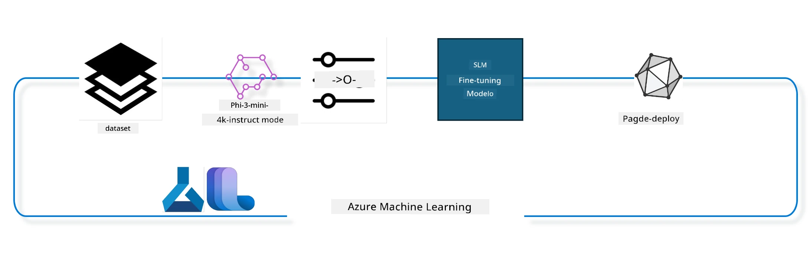

## Paano gamitin ang mga component ng chat-completion mula sa Azure ML system registry para i-fine tune ang isang modelo

Sa halimbawa na ito, gagawin natin ang fine tuning ng Phi-3-mini-4k-instruct na modelo upang tapusin ang isang pag-uusap sa pagitan ng 2 tao gamit ang ultrachat_200k na dataset.



Ipinapakita ng halimbawa kung paano gawin ang fine tuning gamit ang Azure ML SDK at Python at pagkatapos ay i-deploy ang fine tuned na modelo sa isang online endpoint para sa real time inference.

### Training data

Gagamitin natin ang ultrachat_200k dataset. Ito ay isang mabigat na na-filter na bersyon ng UltraChat dataset at ginamit para sanayin ang Zephyr-7B-β, isang state of the art na 7b chat model.

### Modelo

Gagamitin natin ang Phi-3-mini-4k-instruct na modelo upang ipakita kung paano maaaring i-finetune ng user ang isang modelo para sa chat-completion na gawain. Kung binuksan mo ang notebook na ito mula sa isang partikular na model card, tandaan na palitan ang partikular na pangalan ng modelo.

### Mga Gawain

- Pumili ng modelong i-fine tune.
- Pumili at siyasatin ang training data.
- I-configure ang fine tuning na trabaho.
- Patakbuhin ang fine tuning na trabaho.
- Suriin ang training at evaluation metrics.
- Irehistro ang fine tuned na modelo.
- I-deploy ang fine tuned na modelo para sa real time inference.
- Linisin ang mga resources.

## 1. Ihanda ang mga pre-requisites

- I-install ang mga dependencies
- Kumonekta sa AzureML Workspace. Alamin pa sa pag-setup ng SDK authentication. Palitan ang <WORKSPACE_NAME>, <RESOURCE_GROUP> at <SUBSCRIPTION_ID> sa ibaba.
- Kumonekta sa azureml system registry
- Magtakda ng opsyonal na pangalan ng eksperimento
- Suriin o lumikha ng compute.

> [!NOTE]
> Kinakailangan isang GPU node na maaaring magkaroon ng maraming GPU cards. Halimbawa, sa isang node ng Standard_NC24rs_v3 ay may 4 NVIDIA V100 GPUs habang sa Standard_NC12s_v3, may 2 NVIDIA V100 GPUs. Sumangguni sa docs para sa impormasyong ito. Ang bilang ng GPU cards bawat node ay itinakda sa param na gpus_per_node sa ibaba. Ang tamang pag-set ng value na ito ay titiyak ng paggamit ng lahat ng GPUs sa node. Makikita ang rekomendadong mga GPU compute SKUs dito at dito.

### Mga Python Libraries

I-install ang mga dependencies sa pamamagitan ng pagpapatakbo ng cell sa ibaba. Hindi ito opsyonal kung tumatakbo sa bagong environment.

```bash
pip install azure-ai-ml
pip install azure-identity
pip install datasets==2.9.0
pip install mlflow
pip install azureml-mlflow
```

### Pakikipag-ugnayan sa Azure ML

1. Ang Python script na ito ay ginagamit para makipag-ugnayan sa Azure Machine Learning (Azure ML) service. Narito ang paliwanag kung ano ang ginagawa nito:

    - Ini-import nito ang mga kailangang module mula sa azure.ai.ml, azure.identity, at azure.ai.ml.entities na mga packages. Ini-import din nito ang time module.

    - Sinusubukan nitong mag-authenticate gamit ang DefaultAzureCredential(), na nagbibigay ng pinadaling authentication experience para mabilis makapagsimula sa pag-develop ng mga app na tumatakbo sa Azure cloud. Kung mabigo ito, umaasa ito sa InteractiveBrowserCredential(), na nagbibigay ng interactive na login prompt.

    - Sinusubukan nito na gumawa ng MLClient instance gamit ang from_config method, na nagbabasa ng configuration mula sa default config file (config.json). Kung mabigo ito, manu-mano nitong ginagawa ang MLClient instance sa pamamagitan ng pagbibigay ng subscription_id, resource_group_name, at workspace_name.

    - Gumagawa ito ng isa pang MLClient instance, sa pagkakataong ito para sa Azure ML registry na pinangalanang "azureml". Dito naka-store ang mga modelo, fine-tuning pipelines, at mga environment.

    - Itinakda nito ang experiment_name sa "chat_completion_Phi-3-mini-4k-instruct".

    - Gumagawa ito ng unique na timestamp sa pamamagitan ng pag-convert ng kasalukuyang oras (sa segundo mula sa epoch, bilang floating point number) sa integer at pagkatapos ay string. Magagamit ang timestamp para gumawa ng unique na pangalan at bersyon.

    ```python
    # I-import ang mga kinakailangang module mula sa Azure ML at Azure Identity
    from azure.ai.ml import MLClient
    from azure.identity import (
        DefaultAzureCredential,
        InteractiveBrowserCredential,
    )
    from azure.ai.ml.entities import AmlCompute
    import time  # I-import ang time module
    
    # Subukang mag-authenticate gamit ang DefaultAzureCredential
    try:
        credential = DefaultAzureCredential()
        credential.get_token("https://management.azure.com/.default")
    except Exception as ex:  # Kung mabigo ang DefaultAzureCredential, gamitin ang InteractiveBrowserCredential
        credential = InteractiveBrowserCredential()
    
    # Subukang gumawa ng MLClient instance gamit ang default config file
    try:
        workspace_ml_client = MLClient.from_config(credential=credential)
    except:  # Kung mabigo iyon, gumawa ng MLClient instance sa pamamagitan ng manu-manong pagbibigay ng mga detalye
        workspace_ml_client = MLClient(
            credential,
            subscription_id="<SUBSCRIPTION_ID>",
            resource_group_name="<RESOURCE_GROUP>",
            workspace_name="<WORKSPACE_NAME>",
        )
    
    # Gumawa ng isa pang MLClient instance para sa Azure ML registry na pinangalanang "azureml"
    # Dito sa registry na ito tinatago ang mga modelo, fine-tuning pipelines, at mga environment
    registry_ml_client = MLClient(credential, registry_name="azureml")
    
    # Itakda ang pangalan ng eksperimento
    experiment_name = "chat_completion_Phi-3-mini-4k-instruct"
    
    # Gumawa ng isang natatanging timestamp na maaaring gamitin para sa mga pangalan at bersyon na kailangang maging natatangi
    timestamp = str(int(time.time()))
    ```

## 2. Pumili ng foundation model na i-fine tune

1. Ang Phi-3-mini-4k-instruct ay isang 3.8B parameters, magaan, state-of-the-art open model na binuo gamit ang mga dataset na ginamit para sa Phi-2. Ang modelong ito ay bahagi ng Phi-3 model family, at ang Mini version ay may dalawang variant: 4K at 128K na siyang context length (sa tokens) na kaya nitong suportahan. Kailangang i-finetune ang modelo para sa ating partikular na layunin bago ito gamitin. Maaari mong makita ang mga modelong ito sa Model Catalog ng AzureML Studio, gamit ang filter para sa chat-completion task. Sa halimbawang ito, ginagamit natin ang Phi-3-mini-4k-instruct na modelo. Kung nabuksan mo ang notebook na ito para sa ibang modelo, palitan ang pangalan ng modelo at bersyon nang naaayon.

> [!NOTE]
> Ang modelo id property ng modelo. Ito ang ipapasa bilang input sa fine tuning na trabaho. Makikita rin ito bilang Asset ID field sa model details page sa AzureML Studio Model Catalog.

2. Ang Python script na ito ay nakikipag-ugnayan sa Azure Machine Learning (Azure ML) service. Narito ang paliwanag kung ano ang ginagawa nito:

    - Itinakda nito ang model_name sa "Phi-3-mini-4k-instruct".

    - Ginagamit nito ang get method mula sa models property ng registry_ml_client object para kunin ang pinakabagong bersyon ng modelo na may partikular na pangalan mula sa Azure ML registry. Ang get method ay tinawag na may dalawang argumento: ang pangalan ng modelo at isang label na nagsasaad na ang pinakabagong bersyon ang kukunin.

    - Nagpi-print ito ng mensahe sa console na nagsasaad ng pangalan, bersyon, at id ng modelong gagamitin para sa fine-tuning. Ginagamit ang format method ng string upang isingit ang pangalan, bersyon, at id ng modelo. Ang mga ito ay na-access bilang mga property ng foundation_model object.

    ```python
    # Itakda ang pangalan ng modelo
    model_name = "Phi-3-mini-4k-instruct"
    
    # Kunin ang pinakabagong bersyon ng modelo mula sa Azure ML registry
    foundation_model = registry_ml_client.models.get(model_name, label="latest")
    
    # I-print ang pangalan ng modelo, bersyon, at id
    # Ang impormasyong ito ay kapaki-pakinabang para sa pagsubaybay at pag-debug
    print(
        "\n\nUsing model name: {0}, version: {1}, id: {2} for fine tuning".format(
            foundation_model.name, foundation_model.version, foundation_model.id
        )
    )
    ```

## 3. Gumawa ng compute na gagamitin para sa trabaho

Ang fine tune na trabaho ay gumagana LAMANG sa GPU compute. Ang laki ng compute ay depende sa laki ng modelo at sa karamihan ng mga kaso ay mahirap tukuyin ang tamang compute para sa trabaho. Sa cell na ito, gabay natin ang user sa pagpili ng tamang compute para sa trabaho.

> [!NOTE]
> Ang mga compute na nakalista sa ibaba ay gumagana gamit ang pinaka-optimize na configuration. Anumang pagbabago sa configuration ay maaaring magdulot ng Cuda Out Of Memory error. Sa ganoong mga kaso, subukan mag-upgrade sa mas malaking compute size.

> [!NOTE]
> Kapag pumipili ng compute_cluster_size sa ibaba, siguraduhing available ang compute sa iyong resource group. Kung ang isang partikular na compute ay hindi available, maaari kang humiling ng access sa compute resources.

### Pagsusuri ng Modelo para sa Suporta sa Fine Tuning

1. Ang Python script na ito ay nakikipag-ugnayan sa isang Azure Machine Learning (Azure ML) modelo. Narito ang paliwanag ng ginagawa nito:

    - Ini-import nito ang ast module, na nagbibigay ng mga function para iproseso ang mga puno ng Python abstract syntax grammar.

    - Sinusuri nito kung ang foundation_model object (na kumakatawan sa isang modelo sa Azure ML) ay may tag na finetune_compute_allow_list. Ang mga tag sa Azure ML ay key-value pairs na maaaring likhain at gamitin para sa filtering at pag-aayos ng mga modelo.

    - Kung mayroon ang tag na finetune_compute_allow_list, ginagamit nito ang ast.literal_eval function para ligtas na i-parse ang halaga ng tag (isang string) sa isang Python list. Ang list na ito ay itinalaga sa computes_allow_list variable. Nagpi-print ito ng mensahe na nagsasaad na isang compute ang dapat likhain mula sa listahan.

    - Kung walang finetune_compute_allow_list tag, itinatakda nito ang computes_allow_list sa None at nagpi-print ng mensahe na nagsasaad na ang tag na finetune_compute_allow_list ay hindi bahagi ng mga tag ng modelo.

    - Sa kabuuan, tinitingnan ng script na ito ang isang partikular na tag sa metadata ng modelo, kino-convert ang halaga ng tag sa listahan kung mayroon ito, at nagbibigay ng feedback sa user nang naaayon.

    ```python
    # I-import ang ast module, na nagbibigay ng mga function upang iproseso ang mga puno ng Python abstract syntax grammar
    import ast
    
    # Suriin kung ang tag na 'finetune_compute_allow_list' ay naroroon sa mga tag ng modelo
    if "finetune_compute_allow_list" in foundation_model.tags:
        # Kung ang tag ay naroroon, gamitin ang ast.literal_eval upang ligtas na i-parse ang halaga ng tag (isang string) papuntang isang Python list
        computes_allow_list = ast.literal_eval(
            foundation_model.tags["finetune_compute_allow_list"]
        )  # i-convert ang string sa python list
        # Mag-print ng mensahe na nagpapahiwatig na dapat gumawa ng compute mula sa listahan
        print(f"Please create a compute from the above list - {computes_allow_list}")
    else:
        # Kung ang tag ay wala, itakda ang computes_allow_list sa None
        computes_allow_list = None
        # Mag-print ng mensahe na nagsasaad na ang 'finetune_compute_allow_list' tag ay hindi bahagi ng mga tag ng modelo
        print("`finetune_compute_allow_list` is not part of model tags")
    ```

### Pagsusuri ng Compute Instance

1. Ang Python script na ito ay nakikipag-ugnayan sa Azure Machine Learning (Azure ML) service at nagsasagawa ng ilang pagsusuri sa isang compute instance. Narito ang paliwanag ng ginagawa nito:

    - Sinusubukan nitong kunin ang compute instance na may pangalang naka-imbak sa compute_cluster mula sa Azure ML workspace. Kung ang provisioning state ng compute instance ay "failed", magtataas ito ng ValueError.

    - Sinusuri kung ang computes_allow_list ay hindi None. Kung hindi, kinokonvert nito ang lahat ng compute sizes sa listahan sa lowercase at tinitingnan kung ang sukat ng kasalukuyang compute instance ay nasa listahan. Kung wala, magtataas ito ng ValueError.

    - Kung ang computes_allow_list ay None, sinusuri nito kung ang laki ng compute instance ay nasa listahan ng mga hindi suportadong GPU VM sizes. Kung oo, magtataas ito ng ValueError.

    - Kinuha nito ang listahan ng lahat ng available na compute sizes sa workspace. Ini-iterate nito ang listahan, at para sa bawat compute size, sinuri kung tumutugma ang pangalan sa laki ng kasalukuyang compute instance. Kung oo, kinuha nito ang bilang ng GPU para sa compute size at itinatakda ang gpu_count_found sa True.

    - Kapag ang gpu_count_found ay True, nagpi-print ito ng bilang ng GPUs sa compute instance. Kung False, nagtataas ito ng ValueError.

    - Sa kabuuan, nagsasagawa ang script na ito ng maraming pagsusuri sa compute instance sa Azure ML workspace, kabilang ang status ng provisioning nito, ang laki laban sa allow list o deny list, at ang bilang ng GPUs na mayroon ito.
    
    ```python
    # I-print ang mensahe ng exception
    print(e)
    # Magtaas ng ValueError kung ang laki ng compute ay hindi available sa workspace
    raise ValueError(
        f"WARNING! Compute size {compute_cluster_size} not available in workspace"
    )
    
    # Kunin ang compute instance mula sa Azure ML workspace
    compute = workspace_ml_client.compute.get(compute_cluster)
    # Suriin kung ang estado ng provisioning ng compute instance ay "failed"
    if compute.provisioning_state.lower() == "failed":
        # Magtaas ng ValueError kung ang estado ng provisioning ay "failed"
        raise ValueError(
            f"Provisioning failed, Compute '{compute_cluster}' is in failed state. "
            f"please try creating a different compute"
        )
    
    # Suriin kung ang computes_allow_list ay hindi None
    if computes_allow_list is not None:
        # I-convert lahat ng mga laki ng compute sa computes_allow_list sa maliit na titik
        computes_allow_list_lower_case = [x.lower() for x in computes_allow_list]
        # Suriin kung ang laki ng compute instance ay nasa computes_allow_list_lower_case
        if compute.size.lower() not in computes_allow_list_lower_case:
            # Magtaas ng ValueError kung ang laki ng compute instance ay wala sa computes_allow_list_lower_case
            raise ValueError(
                f"VM size {compute.size} is not in the allow-listed computes for finetuning"
            )
    else:
        # Tukuyin ang listahan ng mga hindi suportadong GPU VM na laki
        unsupported_gpu_vm_list = [
            "standard_nc6",
            "standard_nc12",
            "standard_nc24",
            "standard_nc24r",
        ]
        # Suriin kung ang laki ng compute instance ay nasa unsupported_gpu_vm_list
        if compute.size.lower() in unsupported_gpu_vm_list:
            # Magtaas ng ValueError kung ang laki ng compute instance ay nasa unsupported_gpu_vm_list
            raise ValueError(
                f"VM size {compute.size} is currently not supported for finetuning"
            )
    
    # I-initialize ang flag para suriin kung nahanap na ang bilang ng mga GPU sa compute instance
    gpu_count_found = False
    # Kunin ang listahan ng lahat ng available na laki ng compute sa workspace
    workspace_compute_sku_list = workspace_ml_client.compute.list_sizes()
    available_sku_sizes = []
    # Ulitin ang listahan ng mga available na laki ng compute
    for compute_sku in workspace_compute_sku_list:
        available_sku_sizes.append(compute_sku.name)
        # Suriin kung ang pangalan ng laki ng compute ay tumutugma sa laki ng compute instance
        if compute_sku.name.lower() == compute.size.lower():
            # Kung oo, kunin ang bilang ng mga GPU para sa compute size na iyon at itakda ang gpu_count_found sa True
            gpus_per_node = compute_sku.gpus
            gpu_count_found = True
    # Kung ang gpu_count_found ay True, i-print ang bilang ng mga GPU sa compute instance
    if gpu_count_found:
        print(f"Number of GPU's in compute {compute.size}: {gpus_per_node}")
    else:
        # Kung ang gpu_count_found ay False, magtaas ng ValueError
        raise ValueError(
            f"Number of GPU's in compute {compute.size} not found. Available skus are: {available_sku_sizes}."
            f"This should not happen. Please check the selected compute cluster: {compute_cluster} and try again."
        )
    ```

## 4. Pumili ng dataset para sa fine-tuning ng modelo

1. Gamit namin ang ultrachat_200k dataset. Ang dataset ay may apat na bahagi, angkop para sa Supervised fine-tuning (sft).
Generation ranking (gen). Ang bilang ng mga halimbawa bawat bahagi ay ipinapakita sa ibaba:

    ```bash
    train_sft test_sft  train_gen  test_gen
    207865  23110  256032  28304
    ```

1. Ipinapakita ng mga sumusunod na cell ang batayang paghahanda ng data para sa fine tuning:

### Ipakita ang ilang mga hilera ng data

Nais nating mabilis tumakbo ang sample na ito, kaya i-save ang train_sft, test_sft files na naglalaman ng 5% ng mga na-trim na hilera. Nangangahulugan ito na ang fine tuned na modelo ay magkakaroon ng mas mababang accuracy, kaya hindi ito dapat gamitin sa totoong mundo.
Ginagamit ang download-dataset.py para i-download ang ultrachat_200k dataset at i-transform ang dataset sa format na maaaring gamitin ng finetune pipeline component. Dahil malaki ang dataset, dito ay bahagi lang ng dataset.

1. Ang pagpapatakbo ng script sa ibaba ay idino-download lamang ang 5% ng data. Maaari itong dagdagan sa pagbabago ng dataset_split_pc parameter sa nais na porsyento.

> [!NOTE]
> Ang ibang mga language model ay may mga ibang language codes kaya ang mga pangalan ng kolum sa dataset ay dapat sumalamin dito.

1. Narito ang isang halimbawa kung paano dapat magmukhang ang data
Ang chat-completion na dataset ay naka-imbak sa parquet format na may bawat entry gamit ang sumusunod na schema:

    - Ito ay isang JSON (JavaScript Object Notation) na dokumento, na isang popular na data interchange format. Hindi ito executable na code, kundi isang paraan upang mag-imbak at magdala ng data. Narito ang paliwanag ng istraktura nito:

    - "prompt": Ang key na ito ay naglalaman ng string value na kumakatawan sa isang gawain o tanong na ibinigay sa AI assistant.

    - "messages": Ang key na ito ay naglalaman ng array ng mga objects. Bawat object ay kumakatawan sa isang mensahe sa pag-uusap sa pagitan ng user at AI assistant. Bawat mensahe ay may dalawang keys:

    - "content": Ang key na ito ay naglalaman ng string value na kumakatawan sa nilalaman ng mensahe.
    - "role": Ang key na ito ay naglalaman ng string value na kumakatawan sa papel ng entidad na nagpadala ng mensahe. Maaaring "user" o "assistant".
    - "prompt_id": Ang key na ito ay naglalaman ng string value na kumakatawan sa natatanging identifier para sa prompt.

1. Sa tiyak na JSON document na ito, inilarawan ang pag-uusap kung saan humihiling ang user sa AI assistant na gumawa ng isang protagonist para sa isang dystopian na kuwento. Sumagot ang assistant, at pagkatapos ay humiling ang user ng dagdag na mga detalye. Pumayag ang assistant na magbigay ng dagdag na detalye. Ang buong pag-uusap ay naka-ugnay sa isang partikular na prompt id.

    ```python
    {
        // The task or question posed to an AI assistant
        "prompt": "Create a fully-developed protagonist who is challenged to survive within a dystopian society under the rule of a tyrant. ...",
        
        // An array of objects, each representing a message in a conversation between a user and an AI assistant
        "messages":[
            {
                // The content of the user's message
                "content": "Create a fully-developed protagonist who is challenged to survive within a dystopian society under the rule of a tyrant. ...",
                // The role of the entity that sent the message
                "role": "user"
            },
            {
                // The content of the assistant's message
                "content": "Name: Ava\n\n Ava was just 16 years old when the world as she knew it came crashing down. The government had collapsed, leaving behind a chaotic and lawless society. ...",
                // The role of the entity that sent the message
                "role": "assistant"
            },
            {
                // The content of the user's message
                "content": "Wow, Ava's story is so intense and inspiring! Can you provide me with more details.  ...",
                // The role of the entity that sent the message
                "role": "user"
            }, 
            {
                // The content of the assistant's message
                "content": "Certainly! ....",
                // The role of the entity that sent the message
                "role": "assistant"
            }
        ],
        
        // A unique identifier for the prompt
        "prompt_id": "d938b65dfe31f05f80eb8572964c6673eddbd68eff3db6bd234d7f1e3b86c2af"
    }
    ```

### I-download ang Data

1. Ang Python script na ito ay ginagamit upang i-download ang isang dataset gamit ang helper script na pinangalanang download-dataset.py. Narito ang paliwanag kung ano ang ginagawa nito:

    - Ini-import nito ang os module, na nagbibigay ng portable na paraan para gamitin ang mga functionality na nakadepende sa operating system.

    - Ginagamit nito ang os.system function para patakbuhin ang download-dataset.py script sa shell na may mga tiyak na command-line arguments. Inilalarawan ng mga argumento ang dataset na ida-download (HuggingFaceH4/ultrachat_200k), ang directory na paglalagyan nito (ultrachat_200k_dataset), at ang porsyento ng dataset na paghahatiin (5). Ang os.system function ay nagbabalik ng exit status ng command; ito ay naka-imbak sa exit_status variable.

    - Sinusuri kung ang exit_status ay hindi 0. Sa mga Unix-like operating system, ang exit status na 0 ay karaniwang nangangahulugang nagtagumpay ang isang command, habang anumang ibang numero ay error. Kung hindi 0, nagtataas ito ng Exception na may mensahe na may error sa pag-download ng dataset.

    - Sa kabuuan, pinapatakbo ng script na ito ang command para i-download ang dataset gamit ang helper script at nagtataas ng exception kung pumalya ang command.
    
    ```python
    # I-import ang os module, na nagbibigay ng paraan ng paggamit ng functionality na nakadepende sa operating system
    import os
    
    # Gamitin ang os.system function upang patakbuhin ang download-dataset.py script sa shell gamit ang mga tiyak na command-line arguments
    # Itinatakda ng mga argumento ang dataset na ida-download (HuggingFaceH4/ultrachat_200k), ang direktoryo kung saan ito ida-download (ultrachat_200k_dataset), at ang porsyento ng dataset na hahatiin (5)
    # Ibinabalik ng os.system function ang exit status ng command na pinatakbo nito; ang status na ito ay iniimbak sa exit_status variable
    exit_status = os.system(
        "python ./download-dataset.py --dataset HuggingFaceH4/ultrachat_200k --download_dir ultrachat_200k_dataset --dataset_split_pc 5"
    )
    
    # Suriin kung ang exit_status ay hindi 0
    # Sa mga Unix-like na operating system, ang exit status na 0 ay karaniwang nangangahulugang matagumpay ang command, habang ang ibang numero ay nagpapahiwatig ng error
    # Kung ang exit_status ay hindi 0, magtaas ng Exception na may mensahe na nagsasaad na nagkaroon ng error sa pagda-download ng dataset
    if exit_status != 0:
        raise Exception("Error downloading dataset")
    ```

### Pag-load ng Data sa isang DataFrame
1. Ang Python script na ito ay naglo-load ng JSON Lines file sa isang pandas DataFrame at ipinapakita ang unang 5 na hilera. Narito ang paliwanag ng mga ginagawa nito:

    - Ini-import nito ang pandas library, na isang makapangyarihang library para sa manipulasyon at pagsusuri ng datos.

    - Ise-set nito ang maximum na lapad ng column para sa mga display options ng pandas sa 0. Ibig sabihin nito, ipapakita ang buong teksto ng bawat column nang walang pagtrtruncate kapag prinint ang DataFrame.

    - Ginagamit nito ang pd.read_json function para i-load ang train_sft.jsonl file mula sa ultrachat_200k_dataset directory papunta sa isang DataFrame. Ang argumentong lines=True ay nagsasaad na ang file ay nasa JSON Lines format, kung saan bawat linya ay isang hiwalay na JSON object.

    - Ginagamit nito ang head method upang ipakita ang unang 5 na hilera ng DataFrame. Kung mas mababa sa 5 ang hilera ng DataFrame, ipapakita nito lahat ng ito.

    - Sa kabuuan, ang script na ito ay naglo-load ng JSON Lines file sa isang DataFrame at ipinapakita ang unang 5 na hilera na may buong teksto ng mga column.
    
    ```python
    # I-import ang pandas na librarya, na isang makapangyarihang librarya para sa pag-manipula at pagsusuri ng datos
    import pandas as pd
    
    # Itakda ang maximum na lapad ng kolum para sa mga display options ng pandas sa 0
    # Nangangahulugan ito na ipapakita ang buong teksto ng bawat kolum nang hindi pinaikling kapag na-print ang DataFrame
    pd.set_option("display.max_colwidth", 0)
    
    # Gamitin ang pd.read_json function upang i-load ang train_sft.jsonl file mula sa ultrachat_200k_dataset directory papunta sa isang DataFrame
    # Ang argumentong lines=True ay nagsasaad na ang file ay nasa JSON Lines format, kung saan bawat linya ay isang hiwalay na JSON object
    df = pd.read_json("./ultrachat_200k_dataset/train_sft.jsonl", lines=True)
    
    # Gamitin ang head method upang ipakita ang unang 5 hilera ng DataFrame
    # Kung ang DataFrame ay may kakaunting 5 hilera, ipapakita nito lahat ng mga ito
    df.head()
    ```

## 5. Isumite ang fine tuning job gamit ang model at data bilang mga input

Gumawa ng job na gumagamit ng chat-completion pipeline component. Alamin pa ang tungkol sa lahat ng mga parameter na sinusuportahan para sa fine tuning.

### Tukuyin ang mga finetune na parameter

1. Ang mga finetune na parameter ay maaaring hatiin sa 2 kategorya - mga training parameters, mga optimization parameters

1. Ang mga training parameters ay naglalarawan ng mga aspeto ng training gaya ng -

    - Ang optimizer, scheduler na gagamitin
    - Ang metric na io-optimize para sa finetune
    - Bilang ng training steps at ang batch size at iba pa
    - Ang mga optimization parameters ay tumutulong upang i-optimize ang GPU memory at gamitin nang mahusay ang mga compute resources.

1. Narito ang ilan sa mga parameter na kabilang sa kategoryang ito. Ang mga optimization parameters ay nagkakaiba-iba para sa bawat modelo at nakapackage kasama ang modelo upang hawakan ang mga pagkakaibang ito.

    - I-enable ang deepspeed at LoRA
    - I-enable ang mixed precision training
    - I-enable ang multi-node training

> [!NOTE]
> Ang supervised finetuning ay maaaring magresulta sa pagkawala ng alignment o catastrophic forgetting. Inirerekomenda namin na suriin ang isyung ito at magpatakbo ng alignment stage pagkatapos mong mag-finetune.

### Mga Fine Tuning Parameters

1. Ang Python script na ito ay nagse-set up ng mga parameter para sa fine-tuning ng isang machine learning model. Narito ang paliwanag ng mga ginagawa nito:

    - Nagse-set ito ng mga default training parameters tulad ng bilang ng training epochs, batch sizes para sa training at evaluation, learning rate, at uri ng learning rate scheduler.

    - Nagse-set ito ng mga default optimization parameters gaya ng kung i-aapply ba ang Layer-wise Relevance Propagation (LoRa) at DeepSpeed, at ang DeepSpeed stage.

    - Pinagsasama nito ang mga training at optimization parameters sa isang dictionary na tinatawag na finetune_parameters.

    - Tinitingnan nito kung ang foundation_model ay may mga model-specific default parameters. Kung mayroon, nagpi-print ito ng warning message at ina-update ang finetune_parameters dictionary gamit ang mga model-specific defaults. Ginagamit ang ast.literal_eval function para i-convert ang model-specific defaults mula sa string papuntang Python dictionary.

    - Ipiniprint nito ang final na set ng fine-tuning parameters na gagamitin para sa run.

    - Sa kabuuan, ang script na ito ay nagse-set up at nagpapakita ng mga parameter para sa fine-tuning ng isang machine learning model, na may kakayahang i-override ang mga default na parameter gamit ang mga model-specific na parameter.

    ```python
    # Itakda ang mga default na parameter para sa pagsasanay tulad ng bilang ng training epochs, mga batch size para sa pagsasanay at pagsusuri, learning rate, at uri ng learning rate scheduler
    training_parameters = dict(
        num_train_epochs=3,
        per_device_train_batch_size=1,
        per_device_eval_batch_size=1,
        learning_rate=5e-6,
        lr_scheduler_type="cosine",
    )
    
    # Itakda ang mga default na parameter sa optimization tulad ng kung ilalapat ang Layer-wise Relevance Propagation (LoRa) at DeepSpeed, pati na rin ang DeepSpeed stage
    optimization_parameters = dict(
        apply_lora="true",
        apply_deepspeed="true",
        deepspeed_stage=2,
    )
    
    # Pagsamahin ang mga parameter sa pagsasanay at optimization sa isang diksyunaryo na tinatawag na finetune_parameters
    finetune_parameters = {**training_parameters, **optimization_parameters}
    
    # Suriin kung ang foundation_model ay may mga model-specific default na parameter
    # Kung mayroon, mag-print ng babalang mensahe at i-update ang finetune_parameters diksyunaryo gamit ang mga model-specific na default na ito
    # Ginagamit ang ast.literal_eval function upang i-convert ang mga model-specific na default mula sa string patungo sa Python dictionary
    if "model_specific_defaults" in foundation_model.tags:
        print("Warning! Model specific defaults exist. The defaults could be overridden.")
        finetune_parameters.update(
            ast.literal_eval(  # i-convert ang string sa python dict
                foundation_model.tags["model_specific_defaults"]
            )
        )
    
    # I-print ang huling hanay ng mga fine-tuning parameter na gagamitin para sa pagpapatakbo
    print(
        f"The following finetune parameters are going to be set for the run: {finetune_parameters}"
    )
    ```

### Training Pipeline

1. Ang Python script na ito ay nagdedeklara ng isang function para gumawa ng display name para sa isang machine learning training pipeline, at tinatawag ang function na ito upang makagawa at mai-print ang display name. Narito ang paliwanag ng mga ginagawa nito:

1. Dinefine ang get_pipeline_display_name function. Ang function na ito ay gumagawa ng display name batay sa iba't ibang mga parameter na may kaugnayan sa training pipeline.

1. Sa loob ng function, kinakalculate ang total batch size sa pamamagitan ng pag-multiply ng per-device batch size, bilang ng gradient accumulation steps, bilang ng GPUs kada node, at bilang ng mga node na ginagamit para sa fine-tuning.

1. Kinukuha nito ang iba't ibang iba pang mga parameter tulad ng uri ng learning rate scheduler, kung naka-apply ang DeepSpeed, ang DeepSpeed stage, kung naka-apply ang Layer-wise Relevance Propagation (LoRa), ang limitasyon sa bilang ng model checkpoints na dapat panatilihin, at ang maximum sequence length.

1. Gumagawa ito ng string na nagsasama ng lahat ng mga parameter na ito, pinaghiwalay ng hyphens. Kung naka-apply ang DeepSpeed o LoRa, isasama nito ang "ds" kasunod ng DeepSpeed stage, o "lora" nang naaayon. Kung hindi, isasama nito ang "nods" o "nolora" nang naaayon.

1. Ibinabalik ng function ang string na ito, na nagsisilbing display name para sa training pipeline.

1. Pagkatapos madinefine ang function, ito ay tinatawag upang makagawa ng display name, na pagkatapos ay ini-print.

1. Sa kabuuan, ang script na ito ay gumagawa ng display name para sa isang machine learning training pipeline batay sa iba't ibang parameter, at pagkatapos ay ini-print ang display name na ito.

    ```python
    # Magtukoy ng isang function para gumawa ng pangalan ng display para sa training pipeline
    def get_pipeline_display_name():
        # Kalkulahin ang kabuuang batch size sa pamamagitan ng pag-multiply ng batch size kada device, bilang ng gradient accumulation steps, bilang ng GPUs kada node, at bilang ng mga node na ginagamit para sa fine-tuning
        batch_size = (
            int(finetune_parameters.get("per_device_train_batch_size", 1))
            * int(finetune_parameters.get("gradient_accumulation_steps", 1))
            * int(gpus_per_node)
            * int(finetune_parameters.get("num_nodes_finetune", 1))
        )
        # Kunin ang uri ng learning rate scheduler
        scheduler = finetune_parameters.get("lr_scheduler_type", "linear")
        # Alamin kung ginagamit ang DeepSpeed
        deepspeed = finetune_parameters.get("apply_deepspeed", "false")
        # Kunin ang stage ng DeepSpeed
        ds_stage = finetune_parameters.get("deepspeed_stage", "2")
        # Kung ginagamit ang DeepSpeed, isama ang "ds" kasunod ang stage ng DeepSpeed sa display name; kung hindi, isama ang "nods"
        if deepspeed == "true":
            ds_string = f"ds{ds_stage}"
        else:
            ds_string = "nods"
        # Alamin kung ginagamit ang Layer-wise Relevance Propagation (LoRa)
        lora = finetune_parameters.get("apply_lora", "false")
        # Kung ginagamit ang LoRa, isama ang "lora" sa display name; kung hindi, isama ang "nolora"
        if lora == "true":
            lora_string = "lora"
        else:
            lora_string = "nolora"
        # Kunin ang limitasyon sa bilang ng mga model checkpoint na itatago
        save_limit = finetune_parameters.get("save_total_limit", -1)
        # Kunin ang maximum na haba ng sequence
        seq_len = finetune_parameters.get("max_seq_length", -1)
        # Buuhin ang display name sa pamamagitan ng pagsasama-sama ng lahat ng mga parameter na ito, pinaghiwalay ng mga hyphen
        return (
            model_name
            + "-"
            + "ultrachat"
            + "-"
            + f"bs{batch_size}"
            + "-"
            + f"{scheduler}"
            + "-"
            + ds_string
            + "-"
            + lora_string
            + f"-save_limit{save_limit}"
            + f"-seqlen{seq_len}"
        )
    
    # Tawagin ang function para gumawa ng display name
    pipeline_display_name = get_pipeline_display_name()
    # I-print ang display name
    print(f"Display name used for the run: {pipeline_display_name}")
    ```

### Pag-configure ng Pipeline

Ang Python script na ito ay nagdedeklara at nagkokonfigura ng isang machine learning pipeline gamit ang Azure Machine Learning SDK. Narito ang paliwanag ng mga ginagawa nito:

1. Ini-import nito ang mga kinakailangang modules mula sa Azure AI ML SDK.

1. Kinukuha nito ang isang pipeline component na may pangalan na "chat_completion_pipeline" mula sa registry.

1. Ipinapahayag nito ang isang pipeline job gamit ang `@pipeline` decorator at ang function na `create_pipeline`. Ang pangalan ng pipeline ay itinakda sa `pipeline_display_name`.

1. Sa loob ng `create_pipeline` function, ini-initialize ang nakuha na pipeline component gamit ang iba't ibang parameter, kabilang ang model path, compute clusters para sa iba't ibang yugto, dataset splits para sa training at testing, ang bilang ng GPUs na gagamitin para sa fine-tuning, at iba pang fine-tuning parameters.

1. Inuugnay nito ang output ng fine-tuning job sa output ng pipeline job. Ginagawa ito upang ang fine-tuned model ay madaling mairehistro, na kinakailangan upang ma-deploy ang modelo sa isang online o batch endpoint.

1. Gumagawa ito ng isang instance ng pipeline sa pamamagitan ng pagtawag sa `create_pipeline` function.

1. Ise-set nito ang `force_rerun` setting ng pipeline sa `True`, ibig sabihin ay hindi gagamitin ang cached results mula sa mga nakaraang jobs.

1. Ise-set nito ang `continue_on_step_failure` setting ng pipeline sa `False`, ibig sabihin ay hihinto ang pipeline kung may anumang step na nabigo.

1. Sa kabuuan, ang script na ito ay nagdedeklara at nagkokonfigura ng isang machine learning pipeline para sa isang chat completion task gamit ang Azure Machine Learning SDK.

    ```python
    # I-import ang mga kinakailangang module mula sa Azure AI ML SDK
    from azure.ai.ml.dsl import pipeline
    from azure.ai.ml import Input
    
    # Kunin ang pipeline component na pinangalanang "chat_completion_pipeline" mula sa registry
    pipeline_component_func = registry_ml_client.components.get(
        name="chat_completion_pipeline", label="latest"
    )
    
    # Tukuyin ang pipeline job gamit ang @pipeline decorator at ang function na create_pipeline
    # Ang pangalan ng pipeline ay itinakda sa pipeline_display_name
    @pipeline(name=pipeline_display_name)
    def create_pipeline():
        # I-initialize ang nakuha na pipeline component gamit ang iba't ibang mga parameter
        # Kasama dito ang model path, compute clusters para sa iba't ibang yugto, dataset splits para sa pagsasanay at pagsubok, ang bilang ng GPUs na gagamitin para sa fine-tuning, at iba pang mga parameter para sa fine-tuning
        chat_completion_pipeline = pipeline_component_func(
            mlflow_model_path=foundation_model.id,
            compute_model_import=compute_cluster,
            compute_preprocess=compute_cluster,
            compute_finetune=compute_cluster,
            compute_model_evaluation=compute_cluster,
            # I-map ang mga dataset splits sa mga parameter
            train_file_path=Input(
                type="uri_file", path="./ultrachat_200k_dataset/train_sft.jsonl"
            ),
            test_file_path=Input(
                type="uri_file", path="./ultrachat_200k_dataset/test_sft.jsonl"
            ),
            # Mga setting para sa pagsasanay
            number_of_gpu_to_use_finetuning=gpus_per_node,  # Itakda sa bilang ng mga GPU na available sa compute
            **finetune_parameters
        )
        return {
            # I-map ang output ng fine tuning job sa output ng pipeline job
            # Ginagawa ito upang madali nating mairehistro ang fine tuned model
            # Kinakailangan ang pagrerehistro ng model upang mairedeploy ang model sa isang online o batch endpoint
            "trained_model": chat_completion_pipeline.outputs.mlflow_model_folder
        }
    
    # Gumawa ng instance ng pipeline sa pamamagitan ng pagtawag sa create_pipeline function
    pipeline_object = create_pipeline()
    
    # Huwag gumamit ng cached results mula sa mga naunang job
    pipeline_object.settings.force_rerun = True
    
    # Itakda ang continue on step failure sa False
    # Ibig sabihin nito ay hihinto ang pipeline kung may alin mang hakbang na mabigo
    pipeline_object.settings.continue_on_step_failure = False
    ```

### Isumite ang Job

1. Ang Python script na ito ay nagsusumite ng isang machine learning pipeline job sa Azure Machine Learning workspace at pagkatapos ay naghihintay na matapos ang job. Narito ang paliwanag ng mga ginagawa nito:

    - Tinatawag nito ang create_or_update method ng jobs object sa workspace_ml_client upang isumite ang pipeline job. Ang pipeline na tatakbuhin ay tinukoy ng pipeline_object, at ang eksperimento kung saan tatakbo ang job ay tinukoy ng experiment_name.

    - Pagkatapos, tinatawag nito ang stream method ng jobs object sa workspace_ml_client upang maghintay na matapos ang pipeline job. Ang job na hinihintay ay tinukoy ng name attribute ng pipeline_job object.

    - Sa kabuuan, ang script na ito ay nagsusumite ng machine learning pipeline job sa Azure Machine Learning workspace, at pagkatapos ay naghihintay na matapos ang job.

    ```python
    # Isumite ang pipeline job sa Azure Machine Learning workspace
    # Ang pipeline na tatakbuhin ay tinutukoy ng pipeline_object
    # Ang eksperimento kung saan pinatakbo ang job ay tinutukoy ng experiment_name
    pipeline_job = workspace_ml_client.jobs.create_or_update(
        pipeline_object, experiment_name=experiment_name
    )
    
    # Maghintay hanggang matapos ang pipeline job
    # Ang job na hihintayin ay tinutukoy ng name attribute ng pipeline_job object
    workspace_ml_client.jobs.stream(pipeline_job.name)
    ```

## 6. Irehistro ang fine tuned na modelo sa workspace

Ire-register natin ang modelo mula sa output ng fine tuning job. Susubaybayan nito ang lineage sa pagitan ng fine tuned na modelo at ng fine tuning job. Ang fine tuning job, bukod dito, ay sumusubaybay ng lineage sa foundation model, data, at training code.

### Pagrehistro ng ML Model

1. Ang Python script na ito ay nagrerehistro ng isang machine learning model na na-train sa isang Azure Machine Learning pipeline. Narito ang paliwanag ng mga ginagawa nito:

    - Ini-import nito ang mga kinakailangang modules mula sa Azure AI ML SDK.

    - Tinitingnan nito kung ang trained_model output ay available mula sa pipeline job sa pamamagitan ng pagtawag sa get method ng jobs object sa workspace_ml_client at ina-access ang outputs attribute nito.

    - Gumagawa ito ng path papunta sa trained model sa pamamagitan ng pag-format ng string gamit ang pangalan ng pipeline job at pangalan ng output ("trained_model").

    - Nagde-define ng pangalan para sa fine-tuned na modelo sa pamamagitan ng pagdagdag ng "-ultrachat-200k" sa orihinal na pangalan ng modelo at pagpapalit ng mga slash ng hyphens.

    - Naghahanda ito para irehistro ang modelo sa pamamagitan ng paggawa ng Model object na may iba't ibang mga parameter, kabilang ang path ng modelo, uri ng modelo (MLflow model), pangalan at bersyon ng modelo, at isang deskripsyon ng modelo.

    - Ire-register ang modelo sa pamamagitan ng pagtawag sa create_or_update method ng models object sa workspace_ml_client gamit ang Model object bilang argumento.

    - Ini-print nito ang nairehistrong modelo.

1. Sa kabuuan, ang script na ito ay nagrerehistro ng isang machine learning model na na-train sa isang Azure Machine Learning pipeline.
    
    ```python
    # I-import ang mga kinakailangang module mula sa Azure AI ML SDK
    from azure.ai.ml.entities import Model
    from azure.ai.ml.constants import AssetTypes
    
    # Suriin kung available ang `trained_model` output mula sa pipeline job
    print("pipeline job outputs: ", workspace_ml_client.jobs.get(pipeline_job.name).outputs)
    
    # Bumuo ng path patungo sa trained model sa pamamagitan ng pag-format ng string gamit ang pangalan ng pipeline job at ang pangalan ng output ("trained_model")
    model_path_from_job = "azureml://jobs/{0}/outputs/{1}".format(
        pipeline_job.name, "trained_model"
    )
    
    # Tukuyin ang pangalan para sa fine-tuned model sa pamamagitan ng pagdagdag ng "-ultrachat-200k" sa orihinal na pangalan ng modelo at pagpapalit ng anumang mga slash ng hyphen
    finetuned_model_name = model_name + "-ultrachat-200k"
    finetuned_model_name = finetuned_model_name.replace("/", "-")
    
    print("path to register model: ", model_path_from_job)
    
    # Maghanda upang irehistro ang modelo sa pamamagitan ng paglikha ng isang Model object na may iba't ibang mga parameter
    # Kasama dito ang path papunta sa modelo, ang uri ng modelo (MLflow model), ang pangalan at bersyon ng modelo, at isang paglalarawan ng modelo
    prepare_to_register_model = Model(
        path=model_path_from_job,
        type=AssetTypes.MLFLOW_MODEL,
        name=finetuned_model_name,
        version=timestamp,  # Gamitin ang timestamp bilang bersyon upang maiwasan ang conflict sa bersyon
        description=model_name + " fine tuned model for ultrachat 200k chat-completion",
    )
    
    print("prepare to register model: \n", prepare_to_register_model)
    
    # Irehistro ang modelo sa pamamagitan ng pagtawag sa create_or_update method ng models object sa workspace_ml_client gamit ang Model object bilang argumento
    registered_model = workspace_ml_client.models.create_or_update(
        prepare_to_register_model
    )
    
    # I-print ang nairehistrong modelo
    print("registered model: \n", registered_model)
    ```

## 7. I-deploy ang fine tuned model sa isang online endpoint

Ang mga online endpoints ay nagbibigay ng matatag na REST API na maaaring gamitin upang i-integrate sa mga aplikasyon na kailangang gamitin ang modelo.

### Pamahalaan ang Endpoint

1. Ang Python script na ito ay lumilikha ng isang managed online endpoint sa Azure Machine Learning para sa isang nairehistrong modelo. Narito ang paliwanag ng mga ginagawa nito:

    - Ini-import nito ang mga kinakailangang modules mula sa Azure AI ML SDK.

    - Nagde-define ito ng isang natatanging pangalan para sa online endpoint sa pamamagitan ng pagdagdag ng timestamp sa string na "ultrachat-completion-".

    - Naghahanda ito upang likhain ang online endpoint sa pamamagitan ng paggawa ng ManagedOnlineEndpoint object na may iba't ibang mga parameter, kabilang ang pangalan ng endpoint, deskripsyon ng endpoint, at authentication mode ("key").

    - Nililikha ang online endpoint sa pamamagitan ng pagtawag sa begin_create_or_update method ng workspace_ml_client gamit ang ManagedOnlineEndpoint object bilang argumento. Pagkatapos ay naghihintay ito para matapos ang operasyon sa pagtawag ng wait method.

1. Sa kabuuan, ang script na ito ay lumilikha ng isang managed online endpoint sa Azure Machine Learning para sa isang nairehistrong modelo.

    ```python
    # I-import ang kinakailangang mga module mula sa Azure AI ML SDK
    from azure.ai.ml.entities import (
        ManagedOnlineEndpoint,
        ManagedOnlineDeployment,
        ProbeSettings,
        OnlineRequestSettings,
    )
    
    # Tukuyin ang isang natatanging pangalan para sa online endpoint sa pamamagitan ng pagdaragdag ng timestamp sa string na "ultrachat-completion-"
    online_endpoint_name = "ultrachat-completion-" + timestamp
    
    # Maghanda upang gumawa ng online endpoint sa pamamagitan ng paglikha ng ManagedOnlineEndpoint na object na may iba't ibang mga parameter
    # Kasama dito ang pangalan ng endpoint, isang paglalarawan ng endpoint, at ang authentication mode ("key")
    endpoint = ManagedOnlineEndpoint(
        name=online_endpoint_name,
        description="Online endpoint for "
        + registered_model.name
        + ", fine tuned model for ultrachat-200k-chat-completion",
        auth_mode="key",
    )
    
    # Lumikha ng online endpoint sa pamamagitan ng pagtawag sa begin_create_or_update na method ng workspace_ml_client gamit ang ManagedOnlineEndpoint na object bilang argumento
    # Pagkatapos ay maghintay para matapos ang operasyon ng paglikha sa pamamagitan ng pagtawag sa wait method
    workspace_ml_client.begin_create_or_update(endpoint).wait()
    ```

> [!NOTE]
> Makikita mo dito ang listahan ng mga SKU na sinusuportahan para sa deployment - [Managed online endpoints SKU list](https://learn.microsoft.com/azure/machine-learning/reference-managed-online-endpoints-vm-sku-list)

### Pagde-deploy ng ML Model

1. Ang Python script na ito ay nagde-deploy ng isang nairehistrong machine learning model sa isang managed online endpoint sa Azure Machine Learning. Narito ang paliwanag ng mga ginagawa nito:

    - Ini-import nito ang ast module, na nagbibigay ng mga function upang iproseso ang mga puno ng Python abstract syntax grammar.

    - Ise-set nito ang instance type para sa deployment sa "Standard_NC6s_v3".

    - Tinitingnan nito kung ang inference_compute_allow_list tag ay naroroon sa foundation model. Kung naroroon, kino-convert nito ang halagang ng tag mula sa string patungong Python list at ina-assign ito sa inference_computes_allow_list. Kung wala, ise-set ang inference_computes_allow_list sa None.

    - Tinitingnan nito kung ang tinukoy na instance type ay nasa allow list. Kung hindi, nagpi-print ito ng mensahe na hinihikayat ang user na pumili ng instance type mula sa allow list.

    - Naghahanda ito upang likhain ang deployment sa pamamagitan ng paggawa ng ManagedOnlineDeployment object na may iba't ibang mga parameter, kabilang ang pangalan ng deployment, pangalan ng endpoint, ID ng modelo, instance type at count, mga setting ng liveness probe, at mga setting ng request.

    - Nililikha ang deployment sa pamamagitan ng pagtawag sa begin_create_or_update method ng workspace_ml_client gamit ang ManagedOnlineDeployment object bilang argumento. Pagkatapos ay naghihintay ito para matapos ang operasyon sa pagtawag ng wait method.

    - Ise-set ang traffic ng endpoint upang idirekta ang 100% ng trapiko sa "demo" deployment.

    - Ina-update ang endpoint sa pamamagitan ng pagtawag sa begin_create_or_update method ng workspace_ml_client gamit ang endpoint object bilang argumento. Pagkatapos ay naghihintay ito para matapos ang update operasyon sa pagtawag ng result method.

1. Sa kabuuan, ang script na ito ay nagde-deploy ng isang nairehistrong machine learning model sa isang managed online endpoint sa Azure Machine Learning.

    ```python
    # I-import ang ast module, na nagbibigay ng mga function upang iproseso ang mga puno ng abstract syntax grammar ng Python
    import ast
    
    # Itakda ang uri ng instance para sa deployment
    instance_type = "Standard_NC6s_v3"
    
    # Siyasatin kung ang tag na `inference_compute_allow_list` ay naroroon sa foundation model
    if "inference_compute_allow_list" in foundation_model.tags:
        # Kung naroroon ito, i-convert ang halaga ng tag mula sa string papuntang Python list at italaga ito sa `inference_computes_allow_list`
        inference_computes_allow_list = ast.literal_eval(
            foundation_model.tags["inference_compute_allow_list"]
        )
        print(f"Please create a compute from the above list - {computes_allow_list}")
    else:
        # Kung wala ito, itakda ang `inference_computes_allow_list` sa `None`
        inference_computes_allow_list = None
        print("`inference_compute_allow_list` is not part of model tags")
    
    # Suriin kung ang tinukoy na uri ng instance ay nasa allow list
    if (
        inference_computes_allow_list is not None
        and instance_type not in inference_computes_allow_list
    ):
        print(
            f"`instance_type` is not in the allow listed compute. Please select a value from {inference_computes_allow_list}"
        )
    
    # Maghanda upang lumikha ng deployment sa pamamagitan ng paglikha ng isang `ManagedOnlineDeployment` na object na may iba't ibang parameter
    demo_deployment = ManagedOnlineDeployment(
        name="demo",
        endpoint_name=online_endpoint_name,
        model=registered_model.id,
        instance_type=instance_type,
        instance_count=1,
        liveness_probe=ProbeSettings(initial_delay=600),
        request_settings=OnlineRequestSettings(request_timeout_ms=90000),
    )
    
    # Lumikha ng deployment sa pamamagitan ng pagtawag sa `begin_create_or_update` na metodo ng `workspace_ml_client` gamit ang `ManagedOnlineDeployment` na object bilang argumento
    # Pagkatapos ay maghintay na matapos ang operasyon ng paglikha sa pamamagitan ng pagtawag sa `wait` na metodo
    workspace_ml_client.online_deployments.begin_create_or_update(demo_deployment).wait()
    
    # Itakda ang traffic ng endpoint na idirekta ang 100% ng traffic sa "demo" na deployment
    endpoint.traffic = {"demo": 100}
    
    # I-update ang endpoint sa pamamagitan ng pagtawag sa `begin_create_or_update` na metodo ng `workspace_ml_client` gamit ang `endpoint` na object bilang argumento
    # Pagkatapos ay maghintay na matapos ang operasyon ng pag-update sa pamamagitan ng pagtawag sa `result` na metodo
    workspace_ml_client.begin_create_or_update(endpoint).result()
    ```

## 8. Subukan ang endpoint gamit ang sample data

Kukuha tayo ng ilang sample data mula sa test dataset at isusumite ito sa online endpoint para sa inference. Pagkatapos, ipapakita natin ang scored labels kasabay ng ground truth labels.

### Pagbabasa ng mga resulta

1. Ang Python script na ito ay nagbabasa ng JSON Lines file papunta sa isang pandas DataFrame, kumukuha ng random sample, at nirereset ang index. Narito ang paliwanag ng mga ginagawa nito:

    - Binabasa nito ang file na ./ultrachat_200k_dataset/test_gen.jsonl papunta sa pandas DataFrame. Ginagamit ang read_json function na may argumentong lines=True dahil ang file ay nasa JSON Lines format, kung saan bawat linya ay isang hiwalay na JSON object.

    - Kumukuha ito ng random sample ng 1 hilera mula sa DataFrame. Ginagamit ang sample function na may argumentong n=1 upang tukuyin ang bilang ng random rows na pipiliin.

    - Nirereset nito ang index ng DataFrame. Ginagamit ang reset_index function na may argumentong drop=True upang alisin ang orihinal na index at palitan ito ng bago na default na mga integer na index.

    - Ipinapakita nito ang unang 2 hilera ng DataFrame gamit ang head function na may argumentong 2. Ngunit dahil ang DataFrame ay may iisang hilera lamang pagkatapos ng sampling, ipapakita lamang nito ang isang hilera.

1. Sa kabuuan, ang script na ito ay nagbabasa ng JSON Lines file papunta sa pandas DataFrame, kumukuha ng random sample ng 1 hilera, nire-reset ang index, at ipinapakita ang unang hilera.
    
    ```python
    # Mag-import ng pandas library
    import pandas as pd
    
    # Basahin ang JSON Lines file na './ultrachat_200k_dataset/test_gen.jsonl' sa isang pandas DataFrame
    # Ang argumentong 'lines=True' ay nagsasaad na ang file ay nasa JSON Lines format, kung saan ang bawat linya ay isang hiwalay na JSON na bagay
    test_df = pd.read_json("./ultrachat_200k_dataset/test_gen.jsonl", lines=True)
    
    # Kumuha ng random na sample na 1 hilera mula sa DataFrame
    # Ang argumentong 'n=1' ay tinutukoy ang bilang ng random na mga hilera na pipiliin
    test_df = test_df.sample(n=1)
    
    # I-reset ang index ng DataFrame
    # Ang argumentong 'drop=True' ay nagsasaad na ang orihinal na index ay dapat alisin at palitan ng isang bagong index na may default na mga integer na halaga
    # Ang argumentong 'inplace=True' ay nagsasaad na ang DataFrame ay dapat baguhin nang direkta (nang hindi lumilikha ng bagong bagay)
    test_df.reset_index(drop=True, inplace=True)
    
    # Ipakita ang unang 2 hilera ng DataFrame
    # Gayunpaman, dahil ang DataFrame ay naglalaman lamang ng isang hilera pagkatapos ng sampling, ipapakita lamang nito ang isang hilera na iyon
    test_df.head(2)
    ```

### Gumawa ng JSON Object
1. Ang Python script na ito ay lumilikha ng isang JSON object na may mga tiyak na parameter at sine-save ito sa isang file. Narito ang paghahati-hati ng ginagawa nito:

    - Ini-import nito ang json module, na nagbibigay ng mga function para magtrabaho sa JSON data.

    - Lumilikha ito ng isang dictionary na parameters na may mga susi at halaga na kumakatawan sa mga parameter para sa isang machine learning model. Ang mga susi ay "temperature", "top_p", "do_sample", at "max_new_tokens", at ang kani-kanilang mga halaga ay 0.6, 0.9, True, at 200 ayon sa pagkakasunod.

    - Lumilikha ito ng isa pang dictionary na test_json na may dalawang susi: "input_data" at "params". Ang halaga ng "input_data" ay isa pang dictionary na may mga susi na "input_string" at "parameters". Ang halaga ng "input_string" ay isang listahan na naglalaman ng unang mensahe mula sa test_df DataFrame. Ang halaga ng "parameters" ay ang parameters dictionary na nilikha kanina. Ang halaga ng "params" ay isang walang lamang dictionary.

    - Binubuksan nito ang isang file na pinangalanang sample_score.json
    
    ```python
    # I-import ang json module, na nagbibigay ng mga function upang magtrabaho sa JSON data
    import json
    
    # Gumawa ng isang dictionary na `parameters` na may mga susi at halaga na kumakatawan sa mga parameter para sa isang machine learning model
    # Ang mga susi ay "temperature", "top_p", "do_sample", at "max_new_tokens", at ang kanilang mga kaukulang halaga ay 0.6, 0.9, True, at 200 ayon sa pagkakasunud-sunod
    parameters = {
        "temperature": 0.6,
        "top_p": 0.9,
        "do_sample": True,
        "max_new_tokens": 200,
    }
    
    # Gumawa ng isa pang dictionary na `test_json` na may dalawang susi: "input_data" at "params"
    # Ang halaga ng "input_data" ay isa pang dictionary na may mga susi na "input_string" at "parameters"
    # Ang halaga ng "input_string" ay isang listahan na naglalaman ng unang mensahe mula sa `test_df` DataFrame
    # Ang halaga ng "parameters" ay ang `parameters` dictionary na nilikha kanina
    # Ang halaga ng "params" ay isang walang lamang dictionary
    test_json = {
        "input_data": {
            "input_string": [test_df["messages"][0]],
            "parameters": parameters,
        },
        "params": {},
    }
    
    # Buksan ang isang file na pinangalanang `sample_score.json` sa `./ultrachat_200k_dataset` na direktoryo sa write mode
    with open("./ultrachat_200k_dataset/sample_score.json", "w") as f:
        # Isulat ang `test_json` dictionary sa file sa JSON format gamit ang `json.dump` function
        json.dump(test_json, f)
    ```

### Pagtawag sa Endpoint

1. Ang Python script na ito ay nagtatawag ng isang online endpoint sa Azure Machine Learning upang i-score ang isang JSON file. Narito ang paghahati-hati ng ginagawa nito:

    - Tinatawag nito ang invoke method ng online_endpoints property ng workspace_ml_client object. Ang method na ito ay ginagamit upang magpadala ng request sa isang online endpoint at makuha ang tugon.

    - Itinatakda nito ang pangalan ng endpoint at ang deployment gamit ang endpoint_name at deployment_name na mga argumento. Sa kasong ito, ang pangalan ng endpoint ay naka-imbak sa online_endpoint_name variable at ang pangalan ng deployment ay "demo".

    - Itinatakda nito ang path sa JSON file na i-score gamit ang request_file na argumento. Sa kasong ito, ang file ay ./ultrachat_200k_dataset/sample_score.json.

    - Iniimbak nito ang tugon mula sa endpoint sa response variable.

    - Ipinapakita nito ang raw na tugon.

1. Sa kabuuan, ang script na ito ay nagtatawag ng isang online endpoint sa Azure Machine Learning upang i-score ang isang JSON file at ipinapakita ang tugon.

    ```python
    # Tawagan ang online endpoint sa Azure Machine Learning upang i-score ang file na `sample_score.json`
    # Ginagamit ang `invoke` method ng `online_endpoints` property ng `workspace_ml_client` object upang magpadala ng request sa isang online endpoint at makakuha ng tugon
    # Tinukoy ng argumentong `endpoint_name` ang pangalan ng endpoint, na naka-imbak sa variable na `online_endpoint_name`
    # Tinukoy ng argumentong `deployment_name` ang pangalan ng deployment, na "demo"
    # Tinukoy ng argumentong `request_file` ang path sa JSON file na i-score, na `./ultrachat_200k_dataset/sample_score.json`
    response = workspace_ml_client.online_endpoints.invoke(
        endpoint_name=online_endpoint_name,
        deployment_name="demo",
        request_file="./ultrachat_200k_dataset/sample_score.json",
    )
    
    # I-print ang raw na tugon mula sa endpoint
    print("raw response: \n", response, "\n")
    ```

## 9. Tanggalin ang online endpoint

1. Huwag kalimutang tanggalin ang online endpoint, kung hindi ay magpapatuloy ang pagtakbo ng billing meter para sa compute na ginamit ng endpoint. Ang linyang ito ng Python code ay nagtatanggal ng isang online endpoint sa Azure Machine Learning. Narito ang paghahati-hati ng ginagawa nito:

    - Tinatawag nito ang begin_delete method ng online_endpoints property ng workspace_ml_client object. Ang method na ito ay ginagamit upang simulan ang pagtanggal ng isang online endpoint.

    - Itinatakda nito ang pangalan ng endpoint na tatanggalin gamit ang name na argumento. Sa kasong ito, ang pangalan ng endpoint ay naka-imbak sa online_endpoint_name variable.

    - Tinatawag nito ang wait method upang maghintay na matapos ang operasyon ng pagtanggal. Isa itong blocking operation, ibig sabihin ay pipigilan nito ang script na magpatuloy hangga't hindi tapos ang pagtanggal.

    - Sa kabuuan, ang linyang ito ng code ay nagsisimula ng pagtanggal ng isang online endpoint sa Azure Machine Learning at naghihintay na matapos ang operasyon.

    ```python
    # Tanggalin ang online endpoint sa Azure Machine Learning
    # Ang `begin_delete` method ng `online_endpoints` property ng `workspace_ml_client` object ay ginagamit upang simulan ang pagtanggal ng isang online endpoint
    # Ang `name` na argumento ay tumutukoy sa pangalan ng endpoint na tatanggalin, na naka-imbak sa `online_endpoint_name` na variable
    # Tinatawag ang `wait` method upang maghintay na matapos ang operasyon ng pagtanggal. Ito ay isang blocking operation, ibig sabihin pipigilan nito ang script na magpatuloy hanggang sa matapos ang pagtanggal
    workspace_ml_client.online_endpoints.begin_delete(name=online_endpoint_name).wait()
    ```

---

<!-- CO-OP TRANSLATOR DISCLAIMER START -->
**Paalala**:  
Ang dokumentong ito ay isinalin gamit ang AI translation service na [Co-op Translator](https://github.com/Azure/co-op-translator). Bagamat aming pinagsisikapang maging tumpak ang pagsasalin, pakatandaan na ang mga awtomatikong pagsasalin ay maaaring maglaman ng mga pagkakamali o hindi pagkakatugma. Ang orihinal na dokumento sa orihinal nitong wika ang dapat ituring na opisyal na pinagmulan. Para sa mahahalagang impormasyon, inirerekomenda ang propesyonal na pagsasalin ng tao. Hindi kami mananagot sa anumang hindi pagkakaintindihan o maling interpretasyon na maaaring magmula sa paggamit ng pagsasaling ito.
<!-- CO-OP TRANSLATOR DISCLAIMER END -->