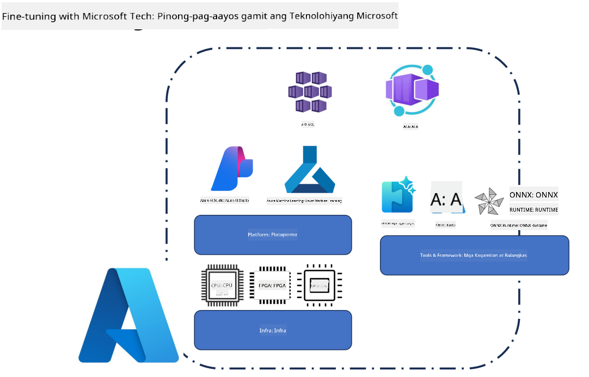
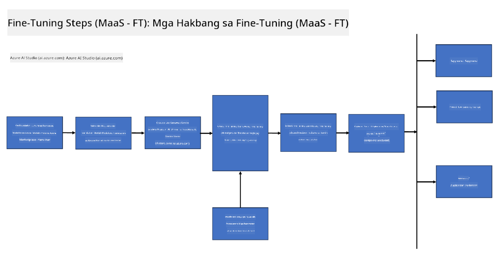
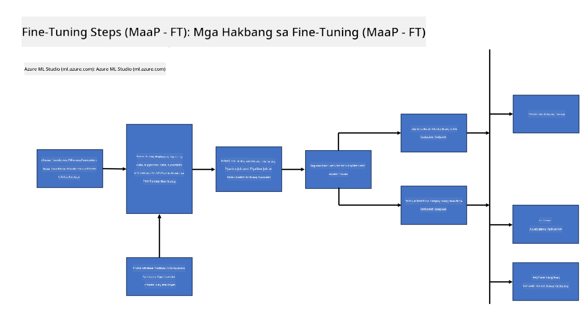
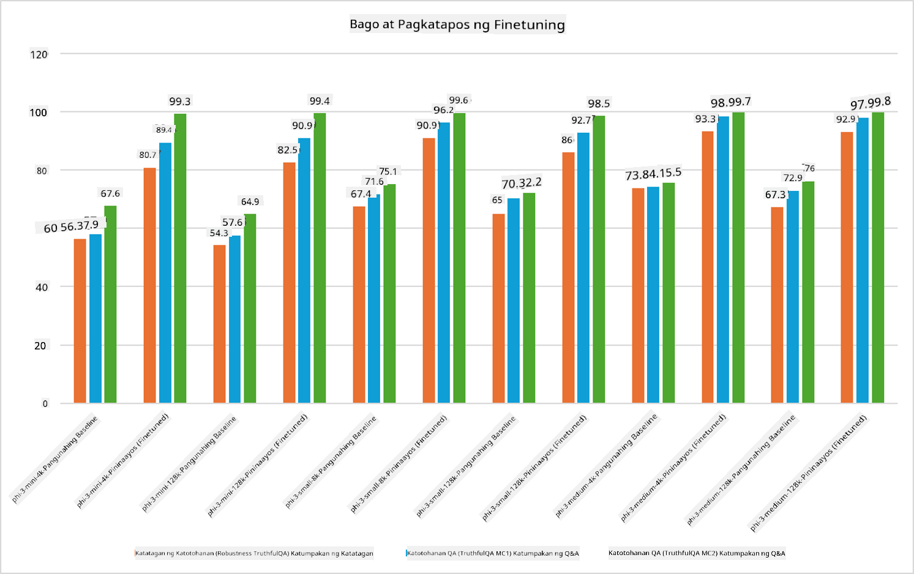

<!--
CO_OP_TRANSLATOR_METADATA:
{
  "original_hash": "cb5648935f63edc17e95ce38f23adc32",
  "translation_date": "2025-05-09T21:57:03+00:00",
  "source_file": "md/03.FineTuning/FineTuning_Scenarios.md",
  "language_code": "tl"
}
-->
## Fine Tuning Scenarios

**Platform** Kasama dito ang iba't ibang teknolohiya tulad ng Azure AI Foundry, Azure Machine Learning, AI Tools, Kaito, at ONNX Runtime.

**Infrastructure** Kasama dito ang CPU at FPGA, na mahalaga para sa proseso ng fine-tuning. Ipapakita ko sa inyo ang mga icon para sa bawat teknolohiyang ito.

**Tools & Framework** Kasama dito ang ONNX Runtime at ONNX Runtime. Ipapakita ko sa inyo ang mga icon para sa bawat teknolohiyang ito.  
[Insert icons for ONNX Runtime and ONNX Runtime]

Ang proseso ng fine-tuning gamit ang mga teknolohiya ng Microsoft ay binubuo ng iba't ibang bahagi at tools. Sa pamamagitan ng pag-unawa at paggamit sa mga teknolohiyang ito, maaari nating epektibong i-fine-tune ang ating mga aplikasyon at makagawa ng mas magagandang solusyon.

## Model as Service

I-fine-tune ang modelo gamit ang hosted fine-tuning, nang hindi na kailangang gumawa at mag-manage ng compute.

Available ang serverless fine-tuning para sa Phi-3-mini at Phi-3-medium models, na nagbibigay-daan sa mga developer na mabilis at madaliang i-customize ang mga modelo para sa cloud at edge scenarios nang hindi na kailangang mag-ayos ng compute. Inanunsyo rin namin na ang Phi-3-small ay available na ngayon sa aming Models-as-a-Service offering para makapagsimula agad ang mga developer sa AI development nang hindi na kailangang i-manage ang underlying infrastructure.

## Model as a Platform

Ang mga user ang nagma-manage ng kanilang sariling compute para i-fine-tune ang kanilang mga modelo.

[Fine Tuning Sample](https://github.com/Azure/azureml-examples/blob/main/sdk/python/foundation-models/system/finetune/chat-completion/chat-completion.ipynb)

## Fine Tuning Scenarios

| | | | | | | |
|-|-|-|-|-|-|-|
|Scenario|LoRA|QLoRA|PEFT|DeepSpeed|ZeRO|DORA|
|Pag-aangkop ng pre-trained LLMs sa mga partikular na gawain o domain|Oo|Oo|Oo|Oo|Oo|Oo|
|Fine-tuning para sa NLP tasks tulad ng text classification, named entity recognition, at machine translation|Oo|Oo|Oo|Oo|Oo|Oo|
|Fine-tuning para sa QA tasks|Oo|Oo|Oo|Oo|Oo|Oo|
|Fine-tuning para sa paggawa ng human-like na tugon sa chatbots|Oo|Oo|Oo|Oo|Oo|Oo|
|Fine-tuning para sa paglikha ng musika, sining, o iba pang anyo ng pagkamalikhain|Oo|Oo|Oo|Oo|Oo|Oo|
|Pagbabawas ng computational at pinansyal na gastos|Oo|Oo|Hindi|Oo|Oo|Hindi|
|Pagbabawas ng paggamit ng memorya|Hindi|Oo|Hindi|Oo|Oo|Oo|
|Paggamit ng mas kaunting parameters para sa mas epektibong fine-tuning|Hindi|Oo|Oo|Hindi|Hindi|Oo|
|Memory-efficient na anyo ng data parallelism na nagbibigay access sa pinagsamang GPU memory ng lahat ng available na GPU devices|Hindi|Hindi|Hindi|Oo|Oo|Oo|

## Fine Tuning Performance Examples

**Pagsasalin**:  
Ang dokumentong ito ay isinalin gamit ang AI translation service na [Co-op Translator](https://github.com/Azure/co-op-translator). Bagamat nagsusumikap kami para sa katumpakan, pakatandaan na ang mga awtomatikong pagsasalin ay maaaring maglaman ng mga pagkakamali o hindi tumpak na impormasyon. Ang orihinal na dokumento sa orihinal nitong wika ang dapat ituring na pangunahing sanggunian. Para sa mahahalagang impormasyon, inirerekomenda ang propesyonal na pagsasalin ng tao. Hindi kami mananagot sa anumang hindi pagkakaintindihan o maling interpretasyon na maaaring magmula sa paggamit ng pagsasaling ito.