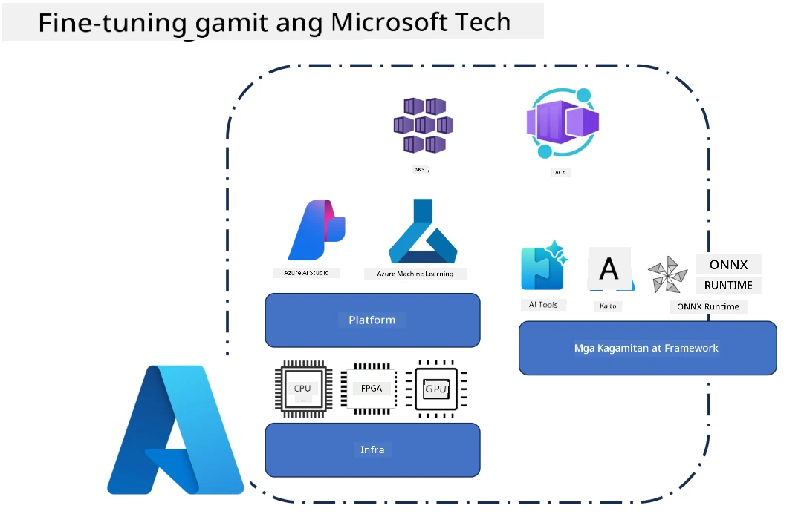
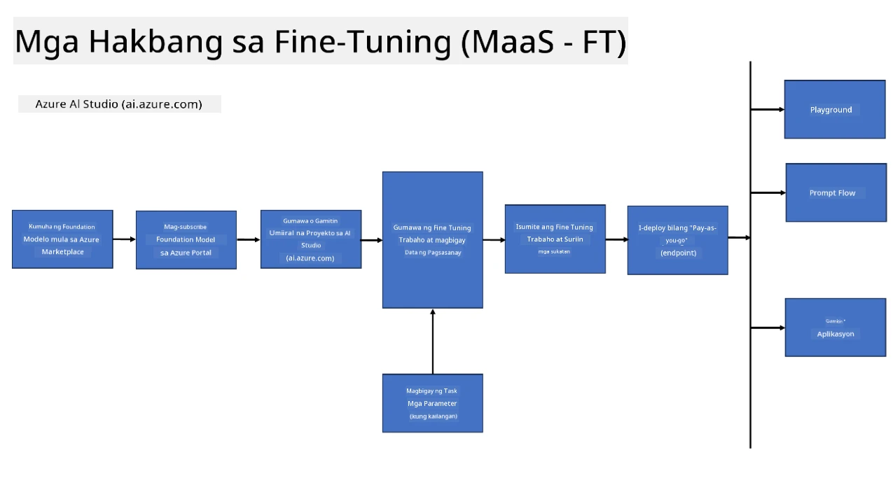
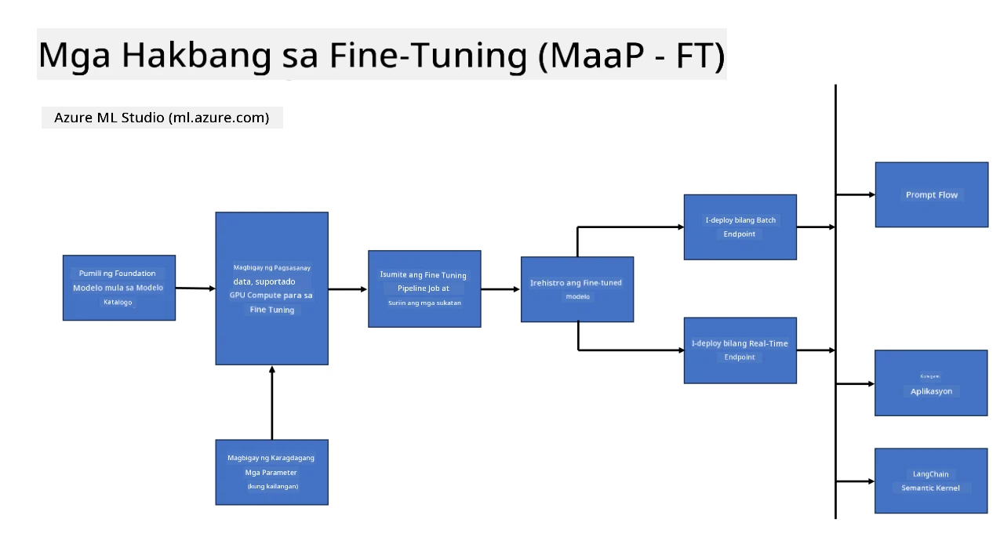
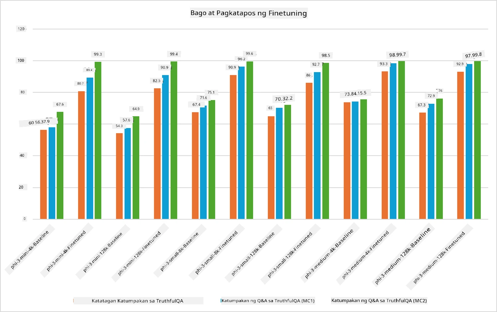

## Mga Senaryo ng Fine Tuning

Nagbibigay ang seksyong ito ng pangkalahatang-ideya ng mga senaryo ng fine-tuning sa Microsoft Foundry at mga kapaligiran ng Azure, kabilang ang mga modelo ng deployment, mga layer ng imprastraktura, at mga karaniwang ginagamit na mga teknik sa pag-optimize.

**Platform**  
Kasama rito ang mga managed services tulad ng Microsoft Foundry (dating Azure AI Foundry) at Azure Machine Learning, na nagbibigay ng pamamahala ng modelo, orkestrasyon, pagsubaybay sa eksperimento, at mga workflow ng deployment.

**Imprastraktura**  
Kailangan ng fine-tuning ng mga scalable compute resources. Sa mga kapaligiran ng Azure, karaniwan itong kinabibilangan ng mga virtual machine na batay sa GPU at mga CPU resources para sa magaan na mga gawain, kasama ang scalable na storage para sa mga dataset at checkpoints.

**Mga Tool at Framework**  
Karaniwang umaasa ang mga workflow ng fine-tuning sa mga framework at mga optimization library tulad ng Hugging Face Transformers, DeepSpeed, at PEFT (Parameter-Efficient Fine-Tuning).

Sinasaklaw ng proseso ng fine-tuning gamit ang mga teknolohiya ng Microsoft ang mga serbisyo ng platform, compute infrastructure, at mga training framework. Sa pamamagitan ng pag-unawa kung paano nagtutulungan ang mga kompyonenteng ito, maaaring maayos na iangkop ng mga developer ang mga foundation models sa mga tiyak na gawain at mga senaryo ng produksyon.

## Modelo bilang Serbisyo

I-fine-tune ang modelo gamit ang hosted fine-tuning, nang hindi kinakailangang lumikha at magpanatili ng compute.

Ang serverless fine-tuning ay ngayon magagamit para sa mga pamilya ng modelo na Phi-3, Phi-3.5, at Phi-4, na nagpapahintulot sa mga developer na mabilis at madaliang i-customize ang mga modelo para sa mga senaryo sa cloud at edge nang hindi na kailangang mag-ayos ng compute.

## Modelo bilang Platform

Pinangangasiwaan ng mga gumagamit ang kanilang sariling compute upang mag-fine-tune ng kanilang mga modelo.

[Fine Tuning Sample](https://github.com/Azure/azureml-examples/blob/main/sdk/python/foundation-models/system/finetune/chat-completion/chat-completion.ipynb)

## Paghahambing ng Mga Teknik sa Fine-Tuning

|Senaryo|LoRA|QLoRA|PEFT|DeepSpeed|ZeRO|DoRA|
|---|---|---|---|---|---|---|
|Paghango ng pre-trained LLMs sa mga tiyak na gawain o domain|Oo|Oo|Oo|Oo|Oo|Oo|
|Fine-tuning para sa mga NLP na gawain tulad ng text classification, named entity recognition, at machine translation|Oo|Oo|Oo|Oo|Oo|Oo|
|Fine-tuning para sa mga gawain sa QA|Oo|Oo|Oo|Oo|Oo|Oo|
|Fine-tuning para sa paglikha ng mga tugon na tulad ng tao sa mga chatbot|Oo|Oo|Oo|Oo|Oo|Oo|
|Fine-tuning para sa paglikha ng musika, sining, o iba pang mga anyo ng pagkamalikhain|Oo|Oo|Oo|Oo|Oo|Oo|
|Pagbawas ng mga gastusing pang-kompyut at pinansyal|Oo|Oo|Oo|Oo|Oo|Oo|
|Pagbawas ng paggamit ng memorya|Oo|Oo|Oo|Oo|Oo|Oo|
|Paggamit ng mas kaunting mga parameter para sa mahusay na finetuning|Oo|Oo|Oo|Hindi|Hindi|Oo|
|Memory-efficient na anyo ng data parallelism na nagbibigay ng access sa pinagsamang memorya ng GPU ng lahat ng magagamit na GPU devices|Hindi|Hindi|Hindi|Oo|Oo|Hindi|

> [!NOTE]
> Ang LoRA, QLoRA, PEFT, at DoRA ay mga parameter-efficient na mga pamamaraan ng fine-tuning, samantalang ang DeepSpeed at ZeRO ay nakatuon sa distributed training at pag-optimize ng memorya.

## Mga Halimbawa ng Performance ng Fine Tuning

---

<!-- CO-OP TRANSLATOR DISCLAIMER START -->
**Paunawa**:
Ang dokumentong ito ay isinalin gamit ang AI na serbisyo ng pagsasalin na [Co-op Translator](https://github.com/Azure/co-op-translator). Bagamat kami ay nagsusumikap na maging tumpak, pakatandaan na maaaring may mga pagkakamali o hindi pagkakatugma sa awtomatikong pagsasalin. Ang orihinal na dokumento sa orihinal nitong wika ang dapat ituring na pangunahing sanggunian. Para sa mga mahalagang impormasyon, inirerekomenda ang propesyonal na pagsasalin ng tao. Hindi kami mananagot sa anumang hindi pagkakaunawaan o maling interpretasyon na nagmumula sa paggamit ng pagsasaling ito.
<!-- CO-OP TRANSLATOR DISCLAIMER END -->