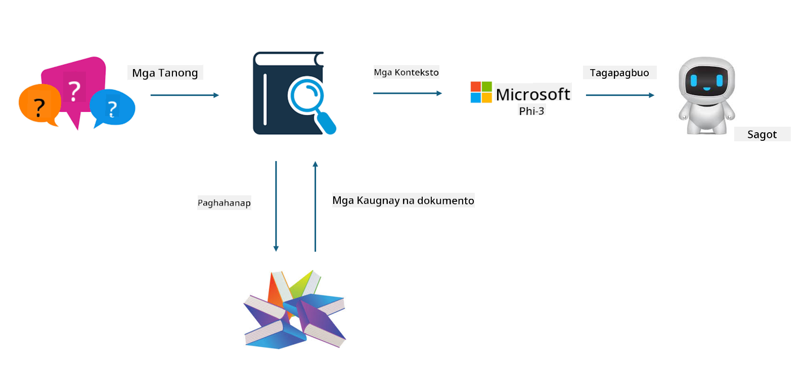

<!--
CO_OP_TRANSLATOR_METADATA:
{
  "original_hash": "e4e010400c2918557b36bb932a14004c",
  "translation_date": "2025-07-17T09:30:47+00:00",
  "source_file": "md/03.FineTuning/FineTuning_vs_RAG.md",
  "language_code": "tl"
}
-->
## Finetuning vs RAG

## Retrieval Augmented Generation

Ang RAG ay kombinasyon ng data retrieval at text generation. Ang nakaayos at hindi nakaayos na data ng kumpanya ay nakaimbak sa vector database. Kapag naghahanap ng kaugnay na nilalaman, hinahanap ang kaugnay na buod at nilalaman upang mabuo ang konteksto, at pinagsasama ito sa kakayahan ng LLM/SLM sa text completion upang makabuo ng nilalaman.

## Proseso ng RAG

## Fine-tuning
Ang fine-tuning ay nakabatay sa pagpapabuti ng isang partikular na modelo. Hindi kailangang magsimula sa algorithm ng modelo, ngunit kailangang patuloy na mag-ipon ng data. Kung nais mo ng mas tumpak na terminolohiya at pagpapahayag ng wika sa mga aplikasyon sa industriya, mas mainam ang fine-tuning. Ngunit kung madalas magbago ang iyong data, maaaring maging komplikado ang fine-tuning.

## Paano pumili
Kung ang sagot natin ay nangangailangan ng pagdagdag ng panlabas na data, ang RAG ang pinakamainam na pagpipilian.

Kung kailangan mong maglabas ng matatag at tumpak na kaalaman sa industriya, magandang piliin ang fine-tuning. Pinapahalagahan ng RAG ang paghahanap ng kaugnay na nilalaman ngunit maaaring hindi palaging makuha ang mga espesyal na detalye.

Ang fine-tuning ay nangangailangan ng mataas na kalidad na dataset, at kung maliit lang ang saklaw ng data, hindi ito gaanong makakaapekto. Mas flexible ang RAG.

Ang fine-tuning ay parang black box, isang metapisika, at mahirap maintindihan ang panloob na mekanismo. Ngunit ang RAG ay nagpapadali sa paghahanap ng pinagmulan ng data, kaya mas epektibong naiaayos ang mga hallucination o pagkakamali sa nilalaman at nagbibigay ng mas malinaw na transparency.

**Paalala**:  
Ang dokumentong ito ay isinalin gamit ang AI translation service na [Co-op Translator](https://github.com/Azure/co-op-translator). Bagamat nagsusumikap kami para sa katumpakan, pakatandaan na ang mga awtomatikong pagsasalin ay maaaring maglaman ng mga pagkakamali o di-tumpak na impormasyon. Ang orihinal na dokumento sa orihinal nitong wika ang dapat ituring na pangunahing sanggunian. Para sa mahahalagang impormasyon, inirerekomenda ang propesyonal na pagsasalin ng tao. Hindi kami mananagot sa anumang hindi pagkakaunawaan o maling interpretasyon na maaaring magmula sa paggamit ng pagsasaling ito.