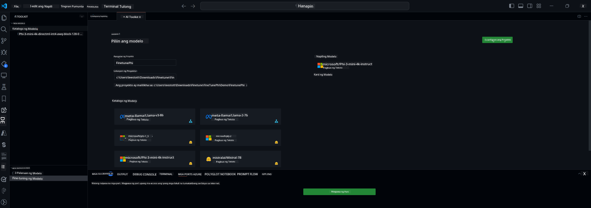

<!--
CO_OP_TRANSLATOR_METADATA:
{
  "original_hash": "c2bc0950f44919ac75a88c1a871680c2",
  "translation_date": "2025-07-17T09:18:00+00:00",
  "source_file": "md/03.FineTuning/Finetuning_VSCodeaitoolkit.md",
  "language_code": "tl"
}
-->
## Welcome to AI Toolkit for VS Code

[AI Toolkit for VS Code](https://github.com/microsoft/vscode-ai-toolkit/tree/main) ay pinagsasama-sama ang iba't ibang modelo mula sa Azure AI Studio Catalog at iba pang katalogo tulad ng Hugging Face. Pinapadali ng toolkit ang mga karaniwang gawain sa pag-develop para sa paggawa ng AI apps gamit ang generative AI tools at mga modelo sa pamamagitan ng:
- Magsimula sa pagtuklas ng modelo at playground.
- Fine-tuning ng modelo at inference gamit ang lokal na computing resources.
- Remote fine-tuning at inference gamit ang Azure resources

[Install AI Toolkit for VSCode](https://marketplace.visualstudio.com/items?itemName=ms-windows-ai-studio.windows-ai-studio)




**[Private Preview]** One-click provisioning para sa Azure Container Apps upang patakbuhin ang fine-tuning at inference ng modelo sa cloud.

Ngayon, simulan na natin ang pag-develop ng iyong AI app:

- [Welcome to AI Toolkit for VS Code](../../../../md/03.FineTuning)
- [Local Development](../../../../md/03.FineTuning)
  - [Preparations](../../../../md/03.FineTuning)
  - [Activate Conda](../../../../md/03.FineTuning)
  - [Base model fine-tuning only](../../../../md/03.FineTuning)
  - [Model fine-tuning and inferencing](../../../../md/03.FineTuning)
  - [Model Fine-tuning](../../../../md/03.FineTuning)
  - [Microsoft Olive](../../../../md/03.FineTuning)
  - [Fine Tuning Samples and Resoures](../../../../md/03.FineTuning)
- [**\[Private Preview\]** Remote Development](../../../../md/03.FineTuning)
  - [Prerequisites](../../../../md/03.FineTuning)
  - [Setting Up a Remote Development Project](../../../../md/03.FineTuning)
  - [Provision Azure Resources](../../../../md/03.FineTuning)
  - [\[Optional\] Add Huggingface Token to the Azure Container App Secret](../../../../md/03.FineTuning)
  - [Run Fine-tuning](../../../../md/03.FineTuning)
  - [Provision Inference Endpoint](../../../../md/03.FineTuning)
  - [Deploy the Inference Endpoint](../../../../md/03.FineTuning)
  - [Advanced usage](../../../../md/03.FineTuning)

## Local Development
### Preparations

1. Siguraduhing naka-install ang NVIDIA driver sa host.
2. Patakbuhin ang `huggingface-cli login`, kung gagamit ka ng HF para sa dataset utilization.
3. Mga paliwanag sa mga setting ng `Olive` para sa anumang nagbabago sa paggamit ng memorya.

### Activate Conda
Dahil gumagamit tayo ng WSL environment na shared, kailangan mong mano-manong i-activate ang conda environment. Pagkatapos ng hakbang na ito, maaari ka nang magpatakbo ng fine-tuning o inference.

```bash
conda activate [conda-env-name] 
```

### Base model fine-tuning only
Kung gusto mo lang subukan ang base model nang walang fine-tuning, patakbuhin ang command na ito pagkatapos i-activate ang conda.

```bash
cd inference

# Web browser interface allows to adjust a few parameters like max new token length, temperature and so on.
# User has to manually open the link (e.g. http://0.0.0.0:7860) in a browser after gradio initiates the connections.
python gradio_chat.py --baseonly
```

### Model fine-tuning and inferencing

Kapag nabuksan na ang workspace sa dev container, buksan ang terminal (ang default na path ay project root), pagkatapos patakbuhin ang command sa ibaba para i-fine tune ang LLM gamit ang napiling dataset.

```bash
python finetuning/invoke_olive.py 
```

Ang mga checkpoints at ang final na modelo ay mase-save sa `models` folder.

Sunod, patakbuhin ang inference gamit ang fine-tuned na modelo sa pamamagitan ng chats sa `console`, `web browser` o `prompt flow`.

```bash
cd inference

# Console interface.
python console_chat.py

# Web browser interface allows to adjust a few parameters like max new token length, temperature and so on.
# User has to manually open the link (e.g. http://127.0.0.1:7860) in a browser after gradio initiates the connections.
python gradio_chat.py
```

Para gamitin ang `prompt flow` sa VS Code, pakitingnan ang [Quick Start](https://microsoft.github.io/promptflow/how-to-guides/quick-start.html).

### Model Fine-tuning

Sunod, i-download ang sumusunod na modelo depende sa pagkakaroon ng GPU sa iyong device.

Para simulan ang local fine-tuning session gamit ang QLoRA, piliin ang modelong nais mong i-fine-tune mula sa aming katalogo.
| Platform(s) | May GPU ba | Pangalan ng Modelo | Laki (GB) |
|---------|---------|--------|--------|
| Windows | Oo | Phi-3-mini-4k-**directml**-int4-awq-block-128-onnx | 2.13GB |
| Linux | Oo | Phi-3-mini-4k-**cuda**-int4-onnx | 2.30GB |
| Windows<br>Linux | Hindi | Phi-3-mini-4k-**cpu**-int4-rtn-block-32-acc-level-4-onnx | 2.72GB |

**_Note_** Hindi mo kailangan ng Azure Account para i-download ang mga modelo

Ang Phi3-mini (int4) na modelo ay humigit-kumulang 2GB-3GB ang laki. Depende sa bilis ng iyong network, maaaring tumagal ng ilang minuto ang pag-download.

Magsimula sa pagpili ng pangalan ng proyekto at lokasyon.
Sunod, piliin ang modelo mula sa model catalog. Hihilingin kang i-download ang project template. Pagkatapos ay maaari mong i-click ang "Configure Project" para ayusin ang iba't ibang settings.

### Microsoft Olive

Ginagamit namin ang [Olive](https://microsoft.github.io/Olive/why-olive.html) para patakbuhin ang QLoRA fine-tuning sa isang PyTorch model mula sa aming katalogo. Lahat ng settings ay naka-preset na gamit ang default na mga halaga upang ma-optimize ang fine-tuning process nang lokal na may mahusay na paggamit ng memorya, ngunit maaari itong i-adjust ayon sa iyong sitwasyon.

### Fine Tuning Samples and Resoures

- [Fine tuning Getting Started Guide](https://learn.microsoft.com/windows/ai/toolkit/toolkit-fine-tune)
- [Fine tuning with a HuggingFace Dataset](https://github.com/microsoft/vscode-ai-toolkit/blob/main/archive/walkthrough-hf-dataset.md)
- [Fine tuning with Simple DataSet](https://github.com/microsoft/vscode-ai-toolkit/blob/main/archive/walkthrough-simple-dataset.md)

## **[Private Preview]** Remote Development

### Prerequisites

1. Para patakbuhin ang model fine-tuning sa iyong remote Azure Container App Environment, siguraduhing may sapat na GPU capacity ang iyong subscription. Mag-submit ng [support ticket](https://azure.microsoft.com/support/create-ticket/) para humiling ng kinakailangang kapasidad para sa iyong aplikasyon. [Kumuha ng Karagdagang Impormasyon tungkol sa GPU capacity](https://learn.microsoft.com/azure/container-apps/workload-profiles-overview)
2. Kung gumagamit ka ng private dataset sa HuggingFace, siguraduhing may [HuggingFace account](https://huggingface.co/?WT.mc_id=aiml-137032-kinfeylo) ka at [gumawa ng access token](https://huggingface.co/docs/hub/security-tokens?WT.mc_id=aiml-137032-kinfeylo)
3. I-enable ang Remote Fine-tuning and Inference feature flag sa AI Toolkit for VS Code
   1. Buksan ang VS Code Settings sa pamamagitan ng pagpili ng *File -> Preferences -> Settings*.
   2. Pumunta sa *Extensions* at piliin ang *AI Toolkit*.
   3. Piliin ang opsyon na *"Enable Remote Fine-tuning And Inference"*.
   4. I-reload ang VS Code para magkabisa.

- [Remote Fine tuning](https://github.com/microsoft/vscode-ai-toolkit/blob/main/archive/remote-finetuning.md)

### Setting Up a Remote Development Project
1. Patakbuhin ang command palette `AI Toolkit: Focus on Resource View`.
2. Pumunta sa *Model Fine-tuning* para ma-access ang model catalog. Bigyan ng pangalan ang iyong proyekto at piliin ang lokasyon nito sa iyong makina. Pagkatapos, pindutin ang *"Configure Project"* button.
3. Project Configuration
    1. Iwasang i-enable ang *"Fine-tune locally"* na opsyon.
    2. Lalabas ang Olive configuration settings na may pre-set na default values. Pakiaayos at punan ang mga ito ayon sa pangangailangan.
    3. Magpatuloy sa *Generate Project*. Sa yugtong ito, gagamitin ang WSL at magse-set up ng bagong Conda environment, bilang paghahanda sa mga susunod na update na may kasamang Dev Containers.
4. I-click ang *"Relaunch Window In Workspace"* para buksan ang iyong remote development project.

> **Note:** Ang proyekto ay kasalukuyang gumagana lamang nang lokal o remote sa loob ng AI Toolkit for VS Code. Kung pipiliin mo ang *"Fine-tune locally"* sa paggawa ng proyekto, ito ay tatakbo lamang sa WSL nang walang kakayahan sa remote development. Sa kabilang banda, kung hindi mo i-enable ang *"Fine-tune locally"*, ang proyekto ay limitado lamang sa remote Azure Container App environment.

### Provision Azure Resources
Para makapagsimula, kailangan mong i-provision ang Azure Resource para sa remote fine-tuning. Gawin ito sa pamamagitan ng pagpapatakbo ng `AI Toolkit: Provision Azure Container Apps job for fine-tuning` mula sa command palette.

Subaybayan ang progreso ng provisioning sa link na makikita sa output channel.

### [Optional] Add Huggingface Token to the Azure Container App Secret
Kung gumagamit ka ng private HuggingFace dataset, itakda ang iyong HuggingFace token bilang environment variable upang hindi na kailanganin pang mag-login nang mano-mano sa Hugging Face Hub.
Magagawa mo ito gamit ang `AI Toolkit: Add Azure Container Apps Job secret for fine-tuning` command. Sa command na ito, maaari mong itakda ang secret name bilang [`HF_TOKEN`](https://huggingface.co/docs/huggingface_hub/package_reference/environment_variables#hftoken) at gamitin ang iyong Hugging Face token bilang secret value.

### Run Fine-tuning
Para simulan ang remote fine-tuning job, patakbuhin ang `AI Toolkit: Run fine-tuning` command.

Para makita ang system at console logs, maaari mong bisitahin ang Azure portal gamit ang link sa output panel (karagdagang mga hakbang sa [View and Query Logs on Azure](https://aka.ms/ai-toolkit/remote-provision#view-and-query-logs-on-azure)). O kaya, maaari mong tingnan ang console logs nang direkta sa VSCode output panel sa pamamagitan ng pagpapatakbo ng `AI Toolkit: Show the running fine-tuning job streaming logs` command.
> **Note:** Maaaring ma-queue ang job dahil sa kakulangan ng resources. Kung hindi lumalabas ang log, patakbuhin muli ang `AI Toolkit: Show the running fine-tuning job streaming logs` command, maghintay ng kaunti, at patakbuhin muli ang command para muling kumonekta sa streaming log.

Sa prosesong ito, gagamitin ang QLoRA para sa fine-tuning, at gagawa ito ng LoRA adapters para magamit ng modelo sa inference.
Ang mga resulta ng fine-tuning ay mase-save sa Azure Files.

### Provision Inference Endpoint
Pagkatapos ma-train ang mga adapters sa remote environment, gamitin ang isang simpleng Gradio application para makipag-interact sa modelo.
Katulad ng fine-tuning process, kailangan mong i-setup ang Azure Resources para sa remote inference sa pamamagitan ng pagpapatakbo ng `AI Toolkit: Provision Azure Container Apps for inference` mula sa command palette.

Sa default, ang subscription at resource group para sa inference ay dapat tumugma sa mga ginamit para sa fine-tuning. Gagamitin ng inference ang parehong Azure Container App Environment at maa-access ang modelo at model adapter na naka-store sa Azure Files, na nalikha sa fine-tuning step.

### Deploy the Inference Endpoint
Kung nais mong baguhin ang inference code o i-reload ang inference model, patakbuhin ang `AI Toolkit: Deploy for inference` command. Ito ay magsi-synchronize ng iyong pinakabagong code sa Azure Container App at ire-restart ang replica.

Kapag matagumpay na na-deploy, maaari mong ma-access ang inference API sa pamamagitan ng pag-click sa "*Go to Inference Endpoint*" button na makikita sa VSCode notification. O kaya, ang web API endpoint ay makikita sa ilalim ng `ACA_APP_ENDPOINT` sa `./infra/inference.config.json` at sa output panel. Handa ka nang subukan ang modelo gamit ang endpoint na ito.

### Advanced usage
Para sa karagdagang impormasyon tungkol sa remote development gamit ang AI Toolkit, tingnan ang dokumentasyon sa [Fine-Tuning models remotely](https://aka.ms/ai-toolkit/remote-provision) at [Inferencing with the fine-tuned model](https://aka.ms/ai-toolkit/remote-inference).

**Paalala**:  
Ang dokumentong ito ay isinalin gamit ang AI translation service na [Co-op Translator](https://github.com/Azure/co-op-translator). Bagamat nagsusumikap kami para sa katumpakan, pakatandaan na ang mga awtomatikong pagsasalin ay maaaring maglaman ng mga pagkakamali o di-tumpak na impormasyon. Ang orihinal na dokumento sa orihinal nitong wika ang dapat ituring na pangunahing sanggunian. Para sa mahahalagang impormasyon, inirerekomenda ang propesyonal na pagsasalin ng tao. Hindi kami mananagot sa anumang hindi pagkakaunawaan o maling interpretasyon na maaaring magmula sa paggamit ng pagsasaling ito.