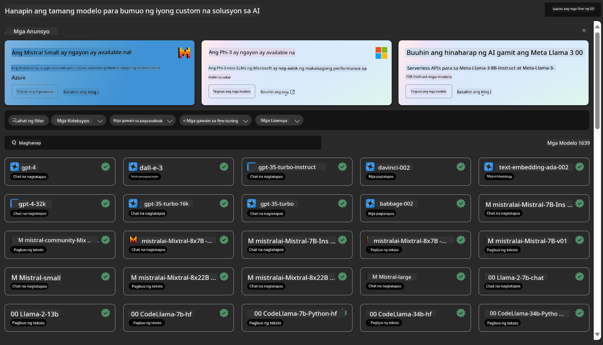

<!--
CO_OP_TRANSLATOR_METADATA:
{
  "original_hash": "7fe541373802e33568e94e13226d463c",
  "translation_date": "2025-05-09T22:22:41+00:00",
  "source_file": "md/03.FineTuning/Introduce_AzureML.md",
  "language_code": "tl"
}
-->
# **Ipakilala ang Azure Machine Learning Service**

Ang [Azure Machine Learning](https://ml.azure.com?WT.mc_id=aiml-138114-kinfeylo) ay isang cloud service para pabilisin at pamahalaan ang lifecycle ng machine learning (ML) na proyekto.

Maaaring gamitin ito ng mga ML professional, data scientist, at engineer sa kanilang pang-araw-araw na workflow upang:

- Mag-train at mag-deploy ng mga modelo.  
- Pamahalaan ang machine learning operations (MLOps).  
- Maaari kang gumawa ng modelo sa Azure Machine Learning o gumamit ng modelong ginawa mula sa open-source platform gaya ng PyTorch, TensorFlow, o scikit-learn.  
- Tinutulungan ka ng MLOps tools na i-monitor, i-retrain, at i-redeploy ang mga modelo.

## Para kanino ang Azure Machine Learning?

**Data Scientists at ML Engineers**

Maaaring gamitin nila ang mga tools upang pabilisin at i-automate ang kanilang pang-araw-araw na workflow.  
Nagbibigay ang Azure ML ng mga feature para sa fairness, explainability, tracking, at auditability.

**Application Developers:**  
Maaaring i-integrate nila ang mga modelo sa mga aplikasyon o serbisyo nang walang kahirap-hirap.

**Platform Developers**

May access sila sa matibay na hanay ng mga tools na suportado ng matatag na Azure Resource Manager APIs.  
Pinapayagan sila nitong bumuo ng mga advanced na ML tooling.

**Enterprises**

Sa pagtatrabaho sa Microsoft Azure cloud, nakikinabang ang mga enterprise mula sa pamilyar na seguridad at role-based access control.  
Maaari silang mag-setup ng mga proyekto para kontrolin ang access sa protektadong data at tiyak na operasyon.

## Produktibidad para sa Lahat sa Team

Kadalasang nangangailangan ang ML projects ng isang team na may iba’t ibang kakayahan upang bumuo at magpanatili.

Nagbibigay ang Azure ML ng mga tools na nagpapahintulot sa iyo na:  
- Makipagtulungan sa iyong team gamit ang shared notebooks, compute resources, serverless compute, data, at environments.  
- Bumuo ng mga modelo na may fairness, explainability, tracking, at auditability upang matugunan ang mga pangangailangan sa lineage at audit compliance.  
- Mag-deploy ng ML models nang mabilis at madali sa malawakang sukat, at pamahalaan at pangasiwaan ang mga ito nang epektibo gamit ang MLOps.  
- Patakbuhin ang machine learning workloads kahit saan gamit ang built-in na governance, security, at compliance.

## Cross-Compatible Platform Tools

Sinuman sa ML team ay maaaring gumamit ng kanilang paboritong tools para matapos ang trabaho.  
Kung nagsasagawa ka man ng mabilisang eksperimento, hyperparameter tuning, pagbuo ng pipelines, o pamamahala ng mga inference, maaari kang gumamit ng pamilyar na interfaces kabilang ang:  
- Azure Machine Learning Studio  
- Python SDK (v2)  
- Azure CLI (v2)  
- Azure Resource Manager REST APIs

Habang pinapahusay mo ang mga modelo at nakikipagtulungan sa buong development cycle, maaari kang magbahagi at maghanap ng mga assets, resources, at metrics sa loob ng Azure Machine Learning studio UI.

## **LLM/SLM sa Azure ML**

Nagdagdag ang Azure ML ng maraming LLM/SLM-related na function, pinagsasama ang LLMOps at SLMOps upang makabuo ng isang enterprise-wide generative artificial intelligence technology platform.

### **Model Catalog**

Maaaring mag-deploy ang mga enterprise user ng iba't ibang modelo ayon sa iba't ibang business scenarios sa pamamagitan ng Model Catalog, at magbigay ng serbisyo bilang Model as Service para ma-access ng mga enterprise developer o user.

Ang Model Catalog sa Azure Machine Learning studio ay ang sentro para tuklasin at gamitin ang malawak na hanay ng mga modelo na nagpapahintulot sa iyo na bumuo ng Generative AI applications. Tampok ng model catalog ang daan-daang modelo mula sa mga model provider tulad ng Azure OpenAI service, Mistral, Meta, Cohere, Nvidia, Hugging Face, kabilang ang mga modelong sinanay ng Microsoft. Ang mga modelo mula sa mga provider na hindi Microsoft ay Non-Microsoft Products, ayon sa kahulugan sa Microsoft's Product Terms, at sakop ng mga kondisyon na kasama ng modelo.

### **Job Pipeline**

Ang puso ng machine learning pipeline ay ang paghati ng isang kumpletong machine learning task sa maraming hakbang na workflow. Bawat hakbang ay isang manageable na bahagi na maaaring paunlarin, i-optimize, i-configure, at i-automate nang paisa-isa. Ang mga hakbang ay konektado sa pamamagitan ng malinaw na interfaces. Awtomatikong inaayos ng Azure Machine Learning pipeline service ang lahat ng dependencies sa pagitan ng mga hakbang ng pipeline.

Sa fine-tuning ng SLM / LLM, maaari nating pamahalaan ang ating data, training, at generation processes gamit ang Pipeline.

### **Prompt flow**

Mga benepisyo ng paggamit ng Azure Machine Learning prompt flow  
Nagbibigay ang Azure Machine Learning prompt flow ng iba’t ibang benepisyo na tumutulong sa mga user mula sa ideation hanggang eksperimento at sa huli, sa production-ready na LLM-based applications:

**Prompt engineering agility**

Interactive authoring experience: Nagbibigay ang Azure Machine Learning prompt flow ng visual na representasyon ng istruktura ng flow, kaya madaling maintindihan at mag-navigate ng mga user ang kanilang mga proyekto. Nag-aalok din ito ng notebook-like coding experience para sa mas epektibong pagbuo at pag-debug ng flow.  
Variants para sa prompt tuning: Maaaring gumawa at magkumpara ang mga user ng maraming prompt variants, na nagpapadali sa iterative na pagpapabuti.

Evaluation: May built-in evaluation flows na nagpapahintulot sa mga user na suriin ang kalidad at bisa ng kanilang mga prompt at flow.

Komprehensibong resources: Kasama sa Azure Machine Learning prompt flow ang isang library ng mga built-in na tools, sample, at template na nagsisilbing panimulang punto para sa pag-develop, nagpapasigla ng pagkamalikhain at nagpapabilis ng proseso.

**Enterprise readiness para sa LLM-based applications**

Collaboration: Sinusuportahan ng Azure Machine Learning prompt flow ang pagtutulungan ng team, na nagpapahintulot sa maraming user na magtrabaho nang sabay sa mga prompt engineering projects, magbahagi ng kaalaman, at mapanatili ang version control.

All-in-one platform: Pinapasimple ng Azure Machine Learning prompt flow ang buong proseso ng prompt engineering, mula sa pag-develop at evaluation hanggang sa deployment at monitoring. Madaling ma-deploy ng mga user ang kanilang mga flow bilang Azure Machine Learning endpoints at ma-monitor ang kanilang performance nang real-time, na tinitiyak ang pinakamainam na operasyon at tuloy-tuloy na pagpapabuti.

Azure Machine Learning Enterprise Readiness Solutions: Pinapakinabangan ng Prompt flow ang matibay na enterprise readiness solutions ng Azure Machine Learning, na nagbibigay ng secure, scalable, at maaasahang pundasyon para sa pag-develop, eksperimento, at deployment ng mga flow.

Sa Azure Machine Learning prompt flow, maaaring palayain ng mga user ang kanilang prompt engineering agility, makipagtulungan nang epektibo, at gamitin ang enterprise-grade solutions para sa matagumpay na pagbuo at deployment ng LLM-based na aplikasyon.

Pinagsasama ang computing power, data, at iba't ibang bahagi ng Azure ML, madali nang makabuo ang mga enterprise developer ng kanilang sariling artificial intelligence applications.

**Paalala**:  
Ang dokumentong ito ay isinalin gamit ang AI translation service na [Co-op Translator](https://github.com/Azure/co-op-translator). Bagaman nagsusumikap kami para sa katumpakan, pakatandaan na ang mga awtomatikong pagsasalin ay maaaring maglaman ng mga pagkakamali o di-tumpak na impormasyon. Ang orihinal na dokumento sa orihinal nitong wika ang dapat ituring na pangunahing sanggunian. Para sa mahahalagang impormasyon, inirerekomenda ang propesyonal na pagsasalin ng tao. Hindi kami mananagot sa anumang hindi pagkakaintindihan o maling interpretasyon na maaaring magmula sa paggamit ng pagsasaling ito.