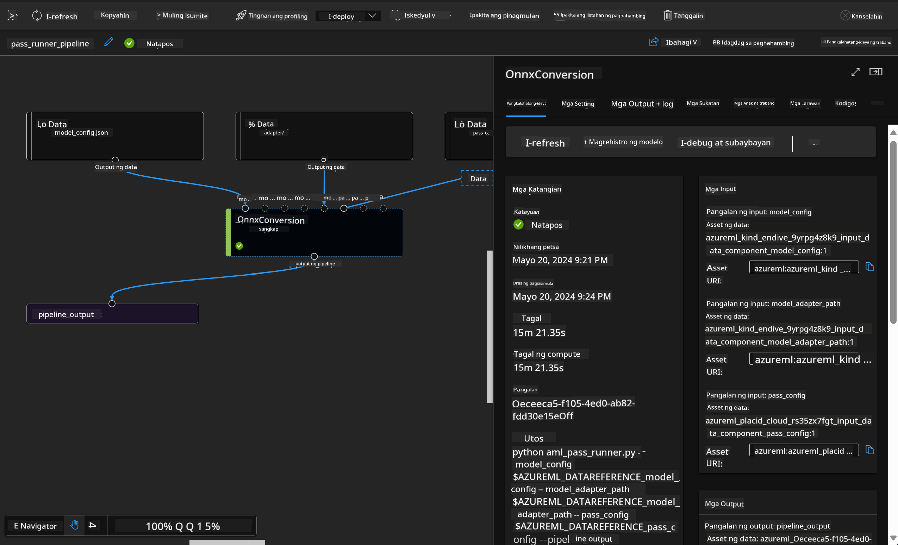

<!--
CO_OP_TRANSLATOR_METADATA:
{
  "original_hash": "7fe541373802e33568e94e13226d463c",
  "translation_date": "2025-07-17T09:46:02+00:00",
  "source_file": "md/03.FineTuning/Introduce_AzureML.md",
  "language_code": "tl"
}
-->
# **Ipakilala ang Azure Machine Learning Service**

Ang [Azure Machine Learning](https://ml.azure.com?WT.mc_id=aiml-138114-kinfeylo) ay isang cloud service para pabilisin at pamahalaan ang lifecycle ng mga proyekto sa machine learning (ML).

Maaaring gamitin ito ng mga propesyonal sa ML, data scientists, at mga engineer sa kanilang pang-araw-araw na gawain upang:

- Mag-train at mag-deploy ng mga modelo.
- Pamahalaan ang machine learning operations (MLOps).
- Maaari kang gumawa ng modelo sa Azure Machine Learning o gumamit ng modelong ginawa mula sa open-source platform tulad ng PyTorch, TensorFlow, o scikit-learn.
- Tinutulungan ka ng mga MLOps tools na subaybayan, i-retrain, at i-redeploy ang mga modelo.

## Para kanino ang Azure Machine Learning?

**Data Scientists at ML Engineers**

Maaaring gamitin nila ang mga tools para pabilisin at i-automate ang kanilang pang-araw-araw na gawain.  
Nagbibigay ang Azure ML ng mga tampok para sa patas na pagtrato, pagpapaliwanag, pagsubaybay, at auditability.

**Application Developers:**  
Maaaring i-integrate nila ang mga modelo sa mga aplikasyon o serbisyo nang walang kahirap-hirap.

**Platform Developers**

May access sila sa matibay na hanay ng mga tools na suportado ng matatag na Azure Resource Manager APIs.  
Pinapahintulutan ng mga tools na ito ang paggawa ng mga advanced na ML tooling.

**Enterprises**

Sa paggamit ng Microsoft Azure cloud, nakikinabang ang mga enterprise mula sa pamilyar na seguridad at role-based access control.  
Maaaring mag-set up ng mga proyekto para kontrolin ang access sa protektadong data at mga partikular na operasyon.

## Produktibidad para sa Lahat ng Miyembro ng Team

Kadalasang nangangailangan ang mga ML project ng team na may iba't ibang kasanayan para makabuo at mapanatili ang proyekto.

Nagbibigay ang Azure ML ng mga tools na nagpapahintulot sa iyo na:  
- Makipagtulungan sa iyong team gamit ang shared notebooks, compute resources, serverless compute, data, at mga environment.  
- Bumuo ng mga modelo na may patas na pagtrato, pagpapaliwanag, pagsubaybay, at auditability upang matugunan ang mga pangangailangan sa lineage at audit compliance.  
- Mag-deploy ng ML models nang mabilis at madali sa malaking sukat, at pamahalaan at pangasiwaan ang mga ito nang epektibo gamit ang MLOps.  
- Patakbuhin ang mga machine learning workload kahit saan gamit ang built-in na pamamahala, seguridad, at pagsunod sa mga regulasyon.

## Mga Cross-Compatible na Platform Tools

Maaaring gamitin ng sinuman sa ML team ang kanilang paboritong tools para matapos ang trabaho.  
Kung nagsasagawa ka man ng mabilisang eksperimento, hyperparameter tuning, paggawa ng mga pipeline, o pamamahala ng mga inference, maaari mong gamitin ang mga pamilyar na interface tulad ng:  
- Azure Machine Learning Studio  
- Python SDK (v2)  
- Azure CLI (v2)  
- Azure Resource Manager REST APIs

Habang pinapahusay mo ang mga modelo at nakikipagtulungan sa buong development cycle, maaari kang magbahagi at maghanap ng mga asset, resources, at metrics sa loob ng Azure Machine Learning studio UI.

## **LLM/SLM sa Azure ML**

Nagdagdag ang Azure ML ng maraming LLM/SLM-related na mga function, pinagsasama ang LLMOps at SLMOps upang makabuo ng isang enterprise-wide na generative artificial intelligence technology platform.

### **Model Catalog**

Maaaring mag-deploy ang mga enterprise user ng iba't ibang modelo ayon sa iba't ibang business scenario sa pamamagitan ng Model Catalog, at magbigay ng serbisyo bilang Model as Service para ma-access ng mga enterprise developer o user.

Ang Model Catalog sa Azure Machine Learning studio ang sentro para tuklasin at gamitin ang malawak na hanay ng mga modelo na nagpapahintulot sa iyo na bumuo ng mga Generative AI application. Naglalaman ang model catalog ng daan-daang mga modelo mula sa mga provider tulad ng Azure OpenAI service, Mistral, Meta, Cohere, Nvidia, Hugging Face, pati na rin ang mga modelong sinanay ng Microsoft. Ang mga modelo mula sa mga provider na hindi Microsoft ay tinatawag na Non-Microsoft Products, ayon sa Product Terms ng Microsoft, at sakop ng mga kondisyong kasama ng modelo.

### **Job Pipeline**

Ang pangunahing layunin ng machine learning pipeline ay hatiin ang isang kumpletong machine learning task sa isang multistep workflow. Bawat hakbang ay isang madaling pamahalaang bahagi na maaaring idevelop, i-optimize, i-configure, at i-automate nang paisa-isa. Ang mga hakbang ay konektado sa pamamagitan ng malinaw na mga interface. Awtomatikong inaayos ng Azure Machine Learning pipeline service ang lahat ng dependencies sa pagitan ng mga hakbang ng pipeline.

Sa fine-tuning ng SLM / LLM, maaari nating pamahalaan ang ating data, training, at generation processes gamit ang Pipeline.

### **Prompt flow**

Mga benepisyo ng paggamit ng Azure Machine Learning prompt flow  
Nagbibigay ang Azure Machine Learning prompt flow ng iba't ibang benepisyo na tumutulong sa mga user mula sa ideation hanggang sa experimentation at sa huli, sa production-ready na mga LLM-based na aplikasyon:

**Agility sa prompt engineering**

Interactive na karanasan sa paglikha: Nagbibigay ang Azure Machine Learning prompt flow ng visual na representasyon ng istruktura ng flow, na nagpapadali sa mga user na maintindihan at i-navigate ang kanilang mga proyekto. Nag-aalok din ito ng notebook-like na karanasan sa pag-code para sa mas mabilis na pag-develop at pag-debug ng flow.  
Mga variant para sa prompt tuning: Maaaring gumawa at magkumpara ang mga user ng maraming variant ng prompt, na nagpapadali sa iterative na proseso ng pagpapabuti.

Pagsusuri: May built-in na evaluation flows na nagpapahintulot sa mga user na suriin ang kalidad at bisa ng kanilang mga prompt at flow.

Komprehensibong resources: Kasama sa Azure Machine Learning prompt flow ang isang library ng mga built-in na tools, sample, at template na nagsisilbing panimulang punto para sa pag-develop, na nagbibigay inspirasyon at nagpapabilis ng proseso.

**Kahandaan ng enterprise para sa mga LLM-based na aplikasyon**

Pakikipagtulungan: Sinusuportahan ng Azure Machine Learning prompt flow ang kolaborasyon ng team, na nagpapahintulot sa maraming user na magtrabaho nang sabay sa mga proyekto ng prompt engineering, magbahagi ng kaalaman, at mapanatili ang version control.

All-in-one na platform: Pinapadali ng Azure Machine Learning prompt flow ang buong proseso ng prompt engineering, mula sa pag-develop at pagsusuri hanggang sa deployment at monitoring. Madaling ma-deploy ng mga user ang kanilang mga flow bilang Azure Machine Learning endpoints at masubaybayan ang performance nito nang real-time, na tinitiyak ang pinakamainam na operasyon at tuloy-tuloy na pagpapabuti.

Azure Machine Learning Enterprise Readiness Solutions: Ginagamit ng prompt flow ang matibay na enterprise readiness solutions ng Azure Machine Learning, na nagbibigay ng ligtas, scalable, at maaasahang pundasyon para sa pag-develop, eksperimento, at deployment ng mga flow.

Sa Azure Machine Learning prompt flow, maaaring palayain ng mga user ang kanilang agility sa prompt engineering, makipagtulungan nang epektibo, at gamitin ang mga enterprise-grade na solusyon para sa matagumpay na pag-develop at deployment ng mga LLM-based na aplikasyon.

Sa pagsasama ng computing power, data, at iba't ibang bahagi ng Azure ML, madaling makabuo ang mga enterprise developer ng kanilang sariling mga artificial intelligence application.

**Paalala**:  
Ang dokumentong ito ay isinalin gamit ang AI translation service na [Co-op Translator](https://github.com/Azure/co-op-translator). Bagamat nagsusumikap kami para sa katumpakan, pakatandaan na ang mga awtomatikong pagsasalin ay maaaring maglaman ng mga pagkakamali o di-tumpak na impormasyon. Ang orihinal na dokumento sa kanyang sariling wika ang dapat ituring na pangunahing sanggunian. Para sa mahahalagang impormasyon, inirerekomenda ang propesyonal na pagsasalin ng tao. Hindi kami mananagot sa anumang hindi pagkakaunawaan o maling interpretasyon na maaaring magmula sa paggamit ng pagsasaling ito.