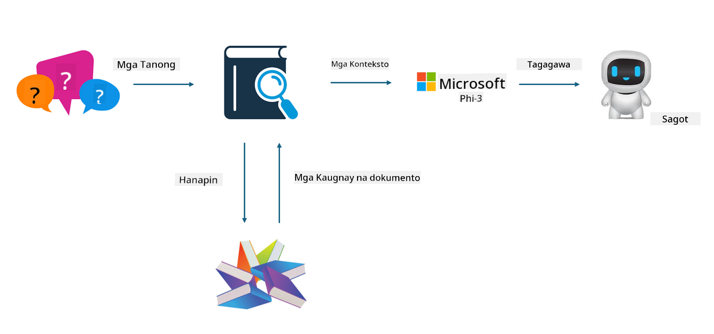
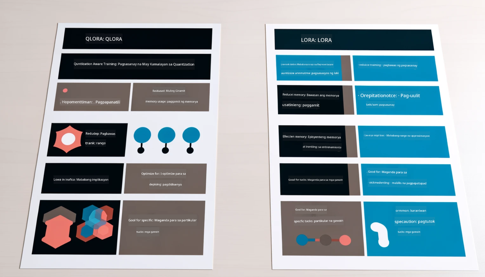

<!--
CO_OP_TRANSLATOR_METADATA:
{
  "original_hash": "743d7e9cb9c4e8ea642d77bee657a7fa",
  "translation_date": "2025-05-09T22:28:47+00:00",
  "source_file": "md/03.FineTuning/LetPhi3gotoIndustriy.md",
  "language_code": "tl"
}
-->
# **Hayaan ang Phi-3 maging eksperto sa industriya**

Para mailagay ang Phi-3 model sa isang industriya, kailangan mong idagdag ang data ng negosyo ng industriya sa Phi-3 model. Mayroon tayong dalawang opsyon: ang una ay RAG (Retrieval Augmented Generation) at ang pangalawa ay Fine Tuning.

## **RAG vs Fine-Tuning**

### **Retrieval Augmented Generation**

Ang RAG ay kombinasyon ng data retrieval at text generation. Ang nakaayos at hindi nakaayos na data ng kumpanya ay iniimbak sa vector database. Kapag naghahanap ng kaugnay na nilalaman, hinahanap ang kaugnay na buod at nilalaman para mabuo ang konteksto, at ginagamit ang kakayahan ng LLM/SLM sa text completion para makabuo ng nilalaman.

### **Fine-tuning**

Ang Fine-tuning ay nakabase sa pagpapahusay ng isang partikular na modelo. Hindi kailangang simulan sa algorithm ng modelo, pero kailangang patuloy na mag-ipon ng data. Kung gusto mo ng mas eksaktong terminolohiya at paraan ng pagpapahayag sa mga aplikasyon sa industriya, mas mainam ang fine-tuning. Pero kung madalas nagbabago ang data mo, magiging komplikado ang fine-tuning.

### **Paano pumili**

1. Kung kailangan ng sagot ang pagdagdag ng panlabas na data, RAG ang pinakamainam na piliin.

2. Kung kailangan mo ng matatag at eksaktong kaalaman sa industriya, magandang piliin ang fine-tuning. Ang RAG ay inuuna ang paghila ng kaugnay na nilalaman pero hindi palaging tama ang mga espesyal na detalye.

3. Ang fine-tuning ay nangangailangan ng mataas na kalidad na data set, at kung maliit lang ang saklaw ng data, hindi ito masyadong makakaapekto. Mas flexible ang RAG.

4. Ang fine-tuning ay parang black box, mahirap maintindihan ang internal na mekanismo. Pero ang RAG ay mas madaling makita ang pinagmulan ng data, kaya mas epektibong maayos ang mga hallucinations o pagkakamali sa nilalaman at nagbibigay ng mas malinaw na transparency.

### **Mga senaryo**

1. Ang mga vertical industries na nangangailangan ng espesipikong propesyonal na bokabularyo at ekspresyon, ***Fine-tuning*** ang pinakamainam.

2. Para sa QA system na pinagsasama-sama ang iba't ibang punto ng kaalaman, ***RAG*** ang pinakamainam.

3. Para sa kombinasyon ng automated na daloy ng negosyo, ***RAG + Fine-tuning*** ang pinakamainam.

## **Paano gamitin ang RAG**

Ang vector database ay koleksyon ng data na nakaimbak sa anyong matematikal. Pinapadali ng vector databases para sa machine learning models na maalala ang mga nakaraang input, kaya nagagamit ang machine learning para suportahan ang mga use case tulad ng paghahanap, rekomendasyon, at text generation. Nakikilala ang data base sa similarity metrics kaysa eksaktong tugma, kaya naiintindihan ng mga computer models ang konteksto ng data.

Ang vector database ang susi para maipatupad ang RAG. Maaari nating gawing vector storage ang data gamit ang mga vector models tulad ng text-embedding-3, jina-ai-embedding, atbp.

Matuto pa tungkol sa paggawa ng RAG application [https://github.com/microsoft/Phi-3CookBook](https://github.com/microsoft/Phi-3CookBook?WT.mc_id=aiml-138114-kinfeylo) 

## **Paano gamitin ang Fine-tuning**

Ang mga karaniwang ginagamit na algorithm sa Fine-tuning ay Lora at QLora. Paano pipiliin?
- [Matuto pa gamit ang sample notebook na ito](../../../../code/04.Finetuning/Phi_3_Inference_Finetuning.ipynb)
- [Halimbawa ng Python FineTuning Sample](../../../../code/04.Finetuning/FineTrainingScript.py)

### **Lora at QLora**

Ang LoRA (Low-Rank Adaptation) at QLoRA (Quantized Low-Rank Adaptation) ay mga teknik na ginagamit para i-fine-tune ang malalaking language models (LLMs) gamit ang Parameter Efficient Fine Tuning (PEFT). Ang PEFT techniques ay idinisenyo para mas efficient na matrain ang mga modelo kumpara sa tradisyunal na paraan.

Ang LoRA ay standalone finetuning technique na nagpapababa ng memory footprint sa pamamagitan ng low-rank approximation sa weight update matrix. Nagbibigay ito ng mabilis na training at halos kapareho ng performance ng tradisyunal na fine-tuning.

Ang QLoRA ay pinalawak na bersyon ng LoRA na gumagamit ng quantization para mas mabawasan pa ang memory usage. Kino-quantize nito ang precision ng weight parameters sa pre-trained LLM sa 4-bit precision, na mas memory efficient kaysa LoRA. Ngunit ang training ng QLoRA ay mga 30% na mas mabagal kaysa LoRA dahil sa dagdag na quantization at dequantization steps.

Ginagamit ng QLoRA ang LoRA bilang accessory para itama ang mga error na dulot ng quantization. Pinapahintulutan ng QLoRA ang fine-tuning ng napakalalaking modelo na may bilyon-bilyong parameters gamit ang medyo maliit at madaling ma-access na GPUs. Halimbawa, kaya nitong i-fine-tune ang 70B parameter model na dati nangangailangan ng 36 GPUs gamit ang 2 lamang.

**Paalala**:  
Ang dokumentong ito ay isinalin gamit ang AI translation service na [Co-op Translator](https://github.com/Azure/co-op-translator). Bagamat aming pinagsisikapang maging tumpak ang pagsasalin, pakatandaan na ang mga awtomatikong pagsasalin ay maaaring maglaman ng mga pagkakamali o hindi pagkakatugma. Ang orihinal na dokumento sa kanyang katutubong wika ang dapat ituring na pangunahing sanggunian. Para sa mga mahahalagang impormasyon, inirerekomenda ang propesyonal na pagsasalin ng tao. Hindi kami mananagot sa anumang hindi pagkakaunawaan o maling interpretasyon na maaaring magmula sa paggamit ng pagsasaling ito.