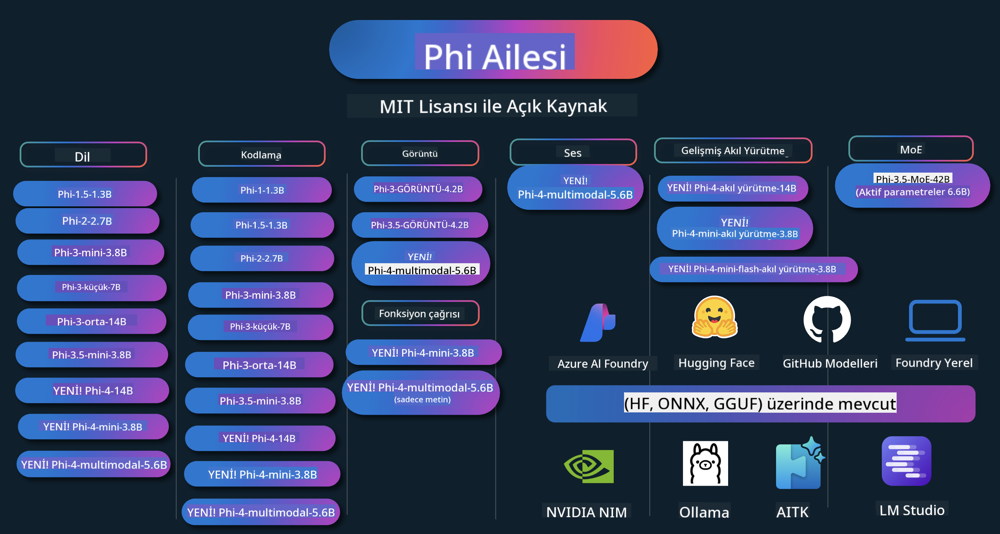

<!--
CO_OP_TRANSLATOR_METADATA:
{
  "original_hash": "5c07bb4c3c89a36c9be332a065a9a33c",
  "translation_date": "2025-07-16T15:12:06+00:00",
  "source_file": "README.md",
  "language_code": "tr"
}
-->
# Phi Yemek Kitabı: Microsoft’un Phi Modelleri ile Pratik Örnekler

  

  
  
  

  
  

Phi, Microsoft tarafından geliştirilen açık kaynaklı bir yapay zeka modelleri serisidir.

Phi, şu anda çok dilli, muhakeme, metin/sohbet üretimi, kodlama, görseller, ses ve diğer senaryolarda çok iyi performans gösteren en güçlü ve maliyet etkin küçük dil modeli (SLM) olarak öne çıkmaktadır.

Phi’yi buluta veya uç cihazlara dağıtabilir ve sınırlı hesaplama gücüyle kolayca üretken yapay zeka uygulamaları geliştirebilirsiniz.

Bu kaynakları kullanmaya başlamak için şu adımları izleyin:  
1. **Depoyu Forklayın**: Tıklayın   
2. **Depoyu Klonlayın**: `git clone https://github.com/microsoft/PhiCookBook.git`  
3. [**Microsoft AI Discord Topluluğuna Katılın, uzmanlar ve diğer geliştiricilerle tanışın**](https://discord.com/invite/ByRwuEEgH4?WT.mc_id=aiml-137032-kinfeylo)

### 🌐 Çok Dilli Destek

#### GitHub Action ile Desteklenmektedir (Otomatik ve Her Zaman Güncel)

[Fransızca](../fr/README.md) | [İspanyolca](../es/README.md) | [Almanca](../de/README.md) | [Rusça](../ru/README.md) | [Arapça](../ar/README.md) | [Farsça (Persçe)](../fa/README.md) | [Urduca](../ur/README.md) | [Çince (Basitleştirilmiş)](../zh/README.md) | [Çince (Geleneksel, Makao)](../mo/README.md) | [Çince (Geleneksel, Hong Kong)](../hk/README.md) | [Çince (Geleneksel, Tayvan)](../tw/README.md) | [Japonca](../ja/README.md) | [Korece](../ko/README.md) | [Hintçe](../hi/README.md)  
[Bengalce](../bn/README.md) | [Marathi](../mr/README.md) | [Nepalce](../ne/README.md) | [Pencapça (Gurmukhi)](../pa/README.md) | [Portekizce (Portekiz)](../pt/README.md) | [Portekizce (Brezilya)](../br/README.md) | [İtalyanca](../it/README.md) | [Lehçe](../pl/README.md) | [Türkçe](./README.md) | [Yunanca](../el/README.md) | [Tayca](../th/README.md) | [İsveççe](../sv/README.md) | [Danca](../da/README.md) | [Norveççe](../no/README.md) | [Fince](../fi/README.md) | [Flemenkçe](../nl/README.md) | [İbranice](../he/README.md) | [Vietnamca](../vi/README.md) | [Endonezce](../id/README.md) | [Malayca](../ms/README.md) | [Tagalogca (Filipince)](../tl/README.md) | [Svahili](../sw/README.md) | [Macarca](../hu/README.md) | [Çekçe](../cs/README.md) | [Slovakça](../sk/README.md) | [Romence](../ro/README.md) | [Bulgarca](../bg/README.md) | [Sırpça (Kiril)](../sr/README.md) | [Hırvatça](../hr/README.md) | [Slovence](../sl/README.md)

## İçindekiler

- Giriş  
  - [Phi Ailesine Hoş Geldiniz](./md/01.Introduction/01/01.PhiFamily.md)  
  - [Ortamınızı Kurma](./md/01.Introduction/01/01.EnvironmentSetup.md)  
  - [Temel Teknolojileri Anlamak](./md/01.Introduction/01/01.Understandingtech.md)  
  - [Phi Modelleri için Yapay Zeka Güvenliği](./md/01.Introduction/01/01.AISafety.md)  
  - [Phi Donanım Desteği](./md/01.Introduction/01/01.Hardwaresupport.md)  
  - [Phi Modelleri ve Platformlar Arası Kullanılabilirlik](./md/01.Introduction/01/01.Edgeandcloud.md)  
  - [Guidance-ai ve Phi Kullanımı](./md/01.Introduction/01/01.Guidance.md)  
  - [GitHub Marketplace Modelleri](https://github.com/marketplace/models)  
  - [Azure AI Model Kataloğu](https://ai.azure.com)

- Farklı Ortamlarda Phi Çıkarımı  
    -  [Hugging Face](./md/01.Introduction/02/01.HF.md)  
    -  [GitHub Modelleri](./md/01.Introduction/02/02.GitHubModel.md)  
    -  [Azure AI Foundry Model Kataloğu](./md/01.Introduction/02/03.AzureAIFoundry.md)  
    -  [Ollama](./md/01.Introduction/02/04.Ollama.md)  
    -  [AI Toolkit VSCode (AITK)](./md/01.Introduction/02/05.AITK.md)  
    -  [NVIDIA NIM](./md/01.Introduction/02/06.NVIDIA.md)  
    -  [Foundry Local](./md/01.Introduction/02/07.FoundryLocal.md)

- Phi Ailesi Çıkarımı  
    - [iOS’ta Phi Çıkarımı](./md/01.Introduction/03/iOS_Inference.md)  
    - [Android’de Phi Çıkarımı](./md/01.Introduction/03/Android_Inference.md)  
    - [Jetson’da Phi Çıkarımı](./md/01.Introduction/03/Jetson_Inference.md)  
    - [AI PC’de Phi Çıkarımı](./md/01.Introduction/03/AIPC_Inference.md)  
    - [Apple MLX Framework ile Phi Çıkarımı](./md/01.Introduction/03/MLX_Inference.md)  
    - [Yerel Sunucuda Phi Çıkarımı](./md/01.Introduction/03/Local_Server_Inference.md)  
    - [AI Toolkit kullanarak Uzaktan Sunucuda Phi Çıkarımı](./md/01.Introduction/03/Remote_Interence.md)  
    - [Rust ile Phi Çıkarımı](./md/01.Introduction/03/Rust_Inference.md)  
    - [Yerelde Phi--Vision Çıkarımı](./md/01.Introduction/03/Vision_Inference.md)  
    - [Kaito AKS, Azure Containers ile Phi Çıkarımı (resmi destek)](./md/01.Introduction/03/Kaito_Inference.md)  
-  [Phi Ailesinin Kantifikasyonu](./md/01.Introduction/04/QuantifyingPhi.md)  
    - [llama.cpp kullanarak Phi-3.5 / 4’ü Kantifikasyon](./md/01.Introduction/04/UsingLlamacppQuantifyingPhi.md)  
    - [onnxruntime için Üretken AI eklentileri ile Phi-3.5 / 4’ü Kantifikasyon](./md/01.Introduction/04/UsingORTGenAIQuantifyingPhi.md)  
    - [Intel OpenVINO kullanarak Phi-3.5 / 4’ü Kantifikasyon](./md/01.Introduction/04/UsingIntelOpenVINOQuantifyingPhi.md)  
    - [Apple MLX Framework kullanarak Phi-3.5 / 4’ü Kantifikasyon](./md/01.Introduction/04/UsingAppleMLXQuantifyingPhi.md)

- Phi Değerlendirmesi  
    - [Sorumlu Yapay Zeka](./md/01.Introduction/05/ResponsibleAI.md)  
    - [Değerlendirme için Azure AI Foundry](./md/01.Introduction/05/AIFoundry.md)  
    - [Değerlendirme için Promptflow Kullanımı](./md/01.Introduction/05/Promptflow.md)

- Azure AI Search ile RAG  
    - [Phi-4-mini ve Phi-4-multimodal(RAG) modellerini Azure AI Search ile kullanma](https://github.com/microsoft/PhiCookBook/blob/main/code/06.E2E/E2E_Phi-4-RAG-Azure-AI-Search.ipynb)

- Phi uygulama geliştirme örnekleri  
  - Metin & Sohbet Uygulamaları  
    - Phi-4 Örnekleri 🆕  
      - [📓] [Phi-4-mini ONNX Modeli ile Sohbet](./md/02.Application/01.TextAndChat/Phi4/ChatWithPhi4ONNX/README.md)  
      - [Phi-4 yerel ONNX Modeli ile Sohbet .NET](../../md/04.HOL/dotnet/src/LabsPhi4-Chat-01OnnxRuntime)  
      - [Semantic Kernel kullanarak Phi-4 ONNX ile .NET Konsol Uygulaması Sohbeti](../../md/04.HOL/dotnet/src/LabsPhi4-Chat-02SK)  
    - Phi-3 / 3.5 Örnekleri  
      - [Tarayıcıda Phi3, ONNX Runtime Web ve WebGPU kullanarak Yerel Chatbot](https://github.com/microsoft/onnxruntime-inference-examples/tree/main/js/chat)  
      - [OpenVino Sohbet](./md/02.Application/01.TextAndChat/Phi3/E2E_OpenVino_Chat.md)  
      - [Çoklu Model - Etkileşimli Phi-3-mini ve OpenAI Whisper](./md/02.Application/01.TextAndChat/Phi3/E2E_Phi-3-mini_with_whisper.md)  
      - [MLFlow - Phi-3 ile sarmalayıcı oluşturma ve MLFlow kullanımı](./md//02.Application/01.TextAndChat/Phi3/E2E_Phi-3-MLflow.md)  
      - [Model Optimizasyonu - Phi-3-min modelini ONNX Runtime Web için Olive ile nasıl optimize edilir](https://github.com/microsoft/Olive/tree/main/examples/phi3)  
      - [Phi-3 mini-4k-instruct-onnx ile WinUI3 Uygulaması](https://github.com/microsoft/Phi3-Chat-WinUI3-Sample/)  
      - [WinUI3 Çoklu Model Yapay Zeka Destekli Notlar Uygulaması Örneği](https://github.com/microsoft/ai-powered-notes-winui3-sample)
- [Özel Phi-3 modellerini Prompt flow ile ince ayar yapma ve entegre etme](./md/02.Application/01.TextAndChat/Phi3/E2E_Phi-3-FineTuning_PromptFlow_Integration.md)
- [Azure AI Foundry'de Prompt flow ile özel Phi-3 modellerini ince ayar yapma ve entegre etme](./md/02.Application/01.TextAndChat/Phi3/E2E_Phi-3-FineTuning_PromptFlow_Integration_AIFoundry.md)
- [Microsoft’un Sorumlu AI İlkelerine odaklanarak Azure AI Foundry’de ince ayar yapılmış Phi-3 / Phi-3.5 Modelini değerlendirme](./md/02.Application/01.TextAndChat/Phi3/E2E_Phi-3-Evaluation_AIFoundry.md)
- [📓] [Phi-3.5-mini-instruct dil tahmin örneği (Çince/İngilizce)](../../md/02.Application/01.TextAndChat/Phi3/phi3-instruct-demo.ipynb)
- [Phi-3.5-Instruct WebGPU RAG Chatbot](./md/02.Application/01.TextAndChat/Phi3/WebGPUWithPhi35Readme.md)
- [Windows GPU kullanarak Phi-3.5-Instruct ONNX ile Prompt flow çözümü oluşturma](./md/02.Application/01.TextAndChat/Phi3/UsingPromptFlowWithONNX.md)
- [Microsoft Phi-3.5 tflite kullanarak Android uygulaması oluşturma](./md/02.Application/01.TextAndChat/Phi3/UsingPhi35TFLiteCreateAndroidApp.md)
- [Microsoft.ML.OnnxRuntime kullanarak yerel ONNX Phi-3 modeli ile Soru-Cevap .NET Örneği](../../md/04.HOL/dotnet/src/LabsPhi301)
- [Semantic Kernel ve Phi-3 ile Konsol sohbet .NET uygulaması](../../md/04.HOL/dotnet/src/LabsPhi302)

- Azure AI Inference SDK Kod Tabanlı Örnekler  
  - Phi-4 Örnekleri 🆕  
    - [📓] [Phi-4-multimodal kullanarak proje kodu oluşturma](./md/02.Application/02.Code/Phi4/GenProjectCode/README.md)  
  - Phi-3 / 3.5 Örnekleri  
    - [Microsoft Phi-3 Ailesi ile kendi Visual Studio Code GitHub Copilot Sohbetinizi oluşturun](./md/02.Application/02.Code/Phi3/VSCodeExt/README.md)  
    - [GitHub Modelleri ile Phi-3.5 kullanarak kendi Visual Studio Code Chat Copilot Ajanınızı oluşturun](/md/02.Application/02.Code/Phi3/CreateVSCodeChatAgentWithGitHubModels.md)  

- Gelişmiş Akıl Yürütme Örnekleri  
  - Phi-4 Örnekleri 🆕  
    - [📓] [Phi-4-mini-akıl yürütme veya Phi-4-akıl yürütme Örnekleri](./md/02.Application/03.AdvancedReasoning/Phi4/AdvancedResoningPhi4mini/README.md)  
    - [📓] [Microsoft Olive ile Phi-4-mini-akıl yürütme ince ayarı](../../md/02.Application/03.AdvancedReasoning/Phi4/AdvancedResoningPhi4mini/olive_ft_phi_4_reasoning_with_medicaldata.ipynb)  
    - [📓] [Apple MLX ile Phi-4-mini-akıl yürütme ince ayarı](../../md/02.Application/03.AdvancedReasoning/Phi4/AdvancedResoningPhi4mini/mlx_ft_phi_4_reasoning_with_medicaldata.ipynb)  
    - [📓] [GitHub Modelleri ile Phi-4-mini-akıl yürütme](../../md/02.Application/02.Code/Phi4r/github_models_inference.ipynb)  
    - [📓] [Azure AI Foundry Modelleri ile Phi-4-mini-akıl yürütme](../../md/02.Application/02.Code/Phi4r/azure_models_inference.ipynb)  
- Demo  
    - [Hugging Face Spaces üzerinde barındırılan Phi-4-mini demoları](https://huggingface.co/spaces/microsoft/phi-4-mini?WT.mc_id=aiml-137032-kinfeylo)  
    - [Hugging Face Spaces üzerinde barındırılan Phi-4-multimodal demoları](https://huggingface.co/spaces/microsoft/phi-4-multimodal?WT.mc_id=aiml-137032-kinfeylo)  
- Görüntü Örnekleri  
  - Phi-4 Örnekleri 🆕  
    - [📓] [Phi-4-multimodal kullanarak görüntüleri okuma ve kod oluşturma](./md/02.Application/04.Vision/Phi4/CreateFrontend/README.md)  
  - Phi-3 / 3.5 Örnekleri  
    - [📓][Phi-3-görsel-Görüntü metinden metne](../../md/02.Application/04.Vision/Phi3/E2E_Phi-3-vision-image-text-to-text-online-endpoint.ipynb)  
    - [Phi-3-görsel-ONNX](https://onnxruntime.ai/docs/genai/tutorials/phi3-v.html)  
    - [📓][Phi-3-görsel CLIP Gömme](../../md/02.Application/04.Vision/Phi3/E2E_Phi-3-vision-image-text-to-text-online-endpoint.ipynb)  
    - [DEMO: Phi-3 Geri Dönüşüm](https://github.com/jennifermarsman/PhiRecycling/)  
    - [Phi-3-görsel - Görsel dil asistanı - Phi3-Görsel ve OpenVINO ile](https://docs.openvino.ai/nightly/notebooks/phi-3-vision-with-output.html)  
    - [Phi-3 Görsel Nvidia NIM](./md/02.Application/04.Vision/Phi3/E2E_Nvidia_NIM_Vision.md)  
    - [Phi-3 Görsel OpenVino](./md/02.Application/04.Vision/Phi3/E2E_OpenVino_Phi3Vision.md)  
    - [📓][Phi-3.5 Görsel çoklu kare veya çoklu görüntü örneği](../../md/02.Application/04.Vision/Phi3/phi3-vision-demo.ipynb)  
    - [Microsoft.ML.OnnxRuntime .NET kullanarak Phi-3 Görsel Yerel ONNX Modeli](../../md/04.HOL/dotnet/src/LabsPhi303)  
    - [Menü tabanlı Phi-3 Görsel Yerel ONNX Modeli Microsoft.ML.OnnxRuntime .NET kullanarak](../../md/04.HOL/dotnet/src/LabsPhi304)  

- Matematik Örnekleri  
  - Phi-4-Mini-Flash-Akıl Yürütme-Yönergeli Örnekler 🆕 [Phi-4-Mini-Flash-Akıl Yürütme-Yönergeli Matematik Demo](../../md/02.Application/09.Math/MathDemo.ipynb)  

- Ses Örnekleri  
  - Phi-4 Örnekleri 🆕  
    - [📓] [Phi-4-multimodal kullanarak ses transkriptlerini çıkarma](./md/02.Application/05.Audio/Phi4/Transciption/README.md)  
    - [📓] [Phi-4-multimodal Ses Örneği](../../md/02.Application/05.Audio/Phi4/Siri/demo.ipynb)  
    - [📓] [Phi-4-multimodal Konuşma Çevirisi Örneği](../../md/02.Application/05.Audio/Phi4/Translate/demo.ipynb)  
    - [Phi-4-multimodal kullanarak bir ses dosyasını analiz eden ve transkript oluşturan .NET konsol uygulaması](../../md/04.HOL/dotnet/src/LabsPhi4-MultiModal-02Audio)  

- MOE Örnekleri  
  - Phi-3 / 3.5 Örnekleri  
    - [📓] [Phi-3.5 Uzman Karışımı Modelleri (MoEs) Sosyal Medya Örneği](../../md/02.Application/06.MoE/Phi3/phi3_moe_demo.ipynb)  
    - [📓] [NVIDIA NIM Phi-3 MOE, Azure AI Search ve LlamaIndex ile Retrieval-Augmented Generation (RAG) Boru Hattı Oluşturma](../../md/02.Application/06.MoE/Phi3/azure-ai-search-nvidia-rag.ipynb)  

- Fonksiyon Çağırma Örnekleri  
  - Phi-4 Örnekleri 🆕  
    - [📓] [Phi-4-mini ile Fonksiyon Çağırma Kullanımı](./md/02.Application/07.FunctionCalling/Phi4/FunctionCallingBasic/README.md)  
    - [📓] [Phi-4-mini ile çoklu ajanlar oluşturmak için Fonksiyon Çağırma kullanımı](../../md/02.Application/07.FunctionCalling/Phi4/Multiagents/Phi_4_mini_multiagent.ipynb)  
    - [📓] [Ollama ile Fonksiyon Çağırma kullanımı](../../md/02.Application/07.FunctionCalling/Phi4/Ollama/ollama_functioncalling.ipynb)  
    - [📓] [ONNX ile Fonksiyon Çağırma kullanımı](../../md/02.Application/07.FunctionCalling/Phi4/ONNX/onnx_parallel_functioncalling.ipynb)  

- Çok Modlu Karışım Örnekleri  
  - Phi-4 Örnekleri 🆕  
    - [📓] [Phi-4-multimodal’i Teknoloji gazetecisi olarak kullanma](../../md/02.Application/08.Multimodel/Phi4/TechJournalist/phi_4_mm_audio_text_publish_news.ipynb)  
    - [Phi-4-multimodal kullanarak görüntüleri analiz eden .NET konsol uygulaması](../../md/04.HOL/dotnet/src/LabsPhi4-MultiModal-01Images)  

- Phi İnce Ayar Örnekleri  
  - [İnce Ayar Senaryoları](./md/03.FineTuning/FineTuning_Scenarios.md)  
  - [İnce Ayar ve RAG Karşılaştırması](./md/03.FineTuning/FineTuning_vs_RAG.md)  
  - [Phi-3’ü sektör uzmanı yapacak ince ayar](./md/03.FineTuning/LetPhi3gotoIndustriy.md)  
  - [VS Code için AI Toolkit ile Phi-3 ince ayarı](./md/03.FineTuning/Finetuning_VSCodeaitoolkit.md)  
  - [Azure Machine Learning Service ile Phi-3 ince ayarı](./md/03.FineTuning/Introduce_AzureML.md)  
  - [Lora ile Phi-3 ince ayarı](./md/03.FineTuning/FineTuning_Lora.md)  
  - [QLora ile Phi-3 ince ayarı](./md/03.FineTuning/FineTuning_Qlora.md)  
  - [Azure AI Foundry ile Phi-3 ince ayarı](./md/03.FineTuning/FineTuning_AIFoundry.md)  
  - [Azure ML CLI/SDK ile Phi-3 ince ayarı](./md/03.FineTuning/FineTuning_MLSDK.md)  
  - [Microsoft Olive ile ince ayar](./md/03.FineTuning/FineTuning_MicrosoftOlive.md)  
  - [Microsoft Olive Uygulamalı Laboratuvar ile ince ayar](./md/03.FineTuning/olive-lab/readme.md)  
  - [Weights and Bias ile Phi-3-görsel ince ayarı](./md/03.FineTuning/FineTuning_Phi-3-visionWandB.md)  
  - [Apple MLX Framework ile Phi-3 ince ayarı](./md/03.FineTuning/FineTuning_MLX.md)  
  - [Phi-3-görsel ince ayarı (resmi destek)](./md/03.FineTuning/FineTuning_Vision.md)  
  - [Kaito AKS, Azure Containers ile Phi-3 ince ayarı (resmi destek)](./md/03.FineTuning/FineTuning_Kaito.md)  
  - [Phi-3 ve 3.5 Görsel İnce Ayarı](https://github.com/2U1/Phi3-Vision-Finetune)  

- Uygulamalı Laboratuvar  
  - [En yeni modelleri keşfetmek: LLM’ler, SLM’ler, yerel geliştirme ve daha fazlası](https://github.com/microsoft/aitour-exploring-cutting-edge-models)  
  - [NLP Potansiyelini Açığa Çıkarmak: Microsoft Olive ile İnce Ayar](https://github.com/azure/Ignite_FineTuning_workshop)  

- Akademik Araştırma Makaleleri ve Yayınlar  
  - [Textbooks Are All You Need II: phi-1.5 teknik raporu](https://arxiv.org/abs/2309.05463)  
  - [Phi-3 Teknik Raporu: Telefonunuzda Yüksek Kapasiteli Dil Modeli](https://arxiv.org/abs/2404.14219)  
  - [Phi-4 Teknik Raporu](https://arxiv.org/abs/2412.08905)  
  - [Phi-4-Mini Teknik Raporu: Mixture-of-LoRAs ile Kompakt ama Güçlü Çok Modlu Dil Modelleri](https://arxiv.org/abs/2503.01743)  
  - [Araç İçi Fonksiyon Çağırma için Küçük Dil Modellerinin Optimizasyonu](https://arxiv.org/abs/2501.02342)  
  - [(WhyPHI) Çoktan Seçmeli Soru Cevaplama için PHI-3 İnce Ayarı: Yöntem, Sonuçlar ve Zorluklar](https://arxiv.org/abs/2501.01588)
- [Phi-4-reasoning Teknik Raporu](https://www.microsoft.com/en-us/research/wp-content/uploads/2025/04/phi_4_reasoning.pdf)
- [Phi-4-mini-reasoning Teknik Raporu](https://huggingface.co/microsoft/Phi-4-mini-reasoning/blob/main/Phi-4-Mini-Reasoning.pdf)

## Phi Modellerini Kullanma

### Azure AI Foundry'de Phi

Microsoft Phi'nin nasıl kullanılacağını ve farklı donanım cihazlarınızda uçtan uca çözümler nasıl oluşturulacağını öğrenebilirsiniz. Phi’yi kendiniz deneyimlemek için, modellerle oynamaya başlayabilir ve senaryolarınıza göre Phi’yi özelleştirebilirsiniz. Bunun için [Azure AI Foundry Azure AI Model Kataloğu](https://aka.ms/phi3-azure-ai) üzerinden daha fazla bilgi edinebilirsiniz. Başlamak için [Azure AI Foundry ile Başlarken](/md/02.QuickStart/AzureAIFoundry_QuickStart.md) dokümanına göz atabilirsiniz.

**Oyun Alanı**  
Her modelin testi için ayrılmış bir oyun alanı vardır: [Azure AI Playground](https://aka.ms/try-phi3).

### GitHub Modellerinde Phi

Microsoft Phi’nin nasıl kullanılacağını ve farklı donanım cihazlarınızda uçtan uca çözümler nasıl oluşturulacağını öğrenebilirsiniz. Phi’yi kendiniz deneyimlemek için, modelle oynamaya başlayabilir ve senaryolarınıza göre Phi’yi özelleştirebilirsiniz. Bunun için [GitHub Model Kataloğu](https://github.com/marketplace/models?WT.mc_id=aiml-137032-kinfeylo) üzerinden daha fazla bilgi edinebilirsiniz. Başlamak için [GitHub Model Kataloğu ile Başlarken](/md/02.QuickStart/GitHubModel_QuickStart.md) dokümanına göz atabilirsiniz.

**Oyun Alanı**  
Her modelin testi için ayrılmış bir [oyun alanı](/md/02.QuickStart/GitHubModel_QuickStart.md) vardır.

### Hugging Face’de Phi

Modeli ayrıca [Hugging Face](https://huggingface.co/microsoft) üzerinde de bulabilirsiniz.

**Oyun Alanı**  
[Hugging Chat oyun alanı](https://huggingface.co/chat/models/microsoft/Phi-3-mini-4k-instruct)

## Sorumlu AI

Microsoft, müşterilerimizin AI ürünlerimizi sorumlu bir şekilde kullanmalarına yardımcı olmaya, öğrendiklerimizi paylaşmaya ve Şeffaflık Notları ve Etki Değerlendirmeleri gibi araçlarla güvene dayalı ortaklıklar kurmaya kararlıdır. Bu kaynakların birçoğuna [https://aka.ms/RAI](https://aka.ms/RAI) adresinden ulaşabilirsiniz.  
Microsoft’un sorumlu AI yaklaşımı, adalet, güvenilirlik ve güvenlik, gizlilik ve emniyet, kapsayıcılık, şeffaflık ve hesap verebilirlik gibi AI ilkelerimize dayanmaktadır.

Bu örnekte kullanılanlar gibi büyük ölçekli doğal dil, görüntü ve konuşma modelleri, haksız, güvenilmez veya rahatsız edici davranışlar sergileyebilir ve bu da zararlara yol açabilir. Riskler ve sınırlamalar hakkında bilgi edinmek için lütfen [Azure OpenAI hizmeti Şeffaflık notu](https://learn.microsoft.com/legal/cognitive-services/openai/transparency-note?tabs=text) sayfasını inceleyin.

Bu riskleri azaltmak için önerilen yaklaşım, mimarinizde zararlı davranışları tespit edip önleyebilen bir güvenlik sistemi bulundurmaktır. [Azure AI Content Safety](https://learn.microsoft.com/azure/ai-services/content-safety/overview), uygulamalarda ve hizmetlerde kullanıcı ve AI tarafından oluşturulan zararlı içerikleri tespit edebilen bağımsız bir koruma katmanı sağlar. Azure AI Content Safety, zararlı materyalleri tespit etmeye olanak veren metin ve görüntü API’lerini içerir. Azure AI Foundry içinde Content Safety servisi, farklı modalitelerde zararlı içeriği tespit etmek için örnek kodları görmenize, keşfetmenize ve denemenize olanak tanır. Aşağıdaki [hızlı başlangıç dokümanı](https://learn.microsoft.com/azure/ai-services/content-safety/quickstart-text?tabs=visual-studio%2Clinux&pivots=programming-language-rest) servise istek yapmayı adım adım anlatır.

Dikkate alınması gereken bir diğer konu ise genel uygulama performansıdır. Çok modlu ve çok modeller içeren uygulamalarda performans, sistemin sizin ve kullanıcılarınızın beklentileri doğrultusunda çalışması, zararlı çıktılar üretmemesi anlamına gelir. Genel uygulama performansınızı değerlendirmek için [Performans ve Kalite ile Risk ve Güvenlik değerlendiricilerini](https://learn.microsoft.com/azure/ai-studio/concepts/evaluation-metrics-built-in) kullanmanız önemlidir. Ayrıca [özel değerlendiriciler](https://learn.microsoft.com/azure/ai-studio/how-to/develop/evaluate-sdk#custom-evaluators) oluşturup değerlendirme yapma imkanınız da vardır.

AI uygulamanızı geliştirme ortamınızda [Azure AI Evaluation SDK](https://microsoft.github.io/promptflow/index.html) ile değerlendirebilirsiniz. Test veri seti veya hedef verildiğinde, üretken AI uygulamanızın çıktıları yerleşik veya seçtiğiniz özel değerlendiricilerle niceliksel olarak ölçülür. Sisteminizi değerlendirmek için azure ai evaluation sdk ile başlamanız için [hızlı başlangıç rehberi](https://learn.microsoft.com/azure/ai-studio/how-to/develop/flow-evaluate-sdk) mevcuttur. Değerlendirme çalıştırmasını tamamladıktan sonra, sonuçları [Azure AI Foundry’de görselleştirebilirsiniz](https://learn.microsoft.com/azure/ai-studio/how-to/evaluate-flow-results).

## Ticari Markalar

Bu proje, projeler, ürünler veya hizmetler için ticari markalar veya logolar içerebilir. Microsoft ticari markalarının veya logolarının yetkili kullanımı, [Microsoft’un Ticari Marka ve Marka Kılavuzları](https://www.microsoft.com/legal/intellectualproperty/trademarks/usage/general) kurallarına tabidir ve bu kurallara uyulmalıdır.  
Microsoft ticari markalarının veya logolarının bu projenin değiştirilmiş sürümlerinde kullanımı, karışıklığa yol açmamalı veya Microsoft sponsorluğunu ima etmemelidir. Üçüncü taraf ticari markalarının veya logolarının kullanımı ise ilgili üçüncü tarafların politikalarına tabidir.

**Feragatname**:  
Bu belge, AI çeviri servisi [Co-op Translator](https://github.com/Azure/co-op-translator) kullanılarak çevrilmiştir. Doğruluk için çaba gösterilse de, otomatik çevirilerin hatalar veya yanlışlıklar içerebileceğini lütfen unutmayınız. Orijinal belge, kendi dilinde yetkili kaynak olarak kabul edilmelidir. Kritik bilgiler için profesyonel insan çevirisi önerilir. Bu çevirinin kullanımı sonucu oluşabilecek yanlış anlamalar veya yorum hatalarından sorumlu değiliz.