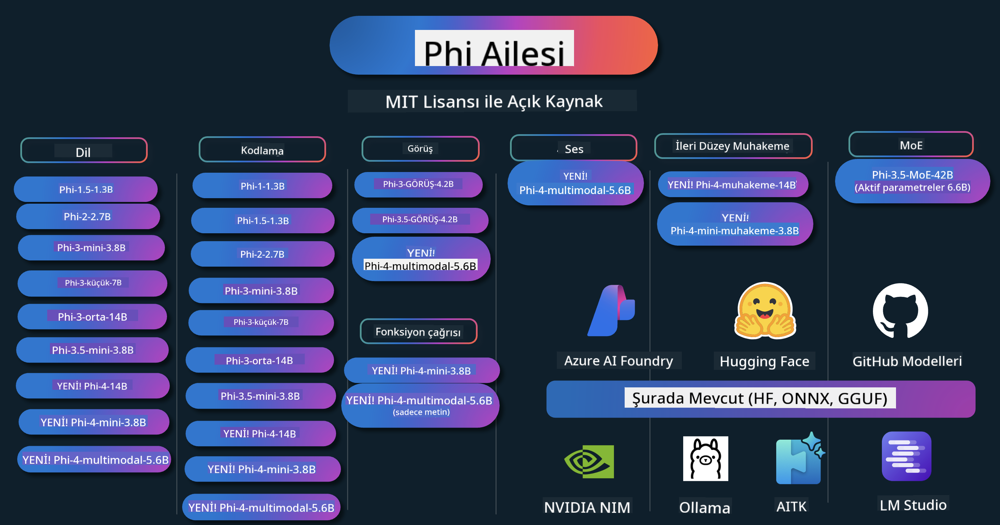

<!--
CO_OP_TRANSLATOR_METADATA:
{
  "original_hash": "1cab9282e04f2e1c388a38dca7763c16",
  "translation_date": "2025-05-09T03:54:20+00:00",
  "source_file": "README.md",
  "language_code": "tr"
}
-->
# Phi Cookbook: Microsoft'un Phi Modelleri ile Pratik Örnekler

Phi, Microsoft tarafından geliştirilen açık kaynaklı bir yapay zeka modelleri serisidir.

Phi şu anda çok dilli, muhakeme, metin/sohbet üretimi, kodlama, görseller, ses ve diğer senaryolarda çok iyi performans gösteren en güçlü ve maliyet etkin küçük dil modeli (SLM) konumundadır.

Phi'yi buluta veya uç cihazlara dağıtabilir ve sınırlı hesaplama gücüyle kolayca üretken yapay zeka uygulamaları geliştirebilirsiniz.

Bu kaynakları kullanmaya başlamak için şu adımları izleyin:
1. **Depoyu çatalla**: Click 
2. **Depoyu klonla**:   `git clone https://github.com/microsoft/PhiCookBook.git`
3. [**Microsoft AI Discord Topluluğuna katılın ve uzmanlar ile diğer geliştiricilerle tanışın**](https://discord.com/invite/ByRwuEEgH4?WT.mc_id=aiml-137032-kinfeylo)

## 🌐 Çok Dilli Destek

### GitHub Action ile Desteklenir (Otomatik & Her Zaman Güncel)

[Fransızca](../fr/README.md) | [İspanyolca](../es/README.md) | [Almanca](../de/README.md) | [Rusça](../ru/README.md) | [Arapça](../ar/README.md) | [Farsça](../fa/README.md) | [Urduca](../ur/README.md) | [Çince (Basitleştirilmiş)](../zh/README.md) | [Çince (Geleneksel, Makao)](../mo/README.md) | [Çince (Geleneksel, Hong Kong)](../hk/README.md) | [Çince (Geleneksel, Tayvan)](../tw/README.md) | [Japonca](../ja/README.md) | [Korece](../ko/README.md) | [Hintçe](../hi/README.md)

### CLI ile Desteklenir
[Bengali](../bn/README.md) | [Marathi](../mr/README.md) | [Nepali](../ne/README.md) | [Punjabi (Gurmukhi)](../pa/README.md) | [Portuguese (Portugal)](../pt/README.md) | [Portuguese (Brazil)](../br/README.md) | [Italian](../it/README.md) | [Polish](../pl/README.md) | [Turkish](./README.md) | [Greek](../el/README.md) | [Thai](../th/README.md) | [Swedish](../sv/README.md) | [Danish](../da/README.md) | [Norwegian](../no/README.md) | [Finnish](../fi/README.md) | [Dutch](../nl/README.md) | [Hebrew](../he/README.md) | [Vietnamese](../vi/README.md) | [Indonesian](../id/README.md) | [Malay](../ms/README.md) | [Tagalog (Filipino)](../tl/README.md) | [Swahili](../sw/README.md) | [Hungarian](../hu/README.md) | [Czech](../cs/README.md) | [Slovak](../sk/README.md) | [Romanian](../ro/README.md) | [Bulgarian](../bg/README.md) | [Serbian (Cyrillic)](../sr/README.md) | [Croatian](../hr/README.md) | [Slovenian](../sl/README.md)

## İçindekiler

- Giriş
- [Phi Ailesine Hoş Geldiniz](./md/01.Introduction/01/01.PhiFamily.md)
  - [Ortamınızı Kurma](./md/01.Introduction/01/01.EnvironmentSetup.md)
  - [Temel Teknolojileri Anlama](./md/01.Introduction/01/01.Understandingtech.md)
  - [Phi Modelleri için AI Güvenliği](./md/01.Introduction/01/01.AISafety.md)
  - [Phi Donanım Desteği](./md/01.Introduction/01/01.Hardwaresupport.md)
  - [Phi Modelleri ve Platformlar Arası Kullanılabilirlik](./md/01.Introduction/01/01.Edgeandcloud.md)
  - [Guidance-ai ve Phi Kullanımı](./md/01.Introduction/01/01.Guidance.md)
  - [GitHub Marketplace Modelleri](https://github.com/marketplace/models)
  - [Azure AI Model Kataloğu](https://ai.azure.com)

- Farklı Ortamlarda Phi Çıkarımı
    -  [Hugging face](./md/01.Introduction/02/01.HF.md)
    -  [GitHub Modelleri](./md/01.Introduction/02/02.GitHubModel.md)
    -  [Azure AI Foundry Model Kataloğu](./md/01.Introduction/02/03.AzureAIFoundry.md)
    -  [Ollama](./md/01.Introduction/02/04.Ollama.md)
    -  [AI Toolkit VSCode (AITK)](./md/01.Introduction/02/05.AITK.md)
    -  [NVIDIA NIM](./md/01.Introduction/02/06.NVIDIA.md)

- Phi Ailesinde Çıkarım
    - [iOS'ta Phi Çıkarımı](./md/01.Introduction/03/iOS_Inference.md)
    - [Android'de Phi Çıkarımı](./md/01.Introduction/03/Android_Inference.md)
    - [Jetson'da Phi Çıkarımı](./md/01.Introduction/03/Jetson_Inference.md)
    - [AI PC'de Phi Çıkarımı](./md/01.Introduction/03/AIPC_Inference.md)
    - [Apple MLX Framework ile Phi Çıkarımı](./md/01.Introduction/03/MLX_Inference.md)
    - [Yerel Sunucuda Phi Çıkarımı](./md/01.Introduction/03/Local_Server_Inference.md)
    - [AI Toolkit kullanarak Uzaktan Sunucuda Phi Çıkarımı](./md/01.Introduction/03/Remote_Interence.md)
    - [Rust ile Phi Çıkarımı](./md/01.Introduction/03/Rust_Inference.md)
    - [Yerelde Phi--Vision Çıkarımı](./md/01.Introduction/03/Vision_Inference.md)
    - [Kaito AKS, Azure Containers ile Phi Çıkarımı (resmi destek)](./md/01.Introduction/03/Kaito_Inference.md)
-  [Phi Ailesini Nicelendirirken](./md/01.Introduction/04/QuantifyingPhi.md)
    - [llama.cpp kullanarak Phi-3.5 / 4 Nicelleştirme](./md/01.Introduction/04/UsingLlamacppQuantifyingPhi.md)
    - [onnxruntime için Generative AI eklentileri kullanarak Phi-3.5 / 4 Nicelleştirme](./md/01.Introduction/04/UsingORTGenAIQuantifyingPhi.md)
    - [Intel OpenVINO kullanarak Phi-3.5 / 4 Nicelleştirme](./md/01.Introduction/04/UsingIntelOpenVINOQuantifyingPhi.md)
    - [Apple MLX Framework kullanarak Phi-3.5 / 4 Nicelleştirme](./md/01.Introduction/04/UsingAppleMLXQuantifyingPhi.md)

-  Phi Değerlendirmesi
- [Response AI](./md/01.Introduction/05/ResponsibleAI.md)
    - [Değerlendirme için Azure AI Foundry](./md/01.Introduction/05/AIFoundry.md)
    - [Değerlendirme için Promptflow Kullanımı](./md/01.Introduction/05/Promptflow.md)
 
- Azure AI Search ile RAG
    - [Azure AI Search ile Phi-4-mini ve Phi-4-multimodal(RAG) nasıl kullanılır](https://github.com/microsoft/PhiCookBook/blob/main/code/06.E2E/E2E_Phi-4-RAG-Azure-AI-Search.ipynb)

- Phi uygulama geliştirme örnekleri
  - Metin & Sohbet Uygulamaları
    - Phi-4 Örnekleri 🆕
      - [📓] [Phi-4-mini ONNX Modeli ile Sohbet](./md/02.Application/01.TextAndChat/Phi4/ChatWithPhi4ONNX/README.md)
      - [Phi-4 yerel ONNX Modeli ile .NET Sohbet](../../md/04.HOL/dotnet/src/LabsPhi4-Chat-01OnnxRuntime)
      - [Semantic Kernel kullanarak Phi-4 ONNX ile .NET Konsol Sohbet Uygulaması](../../md/04.HOL/dotnet/src/LabsPhi4-Chat-02SK)
    - Phi-3 / 3.5 Örnekleri
      - [Phi3, ONNX Runtime Web ve WebGPU kullanarak tarayıcıda yerel chatbot](https://github.com/microsoft/onnxruntime-inference-examples/tree/main/js/chat)
      - [OpenVino Sohbet](./md/02.Application/01.TextAndChat/Phi3/E2E_OpenVino_Chat.md)
      - [Çoklu Model - Etkileşimli Phi-3-mini ve OpenAI Whisper](./md/02.Application/01.TextAndChat/Phi3/E2E_Phi-3-mini_with_whisper.md)
      - [MLFlow - Phi-3 ile sarmalayıcı oluşturma ve kullanma](./md//02.Application/01.TextAndChat/Phi3/E2E_Phi-3-MLflow.md)
      - [Model Optimizasyonu - Phi-3-min modelini ONNX Runtime Web için Olive ile nasıl optimize edilir](https://github.com/microsoft/Olive/tree/main/examples/phi3)
      - [Phi-3 mini-4k-instruct-onnx ile WinUI3 Uygulaması](https://github.com/microsoft/Phi3-Chat-WinUI3-Sample/)
      - [WinUI3 Çoklu Model AI Destekli Notlar Uygulaması Örneği](https://github.com/microsoft/ai-powered-notes-winui3-sample)
      - [Özel Phi-3 modellerini Prompt flow ile ince ayar yapma ve entegre etme](./md/02.Application/01.TextAndChat/Phi3/E2E_Phi-3-FineTuning_PromptFlow_Integration.md)
      - [Azure AI Foundry'de Prompt flow ile özel Phi-3 modellerini ince ayar yapma ve entegre etme](./md/02.Application/01.TextAndChat/Phi3/E2E_Phi-3-FineTuning_PromptFlow_Integration_AIFoundry.md)
      - [Microsoft’un Responsible AI İlkelerine odaklanarak Azure AI Foundry’de ince ayar yapılmış Phi-3 / Phi-3.5 Modelini değerlendirme](./md/02.Application/01.TextAndChat/Phi3/E2E_Phi-3-Evaluation_AIFoundry.md)
      - [📓] [Phi-3.5-mini-instruct dil tahmin örneği (Çince/İngilizce)](../../md/02.Application/01.TextAndChat/Phi3/phi3-instruct-demo.ipynb)
      - [Phi-3.5-Instruct WebGPU RAG Sohbet Botu](./md/02.Application/01.TextAndChat/Phi3/WebGPUWithPhi35Readme.md)
      - [Phi-3.5-Instruct ONNX ile Windows GPU kullanarak Prompt flow çözümü oluşturma](./md/02.Application/01.TextAndChat/Phi3/UsingPromptFlowWithONNX.md)
      - [Microsoft Phi-3.5 tflite kullanarak Android uygulaması oluşturma](./md/02.Application/01.TextAndChat/Phi3/UsingPhi35TFLiteCreateAndroidApp.md)
      - [Microsoft.ML.OnnxRuntime kullanarak yerel ONNX Phi-3 modeli ile Soru & Cevap .NET Örneği](../../md/04.HOL/dotnet/src/LabsPhi301)
      - [Semantic Kernel ve Phi-3 ile Konsol sohbet .NET uygulaması](../../md/04.HOL/dotnet/src/LabsPhi302)

  - Azure AI Inference SDK Kod Tabanlı Örnekler 
    - Phi-4 Örnekleri 🆕
      - [📓] [Phi-4-multimodal kullanarak proje kodu oluşturma](./md/02.Application/02.Code/Phi4/GenProjectCode/README.md)
    - Phi-3 / 3.5 Örnekleri
      - [Microsoft Phi-3 Ailesi ile kendi Visual Studio Code GitHub Copilot Sohbetinizi oluşturun](./md/02.Application/02.Code/Phi3/VSCodeExt/README.md)
      - [GitHub Modelleri ile Phi-3.5 kullanarak kendi Visual Studio Code Sohbet Copilot Ajanınızı oluşturun](/md/02.Application/02.Code/Phi3/CreateVSCodeChatAgentWithGitHubModels.md)

  - Gelişmiş Akıl Yürütme Örnekleri
    - Phi-4 Örnekleri 🆕
      - [📓] [Phi-4-mini-akıl yürütme veya Phi-4-akıl yürütme Örnekleri](./md/02.Application/03.AdvancedReasoning/Phi4/AdvancedResoningPhi4mini/README.md)
      - [📓] [Microsoft Olive ile Phi-4-mini-akıl yürütme ince ayarı](../../md/02.Application/03.AdvancedReasoning/Phi4/AdvancedResoningPhi4mini/olive_ft_phi_4_reasoning_with_medicaldata.ipynb)
      - [📓] [Apple MLX ile Phi-4-mini-akıl yürütme ince ayarı](../../md/02.Application/03.AdvancedReasoning/Phi4/AdvancedResoningPhi4mini/mlx_ft_phi_4_reasoning_with_medicaldata.ipynb)
      - [📓] [GitHub Modelleri ile Phi-4-mini-akıl yürütme](../../md/02.Application/02.Code/Phi4r/github_models_inference.ipynb)
- [📓] [Phi-4-mini Azure AI Foundry Modelleri ile Akıl Yürütme](../../md/02.Application/02.Code/Phi4r/azure_models_inference.ipynb)
  - Demolar
      - [Phi-4-mini demoları Hugging Face Spaces üzerinde](https://huggingface.co/spaces/microsoft/phi-4-mini?WT.mc_id=aiml-137032-kinfeylo)
      - [Phi-4-multimodal demoları Hugging Face Spaces üzerinde](https://huggingface.co/spaces/microsoft/phi-4-multimodal?WT.mc_id=aiml-137032-kinfeylo)
  - Görsel Örnekler
    - Phi-4 Örnekleri 🆕
      - [📓] [Phi-4-multimodal kullanarak görselleri okuma ve kod üretme](./md/02.Application/04.Vision/Phi4/CreateFrontend/README.md) 
    - Phi-3 / 3.5 Örnekleri
      -  [📓][Phi-3-vision-Görselden metne](../../md/02.Application/04.Vision/Phi3/E2E_Phi-3-vision-image-text-to-text-online-endpoint.ipynb)
      - [Phi-3-vision-ONNX](https://onnxruntime.ai/docs/genai/tutorials/phi3-v.html)
      - [📓][Phi-3-vision CLIP Embedding](../../md/02.Application/04.Vision/Phi3/E2E_Phi-3-vision-image-text-to-text-online-endpoint.ipynb)
      - [DEMO: Phi-3 Geri Dönüşüm](https://github.com/jennifermarsman/PhiRecycling/)
      - [Phi-3-vision - Görsel dil asistanı - Phi3-Vision ve OpenVINO ile](https://docs.openvino.ai/nightly/notebooks/phi-3-vision-with-output.html)
      - [Phi-3 Vision Nvidia NIM](./md/02.Application/04.Vision/Phi3/E2E_Nvidia_NIM_Vision.md)
      - [Phi-3 Vision OpenVino](./md/02.Application/04.Vision/Phi3/E2E_OpenVino_Phi3Vision.md)
      - [📓][Phi-3.5 Vision çoklu kare veya çoklu görsel örneği](../../md/02.Application/04.Vision/Phi3/phi3-vision-demo.ipynb)
      - [Phi-3 Vision Yerel ONNX Modeli Microsoft.ML.OnnxRuntime .NET kullanarak](../../md/04.HOL/dotnet/src/LabsPhi303)
      - [Menü tabanlı Phi-3 Vision Yerel ONNX Modeli Microsoft.ML.OnnxRuntime .NET kullanarak](../../md/04.HOL/dotnet/src/LabsPhi304)

  - Ses Örnekleri
    - Phi-4 Örnekleri 🆕
      - [📓] [Phi-4-multimodal kullanarak ses transkriptleri çıkarma](./md/02.Application/05.Audio/Phi4/Transciption/README.md)
      - [📓] [Phi-4-multimodal Ses Örneği](../../md/02.Application/05.Audio/Phi4/Siri/demo.ipynb)
      - [📓] [Phi-4-multimodal Konuşma Çevirisi Örneği](../../md/02.Application/05.Audio/Phi4/Translate/demo.ipynb)
      - [.NET konsol uygulaması ile Phi-4-multimodal Ses kullanarak ses dosyasını analiz edip transkript oluşturma](../../md/04.HOL/dotnet/src/LabsPhi4-MultiModal-02Audio)

  - MOE Örnekleri
    - Phi-3 / 3.5 Örnekleri
      - [📓] [Phi-3.5 Uzman Karışımı Modelleri (MoEs) Sosyal Medya Örneği](../../md/02.Application/06.MoE/Phi3/phi3_moe_demo.ipynb)
      - [📓] [NVIDIA NIM Phi-3 MOE, Azure AI Search ve LlamaIndex ile Retrieval-Augmented Generation (RAG) Boru Hattı Oluşturma](../../md/02.Application/06.MoE/Phi3/azure-ai-search-nvidia-rag.ipynb)
  - Fonksiyon Çağırma Örnekleri
    - Phi-4 Örnekleri 🆕
      -  [📓] [Phi-4-mini ile Fonksiyon Çağırmayı Kullanma](./md/02.Application/07.FunctionCalling/Phi4/FunctionCallingBasic/README.md)
      -  [📓] [Phi-4-mini ile Çoklu Ajanlar Oluşturmak için Fonksiyon Çağırmayı Kullanma](../../md/02.Application/07.FunctionCalling/Phi4/Multiagents/Phi_4_mini_multiagent.ipynb)
      -  [📓] [Ollama ile Fonksiyon Çağırmayı Kullanma](../../md/02.Application/07.FunctionCalling/Phi4/Ollama/ollama_functioncalling.ipynb)
  - Multimodal Karışım Örnekleri
    - Phi-4 Örnekleri 🆕
      -  [📓] [Phi-4-multimodal kullanarak Teknoloji gazetecisi gibi çalışma](../../md/02.Application/08.Multimodel/Phi4/TechJournalist/phi_4_mm_audio_text_publish_news.ipynb)
      - [.NET konsol uygulaması ile Phi-4-multimodal kullanarak görselleri analiz etme](../../md/04.HOL/dotnet/src/LabsPhi4-MultiModal-01Images)

- Phi İnce Ayar Örnekleri
  - [İnce Ayar Senaryoları](./md/03.FineTuning/FineTuning_Scenarios.md)
  - [İnce Ayar ve RAG Karşılaştırması](./md/03.FineTuning/FineTuning_vs_RAG.md)
  - [Phi-3’ü Endüstri Uzmanı Yapmak için İnce Ayar](./md/03.FineTuning/LetPhi3gotoIndustriy.md)
  - [VS Code için AI Toolkit ile Phi-3 İnce Ayarı](./md/03.FineTuning/Finetuning_VSCodeaitoolkit.md)
  - [Azure Machine Learning Service ile Phi-3 İnce Ayarı](./md/03.FineTuning/Introduce_AzureML.md)
- [Phi-3'ü Lora ile İnce Ayarlama](./md/03.FineTuning/FineTuning_Lora.md)
  - [Phi-3'ü QLora ile İnce Ayarlama](./md/03.FineTuning/FineTuning_Qlora.md)
  - [Phi-3'ü Azure AI Foundry ile İnce Ayarlama](./md/03.FineTuning/FineTuning_AIFoundry.md)
  - [Phi-3'ü Azure ML CLI/SDK ile İnce Ayarlama](./md/03.FineTuning/FineTuning_MLSDK.md)
  - [Microsoft Olive ile İnce Ayarlama](./md/03.FineTuning/FineTuning_MicrosoftOlive.md)
  - [Microsoft Olive Uygulamalı Laboratuvar ile İnce Ayarlama](./md/03.FineTuning/olive-lab/readme.md)
  - [Phi-3-vision'u Weights and Bias ile İnce Ayarlama](./md/03.FineTuning/FineTuning_Phi-3-visionWandB.md)
  - [Phi-3'ü Apple MLX Framework ile İnce Ayarlama](./md/03.FineTuning/FineTuning_MLX.md)
  - [Phi-3-vision (resmi destek) ile İnce Ayarlama](./md/03.FineTuning/FineTuning_Vision.md)
  - [Phi-3'ü Kaito AKS, Azure Containers ile İnce Ayarlama (resmi Destek)](./md/03.FineTuning/FineTuning_Kaito.md)
  - [Phi-3 ve 3.5 Vision'ın İnce Ayarı](https://github.com/2U1/Phi3-Vision-Finetune)

- Uygulamalı Laboratuvar
  - [En son modelleri keşfetmek: LLM'ler, SLM'ler, yerel geliştirme ve daha fazlası](https://github.com/microsoft/aitour-exploring-cutting-edge-models)
  - [NLP Potansiyelini Açığa Çıkarmak: Microsoft Olive ile İnce Ayarlama](https://github.com/azure/Ignite_FineTuning_workshop)

- Akademik Araştırma Makaleleri ve Yayınlar
  - [Textbooks Are All You Need II: phi-1.5 teknik raporu](https://arxiv.org/abs/2309.05463)
  - [Phi-3 Teknik Raporu: Telefonunuzda Yerel Olarak Çalışan Yüksek Kapasiteli Dil Modeli](https://arxiv.org/abs/2404.14219)
  - [Phi-4 Teknik Raporu](https://arxiv.org/abs/2412.08905)
  - [Phi-4-Mini Teknik Raporu: Mixture-of-LoRAs ile Kompakt ve Güçlü Çok Modlu Dil Modelleri](https://arxiv.org/abs/2503.01743)
  - [Araç İçi Fonksiyon Çağrısı için Küçük Dil Modellerinin Optimizasyonu](https://arxiv.org/abs/2501.02342)
  - [(WhyPHI) Çoktan Seçmeli Soru Cevaplama için PHI-3 İnce Ayarı: Yöntem, Sonuçlar ve Zorluklar](https://arxiv.org/abs/2501.01588)
  - [Phi-4-mantık Teknik Raporu](https://www.microsoft.com/en-us/research/wp-content/uploads/2025/04/phi_4_reasoning.pdf)
  - [Phi-4-mini-mantık Teknik Raporu](https://huggingface.co/microsoft/Phi-4-mini-reasoning/blob/main/Phi-4-Mini-Reasoning.pdf)

## Phi Modellerini Kullanma

### Azure AI Foundry'de Phi

Microsoft Phi’yi nasıl kullanacağınızı ve farklı donanım cihazlarınızda uçtan uca çözümler nasıl oluşturacağınızı öğrenebilirsiniz. Phi’yi kendiniz deneyimlemek için, modellerle oynamaya başlayabilir ve senaryolarınıza göre Phi’yi özelleştirebilirsiniz. Bunun için [Azure AI Foundry Azure AI Model Kataloğu](https://aka.ms/phi3-azure-ai) kullanabilirsiniz. Daha fazla bilgi için [Azure AI Foundry ile Başlarken](/md/02.QuickStart/AzureAIFoundry_QuickStart.md) bölümüne bakabilirsiniz.

**Playground**  
Her modelin test etmek için ayrılmış bir playground’u vardır: [Azure AI Playground](https://aka.ms/try-phi3).

### GitHub Modellerinde Phi

Microsoft Phi’yi nasıl kullanacağınızı ve farklı donanım cihazlarınızda uçtan uca çözümler oluşturmayı öğrenebilirsiniz. Phi’yi kendiniz deneyimlemek için modelle oynamaya başlayabilir ve senaryolarınıza göre Phi’yi özelleştirebilirsiniz. Bunun için [GitHub Model Kataloğu](https://github.com/marketplace/models?WT.mc_id=aiml-137032-kinfeylo) kullanabilirsiniz. Daha fazla bilgi için [GitHub Model Kataloğu ile Başlarken](/md/02.QuickStart/GitHubModel_QuickStart.md) bölümüne bakabilirsiniz.

**Playground**  
Her modelin test etmek için ayrılmış bir [playground’u vardır](/md/02.QuickStart/GitHubModel_QuickStart.md).

### Hugging Face'de Phi

Modeli ayrıca [Hugging Face](https://huggingface.co/microsoft) üzerinde de bulabilirsiniz.

**Playground**  
[Hugging Chat playground](https://huggingface.co/chat/models/microsoft/Phi-3-mini-4k-instruct)

## Sorumlu Yapay Zeka

Microsoft, müşterilerimizin yapay zeka ürünlerimizi sorumlu şekilde kullanmalarına yardımcı olmaya, deneyimlerimizi paylaşmaya ve Şeffaflık Notları ve Etki Değerlendirmeleri gibi araçlarla güvene dayalı ortaklıklar kurmaya kararlıdır. Bu kaynakların birçoğuna [https://aka.ms/RAI](https://aka.ms/RAI) adresinden ulaşabilirsiniz.  
Microsoft’un sorumlu yapay zeka yaklaşımı, adalet, güvenilirlik ve güvenlik, gizlilik ve emniyet, kapsayıcılık, şeffaflık ve hesap verebilirlik gibi AI ilkelerimize dayanır.
Büyük ölçekli doğal dil, görüntü ve konuşma modelleri - bu örnekte kullanılanlar gibi - haksız, güvenilmez veya rahatsız edici şekilde davranabilir ve bu da zararlar doğurabilir. Riskler ve sınırlamalar hakkında bilgi sahibi olmak için lütfen [Azure OpenAI service Transparency note](https://learn.microsoft.com/legal/cognitive-services/openai/transparency-note?tabs=text) sayfasını inceleyin.

Bu riskleri azaltmak için önerilen yaklaşım, mimarinizde zararlı davranışları tespit edip önleyebilen bir güvenlik sistemi bulundurmaktır. [Azure AI Content Safety](https://learn.microsoft.com/azure/ai-services/content-safety/overview), uygulamalarda ve servislerde zararlı kullanıcı ve yapay zeka tarafından oluşturulan içerikleri tespit edebilen bağımsız bir koruma katmanı sağlar. Azure AI Content Safety, zararlı materyalleri tespit etmenizi sağlayan metin ve görüntü API’lerini içerir. Azure AI Foundry içinde, Content Safety servisi farklı modalitelerde zararlı içerik tespiti için örnek kodları görmenize, incelemenize ve denemenize olanak tanır. Aşağıdaki [hızlı başlangıç dokümantasyonu](https://learn.microsoft.com/azure/ai-services/content-safety/quickstart-text?tabs=visual-studio%2Clinux&pivots=programming-language-rest) servise istek yapmayı adım adım anlatır.

Dikkate alınması gereken diğer bir konu ise genel uygulama performansıdır. Çok modlu ve çok modeller içeren uygulamalarda performans, sistemin sizin ve kullanıcılarınızın beklentilerine uygun şekilde çalışması, zararlı çıktı üretmemesi anlamına gelir. Genel uygulamanızın performansını değerlendirmek için [Performans ve Kalite ile Risk ve Güvenlik değerlendiricilerini](https://learn.microsoft.com/azure/ai-studio/concepts/evaluation-metrics-built-in) kullanmanız önemlidir. Ayrıca [özel değerlendiriciler](https://learn.microsoft.com/azure/ai-studio/how-to/develop/evaluate-sdk#custom-evaluators) oluşturup kullanarak değerlendirme yapabilirsiniz.

Yapay zeka uygulamanızı geliştirme ortamınızda [Azure AI Evaluation SDK](https://microsoft.github.io/promptflow/index.html) ile değerlendirebilirsiniz. Test veri seti veya hedef verildiğinde, üretici yapay zeka uygulamanızın çıktıları yerleşik veya seçtiğiniz özel değerlendiricilerle sayısal olarak ölçülür. Azure AI Evaluation SDK ile sisteminizi değerlendirmeye başlamak için [hızlı başlangıç kılavuzunu](https://learn.microsoft.com/azure/ai-studio/how-to/develop/flow-evaluate-sdk) takip edebilirsiniz. Bir değerlendirme çalıştırması yaptıktan sonra, sonuçları [Azure AI Foundry’de görselleştirebilirsiniz](https://learn.microsoft.com/azure/ai-studio/how-to/evaluate-flow-results).

## Tescilli Markalar

Bu proje, projeler, ürünler veya servisler için tescilli markalar veya logolar içerebilir. Microsoft tescilli marka veya logolarının yetkili kullanımı, [Microsoft'un Tescilli Marka ve Marka Kılavuzları](https://www.microsoft.com/legal/intellectualproperty/trademarks/usage/general) kurallarına tabidir ve bu kurallara uyulmalıdır. Microsoft tescilli marka veya logolarının bu projenin değiştirilmiş versiyonlarında kullanımı, karışıklık yaratmamalı veya Microsoft sponsorluğunu ima etmemelidir. Üçüncü taraf tescilli marka veya logolarının kullanımı ise ilgili üçüncü taraf politikalarına bağlıdır.

**Feragatname**:  
Bu belge, AI çeviri hizmeti [Co-op Translator](https://github.com/Azure/co-op-translator) kullanılarak çevrilmiştir. Doğruluk için çaba gösterilse de, otomatik çevirilerin hatalar veya yanlışlıklar içerebileceğini lütfen unutmayınız. Orijinal belge, kendi dilinde yetkili kaynak olarak kabul edilmelidir. Kritik bilgiler için profesyonel insan çevirisi önerilir. Bu çevirinin kullanımı sonucunda ortaya çıkabilecek yanlış anlamalar veya yanlış yorumlamalardan sorumlu değiliz.