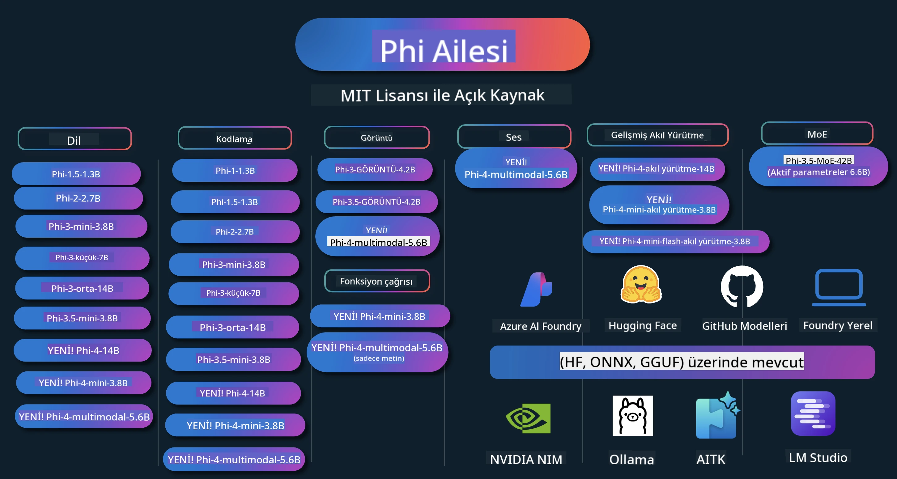

# Phi Yemek Kitabı: Microsoft'un Phi Modelleri ile Uygulamalı Örnekler

[](https://codespaces.new/microsoft/phicookbook)
[](https://vscode.dev/redirect?url=vscode://ms-vscode-remote.remote-containers/cloneInVolume?url=https://github.com/microsoft/phicookbook)

[](https://GitHub.com/microsoft/phicookbook/graphs/contributors/?WT.mc_id=aiml-137032-kinfeylo)
[](https://GitHub.com/microsoft/phicookbook/issues/?WT.mc_id=aiml-137032-kinfeylo)
[](https://GitHub.com/microsoft/phicookbook/pulls/?WT.mc_id=aiml-137032-kinfeylo)
[](http://makeapullrequest.com?WT.mc_id=aiml-137032-kinfeylo)

[](https://GitHub.com/microsoft/phicookbook/watchers/?WT.mc_id=aiml-137032-kinfeylo)
[](https://GitHub.com/microsoft/phicookbook/network/?WT.mc_id=aiml-137032-kinfeylo)
[](https://GitHub.com/microsoft/phicookbook/stargazers/?WT.mc_id=aiml-137032-kinfeylo)

[](https://discord.com/invite/ByRwuEEgH4)

Phi, Microsoft tarafından geliştirilen açık kaynaklı AI modelleri serisidir.

Phi, şu anda çokdilli, akıl yürütme, metin/sohbet oluşturma, kodlama, görüntüler, ses ve diğer senaryolarda çok iyi kıyaslamalar sunan en güçlü ve maliyet-etkin küçük dil modelidir (SLM).

Phi'yi buluta veya uç cihazlara dağıtabilir ve sınırlı hesaplama gücüyle kolayca üretken AI uygulamaları oluşturabilirsiniz.

Bu kaynakları kullanmaya başlamak için şu adımları izleyin:
1. **Depoyu çatallayın**: Tıklayın [](https://GitHub.com/microsoft/phicookbook/network/?WT.mc_id=aiml-137032-kinfeylo)
2. **Depoyu klonlayın**: `git clone https://github.com/microsoft/PhiCookBook.git`
3. [**Microsoft AI Discord Topluluğuna Katılın ve uzmanlar ile geliştiricilerle tanışın**](https://discord.com/invite/ByRwuEEgH4?WT.mc_id=aiml-137032-kinfeylo)



### 🌐 Çok Dilli Destek

#### GitHub Action üzerinden desteklenmektedir (Otomatik ve Her Zaman Güncel)

<!-- CO-OP TRANSLATOR LANGUAGES TABLE START -->
[Arapça](../ar/README.md) | [Bengalce](../bn/README.md) | [Bulgarca](../bg/README.md) | [Birmanca (Myanmar)](../my/README.md) | [Çince (Basitleştirilmiş)](../zh-CN/README.md) | [Çince (Geleneksel, Hong Kong)](../zh-HK/README.md) | [Çince (Geleneksel, Macau)](../zh-MO/README.md) | [Çince (Geleneksel, Tayvan)](../zh-TW/README.md) | [Hırvatça](../hr/README.md) | [Çekçe](../cs/README.md) | [Danca](../da/README.md) | [Flemenkçe](../nl/README.md) | [Estonca](../et/README.md) | [Fince](../fi/README.md) | [Fransızca](../fr/README.md) | [Almanca](../de/README.md) | [Yunanca](../el/README.md) | [İbranice](../he/README.md) | [Hintçe](../hi/README.md) | [Macarca](../hu/README.md) | [Endonezce](../id/README.md) | [İtalyanca](../it/README.md) | [Japonca](../ja/README.md) | [Kannada](../kn/README.md) | [Korece](../ko/README.md) | [Litvanca](../lt/README.md) | [Malayca](../ms/README.md) | [Malayalam](../ml/README.md) | [Marathi](../mr/README.md) | [Nepalce](../ne/README.md) | [Nijerya Pidgin](../pcm/README.md) | [Norveççe](../no/README.md) | [Farsça (Persian)](../fa/README.md) | [Lehçe](../pl/README.md) | [Portekizce (Brezilya)](../pt-BR/README.md) | [Portekizce (Portekiz)](../pt-PT/README.md) | [Pencapça (Gurmukhi)](../pa/README.md) | [Romen](../ro/README.md) | [Rusça](../ru/README.md) | [Sırpça (Sirilik)](../sr/README.md) | [Slovakça](../sk/README.md) | [Slovence](../sl/README.md) | [İspanyolca](../es/README.md) | [Svahili](../sw/README.md) | [İsveççe](../sv/README.md) | [Tagalogca (Filipince)](../tl/README.md) | [Tamilce](../ta/README.md) | [Telugu](../te/README.md) | [Tayca](../th/README.md) | [Türkçe](./README.md) | [Ukraynaca](../uk/README.md) | [Urduca](../ur/README.md) | [Vietnamca](../vi/README.md)

> **Yerelde Klonlamayı mı Tercih Ediyorsunuz?**
>
> Bu depo, indirme boyutunu önemli ölçüde artıran 50'den fazla dil çevirisini içerir. Çeviriler olmadan klonlamak için seyrek çekmeyi (sparse checkout) kullanın:
>
> **Bash / macOS / Linux:**
> ```bash
> git clone --filter=blob:none --sparse https://github.com/microsoft/PhiCookBook.git
> cd PhiCookBook
> git sparse-checkout set --no-cone '/*' '!translations' '!translated_images'
> ```
>
> **CMD (Windows):**
> ```cmd
> git clone --filter=blob:none --sparse https://github.com/microsoft/PhiCookBook.git
> cd PhiCookBook
> git sparse-checkout set --no-cone "/*" "!translations" "!translated_images"
> ```
>
> Bu, dersi tamamlamak için ihtiyacınız olan her şeyi çok daha hızlı bir indirme ile verir.
<!-- CO-OP TRANSLATOR LANGUAGES TABLE END -->

## İçindekiler

- Tanıtım
  - [Phi Ailesine Hoş Geldiniz](./md/01.Introduction/01/01.PhiFamily.md)
  - [Ortamınızı Kurma](./md/01.Introduction/01/01.EnvironmentSetup.md)
  - [Temel Teknolojileri Anlama](./md/01.Introduction/01/01.Understandingtech.md)
  - [Phi Modelleri için AI Güvenliği](./md/01.Introduction/01/01.AISafety.md)
  - [Phi Donanım Desteği](./md/01.Introduction/01/01.Hardwaresupport.md)
  - [Phi Modelleri ve Platformlar Arası Erişilebilirlik](./md/01.Introduction/01/01.Edgeandcloud.md)
  - [Guidance-ai ve Phi Kullanımı](./md/01.Introduction/01/01.Guidance.md)
  - [GitHub Marketplace Modelleri](https://github.com/marketplace/models)
  - [Azure AI Model Kataloğu](https://ai.azure.com)

- Farklı Ortamlarda Phi Çıkarımı
    -  [Hugging face](./md/01.Introduction/02/01.HF.md)
    -  [GitHub Modelleri](./md/01.Introduction/02/02.GitHubModel.md)
    -  [Azure AI Foundry Model Kataloğu](./md/01.Introduction/02/03.AzureAIFoundry.md)
    -  [Ollama](./md/01.Introduction/02/04.Ollama.md)
    -  [AI Toolkit VSCode (AITK)](./md/01.Introduction/02/05.AITK.md)
    -  [NVIDIA NIM](./md/01.Introduction/02/06.NVIDIA.md)
    -  [Foundry Yerel](./md/01.Introduction/02/07.FoundryLocal.md)

- Phi Ailesi Çıkarımı
    - [iOS'ta Phi İnferansı](./md/01.Introduction/03/iOS_Inference.md)
    - [Android'de Phi İnferansı](./md/01.Introduction/03/Android_Inference.md)
    - [Jetson'da Phi İnferansı](./md/01.Introduction/03/Jetson_Inference.md)
    - [AI PC'de Phi İnferansı](./md/01.Introduction/03/AIPC_Inference.md)
    - [Apple MLX Framework ile Phi İnferansı](./md/01.Introduction/03/MLX_Inference.md)
    - [Yerel Sunucuda Phi İnferansı](./md/01.Introduction/03/Local_Server_Inference.md)
    - [AI Toolkit kullanarak Uzaktan Sunucu Phi İnferansı](./md/01.Introduction/03/Remote_Interence.md)
    - [Rust ile Phi İnferansı](./md/01.Introduction/03/Rust_Inference.md)
    - [Yerelde Phi Görsel İnferansı](./md/01.Introduction/03/Vision_Inference.md)
    - [Kaito AKS, Azure Containers ile Phi İnferansı (resmi destek)](./md/01.Introduction/03/Kaito_Inference.md)
-  [Phi Ailesini Nicelleştirme](./md/01.Introduction/04/QuantifyingPhi.md)
    - [llama.cpp kullanarak Phi-3.5 / 4 nicelleştirme](./md/01.Introduction/04/UsingLlamacppQuantifyingPhi.md)
    - [onnxruntime için Üretken AI uzantıları ile Phi-3.5 / 4 nicelleştirme](./md/01.Introduction/04/UsingORTGenAIQuantifyingPhi.md)
    - [Intel OpenVINO kullanarak Phi-3.5 / 4 nicelleştirme](./md/01.Introduction/04/UsingIntelOpenVINOQuantifyingPhi.md)
    - [Apple MLX Framework kullanarak Phi-3.5 / 4 nicelleştirme](./md/01.Introduction/04/UsingAppleMLXQuantifyingPhi.md)

- Phi Değerlendirmesi
    - [Sorumlu AI](./md/01.Introduction/05/ResponsibleAI.md)
    - [Değerlendirme için Azure AI Foundry](./md/01.Introduction/05/AIFoundry.md)
    - [Değerlendirme için Promptflow Kullanımı](./md/01.Introduction/05/Promptflow.md)
 
- Azure AI Arama ile RAG
    - [Phi-4-mini ve Phi-4-multimodal (RAG) ile Azure AI Arama kullanımı](https://github.com/microsoft/PhiCookBook/blob/main/code/06.E2E/E2E_Phi-4-RAG-Azure-AI-Search.ipynb)

- Phi uygulama geliştirme örnekleri
  - Metin ve Sohbet Uygulamaları
    - Phi-4 Örnekleri 🆕
      - [📓] [Phi-4-mini ONNX Modeli ile Sohbet](./md/02.Application/01.TextAndChat/Phi4/ChatWithPhi4ONNX/README.md)
      - [Phi-4 yerel ONNX Modeli ile Sohbet .NET](../../md/04.HOL/dotnet/src/LabsPhi4-Chat-01OnnxRuntime)
      - [Anlamsal Çekirdek kullanarak Phi-4 ONNX ile .NET Konsol Uygulaması Sohbeti](../../md/04.HOL/dotnet/src/LabsPhi4-Chat-02SK)
    - Phi-3 / 3.5 Örnekleri
      - [Tarayıcıda Phi3, ONNX Runtime Web ve WebGPU kullanarak Yerel Chatbot](https://github.com/microsoft/onnxruntime-inference-examples/tree/main/js/chat)
      - [OpenVino Sohbet](./md/02.Application/01.TextAndChat/Phi3/E2E_OpenVino_Chat.md)
      - [Çoklu Model - Etkileşimli Phi-3-mini ve OpenAI Whisper](./md/02.Application/01.TextAndChat/Phi3/E2E_Phi-3-mini_with_whisper.md)
      - [MLFlow - Sarıcı oluşturma ve MLFlow ile Phi-3 kullanımı](./md//02.Application/01.TextAndChat/Phi3/E2E_Phi-3-MLflow.md)
      - [Model Optimizasyonu - Olive ile ONNX Runtime Web için Phi-3-min modeli nasıl optimize edilir](https://github.com/microsoft/Olive/tree/main/examples/phi3)
      - [Phi-3 mini-4k-instruct-onnx ile WinUI3 Uygulaması](https://github.com/microsoft/Phi3-Chat-WinUI3-Sample/)
      -[WinUI3 Çoklu Model Yapay Zeka Destekli Notlar Uygulaması Örneği](https://github.com/microsoft/ai-powered-notes-winui3-sample)
      - [Özel Phi-3 modellerini Prompt flow ile ince ayar yapma ve entegre etme](./md/02.Application/01.TextAndChat/Phi3/E2E_Phi-3-FineTuning_PromptFlow_Integration.md)
      - [Azure AI Foundry'de Prompt flow ile özel Phi-3 modellerini ince ayar yapma ve entegre etme](./md/02.Application/01.TextAndChat/Phi3/E2E_Phi-3-FineTuning_PromptFlow_Integration_AIFoundry.md)
      - [Azure AI Foundry'de Microsoft'un Sorumlu Yapay Zeka İlkelerine Odaklanarak İnce Ayarlı Phi-3 / Phi-3.5 Modelinin Değerlendirilmesi](./md/02.Application/01.TextAndChat/Phi3/E2E_Phi-3-Evaluation_AIFoundry.md)
      - [📓] [Phi-3.5-mini-instruct dil tahmin örneği (Çince/İngilizce)](./md/02.Application/01.TextAndChat/Phi3/phi3-instruct-demo.ipynb)
      - [Phi-3.5-Instruct WebGPU RAG Sohbet Botu](./md/02.Application/01.TextAndChat/Phi3/WebGPUWithPhi35Readme.md)
      - [Phi-3.5-Instruct ONNX ile Windows GPU kullanarak Prompt flow çözümü oluşturma](./md/02.Application/01.TextAndChat/Phi3/UsingPromptFlowWithONNX.md)
      - [Microsoft Phi-3.5 tflite kullanarak Android uygulaması oluşturma](./md/02.Application/01.TextAndChat/Phi3/UsingPhi35TFLiteCreateAndroidApp.md)
      - [Microsoft.ML.OnnxRuntime kullanarak yerel ONNX Phi-3 modeli ile Soru-Cevap .NET Örneği](../../md/04.HOL/dotnet/src/LabsPhi301)
      - [Semantic Kernel ve Phi-3 ile konsol sohbet .NET uygulaması](../../md/04.HOL/dotnet/src/LabsPhi302)

  - Azure AI Çıkarım SDK Kod Bazlı Örnekler
    - Phi-4 Örnekleri 🆕
      - [📓] [Phi-4-multimodal kullanarak proje kodu oluşturma](./md/02.Application/02.Code/Phi4/GenProjectCode/README.md)
    - Phi-3 / 3.5 Örnekleri
      - [Microsoft Phi-3 Ailesi ile kendi Visual Studio Code GitHub Copilot Sohbetinizi oluşturun](./md/02.Application/02.Code/Phi3/VSCodeExt/README.md)
      - [GitHub Modelleri ile Phi-3.5 kullanarak kendi Visual Studio Code Sohbet Copilot Ajanınızı oluşturun](/md/02.Application/02.Code/Phi3/CreateVSCodeChatAgentWithGitHubModels.md)

  - Gelişmiş Akıl Yürütme Örnekleri
    - Phi-4 Örnekleri 🆕
      - [📓] [Phi-4-mini-akıl yürütme veya Phi-4-akıl yürütme Örnekleri](./md/02.Application/03.AdvancedReasoning/Phi4/AdvancedResoningPhi4mini/README.md)
      - [📓] [Microsoft Olive ile Phi-4-mini-akıl yürütmeyi ince ayar yapma](./md/02.Application/03.AdvancedReasoning/Phi4/AdvancedResoningPhi4mini/olive_ft_phi_4_reasoning_with_medicaldata.ipynb)
      - [📓] [Apple MLX ile Phi-4-mini-akıl yürütmeyi ince ayar yapma](./md/02.Application/03.AdvancedReasoning/Phi4/AdvancedResoningPhi4mini/mlx_ft_phi_4_reasoning_with_medicaldata.ipynb)
      - [📓] [GitHub Modelleri ile Phi-4-mini-akıl yürütme](./md/02.Application/02.Code/Phi4r/github_models_inference.ipynb)
      - [📓] [Azure AI Foundry Modelleri ile Phi-4-mini-akıl yürütme](./md/02.Application/02.Code/Phi4r/azure_models_inference.ipynb)
  - Demos
      - [Phi-4-mini demoları Hugging Face Spaces üzerinde barındırılıyor](https://huggingface.co/spaces/microsoft/phi-4-mini?WT.mc_id=aiml-137032-kinfeylo)
      - [Phi-4-multimodal demoları Hugging Face Spaces üzerinde barındırılıyor](https://huggingface.co/spaces/microsoft/phi-4-multimodal?WT.mc_id=aiml-137032-kinfeylo)
  - Görüş Örnekleri
    - Phi-4 Örnekleri 🆕
      - [📓] [Phi-4-multimodal kullanarak resimleri okuma ve kod oluşturma](./md/02.Application/04.Vision/Phi4/CreateFrontend/README.md) 
    - Phi-3 / 3.5 Örnekleri
      -  [📓][Phi-3-görüş-Resim metinden metine](./md/02.Application/04.Vision/Phi3/E2E_Phi-3-vision-image-text-to-text-online-endpoint.ipynb)
      - [Phi-3-görüş-ONNX](https://onnxruntime.ai/docs/genai/tutorials/phi3-v.html)
      - [📓][Phi-3-görüş CLIP Gömme](./md/02.Application/04.Vision/Phi3/E2E_Phi-3-vision-image-text-to-text-online-endpoint.ipynb)
      - [DEMO: Phi-3 Geri Dönüşüm](https://github.com/jennifermarsman/PhiRecycling/)
      - [Phi-3-görüş - Görsel dil asistanı - Phi3-Görüş ve OpenVINO ile](https://docs.openvino.ai/nightly/notebooks/phi-3-vision-with-output.html)
      - [Phi-3 Görüş Nvidia NIM](./md/02.Application/04.Vision/Phi3/E2E_Nvidia_NIM_Vision.md)
      - [Phi-3 Görüş OpenVino](./md/02.Application/04.Vision/Phi3/E2E_OpenVino_Phi3Vision.md)
      - [📓][Phi-3.5 Görüş çoklu kare veya çoklu resim örneği](./md/02.Application/04.Vision/Phi3/phi3-vision-demo.ipynb)
      - [Microsoft.ML.OnnxRuntime .NET kullanarak Phi-3 Görüş Yerel ONNX Modeli](../../md/04.HOL/dotnet/src/LabsPhi303)
      - [Microsoft.ML.OnnxRuntime .NET kullanarak Menü tabanlı Phi-3 Görüş Yerel ONNX Modeli](../../md/04.HOL/dotnet/src/LabsPhi304)

  - Matematik Örnekleri
    - Phi-4-Mini-Flash-Akıl Yürütme-Yönerge Örnekleri 🆕 [Phi-4-Mini-Flash-Akıl Yürütme-Yönerge ile Matematik Demo](./md/02.Application/09.Math/MathDemo.ipynb)

  - Ses Örnekleri
    - Phi-4 Örnekleri 🆕
      - [📓] [Phi-4-multimodal kullanarak ses transkriptlerini çıkarma](./md/02.Application/05.Audio/Phi4/Transciption/README.md)
      - [📓] [Phi-4-multimodal Ses Örneği](./md/02.Application/05.Audio/Phi4/Siri/demo.ipynb)
      - [📓] [Phi-4-multimodal Konuşma Çevirisi Örneği](./md/02.Application/05.Audio/Phi4/Translate/demo.ipynb)
      - [.NET konsol uygulaması ile Phi-4-multimodal Ses kullanarak bir ses dosyasını analiz etme ve transkript oluşturma](../../md/04.HOL/dotnet/src/LabsPhi4-MultiModal-02Audio)

  - MOE Örnekleri
    - Phi-3 / 3.5 Örnekleri
      - [📓] [Phi-3.5 Uzman Karışımı Modelleri (MoEs) Sosyal Medya Örneği](./md/02.Application/06.MoE/Phi3/phi3_moe_demo.ipynb)
      - [📓] [NVIDIA NIM Phi-3 MOE, Azure AI Search ve LlamaIndex ile Retrieval-Augmented Generation (RAG) Boru Hattı Oluşturma](./md/02.Application/06.MoE/Phi3/azure-ai-search-nvidia-rag.ipynb)
      - 
  - Fonksiyon Çağrısı Örnekleri
    - Phi-4 Örnekleri 🆕
      -  [📓] [Phi-4-mini ile Fonksiyon Çağrısı kullanımı](./md/02.Application/07.FunctionCalling/Phi4/FunctionCallingBasic/README.md)
      -  [📓] [Phi-4-mini ile çoklu ajanlar oluşturmak için Fonksiyon Çağrısı kullanımı](./md/02.Application/07.FunctionCalling/Phi4/Multiagents/Phi_4_mini_multiagent.ipynb)
      -  [📓] [Fonksiyon Çağrısını Ollama ile kullanma](./md/02.Application/07.FunctionCalling/Phi4/Ollama/ollama_functioncalling.ipynb)
      -  [📓] [Fonksiyon Çağrısını ONNX ile kullanma](./md/02.Application/07.FunctionCalling/Phi4/ONNX/onnx_parallel_functioncalling.ipynb)
  - Multimodal Karışım Örnekleri
    - Phi-4 Örnekleri 🆕
      -  [📓] [Phi-4-multimodal teknolojisi ile gazeteci kullanımı](./md/02.Application/08.Multimodel/Phi4/TechJournalist/phi_4_mm_audio_text_publish_news.ipynb)
      - [.NET konsol uygulaması ile Phi-4-multimodal kullanarak resimleri analiz etme](../../md/04.HOL/dotnet/src/LabsPhi4-MultiModal-01Images)

- Phi İnce Ayarı Örnekleri
  - [İnce Ayar Senaryoları](./md/03.FineTuning/FineTuning_Scenarios.md)
  - [İnce Ayar ve RAG Karşılaştırması](./md/03.FineTuning/FineTuning_vs_RAG.md)
  - [Phi-3'ü bir endüstri uzmanı yapacak ince ayar](./md/03.FineTuning/LetPhi3gotoIndustriy.md)
  - [VS Code için AI Toolkit ile Phi-3 ince ayarı](./md/03.FineTuning/Finetuning_VSCodeaitoolkit.md)
  - [Azure Machine Learning Hizmeti ile Phi-3 ince ayarı](./md/03.FineTuning/Introduce_AzureML.md)
  - [Lora ile Phi-3 ince ayarı](./md/03.FineTuning/FineTuning_Lora.md)
  - [QLora ile Phi-3 ince ayarı](./md/03.FineTuning/FineTuning_Qlora.md)
  - [Azure AI Foundry ile Phi-3 ince ayarı](./md/03.FineTuning/FineTuning_AIFoundry.md)
  - [Azure ML CLI/SDK ile Phi-3 ince ayarı](./md/03.FineTuning/FineTuning_MLSDK.md)
  - [Microsoft Olive ile ince ayar](./md/03.FineTuning/FineTuning_MicrosoftOlive.md)
  - [Microsoft Olive Pratik Laboratuvar ile ince ayar](./md/03.FineTuning/olive-lab/readme.md)
  - [Weights and Bias ile Phi-3-vision ince ayarı](./md/03.FineTuning/FineTuning_Phi-3-visionWandB.md)
  - [Apple MLX Framework ile Phi-3 ince ayarı](./md/03.FineTuning/FineTuning_MLX.md)
  - [Phi-3-vision ince ayarı (resmi destek)](./md/03.FineTuning/FineTuning_Vision.md)
  - [Kaito AKS, Azure Containers ile Phi-3 ince ayarı (resmi destek)](./md/03.FineTuning/FineTuning_Kaito.md)
  - [Phi-3 ve 3.5 Vision İnce Ayarı](https://github.com/2U1/Phi3-Vision-Finetune)

- Pratik Laboratuvar
  - [En yeni modelleri keşfetmek: LLMler, SLMler, yerel geliştirme ve daha fazlası](https://github.com/microsoft/aitour-exploring-cutting-edge-models)
  - [NLP Potansiyelini Açığa Çıkarmak: Microsoft Olive ile İnce Ayar](https://github.com/azure/Ignite_FineTuning_workshop)
- Akademik Araştırma Makaleleri ve Yayınlar  
  - [Textbooks Are All You Need II: phi-1.5 teknik raporu](https://arxiv.org/abs/2309.05463)  
  - [Phi-3 Teknik Raporu: Telefonunuzda Yerel Olarak Oldukça Yetkin Bir Dil Modeli](https://arxiv.org/abs/2404.14219)  
  - [Phi-4 Teknik Raporu](https://arxiv.org/abs/2412.08905)  
  - [Phi-4-Mini Teknik Raporu: Karışım-LoRA Yöntemiyle Kompakt ve Güçlü Çok Modlu Dil Modelleri](https://arxiv.org/abs/2503.01743)  
  - [Araç İçi Fonksiyon Çağrısı İçin Küçük Dil Modellerini Optimize Etmek](https://arxiv.org/abs/2501.02342)  
  - [(WhyPHI) PHI-3’ün Çoktan Seçmeli Soru Cevaplama için İncelenmesi: Yöntem, Sonuçlar ve Zorluklar](https://arxiv.org/abs/2501.01588)  
  - [Phi-4-Reasoning Teknik Raporu](https://www.microsoft.com/en-us/research/wp-content/uploads/2025/04/phi_4_reasoning.pdf)  
  - [Phi-4-mini-Reasoning Teknik Raporu](https://huggingface.co/microsoft/Phi-4-mini-reasoning/blob/main/Phi-4-Mini-Reasoning.pdf)  

## Phi Modellerini Kullanma

### Phi Azure AI Foundry Üzerinde

Microsoft Phi’yi nasıl kullanacağınızı ve farklı donanım cihazlarınızda uçtan uca çözümler nasıl oluşturacağınızı öğrenebilirsiniz. Phi’yi kendiniz deneyimlemek için modellerle oynamaya başlayabilir ve senaryolarınıza göre Phi’yi özelleştirebilirsiniz. [Azure AI Foundry Azure AI Model Kataloğu](https://aka.ms/phi3-azure-ai) üzerinden daha fazlasını öğrenebilir ve [Azure AI Foundry ile Başlarken](/md/02.QuickStart/AzureAIFoundry_QuickStart.md) rehberine göz atabilirsiniz.

**Oyun Alanı**  
Her modelin testi için özel bir oyun alanı bulunmaktadır: [Azure AI Playground](https://aka.ms/try-phi3).

### Phi GitHub Modelleri Üzerinde

Microsoft Phi’yi nasıl kullanacağınızı ve farklı donanım cihazlarınızda uçtan uca çözümler oluşturmayı öğrenebilirsiniz. Phi’yi kendiniz deneyimlemek için modeli kullanmaya başlayabilir ve senaryolarınıza göre Phi’yi özelleştirebilirsiniz. [GitHub Model Kataloğu](https://github.com/marketplace/models?WT.mc_id=aiml-137032-kinfeylo) üzerinden daha fazlasını öğrenebilir ve [GitHub Model Kataloğu ile Başlarken](/md/02.QuickStart/GitHubModel_QuickStart.md) rehberine göz atabilirsiniz.

**Oyun Alanı**  
Her modelin testi için özel bir [oyun alanı](/md/02.QuickStart/GitHubModel_QuickStart.md) vardır.

### Phi Hugging Face Üzerinde

Modeli ayrıca [Hugging Face](https://huggingface.co/microsoft) üzerinde de bulabilirsiniz.

**Oyun Alanı**  
[Hugging Chat oyun alanı](https://huggingface.co/chat/models/microsoft/Phi-3-mini-4k-instruct)

## 🎒 Diğer Kurslar

Ekibimiz başka kurslar da üretiyor! Göz atın:

<!-- CO-OP TRANSLATOR OTHER COURSES START -->  
### LangChain  
[](https://aka.ms/langchain4j-for-beginners)  
[](https://aka.ms/langchainjs-for-beginners?WT.mc_id=m365-94501-dwahlin)  
[](https://github.com/microsoft/langchain-for-beginners?WT.mc_id=m365-94501-dwahlin)  
---  

### Azure / Edge / MCP / Ajanlar  
[](https://github.com/microsoft/AZD-for-beginners?WT.mc_id=academic-105485-koreyst)  
[](https://github.com/microsoft/edgeai-for-beginners?WT.mc_id=academic-105485-koreyst)  
[](https://github.com/microsoft/mcp-for-beginners?WT.mc_id=academic-105485-koreyst)  
[](https://github.com/microsoft/ai-agents-for-beginners?WT.mc_id=academic-105485-koreyst)  

---  

### Üretken AI Serisi  
[](https://github.com/microsoft/generative-ai-for-beginners?WT.mc_id=academic-105485-koreyst)  
[-9333EA?style=for-the-badge&labelColor=E5E7EB&color=9333EA)](https://github.com/microsoft/Generative-AI-for-beginners-dotnet?WT.mc_id=academic-105485-koreyst)  
[-C084FC?style=for-the-badge&labelColor=E5E7EB&color=C084FC)](https://github.com/microsoft/generative-ai-for-beginners-java?WT.mc_id=academic-105485-koreyst)  
[-E879F9?style=for-the-badge&labelColor=E5E7EB&color=E879F9)](https://github.com/microsoft/generative-ai-with-javascript?WT.mc_id=academic-105485-koreyst)  

---  

### Temel Öğrenme  
[](https://aka.ms/ml-beginners?WT.mc_id=academic-105485-koreyst)  
[](https://aka.ms/datascience-beginners?WT.mc_id=academic-105485-koreyst)  
[](https://aka.ms/ai-beginners?WT.mc_id=academic-105485-koreyst)  
[](https://github.com/microsoft/Security-101?WT.mc_id=academic-96948-sayoung)  
[](https://aka.ms/webdev-beginners?WT.mc_id=academic-105485-koreyst)  
[](https://aka.ms/iot-beginners?WT.mc_id=academic-105485-koreyst)  
[](https://github.com/microsoft/xr-development-for-beginners?WT.mc_id=academic-105485-koreyst)  

---  

### Copilot Serisi  
[](https://aka.ms/GitHubCopilotAI?WT.mc_id=academic-105485-koreyst)  
[](https://github.com/microsoft/mastering-github-copilot-for-dotnet-csharp-developers?WT.mc_id=academic-105485-koreyst)  
[](https://github.com/microsoft/CopilotAdventures?WT.mc_id=academic-105485-koreyst)  
<!-- CO-OP TRANSLATOR OTHER COURSES END -->

## Sorumlu Yapay Zeka

Microsoft, müşterilerimizin AI ürünlerimizi sorumlu biçimde kullanmalarına yardımcı olmayı, deneyimlerimizi paylaşmayı ve Şeffaflık Notları ve Etki Değerlendirmeleri gibi araçlarla güvene dayalı ortaklıklar kurmayı taahhüt eder. Bu kaynakların birçoğuna [https://aka.ms/RAI](https://aka.ms/RAI) adresinden ulaşabilirsiniz.  
Microsoft’un sorumlu yapay zeka yaklaşımı, adalet, güvenilirlik ve güvenlik, gizlilik ve emniyet, kapsayıcılık, şeffaflık ve hesap verebilirlik gibi Yapay Zeka ilkelerimize dayanmaktadır.

Bu örnekte kullanılanlar gibi büyük ölçekli doğal dil, görüntü ve konuşma modelleri adaletsiz, güvenilmez veya rahatsız edici biçimde davranabilir ve dolayısıyla zararlara yol açabilir. Riskler ve sınırlamalar hakkında bilgi edinmek için [Azure OpenAI hizmeti Şeffaflık notunu](https://learn.microsoft.com/legal/cognitive-services/openai/transparency-note?tabs=text) inceleyiniz.

Bu riskleri azaltmak için mimarinize zararlı davranışları tespit edip engelleyebilen bir güvenlik sisteminin dahil edilmesi önerilmektedir. [Azure AI İçerik Güvenliği](https://learn.microsoft.com/azure/ai-services/content-safety/overview) uygulama ve hizmetlerde kullanıcı ve yapay zekâ tarafından üretilen zararlı içeriği tespit edebilen bağımsız bir koruma katmanı sağlar. Azure AI İçerik Güvenliği, zararlı materyali algılamanıza olanak tanıyan metin ve görüntü API’leri içerir. Azure AI Foundry içinde, İçerik Güvenliği servisi farklı modalitelerde zararlı içerik tespiti için örnek kodları görüntülemenize, keşfetmenize ve deneyimlemenize olanak tanır. Aşağıdaki [hızlı başlangıç dokümantasyonu](https://learn.microsoft.com/azure/ai-services/content-safety/quickstart-text?tabs=visual-studio%2Clinux&pivots=programming-language-rest) servise istek yapmayı adım adım anlatır.
Dikkate alınması gereken bir diğer husus ise genel uygulama performansıdır. Çok modlu ve çok modellerli uygulamalarda, performansın anlamı, sistemin siz ve kullanıcılarınızın beklentileri doğrultusunda çalışması, zararlı çıktıların üretilmemesi olarak kabul edilir. Genel uygulamanızın performansını [Performans ve Kalite ile Risk ve Güvenlik değerlendiricileri](https://learn.microsoft.com/azure/ai-studio/concepts/evaluation-metrics-built-in) aracılığıyla değerlendirmeniz önemlidir. Ayrıca, [özel değerlendiriciler](https://learn.microsoft.com/azure/ai-studio/how-to/develop/evaluate-sdk#custom-evaluators) oluşturup bunlarla değerlendirme yapma imkânınız da bulunmaktadır.

Geliştirme ortamınızda AI uygulamanızı [Azure AI Evaluation SDK](https://microsoft.github.io/promptflow/index.html) kullanarak değerlendirebilirsiniz. Bir test veri seti veya hedef verilerek, üretici AI uygulamanızın çıktıları, önceden tanımlanmış veya seçtiğiniz özel değerlendiricilerle niceliksel olarak ölçülür. Sisteminizin değerlendirmesine başlamak için azure ai evaluation sdk ile ilgili [hızlı başlangıç kılavuzunu](https://learn.microsoft.com/azure/ai-studio/how-to/develop/flow-evaluate-sdk) takip edebilirsiniz. Bir değerlendirme çalışması gerçekleştirdikten sonra, sonuçları [Azure AI Foundry'de görüntüleyebilirsiniz](https://learn.microsoft.com/azure/ai-studio/how-to/evaluate-flow-results).

## Ticari Markalar

Bu proje, projeler, ürünler veya hizmetler için ticari marka veya logolar içerebilir. Microsoft ticari markalarının veya logolarının yetkili kullanımı, [Microsoft’un Ticari Marka ve Marka Kılavuzları](https://www.microsoft.com/legal/intellectualproperty/trademarks/usage/general) uyarınca yapılmalıdır. Microsoft ticari markalarının veya logolarının değiştirilmiş versiyonlarda kullanımı, karışıklığa yol açmamalı veya Microsoft sponsorluğunu çağrıştırmamalıdır. Üçüncü tarafların ticari marka veya logolarının kullanımı ise ilgili üçüncü tarafların politikalarına tabidir.

## Yardım Alma

AI uygulamaları geliştirme konusunda takıldığınızda veya sorularınız olduğunda katılın:

[](https://aka.ms/foundry/discord)

Ürün geri bildirimi veya hatalarla ilgili olarak şurayı ziyaret edin:

[](https://aka.ms/foundry/forum)

---

<!-- CO-OP TRANSLATOR DISCLAIMER START -->
**Feragatname**:  
Bu belge, AI çeviri servisi [Co-op Translator](https://github.com/Azure/co-op-translator) kullanılarak çevrilmiştir. Doğruluk için çaba sarf etsek de, otomatik çevirilerin hatalar veya yanlış anlamalar içerebileceğini lütfen unutmayın. Orijinal belge, kendi dilindeki metin olarak yetkili kaynak olarak kabul edilmelidir. Kritik bilgiler için profesyonel insan çevirisi önerilir. Bu çevirinin kullanımı sonucu ortaya çıkabilecek herhangi bir yanlış anlama veya yanlış yorumlamadan sorumlu değiliz.
<!-- CO-OP TRANSLATOR DISCLAIMER END -->