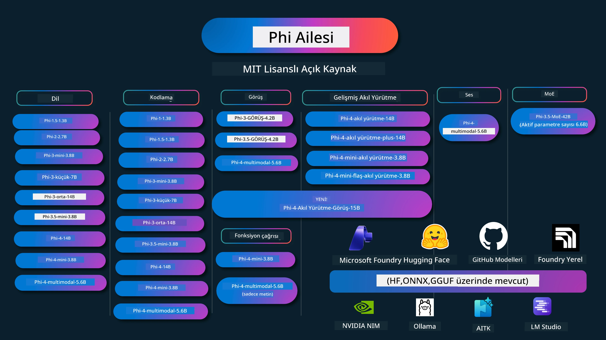

# Phi Tarif Kitabı: Microsoft'un Phi Modelleri ile Pratik Örnekler

[](https://codespaces.new/microsoft/phicookbook)
[](https://vscode.dev/redirect?url=vscode://ms-vscode-remote.remote-containers/cloneInVolume?url=https://github.com/microsoft/phicookbook)

[](https://GitHub.com/microsoft/phicookbook/graphs/contributors/?WT.mc_id=aiml-137032-kinfeylo)
[](https://GitHub.com/microsoft/phicookbook/issues/?WT.mc_id=aiml-137032-kinfeylo)
[](https://GitHub.com/microsoft/phicookbook/pulls/?WT.mc_id=aiml-137032-kinfeylo)
[](http://makeapullrequest.com?WT.mc_id=aiml-137032-kinfeylo)

[](https://GitHub.com/microsoft/phicookbook/watchers/?WT.mc_id=aiml-137032-kinfeylo)
[](https://GitHub.com/microsoft/phicookbook/network/?WT.mc_id=aiml-137032-kinfeylo)
[](https://GitHub.com/microsoft/phicookbook/stargazers/?WT.mc_id=aiml-137032-kinfeylo)

[](https://discord.com/invite/ByRwuEEgH4)

Phi, Microsoft tarafından geliştirilmiş açık kaynaklı bir dizi yapay zeka modelidir.

Phi, şu anda çok dilli, muhakeme, metin/sohbet oluşturma, kodlama, görüntü, ses ve diğer senaryolarda çok iyi performans gösteren, en güçlü ve uygun maliyetli küçük dil modeli (SLM) olarak öne çıkmaktadır.

Phi'yi bulutta veya kenar cihazlarda dağıtabilir ve sınırlı hesaplama gücüyle kolayca üretken AI uygulamaları oluşturabilirsiniz.

Bu kaynakları kullanmaya başlamak için şu adımları izleyin:
1. **Depoyu Çatallayın**: Tıklayın [](https://GitHub.com/microsoft/phicookbook/network/?WT.mc_id=aiml-137032-kinfeylo)
2. **Depoyu Klonlayın**:   `git clone https://github.com/microsoft/PhiCookBook.git`
3. [**Microsoft AI Discord Topluluğuna Katılın ve uzmanlar ile diğer geliştiricilerle tanışın**](https://discord.com/invite/ByRwuEEgH4?WT.mc_id=aiml-137032-kinfeylo)



### 🌐 Çok Dilli Destek

#### GitHub Action ile Desteklenir (Otomatik & Daima Güncel)

<!-- CO-OP TRANSLATOR LANGUAGES TABLE START -->
[Arapça](../ar/README.md) | [Bengalce](../bn/README.md) | [Bulgarca](../bg/README.md) | [Burmaca (Myanmar)](../my/README.md) | [Çince (Basitleştirilmiş)](../zh-CN/README.md) | [Çince (Geleneksel, Hong Kong)](../zh-HK/README.md) | [Çince (Geleneksel, Makao)](../zh-MO/README.md) | [Çince (Geleneksel, Tayvan)](../zh-TW/README.md) | [Hırvatça](../hr/README.md) | [Çekçe](../cs/README.md) | [Dancaca](../da/README.md) | [Felemenkçe](../nl/README.md) | [Estonca](../et/README.md) | [Fince](../fi/README.md) | [Fransızca](../fr/README.md) | [Almanca](../de/README.md) | [Yunanca](../el/README.md) | [İbranice](../he/README.md) | [Hintçe](../hi/README.md) | [Macarca](../hu/README.md) | [Endonezce](../id/README.md) | [İtalyanca](../it/README.md) | [Japonca](../ja/README.md) | [Kannada](../kn/README.md) | [Kmerce](../km/README.md) | [Korece](../ko/README.md) | [Litvanca](../lt/README.md) | [Malayca](../ms/README.md) | [Malayalamca](../ml/README.md) | [Marathi](../mr/README.md) | [Nepalce](../ne/README.md) | [Nijerya Pidgin](../pcm/README.md) | [Norveççe](../no/README.md) | [Farsça (Farsi)](../fa/README.md) | [Lehçe](../pl/README.md) | [Portekizce (Brezilya)](../pt-BR/README.md) | [Portekizce (Portekiz)](../pt-PT/README.md) | [Pencapça (Gurmukhi)](../pa/README.md) | [Rumence](../ro/README.md) | [Rusça](../ru/README.md) | [Sırpça (Kiril)](../sr/README.md) | [Slovakça](../sk/README.md) | [Slovence](../sl/README.md) | [İspanyolca](../es/README.md) | [Svahili](../sw/README.md) | [İsveççe](../sv/README.md) | [Tagalog (Filipinler)](../tl/README.md) | [Tamilce](../ta/README.md) | [Telugu](../te/README.md) | [Tayca](../th/README.md) | [Türkçe](./README.md) | [Ukraynaca](../uk/README.md) | [Urduca](../ur/README.md) | [Vietnamca](../vi/README.md)

> **Yerelde Klonlamayı mı Tercih Edersiniz?**
>
> Bu depo 50+ dil çevirisi içerir, bu da indirme boyutunu önemli ölçüde artırır. Çeviriler olmadan klonlamak için sparse checkout kullanabilirsiniz:
>
> **Bash / macOS / Linux:**
> ```bash
> git clone --filter=blob:none --sparse https://github.com/microsoft/PhiCookBook.git
> cd PhiCookBook
> git sparse-checkout set --no-cone '/*' '!translations' '!translated_images'
> ```
>
> **CMD (Windows):**
> ```cmd
> git clone --filter=blob:none --sparse https://github.com/microsoft/PhiCookBook.git
> cd PhiCookBook
> git sparse-checkout set --no-cone "/*" "!translations" "!translated_images"
> ```
>
> Bu, kursu tamamlamak için ihtiyacınız olan her şeyi çok daha hızlı bir indirme ile sağlar.
<!-- CO-OP TRANSLATOR LANGUAGES TABLE END -->

## İçindekiler Tablosu
- Giriş - [Phi Ailesine Hoşgeldiniz](./md/01.Introduction/01/01.PhiFamily.md) - [Ortamınızı Kurma](./md/01.Introduction/01/01.EnvironmentSetup.md) - [Ana Teknolojileri Anlama](./md/01.Introduction/01/01.Understandingtech.md) - [Phi Modelleri için AI Güvenliği](./md/01.Introduction/01/01.AISafety.md) - [Phi Donanım Desteği](./md/01.Introduction/01/01.Hardwaresupport.md) - [Phi Modelleri & Platformlar Arasındaki Kullanılabilirlik](./md/01.Introduction/01/01.Edgeandcloud.md) - [Guidance-ai ve Phi Kullanımı](./md/01.Introduction/01/01.Guidance.md) - [GitHub Marketplace Modelleri](https://github.com/marketplace/models) - [Azure AI Model Kataloğu](https://ai.azure.com) - Farklı Ortamlarda Phi Çıkarımı - [Hugging face](./md/01.Introduction/02/01.HF.md) - [GitHub Modelleri](./md/01.Introduction/02/02.GitHubModel.md) - [Microsoft Foundry Model Kataloğu](./md/01.Introduction/02/03.AzureAIFoundry.md) - [Ollama](./md/01.Introduction/02/04.Ollama.md) - [AI Toolkit VSCode (AITK)](./md/01.Introduction/02/05.AITK.md) - [NVIDIA NIM](./md/01.Introduction/02/06.NVIDIA.md) - [Foundry Yerel](./md/01.Introduction/02/07.FoundryLocal.md) - Phi Ailesi Çıkarımı - [iOS’ta Phi Çıkarımı](./md/01.Introduction/03/iOS_Inference.md) - [Android’de Phi Çıkarımı](./md/01.Introduction/03/Android_Inference.md) - [Jetson’da Phi Çıkarımı](./md/01.Introduction/03/Jetson_Inference.md) - [AI PC’de Phi Çıkarımı](./md/01.Introduction/03/AIPC_Inference.md) - [Apple MLX Çerçevesi ile Phi Çıkarımı](./md/01.Introduction/03/MLX_Inference.md) - [Yerel Sunucuda Phi Çıkarımı](./md/01.Introduction/03/Local_Server_Inference.md) - [AI Toolkit kullanarak Uzak Sunucuda Phi Çıkarımı](./md/01.Introduction/03/Remote_Interence.md) - [Rust ile Phi Çıkarımı](./md/01.Introduction/03/Rust_Inference.md) - [Yerelde Phi--Vision Çıkarımı](./md/01.Introduction/03/Vision_Inference.md) - [Kaito AKS, Azure Konteynerleri (resmi destek) ile Phi Çıkarımı](./md/01.Introduction/03/Kaito_Inference.md) - Phi Ailesini Nicelleştirme - [Phi Ailesini Nicelleştirme](./md/01.Introduction/04/QuantifyingPhi.md) - [llama.cpp kullanarak Phi-3.5 / 4 nicelleştirme](./md/01.Introduction/04/UsingLlamacppQuantifyingPhi.md) - [onnxruntime için Üretken AI eklentileri ile Phi-3.5 / 4 nicelleştirme](./md/01.Introduction/04/UsingORTGenAIQuantifyingPhi.md) - [Intel OpenVINO kullanarak Phi-3.5 / 4 nicelleştirme](./md/01.Introduction/04/UsingIntelOpenVINOQuantifyingPhi.md) - [Apple MLX Çerçevesi kullanarak Phi-3.5 / 4 nicelleştirme](./md/01.Introduction/04/UsingAppleMLXQuantifyingPhi.md) - Phi Değerlendirmesi - [Sorumlu AI](./md/01.Introduction/05/ResponsibleAI.md) - [Değerlendirme için Microsoft Foundry](./md/01.Introduction/05/AIFoundry.md) - [Değerlendirme için Promptflow Kullanımı](./md/01.Introduction/05/Promptflow.md) - Azure AI Arama ile RAG - [Azure AI Arama ile Phi-4-mini ve Phi-4-multimodal (RAG) nasıl kullanılır](https://github.com/microsoft/PhiCookBook/blob/main/code/06.E2E/E2E_Phi-4-RAG-Azure-AI-Search.ipynb) - Phi uygulama geliştirme örnekleri - Metin & Sohbet Uygulamaları - Phi-4 Örnekleri - [📓] [Phi-4-mini ONNX Modeli ile Sohbet](./md/02.Application/01.TextAndChat/Phi4/ChatWithPhi4ONNX/README.md) - [Phi-4 yerel ONNX Modeli ile Sohbet .NET](../../md/04.HOL/dotnet/src/LabsPhi4-Chat-01OnnxRuntime) - [Sementic Kernel kullanarak Phi-4 ONNX ile .NET Console Sohbet Uygulaması](../../md/04.HOL/dotnet/src/LabsPhi4-Chat-02SK) - Phi-3 / 3.5 Örnekleri - [Tarayıcıda Phi3, ONNX Runtime Web ve WebGPU kullanarak Yerel Chatbot](https://github.com/microsoft/onnxruntime-inference-examples/tree/main/js/chat) - [OpenVino Sohbet](./md/02.Application/01.TextAndChat/Phi3/E2E_OpenVino_Chat.md) - [Çoklu Model - Etkileşimli Phi-3-mini ve OpenAI Whisper](./md/02.Application/01.TextAndChat/Phi3/E2E_Phi-3-mini_with_whisper.md) - [MLFlow - Phi-3 ile sarıcı oluşturma ve kullanma](./md//02.Application/01.TextAndChat/Phi3/E2E_Phi-3-MLflow.md) - [Model Optimizasyonu - Phi-3-min modeli ONNX Runtime Web için Olive ile nasıl optimize edilir](https://github.com/microsoft/Olive/tree/main/examples/phi3) - [Phi-3 mini-4k-instruct-onnx ile WinUI3 Uygulaması](https://github.com/microsoft/Phi3-Chat-WinUI3-Sample/) - [WinUI3 Çoklu Model AI Destekli Notlar Uygulaması Örneği](https://github.com/microsoft/ai-powered-notes-winui3-sample) - [Özel Phi-3 modellerini Prompt flow ile ince ayar yapma ve entegre etme](./md/02.Application/01.TextAndChat/Phi3/E2E_Phi-3-FineTuning_PromptFlow_Integration.md) - [Microsoft Foundry'de Prompt flow ile özel Phi-3 modellerini ince ayar yapma ve entegre etme](./md/02.Application/01.TextAndChat/Phi3/E2E_Phi-3-FineTuning_PromptFlow_Integration_AIFoundry.md) - [Microsoft'un Sorumlu AI İlkelerine odaklanarak Microsoft Foundry'de ince ayar yapılmış Phi-3 / Phi-3.5 modelini değerlendirme](./md/02.Application/01.TextAndChat/Phi3/E2E_Phi-3-Evaluation_AIFoundry.md) - [📓] [Phi-3.5-mini-instruct dil tahmin örneği (Çince/İngilizce)](./md/02.Application/01.TextAndChat/Phi3/phi3-instruct-demo.ipynb) - [Phi-3.5-Instruct WebGPU RAG Chatbot](./md/02.Application/01.TextAndChat/Phi3/WebGPUWithPhi35Readme.md) - [Windows GPU'yu kullanarak Phi-3.5-Instruct ONNX ile Prompt flow çözümü oluşturma](./md/02.Application/01.TextAndChat/Phi3/UsingPromptFlowWithONNX.md) - [Microsoft Phi-3.5 tflite kullanarak Android uygulaması oluşturma](./md/02.Application/01.TextAndChat/Phi3/UsingPhi35TFLiteCreateAndroidApp.md) - [Yerel ONNX Phi-3 modeli ile Microsoft.ML.OnnxRuntime kullanarak Soru & Cevap .NET Örneği](../../md/04.HOL/dotnet/src/LabsPhi301) - [Semantic Kernel ve Phi-3 ile Console sohbet .NET uygulaması](../../md/04.HOL/dotnet/src/LabsPhi302) - Azure AI Çıkarım SDK Kod Tabanlı Örnekleri - Phi-4 Örnekleri - [📓] [Phi-4-multimodal kullanarak proje kodu oluşturma](./md/02.Application/02.Code/Phi4/GenProjectCode/README.md) - Phi-3 / 3.5 Örnekleri - [Microsoft Phi-3 Ailesi ile kendi Visual Studio Code GitHub Copilot Sohbetinizi Oluşturun](./md/02.Application/02.Code/Phi3/VSCodeExt/README.md) - [GitHub Modelleri ile Phi-3.5 kullanarak kendi Visual Studio Code Chat Copilot Ajanınızı oluşturun](/md/02.Application/02.Code/Phi3/CreateVSCodeChatAgentWithGitHubModels.md) - İleri Düzey Akıl Yürütme Örnekleri - Phi-4 Örnekleri - [📓] [Phi-4-mini-akıl yürütme veya Phi-4-akıl yürütme Örnekleri](./md/02.Application/03.AdvancedReasoning/Phi4/AdvancedResoningPhi4mini/README.md) - [📓] [Microsoft Olive ile Phi-4-mini-akıl yürütmeyi ince ayar yapma](./md/02.Application/03.AdvancedReasoning/Phi4/AdvancedResoningPhi4mini/olive_ft_phi_4_reasoning_with_medicaldata.ipynb) - [📓] [Apple MLX ile Phi-4-mini-akıl yürütmeyi ince ayar yapma](./md/02.Application/03.AdvancedReasoning/Phi4/AdvancedResoningPhi4mini/mlx_ft_phi_4_reasoning_with_medicaldata.ipynb) - [📓] [GitHub Modelleri ile Phi-4-mini-akıl yürütme](./md/02.Application/02.Code/Phi4r/github_models_inference.ipynb) - [📓] [Microsoft Foundry Modelleri ile Phi-4-mini-akıl yürütme](./md/02.Application/02.Code/Phi4r/azure_models_inference.ipynb) -
Demos - [Phi-4-mini demoları Hugging Face Spaces üzerinde barındırılıyor](https://huggingface.co/spaces/microsoft/phi-4-mini?WT.mc_id=aiml-137032-kinfeylo) - [Phi-4-multimodal demoları Hugginge Face Spaces üzerinde barındırılıyor](https://huggingface.co/spaces/microsoft/phi-4-multimodal?WT.mc_id=aiml-137032-kinfeylo) - Görüş Örnekleri - Phi-4 Örnekleri - [📓] [Phi-4-multimodal kullanarak görüntüleri oku ve kod üret](./md/02.Application/04.Vision/Phi4/CreateFrontend/README.md) - Phi-3 / 3.5 Örnekleri - [📓][Phi-3-görüş-Görüntü metin metne](./md/02.Application/04.Vision/Phi3/E2E_Phi-3-vision-image-text-to-text-online-endpoint.ipynb) - [Phi-3-görüş-ONNX](https://onnxruntime.ai/docs/genai/tutorials/phi3-v.html) - [📓][Phi-3-görüş CLIP Gömme](./md/02.Application/04.Vision/Phi3/E2E_Phi-3-vision-image-text-to-text-online-endpoint.ipynb) - [DEMO: Phi-3 Geri Dönüşüm](https://github.com/jennifermarsman/PhiRecycling/) - [Phi-3-görüş - Görsel dil asistanı - Phi3-Görüş ve OpenVINO ile](https://docs.openvino.ai/nightly/notebooks/phi-3-vision-with-output.html) - [Phi-3 Görüş Nvidia NIM](./md/02.Application/04.Vision/Phi3/E2E_Nvidia_NIM_Vision.md) - [Phi-3 Görüş OpenVino](./md/02.Application/04.Vision/Phi3/E2E_OpenVino_Phi3Vision.md) - [📓][Phi-3.5 Görüş çoklu kare veya çoklu görüntü örneği](./md/02.Application/04.Vision/Phi3/phi3-vision-demo.ipynb) - [Phi-3 Görüş Yerel ONNX Model Microsoft.ML.OnnxRuntime .NET kullanarak](../../md/04.HOL/dotnet/src/LabsPhi303) - [Menü tabanlı Phi-3 Görüş Yerel ONNX Model Microsoft.ML.OnnxRuntime .NET kullanarak](../../md/04.HOL/dotnet/src/LabsPhi304) - Akıl Yürütme-Görüş Örnekleri - Phi-4-Akıl Yürütme-Görüş-15B - [📓] [Phi-4-Akıl Yürütme-Görüş-15B ile yaya önceliği ihlalini tespit etmek](./md/02.Application/10.ReasoningVision/Phi_4_reasoning_vision_15b_Jaywalking.ipynb) - [📓] [Phi-4-Akıl Yürütme-Görüş-15B ile matematik yapmak](./md/02.Application/10.ReasoningVision/Phi_4_reasoning_vision_15b_Math.ipynb) - [📓] [Phi-4-Akıl Yürütme-Görüş-15B ile UI tespiti](./md/02.Application/10.ReasoningVision/Phi_4_reasoning_vision_15b_ui.ipynb) - Matematik Örnekleri - Phi-4-Mini-Flash-Akıl Yürütme-Yönergeli Örnekler [Phi-4-Mini-Flash-Akıl Yürütme-Yönergeli Matematik Demo](./md/02.Application/09.Math/MathDemo.ipynb) - Ses Örnekleri - Phi-4 Örnekleri - [📓] [Phi-4-multimodal kullanarak ses transkriptlerini çıkarma](./md/02.Application/05.Audio/Phi4/Transciption/README.md) - [📓] [Phi-4-multimodal Ses Örneği](./md/02.Application/05.Audio/Phi4/Siri/demo.ipynb) - [📓] [Phi-4-multimodal Konuşma Çevirisi Örneği](./md/02.Application/05.Audio/Phi4/Translate/demo.ipynb) - [.NET konsol uygulaması Phi-4-multimodal kullanarak bir ses dosyasını analiz etme ve transkript oluşturma](../../md/04.HOL/dotnet/src/LabsPhi4-MultiModal-02Audio) - MOE Örnekleri - Phi-3 / 3.5 Örnekleri - [📓] [Phi-3.5 Uzmanlar Karışımı Modeller (MoEs) Sosyal Medya Örneği](./md/02.Application/06.MoE/Phi3/phi3_moe_demo.ipynb) - [📓] [Retrieval-Augmented Generation (RAG) Pipeline Oluşturma NVIDIA NIM Phi-3 MOE, Azure AI Search ve LlamaIndex ile](./md/02.Application/06.MoE/Phi3/azure-ai-search-nvidia-rag.ipynb) - - Fonksiyon Çağırma Örnekleri - Phi-4 Örnekleri 🆕 - [📓] [Fonksiyon Çağırmayı Phi-4-mini ile kullanma](./md/02.Application/07.FunctionCalling/Phi4/FunctionCallingBasic/README.md) - [📓] [Fonksiyon Çağırmayı Phi-4-mini ile çoklu ajan oluşturmak için kullanma](./md/02.Application/07.FunctionCalling/Phi4/Multiagents/Phi_4_mini_multiagent.ipynb) - [📓] [Fonksiyon Çağırmayı Ollama ile kullanma](./md/02.Application/07.FunctionCalling/Phi4/Ollama/ollama_functioncalling.ipynb) - [📓] [Fonksiyon Çağırmayı ONNX ile kullanma](./md/02.Application/07.FunctionCalling/Phi4/ONNX/onnx_parallel_functioncalling.ipynb) - Çok Modlu Karışım Örnekleri - Phi-4 Örnekleri 🆕 - [📓] [Phi-4-multimodal'ı Teknoloji gazetecisi olarak kullanma](./md/02.Application/08.Multimodel/Phi4/TechJournalist/phi_4_mm_audio_text_publish_news.ipynb) - [.NET konsol uygulaması Phi-4-multimodal kullanarak görüntüleri analiz etme](../../md/04.HOL/dotnet/src/LabsPhi4-MultiModal-01Images) - İnce Ayar Phi Örnekleri - [İnce Ayar Senaryoları](./md/03.FineTuning/FineTuning_Scenarios.md) - [İnce Ayar vs RAG](./md/03.FineTuning/FineTuning_vs_RAG.md) - [İnce Ayar Phi-3'ü sektör uzmanı yap](./md/03.FineTuning/LetPhi3gotoIndustriy.md) - [İnce Ayar Phi-3 AI Toolkit for VS Code ile](./md/03.FineTuning/Finetuning_VSCodeaitoolkit.md) - [İnce Ayar Phi-3 Azure Machine Learning Servisi ile](./md/03.FineTuning/Introduce_AzureML.md) - [İnce Ayar Phi-3 Lora ile](./md/03.FineTuning/FineTuning_Lora.md) - [İnce Ayar Phi-3 QLora ile](./md/03.FineTuning/FineTuning_Qlora.md) - [İnce Ayar Phi-3 Microsoft Foundry ile](./md/03.FineTuning/FineTuning_AIFoundry.md) - [İnce Ayar Phi-3 Azure ML CLI/SDK ile](./md/03.FineTuning/FineTuning_MLSDK.md) - [Microsoft Olive ile İnce Ayar](./md/03.FineTuning/FineTuning_MicrosoftOlive.md) - [Microsoft Olive Uygulamalı Laboratuvarı ile İnce Ayar](./md/03.FineTuning/olive-lab/readme.md) - [İnce Ayar Phi-3-görüş Weights and Bias ile](./md/03.FineTuning/FineTuning_Phi-3-visionWandB.md) - [İnce Ayar Phi-3 Apple MLX Framework ile](./md/03.FineTuning/FineTuning_MLX.md) - [İnce Ayar Phi-3-görüş (resmi destek)](./md/03.FineTuning/FineTuning_Vision.md) - [İnce Ayar Phi-3 Kaito AKS, Azure Konteynerları ile (resmi Destek)](./md/03.FineTuning/FineTuning_Kaito.md) - [İnce Ayar Phi-3 ve 3.5 Görüş](https://github.com/2U1/Phi3-Vision-Finetune) - Uygulamalı Laboratuvar - [Gelişmiş modelleri keşfetmek: LLM'ler, SLM'ler, yerel geliştirme ve daha fazlası](https://github.com/microsoft/aitour-exploring-cutting-edge-models) - [NLP Potansiyelini Açığa Çıkarmak: Microsoft Olive ile İnce Ayar](https://github.com/azure/Ignite_FineTuning_workshop) - Akademik Araştırma Makaleleri ve Yayınlar - [Textbooks Are All You Need II: phi-1.5 teknik raporu](https://arxiv.org/abs/2309.05463) - [Phi-3 Teknik Raporu: Telefonunuzda Yerel Olarak Çok Yetenekli Dil Modeli](https://arxiv.org/abs/2404.14219) - [Phi-4 Teknik Raporu](https://arxiv.org/abs/2412.08905) - [Phi-4-Mini Teknik Raporu: Mixture-of-LoRAs ile Kompakt ama Güçlü Çok Modlu Dil Modelleri](https://arxiv.org/abs/2503.01743) - [Araç İçi Fonksiyon Çağırma için Küçük Dil Modellerini Optimize Etme](https://arxiv.org/abs/2501.02342) - [(WhyPHI) PHI-3 Çoktan Seçmeli Soru Cevaplama için İnce Ayar: Yöntem, Sonuçlar ve Zorluklar](https://arxiv.org/abs/2501.01588) - [Phi-4-akıl yürütme Teknik Raporu](https://www.microsoft.com/en-us/research/wp-content/uploads/2025/04/phi_4_reasoning.pdf)
- [Phi-4-mini-mantık Teknik Raporu](https://huggingface.co/microsoft/Phi-4-mini-reasoning/blob/main/Phi-4-Mini-Reasoning.pdf)
# Phi Yemek Kitabı: Microsoft'un Phi Modelleri ile Pratik Örnekler

[](https://codespaces.new/microsoft/phicookbook)
[](https://vscode.dev/redirect?url=vscode://ms-vscode-remote.remote-containers/cloneInVolume?url=https://github.com/microsoft/phicookbook)

[](https://GitHub.com/microsoft/phicookbook/graphs/contributors/?WT.mc_id=aiml-137032-kinfeylo)
[](https://GitHub.com/microsoft/phicookbook/issues/?WT.mc_id=aiml-137032-kinfeylo)
[](https://GitHub.com/microsoft/phicookbook/pulls/?WT.mc_id=aiml-137032-kinfeylo)
[](http://makeapullrequest.com?WT.mc_id=aiml-137032-kinfeylo)

[](https://GitHub.com/microsoft/phicookbook/watchers/?WT.mc_id=aiml-137032-kinfeylo)
[](https://GitHub.com/microsoft/phicookbook/network/?WT.mc_id=aiml-137032-kinfeylo)
[](https://GitHub.com/microsoft/phicookbook/stargazers/?WT.mc_id=aiml-137032-kinfeylo)

[](https://discord.com/invite/ByRwuEEgH4)

Phi, Microsoft tarafından geliştirilen açık kaynaklı bir AI model serisidir.

Phi şu anda çok dilli, akıl yürütme, metin/sohbet üretimi, kodlama, görseller, ses ve diğer senaryolarda çok iyi kıyaslamalara sahip en güçlü ve maliyet etkin küçük dil modeli (SLM)dir.

Phi'yi buluta veya uç cihazlara dağıtabilir ve sınırlı hesaplama gücü ile kolayca üretken AI uygulamaları oluşturabilirsiniz.

Bu kaynakları kullanmaya başlamak için şu adımları izleyin:
1. **Depoyu Çatallayın**: Tıklayın [](https://GitHub.com/microsoft/phicookbook/network/?WT.mc_id=aiml-137032-kinfeylo)
2. **Depoyu Klonlayın**:   `git clone https://github.com/microsoft/PhiCookBook.git`
3. [**Microsoft AI Discord Topluluğuna Katılın ve uzmanlar ile diğer geliştiricilerle tanışın**](https://discord.com/invite/ByRwuEEgH4?WT.mc_id=aiml-137032-kinfeylo)


### 🌐 Çok Dilli Destek

#### GitHub Action ile Desteklenir (Otomatik ve Her Zaman Güncel)

<!-- CO-OP TRANSLATOR LANGUAGES TABLE START -->
[Arapça](../ar/README.md) | [Bengalce](../bn/README.md) | [Bulgarca](../bg/README.md) | [Burma Dili (Myanmar)](../my/README.md) | [Çince (Basitleştirilmiş)](../zh-CN/README.md) | [Çince (Geleneksel, Hong Kong)](../zh-HK/README.md) | [Çince (Geleneksel, Makao)](../zh-MO/README.md) | [Çince (Geleneksel, Tayvan)](../zh-TW/README.md) | [Hırvatça](../hr/README.md) | [Çekçe](../cs/README.md) | [Danca](../da/README.md) | [Felemenkçe](../nl/README.md) | [Estonca](../et/README.md) | [Fince](../fi/README.md) | [Fransızca](../fr/README.md) | [Almanca](../de/README.md) | [Yunanca](../el/README.md) | [İbranice](../he/README.md) | [Hintçe](../hi/README.md) | [Macarca](../hu/README.md) | [Endonezce](../id/README.md) | [İtalyanca](../it/README.md) | [Japonca](../ja/README.md) | [Kannada](../kn/README.md) | [Khmer](../km/README.md) | [Korece](../ko/README.md) | [Litvanca](../lt/README.md) | [Malayca](../ms/README.md) | [Malayalam](../ml/README.md) | [Marathi](../mr/README.md) | [Nepalce](../ne/README.md) | [Nijerya Pidgin](../pcm/README.md) | [Norveççe](../no/README.md) | [Farsça (Persian)](../fa/README.md) | [Lehçe](../pl/README.md) | [Portekizce (Brezilya)](../pt-BR/README.md) | [Portekizce (Portekiz)](../pt-PT/README.md) | [Pencapça (Gurmukhi)](../pa/README.md) | [Rumence](../ro/README.md) | [Rusça](../ru/README.md) | [Sırpça (Kiril)](../sr/README.md) | [Slovakça](../sk/README.md) | [Slovence](../sl/README.md) | [İspanyolca](../es/README.md) | [Svahili](../sw/README.md) | [İsveççe](../sv/README.md) | [Tagalogca (Filipince)](../tl/README.md) | [Tamilce](../ta/README.md) | [Telugu](../te/README.md) | [Tayca](../th/README.md) | [Türkçe](./README.md) | [Ukraynaca](../uk/README.md) | [Urduca](../ur/README.md) | [Vietnamca](../vi/README.md)

> **Yerel olarak klonlamayı mı tercih edersiniz?**
>
> Bu depo 50+ dil çevirisini içerir, bu da indirme boyutunu önemli ölçüde artırır. Çeviriler olmadan klonlamak için seyrek checkout kullanın:
>
> **Bash / macOS / Linux:**
> ```bash
> git clone --filter=blob:none --sparse https://github.com/microsoft/PhiCookBook.git
> cd PhiCookBook
> git sparse-checkout set --no-cone '/*' '!translations' '!translated_images'
> ```
>
> **CMD (Windows):**
> ```cmd
> git clone --filter=blob:none --sparse https://github.com/microsoft/PhiCookBook.git
> cd PhiCookBook
> git sparse-checkout set --no-cone "/*" "!translations" "!translated_images"
> ```
>
> Bu, kursu tamamlamak için ihtiyaç duyduğunuz her şeyi çok daha hızlı bir indirme ile sağlar.
<!-- CO-OP TRANSLATOR LANGUAGES TABLE END -->

## İçindekiler

## Phi Modellerini Kullanma

### Microsoft Foundry'de Phi

Microsoft Phi'yi nasıl kullanacağınızı ve farklı donanım cihazlarınızda uçtan uca çözümler nasıl oluşturabileceğinizi öğrenebilirsiniz. Phi'yi kendiniz deneyimlemek için, modellerle oynamaya başlayın ve senaryolarınıza göre Phi'yi özelleştirin, [Microsoft Foundry Azure AI Model Kataloğu](https://aka.ms/phi3-azure-ai) linkini kullanabilirsiniz. Daha fazla bilgi için [Microsoft Foundry ile Başlarken](/md/02.QuickStart/AzureAIFoundry_QuickStart.md) bölümüne bakabilirsiniz.

**Deneme Alanı**
Her model için modelin test edilmesi amacıyla özel bir deneme alanı vardır [Azure AI Playground](https://aka.ms/try-phi3).

### GitHub Modellerinde Phi

Microsoft Phi'yi nasıl kullanacağınızı ve farklı donanım cihazlarınızda uçtan uca çözümler nasıl oluşturabileceğinizi öğrenebilirsiniz. Phi'yi kendiniz deneyimlemek için, model ile oynamaya başlayın ve senaryolarınız için Phi'yi özelleştirin, [GitHub Model Kataloğu](https://github.com/marketplace/models?WT.mc_id=aiml-137032-kinfeylo) linkini kullanabilirsiniz. Daha fazla bilgi için [GitHub Model Kataloğu ile Başlarken](/md/02.QuickStart/GitHubModel_QuickStart.md) bölümüne bakabilirsiniz.

**Deneme Alanı**
Her model için model test etmek üzere özel bir [deneme alanı](/md/02.QuickStart/GitHubModel_QuickStart.md) vardır.

### Hugging Face üzerinde Phi

Modeli [Hugging Face](https://huggingface.co/microsoft) üzerinde de bulabilirsiniz.

**Deneme Alanı**
 [Hugging Chat deneme alanı](https://huggingface.co/chat/models/microsoft/Phi-3-mini-4k-instruct)

 ## 🎒 Diğer Kurslar

Ekibimiz başka kurslar da üretiyor! Göz atın:

<!-- CO-OP TRANSLATOR OTHER COURSES START -->
### LangChain
[](https://aka.ms/langchain4j-for-beginners)
[](https://aka.ms/langchainjs-for-beginners?WT.mc_id=m365-94501-dwahlin)
[](https://github.com/microsoft/langchain-for-beginners?WT.mc_id=m365-94501-dwahlin)
---

### Azure / Edge / MCP / Ajanlar
[](https://github.com/microsoft/AZD-for-beginners?WT.mc_id=academic-105485-koreyst)
[](https://github.com/microsoft/edgeai-for-beginners?WT.mc_id=academic-105485-koreyst)
[](https://github.com/microsoft/mcp-for-beginners?WT.mc_id=academic-105485-koreyst)
[](https://github.com/microsoft/ai-agents-for-beginners?WT.mc_id=academic-105485-koreyst)

---
 
### Üretken AI Serisi
[](https://github.com/microsoft/generative-ai-for-beginners?WT.mc_id=academic-105485-koreyst)
[-9333EA?style=for-the-badge&labelColor=E5E7EB&color=9333EA)](https://github.com/microsoft/Generative-AI-for-beginners-dotnet?WT.mc_id=academic-105485-koreyst)
[-C084FC?style=for-the-badge&labelColor=E5E7EB&color=C084FC)](https://github.com/microsoft/generative-ai-for-beginners-java?WT.mc_id=academic-105485-koreyst)
[-E879F9?style=for-the-badge&labelColor=E5E7EB&color=E879F9)](https://github.com/microsoft/generative-ai-with-javascript?WT.mc_id=academic-105485-koreyst)

---
 
### Temel Öğrenme
[](https://aka.ms/ml-beginners?WT.mc_id=academic-105485-koreyst)
[](https://aka.ms/datascience-beginners?WT.mc_id=academic-105485-koreyst)
[](https://aka.ms/ai-beginners?WT.mc_id=academic-105485-koreyst)
[](https://github.com/microsoft/Security-101?WT.mc_id=academic-96948-sayoung)
[](https://aka.ms/webdev-beginners?WT.mc_id=academic-105485-koreyst)
[](https://aka.ms/iot-beginners?WT.mc_id=academic-105485-koreyst)
[](https://github.com/microsoft/xr-development-for-beginners?WT.mc_id=academic-105485-koreyst)

---
 
### Copilot Serisi
[](https://aka.ms/GitHubCopilotAI?WT.mc_id=academic-105485-koreyst)
[](https://github.com/microsoft/mastering-github-copilot-for-dotnet-csharp-developers?WT.mc_id=academic-105485-koreyst)
[](https://github.com/microsoft/CopilotAdventures?WT.mc_id=academic-105485-koreyst)
<!-- CO-OP TRANSLATOR OTHER COURSES END -->

## Sorumlu Yapay Zeka

Microsoft, müşterilerimizin yapay zeka ürünlerimizi sorumlu şekilde kullanmalarına yardımcı olmaya, öğrendiklerimizi paylaşmaya ve Transparency Notes ve Impact Assessments gibi araçlar aracılığıyla güvene dayalı ortaklıklar kurmaya kararlıdır. Bu kaynakların çoğuna [https://aka.ms/RAI](https://aka.ms/RAI) adresinden ulaşabilirsiniz.
Microsoft'un sorumlu yapay zeka yaklaşımı, adalet, güvenilirlik ve güvenlik, gizlilik ve emniyet, kapsayıcılık, şeffaflık ve hesap verebilirlik AI ilkelerimize dayanır.

Bu örnekte kullanılanlar gibi büyük ölçekli doğal dil, görüntü ve konuşma modelleri, potansiyel olarak adaletsiz, güvenilmez veya rahatsız edici davranışlar sergileyebilir ve zarar verebilir. Riskler ve sınırlamalar hakkında bilgi edinmek için lütfen [Azure OpenAI hizmeti Şeffaflık notuna](https://learn.microsoft.com/legal/cognitive-services/openai/transparency-note?tabs=text) bakınız.

Bu riskleri azaltmanın önerilen yolu, zararlı davranışları tespit edip önleyebilen bir güvenlik sistemini mimarinize dahil etmektir. [Azure AI İçerik Güvenliği](https://learn.microsoft.com/azure/ai-services/content-safety/overview), bağımsız bir koruma katmanı sağlar ve uygulamalarda ve hizmetlerde zararlı kullanıcı ve yapay zeka tarafından oluşturulan içeriği tespit etmek için metin ve görüntü API'leri içerir. Microsoft Foundry bünyesinde, İçerik Güvenliği servisi farklı modalitelerde zararlı içeriği algılamak için örnek kodları görüntülemenize, keşfetmenize ve denemenize olanak tanır. Aşağıdaki [hızlı başlangıç belgeleri](https://learn.microsoft.com/azure/ai-services/content-safety/quickstart-text?tabs=visual-studio%2Clinux&pivots=programming-language-rest) servise istek yapmayı anlatır.

Dikkate alınması gereken diğer bir husus genel uygulama performansıdır. Çoklu modal ve çoklu model uygulamalarda, performansın kullanıcılarınızın ve sizin beklentilerinizi karşılayacak şekilde, zararlı çıktı üretmemek de dahil olmak üzere çalışması anlamına geldiğini kabul ediyoruz. Genel uygulama performansınızı değerlendirmek için [Performans ve Kalite ile Risk ve Güvenlik değerlendiricilerini](https://learn.microsoft.com/azure/ai-studio/concepts/evaluation-metrics-built-in) kullanmanız önemlidir. Ayrıca, [özel değerlendiriciler](https://learn.microsoft.com/azure/ai-studio/how-to/develop/evaluate-sdk#custom-evaluators) oluşturup değerlendirme yapma imkânınız bulunmaktadır.

AI uygulamanızı geliştirme ortamınızda [Azure AI Değerlendirme SDK'sı](https://microsoft.github.io/promptflow/index.html) ile değerlendirebilirsiniz. Bir test veri kümesi ya da hedef verildiğinde, üretken yapay zeka uygulamanızın çıktıları yerleşik veya seçtiğiniz özel değerlendiricilerle nicel olarak ölçülür. Azure AI Değerlendirme SDK'sı ile sisteminizi değerlendirmeye başlamak için [hızlı başlangıç rehberini](https://learn.microsoft.com/azure/ai-studio/how-to/develop/flow-evaluate-sdk) takip edebilirsiniz. Bir değerlendirme çalıştırdıktan sonra sonuçları [Microsoft Foundry'de görselleştirebilirsiniz](https://learn.microsoft.com/azure/ai-studio/how-to/evaluate-flow-results).

## Ticari Markalar

Bu projede projeler, ürünler veya hizmetler için ticari markalar ya da logolar bulunabilir. Microsoft ticari markalarının veya logolarının yetkili kullanımı, [Microsoft'un Ticari Marka ve Marka Rehberi](https://www.microsoft.com/legal/intellectualproperty/trademarks/usage/general) şartlarına tabidir ve bunlara uyulmalıdır.
Microsoft ticari markalarının veya logolarının bu projenin değiştirilmiş sürümlerinde kullanımı karışıklığa neden olmamalı veya Microsoft sponsorluğunu ima etmemelidir. Üçüncü taraf ticari markalarının veya logolarının kullanımı, ilgili üçüncü tarafın politika ve kurallarına tabidir.

## Yardım Alma

Tıkandığınızda veya yapay zeka uygulamaları geliştirme hakkında sorularınız varsa, katılın:

[](https://aka.ms/foundry/discord)

Ürün geri bildirimi vermek veya geliştirme sırasında hatalarla karşılaşırsanız ziyaret edin:

[](https://aka.ms/foundry/forum)

---

<!-- CO-OP TRANSLATOR DISCLAIMER START -->
**Feragatname**:  
Bu belge, yapay zeka çeviri hizmeti [Co-op Translator](https://github.com/Azure/co-op-translator) kullanılarak çevrilmiştir. Doğruluk için çaba gösterilse de, otomatik çevirilerin hatalar veya yanlışlıklar içerebileceğini lütfen unutmayın. Orijinal belge, kendi dilinde otoriter kaynak olarak kabul edilmelidir. Kritik bilgiler için profesyonel insan çevirisi önerilir. Bu çevirinin kullanılmasıyla ortaya çıkabilecek herhangi bir yanlış anlama veya yanlış yorumdan sorumlu değiliz.
<!-- CO-OP TRANSLATOR DISCLAIMER END -->